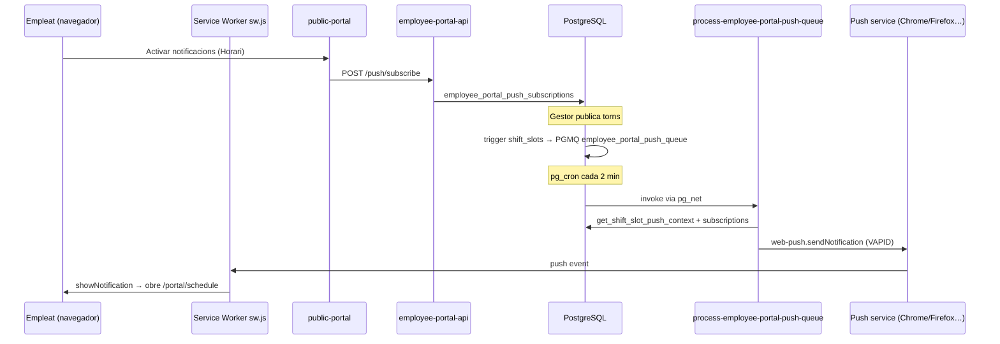

# Notificacions push del portal d'empleat

Aquest document explica com funcionen les **notificacions Web Push** del portal d'empleat (`public-portal`): per a què serveixen, com s'envien, què és el paquet `web-push`, com es configura i **en què es diferencien de FCM / OneSignal** (que el projecte usa en altres contextos).

> **Estat (2026-07):** implementat al codi (EP9 torns + WS-B recordatoris fitxatge). Smoke local: [`DEV_RUNBOOK.md`](../../DEV_RUNBOOK.md) § «Work Status Fase B (WS-B6)». Cal VAPID per prova real al navegador.

---

## Per a què serveixen

Quan un gestor **publica o modifica torns** (`shift_slots`) d'un empleat, el portal pot avisar-lo al mòbil o navegador sense que obri l'app:

| Esdeveniment | Missatge (CA) | Quan es dispara |
|--------------|---------------|-----------------|
| **assigned** | «Nou torn assignat» | Slot passa a `published` o s'assigna a l'empleat |
| **changed** | «El teu torn ha canviat» | Canvi de data, hora o plantilla en un slot publicat |
| **cancelled** | «Torn cancel·lat» | Slot publicat → `cancelled`, o reassignació a un altre empleat |

L'empleat ha d'**optar-in** explícitament des de **Horari** (`PortalPushOptIn`). Sense subscripció, no s'encua cap missatge.

**Fora d'abast d'aquest flux (EP9 torns):**

- Recordatoris de fitxatge — implementat via [`plan-work-status-push.md`](../../plans/checkin/plan-work-status-push.md) (WS-B1–B3). Cal activar a **Configuració → Control horari → Recordatoris push** (`attendance_punch_reminders.enabled`), subscripció push de l'empleat i VAPID al servidor.
- Absències pendents al gestor, etc.
- Push als managers del tenant-portal (previst via motor de notificacions / OneSignal — veure [`docs/plans/notificacions/`](../plans/notificacions/README.md)).

---

## FCM vs Web Push vs OneSignal

| Tecnologia | On s'usa al projecte | Portal empleat |
|------------|----------------------|----------------|
| **FCM** (Firebase Cloud Messaging) | Planificat per apps natives / alguns fluxos futurs | **No** |
| **OneSignal** | Motor de notificacions tenant (in-app, push app) | **No** |
| **Web Push + VAPID** | **Portal empleat** (PWA / navegador) | **Sí** |

El portal d'empleat és una **web app** (sense compte `auth.users`, sense app store). El estàndard és [**Web Push**](https://www.w3.org/TR/push-api/) amb claus **VAPID**: el navegador subscriu un `endpoint` únic i el servidor envia payloads signats amb la clau privada.

No cal compte Firebase ni SDK FCM al client. El paquet **`web-push`** (Node/Deno) parla directament amb els push services de Chrome (FCM com a *transport* del navegador), Firefox, Edge, etc. — però **tu no configures FCM**; només VAPID.

---

## Flux tècnic (de punta a punta)



### Components

| Capa | Fitxer / recurs |
|------|-----------------|
| Opt-in UI | `apps/public-portal/.../PortalPushOptIn.tsx` |
| Service worker | `apps/public-portal/public/sw.js` |
| Subscripció API | `POST /portal/api/push/subscribe` → Edge `push/subscribe` |
| Emmagatzematge | `data.employee_portal_push_subscriptions` |
| Trigger | `trg_shift_slots_employee_portal_push` sobre `data.shift_slots` |
| Cua | PGMQ `employee_portal_push_queue` |
| Worker | `supabase/functions/process-employee-portal-push-queue/` |
| Enviament | `supabase/functions/_shared/employee-portal/web-push-sender.ts` |
| Textos notificació | `shift-push-content.ts` (CA per defecte) |
| Migració SQL | `supabase/migrations/20260831000001_employee_portal_shift_push.sql` |

---

## Què és el paquet `web-push`

[`web-push`](https://github.com/web-push-libs/web-push) és una llibreria **del costat servidor** que implementa el protocol [RFC 8030](https://datatracker.ietf.org/doc/html/rfc8030) (Web Push):

1. Genera headers de signatura **VAPID** (identifica el teu servidor davant del push service).
2. Xifra el payload amb les claus `p256dh` + `auth` de la subscripció del navegador.
3. Fa `POST` a l'`endpoint` que el navegador va registrar (p.ex. `https://fcm.googleapis.com/fcm/send/...` en Chrome — és detall intern del navegador).

Al repo s'importa des de Deno:

```json
// supabase/functions/deno.json
"web-push": "npm:web-push@3"
```

**No s'executa al navegador** — només a l'Edge Function worker.

---

## Configuració

### 1. Generar claus VAPID (una vegada per entorn)

```bash
npx web-push generate-vapid-keys
```

Sortida:

- **Public Key** → client (subscripció) + variable `EMPLOYEE_PORTAL_VAPID_PUBLIC_KEY`
- **Private Key** → **només servidor** → `EMPLOYEE_PORTAL_VAPID_PRIVATE_KEY`

### 2. Variables d'entorn (Edge Functions)

| Variable | Obligatori | Descripció |
|----------|------------|------------|
| `EMPLOYEE_PORTAL_VAPID_PUBLIC_KEY` | Sí (per enviar) | Clau pública VAPID |
| `EMPLOYEE_PORTAL_VAPID_PRIVATE_KEY` | Sí (per enviar) | Clau privada VAPID — **secret** |
| `EMPLOYEE_PORTAL_VAPID_SUBJECT` | Recomanat | Contacte del emissor, p.ex. `mailto:rrhh@empresa.com` |

**Local:** `supabase/functions/.env.local` (veure comentaris al fitxer).

**Staging / prod:** Secrets del projecte Supabase:

```bash
supabase secrets set EMPLOYEE_PORTAL_VAPID_PUBLIC_KEY=... --project-ref <ref>
supabase secrets set EMPLOYEE_PORTAL_VAPID_PRIVATE_KEY=... --project-ref <ref>
supabase secrets set EMPLOYEE_PORTAL_VAPID_SUBJECT=mailto:rrhh@empresa.com --project-ref <ref>
```

Reinicia / redesplega les Edge Functions després de canviar secrets.

### 3. Comportament sense VAPID

- **Opt-in UI:** amagada (`fetchPortalVapidPublicKey` retorna `enabled: false`).
- **Worker:** processa la cua però **no envia** (log `VAPID not configured — skipping`); no falla la planificació de torns.

### 4. Cron i pg_net

El worker s'invoca cada **2 minuts** via `pg_cron` → `data.invoke_employee_portal_push_worker()` → `pg_net` HTTP POST al worker.

Requereix extensions `pg_cron`, `pg_net` i secrets Vault `app_supabase_url` + `app_service_role_key` (mateix patró que `process-attendance-queue`).

---

## Prova manual (quan vulgueu activar-ho)

1. Configurar VAPID (secció anterior).
2. `supabase functions serve --env-file supabase/functions/.env.local` (inclou el worker).
3. Portal empleat → **Horari** → «Activar notificacions» (acceptar permís del navegador).
4. Tenant-portal → assignar torns i **publicar setmana** (`publish_shifts`).
5. Invocar worker (o esperar cron):

```bash
curl -X POST http://127.0.0.1:54321/functions/v1/process-employee-portal-push-queue \
  -H "Authorization: Bearer <SERVICE_ROLE_KEY>" \
  -H "Content-Type: application/json" \
  -d '{"batch_size": 10}'
```

6. Hauria d'aparèixer una notificació del sistema; en clicar, obre `/portal/schedule`.

---

## Limitacions conegudes

| Tema | Detall |
|------|--------|
| **iOS Safari** | Web Push només en PWA «Afegir a pantalla d'inici» (iOS 16.4+). |
| **HTTPS** | En producció cal HTTPS (localhost OK en dev). |
| **Subscripcions caducades** | Respostes 404/410 → esborrat automàtic de `employee_portal_push_subscriptions`. |
| **Idioma** | Textos de notificació en català al worker; localització futura si cal. |
| **Draft vs published** | Només torns **`published`** generen push; esborranys de planificació no. |

---

## Referències

- Pla operatiu: [`docs/plans/checkin/plan-employee-portal.md`](../../plans/checkin/plan-employee-portal.md) (EP9)
- Arquitectura portal: [`docs/product-design/18-employee-portal-architecture.md`](../../product-design/18-employee-portal-architecture.md)
- Motor notificacions tenant (OneSignal/FCM — **altre canal**): [`docs/plans/notificacions/`](../../plans/notificacions/)


## Funcionen en local les notificacions?

**Ara mateix, no** — al teu entorn local no funcionen perquè les claus VAPID no estan configurades.

A `supabase/functions/.env.local` només hi ha els comentaris; les variables estan buides/comentades:

```
# EMPLOYEE_PORTAL_VAPID_PUBLIC_KEY=
# EMPLOYEE_PORTAL_VAPID_PRIVATE_KEY=
```

Sense elles passa això:
- **Horari:** no surt el bloc «Activar notificacions» (`enabled: false`).
- **Worker:** processa la cua però **no envia** res (log `VAPID not configured — skipping`).
- El **trigger** de torns i la **cua** sí que funcionen; només falta l’últim pas d’enviament.

---

### Poden funcionar en local?

**Sí**, localhost és compatible amb Web Push (Chrome/Edge/Firefox). Segueix el checklist complet a [`DEV_RUNBOOK.md`](../../DEV_RUNBOOK.md) (secció **Work Status Fase B — WS-B6**), que cobreix:

1. Generar claus VAPID (`npx web-push generate-vapid-keys`) i omplir `supabase/functions/.env.local`
2. Activar recordatoris al tenant (`attendance_punch_reminders.enabled`)
3. Opt-in des de **Fitxatge** o **Horari** al portal
4. Scan manual + worker manual (substitueixen pg_cron local)

Resum ràpid del worker:

```bash
curl -X POST http://127.0.0.1:54321/functions/v1/scan-employee-portal-punch-reminders \
  -H "Authorization: Bearer <SERVICE_ROLE_KEY>" \
  -H "Content-Type: application/json" \
  -d '{}'

curl -X POST http://127.0.0.1:54321/functions/v1/process-employee-portal-push-queue \
  -H "Authorization: Bearer <SERVICE_ROLE_KEY>" \
  -H "Content-Type: application/json" \
  -d '{"batch_size": 10}'
```

---

### Resum

| Peça | Local ara |
|------|-----------|
| Codi (trigger, cua, worker, SW) | ✅ |
| Claus VAPID | ❌ (no configurades) |
| UI opt-in | ❌ (amagada) |
| Enviament real | ❌ |
| Cron cada 2 min | ⚠️ potser no (pg_net/Vault); curl manual sí |

Si vols provar-les en local, el pas que falta és configurar VAPID i reiniciar les Edge Functions. Ho detallem a [`docs/help/employee-portal/notificacions-push.md`](docs/help/employee-portal/notificacions-push.md).