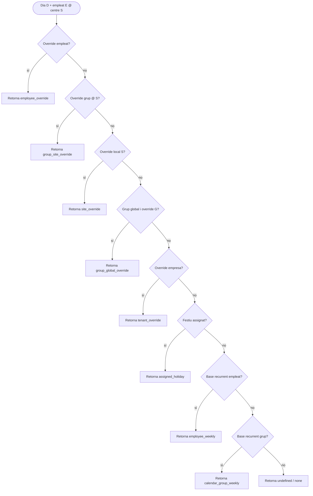

# Calendaris laborals i cascada de resolució

Aquest document descriu com funciona el sistema de calendaris laborals a Pimed: capes d'override, grups de calendari, festius assignats i **com es calcula el tipus de jornada i l'horari esperat d'un dia concret**.

## Visió general

Cada dia de l'any es resol a un **tipus de jornada**:

| Tipus (`day_type`) | Significat | Minuts planificats |
|--------------------|------------|-------------------|
| **`work`** | Dia de treball amb un o més intervals horaris | Suma dels `work_intervals` |
| **`holiday`** | Dia no laborable (festiu oficial, de empresa o marcat manualment) | 0 |
| **`vacation`** | Vacances / tancament col·lectiu | 0 |
| **`leave`** | Permís / absència al calendari de l'empleat (només override individual) | 0 |
| **`undefined`** | Cap capa no ha definit el dia | 0 |

La resolució combina diverses fonts. **La capa més específica guanya** sobre les més generals: en trobar la primera capa amb dades per aquella data, el motor **atura la cerca** i retorna el resultat.

## On s'edita cada capa

| Pestanya / pantalla | Què edita |
|---------------------|-----------|
| **Planificació → Calendari** (sense local) | Override d'empresa (tenant) |
| **Planificació → Calendari** (amb local seleccionat al menú) | Override del centre / local |
| **Planificació → Festius** | Calendaris de festius oficials assignats al tenant o local |
| **Planificació → Grups** | Overrides del grup de calendari (patró comú o ajust per local) |
| **Empleat → Calendari laboral** | Override individual de l'empleat |

---

## Còmput d'un dia concret

Aquesta és la part central: **què passa quan el sistema ha de dir què és el dia 15 de maig per a un empleat concret** (o com es pinta aquell dia al calendari de planificació).

### On s'executa

| Context | Implementació |
|---------|---------------|
| **UI** (graella de calendari, panell «cascada de valors») | `buildDayMap()` a `LaborCalendarGrid.tsx` |
| **API planificador** (bulk per empleats i dates) | `data.resolve_schedule_planner_day()` |
| **Assistència / fitxatges** (minuts esperats, tipus de dia legal) | `api.resolve_work_day()` → crida la mateixa cascada laboral, amb capes addicionals a dalt |

Frontend i backend comparteixen **el mateix ordre de prioritat** (comentat explícitament a la migració del planificador).

### Entrades del còmput

Per resoldre el dia `D`:

| Entrada | Origen |
|---------|--------|
| `tenant_id` | Tenant actiu |
| `context_site_id` | Centre de l'empleat, o centre seleccionat al planificador |
| `employee_id` | Empleat consultat (obligatori a `resolve_work_day`; opcional a la graella de grup) |
| `calendar_group_id` | `employees.calendar_group_id` (màxim un grup per empleat) |
| `calendar_group_site_id` | `calendar_groups.site_id` — si no és `NULL`, el grup és **de local** |
| Festiu assignat | Calendaris de festius del tenant + del centre, menys exclusions del centre |

Els **overrides manuals** viuen a `labor_calendar_overrides`, amb clau única `(tenant_id, site_id, group_id, employee_id, calendar_date)`.

### Ordre d'avaluació (de més a menys prioritat)

El motor recorre les capes **d'a dalt cap avall**. La primera que té registre per al dia `D` **guanya**:

```
┌─────────────────────────────────────────────────────────────┐
│  1. Override empleat     (employee_id = E, data = D)        │
├─────────────────────────────────────────────────────────────┤
│  2. Override grup @local (group_id = G, site_id = centre)   │
├─────────────────────────────────────────────────────────────┤
│  3. Override local       (site_id = centre, sense grup)     │
├─────────────────────────────────────────────────────────────┤
│  4. Override grup global (group_id = G, site_id = NULL)     │  ← només si el grup NO és de local
├─────────────────────────────────────────────────────────────┤
│  5. Override empresa     (tot NULL excepte tenant + data)   │
├─────────────────────────────────────────────────────────────┤
│  6. Festiu assignat     (calendari importat, sense override)│
├─────────────────────────────────────────────────────────────┤
│  7. Base recurrent empleat (employee_weekly_intervals, DOW) │  ← ADR-0003
├─────────────────────────────────────────────────────────────┤
│  8. Base recurrent grup    (calendar_group_weekly_intervals)│  ← ADR-0003
├─────────────────────────────────────────────────────────────┤
│  9. Indefinit            (cap capa anterior)                │
└─────────────────────────────────────────────────────────────┘
```

En pseudocodi:

```
per al dia D (dia de la setmana W) i empleat E amb centre S i grup G:

  si existeix override d'empleat (E, D)           → retorna empleat
  sinó si existeix override de grup (G, S, D)     → retorna grup@local
  sinó si existeix override de local (S, D)         → retorna local
  sinó si G és global i existeix override (G, D)   → retorna grup patró comú
  sinó si existeix override d'empresa (D)          → retorna empresa
  sinó si D és festiu assignat a S                → retorna festiu
  sinó si existeix patró recurrent d'empleat (E, W) → retorna base recurrent empleat
  sinó si existeix patró recurrent de grup (G, W)   → retorna base recurrent grup
  sinó                                              → indefinit
```

### Sortida d'una capa guanyadora

Cada capa aporta el mateix paquet de dades:

| Camp | Descripció |
|------|------------|
| `day_type` | `work`, `holiday`, `vacation`, `leave` o `undefined` |
| `day_name` | Etiqueta visible (nom del festiu, motiu de vacances, etc.) |
| `work_intervals` | JSON `[{start:"09:00",end:"14:00"},…]` — buit si no és laboral |
| `planned_minutes` | Minuts de treball planificats (0 si no és `work`) |
| `source` | Identificador de la capa guanyadora (vegeu taula següent) |

Valors de `source` (alineats amb codi i UI):

| `source` | Capa |
|----------|------|
| `employee_override` | Override individual |
| `group_site_override` | Grup — excepció en un centre |
| `site_override` | Override del centre |
| `group_global_override` | Grup — patró comú (tota l'empresa) |
| `tenant_override` | Override d'empresa |
| `assigned_holiday` | Festiu dels calendaris assignats |
| `employee_weekly` | Base recurrent setmanal de l'empleat (ADR-0003) |
| `calendar_group_weekly` | Base recurrent setmanal del grup (ADR-0003) |
| `none` | Cap capa (dia indefinit) |

### Com es calculen els minuts planificats

Només quan `day_type = 'work'`:

1. Es llegeixen `work_intervals` (o es construeixen des de `work_start` / `work_end` legacy).
2. Cada interval `{start, end}` suma minuts; si `end ≤ start`, es tracta com a **torn de nit** (l'interval acaba l'endemà).
3. La suma és `planned_minutes` (funció `data.labor_planned_minutes`).

Per a assistència, `api.resolve_work_day` exposa a més `shift_start_time`, `shift_end_time` i `spans_midnight` derivats del primer i darrer interval.

### Festius assignats (capa base)

Abans d'arribar al festiu com a resultat final, el sistema consulta `data.planner_site_holidays`:

1. Calendaris assignats al **tenant** (`tenant_holiday_calendar_assignments`).
2. **UNION** amb calendaris assignats al **centre** (`site_holiday_calendar_assignments`).
3. Es llegeixen les dates de `holidays` dins el rang.
4. Es resten les **exclusions** del centre (`site_holiday_exclusions`).

Un festiu assignat només aplica si **cap override de capes 1–5** no l'ha substituït (p. ex. treball en festiu per guàrdia). El festiu assignat també guanya a la base recurrent setmanal (capes 7–8): un dilluns laborable al patró habitual que caigui en festiu oficial es resol com a festiu, no com a laborable.

### Base recurrent setmanal (ADR-0003)

Quan cap override puntual ni cap festiu defineixen el dia `D`, el motor consulta l'**horari habitual per dia de la setmana**:

1. **Base recurrent de l'empleat** (`employee_weekly_intervals`) — patró individual, si n'hi ha. Per sobre del grup, com un "override recurrent".
2. **Base recurrent del grup** (`calendar_group_weekly_intervals`) — patró del grup de calendari assignat a l'empleat.

Cada patró es defineix per **dia de la setmana** (dilluns…diumenge) amb un `day_type` (`work` / `non_working`) i, si és laborable, uns `work_intervals`. Té una data de vigència (`valid_from`) — es pot canviar l'horari habitual a partir d'una data futura sense tocar dies passats ni esborrar historial, i **sense** haver de regenerar milers de files.

Diferència clau respecte als overrides puntuals: aquesta capa es **consulta en directe** cada vegada (no es materialitza cap fila per dia). Si canvieu el patró d'un grup, l'efecte és immediat per a tots els dies futurs sense generar cap escriptura massiva.

**On s'edita:** secció «Patró setmanal recurrent» a la pestanya **Grups** (per grup) i secció «Patró setmanal individual» a la fitxa d'empleat, pestanya **Calendari laboral** (per empleat).

### Grups de local vs globals

| Tipus de grup | `calendar_groups.site_id` | Efecte a la cascada |
|---------------|---------------------------|---------------------|
| **Global** | `NULL` | Participa en les capes 4 (patró comú) i 2 (ajust @local) |
| **De local** | UUID del centre | **Salta la capa 4**; només aplica capa 2 si hi ha override de grup amb `site_id` |

Cada empleat té com a màxim un `calendar_group_id`. No es combinen dos grups.

### Diagrama de flux



### Panell «Cascada de valors» (UI)

En seleccionar **un sol dia** al calendari, la UI mostra **totes les capes** en ordre invers (de la base al cim): festiu assignat → empresa → grup patró → local → grup @local → empleat.

- Cada fila mostra el valor que **aquella capa proposaria** (o «No aplicat»).
- La fila amb **«Aplica»** és la guanyadora — coincideix amb `source` del dia resolt.
- Això permet entendre per què un dia és «vacances» tot i tenir festiu assignat, o laboral tot i ser festiu oficial.

---

## Cascada de resolució (resum)

Ordre de **menys a més prioritat** (la de baix és la base; la de dalt preval en el còmput):

```
1. Base recurrent grup   (calendar_group_weekly_intervals, per dia de la setmana)
2. Base recurrent empleat (employee_weekly_intervals, per dia de la setmana)
3. Festiu assignat       (calendari de festius importat)
4. Override empresa      (tenant)
5. Grup — patró comú     (només grups globals)
6. Override local        (centre / site)
7. Grup — ajust local    (excepció del grup per a un centre)
8. Override empleat      (individual)
```

Aquesta llista és la **mateixa cascada** que la secció anterior, vista des de la base cap amunt (com es mostra al panell UI). L'algoritme de còmput recorre les capes **en ordre invers** (empleat primer).

### Per què aquest ordre

- **Festius com a base**: el calendari de festius marca els dies festius oficials. Capes superiors poden definir treball en un festiu (p. ex. vigilant, servei de guàrdia).
- **Local per sobre del patró comú del grup**: un tancament o vacances del centre afecten tots els empleats del centre, llevat d'un ajust específic del grup o de l'empleat.
- **Ajust de grup per local per sobre del local**: el grup pot treballar un dia que el centre marca com a vacances (torn especial, servei mínim).
- **Override d'empleat sempre guanya**: útil per excepcions puntuals (permís, formació, teletreball).

---

## Resolució per assistència (`api.resolve_work_day`)

Per al **control horari** (minuts esperats, dashboard, recomputació de jornades), la cascada del calendari laboral s'embolica amb **dues capes prèvies** encara més prioritàries:

```
0a. Absència aprovada (employee_absences, status = approved)
    → day_type = absence; es consulta el calendari només per calcular hores de referència

0b. Override legacy (employee_day_overrides)
    → force_holiday: festiu immediat
    → force_work: ignora festius assignats i continua la cascada laboral
```

Després s'executa `resolve_labor_calendar_for_employee` → `resolve_schedule_planner_day` (mateix ordre que l'apartat «Còmput d'un dia concret»).

Mapatge a la resposta d'assistència:

| `labor_day_type` | `day_type` (API) | `expected_minutes` |
|------------------|------------------|-------------------|
| `work` | `working` | `planned_minutes` |
| `holiday` | `holiday` o `half_holiday` | 0 |
| `vacation`, `leave` | `non_working` | 0 |
| `undefined` | `unknown` | 0 |

**Nota (EX-03.2-bis / ADR-0003, supersedeix ADR-0002):** Les taules `work_schedules`, `work_schedule_intervals` i `employee_schedule_assignments` (plantilles setmanals antigues) s'han **eliminat**. La font de veritat setmanal és ara la **base recurrent** (`calendar_group_weekly_intervals` / `employee_weekly_intervals`), consultada en directe pel resolver — vegeu «Base recurrent setmanal (ADR-0003)» més amunt. Si un dia queda `undefined` fins i tot després de consultar la base recurrent, `resolve_work_day` retorna `unknown` amb 0 minuts esperats. `api.apply_weekly_pattern_to_calendar` es manté només per **excepcions temporals per rang de dates** (no per l'horari habitual).

---

## Grups globals vs grups de local

| Tipus de grup | `calendar_groups.site_id` | Comportament |
|---------------|---------------------------|--------------|
| **Grup global** | `NULL` | Patró comú per a tots els centres. Opcionalment, **excepcions en un centre** (mateix grup, override amb `site_id`). |
| **Grup de local** | UUID del centre | Només aplica als empleats d'aquest centre. Useu-lo quan l'horari és propi d'un centre. |

Per a un empleat amb **grup de local** assignat, la capa «patró comú de grup» no s'aplica.

### Patró comú vs excepció en un centre (grups globals)

| Mode | Quan usar-lo |
|------|----------------|
| **Patró comú** | Horari per defecte del grup a tots els centres. |
| **Excepció en un centre** | El mateix grup a diversos centres, però un centre necessita un dia diferent. Si cada centre té horari propi, creeu un **grup de local**. |

## Grups de calendari (UI)

Ruta: **Control horari → Planificació → Grups** (`/attendance-mgmt/calendar`).

### Crear un grup

En crear un grup cal triar **on aplica**:

- **Tota l'empresa** → grup global; el patró es comparteix entre centres.
- **Un local concret** → grup lligat a un centre; només visible/assignable als empleats d'aquest centre.

### Editar el calendari d'un grup

Quan seleccioneu un grup a la llista:

1. **Grup de local**: l'àmbit d'edició és fix (aquell centre).
2. **Grup global**: podeu triar el **què editeu**:
   - **Patró comú** — overrides amb `site_id = null`.
   - **Excepció en un centre** — trieu el centre; només per al mateix grup assignat transversalment (vegeu secció anterior).

L'àmbit d'edició **no depèn** del selector de local del menú lateral; és un control propi de la pestanya Grups.

### Vistes del calendari de grup

| Vista | Descripció |
|-------|------------|
| **Vista resolta** | Com veurà el dia un empleat del grup (cascada completa). Mostra vacances del centre sota el patró comú, etc. |
| **Només overrides** | Destaca (anell) els dies amb override directe del grup a l'àmbit actual; la resta apareix atenuada per veure la herència. |

## Calendari d'empleat

Ruta: **Empleats → [empleat] → Calendari laboral** (`?tab=work_calendar`).

- Es resol la cascada completa amb el centre de l'empleat, el seu grup assignat (si en té) i els seus overrides individuals.
- Les modificacions des d'aquesta pantalla **només afecten l'empleat** (`employee_id` a `labor_calendar_overrides`).
- L'assignació de grup es fa al selector «Grup de calendari» (un sol grup per empleat).

## Model de dades (referència)

### `calendar_groups`

| Camp | Descripció |
|------|------------|
| `site_id = NULL` | Grup global |
| `site_id = UUID` | Grup de local |

### `labor_calendar_overrides`

Clau única: `(tenant_id, site_id, group_id, employee_id, calendar_date)`.

| Àmbit | `site_id` | `group_id` | `employee_id` |
|-------|-----------|------------|---------------|
| Empresa | `NULL` | `NULL` | `NULL` |
| Local | centre | `NULL` | `NULL` |
| Grup patró comú | `NULL` | grup | `NULL` |
| Grup ajust local | centre | grup | `NULL` |
| Empleat | `NULL` | `NULL` | empleat |

### Festius assignats

Els festius provenen de calendaris importats (pestanya Festius) i s'emmagatzemen per data a la resolució. No són una fila d'override manual; es combinen amb la cascada com a capa base.

### `calendar_group_weekly_intervals` / `employee_weekly_intervals` (ADR-0003)

| Camp | Descripció |
|------|------------|
| `group_id` / `employee_id` | Entitat propietària del patró |
| `day_of_week` | 0 = diumenge … 6 = dissabte (`EXTRACT(DOW FROM date)`) |
| `day_type` | `work` \| `non_working` |
| `work_intervals` | JSON de franges, si `day_type = 'work'` |
| `valid_from` / `valid_to` | Vigència temporal (SCD tipus 2); permet canviar l'horari a partir d'una data sense esborrar historial |

No hi ha materialització per data: la cascada calcula `day_of_week` de `D` i consulta directament la fila vigent per aquell dia de la setmana.

## Exemples

### Vacances del centre vs patró del grup

- Grup global «Oficina»: dilluns–divendres laboral (patró comú).
- Centre Barcelona: 15 d'agost marcat com a vacances (override local).
- **Resultat** per a empleats del grup a Barcelona: 15 d'agost = vacances (el local preval sobre el patró comú).

### Vigilant en festiu

- 25 de desembre: festiu assignat.
- Grup «Seguretat», ajust per local: 25 desembre = laboral 08:00–20:00.
- **Resultat**: laboral (l'ajust de grup per local preval sobre el festiu assignat).

### Override individual

- Qualsevol dia definit a nivell d'empleat **sempre guanya** sobre grup, local i empresa.

## Fitxers rellevants al codi

| Fitxer | Responsabilitat |
|--------|-----------------|
| `apps/tenant-portal/src/features/attendance/components/LaborCalendarGrid.tsx` | `buildDayMap()`, panell cascada, UI del calendari |
| `apps/tenant-portal/src/features/attendance/components/EmployeeLaborCalendarView.tsx` | Calendari resolt per empleat |
| `apps/tenant-portal/src/features/attendance/components/WeeklyRecurringBaseEditor.tsx` | Editor de la base recurrent setmanal (grup i empleat) — ADR-0003 |
| `apps/tenant-portal/src/features/attendance/pages/PlanificacioPage.tsx` | Pestanya Grups, àmbit d'edició |
| `apps/tenant-portal/src/features/employees/components/EmployeeDetailPage.tsx` | Calendari laboral de l'empleat |
| `supabase/migrations/20260729000001_schedule_planner_rpc.sql` | `resolve_schedule_planner_day` original (pre-ADR-0003), `planner_site_holidays` |
| `supabase/migrations/20261017000001_weekly_recurring_base_adr0003.sql` | Taules `calendar_group_weekly_intervals`/`employee_weekly_intervals`, RPCs de gestió, i redefinició de `resolve_schedule_planner_day` amb les capes 7–8 |
| `supabase/migrations/20261017000002_drop_work_schedules_adr0003.sql` | Eliminació de `work_schedules`/`work_schedule_intervals`/`employee_schedule_assignments` |
| `supabase/migrations/20260730000001_resolve_work_day_labor_calendar.sql` | `api.resolve_work_day`, `resolve_labor_calendar_for_employee` |
| `supabase/migrations/20260728000009_calendar_groups_phase_b.sql` | Esquema de grups i overrides |

## Canvis recents (2026)

- **ADR-0003 (EX-03.2-bis):** nova base recurrent setmanal viva per grup i empleat (`calendar_group_weekly_intervals` / `employee_weekly_intervals`), consultada per dia de la setmana sense materialitzar overrides. Elimina `work_schedules`/`work_schedule_intervals`/`employee_schedule_assignments` (supersedeix ADR-0002).
- Cascada reordenada: el **local preval sobre el patró comú del grup**; l'**excepció de grup per centre** pot prevaler sobre el local.
- Àmbit d'edició de grups **desacoblat** del selector de local del menú, amb text d'ajuda clar (patró comú vs excepció en un centre).
- Panell d'edició fix a la **dreta**; selecció amb **Ctrl+clic** per dies no consecutius.
- **Eliminació de grups** amb reassignació o desassignació d'empleats.
