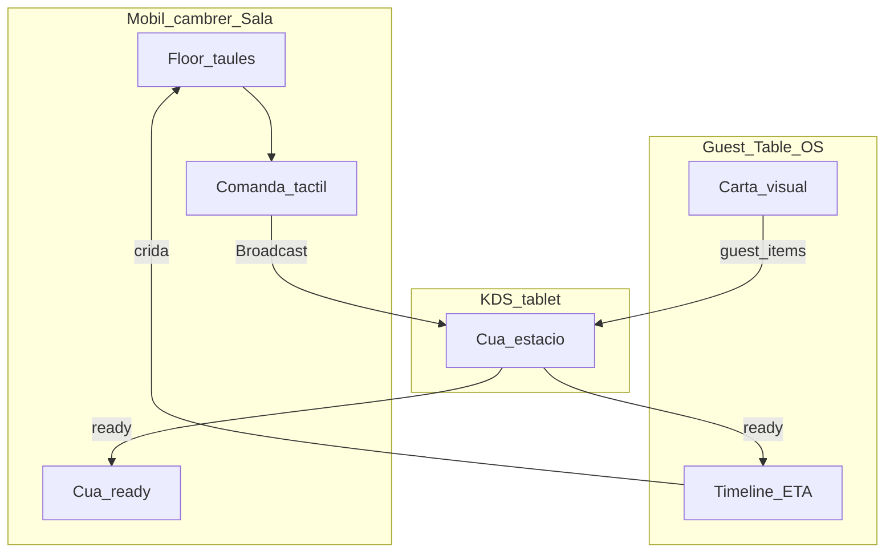

# FSR — Fluxos i superfícies

> Part del pack [`README.md`](./README.md). UX guest detallada: [05-guest-table-os-ux.md](./05-guest-table-os-ux.md). Seguretat: [04-security-and-realtime.md](./04-security-and-realtime.md).

## Mapa de superfícies

| Actor | App | Superfície |
|-------|-----|------------|
| Cambrer | `apps/public-portal` employee portal | Mode **Sala** (mòbil web) |
| Cuina | public-portal (kiosk device) | **KDS** tablet |
| Client | public-portal | **Guest Table OS** `/t/[token]` |
| Maître / owner | `apps/tenant-portal` | Carta, taules, reserves, devices |
| Públic web | public-portal | Widget reserva + bloc carta (Fase 4B) |

---

## Sala — web mòbil del cambrer

**Decisió:** control del servei des del **mòbil via web**. No app nativa al MVP. Add to Home Screen.

Base: `apps/public-portal/features/employee-portal` (PIN/token, mòbil-first) + rutes Edge `employee_portal_dining_*` + gate `site_id`. Nav item **Sala** a `portalNavConfig`.

### Pantalles

| Pantalla | Feina amb una mà |
|----------|------------------|
| **Floor** | Graella/mapa de taules amb color: lliure / sessió open / esperant cuina / plat llest / crida |
| **Taula** | Party size, obrir/tancar sessió, QR de sessió, compte actual |
| **Comanda** | Carta tàctil, notes, al·lèrgens, enviar tongada / hold / **fire** |
| **Ready** | Cua d'items `ready`; tap → `served` |
| **Crides** | Inbox `guest_call` amb taula + timestamp |

### UX no negociable

- Thumb-zone: accions primàries a baix.
- Feedback discret quan un plat de *les seves* taules passa a `ready`.
- Poll 5s si Broadcast falla.
- **No** és TPV, split bill ni desktop-first.

---

## KDS — cuina

- Dispositiu `ops_devices` kind `kitchen_display` (stack tipus attendance-station: cookie + BFF + Edge).
- Cua per `station_filter`.
- Tap: `pending` → `preparing` → `ready`.
- So/alerta en item nou.
- Poll fallback 5s.

---

## Guest Table OS

Ruta dedicada (p.ex. `/t/[token]`). Disseny propi — veure [05-guest-table-os-ux.md](./05-guest-table-os-ux.md).

Capacitats MVP: carta filtrada, afegir plats (`channel=guest`), timeline + ETA, toast `ready`, crida cambrer.

---

## QR i sessió

1. Cambrer/maître **obre sessió** a Sala (`party_size`).
2. Sistema mostra **QR de sessió** (token rotatiu, TTL = servei).
3. Guest escaneja → cookie/sessió → Table OS.
4. QR físic de taula (`asset_tag`) només uneix a sessió `open` o mostra “espera cambrer”.
5. Tancar sessió = deixa d'acceptar comandes guest; historial queda per audit.

---

## Fluxos operatius mínims

| Flux | Comportament |
|------|----------------|
| Tongades / fire | Cambrer envia entrants; mains en hold fins `fire` |
| 86 | `menu_items.availability = sold_out` → desapareix de guest/Sala |
| Cancel | Abans de `preparing`: cambrer/guest; després: cuina/manager |
| Multi-guest | Diversos mòbils, mateixa sessió (token compartit / regenerable) |
| Crida cambrer | Event `guest_call` → inbox Sala + confirmació al guest |

---

## Maître (tenant-portal)

- CRUD carta (`menu_items`) i taules (assets).
- Parellament devices KDS.
- Calendari de reserves (Fase 3).
- Vista sessions obertes del servei (opcional Fase 1–2).

---

## Web pública (Fase 4B)

Widgets mínims sobre portal actual (sense esperar TCMS-2/Puck):

- Reserva online → `reservations` + availability RPC.
- Bloc carta / horaris llegint `menu_items` + settings d'horari.
