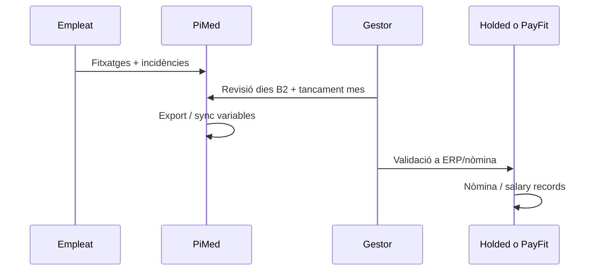

# Estudi d'integració Holded i PayFit

> Com la nostra app i els nostres clients poden treure més partit de **PiMed + Holded** o **PiMed + PayFit**: on complementem, on competim i com generar valor afegit sense convertir-nos en un ERP de nòmina.

**Data:** 2026-07-02  
**Estat:** estudi estratègic (sense compromís d'implementació)

---

## 1. Resum executiu

| Pregunta | Resposta curta |
|----------|----------------|
| Hem de «integrar» Holded i PayFit? | **Sí, però com a canals de sortida/entrada de dades laborals**, no com a replicar el seu producte. |
| Substituïm Holded o PayFit? | **No.** El posicionament oficial del producte és: *«No som un ERP fiscal/comptable complet. Integrem.»* |
| On guanyem? | **Operacions de camp**, control horari amb evidència, calendari laboral en cascada, context operatiu (contactes, projectes, documents, signatura). |
| On perdem si no integrem? | Doble entrada, clients que trien «tot en un» (Holded/PayFit) i no veuen per què pagar dues subscripcions. |
| Primera acció recomanada | **Pont CSV/variables** (ja tenim base amb D3.1) + **mapping d'empleats** abans que API profunda. |
| PayFit API com a partner | **Bloquejada temporalment** per a nous partners (2025–2026); clients existents poden usar API key pròpia. |

---

## 2. Què és la nostra app (referència ràpida)

PiMed és una plataforma **multi-tenant** orientada a **autònoms i microempreses** (4–20 persones), amb arquetips sectorials (`field_service`, `practice`, `hospitality`, `workshop_maker`…).

### 2.1 El que ja fem bé (i ells no prioritzen igual)

| Capacitat | Detall | Rellevància vs Holded/PayFit |
|-----------|--------|------------------------------|
| **Control horari V1** | Fitxatge IN/OUT offline, geo en cascada, estació, incidències E5, revisió nòmina B2 | **Core del valor** — més profund que el «clock» genèric d'un ERP |
| **Calendari laboral** | Festius, grups, horaris setmanals, `resolve_work_day` | Planificació real del que s'espera treballar (no només registre) |
| **Evidència legal** | `time_punches` append-only, auditoria, export inspecció, tancament mensual + signatura | Inspecció laboral, conflictes, gestoria |
| **CRM operatiu** | Contactes, projectes, timeline 360°, comunicacions | Context del *per què* es treballa (visita, obra, pacient) |
| **Documents i firmes** | DMS, registre mensual signable, portal empleat sense compte | Flux legal del mes, no només «hores» |
| **Mòbil primer** | Punch, geo, cues offline | Target de camp; ERPs sovint són desktop-first |

### 2.2 El que **no** som (i no cal ser)

- Comptabilitat, facturació fiscal, inventari complet, TPV.
- Motor de nòmina (SS, retencions, convenis, nòmines PDF).
- HRIS complet (OKR, recruiting, organigrama avançat).

Això és coherent amb [08-erp-crm-checklist.md](../../product-design/08-erp-crm-checklist.md): **Nòmines → 🔌 integració**.

### 2.3 Públic objectiu típic amb Holded o PayFit

```text
Tier B microempresa
  ├── Ja usa Holded per factures + comptabilitat (+ potser el seu fitxatge)
  ├── O ja usa PayFit per nòmina + absències bàsiques
  └── Vol: menys Excel, menys errors, equip de camp que fitxi bé
```

El client **no** vol configurar tres ERPs; vol que «les hores del taller/clínica/restaurant» arribin sol·les a qui calcula la nòmina.

---

## 3. Holded — què és i com encaixa

### 3.1 Producte Holded (visió integració)

[Holded](https://www.holded.com) és un **ERP cloud per PYMES** (fort a Espanya): facturació, comptabilitat, CRM/projectes, inventari, **equip/RRHH**, fitxatge i **salary records** (variables de nòmina, no motor legal complet com PayFit).

**API pública** ([developers](https://www.holded.com/developers)) — àrees rellevants per a nosaltres:

| Àrea API | Endpoints orientatius | Útil per PiMed |
|----------|----------------------|----------------|
| Employees | CRUD, contracte actiu | Sync màster empleat |
| Employee time tracking | clock-in/out, times, pause | **Solapament directe** amb el nostre mòdul |
| Salary records | variables de nòmina (no nòmina PDF) | **Destí natural** del nostre export agregat |
| Projects / tasks | gestió projectes | Solapament parcial amb `projects` |

Holded té **sandbox** per proves (14 dies) — recomanable només quan el pont de dades estigui definit.

### 3.2 Holded vs nosaltres — matriu

| Dimensió | Holded | PiMed | Relació |
|----------|--------|-------|---------|
| Facturació / comptabilitat | Fort | Fora d'abast | **Complement** — client manté Holded |
| Fitxatge | Sí (API pròpia) | Fort (offline, geo, estació) | **Competència parcial** — hem de ser clarament superiors al camp |
| Calendari laboral legal | Bàsic / horari empresa | Fort (cascada, festius) | **Diferenciació** |
| Variables nòmina | Salary records API | Export agregat (hores extra, IT, absències) | **Complement** — nosaltres originem, Holded rep |
| CRM / projectes | Sí | Sí (operatiu) | Competència lleu; nosaltres guanyem si el flux és «projecte → visita → fitxatge » |
| Inspecció / evidència punch | Limitat | Fort | **Diferenciació** |

### 3.3 Proposta de valor: «PiMed + Holded»

**Per al client:**

> «El teu equip fitxa i treballa des del mòbil amb el calendari real de l'empresa. Les hores i variables del mes passen a Holded sense reescriure Excel. Holded segueix sent el teu ERP de factures i comptabilitat.»

**Valor afegit PiMed:**

1. **Menys fricció al camp** — offline, geo, incidències, portal empleat sense compte.
2. **Menys errors de nòmina** — dies revisats, anomalies visibles, tancament mensual abans d'exportar.
3. **Traçabilitat** — qui va fitxar, on, amb quin horari previst (inspecció).
4. **Operació diària** — mateixa app per contactes, projectes, documents del servei.

**Quan NO vendre PiMed+Holded:**

- Client micro que només vol facturar i ja fitxa dins Holded sense queixes.
- Client que vol un sol login per a tot i no accepta dues subscripcions.

### 3.4 Modes d'integració Holded (per fases)

| Fase | Mode | Esforç | Valor client |
|------|------|--------|--------------|
| **H0** | CSV / plantilla Holded via `payroll_export_profiles` | Baix | Import manual a salary records o Excel intermedi |
| **H1** | Sync empleats (Holded → PiMed o bidireccional) + `external_id` | Mitjà | Elimina alta duplicada |
| **H2** | Push mensual: agregat → `POST /salary-records` | Mitjà-alt | Automatitza variables (HEX, dies, etc.) |
| **H3** | Opcional: no push clock a Holded (evitar doble font de veritat) | — | **Recomanació:** PiMed = font de veritat del temps; Holded només rep variables |

**Decisió arquitectònica clau:** no sincronitzar cada punch en temps real cap a Holded **i** mantenir el nostre registre — triar **una font de veritat del temps** (PiMed) i Holded com a **consumidor de resums**.

---

## 4. PayFit — què és i com encaixa

### 4.1 Producte PayFit

[PayFit](https://payfit.com/es/) és un **SaaS de nòmina i RRHH** per PYMES (FR, ES, UK, IT, DE): càlcul de nòmines, absències, convenis, compliance. Integracions natives amb Personio, Hibob, BambooHR, etc.

**API oberta** ([developers.payfit.io](https://developers.payfit.io)) — punts rellevants:

| Capacitat API | Notes | Útil per PiMed |
|---------------|-------|----------------|
| Collaborators / contracts | Llista, creació (inicialització) | Sync empleats |
| Absences | Llistar, crear, cancel·lar (`time:read/write`) | **Bidireccional** amb el nostre calendari |
| Worked time per contracte | **Principalment FR** (`get_contracts_worked_time`) | Limitat per ES avui |
| Accounting / payroll journal | Export comptable | Menys rellevant (client ja té PayFit) |
| OAuth partners + marketplace | Programa de partners | **Pausat** per noves sol·licituds (2025–2026) |

**Restricció important:** nous partners d'integració PayFit **no s'accepten temporalment**. Els clients PayFit amb pla avançat poden generar **API key pròpia** per automatitzacions internes (no marketplace).

### 4.2 PayFit vs nosaltres — matriu

| Dimensió | PayFit | PiMed | Relació |
|----------|--------|-------|---------|
| Càlcul nòmina / nòmines | Core | No | **Complement** — PayFit calcula |
| Absències i vacances | Fort (workflow nòmina) | Fort (operatiu + IT) | **Sync bidireccional** té sentit |
| Fitxatge / hores reals | No és el focus | Core | **Diferenciació clara** |
| Calendari operatiu / torns | Planificació bàsica | Fort | Nosaltres planifiquem; PayFit valida nòmina |
| Compliance SS / conveni | Core | No | No competir |
| Marketplace / marca | Vol ser hub HR | Som operatius | Partner quan obrin programa |

### 4.3 Proposta de valor: «PiMed + PayFit»

**Per al client:**

> «PayFit calcula la nòmina. PiMed és on l'equip fitxa, demana absències amb context i el gestor tanca el mes amb evidència. Les absències aprovades i les hores extra arriben a PayFit sense tornar a introduir-les.»

**Valor afegit PiMed:**

1. **Captura de temps de qualitat** — geo, offline, estació, discrepàncies.
2. **Tancament mensual operatiu** — revisió per dies, signatura, export abans del tancament PayFit.
3. **Context de negoci** — el mateix empleat en projectes, visites, documents (PayFit no ho fa).
4. **Empleats sense compte** — portal token per fitxar (PayFit no cobreix operació de camp).

**Quan el client ja té PayFit i pregunta «per què PiMed?»:**

| Si diu… | Resposta |
|---------|----------|
| «Ja tinc absències a PayFit» | «Les absències de nòmina queden a PayFit; PiMed connecta el **treball real** (fitxatges, torns, festius) i evita discrepàncies abans de tancar el mes.» |
| «Vull tot en un» | PayFit no és eina de camp ni CRM; o accepten dos productes o no som fit. |
| «Només vull nòmines» | PayFit sol; PiMed no aporta si no hi ha equip que fitxi. |

### 4.4 Modes d'integració PayFit (per fases)

| Fase | Mode | Esforç | Valor client |
|------|------|--------|--------------|
| **P0** | CSV variables / hores (si PayFit importa) o export per gestoria | Baix | Mateix patró que A3/Sage |
| **P1** | Sync collaborators (PayFit → PiMed) per evitar doble alta | Mitjà | Onboarding ràpid |
| **P2** | Push absències PiMed → PayFit (`POST absences`) quan aprovades | Mitjà | Elimina doble entrada vacances/permisos |
| **P2b** | Pull absències PayFit → PiMed (per bloquejar calendari / torns) | Mitjà | Planificació coherent |
| **P3** | Push hores treballades / variables (segons disponibilitat API ES) | Alt | Depèn roadmap PayFit ES |
| **P4** | Partner marketplace PayFit | Alt + gated | Quan reobrin programa |

**Nota ES:** l'endpoint de *worked time* està documentat amb focus FR; cal validar amb compte ES abans de prometre sync d'hores a PayFit Espanya.

---

## 5. Estratègia comuna: complementar i competir amb criteri

### 5.1 Principi «capa operativa»

```text
┌─────────────────────────────────────────────────────────┐
│  Holded / PayFit — sistema de registre econòmic/legal   │
│  (factures, SS, nòmines, absències oficials)              │
└────────────────────────▲────────────────────────────────┘
                         │ variables, absències, empleats
┌────────────────────────┴────────────────────────────────┐
│  PiMed — capa operativa diària                           │
│  fitxatge · calendari · projectes · contactes · docs     │
└─────────────────────────────────────────────────────────┘
                         ▲
                    empleats de camp
```

No competim al **càlcul** de la nòmina. Competeim a la **qualitat de la dada** que alimenta la nòmina i al **dia a dia** de l'empresa.

### 5.2 On competim (i hem de guanyar)

| Àrea | Per què importa |
|------|-----------------|
| Fitxatge mòbil + offline | Holded té API de times; nosaltres hem d'esser millors en UX i fiabilitat |
| Calendari laboral en cascada | Diferenciador vs «fitxatge cec» sense horari previst |
| Revisió prèvia a nòmina | B2, tancament mensual, anomalies — PayFit no ofereix aquest flux operatiu |
| Inspecció / evidència | Export inspecció, trail de punches — valor legal |
| Sector + camp | Contacte, projecte, ubicació client — fora del scope HR pur |

### 5.3 On complementem (i hem de facilitar)

| Àrea | Acció |
|------|--------|
| Alta d'empleats | Import/sync des de Holded o PayFit |
| Variables de mes | Export agregat → salary records / API PayFit |
| Absències oficials | Push aprovades cap a PayFit; opcionalment pull per planificar |
| Comptabilitat | No tocar; enllaç documental «mes tancat» si cal |

### 5.4 Riscos

| Risc | Mitigació |
|------|-----------|
| Doble fitxatge (PiMed + Holded) | Una política clara: «fitxar només a PiMed» |
| Mapping empleat trencat | Taula `external_entity_mappings` per tenant (empleat ↔ id Holded/PayFit) |
| PayFit tanca partners | Prioritzar API key del client + CSV; partner més endavant |
| Holded amplia time tracking | Mantenir diferenciació operativa (E4–E6, portal, inspecció) |
| Client espera nòmina dins PiMed | Messaging clar + integració visible a settings |

---

## 6. Model de dades mínim (proposta independent)

Sense copiar `docs/plans/api/`, el mínim per a **qualsevol** connector Holded/PayFit:

```text
data.tenant_payroll_connectors
  tenant_id, provider ('holded' | 'payfit'), credentials_encrypted,
  config jsonb, is_active, last_sync_at, last_error

data.external_entity_mappings
  tenant_id, provider, entity_type ('employee'),
  internal_id (employees.id), external_id, external_meta jsonb

data.payroll_sync_runs (auditoria)
  tenant_id, provider, direction, payload_summary, status, created_at
```

Els **perfils CSV** (`payroll_export_profiles`, D3.1) poden tenir `connector = 'holded_csv' | 'payfit_csv'` sense API.

Credencials: API key Holded per tenant; API key PayFit per empresa (o OAuth quan sigui partner).

---

## 7. Fluxos de producte recomanats

### 7.1 Onboarding tenant amb Holded

1. Configuració → **Connexions** → «Connectar Holded» (API key + test).
2. Importar empleats actius (match per email/NIF).
3. Activar política: «Fitxatge només des de PiMed».
4. Triar perfil export «Holded variables» o sync API H2.

### 7.2 Onboarding tenant amb PayFit

1. Client genera API key PayFit (pla avançat).
2. Import collaborators → employees.
3. Mapatge absències: tipus PiMed ↔ tipus PayFit (sense replicar taxonomia PayFit internament — només **mapping de sortida**).
4. Al aprovar absència / tancar mes → push opcional a PayFit.

### 7.3 Flux mensual (comú)



---

## 8. Roadmap proposat (prioritat producte)

| Ordre | Entregable | Holded | PayFit | Notes |
|-------|------------|--------|--------|-------|
| 1 | Plantilla CSV «Holded» / «PayFit» a perfils export | ● | ● | Reutilitza D3.1; validar format amb 1 client real |
| 2 | UI «Connexió nòmina» + mapping empleats | ● | ● | Independent del connector ERP de facturació |
| 3 | Sync empleats inbound | ● | ● | Holded GET employees; PayFit GET collaborators |
| 4 | Push variables mensuals | ● | ◐ | Holded salary-records clar; PayFit depèn API ES |
| 5 | Sync absències | ○ | ● | Més valor amb PayFit; Holded menys crític |
| 6 | Partner PayFit marketplace | ○ | ● | Quan reobrin |

Llegenda: ● prioritari · ◐ condicionat · ○ opcional

**No fer encara:** sync punch-a-punch a Holded; replicar funcions PayFit; integració comptable Holded (factures) — és un altre producte (`stripe_holded`).

---

## 9. Comunicació comercial (esborrany)

### Missatge Holded

> **PiMed no substitueix Holded.** És la capa on el teu equip fitxa, treballa amb el calendari real i el gestor revisa el mes abans que les variables arribin al teu ERP.

### Missatge PayFit

> **PiMed no calcula nòmines.** Captura el treball real al camp i envia absències i variables a PayFit perquè la nòmina surti bé a la primera.

### Missatge vs «tot en un»

> Si vols només facturar i fitxar, Holded pot bastar. Si tens equip de camp, horaris complexos o vols evidència davant inspecció, PiMed + el teu ERP de nòmina és la combinació que escala.

---

## 10. Criteris per iniciar implementació

Abans de codi API:

1. **1 client pilot** per canal (Holded *o* PayFit, no els dos alhora).
2. **Document escrit** del flux mensual actual (Excel? qui tanca?).
3. **Prova de fitxer** — import real a Holded/PayFit amb CSV.
4. Per PayFit partner: monitoritzar [integrations requirements](https://developers.payfit.io/docs/integrations-requirements).

---

## 11.Referències externes

| Recurs | URL |
|--------|-----|
| Holded API Reference | https://www.holded.com/developers/api-reference |
| Holded Developers | https://www.holded.com/developers |
| PayFit API docs | https://developers.payfit.io |
| PayFit sync absences | https://developers.payfit.io/docs/sync-abscences |
| PayFit partnerships (estat) | https://payfit.com/partnerships/ |

## 12.Referències internes (context, no dependència)

| Recurs | Relació |
|--------|---------|
| [01-vision-and-positioning.md](../../product-design/01-vision-and-positioning.md) | Posicionament «no som ERP» |
| [08-erp-crm-checklist.md](../../product-design/08-erp-crm-checklist.md) | Nòmines = integració |
| [14-time-attendance-overview.md](../../product-design/14-time-attendance-overview.md) | Què fa control horari |
| [spike-d3-a3-sage-payroll-export.md](../checkin/spike-d3-a3-sage-payroll-export.md) | Perfils export (reutilitzable per CSV Holded/PayFit) |
| [18-employee-portal-architecture.md](../../product-design/18-employee-portal-architecture.md) | Diferenciador vs HR SaaS |

---

## 13. Conclusió

**Holded** i **PayFit** resolen problemes diferents dels nostres: ERP econòmic i motor de nòmina, respectivament. La nostra oportunitat no és copiar-los sinó ser la **capa operativa indispensable** que envia dades netes i contextualitzades.

**Ordre recomanat:**

1. CSV + perfils (cost baix, valor immediat).
2. Mapping empleats + UX connexió.
3. API segons pilot (Holded salary-records *o* PayFit absences primer).
4. Partner PayFit quan obri portes.

Això genera valor afegit real (menys errors, millor camp, inspecció) i ens permet **competir en operacions** sense entrar en la guerra de nòmines o comptabilitat.
