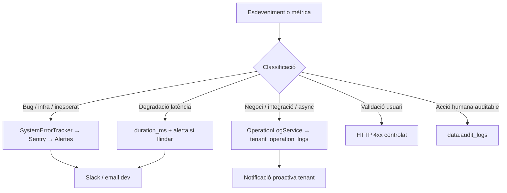

# Pla v3: Sentry + tenant_operation_logs + observabilitat proactiva

**Data:** 2026-06-20  
**Revisió:** 2026-06-20 (v3.3: Sprint 1 codi tancat — annex de continuació i full de treball pendent)  
**Estat:** **Sprint 1 codi complet** — llest per commit; configuració cloud i Fases 2–5 pendents (veure [Annex A](#annex-a--estat-complet-i-full-de-treball))  
**Relacionat:** [`README.md`](README.md), [`platform-roadmap-prioritat-2026.md`](../platform-roadmap-prioritat-2026.md) Sprint 1, [`notificacions/README.md`](../notificacions/README.md)

**Runbooks:** [`observability-baseline-runbook.md`](../../runbooks/observability-baseline-runbook.md) · [`fase-0-manual-setup.md`](../../runbooks/fase-0-manual-setup.md) · [`sentry-alerts-runbook.md`](../../runbooks/sentry-alerts-runbook.md) · [`developer-guidelines.md`](developer-guidelines.md) · regla Cursor [`.cursor/rules/error-handling.mdc`](../../../.cursor/rules/error-handling.mdc)

**Objectiu ampliat:** no només capturar errors quan passen, sinó **detectar degradació i caigudes abans que un usuari es queixi** — combinant el que Supabase ja ofereix (cost zero), monitoratge extern, alertes configurades i notificacions proactives als tenants.

---

## Estat d'implementació (2026-06-20)

| Fase | Progrés | Resum |
|------|---------|-------|
| **0** | 🟡 ~60% | Runbooks + script verificació ✅; UptimeRobot / alertes Supabase / compte Sentry ⏳ **(manual, al desplegar staging)** |
| **1** | 🟢 ~95% | Codi complet (EF + frontends + health) ✅; DSN cloud + alertes Slack ⏳ |
| **2** | 🟡 ~65% | UI operacions, badge, banner, E2E, ~20 pilots operation log ✅; notificacions, SLI, reintentar ⏳ |
| **3–5** | ⚪ 0% | Synthetic, health estès, guardrails, dashboard dev — post-MVP |

> **Desenvolupament només local:** no cal configurar Sentry ni UptimeRobot. El codi fa fallback a console/logs Supabase. Veure [Annex A §A.5](#a5-què-fer-en-local-vs-què-esperar-a-stagingprod).

**Nota de nomenclatura:** el pla original anomenava la funció `_health`; la implementació és **`health`** → `/functions/v1/health?check=live|ready`.

**Codi clau ja al repo:**

| Component | Ubicació |
|-----------|----------|
| StructuredLogger + `timedCall` | `supabase/functions/_shared/observability/structured-logger.ts` |
| SystemErrorTracker + Sentry adapter | `supabase/functions/_shared/observability/system-error-tracker.ts`, `adapters/sentry-adapter.ts` |
| OperationLogService | `supabase/functions/_shared/observability/operation-log-service.ts` |
| Health check | `supabase/functions/health/index.ts` |
| Migració SQL + RPCs | `supabase/migrations/20260620220000_tenant_operation_logs.sql` |
| Fix RLS manager access | `supabase/migrations/20260620230001_fix_assert_ai_manager_access_null_role.sql` |
| UI tenant | `apps/tenant-portal/src/pages/settings/OperationsPage.tsx`, `SettingsPage.tsx` |
| E2E | `scripts/test-operations-flow-e2e.mjs` (9/9 API), `apps/tenant-portal/tests/operations-flow.spec.ts` (4/4 UI) |
| Verificació Fase 0 | `scripts/verify-phase0-observability.mjs` |
| Sentry frontend (facade) | `apps/tenant-portal/src/lib/observability/`, `apps/admin-portal/lib/observability/` |
| Banner dashboard operacions | `apps/tenant-portal/src/features/operations/components/OperationsAlertBanner.tsx` |
| Regla Cursor EF | `.cursor/rules/error-handling.mdc` |

**Abans del Sprint 1:** Sentry no instal·lat; ~40+ `console.error` a Edge Functions; sense centre unificat d'operacions. **Ara:** cap `console.*` directe a EF (excepte adapters); StructuredLogger a tot el backend serverless; `tenant_operation_logs` operatiu.

---

## Matriu de cobertura

| Escenari | Abans del pla | Amb el pla (v1) | Amb el pla (v2 revisat) |
|----------|---------------|-----------------|-------------------------|
| Bug en Edge Function prod | ❌ | ✅ Sentry | ✅ Sentry + **alertes configurades** |
| Error operatiu async (email, PDF) | ⚠️ parcial (taules job) | ✅ OperationLogs | ✅ OperationLogs + **alerta tenant** |
| Validació d'usuari | ✅ HTTP 4xx | ✅ HTTP 4xx | ✅ HTTP 4xx |
| Caiguda total de Supabase | ❌ | ❌ | ✅ **UptimeRobot + health check** |
| Lentitud Gotenberg/DocuSeal/Resend | ❌ | ❌ | ✅ **`duration_ms` + llindars** |
| Edge Function que no respon | ❌ | ❌ | ✅ **Uptime + synthetic (Fase 3)** |
| Alerta immediata a l'equip dev | ❌ | ❌ | ✅ **Sentry issue alerts → Slack** |
| Tenant amb molts errors de nit | ❌ | ⚠️ passiu (/settings) | ✅ **Badge in-app + notificació** |
| Saber que "funciona bé" (no només errors) | ❌ | ❌ | ✅ **SLI/SLO + dashboard de salut** |
| Abús per tenant (spike/cost/retries) | ❌ | ❌ | ✅ **Guardrails + alertes + throttling** |
| Logs cercables per feature/level | ⚠️ inconsistent | ⚠️ parcial | ✅ **StructuredLogger obligatori** |
| Queries DB lentes | ⚠️ Dashboard Supabase | ❌ no integrat | ✅ **Fase 0: pg_stat + alertes Supabase** |

---

## Principi rector: quatre destinacions + observabilitat



| Destí | Què va | Qui el veu | Exemple |
|-------|--------|------------|---------|
| **Sentry + alertes** | Excepcions no previstes, bugs, timeouts infra | Devs / suport plataforma | `null.reference`, bug RPC, OOM Gotenberg |
| **tenant_operation_logs** | Fallades esperables d'operacions async/integracions | Owner/manager del tenant | Email rebutjat, webhook DocuSeal, IA rate limit BYOK |
| **HTTP 4xx** | Input invàlid, permisos, governança | Usuari final (toast/UI) | `AuthError`, `AiGovernanceError` |
| **audit_logs** | Qui va fer què (compliance) | Timeline / auditoria | "Maria ha actualitzat l'empleat X" |
| **Monitoratge extern** | Uptime, latència endpoint, synthetic | Ops / devs | Supabase down, `health/ready` > 5s |

**Regla d'or:** mai escriure errors operatius a `audit_logs`. Les taules de job (`document_pdf_jobs`, `email_logs`) continuen sent el detall tècnic per domini; `tenant_operation_logs` és la **vista agregada per l'admin**.

**Regla d'or #2:** Sentry **captura** però no **alerta** per defecte — cal configuració explícita (Fase 1).

---

## Fase 0 — Observabilitat existent (cost zero, ≤ 1 dia)

> **Estat:** 🟡 Documentació i verificació local ✅ — configuració manual als dashboards ⏳  
> Guia pas a pas: [`fase-0-manual-setup.md`](../../runbooks/fase-0-manual-setup.md)

Abans d'escriure codi propi, activar el que ja tenim:

### 0.1 Supabase Dashboard (ja disponible)

| Canal | On | Acció immediata |
|-------|-----|-----------------|
| **Edge Function logs** | Dashboard → Edge Functions → Logs | Revisar logs actuals; filtrar per funció; documentar al runbook |
| **Database logs** | Dashboard → Database → Logs | Errors connexió, RLS denials, deadlocks |
| **`pg_stat_statements`** | Database → Extensions / SQL | Activar si no ho està; revisar top 10 queries lentes |
| **Alertes natives Supabase** | Dashboard → Project Settings → Alerts (Pro/Team) | CPU, connexions DB, Storage — llindars recomanats: CPU > 80% 5min, connexions > 80% pool |
| **Health REST** | `GET https://<project>.supabase.co/rest/v1/` | 200 = API activa; candidat a monitor extern |

### 0.2 Monitoratge extern d'uptime (UptimeRobot / Better Uptime — pla gratuït)

Configurar **abans** de la Fase 1:

| Monitor | URL / target | Interval | Timeout | Alerta |
|---------|--------------|----------|---------|--------|
| Supabase REST | `https://<project>.supabase.co/rest/v1/` | 1 min | 10s | Email + Slack |
| Tenant portal | URL producció (p.ex. `app.exemple.com`) | 1 min | 15s | Email + Slack |
| Admin portal | URL producció | 1 min | 15s | Email + Slack |
| Edge `health` | `https://<project>.supabase.co/functions/v1/health?check=live` | 1 min | 10s | Email + Slack |
| Edge `health` (ready) | `.../health?check=ready` | 1 min | 10s | Keyword `"status":"ok"` |

**Nota:** la funció es desplega com `health` (no `_health`). Verificació local: `node scripts/verify-phase0-observability.mjs`.

### 0.3 Runbook operatiu

Documentat a:

- [`docs/runbooks/observability-baseline-runbook.md`](../../runbooks/observability-baseline-runbook.md)
- [`docs/runbooks/fase-0-manual-setup.md`](../../runbooks/fase-0-manual-setup.md)
- [`docs/runbooks/sentry-alerts-runbook.md`](../../runbooks/sentry-alerts-runbook.md)

**Entregables Fase 0:**

| Entregable | Estat |
|------------|--------|
| Runbooks baseline + Sentry + guia manual | ✅ |
| Script `verify-phase0-observability.mjs` | ✅ |
| `pg_stat_statements` actiu (local) | ✅ |
| Monitors UptimeRobot (staging + prod) | ⏳ manual |
| Alertes Supabase CPU/connexions/storage | ⏳ manual |
| Projectes Sentry + DSN als secrets | ⏳ manual |
| §4 runbook omplert amb URLs reals | ⏳ manual |

---

## Fase 1 — Capa agnòstica d'errors de sistema + health + logging

> **Estat:** 🟢 ~95% — backend, frontends i health complet ✅; DSN cloud + alertes Slack pendents (manual staging)

### 1.1 Estructura de fitxers

**Implementat** (Sprint 1 — dins `supabase/functions/_shared/`, no `packages/`):

```
supabase/functions/
  health/index.ts                  # health check (live + ready)
  _shared/observability/
    system-error-tracker.ts        # facade errors → Sentry
    structured-logger.ts           # facade logs → stdout JSON
    operation-log-service.ts       # dual-write tenant_operation_logs
    context.ts
    helpers.ts
    adapters/
      sentry-adapter.ts            # únic import @sentry/*
      console-adapter.ts           # fallback local (ENVIRONMENT=local o sense DSN)

apps/tenant-portal/src/
  features/operations/api/operationsRpc.ts
  pages/settings/OperationsPage.tsx
  hooks/useUnresolvedOperationCount.ts
```

**Pendent Fase 1 (només cloud):**

| Entregable | On |
|------------|-----|
| `SENTRY_DSN` + `ENVIRONMENT` als secrets Supabase/Vercel | staging → prod |
| Alertes Sentry (Slack) al dashboard | staging → prod |
| Smoke test Sentry (excepció provocada) | staging |
| `packages/observability` npm unificat | opcional, post-MVP |

**Implementat als frontends** (Sprint 1):

```
apps/tenant-portal/src/lib/observability/   # @sentry/react + error boundaries + scope sync
apps/admin-portal/lib/observability/        # idem + ObservabilityProvider al layout
```

### 1.2 StructuredLogger (obligatori per a logs no-error)

Totes les Edge Functions han d'usar el mateix schema — els logs apareixen al Dashboard Supabase i es poden filtrar per text search.

```typescript
// supabase/functions/_shared/observability/structured-logger.ts

export type LogLevel = 'debug' | 'info' | 'warn' | 'error';

export type StructuredLogEntry = {
  level: LogLevel;
  feature: string;
  timestamp: string;
  msg: string;
  tenantId?: string | null;
  userId?: string | null;
  correlationId?: string;
  durationMs?: number;
  integration?: string;   // 'gotenberg' | 'docuseal' | 'resend'
  extra?: Record<string, unknown>;
};

export function log(
  level: LogLevel,
  feature: string,
  msg: string,
  fields?: Omit<StructuredLogEntry, 'level' | 'feature' | 'timestamp' | 'msg'>,
): void {
  const entry: StructuredLogEntry = {
    level,
    feature,
    timestamp: new Date().toISOString(),
    msg,
    ...fields,
  };
  // Supabase Dashboard indexa stdout; JSON en una línia per filtrar
  console.log(JSON.stringify(entry));
}

/** Mesura latència d'una crida externa i registra warn si supera llindar.
 *  `onSlow` és opcional: típicament `captureMessage` del SystemErrorTracker,
 *  injectat pel caller per evitar acoblament entre els dos mòduls. */
export async function timedCall<T>(
  feature: string,
  integration: string,
  thresholdMs: number,
  fn: () => Promise<T>,
  onSlow?: (durationMs: number) => void,
): Promise<T> {
  const start = Date.now();
  try {
    return await fn();
  } finally {
    const durationMs = Date.now() - start;
    const level = durationMs > thresholdMs ? 'warn' : 'info';
    log(level, feature, `${integration} call completed`, {
      integration,
      durationMs,
      extra: durationMs > thresholdMs ? { threshold_exceeded: true } : undefined,
    });
    if (durationMs > thresholdMs) {
      onSlow?.(durationMs);
    }
  }
}

// Ús típic al caller (Edge Function):
// await timedCall('process-email-queue', 'resend', 3000, () => sendViaResend(...),
//   (ms) => captureMessage(`resend slow: ${ms}ms`, 'warning', { feature: 'process-email-queue' })
// );
```

**Prohibició:** no fer `console.log('error processat')` ni `console.error('[feature]', msg)` directe — usar `log()` o `captureException()`.

**Llindars inicials recomanats:**

| Integració | Warn | Crític (Sentry message) |
|------------|------|-------------------------|
| Gotenberg | > 10s | > 30s |
| DocuSeal API | > 5s | > 15s |
| Resend | > 3s | > 10s |
| Proveïdor IA (BYOK) | > 15s | > 45s |

### 1.3 SystemErrorTracker (facade Sentry)

*(Sense canvis substancials respecte v1 — veure secció anterior.)*

```typescript
export interface SystemErrorTracker {
  captureException(error: unknown, ctx: ErrorContext): void;
  captureMessage(message: string, level: 'info' | 'warning' | 'error', ctx: ErrorContext): void;
  withContext<T>(ctx: ErrorContext, fn: () => T | Promise<T>): T | Promise<T>;
}
```

**Prohibició explícita:** cap `import` de `@sentry/*` fora de `adapters/sentry-adapter.ts`.

### 1.4 Configuració d'alertes Sentry (obligatori, no automàtic)

Sentry captura però **no alerta** sense configuració. Cal definir al projecte Sentry (staging + prod separats):

#### Issue alerts (errors nous / regressions)

| Alerta | Condició | Canal | Prioritat |
|--------|----------|-------|-----------|
| **Critical — new issue prod** | Primer event d'un issue nou a `environment:production` | Slack `#alerts-prod` + email on-call | P1 |
| **Regression** | Issue resolt torna a aparèixer | Slack `#alerts-prod` | P1 |
| **Spike — same issue** | > 10 events del mateix issue en 5 min | Slack (1 alerta agrupada, no 10) | P1 |
| **Spike — feature** | > 50 events amb tag `feature:ai-chat-turn` en 5 min | Slack + considerar circuit breaker | P0 |

#### Metric alerts (rendiment)

| Alerta | Condició | Canal |
|--------|----------|-------|
| Error rate EF | > 5% transaccions amb error en 5 min (per `feature`) | Slack |
| P95 latency | > 5s per `ai-chat-turn` en producció | Slack |

#### Què NO alerta (evitar fatiga)

- Errors 4xx esperats (filtrats per `beforeSend`)
- `operationLog.logFailure` de negoci (email rebutjat, BYOK invàlid) — van a tenant, no despertem dev
- Issues staging excepte si tag `severity:critical`

#### Resum diari (opcional, setmana 2)

- Sentry **Weekly Report** activat per email
- Cron intern o Slack bot: "Ahir: N issues nous, M operacions fallides (query `tenant_operation_logs`)" — Fase 2

**Entregable:** document `docs/runbooks/sentry-alerts-runbook.md` amb captures de pantalla de la config i llista de canals.

> **Estat runbook:** plantilla ✅ — alertes al dashboard Sentry ⏳ manual (veure checklist §7 del runbook)

### 1.5 Health check endpoints: `/live` i `/ready`

Dos endpoints separats dins la mateixa Edge Function **`health`** (`supabase/functions/health/index.ts`). Separació perquè els monitors externs i load balancers no han de rebre `503` per lentitud puntual de la DB.

| Endpoint | Retorna | Estat | Ús |
|----------|---------|-------|-----|
| `GET /functions/v1/health?check=live` | `200` sempre | ✅ | UptimeRobot bàsic, load balancer |
| `GET /functions/v1/health?check=ready` | `200 ok` / `503 fail` | ✅ | Monitor extern; ping `api.ping()` + latència DB |

Implementació actual: readiness usa `adminClient.rpc('ping')`; `degraded` si latència ≥ 3000 ms (200, no 503).

```typescript
// supabase/functions/health/index.ts  (implementació real)
// Veure fitxer al repo — usa initObservability + log() + api.ping()
```

**Monitors UptimeRobot:**

| Monitor | URL | Alerta si |
|---------|-----|-----------|
| Liveness | `/health?check=live` | no 200 |
| Readiness | `/health?check=ready` | no 200 O body sense `"status":"ok"` (keyword check) |

**Extensions futures (Fase 3):** afegir checks Gotenberg + PGMQ depth al `ready`.

### 1.7 SLI/SLO de plataforma (mínim viable)

Definir objectius explícits per saber si el sistema funciona com toca — i qui ha d'actuar quan no ho fa:

| SLI | Objectiu (SLO) | Finestra | Propietari alerta | SLA resposta |
|-----|----------------|----------|-------------------|--------------|
| `ai-chat-turn` success rate | >= 99.0% | 24h rolling | Dev lead | 2h en horari laboral |
| `ai-chat-turn` P95 latència | <= 5s | 24h rolling | Dev lead | 4h en horari laboral |
| `health/ready` availability | >= 99.9% | mensual | Dev lead | 30 min (qualsevol hora) |
| `tenant_operation_logs` failed ratio | <= 2% per integració | 24h | Dev on-duty | 4h en horari laboral |
| Queue lag (PGMQ) | <= 60s P95 | 1h | Dev on-duty | 2h en horari laboral |

**Implementació mínima:**

- Consultes SQL guardades a `docs/runbooks/slo-queries.md` (execució manual o cron diari).
- Alerta automàtica: Sentry metric alert quan `error_rate > 1%` per `ai-chat-turn` 2 finestres consecutives.
- Revisió setmanal (15 min) dels 5 SLI — afegir al calendar d'equip.

**Nota horari:** "horari laboral" = L-V 9h-18h CET. Fora d'aquest horari, la P1 és la caiguda detectada per UptimeRobot (`health/ready` → 503).

### 1.8 Frontend (React)

> **Estat:** ✅ facade + error boundary als dos portals; cal DSN staging/prod a Vercel

- `@sentry/react` a tenant-portal i admin-portal — ✅
- Error boundaries via facade — ✅ (`ObservabilityErrorBoundary`)
- Context `user_id` / `tenant_id` — ✅ (tenant); admin només `user_id`
- **No** enviar errors 4xx esperats a Sentry — ✅ `beforeSend` + `isExpectedClientError`
- Local/dev sense DSN → console fallback (mateix patró que Edge Functions)

**Entregables Fase 1 — resum:**

| Entregable | Estat |
|------------|--------|
| StructuredLogger + `log()` a EF | ✅ |
| SystemErrorTracker + sentry-adapter | ✅ (local → console) |
| ~41 Edge Functions amb `initObservability` | ✅ |
| Zero `console.*` directes a EF | ✅ |
| Migració `tenant_operation_logs` + RPCs | ✅ |
| `health?check=live\|ready` | ✅ |
| `developer-guidelines.md` | ✅ |
| `SENTRY_DSN` + `ENVIRONMENT` als secrets cloud | ⏳ |
| Alertes Sentry (Slack) configurades | ⏳ |
| `@sentry/react` frontends | ✅ (DSN cloud ⏳) |
| Smoke test Sentry staging | ⏳ |

---

## Fase 2 — Historial d'operacions + alertes proactives tenant

> **Estat:** 🟡 ~65% — SQL, UI, badge, banner dashboard, pilots workers i E2E ✅; notificacions in-app, SLI, reintentar UI, guardrails ⏳

### 2.1 Esquema SQL (amb `duration_ms`)

Migració: `supabase/migrations/20260620220000_tenant_operation_logs.sql` ✅

```sql
CREATE TYPE data.operation_log_status AS ENUM (
  'pending', 'running', 'success', 'failed', 'dead_letter', 'cancelled', 'degraded'
  -- 'degraded' = operació completada però lentitud o resposta parcial
);

CREATE TYPE data.operation_integration_type AS ENUM (
  'email', 'sms', 'push', 'webhook_inbound', 'webhook_outbound',
  'erp_sync', 'signing', 'pdf_generation', 'ai_generation', 'ai_chat',
  'import', 'export', 'storage', 'geocoding', 'billing', 'other'
);

CREATE TABLE data.tenant_operation_logs (
  id                  uuid PRIMARY KEY DEFAULT gen_random_uuid(),
  tenant_id           uuid NOT NULL REFERENCES data.tenants(id) ON DELETE CASCADE,
  site_id             uuid REFERENCES data.sites(id) ON DELETE SET NULL,

  integration_type    data.operation_integration_type NOT NULL,
  operation_code      text NOT NULL,
  status              data.operation_log_status NOT NULL DEFAULT 'pending',

  title               text NOT NULL,
  message             text,
  error_code          text,
  error_message       text,

  entity_type         text,
  entity_id           uuid,
  correlation_id      text,
  source_job_table    text,
  source_job_id       uuid,

  payload_summary     jsonb NOT NULL DEFAULT '{}'::jsonb,

  -- Rendiment (nou): detectar degradació sense error explícit
  duration_ms         integer,
  duration_threshold_ms integer,   -- llindar aplicat en el moment del log
  external_service    text,        -- 'gotenberg' | 'docuseal' | 'resend' | 'openai'

  attempt_count       smallint NOT NULL DEFAULT 0,
  max_attempts        smallint,
  is_retryable        boolean NOT NULL DEFAULT false,

  actor_user_id       uuid REFERENCES data.profiles(id) ON DELETE SET NULL,
  resolved_at         timestamptz,
  resolved_by         uuid REFERENCES data.profiles(id) ON DELETE SET NULL,
  resolution_note     text,
  tenant_notified_at  timestamptz,  -- evita duplicar notificacions

  created_at          timestamptz NOT NULL DEFAULT now(),
  updated_at          timestamptz NOT NULL DEFAULT now(),
  completed_at        timestamptz,

  UNIQUE (tenant_id, correlation_id, operation_code)
);

CREATE INDEX idx_op_logs_tenant_created
  ON data.tenant_operation_logs (tenant_id, created_at DESC);
CREATE INDEX idx_op_logs_tenant_status
  ON data.tenant_operation_logs (tenant_id, status)
  WHERE status IN ('failed', 'dead_letter', 'degraded');
CREATE INDEX idx_op_logs_tenant_unresolved
  ON data.tenant_operation_logs (tenant_id, created_at DESC)
  WHERE resolved_at IS NULL AND status IN ('failed', 'dead_letter');
CREATE INDEX idx_op_logs_integration_duration
  ON data.tenant_operation_logs (integration_type, created_at DESC)
  WHERE duration_ms IS NOT NULL;
```

**RPC per agregació de latència (dev dashboard / alertes):**

```sql
-- Percentil P95 per integració, últimes 24h (service_role / admin)
CREATE OR REPLACE FUNCTION api.get_integration_latency_stats(
  p_hours integer DEFAULT 24
)
RETURNS TABLE (
  integration_type data.operation_integration_type,
  p50_ms numeric,
  p95_ms numeric,
  count bigint,
  degraded_count bigint
) ...
```

**RLS:** owner/manager del tenant.

**RPCs addicionals:**

| RPC | Accés | Propòsit | Estat |
|-----|-------|----------|-------|
| `api.log_tenant_operation` | `service_role` | Escriure (inclou `duration_ms`) | ✅ |
| `api.get_tenant_operation_logs` | authenticated (manager+) | Llistat paginat | ✅ |
| `api.get_unresolved_operation_count` | authenticated (manager+) | Badge settings tab | ✅ |
| `api.mark_operation_log_resolved` | authenticated (manager+) | Marcar revisat | ✅ |
| `api.get_integration_latency_stats` | service_role / admin | P95 per integració | ⏳ |

Fix seguritat RLS manager: `20260620230001_fix_assert_ai_manager_access_null_role.sql` ✅

### 2.2 OperationLogService (amb durada)

> **Estat:** ✅ implementat a `operation-log-service.ts` — sense `notifyTenant()` (pendent NotificationService V0)

```typescript
export type OperationLogInput = {
  tenantId: string;
  integrationType: OperationIntegrationType;
  operationCode: string;
  status: OperationLogStatus;
  title: string;
  message?: string;
  errorCode?: string;
  errorMessage?: string;
  correlationId?: string;
  durationMs?: number;
  durationThresholdMs?: number;
  externalService?: string;
  payloadSummary?: Record<string, unknown>;
  isRetryable?: boolean;
  notifyTenant?: boolean;  // default true per failed/dead_letter
};

export class OperationLogService {
  async log(input: OperationLogInput): Promise<string> {
    // IMPORTANT: si l'operació és 'success' però lenta, inserim directament
    // com a 'degraded' — NO creem un segon registre (viola UNIQUE constraint).
    const effectiveStatus: OperationLogStatus =
      input.status === 'success' &&
      input.durationMs != null &&
      input.durationThresholdMs != null &&
      input.durationMs > input.durationThresholdMs
        ? 'degraded'
        : input.status;

    const logId = await this.persist({ ...input, status: effectiveStatus });

    // Notificar tenant per fallades i dead letters (no per degraded ni success).
    if (
      input.notifyTenant !== false &&
      ['failed', 'dead_letter'].includes(effectiveStatus)
    ) {
      // Fire-and-forget: un error aquí no ha de trencar el flux principal.
      this.notifyTenantManagers(input, logId).catch((err) => {
        captureException(err, {
          feature: 'operation-log-service',
          tenantId: input.tenantId,
          correlationId: input.correlationId,
        });
      });
    }

    return logId;
  }

  // La RPC `log_tenant_operation` usa ON CONFLICT (tenant_id, correlation_id, operation_code)
  // DO UPDATE SET status=EXCLUDED.status, duration_ms=EXCLUDED.duration_ms, updated_at=now()
  // per gestionar retries on el mateix correlation_id arriba dues vegades (ex: PGMQ redelivery).
  private async persist(input: OperationLogInput & { status: OperationLogStatus }): Promise<string> {
    const { data, error } = await this.adminClient.rpc('log_tenant_operation', {
      p_tenant_id: input.tenantId,
      // ...
    });
    if (error) {
      captureException(error, { feature: 'operation-log-service', tenantId: input.tenantId });
      return '';
    }
    return data as string;
  }
}
```

**Patró dual-write** (sense canvis de lògica, afegir `durationMs`):

```typescript
const started = Date.now();
try {
  await sendViaResend(typedLog, msg.idempotency_key);
  await operationLog.logSuccess({
    ...,
    durationMs: Date.now() - started,
    durationThresholdMs: 3000,
    externalService: 'resend',
  });
} catch (err) {
  await operationLog.logFailure({
    ...,
    durationMs: Date.now() - started,
    externalService: 'resend',
  });
  if (isInfrastructureBug(err)) captureException(err, { ... });
}
```

### 2.3 Alertes proactives per al tenant (no passiu)

> **Estat:** badge tab Configuració ✅ — banner login, notificació in-app i digest email ⏳

El centre `/settings/operations` és necessari però **insuficient**. Cal:

#### A) Badge in-app al login (Sprint 1 UI mínim)

> **Parcial:** badge al tab **Operacions** dins `/settings/*` ✅ — banner al dashboard ✅ (owner/manager, `p_since` darrer accés)

```typescript
// Al bootstrap del tenant-portal (owner/manager)
const { count } = await supabase.rpc('get_unresolved_operation_count', {
  p_tenant_id: tenantId,
  p_since: lastLoginAt ?? null,
});
// Mostrar badge a Settings / Operations si count > 0
```

#### B) Notificació in-app via NotificationService (Sprint 2 — dependència notificacions V0)

> **Estat:** ⏳ — `OperationLogService` no crida encara NotificationService

Quan `logFailure` amb `notifyTenant: true`:

```typescript
await notificationService.send({
  tenantId: input.tenantId,
  userId: managerUserId,  // tots els managers o només owner
  channel: 'in_app',
  eventType: 'operation_failed',
  title: input.title,
  body: input.message ?? input.errorMessage,
  deepLink: `/settings/operations?id=${logId}`,
});
```

Integració explícita amb [`notificacions/README.md`](../notificacions/README.md) — no duplicar sistema de notificacions.

#### C) Resum diari per email (opcional, configurable per tenant)

- Preferència a `tenant_settings`: `operation_digest_email: daily | never`
- Cron `pg_cron` o Edge Function diària: agrupa `failed` + `degraded` de les últimes 24h
- Envia via Resend només si hi ha ≥1 incidència
- **No** substitueix alertes dev; és per admins tenant

### 2.4 UI tenant-portal

**Ruta:** `/settings/operations` (owner/manager) — **implementada** ✅

| Element | Detall | Estat |
|---------|--------|-------|
| Llistat | Filtres: estat, tipus integració; columna durada | ✅ |
| Detall | title, message, error_code, duration_ms, payload_summary | ✅ |
| Accions | Marcar revisat | ✅ |
| Accions | Reintentar (si `is_retryable`) | ⏳ |
| Badge | `get_unresolved_operation_count` al tab Operacions | ✅ |
| Banner | "N operacions han fallat des del darrer accés" al dashboard | ✅ |

**Tests E2E:** `scripts/test-operations-flow-e2e.mjs` (9/9 API) ✅ · `apps/tenant-portal/tests/operations-flow.spec.ts` (4/4 UI) ✅

### 2.5 Tenant guardrails i detecció d'abús (nou v3)

> **Estat:** ⏳ post-MVP (Fase 2 tardana / Fase 3) — cap migració `tenant_guardrail_events` encara

Objectiu: detectar i contenir tenants que degradin la plataforma (volum, cost o retries anormals).

#### A) Guardrails per defecte

| Dimensió | Llindar inicial | Acció | On s'implementa |
|----------|-----------------|-------|-----------------|
| Requests IA per tenant | 120/min | `429` + operation log | `ai_usage_ledger` existent — RPC `check_ai_rate_limit` (ja existeix) |
| Concurrent IA jobs | 10 | Queue o reject | `ai_usage_ledger.active_requests` counter + RPC check a `generate-ai-content` |
| Error ratio per tenant (5 min) | > 30% i >= 20 events | alerta dev | `pg_cron` cada 5 min → `get_tenant_error_ratio` → `tenant_guardrail_events` |
| Dead letters per tenant (1h) | > 25 | alerta dev + notificació owner | `pg_cron` cada hora → query `operation_logs` DLQ → guardrail event |
| Cost IA estimat dia | 80% pressupost | warning owner/manager | `ai_usage_ledger` amb cost estimat (`tokens × $/token` per model) → RPC `check_ai_budget` |
| Cost IA estimat dia | 100% pressupost | soft block (`suspended_until`) | Mateix RPC → Edge Function retorna 402 + operation log |

**Model de cost IA:** `data.ai_model_capabilities` ja existeix — afegir columna `cost_per_1k_tokens_usd numeric` per calcular cost estimat a `ai_usage_ledger.estimated_cost_usd`. El pressupost per tenant s'emmagatzema a `data.tenant_ai_config.daily_budget_usd`.

**Mecanisme de soft-block:** camp `data.tenants.ai_suspended_until timestamptz`. L'Edge Function `generate-ai-content` comprova aquest camp al principi (via `get_ai_api_key_for_generation` o RPC dedicada) i retorna `402 Payment Required` + message clar si l'hora actual és anterior a `ai_suspended_until`.

#### B) Model de dades mínim (proposta)

```sql
CREATE TABLE data.tenant_guardrail_events (
  id                uuid PRIMARY KEY DEFAULT gen_random_uuid(),
  tenant_id         uuid NOT NULL REFERENCES data.tenants(id) ON DELETE CASCADE,
  guardrail_type    text NOT NULL,   -- rate_limit | cost_budget | retry_spike | abuse_spike
  severity          text NOT NULL CHECK (severity IN ('info','warning','critical')),
  metric_value      numeric,
  threshold_value   numeric,
  action_taken      text,            -- notify | throttle | soft_block
  correlation_id    text,
  payload_summary   jsonb NOT NULL DEFAULT '{}'::jsonb,
  created_at        timestamptz NOT NULL DEFAULT now()
);

CREATE INDEX idx_guardrail_tenant_created
  ON data.tenant_guardrail_events (tenant_id, created_at DESC);
```

#### C) Alertes d'abús

- Spike volum: `tenant events > 3x baseline` en 15 min.
- Tenant dominant: `> 40%` del volum global 1h.
- Retry storm: mateix `operation_code` amb `failed/dead_letter` repetits.

#### D) Resposta automàtica escalonada

1. `warning`: notificar tenant i equip intern.
2. `throttle`: reduir throughput del tenant temporalment.
3. `soft_block`: bloqueig temporal (`suspended_until`) per evitar impacte global.
4. `manual_override`: suport desbloqueja amb motiu auditable.

#### E) Visibilitat operativa

- Widget "Top tenants per volum/fallades" al dashboard intern.
- Taula de guardrail events consultable per suport.
- Enllaç directe des de `/settings/operations` a incidències de límit del tenant.

---

## Fase 3 — Uptime avançat i synthetic monitoring

> **Estat:** ⚪ no iniciada

*(Després de Fase 1–2 estable; ~1 setmana addicional)*

### 3.1 Synthetic checks (Checkly o similar — pla gratuït limitat)

| Check | Freqüència | Què valida |
|-------|------------|------------|
| Login smoke | 15 min | Portal carrega, auth callback OK |
| `health` extended | 5 min | DB + latència < 3s |
| AI smoke (staging) | 30 min | Request mínim a `ai-chat-turn` amb JWT de test; resposta < 5s |

Detecta regressions de rendiment **abans** que Sentry registri errors.

### 3.2 Health check estès

Ampliar `health` amb checks opcionals (timeout curt cadascun):

- Gotenberg: `GET /health` o ping conegut
- PGMQ depth: RPC `get_queue_depth` si > llindar → `degraded`
- Storage: HEAD a bucket de prova

Retornar sempre 200 amb `status: ok | degraded | fail` per no confondre load balancers — només `fail` si BD caiguda.

### 3.3 Dashboard dev intern (opcional)

Admin-portal: vista `/dashboard/observability` (rol plataforma):

- P95 latència per integració (RPC `get_integration_latency_stats`)
- Top tenants per operacions fallides 24h
- Enllaços ràpids Sentry + Supabase Logs

---

## Fase 4 — Refactorització del codi existent

> **Estat:** 🟢 onades 0–3 en gran part fetes; onada 4 (frontend Sentry + `ai-chat-turn` operation log) ⏳

### 4.1 Inventari per onades

**Onada 0 (juntament amb Fase 1):** `structured-logger.ts` + `health` — ✅

**Onada 1 — Pilots:**

- `process-email-queue/index.ts` — `durationMs`, Resend `timedCall` — ✅
- `ai-chat-turn/index.ts` — `initObservability` + `log()` ✅; operation log errors BYOK — ⏳

**Onada 2 — Webhooks + signing:**

- `docuseal-webhook`, `sign-document-router`, `process-signing-token` — ✅ operation log

**Onada 3 — Cues PDF:**

- `process-document-pdf-queue`, `process-gotenberg-callback` — ✅ `timedCall` + operation log

**Onada 4 — IA restant + frontend**

- `generate-ai-content`, `ai-template-generator`, etc. — ✅ parcial (operation log on alguns)
- `@sentry/react` tenant + admin — ✅

**Workers amb `createOperationLogService` (Sprint 1):** ~20 EF incl. email, PDF, signing, domain, leads, reminders, attendance, deletion, geocoding, resend-webhook, configure-byos, ai-cron-analytics, ai-chat-apply-proposal, stamp-pdf-signatures, manage-email-domain, ai-template-generator, generate-ai-content.

### 4.2 Patró try/catch

*(Igual que v1, afegint `durationMs` i `log()` en lloc de `console.error`)*

### 4.3 Checklist per PR

- [x] Cap `Sentry.capture*` directe (fora de `sentry-adapter.ts`)
- [x] Cap `console.log/error` directe a EF — només `log()` o facade
- [ ] Crides externes amb `timedCall` o `durationMs` explícit (parcial — pilots fets)
- [ ] Cap error operatiu a `audit_logs`
- [x] `tenant_id` present quan conegut (structured logs + Sentry tags)
- [ ] Errors negoci → operation log + notificació tenant si cal (log sí, notificació no)
- [x] Tests E2E flux operacions (API + Playwright)
- [ ] Tests smoke: destí correcte (Sentry vs operation log vs 4xx)

---

## Fase 5 — Directrius de desenvolupament

> **Estat:** ✅ document base + regla Cursor — `.cursor/rules/error-handling.mdc`

Document: [`developer-guidelines.md`](developer-guidelines.md)  
Regla Cursor: `.cursor/rules/error-handling.mdc` — ✅

### 5.1 Quan HTTP 4xx vs excepció fatal

| Situació | Acció |
|----------|-------|
| Input invàlid | HTTP 400 — NO Sentry |
| Sense permís | HTTP 403 — NO Sentry |
| Límit negoci (rate limit IA) | HTTP 429 + opcional operation log |
| Bug / infra | `captureException` → HTTP 500 genèric |
| Proveïdor extern error conegut (BYOK invàlid) | `operationLog.logFailure` + HTTP 502 — NO Sentry |
| Proveïdor extern timeout repetit | `operationLog` + `captureMessage` warning — Sentry alert si spike |

### 5.2 Quan Sentry vs OperationLog vs audit_logs vs log()

```
IF unhandled exception OR infrastructure bug:
  captureException → Sentry (alertes si configurades)
ELSE IF expected business/integration failure:
  OperationLogService.logFailure (+ notifyTenant)
  IF also infrastructure: captureException
ELSE IF slow external call (> threshold):
  log(warn) + operationLog degraded OR captureMessage
ELSE IF user validation:
  HTTP 4xx — res més
ELSE IF informational/debug:
  log(info|debug) — StructuredLogger only
ELSE IF human audit success:
  audit_logs — mai errors
```

### 5.3 Dades prohibides als logs

Cap d'aquestes dades pot aparèixer a `tenant_operation_logs`, `tenant_guardrail_events`, Sentry `extra/tags` ni al `StructuredLogger`:

| Categoria | Exemples prohibits | Alternativa acceptable |
|-----------|--------------------|------------------------|
| Secrets i credencials | API keys, tokens JWT, passwords, Vault secrets | — (mai loggear) |
| PII directa completa | NIF/DNI complet, email sencer, telèfon sencer | Hash SHA-256, domini (`@acme.com`), últims 4 dígits |
| Contingut de documents RRHH | Text de contractes, nòmines, expedients | ID del document + `entity_type` |
| Stack traces completes | Missatges d'error amb rutes internes, noms de taules | Missatge sanititzat (`sanitizeProviderError`) |
| Dades de pagament | Números de targeta, IBAN | Últims 4 dígits, entitat bancària |
| Prompts i respostes IA | Text complet de missatges de chat | `feature`, `model`, `tokens` — mai el contingut |

**Regla pràctica per a `payload_summary`:** només mètriques i identificadors, mai valors de negoci. ✓ `{ recipient_domain: "acme.com", attempt: 3, model: "gpt-4o-mini" }` ✗ `{ email: "joan@acme.com", subject: "Carta d'acomiadament de..." }`

**Sanitització obligatòria:** la funció `sanitizeProviderError(msg)` (ja existent a `_shared/ai/`) ha de ser el punt únic de neteja de missatges d'error externs. Si una integració nova genera missatges d'error, cal ampliar-la.

### 5.4 Retenció de logs (stdout Edge Functions)

El Dashboard Supabase mostra els logs de Edge Functions però **els conserva només 7 dies** (Pro) o menys. Per incidents descoberts tard o auditories, cal una estratègia explícita:

| Estratègia | Cost | Recomanació |
|------------|------|-------------|
| **Supabase Dashboard** | 0 | Diagnòstic immediat (< 7 dies) — sempre disponible |
| **Sentry breadcrumbs** | 0 (inclòs al pla) | Errors amb context dels últims events — 90 dies per issue |
| **`tenant_operation_logs` (SQL)** | 0 extra | Logs operatius amb retenció 90 dies configurable — **la millor opció per RRHH/GDPR** |
| Log forwarding extern (Datadog/Logtail) | Pagament | Només si el negoci ho requereix; fora d'abast MVP |

**Decisió MVP:** no afegir log forwarding. Els `warn`/`error` crítics han d'acabar a Sentry o a `tenant_operation_logs`. Els `info`/`debug` de stdout es descarten a 7 dies — acceptable si el structured logging és consistent.

**Regla derivada:** tot event operatiu que calgui revisar més de 7 dies després **ha d'estar** a `tenant_operation_logs`, no només a stdout.

### 5.5 Convencions

- `feature` = nom Edge Function o component React
- `correlation_id` = PGMQ msg_id | job.id | request UUID
- Logs: **sempre** `JSON.stringify` d'un sol objecte per línia
- Latència: registrar `durationMs` a operation logs **i** structured logs per crides externes

---

## Calendari revisat (alineat Sprint 1 roadmap)

| Fase | Durada | Entregables | Estat Sprint 1 |
|------|--------|-------------|----------------|
| **0** | ≤ 1 dia | UptimeRobot, alertes Supabase, runbook baseline, revisió logs | 🟡 docs ✅ · dashboards ⏳ (staging) |
| **1** | Setmana 1 | StructuredLogger, SystemErrorTracker, Sentry + alertes, `health/live\|ready`, SQL | 🟢 codi ✅ · Sentry cloud ⏳ (staging) |
| **2** | Setmana 2 | OperationLogService, pilots, UI + badge + banner, SLI/SLO | 🟡 nucli UI ✅ · notificacions/SLI ⏳ |
| **3** | Setmana 3 | Notificació in-app, guardrails V1, synthetic | ⚪ |
| **4–5** | Continu | Resta workers, dashboard dev, cleanup | 🟡 onades 0–3 ✅ · ai-chat log ⏳ |

**Criteris d'acceptació ampliats:**

- [ ] Monitor extern detecta `health` down en < 2 min (depèn UptimeRobot manual)
- [ ] Issue nou a prod → Slack en < 5 min (Sentry alert provada)
- [ ] Gotenberg lent (> 30s) → `log(warn)` + entrada `degraded` a operation logs (parcial — PDF queue)
- [x] Manager veu badge d'errors al tab Operacions (sense obrir la pàgina de detall)
- [x] Banner dashboard manager+ amb incidències des del darrer accés al tauler
- [ ] Disposem de 5 SLI mínims amb valors diaris (success rate, P95, availability, failed ratio, queue lag)
- [ ] Spike d'abús d'un tenant genera guardrail event i acció de throttle/alerta
- [ ] Excepció EF prod → Sentry amb tenant/user (codi llest; cal DSN + prova)
- [ ] Zero errors operatius a `audit_logs`
- [x] Logs Edge Function filtrables per `"feature":"process-email-queue"` al Dashboard

---

## Decisions obertes

| # | Decisió | Recomanació |
|---|---------|-------------|
| D1 | Retenció `tenant_operation_logs` | 90 dies; job `pg_cron` cleanup |
| D2 | Canal alerta dev | Slack `#alerts-prod` + email backup |
| D3 | Uptime provider | Better Uptime o UptimeRobot (gratuït) |
| D4 | Synthetic monitoring | Checkly free tier staging; prod només `health` inicialment |
| D5 | Resum diari tenant | Opt-in; desactivat per defecte |
| D6 | Sentry org | Projectes separats staging/prod; DSN via env/Vault |
| D7 | Notificació tenant | Esperar Notif V0; badge + banner ja fets ✅ |
| D8 | Política de soft-block per abús | Activar només en plans enterprise o per tots els plans |
| D9 | Pressupost cost IA per tenant | Default per pla + override manual comercial |

---

## Annex A — Estat complet i full de treball

Aquest annex recull **tot el que queda després del Sprint 1 de codi**, amb context de negoci, ordre d'implementació recomanat i criteri **local / staging / producció**. Serveix com a full de ruta per als següents plans sense rellegir tot el document.

### A.1 Completat al Sprint 1 (2026-06-20)

| Àrea | Què s'ha fet | Per a què serveix |
|------|--------------|-------------------|
| **Mòduls `_shared/observability/`** | `StructuredLogger`, `SystemErrorTracker`, `OperationLogService`, adapters Sentry/console | Un sol patró de logs i errors a totes les Edge Functions; local sense DSN → console |
| **Health** | `GET /functions/v1/health?check=live\|ready` | Monitors externs poden saber si l'API viu i si la DB respon |
| **Migració SQL** | `tenant_operation_logs` + RPCs (log, llistat, comptador, resoldre) | Historial d'operacions per tenant, auditable i GDPR-friendly (90 dies) |
| **~41 Edge Functions** | `initObservability()` + zero `console.*` directes | Logs filtrables al Dashboard Supabase per `feature` |
| **Pilots operation log** | Email queue, PDF, signing, webhooks (~20 fluxos) | Els managers veuen fallades de negoci sense despertar dev |
| **UI tenant** | `/settings/operations`, badge tab, banner dashboard | Visibilitat proactiva per owner/manager |
| **Sentry frontend** | Facade + error boundary als dos portals | Errors React amb context user/tenant (quan hi hagi DSN) |
| **E2E** | Script API 9/9 + Playwright 4/4 | Regressió automàtica del flux operacions |
| **Docs** | Runbooks baseline, Fase 0, alertes Sentry, developer-guidelines, regla Cursor | Onboarding i operació manual |

**Commit recomanat:** tot el codi anterior és autocontingut en local; no requereix secrets cloud per funcionar.

---

### A.2 Patrons clau (per entendre el que queda)

| Patró | Explicació |
|-------|------------|
| **Facade** | Cap import directe de `@sentry/*` fora dels adapters. Canviar proveïdor = un sol fitxer. |
| **Dual-write** | Fallada esperada (email rebutjat, BYOK invàlid) → `operationLog.logFailure` **sense** Sentry. Bug/infra → Sentry **i** opcionalment operation log. |
| **Degraded** | Operació OK però lenta → status `degraded` (no error tècnic). |
| **Proactiu tenant** | Badge + banner ja avisen; falta notificació push/in-app i email digest. |
| **Proactiu dev** | Sentry + UptimeRobot + SLI; encara cal configurar al cloud. |

---

### A.3 Full de treball pendent (detall)

#### Bloc 1 — Configuració cloud (Fase 0 + tancament Fase 1)

| # | Element | Per a què serveix | Què farà concretament | Benefici | On implementar |
|---|---------|-------------------|------------------------|----------|----------------|
| **1.1** | Compte i projectes Sentry | Agrupar errors per entorn | Crear org, projectes `staging` i `production`, obtenir DSN | Errors agrupats, stack traces, breadcrumbs 90 dies | **Staging primer**, després prod |
| **1.2** | Secrets DSN | Activar Sentry real | `SENTRY_DSN` + `ENVIRONMENT` a Supabase secrets; `VITE_/NEXT_PUBLIC_SENTRY_DSN` a Vercel | Deixa de ser només console fallback | **Staging** (provar) → **prod** |
| **1.3** | Alertes Sentry → Slack | Despertar l'equip en P1 | Issue nou prod, regressió, spike per `feature`; seguir [`sentry-alerts-runbook.md`](../../runbooks/sentry-alerts-runbook.md) | MTTR baix; menys "l'usuari ens ho ha dit abans que Sentry" | **Staging** (prova) → **prod** |
| **1.4** | UptimeRobot (o similar) | Detectar caiguda total | Monitors `health?check=live` i `ready` cada 1–5 min; alerta email/Slack | Cobertura quan no hi ha tràfic d'usuaris (migració nocturna, etc.) | **Staging** + **prod** (no cal local) |
| **1.5** | Alertes Supabase Dashboard | Infra abans que l'app | CPU, connexions, storage segons runbook Fase 0 | Evita sorpreses de quota o DB saturada | **Staging** + **prod** |
| **1.6** | Smoke test Sentry | Validar el fil complet | Provocar excepció a EF staging + error React staging; verificar issue amb tags `tenant_id`, `feature` | Confiança abans de prod | **Només staging** |
| **1.7** | Omplir URLs al runbook | Operació en incident | §4 de `observability-baseline-runbook.md` amb enllaços reals | Resposta ràpida en P1 | **Staging** (URLs) → **prod** |

#### Bloc 2 — Fase 2 funcional (codi + SQL)

| # | Element | Per a què serveix | Què farà concretament | Benefici | On implementar |
|---|---------|-------------------|------------------------|----------|----------------|
| **2.1** | `ai-chat-turn` → operation log BYOK | Visibilitat errors IA al tenant | `logFailure` quan clau invàlida, quota excedida, model no disponible (no Sentry) | Manager veu "La IA no respon" sense obrir Sentry | **Local** (desenvolupament) → staging E2E |
| **2.2** | Notificació in-app (`notifyTenant`) | Alerta immediata sense entrar a Settings | `OperationLogService` crida NotificationService V0 amb `deepLink` a operació | Reducció temps fins que el manager actua | **Local** si Notif V0 existeix; sinó **esperar Sprint notificacions** |
| **2.3** | Reintentar des de UI | Recuperació self-service | Botó a detall operació si `is_retryable`; crida EF o RPC de re-enqueue | Menys tickets suport | **Local** + staging |
| **2.4** | RPC `get_integration_latency_stats` | Mesurar rendiment per integració | P50/P95, count, `degraded_count` últimes N hores | Base per SLI i dashboard dev | **Local** (migració SQL) |
| **2.5** | SLI/SLO + `slo-queries.md` | Objectius mesurables | Consultes SQL guardades; revisió setmanal 15 min; alerta Sentry si error rate > llindar | Discurs "99% disponibilitat" amb dades | **Staging** (dades reals) → **prod** |
| **2.6** | Resum diari email tenant | Digest per admins poc actius | Cron + preferència `operation_digest_email`; només si ≥1 incidència 24h | Complement al banner (opt-in) | **Staging** → **prod** (Resend real) |
| **2.7** | Job cleanup 90 dies | Compliment retenció | `pg_cron` esborra `tenant_operation_logs` > 90 dies (decisió D1) | GDPR i mida DB controlada | **Staging** → **prod** |

#### Bloc 3 — Guardrails i abús (Fase 2 tardana / Fase 3)

| # | Element | Per a què serveix | Què farà concretament | Benefici | On implementar |
|---|---------|-------------------|------------------------|----------|----------------|
| **3.1** | Taula `tenant_guardrail_events` | Auditoria d'abús | Migració SQL + RPC inserció des de crons/checks | Traçabilitat de throttles i soft-blocks | **Local** → staging |
| **3.2** | Cron error ratio / DLQ spike | Detectar tenant problemàtic | Cada 5 min / 1h: query ratios → guardrail event + alerta dev | Protegeix la plataforma multi-tenant | **Staging** (simular càrrega) → **prod** |
| **3.3** | Pressupost cost IA (`daily_budget_usd`) | Evitar sorpresa de factura | `check_ai_budget` + `ai_suspended_until` a 80%/100% | Control cost per tenant | **Staging** → **prod** |
| **3.4** | Widget "Top tenants" (admin) | Visibilitat suport | Vista admin-portal amb agregats 24h | Diagnòstic ràpid en incident | **Local** UI → **staging** dades |

#### Bloc 4 — Observabilitat avançada (Fases 3–5)

| # | Element | Per a què serveix | Què farà concretament | Benefici | On implementar |
|---|---------|-------------------|------------------------|----------|----------------|
| **4.1** | Health estès (Gotenberg, PGMQ, Storage) | Readiness més fiable | Checks opcionals amb timeout; body `ok\|degraded\|fail` | Detectar cua atascada abans del caos | **Staging** (serveis reals) |
| **4.2** | Synthetic monitoring (Checkly) | Regressions sense usuaris | Login smoke, health, AI smoke staging | Detecció abans que Sentry acumuli errors | **Staging** principalment; prod només health |
| **4.3** | Dashboard `/dashboard/observability` | Vista única per dev | P95, top fallades, enllaços Sentry/Logs | Menys salt entre eines | **Local** UI → **staging** |
| **4.4** | Dual-write resta workers | Cobertura 100% operacions | Onada 4+: EF sense operation log encara | Cap forat al historial tenant | **Local** per EF |
| **4.5** | `packages/observability` npm | DRY frontend + Deno | Paquet compartit (opcional) | Un sol tipatge cross-runtime | **Post-MVP**, quan calgui |

---

### A.4 Ordre d'implementació recomanat

```
Fase A — Desplegar staging (1–2 dies, majorment manual)
  1.1 → 1.2 → 1.4 → 1.5 → 1.3 → 1.6 → 1.7
  (Sentry + Uptime abans d'alertes; smoke abans de prod)

Fase B — Codi Fase 2 ràpid (local, 2–4 dies)
  2.1 ai-chat-turn BYOK log
  2.4 RPC latència + migració
  2.3 Reintentar UI (si EF de retry ja existeixen)
  2.7 Cleanup pg_cron (SQL)

Fase C — Dependència notificacions (quan Notif V0 estigui)
  2.2 notifyTenant in-app
  (2.6 digest email pot anar després)

Fase D — Mesura i SLO (staging amb tràfic)
  2.5 SLI queries + revisió setmanal
  4.3 Dashboard observability admin

Fase E — Guardrails (staging → prod)
  3.1 → 3.2 → 3.3 → 3.4

Fase F — Producció cloud (després de smoke staging OK)
  Repetir 1.1–1.7 amb projecte prod
  4.1 Health estès
  4.2 Synthetic (staging actiu; prod mínim)

Fase G — Continu (onades)
  4.4 Resta workers dual-write
  4.5 packages/observability (opcional)
```

**Prioritat si el temps és limitat:** A → B (2.1, 2.4) → F (prod cloud) → C → D → E → G.

---

### A.5 Què fer en local vs què esperar a staging/prod

| Activitat | Local (`supabase start`) | Staging | Producció |
|-----------|--------------------------|---------|-----------|
| Desenvolupar EF + operation logs | ✅ Ideal | Opcional | ❌ No provar directe |
| E2E API + Playwright operacions | ✅ | ✅ Recomanat pre-release | Smoke manual post-deploy |
| Sentry DSN / alertes Slack | ❌ No cal (console fallback) | ✅ Obligatori abans prod | ✅ |
| UptimeRobot monitors | ❌ URL localhost no estable | ✅ | ✅ |
| Smoke test excepció Sentry | ❌ | ✅ | Després de validar staging |
| SLI / P95 reals | ⚠️ Dades sintètiques | ✅ | ✅ (objectius prod) |
| Resum email (Resend) | ⚠️ Mailpit/local | ✅ | ✅ |
| Guardrails / soft-block IA | ✅ Lògica | ✅ Provar abús simulat | ✅ Amb alertes |
| Synthetic Checkly | ❌ | ✅ | Només health inicialment |
| Alertes Supabase CPU/storage | ❌ | ✅ | ✅ |

**Regla pràctica:**

- **Local:** tot el que és codi, migracions SQL, UI, E2E, i proves amb `console-adapter`. Cap secret Sentry necessari.
- **Staging:** primera vegada que es valida el fil complet (DSN, Uptime, alertes, smoke, SLI amb tràfic).
- **Prod:** només després de checklist staging verda; mateixa config que staging però projectes Sentry separats i canals `#alerts-prod`.

---

### A.6 Dependències entre plans

| Aquest pla (pendent) | Depèn de |
|----------------------|----------|
| Notificació in-app (2.2) | [`notificacions/`](../notificacions/README.md) — NotificationService V0 |
| Resum email (2.6) | Resend configurat + preferències tenant |
| Reintentar UI (2.3) | EF o RPC de re-enqueue per tipus d'operació (email, PDF, etc.) |
| Guardrails cost IA (3.3) | `ai_usage_ledger`, `cost_per_1k_tokens` a model capabilities |
| Dashboard observability (4.3) | RPC `get_integration_latency_stats` (2.4) |

---

### A.7 Checklist ràpida "següent sprint"

- [ ] Desplegar staging + secrets Sentry + UptimeRobot
- [ ] Smoke test Sentry staging (EF + React)
- [ ] `ai-chat-turn` operation log errors BYOK
- [ ] Migració `get_integration_latency_stats`
- [ ] Integrar `notifyTenant` quan Notif V0 estigui
- [ ] Prod: repetir Fase A amb projecte production

---

## Referències

| Recurs | Ubicació |
|--------|----------|
| Prompt original | [`README.md`](README.md) |
| Roadmap Sprint 1 | [`platform-roadmap-prioritat-2026.md`](../platform-roadmap-prioritat-2026.md) |
| Motor notificacions | [`notificacions/README.md`](../notificacions/README.md) |
| Queue runtime | `supabase/functions/_shared/queue-runtime.ts` |
| PDF jobs (patró job) | `supabase/migrations/20260609000002_document_pdf_jobs.sql` |
| Sentry issue alerts | https://docs.sentry.io/product/alerts/ |
| Supabase logs | https://supabase.com/docs/guides/functions/logging |
