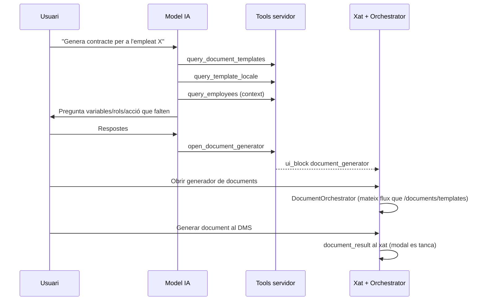

# Flux de generació de documents des del xat IA

**Data:** 2026-06-20  
**Estat:** implementat (fase 1)

**Fase 2 (formularis React al xat):** ajornada — veure [chat_document_generation_phase2_plan.md](./chat_document_generation_phase2_plan.md).

## Problema que resol

La tool antiga `propose_generate_document` + `apply` generava el document al servidor sense passar pel flux de l'app (`DocumentOrchestrator`). Això provocava:

- Errors opacs (p.ex. fitxer DOCX absent a Storage → 500 silenciós)
- Cap control de l'usuari sobre acció de sortida (HTML/PDF/firma)
- La targeta de confirmació tapava la resposta del model

## Flux actual (recomanat)

### Passos del model

1. **Cercar plantilla** — `query_document_templates` (inclou `formatLabel` i `duplicateTemplateNames`)
2. **Llegir esquema** — `query_template_locale` (`requiredVariables`, `signingRoles`, `availableOutputActions`)
3. **Context** — `query_employees`, etc.
4. **Recollir el que falta** — **conversa** amb l'usuari (etiquetes naturals, no codis interns com `generate_pdf`)
5. **Obrir formulari** — `open_document_generator` (NO genera al DMS)
6. L'usuari completa el wizard i prem **«Generar document al DMS»**
7. **Resultat al xat** — missatge assistant amb `document_result` (enllaç PDF / pàgina del document)

### Accions de sortida

El model pregunta amb les etiquetes de `availableOutputActions`. El frontend només mostra PDF si `pdf_enabled` és actiu al tenant.

| Codi intern | Etiqueta usuari (exemple) |
|-------------|---------------------------|
| `generate_html` | Generar HTML al DMS |
| `generate_docx` | Generar Word (DOCX) al DMS |
| `generate_pdf` | Generar PDF al DMS |
| `sign_docuseal` | Enviar a signar (DocuSeal) |
| `sign_native_*` | Firma pròpia (si habilitada) |

### Flux `propose_*` + apply (només casos simples)

- Crear/actualitzar contacte, empleat, extreure dades estructurades
- **No** per generació de documents

## UI al xat (fase 1)

| Element | Comportament |
|---------|--------------|
| `document_generator` | Targeta amb botó «Obrir generador»; es marca com a usada només després d'una generació correcta |
| `document_result` | Èxit/error; «Obrir PDF» en nova pestanya; «Anar a la pàgina del document» → `/documents/:id` |
| Propostes `propose_generate_document` (legacy) | Botó «Obrir generador» (no crida apply) |
| Persistència xat | `sessionStorage`: conversa activa, draft del prompt, generadors consumits per conversa |

## Recollida de dades: conversa vs formularis al xat

| Enfoc | Estat |
|-------|--------|
| **Fase 1** — model pregunta per text, usuari respon, després Orchestrator | **Implementat** |
| **Fase 2** — `ui_blocks` interactius (`entity_picker`, `variable_form`, etc.) | **Ajornat** — [pla](./chat_document_generation_phase2_plan.md) |

## Fitxers clau

| Capa | Fitxer |
|------|--------|
| Tools | `open-document-generator.ts`, `query-template-locale.ts`, `query-document-templates.ts` |
| SQL | `20260630000015_ai_template_locale_details.sql`, `20260701000004_ai_chat_document_result.sql`, `20260702000003_fix_append_ai_chat_assistant_message.sql` |
| UI bloc | `ChatDocumentGeneratorBlock.tsx`, `ChatDocumentResultBlock.tsx` |
| Orchestrator | `DocumentOrchestrator.tsx` (prefill, feedback `onGenerationComplete`) |
| Xat | `ChatPage.tsx`, `chatSessionState.ts` |
| System prompt | `_shared/ai/tools/system-prompt.ts` |
| Validació | `_shared/ai/tools/template-variables.ts` |

## Notes tècniques

- `open_document_generator` valida variables obligatòries, rols i `outputAction` abans d'emetre el ui_block. Si falta alguna cosa, retorna error i el model continua preguntant.
- Per l'Acta EPI: variables `data_lliurament`, `llista_epi` + rol `worker` (empleat); pot existir plantilla HTML i DOCX amb el mateix nom.
- Els `ui_blocks` es persisteixen al missatge assistant (`payload.ui_blocks`).
- Després de generar, `append_ai_chat_assistant_message` afegeix el `document_result` al fil.
