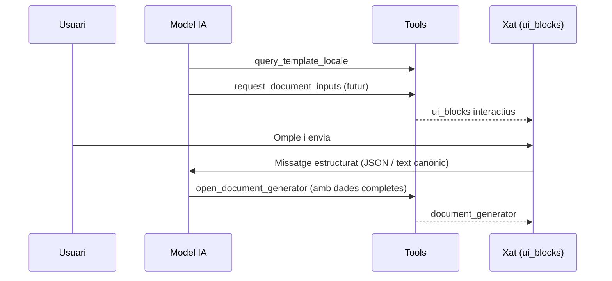

# Generació de documents des del xat — Fase 2 (ajornada)

**Data:** 2026-06-20  
**Estat:** ajornada — no implementar ara  
**Relacionat:** [chat_document_generation_flow.md](./chat_document_generation_flow.md) (fase 1, implementada)

## Decisió

**No es desenvolupa la fase 2 en aquest moment.**

La recollida de dades que falten es manté per **conversa** (system prompt + tools de lectura + validació servidor a `open_document_generator`). La revisió final, variables complexes i la generació al DMS continuen al **`DocumentOrchestrator`**.

## Per què s'ajorna

| Factor | Comentari |
|--------|-----------|
| Duplicació UX | `variable_form` i `role_assignments` al xat repetirien el que ja fa l'Orchestrator |
| Cost d'implementació | Nous `ui_blocks`, tool `request_document_inputs`, estat al client, persistència de respostes parcials, wiring al bucle del model |
| Fase 1 suficient | Amb `availableOutputActions`, validació de variables/rols, `document_generator` + prefill i `document_result` al xat cobreix el flux principal |
| ROI incert | Els problemes vistos en proves (PDF, format HTML/DOCX, feedback) eren d'integració, no de falta de formularis al xat |

## Què inclouria la fase 2 (referència)

### Opció A — Fase 2 completa (no recomanada sense necessitat clara)

El model cridaria una tool `request_document_inputs` que retorna `ui_blocks` interactius; en enviar, el client injecta un missatge estructurat al fil per continuar el raonament.

| Tipus `ui_block` | Ús previst |
|------------------|------------|
| `entity_picker` | Triar empleat/contacte per un rol |
| `role_assignments` | Reutilitzar `RoleAssignmentFields` |
| `variable_form` | Reutilitzar `VarStep` de l'orchestrator |
| `output_action_picker` | Botons HTML / DOCX / PDF / firma (segons tenant) |
| `template_format_picker` | Triar HTML vs DOCX quan hi ha plantilles amb el mateix nom |

**Principi:** no duplicar tot l'Orchestrator al xat — només recollida estructurada; la generació final sempre via `open_document_generator` → `DocumentOrchestrator`.

### Opció B — Fase 2 lite (si algun dia es prioriza)

Implementar **només** els blocs on el text del model falla més:

1. `template_format_picker` — HTML vs DOCX
2. `entity_picker` — cerca d'empleat/contacte per rol
3. `output_action_picker` — opcions filtrades per `get_pdf_converter_config` i signing

**Excloure** `variable_form` al xat: variables manuals (`data_lliurament`, `llista_epi`, etc.) es deixen a l'Orchestrator amb preview.

## Quan replantejar-ho

Tornar a valorar la fase 2 (idealment només la **lite**) si després d'ús real en producció es dona alguna d'aquestes situacions:

- El model confon encara format de plantilla o empleat malgrat prompts i `availableOutputActions`
- Queixes d'usuaris per **masses preguntes** abans d'obrir el generador
- Plantilles amb **moltes variables obligatòries** i errors recurrents en prefill conversacional
- Necessitat de **menys dependència del model** en tries estructurades (sense obrir el modal)

## Esbós tècnic (per quan es faci)

### Tasques aproximades (fase 2 lite)

1. **Esquema** — Ampliar `chartBlock.ts` amb nous tipus + parser manual (Zod 4)
2. **Components** — `ChatTemplateFormatPickerBlock`, `ChatEntityPickerBlock`, `ChatOutputActionPickerBlock`
3. **Tool** — `request-document-inputs.ts` (retorna `ui_blocks`, no obre generador)
4. **Client** — En submit del bloc, `append` missatge usuari amb payload estructurat o text que el model interpreti
5. **System prompt** — Indicar quan usar `request_document_inputs` vs preguntar per text
6. **Tests** — Flux HTML/DOCX duplicat, PDF desactivat, rol empleat

### Fitxers que probablement caldria tocar

| Capa | Fitxers |
|------|---------|
| Tools | `request-document-inputs.ts`, `registry.ts`, `system-prompt.ts` |
| UI | `ChatUiBlockRenderer.tsx`, nous components `Chat*Block.tsx` |
| Esquema | `schemas/chartBlock.ts` |
| Docs | `chat_document_generation_flow.md` |

## Historial

| Data | Canvi |
|------|--------|
| 2026-06-20 | Decisió d'ajornar fase 2 després d'implementar i provar fase 1 (conversa + orchestrator + `document_result`) |
