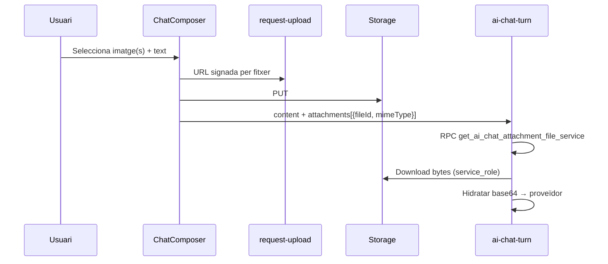
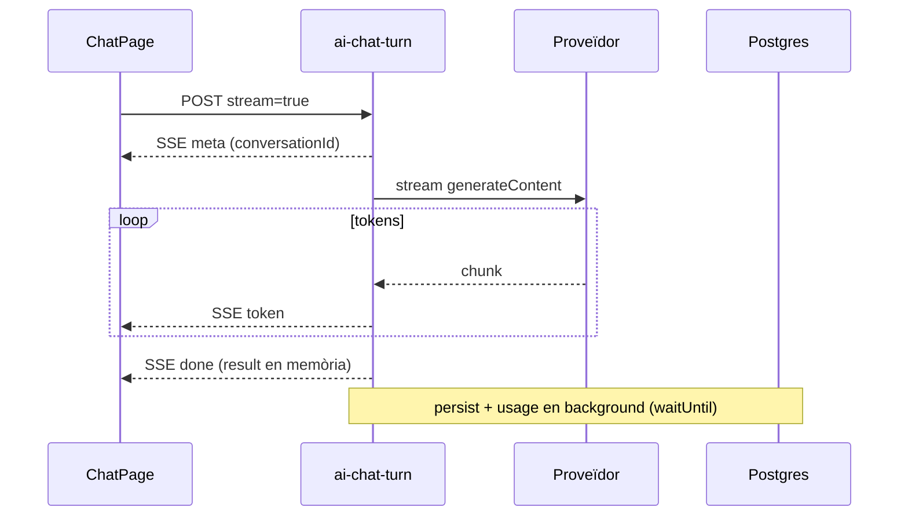

# Pla: Xat multimodal + UX del Assistent IA


**Data:** 2026-06-19 (revisió v3 — inventari post-M5)  

**Estat:** **M1–M5 implementats** al xat multimodal + UX core. Pendent: lifecycle TTL, share link, UI admin capacitats, sync automàtic models.  

**Pla pare:** [`chat_tools_function_calling_plan.md`](chat_tools_function_calling_plan.md) §4.3 *(sincronitzat 2026-06-19)*  

**Prerequisits:** S0–S7 tancats (xat BYOK, tools, propostes, cron)


---


## 1. Visió i principis


L'**Assistent IA** (`/ai/chat`) ha de ser un xat multi-proveïdor BYOK amb:


- Text + **imatges + PDF** i function calling

- Selector de model per conversa

- UX comparable a productes madurs (streaming, títols, regenerar) sense perdre el valor diferencial: **dades del tenant + propostes amb confirmació humana**


### Principi clau: capacitats com a dades, no com a codi


El risc d'obsolescència no és que els models canviïn — és inevitable — sinó que **vision / tools / context** estiguin hardcoded en arrays TypeScript o comentaris al pla.


**Regla:** `ChatModelSelector`, validació d'adjunts i `ai-chat-turn` consulten un **registre de capacitats per model**. Quan surt un model nou o es depreca un vell, s'actualitza una fila (o es valida després d'un sync), no es desplega codi.


---


## 2. Estat actual (inventari)


| Peça | Estat | Notes |

|------|--------|--------|

| Selector model (M1) | ✅ | `ChatModelSelector`, readonly en conversa existent |

| Multimodal imatge | ✅ | Fins a 5 adjunts/missatge; OpenAI, Gemini, OpenRouter |

| PDF (M4) | ✅ | `AiContentPart` type `file`; `unpdf` + PDF natiu Gemini |

| `AiMessage` + `payload.user_parts` | ✅ | Replay via `fileId` + RPC `get_ai_chat_attachment_file_service` |

| Upload | ✅ | `request-upload` / `confirm-upload` (metadata `source: ai-chat`) |

| Validació vision/PDF | ✅ | Registre `ai_model_capabilities` + fallback inferit |

| Registre capacitats model (M2a) | ✅ | Taula + seed + RPC; badges UI |

| Streaming resposta (M2b) | ✅ | SSE; persist en background després de `done` |

| Títol automàtic conversa (M2c) | ✅ | Async després del primer torn (BYOK) |

| Latència per torn (M2c) | ✅ | `payload.latency_ms` + label al bubble assistant |

| Retenció fitxers adjunts (M2c) | ✅ | `delete_ai_conversation` + cron TTL 90d orfes (`20260630000014`) |

| Extracció contacte (M3) | ✅ | `propose_extract_structured_data` + confirmació |

| Regenerar resposta (M5) | ✅ | `prepare_regenerate_ai_chat_turn_service` + botó UI |

| Presets de xat (M5) | ✅ | `ai_chat_presets` + `ChatPresetSelector` + CRUD RPC |

| Share link read-only | ✅ | `share_token` + `/ai/chat/s/:token` (dins tenant) |

| TTL orfes `source: ai-chat` | ✅ | `cleanup_orphan_ai_chat_attachments` + pg_cron 04:00 UTC |

| Avís quota al composer | ✅ | Banner al `ChatComposer` (85% warn, 100% block adjunts) |

| UI admin capacitats model | ❌ | Només seed SQL; formulari admin-portal pendent |

| Sync automàtic `/models` | ❌ | Futur; patró `needs_review` al registre |


---


## 3. Registre de capacitats de model


### 3.1 Problema actual


La «matriu orientativa» §3.3 del pla v1 (OpenAI vision sí, Anthropic…) era documentació, no dades consultables. El codi duplica lògica similar a `providerSupportsVision()` i `providerSupportsChatVision()`.


### 3.2 Disseny proposat


Nova taula **`data.ai_model_capabilities`** (nivell plataforma + override tenant opcional):


```typescript

type AiModelCapabilities = {

  provider: AiProvider           // 'openai' | 'gemini' | ...

  model_id: string               // 'gpt-4o', 'google/gemini-2.0-flash', ...

  vision: boolean

  tools: boolean

  tools_with_vision: boolean     // cas crític §3.3 original

  streaming: boolean

  max_image_size_mb: number      // default 5

  supported_image_mimes: string[] // ['image/jpeg', ...]

  context_window: number | null

  deprecated_at: timestamptz | null

  needs_review: boolean          // sync automàtic ha detectat model nou

  source: 'platform' | 'tenant_override' | 'manual'

}

```


**Relació amb l'existent:**


| Camp actual | Rol |

|-------------|-----|

| `tenant_ai_provider_config.available_models` | Llista de models que el tenant **pot** usar (sync proveïdor) |

| `tenant_ai_provider_config.enabled_models` | Whitelist tenant |

| `effective_ai_allowed_models()` | Intersecció tenant × membre |

| **`ai_model_capabilities`** | **Metadata** per validar adjunts, badges UI, streaming, tools+vision |


**Consulta efectiva per al xat:**


```sql

effective_model_capabilities(tenant_id, provider, model_id)

→ merge platform row + tenant override (si existeix)

```


### 3.3 Manteniment (dues vies)


1. **Manual (admin-portal / platform):** formulari per editar capacitats per `model_id`. Cost baix, control total.

2. **Sync automàtic (futur):** cron que crida `/models` del proveïdor, insereix files `needs_review = true` fins que un admin les validi (patró LibreChat).


**Seed inicial:** migració amb ~15–20 models coneguts (gpt-4o, gpt-4o-mini, gemini flash/pro, claude-3.5+) per desbloquejar M2b sense esperar UI admin.


### 3.4 Consum al codi


| On | Abans | Després |

|----|--------|---------|

| `ChatModelSelector` | — | Badge «Imatges» / «Eines» des de capabilities |

| `ChatPage` handleAttach | `providerSupportsChatVision(provider)` | `capabilities.vision` del model triat |

| `ai-chat-turn` | `providerSupportsVision()` | mateix registre; error clar si `vision=false` |

| Tool loop amb adjunts | implícit | Si `tools_with_vision=false` → mode lectura (sense tools) + avís |


---


## 4. Arquitectura tècnica (missatges i adjunts)


### 4.1 Model de missatge (implementat)


```typescript

type AiContentPart =

  | { type: 'text'; text: string }

  | { type: 'image'; mimeType: string; fileId: string; name?: string; storageKey?: string }

  | { type: 'file'; mimeType: string; fileId: string; name?: string }  // PDF — M4


type AiMessage = {

  role: 'system' | 'user' | 'assistant' | 'tool'

  content: string | AiContentPart[]

  // toolCalls, uiBlocks, geminiModelParts...

}

```


**Persistència BD:**


- `content`: text pla («[Imatge adjunta]» + caption)

- `payload.user_parts`: replay exacte

- `payload.attachments`: metadades UI (`fileId`, `mimeType`, `name`)

- `payload.latency_ms`, `payload.model_snapshot`: latència i model del torn ✅

- `ai_conversations.metadata`: preset (`presetId`, `presetName`, `custom_system_prompt`, `temperature_override`) ✅ M5


### 4.2 Flux upload (implementat)





- Reutilitza drive tenant (`tenant-files`); metadata `source: ai-chat`

- Edge **no** rep base64 del client

- RPC **`get_ai_chat_attachment_file_service`** (service_role) — no consultar `api.file_nodes` directament


### 4.3 Adjunts múltiples (canvi respecte v1)


| v1 pla | v2 pla |

|--------|--------|

| 1 imatge a M2; múltiples a M4 | **Fins a 5 imatges a M2a** (canvi de constant; mateixa arquitectura) |


Casos d'ús: comparar dues captures, rebut + DNI, etc. Cost marginal respecte al que ja està implementat.


### 4.4 Lifecycle, quota i retenció de fitxers (M2c)


**Context billing:** els tenants tenen un **pla** (`data.plans.max_storage_mb`) amb override opcional (`data.tenant_storage_limits.internal_quota_gb`). L'ús es comptabilitza a **`data.storage_usage`**: `committed_bytes` + `reserved_bytes` (Drive / `file_nodes`) més la part Documents. La vista **`api.tenant_entitlements`** exposa `effective_quota_bytes`, `drive_used_bytes` i el total.


**Adjunts del xat i quota (ja implementat):**


| Pas | Què passa amb la quota |

|-----|------------------------|

| `request-upload` | Reserva bytes (`reserved_bytes` ↑) després de `api.check_upload_eligibility` |

| `confirm-upload` | Passa a `committed_bytes`; allibera la reserva |

| Pujada rebutjada / quota plena | Error abans de consumir espai (mateix flux que Drive) |

| Esborrar conversa (M2c) | Eliminar `file_nodes` adjunts → **`committed_bytes` ↓** via pipeline existent |


Els adjunts **no són storage «gratuït»** fora del pla: ocupen la mateixa quota que qualsevol fitxer del tenant. Metadata `source: ai-chat` serveix per **lifecycle** (neteja, TTL, informes), no per excloure'l del comptador.


**Problemes oberts (lifecycle, no quota):**


1. Upload es confirma **abans** d'enviar el missatge → fitxer orfe si l'usuari cancel·la (bytes ja comptats fins a TTL/neteja).

2. Converses antigues acumulen imatges sense política de retenció.


**Política proposada:**


| Esdeveniment | Acció | Efecte quota |

|--------------|--------|--------------|

| Usuari elimina preview abans d'enviar | Només blob pending si no s'ha confirmat; si ja confirmat → orfe fins TTL | Reserva alliberada o bytes orfes |

| Missatge enviat | `payload.attachments[].fileId` enllaça el node | Bytes comptats (normal) |

| Esborrar conversa | `delete_ai_conversation` → esborrar nodes adjunts | **`committed_bytes` disminueix** |

| Retenció global | TTL 90 dies per nodes `metadata.source = 'ai-chat'` sense referència activa (cron) | Alliberament periòdic |


**Implementació (M2c):** `delete_ai_conversation` i el cron TTL comparteixen `data.extract_ai_chat_attachment_ids_from_payload` (`attachments` + `user_parts`). Orfe = `metadata.source = 'ai-chat'`, `processing_status = 'done'`, sense referència en converses `active`/`archived`, `created_at < now() - 90 days`. Cron: `cleanup_orphan_ai_chat_attachments` → `hard_delete_node` → `trash_deletion_queue`. **No cal duplicar** quota: reutilitzar `request-upload` / `confirm-upload` / `process-deletion-queue`.


**UI (opcional M2c):** avís al composer si la quota està prop del límit (`tenant_entitlements`); enllaç a Configuració → Emmagatzematge.


### 4.5 Streaming (M2b) ✅ + hardening post-M5


**Implementat:**


- Body `stream: true` → SSE (`event: token|tool_start|tool_end|meta|done|error`)

- Client: `readChatTurnStream` + bubble assistant en viu (`streamDisplay`, spinner `Loader2`)

- Fallback sync si `capabilities.streaming=false`


**Millores post-desplegament (2026-06-19):**


| Problema | Solució |

|---------|--------|

| Isolate edge ~87s (`early termination`) tancava el flux abans de `done` | En stream: enviar **`done` abans** de persistir; BD + usage en background (`EdgeRuntime.waitUntil`) |

| `ERR_INCOMPLETE_CHUNKED_ENCODING` + toast «Network error» | Client recupera resposta si ja té `conversationId` + tokens |

| Bubble user duplicat / resposta que desapareix | `pendingAssistantCommit` fins commit BD; dedupe user consecutius; no invalidar sidebar al `meta` |





### 4.6 Regenerar resposta (M5) ✅


**UX:** botó «Regenerar resposta» sota l'últim missatge assistant (`ChatThread`).


**Backend (implementat):**


1. RPC `prepare_regenerate_ai_chat_turn_service`:

   - Troba últim missatge `user` per `sequence`

   - Expira propostes `pending` del torn

   - **DELETE** missatges `assistant`/`tool` amb `sequence > last_user_seq`

   - Retorna `start_sequence`, `has_attachments`

2. `ai-chat-turn` amb `regenerate: true`: no crea missatge user; reutilitza historial hidratat

3. Client: reutilitza pipeline SSE; invalida missatges/propostes al `meta.regenerated`


**Fix conegut:** `startSequence` assistant = `user_seq + 1` (torn normal) vs `start_sequence` RPC (regenerar).


### 4.7 Títol automàtic de conversa (M2c) ✅


Després del **primer torn** complet, crida ràpida al model (mateix BYOK, `maxTokens: 30`) i UPDATE `ai_conversations.title` via `update_ai_conversation_title_service`.


- Async (`EdgeRuntime.waitUntil`): no bloqueja la UI

- Sidebar es refresca amb delay si `autoTitlePending`

- Fallback: truncament actual si la crida falla


### 4.8 Presets de xat (M5) ✅ — LibreChat-inspired


Taula **`data.ai_chat_presets`** + vista **`api.ai_chat_presets`**:


```typescript

{

  id, tenant_id, created_by,

  name,

  provider, model,

  system_prompt_override,

  temperature_override,

  is_tenant_shared,

}

```


**UI:** `ChatPresetSelector` al header (al costat de `ChatModelSelector`).


| Acció | Comportament |

|--------|------------|

| Triar preset | Omple provider/model abans del primer missatge |

| Desar preset | Captura model + instruccions + temperatura actuals |

| Preset compartit | Només owner/manager (`is_tenant_shared`) |


**Backend:** `presetId` al primer torn → metadata a `ai_conversations` (`presetId`, `presetName`, `custom_system_prompt`, `temperature_override`). RPCs: `upsert_ai_chat_preset`, `delete_ai_chat_preset`, `get_ai_chat_preset_service`.


**Fix conegut:** `GRANT SELECT ON data.ai_chat_presets` (vista `security_invoker`).


### 4.9 Extensibilitat futura (no V1)


| Feature | On viu | Estat |

|---------|--------|--------|

| Fork conversa | Nova `conversation_id` + `forked_from_message_sequence` | ❌ Backlog |

| Compartir read-only (tenant) | `ai_conversations.share_token` + RPC lectura | ✅ M6 |

| System prompt per conversa | `ai_conversations.metadata.custom_system_prompt` | ✅ via presets M5 |

| Latència per torn | `payload.latency_ms` | ✅ M2c |


---


## 5. Fases d'entrega (roadmap revisat)


### Resum prioritats (impacte / cost)


| Prioritat | Item | Fase | Estat |

|-----------|------|------|--------|

| 1 | **Streaming** | M2b | ✅ |

| 2 | **Registre capacitats model** | M2a | ✅ |

| 3 | **Títol automàtic** | M2c | ✅ |

| 4 | **N adjunts (3–5)** | M2a | ✅ |

| 5 | **Presets xat** | M5 | ✅ |

| 6 | **Retenció fitxers** | M2c | ✅ parcial |

| 7 | **Regenerar resposta** | M5 | ✅ |

| 8 | Extracció estructurada §4.3 | M3 | ✅ |

| 9 | PDF | M4 | ✅ |


---


### M1 — Selector provider/model ✅ (2026-06-30)


- [x] `ChatModelSelector` + i18n

- [x] `sendChatTurn({ provider, model })`

- [x] Readonly en conversa existent

- [x] Filtre `allowed_models` via `get_ai_user_access`


---


### M2a — Consolidació multimodal + capacitats ✅ (2026-06-19)


- [x] Upload + imatges (baseline → 5 adjunts)

- [x] RPC adjunts + hidratació proveïdor

- [x] Sanitització esquemes Gemini (`const` / `anyOf`)

- [x] Taula `ai_model_capabilities` + seed + RPC consulta

- [x] Substituir `providerSupportsVision` hardcoded per registre

- [x] **Fins a 5 imatges/PDF** per missatge (client + `CHAT_ATTACHMENTS_MAX`)

- [x] Badges al `ChatModelSelector` des de capabilities

- [ ] UI admin-portal per editar capacitats (backlog)

- [ ] Sync automàtic `/models` → `needs_review` (backlog)


---


### M2b — Streaming ✅ (2026-06-17, hardening 2026-06-19)


- [x] SSE a `ai-chat-turn` (`stream: true` al body)

- [x] Adaptadors stream OpenAI + Gemini (+ OpenRouter)

- [x] Client: consum SSE + bubble assistant en viu

- [x] Respectar `capabilities.streaming`; fallback sync

- [x] Gemini amb tools: round sync (preserva `geminiModelParts`); text stream quan no hi ha tools

- [x] Persist en background post-`done` (evita timeout isolate ~87s)

- [x] Recuperació client si el flux es talla amb tokens parcials

- [x] UX: dedupe bubble user, `pendingAssistantCommit`, spinner en lloc de cursor


---


### M2c — Polish UX + lifecycle ✅ (2026-06-19)


- [x] Títol automàtic després del primer torn

- [x] `payload.latency_ms` + mostrar durada al bubble assistant

- [x] Esborrar file_nodes adjunts en `delete_ai_conversation` (allibera quota)

- [x] TTL 90 dies per orfes `source: ai-chat` (`20260630000014`, pg_cron 04:00 UTC)

- [x] (Opcional) Avís quota prop del límit al composer


---


### M3 — Tools + multimodal (§4.3 contacte des d'imatge) ✅ (2026-06-19)


- [x] Tool + schema Zod contacte

- [x] Apply via `create_contact_for_ai_service`

- [x] Validació `tools_with_vision` del registre

- [x] Tools orientats a extracció + preview UI (`ChatProposalCard`)


---


### M4 — PDF ✅ (2026-06-19)


- [x] Primera pàgina com text extret (OpenAI/OpenRouter) o PDF natiu (Gemini)

- [x] `AiContentPart` type `file`

- [x] Límits MIME/size al registre de capacitats (`supported_file_mimes`, `max_file_size_mb`)

- [x] Client: preview `FileText`, badge PDF al selector


---


### M5 — Funcionalitat xat avançada ✅ (2026-06-19)


- [x] Regenerar última resposta (`prepare_regenerate_ai_chat_turn_service` + botó UI)

- [x] Presets (`ai_chat_presets` + `ChatPresetSelector` + CRUD RPC)

- [x] `ensure_ai_conversation_service` amb metadata preset

- [x] share link read-only dins tenant (`20260702000001`)

- [ ] Mostrar nom preset a converses existents (llegir `metadata.presetName`)


---


## 6. Què NO fer (v2)


- No mantenir llistes `VISION_MODELS` al codi — només `ai_model_capabilities`.

- No bloquejar múltiples imatges (M2a ja desplegat; PDF a M4).

- No implementar fork de conversa a V1.

- No enviar base64 al body de `ai-chat-turn`.

- No duplicar el panell sencer de `/settings/ai` al composer.

- No implementar §4.3 abans del registre de capacitats + streaming (UX extracció).


---


## 7. Relació amb §4.3 del pla principal


| Original | Fase | Estat |

|----------|------|--------|

| Puja imatge/PDF | M2a / M4 | ✅ Imatge + PDF |

| Xat multimodal | M2a–M2b | ✅ |

| Presets + regenerar | M5 | ✅ |

| `propose_extract_structured_data` | M3 | ✅ |

| Apply contacte | M3 | ✅ Reutilitza `create_contact_for_ai_service` |


---


## 8. Proves


| Cas | Resultat esperat |

|-----|------------------|

| Model sense `vision` al registre + adjunt | Error abans d'enviar (client + Edge) |

| 3 imatges + «compara» | Totes arriben al model (M2a) |

| Gemini + tools + imatge | OK si `tools_with_vision=true` |

| Stream activat | Text apareix incrementalment |

| Eliminar conversa | Adjunts chat esborrats del drive (M2c) |

| Regenerar | Nova resposta assistant; mateix user message; propostes pending expirades |

| Preset + nou xat | Provider/model/instruccions del preset; metadata persistida |

| Stream llarg (>60s) | `done` arriba abans de persistir; sense toast network error |

| Presets CRUD | Owner/manager pot compartir; GRANT `data.ai_chat_presets` |

| Model deprecated | No apareix al selector; converses antigues readonly |


---


## 9. Referències codi


| Àrea | Path |

|------|------|

| UI xat | `apps/tenant-portal/src/features/ai-chat/` |

| Pàgina xat | `…/pages/ChatPage.tsx` |

| Presets UI | `…/components/ChatPresetSelector.tsx` |

| API client | `…/api/chatApi.ts` |

| Turn Edge | `supabase/functions/ai-chat-turn/` |

| Chat store | `supabase/functions/_shared/ai/chat-store.ts` |

| Streaming SSE | `supabase/functions/_shared/ai/sse.ts`, `stream-providers.ts` |

| Adjunts + PDF | `…/chat-attachments.ts`, `pdf-processor.ts` |

| Títol automàtic | `…/conversation-title.ts` |

| Extracció M3 | `…/tools/propose-extract-structured-data.ts` |

| Capacitats model | `…/model-capabilities.ts`, `useAiModelCapabilities.ts` |


### Migracions rellevants


| Migració | Contingut |

|----------|-----------|

| `20260628000001` | Fase 1: converses, missatges, propostes |

| `20260630000007` | `ai_model_capabilities` (M2a) |

| `20260630000009` | Títol automàtic, latència, neteja adjunts (M2c) |

| `20260630000010` | `propose_extract_structured_data` (M3) |

| `20260630000011` | PDF multimodal (M4) |

| `20260630000012` | Presets + regenerar (M5) |

| `20260630000013` | Fix GRANT presets |


---


## 10. Pendent / backlog (post-M5)


| Prioritat | Item | Notes |

|-----------|------|--------|

| Baixa | Nom preset a conversa existent | Llegir `metadata.presetName` al header |

| Mitjana | UI admin capacitats model | Formulari admin-portal per `ai_model_capabilities` |

| Mitjana | Sync automàtic `/models` | Cron → files `needs_review=true` |

| Baixa | Fork conversa | Fora abast v1 |


---


## 11. Següent pas recomanat


El **core multimodal M1–M5 està tancat**. Opcions de continuació:


1. **Enterprise** — share link read-only o UI admin capacitats (segons [`Enterprise Readiness.md`](../../product-design/Enterprise%20Readiness.md))

2. **MCP server** — exposar tools del xat via MCP (vege [`plan_mcp_server.md`](../mcp_server/plan_mcp_server.md))


