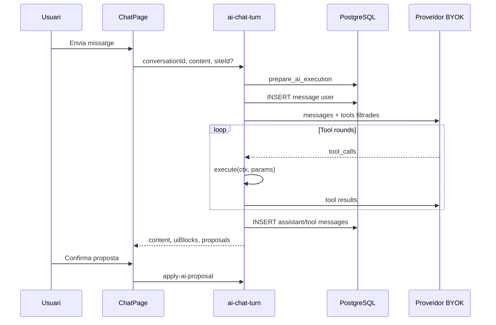
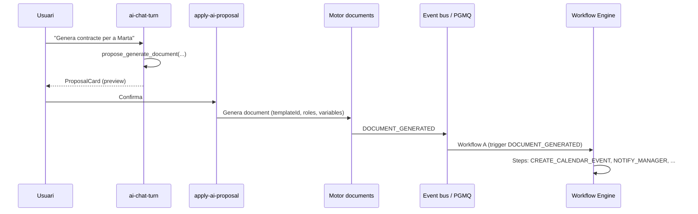
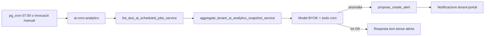

# Pla d'implementació: Function Calling i Xat IA

**Data:** 2026-06-19 (actualitzat 2026-06-19 — sync M1–M5)  
**Estat:** S0–S7 + **M1–M5** tancats — MVP xat + tools + cron + xat multimodal complet  
**Base existent:** BYOK Enterprise v2 (`tenant_byok_enterprise_v2.md`), Edge `generate-ai-content`, Vault, `ai_usage_ledger`, RBAC JWT  
**Referència externa (no copiar esquemes):** `Sistema d'IA multi-tenant.md` (Firebase/Data Connect)  
**Multimodal + UX xat (detall):** [`chat_multimodal_plan.md`](chat_multimodal_plan.md) — revisió v3  
**MCP (fora d'aquest pla):** servidor públic → [`plan_mcp_server.md`](../mcp_server/plan_mcp_server.md); connectors MCP al xat → no planificat (Fase 5)

---

## 0. Inventari del que ja tenim (Supabase)

| Capa | Estat actual | Fitxers / taules |
|------|--------------|------------------|
| BYOK 4 proveïdors | ✅ | `data.tenant_ai_provider_config`, `save-tenant-api-key` |
| Generació simple | ✅ | `generate-ai-content`, `_shared/ai/run.ts` |
| Governança bàsica | ✅ | `get_ai_user_access`, `check_and_increment_ai_rate_limit` |
| Ús i límits | ✅ Parcial | `ai_usage_ledger`, `ai_rate_windows` (hour/day), **sense tokens/day** |
| Polítiques membre | ✅ Parcial | `tenant_ai_user_policy` (allow/warn/block + límits h/d) |
| Models | ✅ Parcial | `available_models` (sync), `suggested_models` (plataforma), **sense whitelist tenant** |
| RBAC app | ✅ | `data.jwt_has_permission`, `PermissionKey` (sense claus `ai.*`) |
| Xat / tools | ✅ | `ai-chat-turn`, `ai-chat-apply-proposal`, `packages/ai-schemas`, `/ai/chat` |
| Xat multimodal (M1–M5) | ✅ | Imatges (5), PDF, streaming SSE, presets, regenerar — veure [`chat_multimodal_plan.md`](chat_multimodal_plan.md) |
| Capacitats model | ✅ | `data.ai_model_capabilities` + RPC + badges UI |
| Admin-portal | ✅ | `platform_ai_defaults`, visibilitat tenant AI, `AiProviderNav`, prova connexió |

**Principis que mantenim:** claus només via Vault + `service_role`; cap secret al client; un sol pipeline de governança abans del proveïdor; auditoria append-only.

**Principi addicional (tools):** **mai escriure descripcions d'eines a mà** — Zod és la Single Source of Truth (SSOT) per a paràmetres, descripcions i tipus; el JSON Schema del model es genera automàticament.

---

## 0.1 Millores UI/UX settings IA (S0 — ✅ implementat)

> La majoria d'aquesta secció es va desplegar a **S0**. Es manté com a referència de disseny.

### `/settings/ai` → pestanya Configuració

```
┌─────────────────────────────────────────────────────────────┐
│ [Configuració] [Ús i límits] [Membres]                       │
├─────────────────────────────────────────────────────────────┤
│ Proveïdor per defecte (select global)                         │
│ ┌──────────┬──────────────────────────────────────────────┐ │
│ │ OpenAI   │  Secció del proveïdor actiu (vertical nav)    │ │
│ │ Anthropic│  1. API key                                   │ │
│ │ Gemini   │  2. [Desar {proveïdor}]  ← clau + model + URL │ │
│ │ OpenRouter│ 3. Model per defecte (sota la clau)          │ │
│ │          │  4. Models permesos (multi-select)            │ │
│ │          │  5. Paràmetres de generació                   │ │
│ │          │  6. Prova de connexió                         │ │
│ └──────────┴──────────────────────────────────────────────┘ │
└─────────────────────────────────────────────────────────────┘
```

| Canvi | Detall |
|-------|--------|
| **Nav vertical per proveïdor** | Component `AiProviderNav` (estil sidebar, no confondre amb tabs horitzontals de pàgina) |
| **Ordre dels camps** | API key → botó «Verificar i desar» → model per defecte → models permesos |
| **Un sol «Desar» principal** | Eliminar «Desar paràmetres» separat; paràmetres de generació es desen amb el mateix flux o auto-save al desar proveïdor |
| **Prova de connexió** | Textarea prompt (default «Prova»); botó «Provar»; mostra payload enviat + resposta + raw JSON desplegable |
| **No cal model desat** | La prova envia valors del formulari actual (model seleccionat, system prompt, temperature, max tokens) |

### Edge: `POST /functions/v1/test-ai-connection` (o flag a `generate-ai-content`)

```typescript
// Body
{
  provider: AiProvider
  model: string
  systemPrompt?: string | null
  temperature?: number
  maxTokens?: number
  userPrompt: string          // default "Prova"
  includeRaw?: boolean        // true per UI debug
}

// Response
{
  request: { provider, model, temperature, maxTokens, systemPrompt, userPrompt }
  content: string
  usage: { ... }
  raw?: unknown               // resposta JSON del proveïdor (només managers/owners)
}
```

Reutilitza `runAiGeneration` amb `feature: 'connection_test'` i clau BYOK del tenant (verificada o temporal del formulari si es prova abans de desar — **només** amb clau nova al body, mai persistida).

**Sanitització de logs:** les respostes d'error del proveïdor poden incloure fragments de clau o headers. Abans d'escriure a `ai_usage_ledger` o retornar al client:

- `sanitizeProviderError(message)` — redactar patrons `sk-...`, `Bearer ...`, etc.
- Mai persistir `apiKey` del body de la prova; només `provider` + hash curt (`sha256` 8 chars) per correlació debug
- `includeRaw: true` només per owner/manager i mai en logs d'auditoria de plataforma

### Models permesos (tenant)

- **Disponibles:** `tenant_ai_provider_config.available_models` (sync API)
- **Permesos (whitelist):** nova columna `enabled_models text[]` — subconjunt triat pel tenant; buit = tots els disponibles
- **Efectiu per usuari:** intersecció `enabled_models` ∩ `user.allowed_models[provider]`; si usuari buit → hereta tenant

### Límit tokens/dia

- `tenant_ai_config.rate_limit_tokens_per_day integer DEFAULT 500000`
- `tenant_ai_user_policy.custom_tokens_daily_limit integer`
- Ampliar `ai_rate_windows` amb `window_kind = 'tokens_day'` o comptador a `ai_usage_daily` + check abans de cridar proveïdor

### `/settings/members` — modal IA per membre

Modal «Configuració IA» per fila de membre:

- Toggle **IA habilitada** (override de `tenant_ai_user_policy` / nova columna `ai_enabled boolean`)
- Per cada proveïdor configurat al tenant: multi-select **models permesos** (opcions = `enabled_models` del tenant)
- Herència explícita: «Hereta del tenant» vs personalitzat

---

## Fase 1: Esquemes i seguretat

**Objectiu:** fonaments de dades, governança unificada i RBAC per IA abans de tools o xat.

### 1.1 Noves taules — Xat (escriptura només Edge)

```sql
-- Converses
CREATE TABLE data.ai_conversations (
  id              uuid PRIMARY KEY DEFAULT gen_random_uuid(),
  tenant_id       uuid NOT NULL REFERENCES data.tenants(id) ON DELETE CASCADE,
  site_id         uuid REFERENCES data.sites(id) ON DELETE SET NULL,
  user_id         uuid NOT NULL,
  title           text,
  provider        data.ai_provider NOT NULL,
  model           text NOT NULL,
  status          text NOT NULL DEFAULT 'active'
    CHECK (status IN ('active', 'archived', 'deleted')),
  metadata        jsonb NOT NULL DEFAULT '{}',
  created_at      timestamptz NOT NULL DEFAULT now(),
  updated_at      timestamptz NOT NULL DEFAULT now()
);

CREATE INDEX idx_ai_conversations_tenant_user
  ON data.ai_conversations (tenant_id, user_id, updated_at DESC);

-- Missatges (ordre per sequence)
CREATE TABLE data.ai_conversation_messages (
  id               uuid PRIMARY KEY DEFAULT gen_random_uuid(),
  conversation_id  uuid NOT NULL REFERENCES data.ai_conversations(id) ON DELETE CASCADE,
  tenant_id          uuid NOT NULL REFERENCES data.tenants(id) ON DELETE CASCADE,
  sequence           integer NOT NULL,
  role               text NOT NULL CHECK (role IN ('system', 'user', 'assistant', 'tool')),
  content            text,
  tool_call_id       text,
  tool_name          text,
  payload            jsonb NOT NULL DEFAULT '{}',
  created_at         timestamptz NOT NULL DEFAULT now(),
  UNIQUE (conversation_id, sequence)
);

CREATE INDEX idx_ai_messages_conversation
  ON data.ai_conversation_messages (conversation_id, sequence);
```

**RLS:** SELECT només fila pròpia (`user_id = auth.uid()`) dins tenant actiu; INSERT/UPDATE/DELETE **denegat** a `authenticated` (només Edge amb `service_role`).

### 1.2 Ampliació governança tenant / usuari

```sql
ALTER TABLE data.tenant_ai_provider_config
  ADD COLUMN IF NOT EXISTS enabled_models text[] NOT NULL DEFAULT '{}';
  -- '{}' = sense restricció explícita (equivalent a tots available)

ALTER TABLE data.tenant_ai_config
  ADD COLUMN IF NOT EXISTS rate_limit_tokens_per_day integer NOT NULL DEFAULT 500000;

ALTER TABLE data.tenant_ai_user_policy
  ADD COLUMN IF NOT EXISTS ai_enabled boolean,  -- NULL = hereta (tenant actiu)
  ADD COLUMN IF NOT EXISTS allowed_models jsonb NOT NULL DEFAULT '{}',
  -- { "openai": ["gpt-4o-mini"], "openrouter": ["openai/gpt-4o-mini"] }
  ADD COLUMN IF NOT EXISTS custom_tokens_daily_limit integer;
```

### 1.3 Propostes d'escriptura (confirmació humana)

```sql
CREATE TABLE data.ai_action_proposals (
  id              uuid PRIMARY KEY DEFAULT gen_random_uuid(),
  tenant_id       uuid NOT NULL REFERENCES data.tenants(id) ON DELETE CASCADE,
  site_id         uuid REFERENCES data.sites(id) ON DELETE SET NULL,
  user_id         uuid NOT NULL,
  conversation_id uuid REFERENCES data.ai_conversations(id) ON DELETE SET NULL,
  tool_name       text NOT NULL,
  proposal_token  text NOT NULL UNIQUE,  -- HMAC + jti + exp
  payload         jsonb NOT NULL,
  status          text NOT NULL DEFAULT 'pending'
    CHECK (status IN ('pending', 'applied', 'rejected', 'expired')),
  applied_at      timestamptz,
  applied_by      uuid,                   -- qui va confirmar (pot coincidir amb user_id)
  idempotency_key text,                   -- opcional: hash(payload) per deduplicar UI
  created_at      timestamptz NOT NULL DEFAULT now()
);
```

#### Semàntica d'`apply` — idempotència i pestanyes duplicades

| Escenari | Comportament |
|----------|--------------|
| Primer `apply` vàlid | `UPDATE ... WHERE status = 'pending'` (atòmic) → `applied`; executa handler `apply_*` |
| Segon `apply` mateix token | **Idempotent informatiu:** HTTP 200 amb `{ status: 'already_applied', appliedAt }` — no error genèric |
| Token expirat | `410` / codi `PROPOSAL_EXPIRED` |
| Token invàlid o HMAC incorrecte | `403` / `PROPOSAL_INVALID` |
| Usuari diferent del creador | Denegat tret que tingui el mateix permís d'escriptura (`employees.edit`, etc.) |

**Dues pestanyes amb la mateixa `ProposalCard`:** és acceptable. Ambdós botons criden `apply-ai-proposal`; només el primer guanya la condició `pending`; el segon rep `already_applied` i la UI mostra «Ja s'ha aplicat» (refetch missatges).

**Escriptures no idempotents per naturalesa** (p.ex. «enviar notificació»): el handler `apply_*` ha de ser segur en reintent — o bé la proposta inclou `idempotency_key` i el handler comprova si l'efecte ja existeix abans d'actuar.

**Token:** `proposal_token` = signatura HMAC del payload + `jti` (UUID) + `exp`; el `jti` es marca consumit en passar a `applied` (no es reutilitza el token).

### 1.4 RPC central de governança

Nova funció `api.prepare_ai_execution(p_tenant_id, p_user_id, p_site_id, p_feature, p_provider, p_model, p_estimated_tokens)`:

1. Membre actiu del tenant (+ site si cal)
2. `tenant_ai_config.is_active` i addon
3. Política usuari (`ai_enabled`, block/warn)
4. Model dins `effective_allowed_models(tenant, user, provider)`
5. Rate limits: requests/h, requests/d, **tokens/d**
6. Retorna `{ allowed: true, warnings: [...] }` o llança excepció + log `blocked_*`

**Fitxer Edge:** `_shared/ai/governance.ts` — extracció de `usage.ts` + nous checks.

### 1.5 Permisos RBAC nous (V1 simplificat — YAGNI)

Per V1, consolidar granularitat fins que hi hagi demanda real de «xat sense consultar empleats»:

```typescript
| 'ai.use'           // xat, generació i tools de lectura internes
| 'ai.configure'     // /settings/ai (owner/manager)
| 'ai.tools.write'   // propostes d'escriptura (confirmació humana)
// Opcional futur (MCP al xat fora d'aquest pla — veure Fase 5):
// | 'ai.mcp.use'       // només si es reimplementa connectors MCP al xat
// | 'ai.mcp.configure'
```

**Nota:** `ai.tools.read` no existeix a V1 — queda absorbit per `ai.use`. Les tools de domini segueixen filtrant-se per permisos existents (`members.view`, `employees.edit`, etc.).

Mapeig per rol base (V1):

| Rol | Permisos IA |
|-----|-------------|
| viewer | `ai.use` (opcional per tenant — desactivat per defecte si cal) |
| member | `ai.use` |
| manager | + `ai.configure`, `ai.tools.write` |
| owner | `*` |

Eines amb `requiredPermission: 'employees.edit'` es filtren **addicionalment** via `data.jwt_has_permission(tenant_id, key, site_id)`.

**Expansió futura:** si un tenant demana «xat genèric sense dades HR», afegir `ai.tools.read` com a permís separat i filtrar el registry en conseqüència.

### 1.6 Context segur (mai al schema del model)

```typescript
// supabase/functions/_shared/ai/tools/types.ts
export type ToolExecutionContext = {
  tenantId: string
  siteId: string | null
  userId: string
  userRole: 'owner' | 'manager' | 'member' | 'viewer'
  permissions: string[]  // resolt del JWT o RPC
  conversationId?: string
  feature: 'chat' | 'content' | 'connection_test' | 'cron_analytics'
}
```

**Regla:** cap camp `tenant_id`, `site_id` o `user_id` als `parameters` JSON Schema exposats al model.

---

## Fase 2: Motor de Function Calling

**Objectiu:** registre d'eines, bucle model↔tools, adaptadors per proveïdor.

### 2.0 Filosofia SSOT amb Zod (l'«art» del tool calling)

El manteniment de les tools és el punt més fràgil del sistema: si el model rep schemas desactualitzats o descripcions escrites a mà, **al·lucina camps inexistents** o ignora columnes noves. La solució no és «actualitzar el prompt» sinó **sincronitzar automàticament** esquema de domini ↔ esquema d'eina ↔ codi d'execució.

#### Regla d'or

| ❌ Mai | ✅ Sempre |
|--------|----------|
| `description: 'Busca empleats per nom...'` escrit a mà | `.describe('...')` als camps Zod o al `z.object({...})` |
| JSON Schema copiat de la BD | `zodToJsonSchema()` / `jsonSchema()` del Vercel AI SDK |
| Arguments tool sense validar | `schema.parse(args)` abans d'executar |
| Duplicar tipus TS i Zod | `type Params = z.infer<typeof schema>` |

#### Flux de sincronització

```
┌─────────────────────┐     pick / omit      ┌──────────────────────┐
│ Domain Zod Schema   │ ───────────────────► │ Tool Input Schema    │
│ (employeeSchema,    │     .describe()      │ (subset segur, sense │
│  documentSchema…)   │     .default()       │  tenant_id)          │
└──────────┬──────────┘                      └──────────┬───────────┘
           │                                            │
           │ canvi columna internal_notes               │ zodToJsonSchema
           ▼                                            ▼
┌─────────────────────┐                      ┌──────────────────────┐
│ TypeScript error a  │                      │ JSON Schema al model │
│ execute() si no     │                      │ (OpenAI / Anthropic / │
│ mapeja el camp nou  │                      │  Gemini netejat)     │
└─────────────────────┘                      └──────────────────────┘
```

**Exemple:** si afegiu `internal_notes` a la taula d'empleats:

1. Actualitzeu `employeeSchema` (ja existent a `features/employees/schemas/employeeSchema.ts`, reexportat a `packages/ai-schemas/domains/employees.ts`).
2. El tool `query_employees` que fa `EmployeeRowPublic.pick({ ... })` hereta el camp amb la seva `.describe()`.
3. `toProviderSchema(tool)` regenera el JSON Schema — **cap canvi al prompt del sistema**.
4. `execute()` ha de retornar el camp; si no, **error de compilació** en mapejar el resultat de la RPC.

#### On viuen els esquemes (monorepo)

```
packages/ai-schemas/                    # compartit Edge + tenant-portal (forms)
  domains/
    employees.ts                        # reexport o extensió de employeeSchema
    documents.ts
    departments.ts
  tools/
    query-employees.tool.ts             # input schema + metadata (risk, permission)
    propose-update-employee.tool.ts
  lib/
    define-tool.ts                      # defineTool(), toProviderSchema()
    zod-to-provider.ts                # Gemini sanitize, OpenAI wrapper

supabase/functions/_shared/ai/tools/
  registry.ts                           # importa des de packages/ai-schemas
  executor.ts                           # runToolLoop (només tools internes)
  execute-handlers/                     # només lògica d'execució (RPC, Storage)
    query-employees.ts
```

**Nota Deno:** publicar `packages/ai-schemas` i importar via `npm:@pimed/ai-schemas` o path alias al `deno.json` de functions — mateix patró que altres paquets del monorepo.

#### `defineTool` — zero descripcions manuals

```typescript
// packages/ai-schemas/lib/define-tool.ts
import { z } from 'zod'
import { zodToJsonSchema } from 'zod-to-json-schema'

const toolMeta = z.object({
  name: z.string().regex(/^[a-z][a-z0-9_]*$/),
  risk: z.enum(['read', 'write']),
  requiresSite: z.boolean().default(false),
  requiredPermission: z.string().optional(),
})

export function defineTool<
  T extends z.ZodTypeAny,
  M extends z.infer<typeof toolMeta>,
>(meta: M & { parameters: T; execute: ToolExecuteFn<z.infer<T>> }) {
  const { parameters, execute, ...rest } = meta
  return {
    ...rest,
    parameters,
    execute,
    /** Descripció de l'eina = primer .describe() del root o name humanitzat */
    getProviderSchema(ctx?: GeminiSanitizeOptions) {
      const jsonSchema = zodToJsonSchema(parameters, {
        name: rest.name,
        $refStrategy: 'none',
        // Propaga .describe() de cada camp al JSON Schema
      })
      return sanitizeForProvider(jsonSchema, ctx)
    },
  } as const
}
```

```typescript
// packages/ai-schemas/tools/query-employees.tool.ts
import { z } from 'zod'

export const QueryEmployeesInput = z.object({
  search: z.string().optional().describe('Nom, email o document parcial'),
  departmentId: z.string().uuid().optional().describe('Filtrar per departament'),
  limit: z.number().int().min(1).max(50).default(20)
    .describe('Màxim de resultats (1-50)'),
})

export const queryEmployeesTool = defineTool({
  name: 'query_employees',
  risk: 'read',
  requiredPermission: 'members.view',
  parameters: QueryEmployeesInput,
  async execute(ctx, params) {
    // params: z.infer<typeof QueryEmployeesInput> — TypeScript força coherència
    return handlers.queryEmployees(ctx, params)
  },
})
```

#### Esquemes de domini vs esquemes d'eina

| Tipus | Propòsit | Inclou `tenant_id`? |
|-------|----------|---------------------|
| **Domain** (`employeeSchema`) | Forms UI, validació API, propostes d'escriptura | No al formulari; sí a la fila BD |
| **Tool input** (`QueryEmployeesInput`) | Arguments que veu el model | **Mai** |
| **Tool output** (`EmployeeRowPublic`) | Resultat truncat per al model | Només camps permesos (sense PII sensible si cal) |
| **Propose payload** (`EmployeeUpdatePayload`) | `pick`/`partial` del domain schema | Validat abans de HMAC |

Per escriptures, reutilitzar el domain schema:

```typescript
export const ProposeUpdateEmployeeInput = employeeSchema
  .pick({ full_name: true, job_title: true, status: true })
  .partial()
  .extend({
    employeeId: z.string().uuid().describe('ID de l\'empleat a actualitzar'),
  })
```

Si afegiu un camp editable al formulari d'empleats i al `employeeSchema`, el tool `propose_update_employee` pot incorporar-lo amb un sol `.pick()` addicional.

#### Descripció de l'eina (summary)

La descripció **de l'eina sencera** (no només camps) es pot derivar de:

1. `z.object({...}).describe('Consulta empleats del tenant amb filtres opcionals')` al root, o
2. Plantilla generada: `` `${meta.name}: ${summarizeSchema(parameters)}` `` — sense text hardcoded redundant.

**Prohibit** al registre: `description: string` obligatori escrit a mà.

#### Tests que eviten regressions

```typescript
// snapshot del JSON Schema generat — detecta canvis involuntaris
expect(queryEmployeesTool.getProviderSchema()).toMatchSnapshot()

// round-trip: el model no pot passar tenant_id
expect(() => QueryEmployeesInput.parse({ tenant_id: 'evil' })).toThrow()
```

### 2.1 Tool Registry

```
packages/ai-schemas/tools/             # definicions Zod + metadata
supabase/functions/_shared/ai/tools/
  registry.ts          # ALL_TOOLS + listForContext()
  executor.ts          # runToolLoop() — tools internes
  execute-handlers/    # RPC / Storage (sense schemas duplicats)
```

```typescript
// registry.ts
export function listToolsForContext(ctx: ToolExecutionContext): ProviderToolSchema[] {
  return ALL_INTERNAL_TOOLS
    .filter(t => !t.requiresSite || ctx.siteId)
    .filter(t => !t.requiredPermission || hasPermission(ctx, t.requiredPermission))
    .filter(t => t.risk === 'read' || hasPermission(ctx, 'ai.tools.write'))
    .map(t => t.getProviderSchema({ provider: ctx.provider }))
}
```

### 2.2 Bucle d'execució (tools internes)

```typescript
// executor.ts — pseudocodi
const MAX_TOOL_ROUNDS = 8
const TOOL_TIMEOUT_MS = 5000

async function runToolLoop(input: {
  ctx: ToolExecutionContext
  messages: AiMessage[]
  config: AiRuntimeConfig
  tools: ProviderToolSchema[]   // tools internes filtrades per RBAC
}): Promise<ChatTurnResult> {
  let messages = [...input.messages]
  for (let round = 0; round < MAX_TOOL_ROUNDS; round++) {
    const response = await callProviderWithTools({ ...input, messages })
    if (!response.toolCalls?.length) {
      return { content: response.content, uiBlocks: response.uiBlocks, messages }
    }
    for (const call of response.toolCalls) {
      const tool = resolveTool(input.tools, call.name)  // per source
      if (!tool) { /* log + error message to model */ continue }
      const params = tool.parseArguments(call.arguments)  // Zod (tools internes)
      const result = await withTimeout(tool.execute(input.ctx, params), tool.timeoutMs ?? TOOL_TIMEOUT_MS)
      messages.push(toolResultMessage(call.id, result))

      // propose_* = stop natural: confirmació humana, no més rondes LLM aquest torn
      if (tool.risk === 'write' || tool.name.startsWith('propose_')) {
        return { content: response.content, proposals: result.proposals, messages }
      }
    }
  }
  throw new Error('MAX_TOOL_ROUNDS_EXCEEDED')
}
```

### 2.3 Adaptadors proveïdor

| Proveïdor | Tools API | Notes |
|-----------|-----------|-------|
| OpenAI | `tools` + `tool_choice` | `response_format` per JSON UI |
| Anthropic | `tools` block | schema `input_schema` |
| Gemini | `functionDeclarations` | **`sanitizeSchemaForGemini`** — treure `additionalProperties` |
| OpenRouter | com OpenAI | mateix client que `callOpenAI` |

### 2.4 Escriptures: patró `propose_*` + `apply_*`

- Tools exposades al model: **només** `propose_*` (dry-run, retorna preview + `proposalId`)
- **`propose_*` atura el bucle** immediatament (veure 2.2) — màxim 1 proposta per torn de xat; la UI mostra `ChatProposalCard`
- `apply-ai-proposal` Edge Function: verifica HMAC, transició atòmica `pending → applied`, idempotència (veure 1.3)
- **Mai** exposar `update_employee` directament al model

**Límits del bucle (tools de lectura):** `MAX_TOOL_ROUNDS = 8` s'aplica quan no hi ha `propose_*`. Evita cicles costosos de lectura; les escriptures sempre surten per la UI de confirmació.

### 2.5 Edge Functions noves

| Function | Mètode | Rol |
|----------|--------|-----|
| `ai-chat-turn` | POST | Un torn de xat (insert user msg, loop, persist) |
| `ai-chat-apply-proposal` | POST | Confirmació humana |
| `test-ai-connection` | POST | Prova configuració proveïdor |
| `generate-ai-content` | POST | Mantenir (features no-xat) |

---

## Fase 3: Xat i UI

**Objectiu:** experiència ChatGPT al tenant-portal + admin observabilitat.

### 3.1 Rutes i components

```
apps/tenant-portal/src/features/ai-chat/
  pages/ChatPage.tsx
  components/
    ChatSidebar.tsx          # llista converses
    ChatThread.tsx
    ChatComposer.tsx
    ChatMessageBubble.tsx
    ChatToolTrace.tsx        # opcional: quines tools s'han cridat
    ChatUiBlockRenderer.tsx  # gràfics (UI generativa)
    ChatProposalCard.tsx     # confirmació escriptura
  hooks/
    useConversations.ts
    useChatMessages.ts
    useSendChatTurn.ts
```

**Ruta documentada:** `/ai/chat` (tenant-portal, nav «Assistent IA»).

### 3.2 Flux UX



### 3.3 Memòria / context

- Carregar últims N **torns** (p.ex. 20) o pressupost de tokens estimat — no «N missatges» a l'atzar
- `system` = tenant `system_prompt` + instruccions de tools + `site` context si cal
- Truncament intel·ligent: preservar sempre el primer `system` + últims K torns complets

#### Integritat de parells `tool_call` / `tool_result`

Els proveïdors (especialment Anthropic) exigeixen que cada `assistant` amb `tool_calls` vagi seguit de **tots** els `tool` messages corresponents (`tool_call_id`). El truncament **mai** pot separar un parell.

```typescript
type ConversationTurn = {
  userMessage: AiMessage
  assistantMessages: AiMessage[]  // pot incloure tool_calls
  toolResults: AiMessage[]        // tool role, mateix batch
}

function truncateHistory(turns: ConversationTurn[], maxTurns: number): ConversationTurn[] {
  // Eliminar torns sencers des del més antic, mai missatges individuals dins un torn
  return turns.slice(-maxTurns)
}
```

Regles:

1. Un «torn» inclou: `user` → `assistant` (opcional `tool_calls`) → N × `tool` → `assistant` final
2. Si el pressupost de tokens és massa baix, reduir **torns complets**, no camps dins un torn
3. Persistir `tool_call_id` a `ai_conversation_messages` per reconstruir parells en refetch

### 3.4 Admin-portal

- Dashboard ús per `feature = 'chat'`
- Llista tenants amb IA activa / errors de clau
- **No** accés a contingut de converses (privacitat) — només metadades i comptadors

### 3.5 Retenció de dades i RGPD

| Acció | Qui | Detall |
|-------|-----|--------|
| **Eliminar conversa** | Usuari creador (`user_id`) | Soft delete `status = 'deleted'` o hard delete fila + missatges (`ON DELETE CASCADE`) |
| **Eliminar totes les converses d'un usuari** | Owner/manager del tenant | RPC `api.purge_user_ai_conversations(p_tenant_id, p_user_id)` |
| **Baixa del tenant** | Sistema | `ON DELETE CASCADE` a `ai_conversations`; crida explícita `api.purge_ai_tenant_data(p_tenant_id)` abans de tancar compte |
| **TTL per defecte** | Configurable per tenant | `tenant_ai_config.conversation_retention_days` (default `null` = sense expiració automàtica; opcional 365 dies per compliance) |
| **Ledger** | Mai | `ai_usage_ledger` sense `content` de missatges ni prompts complets — només comptadors i `feature` |

Job opcional (pg_cron): esborrar converses amb `updated_at < now() - retention_days` si el tenant té TTL actiu.

**Admin-portal:** sense accés al contingut de missatges; només metadades agregades (com ja a 3.4).

---

## Fase 4: Casos d'ús avançats

### 4.1 Xat de lectura (consultes de dades)

**Eines inicials** — cada una és un fitxer a `packages/ai-schemas/tools/` amb `.describe()` per camp; **sense** text manual al registry:

```typescript
// query_employees.tool.ts
export const QueryEmployeesInput = z.object({
  search: z.string().optional().describe('Text lliure: nom, email o document'),
  departmentId: z.string().uuid().optional().describe('UUID del departament'),
  limit: z.number().int().min(1).max(50).default(20),
})
// execute → RPC api.search_employees_for_ai(p_tenant_id := ctx.tenantId, ...)

// query_calendar_events.tool.ts — requiresSite: true
export const QueryCalendarInput = z.object({
  from: z.string().datetime().describe('Inici de l\'interval (ISO 8601)'),
  to: z.string().datetime().describe('Fi de l\'interval (ISO 8601)'),
  limit: z.number().int().max(100).default(50),
})
```

**Output truncat:** definir `EmployeeRowPublic = employeeSchema.pick({ id, full_name, job_title, status })` per no exposar camps interns al model.

### 4.2 UI generativa (gràfics)

Tool `render_chart` — **no** escriu a BD; retorna payload per UI. Schema amb `.describe()` perquè el model sapiga quan usar-lo:

```typescript
export const RenderChartInput = z.object({
  chartType: z.enum(['bar', 'line', 'pie']).describe('Tipus de gràfic'),
  title: z.string().describe('Títol visible'),
  labels: z.array(z.string()).describe('Etiquetes de l\'eix X o sectors'),
  datasets: z.array(z.object({
    label: z.string(),
    values: z.array(z.number()),
  })).describe('Sèries numèriques; longitud de values = labels'),
})
// ToolResult: { uiBlocks: [{ type: 'chart', ... }] }
```

El model crida `query_*` primer, després `render_chart` amb dades reals.

#### On es renderitza (client-side)

| Capa | Responsabilitat |
|------|-----------------|
| **Edge / tool** | Retorna JSON `uiBlocks` validat amb `RenderChartInput` (Zod) abans d'enviar-lo al client |
| **`ChatUiBlockRenderer`** (React) | Rep `uiBlocks`, re-valida amb el mateix schema Zod (defensa en profunditat) |
| **Libreria gràfics** | Recharts (o similar) **només al tenant-portal** — cap charting al servidor |

Si `values.length !== labels.length`, el renderer mostra un bloc d'error amigable («Gràfic invàlid») en lloc de crashejar. Opcional: `.refine()` al schema Zod per rebutjar al servidor abans de persistir el missatge.

### 4.3 Documents i ingestió estructurada ✅ (M3 + M4)

> **Estat (2026-06-19):** **Implementat** (M1–M5 al [`chat_multimodal_plan.md`](chat_multimodal_plan.md)).  
> Detall tècnic, proves i backlog post-M5 al pla fill.

| Pas | Estat | Notes |
|-----|--------|--------|
| Puja PDF/imatge a Storage | ✅ | `request-upload` / `confirm-upload`; metadata `source: ai-chat` |
| Xat multimodal | ✅ | `AiMessage` + `ContentPart[]`; fins a 5 adjunts; PDF via `unpdf` / natiu Gemini |
| `propose_extract_structured_data` | ✅ | Contacte des d'imatge/PDF; preview a `ChatProposalCard` |
| Confirmació → apply | ✅ | `create_contact_for_ai_service` (`source: ai_extract`) |
| Selector model (M1) | ✅ | `ChatModelSelector`; readonly en conversa existent |
| Streaming (M2b) | ✅ | SSE; persist en background post-`done` |
| Presets + regenerar (M5) | ✅ | `ai_chat_presets`, `ChatPresetSelector`, `prepare_regenerate_ai_chat_turn_service` |

**Pendent (pla multimodal §10):** UI admin capacitats model. Share link read-only ✅ (`20260702000001`).

**Nota:** multimodal especificat al pla multimodal §4.1–§4.8; aquesta secció només enllaça el flux §4.3 del pla principal amb el que ja està al codi.

### 4.4 Workflows i motor d'automatització

El xat no ha de «conèixer» workflows complexos. Una sola tool de superfície simple pot desencadenar cadenes riques via **events** del motor existent (`docs/plans/automatitzacio/arquitectura-automatitzacio-v2.md`).

#### Patró: tool → apply → event → workflow



**Tool exposada al model (una sola):**

```typescript
export const ProposeGenerateDocumentInput = z.object({
  templateId: z.string().uuid().describe('ID de la plantilla'),
  roles: z.record(z.string(), z.string()).describe('Rols del document, p.ex. empleat, manager'),
  variables: z.record(z.string(), z.unknown()).describe('Variables de la plantilla'),
})
// risk: write → atura bucle, ProposalCard
// apply → crida flux existent de generació de documents
```

El model **no** veu passos del workflow (`CREATE_CALENDAR_EVENT`, etc.). Això viu al JSONB del workflow instal·lat pel tenant (Blueprints). El trigger principal és **`DOCUMENT_GENERATED`** (secció 16.3 del pla d'automatització).

#### Encadenament dins d'un torn (lectura)

El bucle de tools (`MAX_TOOL_ROUNDS`) ja encadena `query_*` → `render_chart` dins el mateix torn.

#### Workflows llargs iniciats des del xat

| Enfocament | Quan |
|------------|------|
| **Event-driven** (recomanat) | `apply` genera entitat → event → workflow — sense acoblament |
| **`enqueue_workflow_run`** (futur) | Iniciar explícitament un workflow per `workflow_id` després de confirmació humana |
| **`ai_workflow_runs`** (futur) | Estat de jobs IA async (cron) — no substitueix el motor d'automatització |

Cada pas auditable a `ai_usage_ledger` amb `feature: 'chat'` i `metadata.tool` / `metadata.proposal_id`.

**Referència creuada:** `arquitectura-automatitzacio-v2.md` §11 AI-in-the-Loop, §16.3 `DOCUMENT_GENERATED`.

### 4.5 Analítica proactiva (cron) — implementat (S7)

**Edge Function** `ai-cron-analytics` (pg_cron diari 07:00 → `data.invoke_ai_cron_analytics_worker`):

1. RPC `aggregate_tenant_ai_analytics_snapshot_service` — agrega empleats per estat
2. Prompt sistema amb snapshot + regles d'anomalia
3. Tools: `query_employees`, `query_calendar_events` (si site), `propose_create_alert`
4. `propose_create_alert` → notificació in-app (`kind: ai_analytics_alert`)

Taula `data.ai_scheduled_jobs` (`tenant_id`, `job_key`, `notify_user_id`, `last_run_at`, `config`).
Activació: `tenant_ai_config.analytics_cron_enabled` + toggle a `/settings/ai`.

#### Què fa (operativa)

No és el xat: és un **worker automàtic** que revisa dades del tenant amb IA i, si detecta alguna cosa rellevant, crea una **notificació in-app**. No modifica empleats ni documents — només llegeix i opcionalment alerta.



**Job pilot:** `employee_health_scan`

Quan l'owner/manager activa el toggle «Analítica proactiva (pilot)» a `/settings/ai`, es crea (o reactiva) un registre a `data.ai_scheduled_jobs` amb:

| Camp | Valor |
|------|--------|
| `job_key` | `employee_health_scan` |
| `notify_user_id` | usuari que ha activat el toggle (destinatari de l'alerta) |
| Freqüència | pg_cron diari 07:00; com a màxim 1 execució efectiva cada ~20 h (`last_run_at`) |

**Flux per execució:**

1. **Snapshot** — comptadors d'empleats (actius, inactius, baixes 30d, sense departament, etc.).
2. **Crida al model** — prompt d'analista amb el snapshot i regles (veure `system-prompt-cron.ts`).
3. **Decisió del model:**
   - Tot normal → resposta breu en català, **sense** cridar `propose_create_alert`.
   - Anomalia rellevant → pot usar `query_employees` per detall i després `propose_create_alert` → notificació `kind: ai_analytics_alert`, `deep_link: /ai/chat`.

#### Prova manual (local)

```bash
curl -X POST http://127.0.0.1:54321/functions/v1/ai-cron-analytics \
  -H "Authorization: Bearer <SERVICE_ROLE_KEY>" \
  -H "Content-Type: application/json" \
  -d "{}"
```

PowerShell (JSON llegible):

```powershell
$r = Invoke-RestMethod -Method POST `
  -Uri "http://127.0.0.1:54321/functions/v1/ai-cron-analytics" `
  -Headers @{ Authorization = "Bearer $env:SERVICE_ROLE_KEY" } `
  -ContentType "application/json" -Body "{}"
$r | ConvertTo-Json -Depth 10
```

#### Interpretació de la resposta

| Camp | Significat |
|------|------------|
| `processed` | Nombre de jobs executats en aquesta crida |
| `results[].jobId` | ID a `data.ai_scheduled_jobs` |
| `results[].tenantId` | Tenant processat |
| `results[].jobKey` | `employee_health_scan` |
| `results[].status` | `success` \| `skipped` \| `error` |
| `results[].alertCreated` | `true` si s'ha cridat `propose_create_alert` amb èxit |
| `results[].summary` | Text curt del model (p.ex. «No he detectat anomalies») |
| `results[].error` | Missatge d'error si `status === "error"` |

`processed: 1` amb `status: "success"` i `alertCreated: false` és **comportament esperat** quan les dades semblen normals.

#### On veure el resultat

1. **Notificacions** del tenant-portal — només si `alertCreated: true`.
2. **Configuració → IA → Ús** — registre a `ai_usage_ledger` amb `feature: cron_analytics`.
3. **BD (debug):**

```sql
SELECT job_key, last_run_at, last_status, last_summary
FROM data.ai_scheduled_jobs
WHERE tenant_id = '<tenant_uuid>';
```

#### Requisits i límits

- Tenant amb IA configurada (clau BYOK verificada) i toggle actiu.
- Governança: `prepare_ai_execution` amb `feature: cron_analytics` (límits tokens/dia del `notify_user_id`).
- Proveïdor amb function calling (OpenAI, OpenRouter o Gemini); Anthropic encara sense tools al xat/cron.
- Producció: pg_cron crida `data.invoke_ai_cron_analytics_worker()` via Vault (`app_supabase_url`, `app_service_role_key`).

**Millora UI pendent (opcional):** fila «Darrera execució del cron» a `/settings/ai` amb `last_run_at`, `last_status` i enllaç a notificació.

---

## Fase 5 (fora d'aquest pla): MCP

> **Decisió (2026-06-30):** tot el que és MCP queda **fora del pla de function calling i xat IA**. No s'implementa aquí.

### MCP al xat (connectors, BYO, App Store)

Opció futura **poc interessant** per a la nostra app en aquest moment: el valor principal ve de les dades ja al tenant (PostgreSQL + RBAC) i les tools internes `query_*` / `propose_*`. Connectar servidors MCP de tercers (Drive, Slack, ERP del client) afegeix complexitat operativa (SSRF, secrets BYO, timeouts Edge, catàleg de connectors) sense retorn clar a curt termini.

| Abans al pla | Estat |
|--------------|-------|
| S8 — MCP client + BYO + App Store al xat | ❌ No planificat |
| `ai.mcp.use` / `ai.mcp.configure` | ❌ No afegits a RBAC |

### Servidor MCP públic (endpoint per clients externs)

**Tampoc s'implementa dins aquest pla.** És una **implementació específica i independent** (Claude Desktop, ChatGPT, LibreChat, integracions server-to-server), amb el seu propi cicle de desenvolupament, auth, rate limits i operació.

| Abans al pla | Estat |
|--------------|-------|
| S9 — Servidor MCP públic + jobs async | ❌ Fora d'aquest pla |

**Documentació d'implementació:** [`docs/plans/mcp_server/plan_mcp_server.md`](../mcp_server/plan_mcp_server.md) — arquitectura multi-tenant, Edge Function `mcp_server_http`, API keys, RLS, WAF i requisits de producció. Si es prioritza el servidor públic, partir d'aquell document; **no** duplicar el disseny aquí.

**Relació amb el xat IA:** `packages/ai-schemas` pot servir de SSOT compartit (mateixes definicions Zod → tools MCP externes), però el servidor MCP i el xat BYOK són **dos productes** amb auth i transport diferents.

---

## Ordre d'implementació recomanat

| Sprint | Entregable | Estat |
|--------|------------|-------|
| S0 | UI `/settings/ai` vertical + prova connexió + `enabled_models` + tokens/dia | ✅ |
| S1 | Migracions Fase 1 + `prepare_ai_execution` + permisos `ai.*` | ✅ |
| S2 | `packages/ai-schemas` + `defineTool` + 2 tools read + snapshot tests JSON Schema | ✅ |
| S3 | `ai-chat-turn` + taules conversa + ChatPage (`/ai/chat`) | ✅ |
| S4 | `propose_*` / `apply-*` + ChatProposalCard | ✅ |
| S5 | `render_chart` + UI generativa | ✅ |
| S6 | Modal IA a `/settings/members` | ✅ |
| S7 | Cron analítica (1 job pilot) | ✅ |
| ~~S8~~ | ~~MCP client + BYO + App Store (xat)~~ | ❌ Fora d'aquest pla (Fase 5) |
| ~~S9~~ | ~~Servidor MCP públic~~ | ❌ Implementació separada → [`plan_mcp_server.md`](../mcp_server/plan_mcp_server.md) |
| **M1–M5** | Xat multimodal + UX (capacitats, streaming, §4.3, PDF, presets, regenerar) | ✅ [`chat_multimodal_plan.md`](chat_multimodal_plan.md) v3 |

### Detall S4 (tancat + ampliat)

- `propose_update_employee` → `apply_ai_action_proposal_service` + `ChatProposalCard`
- `propose_create_contact` → crea contacte via `create_contact_for_ai_service`
- `propose_generate_document` → `sign-document-router` (`generate_only`) + `finalize_ai_action_proposal_service`
- Lectura auxiliar: `query_document_templates` (per triar `templateLocaleId`)

### Detall S2 (tancat)

- `packages/ai-schemas/` — inputs Zod compartits + `getProviderSchemaFromZod`
- Tools read: `query_employees` (output `EmployeeRowPublic` sense email) + `query_calendar_events` (`requiresSite`, `calendar.view`)
- RPC: `search_employees_for_ai`, `search_calendar_events_for_ai`
- Snapshot tests: `packages/ai-schemas/tests/tool-schemas_test.ts` (Deno)
- `defineTool` + handlers d'execució a `supabase/functions/_shared/ai/tools/`
- Esquemes Zod Edge: `supabase/functions/_shared/ai/schemas/` (`packages/ai-schemas` és còpia/ref per portal)

### Detall S3 (tancat)

- Edge: `ai-chat-turn`, truncament per **torns complets** (`truncateMessagesByTurns`)
- UI: `ChatSidebar`, `ChatThread`, `ChatComposer`, `ChatMessageBubble`, `ChatToolTrace`
- Ruta: `/ai/chat`
- Hooks API: `chatApi.ts` (`useAiConversations`, `useAiMessages`, `useSendChatTurn`, …)

### Detall S7 (tancat)

- Taula `data.ai_scheduled_jobs` + `tenant_ai_config.analytics_cron_enabled`
- Job pilot: `employee_health_scan` (diari 07:00 via pg_cron)
- Edge: `ai-cron-analytics` + `data.invoke_ai_cron_analytics_worker()`
- RPC: `aggregate_tenant_ai_analytics_snapshot_service`, `list_due_ai_scheduled_jobs_service`, `create_ai_alert_notification_service`
- Tool: `propose_create_alert` (només mode `cron_analytics` → notificació in-app)
- UI: toggle a Configuració → IA (analítica proactiva pilot)
- Smoke test: `curl -X POST .../ai-cron-analytics -H "Authorization: Bearer <SERVICE_ROLE_KEY>"`

### Detall M1–M5 (tancat — veure pla multimodal per profunditat)

| Fase | Entregable | Fitxers clau |
|------|------------|--------------|
| **M1** | Selector model al xat | `ChatModelSelector`, `useChatModelSelection` |
| **M2a** | Capacitats model + N adjunts | `ai_model_capabilities`, `CHAT_ATTACHMENTS_MAX=5` |
| **M2b** | Streaming SSE + UX | `sse.ts`, `stream-providers.ts`, `streamDisplay`, persist background |
| **M2c** | Títol automàtic, latència, neteja adjunts + TTL orfes | `conversation-title.ts`, `20260630000009`, `20260630000014` |
| **M3** | Extracció contacte multimodal | `propose-extract-structured-data.ts`, `ChatProposalCard` |
| **M4** | PDF multimodal | `pdf-processor.ts`, `AiContentPart` type `file` |
| **M5** | Presets + regenerar | `ai_chat_presets`, `ChatPresetSelector`, `prepare_regenerate_*` |

**Backlog post-M5** (només al pla multimodal): UI admin capacitats, sync `/models`.

---

## Riscos i mitigacions

| Risc | Mitigació |
|------|-----------|
| Prompt injection via arguments tool | Zod estricte; mai executar SQL dinàmic; RPC parametritzades |
| Schemas/tools obsolets | SSOT Zod + `.describe()`; snapshots; `z.infer` a execute |
| Model demana escriptura directa | Només `propose_*` al registry del model |
| Gemini schema incompat | `sanitizeSchemaForGemini` |
| Fugida de clau BYOK | Mantenir RPC generation només `service_role` |
| Cost tokens xat | Límit tokens/dia + truncament historial |
| Timeout edge xat llarg | Persist en background post-`done`; client recupera tokens parcials (pla multimodal §4.5) |
| MCP al xat (connectors BYO) | N/A — fora d'aquest pla (Fase 5) |
| Servidor MCP públic | N/A — pla independent: `docs/plans/mcp_server/plan_mcp_server.md` |
| SSRF via BYO MCP URL | N/A — només si es reimplementa MCP al xat |
| Timeout MCP en Edge | N/A — cobert al pla del servidor MCP si cal |
| RGPD converses | §3.5: qui esborra, TTL opcional, `purge_ai_tenant_data`, ledger sense prompts |
| Apply duplicat (2 pestanyes) | Idempotència `already_applied` (§1.3) |
| Truncament trenca tool pairs | Truncar per torns complets (§3.3) |
| Errors proveïdor amb clau | `sanitizeProviderError` abans de ledger (§0.1) |

---

##Referències

- Pla BYOK: `docs/plans/ai/tenant_byok_enterprise_v2.md`
- Ajuda operativa: `docs/help/ia/`
- Codi Edge: `supabase/functions/_shared/ai/`
- Esquemes domini existents (reutilitzables): `apps/tenant-portal/src/features/*/schemas/*Schema.ts`
- Paquet SSOT tools: `packages/ai-schemas/` (portal); Edge: `_shared/ai/schemas/`
- **Multimodal xat + UX (M1–M5, detall):** [`chat_multimodal_plan.md`](chat_multimodal_plan.md) — revisió v3
- **Servidor MCP públic (no implementat aquí):** `docs/plans/mcp_server/plan_mcp_server.md`
- RBAC: `supabase/migrations/20260429000002_rbac_permissions.sql`, `apps/tenant-portal/src/lib/permissions.ts`
- Automatització: `docs/plans/automatitzacio/arquitectura-automatitzacio-v2.md` (trigger `DOCUMENT_GENERATED`)
