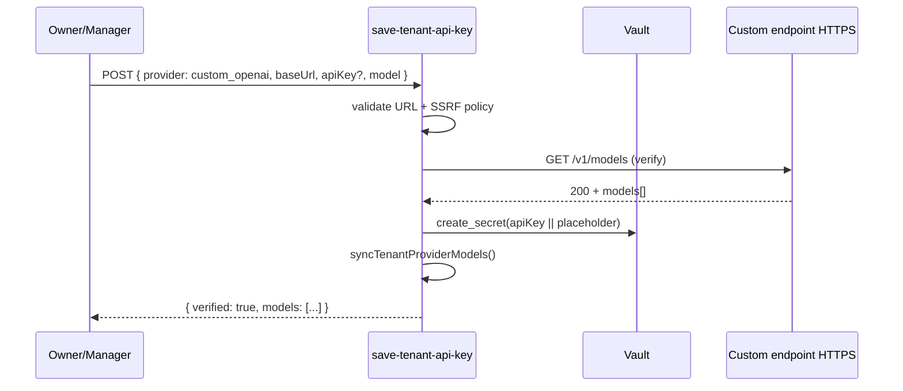

# Pla: Endpoint personalitzat compatible OpenAI (BYOK ampliat)

**Data:** 2026-06-20  
**Estat:** Pla d'anàlisi de viabilitat (no implementat)  
**Relacionat:** `tenant_byok_enterprise_v2.md`, `docs/help/ia-byok.md`, `platform-roadmap-prioritat-2026.md`

---

## Resum executiu

Aquest document analitza la viabilitat d'ampliar el BYOK existent per permetre que cada tenant connecti un **servidor d'IA propi compatible amb l'API OpenAI** (Ollama, vLLM, LM Studio, Text Generation Inference, Azure OpenAI privat, etc.).

| Pregunta | Resposta |
|----------|----------|
| És viable tècnicament? | **Sí**, amb canvis petits sobre l'stack actual |
| Blocador principal? | Les Edge Functions cloud **no accedeixen** a xarxes privades — cal HTTPS públic o connector enterprise |
| Esforç MVP | **~2–3 setmanes** (1 dev) |
| ROI | Alt per enterprise EU/RRHH; baix per SMB |
| Implementació concreta | Nou provider `custom_openai` → reutilitzar `callOpenAI` + política SSRF pròpia + UI separada |

**Decisió de producte recomanada:** implementar com a funcionalitat **enterprise opt-in** (feature flag per tenant), no com a opció per defecte.

---

## 1. Context actual (punt de partida)

### 1.1 Què ja tenim

| Capa | Implementació actual |
|------|------------------------|
| Config per tenant | `data.tenant_ai_config` + `data.tenant_ai_provider_config` |
| Secrets | Vault via Edge Function `save-tenant-api-key` (verify → persist) |
| Runtime | Deno Edge Functions; clau **només** `service_role` |
| Abstracció | `generateWithProvider()` → path OpenAI per `openai` i `openrouter` |
| Streaming / chat | `streamOpenAiCompletion()` amb `/chat/completions` |
| Models | `refresh-ai-models` + `ai_model_capabilities` |
| UI | `/settings/ai` (`apps/tenant-portal/src/pages/settings/AiPage.tsx`) — 4 proveïdors |
| Seguretat URL | `supabase/functions/_shared/ai/verify.ts`: HTTPS obligatori, bloqueig IP privada/localhost excepte `AI_ALLOW_CUSTOM_BASE_URL=true` |

### 1.2 Proveïdors cloud actuals

- OpenAI
- Anthropic
- Google Gemini
- OpenRouter

OpenAI i OpenRouter ja comparteixen el mateix adapter HTTP (`callOpenAI`, `/v1/chat/completions`, `/v1/models`). Això fa que l'ampliació sigui principalment de **producte, seguretat i UX**, no de nou runtime d'inferència.

### 1.3 Implicació arquitectònica clau

Les Edge Functions de Supabase Cloud s'executen a la infraestructura de Supabase/Deno Deploy. **No poden** cridar:

- `http://localhost:11434` (Ollama local)
- `http://10.0.1.5:8000` (vLLM a VPC privada)
- Cap host dins RFC1918 sense política explícita

Això defineix la viabilitat real del "local BYOK" i obliga a distinguir:

1. **Dev/demo** — túnel públic (ngrok, Cloudflare Tunnel)
2. **Enterprise producció** — endpoint HTTPS públic del client o connector on-prem
3. **Air-gapped** — requereix desplegament self-hosted de la plataforma (fora d'abast MVP)

---

## 2. Arquitectura proposada

### 2.1 Capa d'abstracció AI Provider

No cal reescriure l'abstracció existent. Cal **formalitzar el patró** amb un nou valor d'enum i polítiques pròpies.

#### Tipus TypeScript proposats

```typescript
// supabase/functions/_shared/ai/types.ts (proposta)

export type AiProvider =
  | "openai"
  | "anthropic"
  | "gemini"
  | "openrouter"
  | "custom_openai"; // Ollama, vLLM, LM Studio, TGI, Azure OpenAI privat, etc.

export type AiEndpointMode = "cloud_official" | "cloud_proxy" | "self_hosted";

export type AiTenantRuntimeConfig = {
  provider: AiProvider;
  model: string;
  baseUrl: string;           // obligatori per custom_openai
  apiKey: string;             // opcional per Ollama; obligatori per la resta
  endpointMode: AiEndpointMode;
  systemPrompt: string | null;
  temperature: number;
  maxTokens: number;
};
```

#### Routing (canvi mínim a `providers.ts`)

```typescript
export async function generateWithProvider(params: {
  config: AiTenantRuntimeConfig;
  messages: AiMessage[];
  temperature: number;
  maxTokens: number;
  responseFormat: "text" | "json";
}): Promise<AiGenerateResult> {
  switch (params.config.provider) {
    case "anthropic":
      return callAnthropic(params);
    case "gemini":
      return callGemini(params);
    case "openai":
    case "openrouter":
    case "custom_openai":
      return callOpenAI(params); // mateix contracte /v1/chat/completions
  }
}
```

Per chat amb streaming i tools, el mateix: `streamOpenAiCompletion` ja funciona amb qualsevol `baseUrl`.

#### Què NO reutilitzar directament

| Component | Motiu |
|-----------|-------|
| Adapters Gemini/Anthropic | Irrelevant per custom |
| Tool calling | Molts servidors locals no implementen `tools` de forma fiable |
| Multimodal | Depèn del model; per defecte desactivat via `ai_model_capabilities` |

### 2.2 Configuració per tenant

#### Enum Postgres

```sql
ALTER TYPE data.ai_provider ADD VALUE IF NOT EXISTS 'custom_openai';
```

#### Model de dades (ampliació)

Un endpoint custom per tenant al MVP. Múltiples endpoints = Fase 2.

```sql
ALTER TABLE data.tenant_ai_provider_config
  ADD COLUMN IF NOT EXISTS endpoint_label text,
  ADD COLUMN IF NOT EXISTS endpoint_mode text NOT NULL DEFAULT 'self_hosted'
    CHECK (endpoint_mode IN ('cloud_proxy', 'self_hosted')),
  ADD COLUMN IF NOT EXISTS api_key_optional boolean NOT NULL DEFAULT false,
  ADD COLUMN IF NOT EXISTS allowed_egress_hosts text[] DEFAULT '{}';
```

`data.tenant_ai_config.default_models` pot apuntar a `custom_openai`:

```json
{
  "template_generation": {
    "provider": "custom_openai",
    "model": "llama3.2"
  }
}
```

#### Feature flag per tenant

```json
// data.tenants.metadata
{
  "ai_custom_endpoint_enabled": true
}
```

Només tenants amb flag actiu veuen la targeta "Endpoint personalitzat" a `/settings/ai`. Activació des de admin-portal (vendes enterprise).

### 2.3 API keys, secrets i permisos

| Secret / dada | Emmagatzematge | Qui el llegeix |
|---------------|----------------|----------------|
| API key custom | Vault (`ai_key_secret_id`) | Edge Function (`service_role`) |
| Base URL | `tenant_ai_provider_config.base_url` | Edge + UI admin |
| Feature flag | `tenants.metadata` | Admin portal + Edge |

#### Flux segur (mateix patró BYOK actual)



**Permisos:** reutilitzar `assertAiManagerAccess` (owner/manager). Opcional Fase 2: permís RBAC `ai.configure_custom_endpoint`.

**API key opcional:** Ollama accepta qualsevol Bearer; emmagatzemar placeholder (`__no_key__`) amb `api_key_optional=true`.

**Nota de seguretat:** `api.get_ai_api_key_for_generation` ja està restringit a `service_role` (migració `20260619000001_tenant_ai_enterprise_phase1.sql`). Mantenir aquest contracte.

### 2.4 Selecció de models

1. **Sync automàtic** — `GET {baseUrl}/models` (mateix patró que OpenAI/OpenRouter a `verify.ts` i `models.ts`)
2. **Capabilities** — models nous entren amb `needs_review=true` (patró ja implementat a admin AI settings)
3. **Defaults conservadors** per custom:

   | Capability | Valor per defecte |
   |-------------|---------------------|
   | `supports_tools` | `false` |
   | `supports_vision` | `false` |
   | `supports_json_mode` | `false` |
   | `needs_review` | `true` |

4. **Fallback manual** — si `/models` no existeix (alguns TGI antics), permetre llista manual de models + model per defecte

### 2.5 Routing de peticions

```
generate-ai-content / ai-chat-stream
  → resolve tenant + feature + user policy (rate limits)
  → get_ai_api_key_for_generation(tenant_id, provider)  [service_role]
  → normalizeProviderBaseUrl(provider=custom_openai, baseUrl)
  → resolve_ai_model_capabilities_service()
  → generateWithProvider() / streamOpenAiCompletion()
  → ai_usage_ledger
```

**Feature gating:** chat amb tools només si `capabilities.supports_tools=true` per aquell model; sinó, mode text pla.

### 2.6 SSRF i egress (crític)

Avui `verify.ts` bloqueja IP privades i localhost. Per `custom_openai` cal una política **estricta per defecte**:

```typescript
function validateCustomOpenAiHost(
  hostname: string,
  tenantAllowlist: string[],
): void {
  // 1. HTTPS obligatori (ja existeix)
  // 2. No localhost / RFC1918 / link-local (producció)
  // 3. Opcional: hostname ha d'estar a tenant.allowed_egress_hosts
  //    O coincidir amb suffix allowlist global
}
```

#### Modes d'operació

| Mode | URL típica | Funciona des de Supabase Cloud? |
|------|------------|----------------------------------|
| Dev local | `https://xxx.ngrok.io/v1` | Sí (només dev) |
| Enterprise tunnel | `https://ai.acme.corp` (Cloudflare Tunnel) | Sí |
| VPC privada | `http://10.0.1.5:8000/v1` | **No** — cal connector |
| On-prem air-gapped | LAN only | **No** — cal desplegament self-hosted |

#### Fase Enterprise (fora MVP)

Agent lleuger **"AI Connector"** al client:

- Fa polling o WebSocket cap a cua PGMQ
- Executa inferència local
- Les dades **no surten** de la xarxa del client excepte el resultat que ja tornaria l'Edge Function

---

## 3. Experiència d'usuari

### 3.1 Flux admin tenant (`/settings/ai`)

Nova targeta **"Endpoint personalitzat (compatible OpenAI)"**, **separada** dels 4 proveïdors cloud. Evita confondre el camp "Base URL opcional" d'OpenAI amb un servidor propi.

### 3.2 Camps del formulari

| Camp | Obligatori | Notes |
|------|------------|-------|
| Nom del endpoint | Sí | Ex.: "Ollama RRHH", "vLLM intern" |
| Base URL | Sí | `https://ai.empresa.com/v1` (sense credencials a la URL) |
| API key | Depèn | Opcional per Ollama; obligatori per vLLM/TGI amb auth |
| Model per defecte | Sí | Dropdown després de verificar |
| Mode | Auto | `self_hosted` vs `cloud_proxy` (Azure OpenAI privat) |

### 3.3 Accions

1. **Provar connexió** — crida `GET /models`, mostra latència i models detectats
2. **Desar** — només si verify OK (patró actual "Verificar i desar")
3. **Actualitzar models** — botó existent (`refresh-ai-models`)
4. **Eliminar configuració** — DELETE a `save-tenant-api-key`

### 3.4 Missatges de validació

```
✓ Connexió correcta — 12 models detectats (142 ms)
✗ No s'ha pogut connectar — timeout després de 10 s
✗ Host no permès — contacteu amb suport per activar endpoint personalitzat
✗ El model seleccionat no admet eines de chat — s'utilitzarà mode text
```

### 3.5 Mapatge d'errors

| Codi intern | Missatge usuari |
|-------------|-----------------|
| `base_url_not_allowed` | L'adreça no és accessible des de la plataforma |
| `verify_failed_401` | API key incorrecta |
| `verify_failed_timeout` | El servidor no respon |
| `model_not_found` | Model no disponible al servidor |
| `tools_not_supported` | Aquest model no admet assistent amb eines |

### 3.6 Banner legal

Ampliar la secció "Polítiques de dades" existent:

> Les peticions s'envien directament al servidor configurat per la vostra organització. [Nom SaaS] actua com a encarregat del tractament; el subministrador del model d'IA és responsabilitat del client segons el seu desplegament.

---

## 4. Seguretat i GDPR

### 4.1 Riscos amb IA pròpia del tenant

| Risc | Severitat | Mitigació |
|------|-----------|-----------|
| Dades RRHH surten a un endpoint mal configurat (URL externa) | Alta | Verify + allowlist + audit log |
| SSRF des de la plataforma cap a la xarxa del client | Alta | No IP privades; egress allowlist |
| Model local sense logs/retenció definida | Mitjana | Documentació + checklist DPO |
| Model amb backdoor / fine-tuning no auditat | Mitjana | Disclaimer + recomanació models |
| Clau API custom filtrada | Baixa | Vault + mai retornar al client |
| Prompt injection → exfiltració via tool | Alta | Desactivar tools per custom al MVP |

### 4.2 Responsabilitat de dades (B2B EU)

Escenari típic amb **custom endpoint a infra del client**:

| Rol GDPR | Actor |
|----------|-------|
| **Responsable del tractament** | Client (empresa usuària) |
| **Encarregat** | El SaaS (processa dades per instrucció del client) |
| **Subencarregat addicional (inferència)** | **No** el SaaS — el client és responsable del seu servidor IA |
| **Transferència internacional** | Depèn d'on estigui l'endpoint; si és UE-only, argument fort per sector públic/RRHH |

Això és **comercialment atractiu** per clients que volen "dades no surten de la UE / no surten de casa nostra".

### 4.3 Evitar sortida no desitjada de dades

1. **Mode "strict egress"** (enterprise): només hostnames registrats contractualment
2. **Redacció PII opcional** abans d'enviar (Fase 2)
3. **Chat/documents:** no enviar adjunts binaris a custom fins que `supports_vision/files` estigui verificat
4. **Logging:** registrar `provider`, `base_url_host` (hash), `model`, tokens — **mai** prompt/resposta completa en producció per defecte
5. **Self-hosted plataforma** per clients air-gapped (roadmap llarg)

### 4.4 Documentació contractual mínima

- Addenda **DPA**: clarificar que amb custom endpoint el client assumeix el subministrador IA
- **Annex tècnic**: requisits HTTPS, disponibilitat, retenció logs del servidor IA
- **SLA diferenciat**: latència/uptime del endpoint custom **exclòs** de l'SLA del SaaS
- **Acceptació de risc** per dev tunnels (ngrok) en no-producció
- **Llista de subprocessadors** del SaaS **sense** incloure OpenAI quan el tenant usa només custom

---

## 5. Pla MVP

### 5.1 Funcionalitats MVP

| # | Entregable | Complexitat |
|---|------------|-------------|
| M1 | Enum `custom_openai` + migració + `platform_ai_defaults` | Baixa |
| M2 | `verify.ts`: política host per `custom_openai` + API key opcional | Mitjana |
| M3 | `save-tenant-api-key` + `refresh-ai-models` per custom | Baixa |
| M4 | UI targeta "Endpoint personalitzat" a `AiPage.tsx` | Mitjana |
| M5 | Capabilities: defaults conservadors + admin review | Baixa |
| M6 | Chat/template generation **sense tools** per custom | Baixa |
| M7 | Docs usuari + runbook + clàusula legal | Baixa |
| M8 | Feature flag per tenant (`ai_custom_endpoint_enabled`) | Baixa |

**Esforç estimat:** 6–8 setmanes-persona ≈ **2–3 setmanes** (1 dev + reviews).

### 5.2 Fora MVP (Fase 2)

| Entregable | Esforç addicional |
|------------|-------------------|
| AI Connector on-prem (PGMQ worker) | +4–6 setmanes |
| Tools/function calling per models verificats | +2 setmanes |
| Multimodal | +2–3 setmanes |
| Múltiples endpoints custom per tenant | +1 setmana |
| Redacció PII pre-enviament | +2–3 setmanes |

### 5.3 Ordre de desenvolupament

```
Setmana 1: M1 → M2 → M3 (backend complet, tests amb mock server)
Setmana 2: M4 → M5 → M6 (UI + chat/template)
Setmana 3: M7 → M8 → prova E2E Ollama+ngrok → hardening SSRF
```

### 5.4 Dependències prèvies recomanades

Segons `docs/plans/platform-roadmap-prioritat-2026.md`:

1. **Sprint 1 (Sentry + operation logs)** — abans o en paral·lel; necessari per diagnosticar errors de connexió custom
2. BYOK cloud estable (ja implementat)
3. **No cal** esperar Automatització ni Timeline

### 5.5 Criteris d'acceptació MVP

- [ ] Tenant amb flag actiu pot configurar endpoint custom des de `/settings/ai`
- [ ] Verify crida `GET /v1/models` abans de persistir
- [ ] Generació de plantilla funciona amb model custom (text pla)
- [ ] Chat funciona en mode text (sense tools ni adjunts)
- [ ] IP privada/localhost rebutjats en producció
- [ ] Ús registrat a `ai_usage_ledger` amb `provider=custom_openai`
- [ ] Admin pot revisar capabilities dels models custom (`needs_review`)
- [ ] Documentació usuari i annex legal actualitzats

### 5.6 Fitxers afectats (checklist implementació futura)

| Àrea | Fitxers |
|------|---------|
| DB | Nova migració `*_ai_custom_openai_provider.sql` |
| Types | `supabase/functions/_shared/ai/types.ts` |
| Verify | `supabase/functions/_shared/ai/verify.ts` |
| Providers | `supabase/functions/_shared/ai/providers.ts` |
| Stream | `supabase/functions/_shared/ai/stream-providers.ts` |
| Models sync | `supabase/functions/_shared/ai/models.ts` |
| Edge | `save-tenant-api-key`, `refresh-ai-models`, `generate-ai-content`, chat stream |
| UI tenant | `apps/tenant-portal/src/pages/settings/AiPage.tsx` |
| UI admin | Feature flag a admin-portal (tenant detail) |
| Docs | `docs/help/ia-byok.md`, runbook nou |
| i18n | `apps/tenant-portal/src/locales/*/chat.json`, settings |

---

## 6. Prova local

### 6.1 Opció A — Dev ràpid amb Ollama + túnel públic

#### 1. Instal·lar Ollama

```powershell
# Windows: https://ollama.com
ollama pull llama3.2
ollama serve
# API nativa: http://localhost:11434
```

#### 2. Verificar API compatible OpenAI

Ollama exposa `/v1/chat/completions` i `/v1/models`:

```powershell
curl http://localhost:11434/v1/models
```

#### 3. Túnel HTTPS

Supabase Cloud no arriba a localhost. Cal un túnel:

```powershell
# Cloudflare Tunnel (recomanat) o ngrok
cloudflared tunnel --url http://localhost:11434
# Obtens: https://random-subdomain.trycloudflare.com
```

Base URL per al SaaS: `https://random-subdomain.trycloudflare.com/v1`

#### 4. Activar flags dev

```bash
# supabase/functions/.env.local
AI_ALLOW_CUSTOM_BASE_URL=true
```

I feature flag `ai_custom_endpoint_enabled` al tenant de prova.

#### 5. Configurar al tenant-portal

- Endpoint personalitzat
- Base URL: `https://....trycloudflare.com/v1`
- API key: `ollama` (qualsevol valor)
- Verificar → hauria de llistar `llama3.2`
- Model per defecte: `llama3.2`

#### 6. Prova real

```powershell
curl -X POST http://127.0.0.1:54321/functions/v1/generate-ai-content `
  -H "Authorization: Bearer <JWT>" `
  -H "x-tenant-id: <TENANT_UUID>" `
  -H "Content-Type: application/json" `
  -d '{
    "feature": "template_generation",
    "provider": "custom_openai",
    "messages": [{"role":"user","content":"Resumeix en 3 punts què ha de contenir un contracte laboral a Espanya."}],
    "responseFormat": "text"
  }'
```

Alternativa: wizard de plantilles amb proveïdor per defecte = custom.

### 6.2 Opció B — vLLM / LM Studio

**vLLM:**

```bash
python -m vllm.entrypoints.openai.api_server \
  --model meta-llama/Llama-3.2-3B-Instruct \
  --port 8000
# Base URL: https://<tunnel>/v1
```

**LM Studio:** activar "Local Server" + "OpenAI compatible API" → mateix flux de túnel.

### 6.3 Opció C — Producció real (client enterprise)

Cloudflare Tunnel o reverse proxy `ai.cliente.com` → Ollama/vLLM a LAN. **Sense túnel públic ad hoc** en producció.

---

## 7. Comparativa estratègica

| Criteri | Només OpenAI/Anthropic | Multi-cloud (estat actual) | + Custom OpenAI endpoint |
|---------|------------------------|----------------------------|---------------------------|
| **Time-to-market** | Mínim | Ja fet | +2–3 setmanes MVP |
| **Cost operatiu plataforma** | Baix | Baix | Baix (inferència la paga el client) |
| **Apel·lació enterprise EU/RRHH** | Mitjana | Bona | **Molt alta** (soberania, air-gap parcial) |
| **Complexitat tècnica** | Baixa | Mitjana | Mitjana-alta (SSRF, capabilities, tools) |
| **Qualitat IA** | Alta | Alta | Variable (depèn del client) |
| **Suport** | Predictible | Dispers | **Difícil** — "el vostre Ollama no respon" |
| **GDPR narrative** | Subencarregats US possibles | Mateix + elecció | **Dades al client** — fort per vendes |
| **Risc producte** | Dependència vendor | Diversificat | Risc d'UX trencada si model feble |

### 7.1 Conclusió comparativa

- **Comercialment:** custom endpoint és un **differentiator B2B**, no una necessitat per al segment SMB.
- **Tècnicament:** reutilitza ~70% del codi OpenAI existent; el cost real és **seguretat, UX d'errors i suport**, no l'adapter HTTP.

---

## 8. Recomanació final

### 8.1 Té sentit per un SaaS B2B europeu de gestió documental i RRHH?

**Sí, amb matisos:**

- **Sí** com a funcionalitat **enterprise / regulated** (sector públic, grups amb DPO exigent, clients amb GPU interna).
- **No** com a opció per defecte per a tots els tenants — mantenir OpenAI/Anthropic/Gemini/OpenRouter com a camí principal.
- **No** prometre "Ollama al portàtil" en SaaS cloud multi-tenant sense túnel o connector — seria fràgil i un nightmare de suport.

### 8.2 Moment al roadmap

```
Ara ──► Sprint 1–2: Sentry + Notificacions V0  (fondació operativa)
         │
         ├──► Paral·lel (2–3 setmanes): Custom OpenAI MVP + feature flag enterprise
         │
         └──► Timeline V1, Chat hardening
                    │
                    └──► Fase 2: AI Connector on-prem (només si hi ha 2+ clients enterprise demanant-ho)
```

**Prioritat relativa:** després de **observabilitat (Sentry)**, **abans o en paral·lel amb Timeline**, i **abans d'Automatització**.

### 8.3 Decisions obertes (pendents abans d'implementar)

| # | Decisió | Opcions |
|---|---------|---------|
| D1 | Nom del provider | `custom_openai` vs `openai_compatible` |
| D2 | API key opcional per defecte | Sí per Ollama; configurable per tenant |
| D3 | Allowlist global vs per tenant | Per tenant al MVP; suffix global opcional |
| D4 | Un vs múltiples endpoints | Un al MVP |
| D5 | Pricing | Inclòs enterprise vs add-on |
| D6 | Connector on-prem | Només si demanda real (2+ clients) |

### 8.4 Mètrica d'èxit

≥1 client pilot amb endpoint propi en producció abans d'invertir en AI Connector (Fase 2).

---

## 9. Referències

| Recurs | Ubicació |
|--------|----------|
| Pla BYOK enterprise | `docs/plans/ai/tenant_byok_enterprise_v2.md` |
| Guia usuari BYOK | `docs/help/ia-byok.md` |
| Verify + SSRF | `supabase/functions/_shared/ai/verify.ts` |
| Provider routing | `supabase/functions/_shared/ai/providers.ts` |
| UI configuració | `apps/tenant-portal/src/pages/settings/AiPage.tsx` |
| Roadmap plataforma | `docs/plans/platform-roadmap-prioritat-2026.md` |
| Ollama OpenAI API | https://github.com/ollama/ollama/blob/main/docs/openai.md |
| vLLM OpenAI server | https://docs.vllm.ai/en/latest/serving/openai_compatible_server.html |
