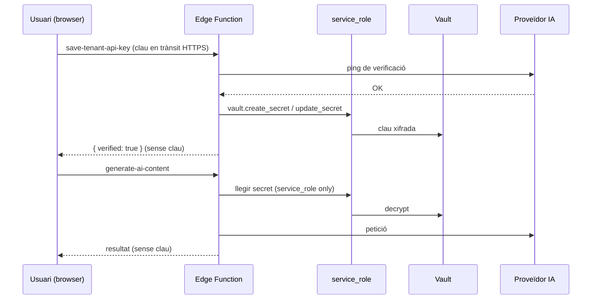
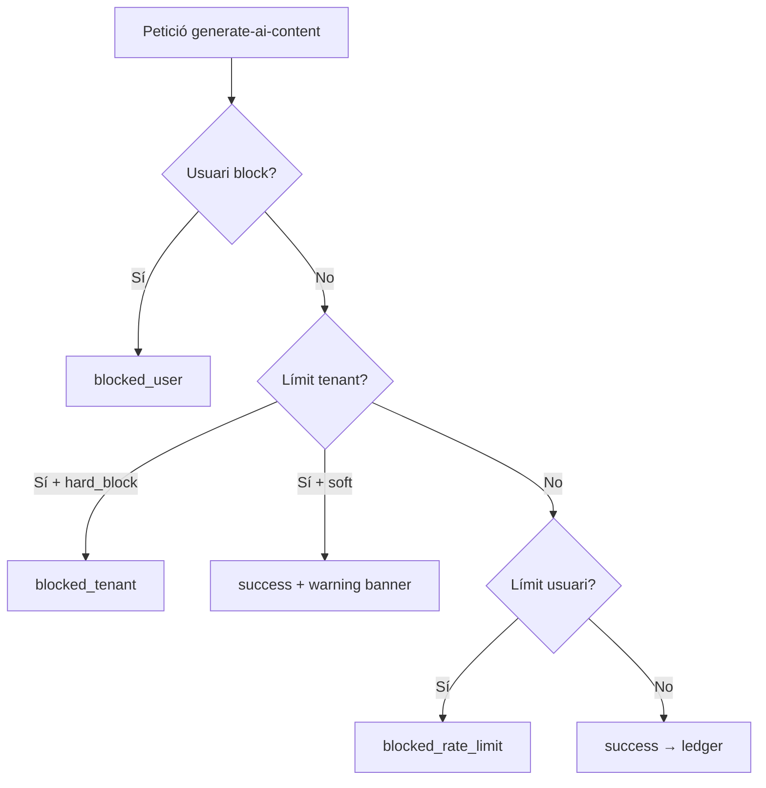

# Pla Enterprise: IA Multi-Tenant (BYOK) — v2

**Data:** 2026-06-18  
**Estat:** Pla revisat (no implementat)  
**Relacionat:** `make_templates_with_ia_v2.md`, migracions `20260616000002/003_tenant_ai_*.sql`

---

## 1. Decisions confirmades

| Tema | Decisió |
|------|---------|
| Emmagatzematge de claus | **Mantenir Supabase Vault** (`vault.create_secret` → `ai_key_secret_id`). És segur *si* la clau mai es retorna al client. |
| Runtime d'execució | **Deno Edge Functions** (fase 1). Documentar migració a **Node.js** (secció 8). |
| Consum als proveïdors | **No** consultar APIs de billing/usage d'OpenAI, Anthropic ni Gemini. |
| Catàleg de models | **Sí** consultar endpoint de *models* de cada proveïdor (no billing) per validar i suggerir models disponibles per clau BYOK. |
| Ús i estadístiques | **Sí** — mesurar i mostrar ús **intern** (crides des de la nostra app), amb gràfics. |
| Rate limiting | **Sí** — per usuari, per tenant i configuració de bloqueig/avisos. |
| Verificació de clau | **Sí** — crida de prova abans de persistir; només es desa si verificada. |
| Xifrat ALE (AES-256-GCM) | **No** a la fase 1. Vault cobreix el requisit «només text xifrat a BD». ALE queda com a alternativa documentada per self-hosting fora Supabase. |

---

## 2. Què vol dir «un owner pot extreure la clau des de DevTools»?

### El problema actual (concret)

La funció `api.get_ai_api_key_for_generation` està definida així:

```sql
RETURN jsonb_build_object(
  'provider',  v_provider_cfg.provider,
  'model',     v_provider_cfg.model,
  'base_url',  v_base_url,
  'api_key',   v_api_key   -- ← text en clar des de vault.decrypted_secrets
);

GRANT EXECUTE ON FUNCTION api.get_ai_api_key_for_generation TO authenticated;
```

Qualsevol usuari **owner o manager** del tenant, amb la sessió oberta al tenant-portal, pot obrir la consola del navegador (DevTools) i executar:

```javascript
const { data, error } = await supabase.rpc('get_ai_api_key_for_generation', {
  p_tenant_id: '<uuid-del-tenant>'
})
console.log(data.api_key)  // clau API en text pla
```

Això **no és un bug de Vault**. Vault emmagatzema bé la clau xifrada. El problema és que hem exposat un RPC que **desxifra i retorna la clau al client** amb permís `authenticated`.

La UI de `/settings/ai` no mostra la clau (correcte), però el contracte d'API sí que la permet llegir. Un gestor compromès, un script maliciós en una extensió del navegador, o un error de còpia accidental poden filtrar la clau.

### Flux segur objectiu



**Acció obligatòria (Fase 1):**

```sql
REVOKE EXECUTE ON FUNCTION api.get_ai_api_key_for_generation FROM authenticated;
-- Mantenir només service_role; cridar des d'edge functions amb createAdminClient()
```

Substituir `save_tenant_ai_provider_config` amb clau des del browser per **`save-tenant-api-key`** (edge), seguint el patró de `configure-byos`.

---

## 3. Model de dades

### 3.1 Taules existents (ampliació)

**`data.tenant_ai_config`** — paràmetres globals del tenant:

```sql
system_prompt     text,
temperature       numeric(3,2) NOT NULL DEFAULT 0.20 CHECK (temperature BETWEEN 0 AND 1),
max_tokens        integer NOT NULL DEFAULT 4096 CHECK (max_tokens > 0),
default_models    jsonb NOT NULL DEFAULT '{}'::jsonb,
-- { "template_generation": { "provider": "openai", "model": "gpt-4o-mini" } }

-- Rate limiting i polítiques (nivell tenant)
rate_limit_per_hour   integer NOT NULL DEFAULT 60,
rate_limit_per_day    integer NOT NULL DEFAULT 500,
warn_threshold_pct    smallint NOT NULL DEFAULT 80,  -- avís quan s'arriba al 80% del límit diari
hard_block_on_limit   boolean NOT NULL DEFAULT true,
```

**`data.tenant_ai_provider_config`** — per proveïdor:

```sql
available_models   text[] NOT NULL DEFAULT '{}',
key_verified_at    timestamptz,   -- última verificació exitosa
key_last_error     text,          -- últim error de verificació (sense clau)
last_models_sync_at timestamptz,  -- últim refresh del catàleg de models del proveïdor
```

### 3.2 Control plane (admin-portal)

**`data.platform_ai_defaults`** — badges, defaults, enllaços facturació:

```sql
CREATE TABLE data.platform_ai_defaults (
  provider           data.ai_provider PRIMARY KEY,
  suggested_models   text[] NOT NULL,
  default_model      text NOT NULL,
  billing_url        text NOT NULL,
  system_prompt      text,
  temperature        numeric(3,2) DEFAULT 0.20,
  max_tokens         integer DEFAULT 4096,
  updated_at         timestamptz DEFAULT now()
);
```

### 3.3 Ús intern (patró geocoding)

Reutilitzar l'arquitectura de `geocoding_usage_ledger` / `geocoding_rate_windows`:

**`data.ai_usage_ledger`** — cada crida des de `generate-ai-content`:

```sql
CREATE TABLE data.ai_usage_ledger (
  id                 uuid PRIMARY KEY DEFAULT gen_random_uuid(),
  tenant_id          uuid NOT NULL REFERENCES data.tenants(id) ON DELETE CASCADE,
  user_id            uuid NOT NULL,          -- auth.uid() de la crida
  site_id            uuid REFERENCES data.sites(id) ON DELETE SET NULL,
  feature            text NOT NULL,          -- 'template_generation', 'generic', ...
  provider           data.ai_provider NOT NULL,
  model              text NOT NULL,
  request_status     text NOT NULL CHECK (request_status IN (
    'success', 'provider_error', 'validation_error',
    'blocked_rate_limit', 'blocked_user', 'blocked_tenant', 'blocked_quota'
  )),
  prompt_tokens      integer,
  completion_tokens  integer,
  total_tokens       integer GENERATED ALWAYS AS (
    COALESCE(prompt_tokens, 0) + COALESCE(completion_tokens, 0)
  ) STORED,
  latency_ms         integer,
  error_code         text,
  idempotency_key    text,
  created_at         timestamptz NOT NULL DEFAULT now()
);
```

**`data.ai_rate_windows`** — comptadors per enforcement:

```sql
CREATE TABLE data.ai_rate_windows (
  tenant_id      uuid NOT NULL,
  user_id        uuid NOT NULL,
  window_kind    text NOT NULL CHECK (window_kind IN ('hour', 'day')),
  window_start   timestamptz NOT NULL,
  request_count  integer NOT NULL DEFAULT 0,
  PRIMARY KEY (tenant_id, user_id, window_kind, window_start)
);
```

**`data.ai_usage_daily`** / **`data.ai_usage_monthly`** — agregats per gràfics (derivats per trigger o job `pg_cron`).

### 3.4 Bloqueig per usuari

**`data.tenant_ai_user_policy`**:

```sql
CREATE TABLE data.tenant_ai_user_policy (
  tenant_id    uuid NOT NULL REFERENCES data.tenants(id) ON DELETE CASCADE,
  user_id      uuid NOT NULL,
  policy       text NOT NULL CHECK (policy IN ('allow', 'warn_only', 'block')),
  custom_hourly_limit integer,   -- NULL = usa límit del tenant
  custom_daily_limit  integer,
  notes        text,
  updated_by   uuid,
  updated_at   timestamptz DEFAULT now(),
  PRIMARY KEY (tenant_id, user_id)
);
```

| `policy` | Comportament |
|----------|--------------|
| `allow` | Normal; aplica límits del tenant (o custom si definit) |
| `warn_only` | Permet crides però mostra banner d'avís a l'usuari |
| `block` | Totes les crides retornen `blocked_user` |

---

## 4. Edge Functions (Deno)

### 4.1 `save-tenant-api-key`

```
POST /functions/v1/save-tenant-api-key
Headers: Authorization, x-tenant-id
Body: { provider, apiKey, model?, baseUrl?, availableModels? }
```

**Flux:**

1. Validar JWT + rol owner/manager.
2. **Verificació** (crida mínima al proveïdor, sense persistir encara):
   - OpenAI: `GET /v1/models` o completion amb `max_tokens: 1`
   - Anthropic: `GET /v1/models` o message mínim
   - Gemini: `GET /v1beta/models` (clau via **header**, mai query string)
3. Si falla → `422 { verified: false, error: '...' }` — **no es guarda res**.
4. Si OK → `createAdminClient()` → `vault.create_secret` / `vault.update_secret` → actualitzar `tenant_ai_provider_config` + `key_verified_at`.
5. Retornar `{ verified: true, provider, model }` — **mai** retornar la clau.

**Eliminar clau:** `DELETE` o `POST .../revoke` → `vault` delete + `ai_key_secret_id = NULL`.

### 4.2 `generate-ai-content`

Hub genèric per a totes les funcionalitats IA.

```
POST /functions/v1/generate-ai-content
Body: {
  feature: string,
  messages: [{ role, content }],
  provider?, model?, temperature?, maxTokens?,
  responseFormat?: 'text' | 'json'
}
```

**Flux:**

1. Auth + `x-tenant-id` + resoldre `user_id`.
2. **`api.check_ai_rate_limit(tenant_id, user_id)`** → si superat, escriure ledger `blocked_*` i retornar 429.
3. Comprovar `tenant_ai_user_policy` → `block` / `warn_only`.
4. Carregar config + clau via **service_role** (Vault).
5. Injectar `system_prompt`, `temperature`, `max_tokens` del tenant.
6. Cridar proveïdor; mesurar `latency_ms` i tokens de la **resposta** (camp `usage` dels SDKs).
7. Escriure `ai_usage_ledger` + actualitzar `ai_rate_windows` + agregats diaris.
8. Retornar `{ content, usage, provider, model, warnings? }`.

### 4.2.b Descoberta de models (nou)

Objectiu: evitar errors de tipus *model no suportat/no trobat* abans de generar i oferir selector fiable al tenant.

**Endpoint nou**:

```
POST /functions/v1/refresh-ai-models
Headers: Authorization, x-tenant-id
Body: { provider }
```

**Flux**:

1. Auth + owner/manager.
2. Carregar clau del provider (Vault).
3. Cridar endpoint de models del proveïdor:
   - OpenAI: `GET /v1/models`
   - Anthropic: `GET /v1/models`
   - Gemini: `GET /v1beta/models` (o `/v1/models` segons base URL configurada)
4. Filtrar només models vàlids per generació de text (excloure embeddings, moderation, etc. quan sigui aplicable).
5. Persistir a `tenant_ai_provider_config.available_models` + `last_models_sync_at`.
6. Retornar `{ models: string[], syncedAt }`.

**Refresh automàtic en error de model**:

- Si `generate-ai-content` rep error tipus `model_not_found` / `not supported for generateContent`, fa:
  1) un únic refresh de catàleg,
  2) revalidació del model,
  3) si continua fallant: error clar cap a UI + suggerir model compatible.

**Cache recomanada**:

- TTL 24h per tenant+provider.
- Refresh manual des de UI (`/settings/ai`) amb botó “Actualitzar models”.

`ai-template-generator` passa a ser un **wrapper** d'aquest hub.

### 4.3 RPCs nous (service_role / edge only per secrets)

| RPC | Qui | Propòsit |
|-----|-----|----------|
| `get_ai_config_for_tenant` | authenticated | Metadades, mai claus |
| `save_tenant_ai_global_settings` | authenticated | systemPrompt, limits, default_models |
| `refresh_tenant_ai_provider_models` | via edge | Sincronitzar `available_models` des del proveïdor |
| `get_ai_usage_stats` | authenticated (owner/manager) | Dades per gràfics tenant |
| `get_ai_api_key_for_generation` | **service_role only** | Llegir clau per edge |
| `delete_tenant_ai_provider_key` | via edge | Esborrar secret Vault |
| `set_tenant_ai_user_policy` | authenticated (owner) | Bloqueig per usuari |

---

## 5. Interfície d'usuari

### 5.1 `/settings/ai` (tenant-portal)

**Pestanyes per proveïdor** (OpenAI | Anthropic | Gemini):

- Camp `password` per API Key.
- Estat: `✓ Verificada el DD/MM/YYYY` o `✗ Error: ...` (de `key_verified_at` / `key_last_error`).
- Enllaç extern: *«Gestiona els teus límits i facturació al panell de [Proveïdor]»* (des de `platform_ai_defaults.billing_url`). **Sense** cridar APIs de consum del proveïdor.
- Models: llista editable + badges suggerits (admin).
- Botó “Actualitzar models” (sincronitza amb el proveïdor via clau BYOK i actualitza `available_models`).
- Botons: **Verificar i desar** | **Eliminar clau**.

**Secció global:**

- `systemPrompt`, `temperature`, `maxTokens`.
- `default_models` per funcionalitat (començar per `template_generation`).
- Límits del tenant: crides/hora, crides/dia, % avís, bloqueig dur.

**Secció ús i estadístiques** (dades **nostres**, no del proveïdor):

- Gràfic: crides per dia (últims 30 dies).
- Gràfic: tokens per proveïdor/model.
- Taula: top usuaris per crides.
- Indicador: % del límit diari (barra de progrés + avís groc/vermell).
- Filtres: per funcionalitat, per usuari, per estat (`success` vs `blocked_*`).

**Gestió per usuari** (owner):

- Llista membres del tenant amb política (`allow` / `warn_only` / `block`).
- Límits personalitzats opcionals per usuari.

### 5.2 `AIGenerateAction` (component reutilitzable)

```
[✨ Generar]  [⚙️]
```

- Engranatge: override temporal de model / temperature / maxTokens (no persisteix).
- Si no hi ha clau verificada → `Alert` amb enllaç a `/settings/ai`.
- Si usuari `block` → missatge clar.
- Si `warn_only` o prop del límit → banner d'avís.
- Crida exclusivament `generate-ai-content`.

### 5.3 Admin-portal

**`/dashboard/settings/ai`:**

- Models suggerits (badges), model per defecte, URLs de facturació, defaults de prompt/temperature/maxTokens.

**`/dashboard/tenants/[id]` → pestanya IA:**

- Estat BYOK per proveïdor (configurat / verificat / error).
- Gràfics agregats cross-tenant (admin).
- Override de límits del tenant (hub/spoke).

---

## 6. Integració plantilles (`TemplateAiWizard`)

- Substituir `invoke('ai-template-generator')` per `AIGenerateAction` o hook `useAiGenerate`.
- Pre-check: si `!configured || !key_verified_at` → deshabilitar amb link a settings.
- Override de model via engranatge del component.
- El flux copy/paste manual es manté com a fallback.

---

## 7. Rate limiting i avisos (detall)

### Nivells d'enforcement



### Fonts de límits (prioritat)

1. `tenant_ai_user_policy.custom_*` (si definit)
2. `tenant_ai_config.rate_limit_*`
3. `platform_ai_defaults` (tenants nous)

### Avisos a la UI (sense bloquejar)

- Tenant al `warn_threshold_pct` del límit diari → banner a `/settings/ai` i als components `AIGenerateAction`.
- Usuari amb `warn_only` → banner persistent mentre genera.
- Email opcional al owner (fase posterior, com email quota).

### Estadístiques disponibles

| Vista | Mètriques |
|-------|-----------|
| Tenant `/settings/ai` | Crides/dia, tokens/dia, per usuari, per feature, % límit |
| Admin tenant detail | Mateix + comparativa mes anterior |
| Admin global | Crides per tenant, errors per proveïdor, bloquejos |

**Important:** els tokens es registren des de la **resposta** de cada crida (`usage` del SDK). No cal consultar dashboards externs. Si el proveïdor no retorna `usage`, estimar o registrar `NULL` (no inventar).

---

## 8. Migració Deno → Node.js (documentació)

Vault i Supabase RPCs **no depenen** del runtime de les functions. La migració és independent de l'emmagatzematge.

### Què canvia

| Capa | Deno (actual) | Node.js (futur) |
|------|---------------|-----------------|
| Runtime | `supabase/functions/*/index.ts` | Ex: `services/ai-api/` (Express/Fastify) o Vercel/Cloud Run |
| SDKs | `fetch` manual | `@openai/openai`, `@anthropic-ai/sdk`, `@google/generative-ai` |
| Auth | `createUserClient(req)` | Validar JWT Supabase amb `supabase.auth.getUser(token)` |
| Secrets | `Deno.env.get('MASTER_KEY')` | Variables d'entorn del host Node |
| Vault | `createAdminClient()` + RPC | Mateix client `service_role` |

### Passos de migració

1. Extreure lògica de `_shared/ai/` a un paquet compartit (`packages/ai-core/`).
2. Implementar els mateixos contractes HTTP (`save-tenant-api-key`, `generate-ai-content`).
3. Apuntar el tenant-portal a la nova URL (env `VITE_AI_API_URL`) o mantenir el mateix path via reverse proxy.
4. Desactivar edge functions Deno equivalents.
5. **No cal migrar claus** — segueixen a Vault amb els mateixos `ai_key_secret_id`.

### Quan té sentit migrar

- Necessitat de SDKs no disponibles a Deno.
- Timeouts > 60s o streaming llarg.
- Unificar amb altres workers Node (email queue, etc.).

---

## 9. Roadmap

### Fase 1 — Seguretat i verificació (prioritat alta)

- [x] `REVOKE get_ai_api_key_for_generation FROM authenticated`
- [x] Edge `save-tenant-api-key` amb ping de verificació
- [x] Edge `generate-ai-content` (hub)
- [x] Refactor `ai-template-generator` → wrapper
- [x] Migració: camps globals + `key_verified_at`

### Fase 2 — Ús, rate limiting i UI

- [x] Taules `ai_usage_ledger`, `ai_rate_windows`, agregats
- [x] RPC `check_and_increment_ai_rate_limit` + `get_ai_usage_stats` + `persist_tenant_ai_provider_models`
- [x] Edge `refresh-ai-models` + retry automàtic en `model_not_found`
- [x] Rate limit + logging integrats a `generate-ai-content` / `run.ts`
- [x] Refactor `AiPage` (pestanyes Config / Ús, verificar/desars, eliminar clau, actualitzar models)
- [x] Gràfics tenant (`AiUsageDashboard`)
- [x] `AIGenerateAction` (component reutilitzable; integració wizard → Fase 3)

### Fase 3 — Polítiques per usuari i admin

- [x] `tenant_ai_user_policy` + RPCs (`get/set/delete`, `get_ai_user_access`)
- [x] `platform_ai_defaults` + `AdminAiSettings` (`/dashboard/settings/ai`)
- [x] Pestanya IA al detall de tenant (admin) + override límits
- [x] Integració `TemplateAiWizard` via `useAiGenerate` → `generate-ai-content`
- [x] Pestanya Membres a `/settings/ai` (owner) + enforcement `block`/`warn_only`

### Fase 4 — Polish enterprise

- [x] Capa tipada `features/ai/types/rpc.ts` + `api/aiRpc.ts` (eliminar `as any` als components IA)
- [x] Tests e2e `tests/ai-byok.spec.ts` (UI + integració opcional amb `E2E_AI_API_KEY`)
- [x] `docs/help/ia-byok.md` (ajuda usuari)
- [x] Addon hub/spoke `addon_ai` + bridge `tenant_ai_config`
- [ ] Regenerar `database.types.ts` complet (`supabase gen types typescript --local`) després d'aplicar migracions

---

## 10. Referències al codi existent

| Patró | Fitxer |
|-------|--------|
| Vault BYOK | `20260616000003_tenant_ai_multi_provider.sql` |
| Edge BYOS (verificació + service_role) | `supabase/functions/configure-byos/index.ts` |
| Usage ledger + rate windows | `20260511000008_geocoding_control_plane.sql` |
| UI rate limits (email) | `EmailGeneralTab.tsx` |
| Wizard plantilles | `TemplateAiWizard.tsx` |

---

## 11. Resum de canvis respecte al pla v1

| Tema v1 | Tema v2 (revisat) |
|---------|-------------------|
| «Zero gràfics de consum» al tenant | **Gràfics d'ús intern** (les nostres crides), sense consultar proveïdors |
| ALE AES-256-GCM proposat | **Vault** mantingut; ALE només com alternativa documentada |
| Rate limiting «fase posterior» | **Fase 2**, amb polítiques per usuari |
| Test de clau opcional | **Obligatori** abans de desar |
| Models hardcoded/manuals | **Sincronització de catàleg** per proveïdor (`List models`) + refresh en error `model_not_found` |
| Explicació vaga del risc DevTools | **Secció 2** amb exemple concret i fix |
