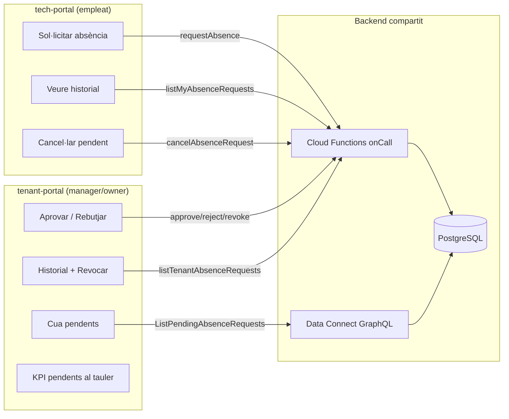
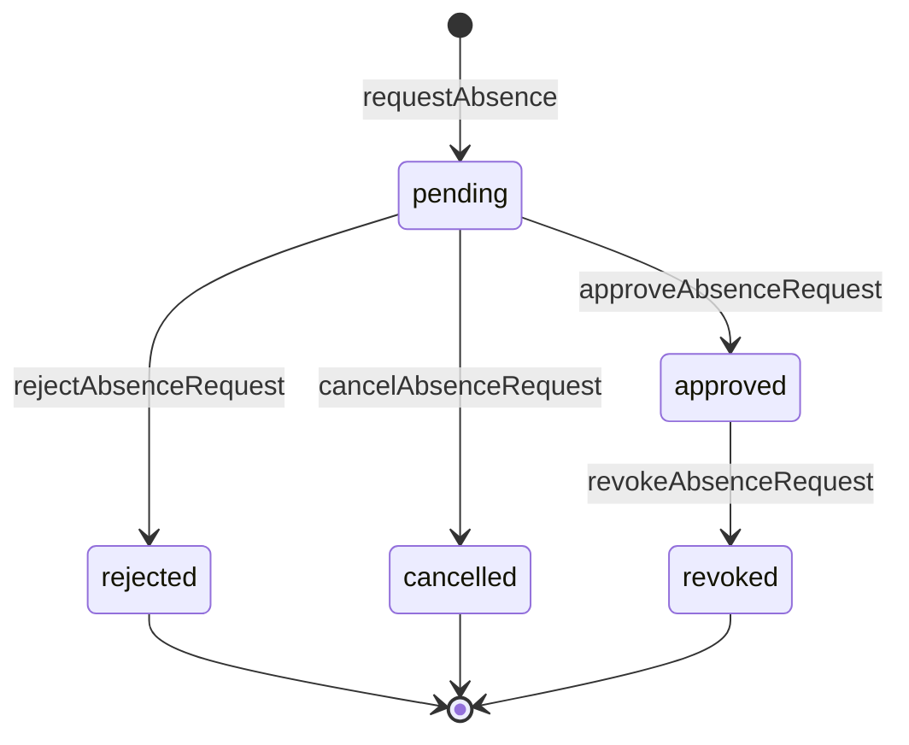

# Flux d'aprovacions d'absències en una altra app: tech-portal ↔ tenant-portal

Aquest projecte separa **qui demana** (empleat, app mòbil/operativa) de **qui aprova** (gestió, app d'oficina), amb la lògica de negoci centralitzada a **Cloud Functions** i PostgreSQL com a font de veritat. No hi ha cua de missatges ni websockets: les dues apps llegeixen/escriuen la mateixa BD via APIs diferents.

---

## 1. Arquitectura en una línia

**Patró clau:** les **escriptures amb regles de negoci** passen sempre per CF; les **lectures de cua** al tenant-portal poden anar per Data Connect (GraphQL) amb `fetchPolicy: SERVER_ONLY` per evitar cache obsolet.

---

## 2. Domini principal: sol·licituds d'absència (`absence_requests`)

### Entitat i estats

Taula `absence_requests` amb màquina d'estats:

| Estat | Qui el provoca | Efecte al calendari |
|--------|----------------|---------------------|
| `pending` | Empleat (`requestAbsence`) | Cap |
| `approved` | Manager (`approveAbsenceRequest`) | Crea `work_calendar_days` (vacation/leave) |
| `rejected` | Manager (`rejectAbsenceRequest`) | Cap |
| `cancelled` | Empleat (`cancelAbsenceRequest`) | Cap (només si encara `pending`) |
| `revoked` | Manager (`revokeAbsenceRequest`) | Reverteix dies de calendari creats per aquesta sol·licitud |

Tipus: `vacation` | `leave`. Avui el flux és **dies complets**; el disseny de permisos per hores està documentat a `docs/plans/checkin/hourly-leave-model.md` però encara no implementat.

### Flux pas a pas

**Pas 1 — Sol·licitud (tech-portal)**  
- UI: `TimeTrackingPage` → pestanya Calendari/Absències → `AbsenceRequestForm`.  
- Crida: `requestAbsence({ tenantId, tenantMemberId, requestType, startDate, endDate, reason? })`.  
- Validacions a la CF (no confiar en el client):
  - L'usuari autenticat és el `tenantMember` indicat.
  - L'interval conté dies **laborables** segons calendari resolt (cascada membre → grup → tenant → default).
  - Per vacances: quota anual no superada (`pending` + `approved` compten).
  - Insereix fila `status = 'pending'`.
  - Escriu `audit_logs` (`ABSENCE_REQUEST_CREATED`).
- **No hi ha FCM** als managers encara (planificat 3b.5); la notificació és indirecta (KPI al tauler + refetch de la cua).

**Pas 2 — Cua de pendents (tenant-portal)**  
- UI: `AbsencesPage` (pestanya Pendents) + comptador al `TimeTrackingDashboardPage`.  
- Lectura: query GraphQL `ListPendingAbsenceRequests` (status = `pending`, fins a 100, ordenat per `createdAt`).  
- La query comprova que l'usuari és membre del tenant; el **rol manager** es valida a la capa d'aplicació (UI) i de nou a cada CF d'aprovació.

**Pas 3 — Decisió (tenant-portal)**  
- **Aprovar:** `approveAbsenceRequest`  
  1. Rol global `owner` o `manager` (`site_id IS NULL`).  
  2. `status` ha de ser `pending`.  
  3. Marca `approved`, `reviewed_by`, `reviewed_at`.  
  4. Crea/obté `work_calendar_year` scope `member` per l'any.  
  5. Torna a resoldre dies laborables de l'interval (pot corregir `working_days_count` si el calendari ha canviat).  
  6. Insereix `work_calendar_days` amb `day_type = vacation|leave`, `source = absence_request`.  
  7. Audit: `ABSENCE_REQUEST_APPROVED`.  
- **Rebutjar:** `rejectAbsenceRequest` — només canvia estat; **no toca** el calendari.  
- **Revocar** (historial): `revokeAbsenceRequest` — només si `approved`, amb antelació mínima de **3 dies** abans de l'inici; elimina/reverteix dies de calendari amb `source = absence_request` excepte si una altra aprovació els cobreix encara.

**Pas 4 — Seguiment (tech-portal)**  
- `listMyAbsenceRequests` — historial propi, pendents primer.  
- `cancelAbsenceRequest` — només mentre `pending`.  
- L'empleat **no pot** aprovar, rebutjar ni revocar.

---

## 3. Segon flux d'«aprovació» (només tenant-portal): consolidació de jornada

És un flux **paral·lel**, no pas absències:

| | Absències | Consolidació jornada |
|--|-----------|----------------------|
| Qui demana | Empleat (tech) | — (manager corregeix) |
| Qui aprova | Manager | Manager (`consolidateTimeDay`) |
| Entitat | `absence_requests` | `time_day_adjustments` |
| Efecte | Canvia calendari (dies off) | Defineix hores **oficials** del dia |
| Original | — | `time_entries` **no es modifiquen** (auditoria legal) |

UI: `ClockEventsPage` → botó «Consolidar» → `ConsolidateDayModal` → CF `consolidateTimeDay`.  
El comput oficial del dia usa l'ajust si existeix (`status = approved`); si no, cascada real/teòric (veure `compute-official-day`).

---

## 4. Repartiment de responsabilitats per app

### tech-portal (empleat / camp)

| Acció | API | Notes |
|-------|-----|-------|
| Sol·licitar absència | CF `requestAbsence` | Formulari + calendari |
| Llistar les meves | CF `listMyAbsenceRequests` | React Query, refetch 60s |
| Cancel·lar pendent | CF `cancelAbsenceRequest` | Botó només si `pending` |
| Fitxatge | CF `recordTimeEntry` | Flux separat (FSM sessions) |

No té pantalla d'aprovació.

### tenant-portal (gestió)

| Acció | API | Notes |
|-------|-----|-------|
| Llistar pendents | DC `ListPendingAbsenceRequests` | SERVER_ONLY |
| Aprovar / rebutjar | CF `approve` / `reject` | Accions per fila |
| Historial + revocar | CF `listTenantAbsenceRequests` + `revoke` | Pestanya Historial |
| Context del membre | `PendingAbsenceMemberPanel` | Calendari del sol·licitant |
| KPI al tauler | mateixa query de pendents | Enllaç a `/time-tracking/absences` |
| Consolidar jornada | CF `consolidateTimeDay` | Només owner/manager |

---

## 5. Principis de disseny (útils per adoptar o comparar)

**1. Escriptura només via backend amb autoritat**  
Cap mutació GraphQL directa a `absence_requests` (el connector ho documenta explícitament). Totes les transicions d'estat passen per CF amb `BEGIN/COMMIT`, validació de rol i `failed-precondition` si l'estat no encaixa.

**2. Separació sol·licitud vs efecte**  
Mentre és `pending`, el calendari **no canvia**. L'aprovació és l'única acció que materialitza absència al calendari. Això simplifica cancel·lacions i rebutjos.

**3. Re-validació en aprovar**  
Es torna a calcular `working_days_count` en aprovar perquè el calendari del treballador pot haver canviat entre sol·licitud i decisió.

**4. Dos canals de lectura**  
- Empleat: CF (filtrat per `tenant_member_id` + `auth.uid`).  
- Manager cua: GraphQL (filtrat per `tenant_id` + `status`).  
Una altra app podria unificar-ho tot en CF o tot en GraphQL; aquí es va optar per GraphQL ràpid per la llista de pendents al portal web.

**5. Rol global vs rol per local**  
Aprovacions exigeixen membre **global** (`site_id IS NULL`) owner/manager. Un manager només de local no pot aprovar absències (decisió explícita de governança).

**6. Auditoria**  
Cada transició important es registra a `audit_logs`. No hi ha timeline in-app per l'empleat (només `reviewNotes` si el manager en deixa).

**7. Què encara no hi ha (gaps vs flux «complet»)**  
- Notificacions push/email als managers (FCM pendent).  
- Aprovació inline al tauler (només enllaç + KPI).  
- Validació de quota de permisos (`leave`) com la de vacances.  
- Permisos per hores (disseny a `hourly-leave-model.md`).  
- Workflow multi-nivell (cap supervisor intermig; només empleat → manager).

---

## 6. Diagrama d'estats (absències)

---

## 7. Checklist per una altra app que vulgui incorporar o revisar el seu flux

| Pregunta | Com ho fa aquest projecte |
|----------|---------------------------|
| Qui pot crear la sol·licitud? | Només el propi membre (auth.uid = user del tenant_member) |
| Qui pot aprovar? | Owner/manager global del tenant |
| Quan es reflecteix al «calendari oficial»? | Només en `approved` (no en `pending`) |
| Es pot desfer una aprovació? | Sí, `revoked` amb regles d'antelació (3 dies) |
| L'empleat pot retirar? | Sí, mentre `pending` |
| On viu la lògica de negoci? | Cloud Functions, no al frontend |
| Com eviten dades obsoletes a la cua? | `SERVER_ONLY` + refetch interval |
| Com es protegeix l'auditoria legal de fitxatges? | Consolidació en taula apart (`time_day_adjustments`), sense esborrar `time_entries` |
| Notificacions proactives? | Encara no (gap conegut) |

---

## 8. Fitxers de referència

| Capa | Fitxers |
|------|---------|
| Esquema | `dataconnect/schema/schema.gql` → `AbsenceRequest`, `WorkCalendarDay` |
| CF escriptura | `functions/src/time/request-absence.ts`, `approve-`, `reject-`, `cancel-`, `revoke-` |
| CF lectura empleat | `functions/src/time/list-my-absence-requests.ts` |
| CF lectura manager historial | `functions/src/time/list-tenant-absence-requests.ts` |
| Query pendents | `dataconnect/connectors/tenant-app/queries.gql` → `ListPendingAbsenceRequests` |
| UI empleat | `apps/tech-portal/src/pages/TimeTrackingPage.tsx` |
| UI gestió | `apps/tenant-portal/src/pages/AbsencesPage.tsx` |
| Pla funcional | `docs/plans/checkin/plan.md` §3.3, Fase 3 |

Si una altra app vol **reutilitzar el patró** sense copiar el codi: implementar la mateixa màquina d'estats, separar lectura de cua i escriptura transaccional, i materialitzar l'efecte (calendari) només en aprovar — no en crear la sol·licitud. Si vol **revisar el seu propi flux**, els punts més habituals a comparar són: notificacions, multi-aprovador, efecte immediat vs diferit, i si la revocació té regles d'antelació com les d'aquí.