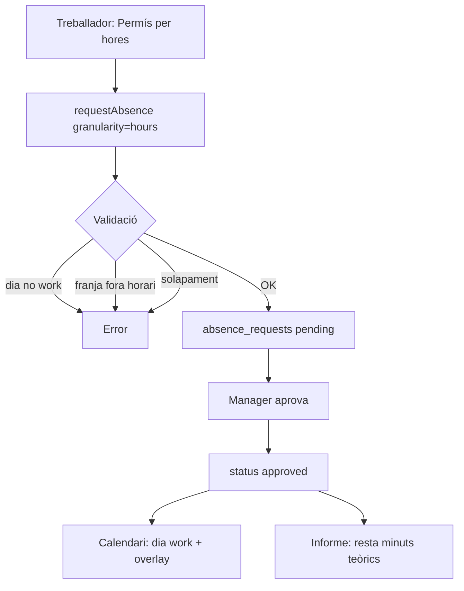

# Model mínim: permís per hores d'una altra app

> Estat: **disseny** (no implementat)  
> Relacionat: [plan.md](./plan.md) §3.3, `AbsenceRequest`, `resolveCalendarMonth`

## 1. Problema

El model actual de `absence_requests` és **només per dies complets**:

- `start_date` / `end_date` → interval de dates
- `working_days_count` → dies laborables comptabilitzats
- En aprovar: el dia sencer passa a `work_calendar_days.day_type = 'leave'`

Un **permís per hores** (metge 2 h, gestions personals, etc.) exigeix:

- Un **sol dia laboral** que segueix sent `work`
- Una **franja horària** dins la jornada planificada
- Reducció del **temps teòric** del dia (informes, avisos, diferència previst/real)
- **Sense** consumir un dia sencer de quota de permisos

## 2. Abast MVP (mínim viable)

| Inclòs | Exclòs (post-MVP) |
|---|---|
| Permís (`leave`) per hores, un sol dia | Vacances per hores |
| Una franja `start_time`–`end_time` per sol·licitud | Vàries franges el mateix dia en una sol·licitud |
| Mateix flux d'estats (`pending` → `approved` / `rejected` / `cancelled` / `revoked`) | Quota anual en hores amb bloqueig automàtic |
| Validació: dia `work`, franja dins horari planificat | Permís nocturn (`end < start`) |
| Visualització al calendari com a overlay | Modificar `work_schedule_intervals` a l'aprovar |
| Resta de minuts teòrics a informes | Conversió automàtica hores → dies de quota |

## 3. Decisió d'arquitectura

**Estendre `absence_requests`** amb granularitat (no crear taula nova al MVP).

Raons:

- Reutilitza CF existents (`request`, `approve`, `reject`, `cancel`, `revoke`, `list`)
- Mateix flux de manager i historial
- Compatibilitat enrere: `granularity = 'day'` per defecte

Taula separada `absence_request_slots` queda reservada per si calen **múltiples franges** per sol·licitud (V2).

## 4. Canvis al model de dades

### 4.1 `absence_requests` — camps nous

| Camp GraphQL | Columna PG | Tipus | Notes |
|---|---|---|---|
| `granularity` | `granularity` | `String!` | `'day'` (default) \| `'hours'` |
| `startTime` | `start_time` | `String` | `HH:mm` timezone tenant; obligatori si `hours` |
| `endTime` | `end_time` | `String` | `HH:mm`; `end_time > start_time` (mateix dia) |
| `durationMinutes` | `duration_minutes` | `Int!` | Calculat a CF; `0` si `day` |

Camps existents reutilitzats:

| Camp | Comportament `granularity = 'hours'` |
|---|---|
| `requestType` | Només `'leave'` (vacances continuen per dies) |
| `startDate` / `endDate` | **Han de ser iguals** (un sol dia) |
| `workingDaysCount` | Sempre `0` |
| `reason` | **Obligatori** |
| `status` | Sense canvis |

### 4.2 DDL (constraints recomanades)

```sql
ALTER TABLE absence_requests
  ADD COLUMN IF NOT EXISTS granularity TEXT NOT NULL DEFAULT 'day',
  ADD COLUMN IF NOT EXISTS start_time TEXT,
  ADD COLUMN IF NOT EXISTS end_time TEXT,
  ADD COLUMN IF NOT EXISTS duration_minutes INT NOT NULL DEFAULT 0;

ALTER TABLE absence_requests
  DROP CONSTRAINT IF EXISTS absence_requests_granularity_check;

ALTER TABLE absence_requests
  ADD CONSTRAINT absence_requests_granularity_check CHECK (
    granularity IN ('day', 'hours')
    AND (
      (granularity = 'day' AND start_time IS NULL AND end_time IS NULL AND duration_minutes = 0)
      OR (
        granularity = 'hours'
        AND request_type = 'leave'
        AND start_date = end_date
        AND start_time IS NOT NULL
        AND end_time IS NOT NULL
        AND start_time < end_time
        AND duration_minutes > 0
        AND working_days_count = 0
      )
    )
  );

CREATE INDEX IF NOT EXISTS idx_absence_requests_hourly_member_date
  ON absence_requests (tenant_member_id, start_date)
  WHERE granularity = 'hours' AND status IN ('pending', 'approved');
```

### 4.3 `schema.gql` (esbós)

```graphql
type AbsenceRequest @table(name: "absence_requests") {
  # ... camps existents ...
  # 'day' | 'hours'
  granularity:      String!    @col(name: "granularity")       @default(value: "day")
  startTime:        String     @col(name: "start_time")
  endTime:          String     @col(name: "end_time")
  durationMinutes:  Int!       @col(name: "duration_minutes")  @default(value: 0)
}
```

### 4.4 Tipus compartits (`packages/time-tracking`)

```typescript
export type AbsenceGranularity = 'day' | 'hours';

export interface AbsenceRequestBase {
  // ...
  granularity: AbsenceGranularity;
  startTime?: string | null;  // HH:mm
  endTime?: string | null;
  durationMinutes: number;
}
```

## 5. Regles de negoci

### 5.1 Creació (`requestAbsence`)

```
SI granularity = 'hours':
  1. requestType ha de ser 'leave'
  2. startDate = endDate
  3. reason obligatori
  4. Resoldre calendari del membre per aquell dia → ha de ser dayType = 'work'
  5. startTime/endTime han de solapar almenys un work_schedule_interval del dia
  6. durationMinutes = minuts entre startTime i endTime (sense creuar mitjanit)
  7. No solapar amb altra sol·licitud hours pending/approved el mateix dia i membre
  8. workingDaysCount = 0
  9. NO validar quota de dies de permís (MVP)

SI granularity = 'day':
  → comportament actual sense canvis
```

### 5.2 Aprovació (`approveAbsenceRequest`)

```
SI granularity = 'day':
  → comportament actual (marca work_calendar_days com leave/vacation)

SI granularity = 'hours':
  1. Canvia status a 'approved'
  2. NO modifica work_calendar_days (el dia segueix sent 'work')
  3. Audit log amb durationMinutes, startTime, endTime
```

### 5.3 Revocació / cancel·lació

```
SI granularity = 'hours':
  → només canvi d'estat; no cal revertir calendar_days
```

### 5.4 Quota de permisos

| Mode | MVP | V2 |
|---|---|---|
| Permís dia complet | Quota en dies (`leave_days_annual`) — ja previst al pla | — |
| Permís per hores | **Sense bloqueig automàtic**; es mostra suma d'hores aprovades a l'any | `leave_hours_annual` a `member_time_profiles` + validació |

## 6. Impacte al calendari i informes

### 6.1 Resolució de calendari (`resolveCalendarMonth`)

Afegir per cada dia resolt (només lectura):

```typescript
interface ResolvedCalendarDay {
  // ... existent ...
  hourlyLeaves?: Array<{
    absenceRequestId: string;
    startTime: string;  // HH:mm
    endTime: string;
    durationMinutes: number;
    reason?: string;
  }>;
}
```

La CF carrega sol·licituds `approved` + `pending` (opcional: només `approved` al calendari del manager) amb `granularity = 'hours'` per al membre i mes.

**UI calendari:** el dia es pinta com a `work` (verd) amb una franja o badge «Permís 10:00–12:00» (blau, com `leave`).

### 6.2 Minuts teòrics del dia

```
theoreticalMinutesEffective =
  theoreticalMinutesPlanned
  − SUM(durationMinutes de permisos hours approved que solapen intervals de treball)
```

Aplicar a:

- `export-time-report` / `get-time-day-summaries`
- Estadístiques de calendari anual (hores planificades)

### 6.3 Avisos de fitxatge

Si hi ha permís per hores aprovat:

- No exigir presència durant la franja
- Opcional V1.1: notificar «Tornar de permís a les HH:mm»

## 7. API (Cloud Functions)

### 7.1 Canvis a payloads existents

**`requestAbsence`** — camps nous opcionals:

```typescript
{
  granularity?: 'day' | 'hours';  // default 'day'
  startTime?: string;             // HH:mm, obligatori si hours
  endTime?: string;
}
```

**`listTenantAbsenceRequests`** — retornar `granularity`, `startTime`, `endTime`, `durationMinutes`.

### 7.2 Helper compartit (nou)

`functions/src/time/absence-hours.ts`:

- `parseTimeToMinutes(hhmm: string): number`
- `computeDurationMinutes(start: string, end: string): number`
- `intervalsOverlap(work: Interval, leave: Interval): boolean`
- `assertHourlyLeaveValid(resolvedDay, startTime, endTime): void`

## 8. UI mínima

### 8.1 tech-portal — sol·licitud

Al tab Absències, tipus **Permís**:

- Selector: **Dia complet** | **Per hores**
- Si «Per hores»:
  - Un date picker (un sol dia)
  - `startTime` / `endTime` (inputs tipus `time`, pas 15 min)
  - Motiu obligatori
  - Vista prèvia: «Dilluns 29/06/2026 · 10:00–12:00 (2 h)»

### 8.2 tenant-portal — Pendents / Historial

Columna **Dates demanades**:

- Dia complet: `29/06/2026 – 30/06/2026` (com ara)
- Per hores: `29/06/2026 · 10:00–12:00` (resaltat)

Columna **Dies**:

- Dia complet: `workingDaysCount`
- Per hores: `—` o `2 h` (segons `durationMinutes`)

### 8.3 Calendari del membre (peu Pendents)

Overlay taronja = sol·licitud pendent (dia complet o franja).  
Overlay blau = permís per hores ja aprovat al calendari resolt.

## 9. Diagrama de flux



## 10. Ordre d'implementació suggerit

1. DDL + `schema.gql` + tipus compartits
2. `absence-hours.ts` + ampliar `requestAbsence`
3. `approveAbsenceRequest` / `revoke` / `cancel` (branca `hours`)
4. `resolveCalendarMonth` — join hourly leaves
5. Informes — minuts teòrics efectius
6. UI tech-portal (formulari)
7. UI tenant-portal (taula + calendari)
8. i18n + tests unitaris helpers

## 11. Tests mínims

| Cas | Resultat esperat |
|---|---|
| Permís 10:00–12:00 en dia `work` 09:00–18:00 | `durationMinutes = 120`, pending OK |
| Mateix dia festiu | Error |
| Franja 08:00–09:00 sense interval de treball | Error |
| Aprovar hours | `work_calendar_days` sense canvi; status approved |
| Aprovar day leave | dia passa a `leave` (regressió) |
| Dos permisos hours solapats mateix dia | Segon rebutjat |
| Revocar hours aprovat | status revoked; teòric torna al valor complet |

## 12. Preguntes obertes (decidir abans de codi)

1. **Mostrar pendents al calendari del treballador?** (recomanat: sí, franja semitransparent)
2. **Pas mínim de temps UI:** 15 min vs 1 min
3. **Permís per hores en dissabte laborable** (`countSaturdayAsWork`): seguir regla de dia `work` resolt
4. **Motius legals:** reutilitzar `leave_reason_code` futur o només `reason` text lliure al MVP

---

**Següent pas:** validar aquest disseny; després implementar fase 1 (DDL + `requestAbsence` + tests).
