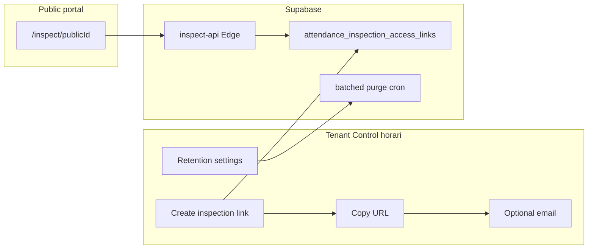

# EX-09 — Retenció legal i accés inspecció per enllaç

> **Rol:** pla d'implementació per a la retenció configurable de fitxatges (RD 8/2019 §0b.1) i l'accés telemàtic per a la Inspecció de Treball via enllaç amb caducitat (§0b.4).
> **Estat:** ✅ implementat (EX-09.1–09.3, 2026-07-19).
> **Depèn de:** roadmap EX-00…EX-08 (tancat) — veure [`EXECUTION.md`](./EXECUTION.md).
> **Relacionat:** [`plan.md`](./plan.md) Fase 0b, [`STATUS.md`](./STATUS.md) §4 Fase 0b.

## Decisions tancades

- **Retenció:** per defecte **no s'esborra res**. El tenant pot activar eliminació definitiva de dades operatives més antigues que **N anys** (mínim legal **4**). Sense cold storage en aquest paquet.
- **Inspecció:** **enllaç opac amb caducitat** (no usuari JWT). El gestor tria empleat + període + caducitat → copia URL → opcionalment envia correu amb plantilla.
- **UI:** noves seccions a [`AttendanceControlPage.tsx`](../../../apps/tenant-portal/src/pages/settings/AttendanceControlPage.tsx) (`/settings/attendance-control`).
- **Rang d'inspecció:** fins a **400 dies** (permet un any complet, cas real d'inspecció), amb paginació/streaming al download per controlar el payload — no es limita l'abast temporal a 93 dies.
- **Transport del secret:** **cookie HttpOnly** després del primer hit (patró portal empleat/estació); no hi ha opció de fragment d'URL com a alternativa.
- **Purge:** només automàtic via cron/`service_role`, en batches. **No** hi ha botó "Executar ara" manual per a owners en aquest paquet.
- **Fora d'abast EX-09:** dashboard ops de cua, Sentry/PagerDuty, cold archive, rol `inspection_authority` com a membre del tenant, ZIP multi-empleat.

## Revisió (errors / millores respecte a la primera versió)

### Errors o buits corregits

1. **Purge monolític** — esborrar "tot el que és més antic que cutoff" en una sola TX pot bloquejar `time_punches` amb milers d'empleats × 4+ anys. Cal **batches** + límit de files/temps per run.
2. **Cascada incompleta** — cal definir explícitament què passa amb anomalies, rollups/ledger legals, informes mensuals del mes fora de retenció, i cues de recompute pendents d'aquells dies. Sense això el purge deixa FKs o residus inconsistents.
3. **Confirmació UI feble** — activar eliminació irreversible només amb un toggle és arriscat; cal confirmació explícita (checkbox "entenc que és irreversible").
4. **Payload d'inspecció sense límit** — un període d'anys amb raw punches pot petar Edge/memòria. Es resol amb **paginació/streaming al download**, no limitant l'abast a un trimestre (una inspecció real sovint demana l'any complet).
5. **Secret a la URL** — el secret a path/query acaba a historial del navegador, logs de proxy i `Referer`. Es fixa **id públic a la ruta** + intercanvi del secret per **cookie HttpOnly de sessió curta** en el primer load; sense alternativa de fragment.
6. **"Rate-limit bàsic" sense contracte** — cal xifres concretes (per IP + per link) i resposta uniforme en fallades per no filtrar existència del recurs.
7. **Email amb secret** — si el correu conté l'URL completa, qualsevol forward és accés. Cal **TTL curt per defecte** (7 dies, no 30) i avís explícit a la UI.

### Escala (molts empleats / fitxatges)

| Flux | Risc | Mitigació al pla |
|------|------|------------------|
| Purge diari multi-tenant | TX llarga, bloat, locks | Batches de N dies o M files; `statement_timeout` controlat; un tenant per invocació de cua; reentrant (reexecutar el mateix cutoff) |
| Índexs | Seq scan per `occurred_at` | Deletes sempre filtrats per `tenant_id` + `occurred_at < cutoff` (índex `idx_time_punches_tenant_occurred` ja existeix) |
| Inspecció 1 empleat × mes | OK | Índex `employee + occurred` ja hi és |
| Inspecció 1 empleat × any (≤400 dies) | Payload gran però acotat | Paginació/streaming al download JSON/CSV; no calcular tot en memòria de cop |
| Llista d'enllaços | Creixement | Índex `(tenant_id, created_at DESC)`; amagar (no esborrar) revocats/caducats > 90 dies a la UI |

**Conclusió escala:** amb **1 empleat + fins a un any** el link escala bé si el download és paginat/streamed. El purge escala només si és **batched**; sense batch, no és apte per a tenants grans.

### Seguretat del link

**Model acceptat (share-link, no login fort):**

- Secret ≥ 32 bytes crypto-random; emmagatzematge **només SHA-256** (patró portal empleat).
- Scope **immutable al crear**: `employee_id` + `period_from/to` — el resolve no accepta paràmetres que amplïin l'abast.
- Multi-ús fins `expires_at` / `revoked_at`; cada accés auditat.
- Sense PIN (l'Administració no té compte); la força és el secret + TTL + revocació + cookie.

**Amenaces i mitigacions obligatòries:**

| Amenaça | Mitigació |
|---------|-----------|
| Filtratge per logs/Referer | Id públic a la ruta; secret enviat un sol cop i intercanviat per **cookie HttpOnly** — mai queda al path estable |
| Brute-force | Rate-limit Edge: 20 intents / 15 min / IP; delay uniforme en hash miss |
| Forward del correu | TTL default **7 dies** (màx. 30); UI avisa "qui tingui l'enllaç veu les dades"; revocar en un clic |
| SSRF / enumeració | Resposta idèntica (404 genèric) per token inexistent, caducat o revocat |
| XSS a la pàgina pública | UI read-only; sense HTML d'usuari; CSV/JSON escapat |
| Privilege via RPC | Resolve **només** via Edge `service_role` + secret; cap `GRANT` del payload a `anon`/`authenticated` sense secret |
| Purge maliciós | Només `service_role`/cron; sense via manual d'owner en aquest paquet; floor legal 4 anys forçat al servidor |

**Veredicte:** adequat per a inspecció puntual (com un document share), no equivalent a un portal amb autenticació forta. Amb cookie HttpOnly + TTL curt + revocació + rate-limit és raonablement segur.

---

## Context tècnic a reutilitzar

- Settings tenant: `useEffectiveSettings` + `useTenantSettingsMutation` (mateix patró que les seccions existents de `AttendanceControlPage.tsx`).
- Export gestor actual: `api.export_attendance_inspection` ([`20260807000001_attendance_inspection_export.sql`](../../../supabase/migrations/20260807000001_attendance_inspection_export.sql)) — només consolidats; el link d'inspecció afegeix **raw + consolidat** amb els límits nous.
- Immutable punches: `data.trg_immutable_time_punches` — el purge només via `SECURITY DEFINER` amb bypass controlat (GUC de sessió).
- Tokens amb hash: patró portal empleat (`sha256Bytes` / `bytesToHex` a `supabase/functions/_shared/employee-portal/crypto.ts`).
- Email: `enqueue_email` + plantilla Liquid (clonar `access-email-service.ts` de l'EP-ACC2), no `NotificationService`.

---

## EX-09.1 — Retenció configurable + purge batched

**Settings tenant (JSONB):**

| Clau | Default | Semàntica |
|------|---------|-----------|
| `attendance_retention_purge_enabled` | `false` | Opt-in eliminació |
| `attendance_retention_years` | `4` | Enter ≥ 4 |

**Backend:**

- Taula `data.attendance_retention_purge_runs` (tenant, `cutoff_date`, `batch_from`/`batch_to`, counts per taula, status, error).
- `data.purge_attendance_older_than_batch(p_tenant_id, p_before date, p_limit int DEFAULT 5000)`:
  - Rebutja si el cutoff viola el floor de 4 anys o el setting del tenant.
  - Esborra com a màxim `p_limit` files/dies-empleat per crida, en ordre fill → raw.
  - Cascada explícita (documentada a la migració): `time_activity_segments` → `time_entries` → `time_daily_summaries` (+ buckets/meta) → anomalies lligades al dia → `time_punches`; neteja cues de recompute òrfenes del rang.
  - Bypass immutability només amb GUC `app.allow_attendance_purge=on` dins la funció.
- Cron/queue diària: per cada tenant amb flag ON, bucle de batches fins idle o pressupost de temps (p.ex. 30s), un tenant per tick per no monopolitzar.
- Purge exclusivament automàtic (cron/`service_role`); sense via manual des de la UI.

**UI:** `AttendanceRetentionSettingsSection` — toggle amb confirmació irreversible + anys (≥4) + text legal RD 8/2019 + darrer `purge_run` (si n'hi ha).

**Tests SQL:** OFF no esborra; floor 4 anys; ON esborra fixture antic en batches i deixa recent intacte; cascada no deixa FKs trencades.

---

## EX-09.2 — Enllaços d'inspecció (empleat + període)

**Límits de producte:**

- Rang màxim: `period_to - period_from ≤ 400 dies`.
- TTL default: **7 dies**; màxim **30 dies**.
- Un empleat per link (sense ampliació al resolve).

**Schema:** `data.attendance_inspection_access_links`

- `id` (uuid públic a la URL), `tenant_id`, `employee_id`, `period_from`, `period_to`.
- `token_hash`, `expires_at`, `revoked_at`.
- `created_by`, `created_at`, `last_accessed_at`, `access_count`.
- `label` opcional.

**RPCs autenticades** (`owner`/`manager` + `attendance.export`):

- `create_attendance_inspection_access_link` — valida rang/TTL; retorna `{ id, url_secret, expires_at }`.
- `list_attendance_inspection_access_links`.
- `revoke_attendance_inspection_access_link`.

**Edge + públic:**

- Edge `inspect-api`: valida hash/expiry/revoke; només retorna dades de l'empleat/rang del row; rate-limit IP + link.
- Ruta `/inspect/[id]`: el client envia el secret un cop (body) i l'Edge estableix una **cookie HttpOnly** de sessió curta (≤ TTL restant, límit lliscant de 12h); el secret no torna a aparèixer al path.
- UI read-only: tenant, empleat, període, caducitat; punches raw; consolidat (summaries + buckets efectius si aplica); descàrrega JSON/CSV paginada/streamed.
- Audit: `access_count`, `last_accessed_at`, fila a `audit_logs` amb actor simbòlic `inspection_authority`.

**UI tenant:** `AttendanceInspectionAccessSection` a Control horari:

1. Empleat + dates (validació ≤400 dies) + caducitat (default 7 dies).
2. Generar → diàleg reveal/copiar + avís de confidencialitat.
3. Llista d'enllaços actius/revocats + Revocar.
4. Enviar per correu a destinataris lliures.

**Email:** plantilla plataforma `attendance.inspection_access` (Liquid) amb `inspection_url`, `employee_name`, `period_from/to`, `expires_at`, `tenant_name`; `enqueue_email` + worker existent.

**Tests:** límits de rang/TTL; create/list/revoke; resolve OK dins TTL; 404 genèric per caducat/revocat; rate-limit; payload scoped a l'empleat/rang; correu enqueued amb event correcte.

---

## EX-09.3 — Docs i tancament

- Actualitzar [`EXECUTION.md`](./EXECUTION.md): paquet EX-09, log d'implementació, matriu Fase 0b.
- Actualitzar [`STATUS.md`](./STATUS.md) i [`plan.md`](./plan.md) §0b.1 / §0b.4 (retenció opt-in batched + link, sense ZIP ni rol membre).
- Smoke: crear link → obrir públic → revocar; activar retenció en tenant demo sense dades crítiques.

## Ordre d'implementació

1. EX-09.1 — retenció batched.
2. EX-09.2 — links + Edge + cookie + UI + email.
3. EX-09.3 — docs.

## DoD

- El tenant pot activar/desactivar el purge ≥4 anys amb confirmació explícita; el default és conservar; el purge s'executa en batches sense bloquejar el clúster.
- El gestor genera un enllaç d'un empleat/període (fins a 400 dies), el copia o l'envia per correu, i l'Administració veu fitxatges raw + consolidat fins a la caducitat sense necessitat de compte; el secret no queda estable al path; és revocable i auditat.
- Cap eliminació de punches fora del job de retenció automàtic.
