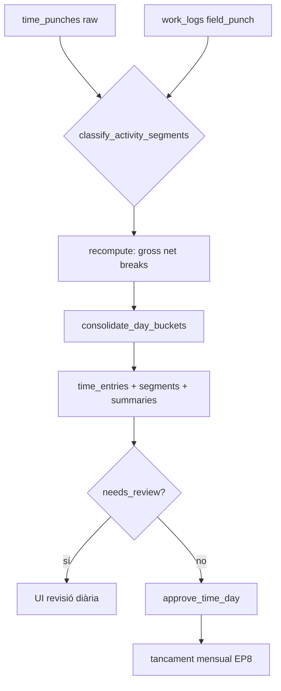

# PRD: Temps Efectiu de Treball

> **Data:** 2026-07-04  
> **Versió:** 4.3 (revisió pre-implementació — coherència codi, dependències, ordre fases)  
> **Estat:** **aprovat per implementació per fases** (Track **G**) — veure §21 abans de codificar  
> **Revisió crítica:** 2026-07-04 — itinerants, `paid_minutes`, model D/E; **2026-07-04b** — arrodoniment tardanes, guàrdies, despeses; **2026-07-04c** — integració projectes (`work_logs` + `field_punch`); **2026-07-04d** — auditoria vs codi actual (`recompute_attendance_worker`, E6, punch types)  
> **Mapa global:** [`STATUS.md`](./STATUS.md)  
> **Integració projectes:** [`prompts/shared/work-logs-time-attendance-integration.md`](../../../prompts/shared/work-logs-time-attendance-integration.md) (D-INT-1 … D-INT-12)  
> **Relacionat:** [`plan-monthly-close-approval.md`](./plan-monthly-close-approval.md) · [`plan.md`](./plan.md) · [`prompts/projectes/plan.md`](../../../prompts/projectes/plan.md) · [`prompt_refine_pauses.md`](./prompt_refine_pauses.md) · [`15-time-attendance-architecture.md`](../../product-design/15-time-attendance-architecture.md) §15.8–15.9 · [`calendaris-laborals.md`](../../help/horaris/calendaris-laborals.md) · [`18-employee-portal-architecture.md`](../../product-design/18-employee-portal-architecture.md)

---

## Resum executiu

L'app ja gestiona **fitxatges bruts** (presència), **calendaris en cascada**, **incidències al fitxar** (E5), **aprovació assistida** (E6) i **tancament mensual** (Tracks A–F). El que falta és la capa de **Temps Efectiu de Treball** i, críticament, la **dimensió remunerable** (`paid_minutes`): regles de cortesia, arrodoniment, **segments d'activitat** (treball / desplaçament / pausa), tall respecte horari o **quota diària**, hores extra desglossades, límits legals configurables, i transparència mensual.

Aquest document defineix:

1. On es parametritzen les regles (`calendar_groups` + settings tenant/site + **`work_profile`** per empleat).
2. El pipeline **punches → segments → buckets** (presència / net / efectiu / **remunerable** / OT).
3. Perfils de jornada: **centre fix** (`fixed_site`) vs **itinerant** (`mobile_peripatetic`) vs híbrid.
4. Revisió manager, resum mensual, alertes, ledger C3, protocol portal.

**Principi legal (RD 8/2019):** els fitxatges raw i l'export d'inspecció **no es modifiquen** semànticament. Consolidació i nòmina són **capes derivades**. El SaaS **parametritza** regles per conveni; **no substitueix** assessorament laboral.

**Limitació v3 corregida a v4:** el model «primera IN → última OUT ∩ horari previst» és vàlid per **oficina/fàbrica**, però **insuficient** per instal·ladors, SAT, repartidors i personal sense centre fix (veure §18).

---

## Índex

1. [Context i pipeline actual](#1-context-i-pipeline-actual)  
2. [Terminologia, buckets i invariants](#2-terminologia-buckets-i-invariants)  
3. [Configuració legal, cortesia, conveni i perfils de jornada](#3-configuració-legal-cortesia-conveni-i-perfils-de-jornada)  
4. [Exemples numèrics (centre fix: cortesia, arrodoniment, pauses)](#4-exemples-numèrics-centre-fix-cortesia-arrodoniment-pauses)  
5. [Cicle de consolidació diària (segments → buckets)](#5-cicle-de-consolidació-diària-segments--buckets)  
6. [Flux de revisió i aprovació mensual](#6-flux-de-revisió-i-aprovació-mensual)  
7. [Alertes i compliment legal](#7-alertes-i-compliment-legal)  
8. [Protocol de registre horari + DMS](#8-protocol-de-registre-horari--dms)  
9. [Model de dades (esborrany)](#9-model-de-dades-esborrany)  
10. [Contracte exportació nòmina (D2/D3)](#10-contracte-exportació-nòmina-d2d3)  
11. [Fases d'implementació](#11-fases-dimplementació)  
12. [Criteris d'èxit (KPIs)](#12-criteris-dèxit-kpis)  
13. [Riscos producte](#13-riscos-producte)  
14. [Auditoria escalabilitat (milers de tenants)](#14-auditoria-escalabilitat-milers-de-tenants)  
15. [Decisions tancades](#15-decisions-tancades)  
16. [Escletxes encara vigilades](#16-escletxes-encara-vigilades)  
17. [Referències codi i UI](#17-referències-codi-i-ui)  
18. [Itinerants, desplaçaments i temps remunerable](#18-itinerants-desplaçaments-i-temps-remunerable)  
19. [Guàrdies — preparació arquitectònica (Track G+1)](#19-guàrdies--preparació-arquitectònica-track-g1)  
20. [Despeses — preparació arquitectònica (pla futur)](#20-despeses--preparació-arquitectònica-pla-futur)  
21. [Revisió pre-implementació (v4.3)](#21-revisió-pre-implementació-v43)

---

## 1. Context i pipeline actual

### 1.1 Pipeline existent (no reinventar)


| Capa | Taula / RPC | Avui | Semàntica real |
|------|-------------|------|----------------|
| **Fitxatge raw** | `time_punches` | ✅ | Immutable; font legal inspecció |
| **Presència bruta** | `time_entries.gross_minutes` | ✅ | Primera IN → última OUT |
| **Treball net fitxatge** | `net_minutes` → `worked_minutes` | ✅ | Presència − pauses no computades |
| **Jornada planificada** | `expected_minutes` | ✅ | `api.resolve_work_day` + calendari cascada |
| **Regular / extra** | `regular_minutes`, `overtime_minutes` | ⚠️ columnes | A `time_entries`: `regular_minutes := net_minutes`, `overtime_minutes := 0` — **placeholder**, no motor efectiu |
| **Arrodoniment** | `attendance_rounding_mode` (registry) | ⚠️ setting | **No aplicat** al motor |
| **Tipus de punch** | `punch_type` CHECK | ✅ 4 tipus | Només `in\|out\|break_start\|break_end` — **`day_*` / `travel_*` inexistents** (Fase 1b) |
| **Presència mobile** | `day_start` → `day_end` | ❌ | Worker usa **primera `in` → última `out`**; ignora `day_start`/`day_end` fins Fase 1b+2b |
| **Segments / buckets nous** | `time_activity_segments`, `paid_minutes`, … | ❌ | Només al PRD |
| **Jornada (capa 1)** | `time_entries.status` | ✅ | open / closed / adjusted / missing |
| **Dia nòmina (capa 2)** | `time_daily_summaries.status` | ✅ | draft / approved / exported |
| **Mes legal (capa 3)** | `attendance_monthly_reports` | ✅ | draft → employee_confirmed → signed |

Veure terminologia de les 3 capes: [`15-time-attendance-architecture.md`](../../product-design/15-time-attendance-architecture.md) §15.9 · implementació [`plan-monthly-close-approval.md`](./plan-monthly-close-approval.md) §A1.

### 1.2 El buit de producte

L'empleat i el gestor veuen **hores treballades** (`worked_minutes` = net) sense distingir:

- **Temps de presència** (arribades avançades, sortides tardanes no autoritzades).
- **Temps efectiu** (després de cortesia, arrodoniment i intersecció amb horari).
- **Hores extra** compensables (descans o nòmina) vs **pendents de revisió**.

Això genera conflictes abans del tancament mensual i debilita la defensa legal (RD 8/2019, Art. 34 ET).

**Hipòtesi implícita del codi actual (a superar):** la jornada és un tram **IN → OUT** (o trams múltiples) en un **centre fix** amb `expected_intervals` horaris. Vàlid per oficina/comerç/fàbrica; **no** per treballadors itinerants (`field_service` a [`prompt_refine_pauses.md`](./prompt_refine_pauses.md) §0.1). La v4 introdueix **segments d'activitat** i **`work_profile`** per no forçar una única semàntica de fitxatge.

### 1.3 Objectiu de producte

Introduir un **Protocol de Registre Horari** parametritzable i un **motor de consolidació diària** que produeixi **Temps Efectiu** traçable, revisable pel gestor i transparent per l'empleat — integrat amb:

- Flux mensual EP8 (confirmació L1 / signatura L2).
- Vista nòmina gestor (B2 `get_payroll_review_days`).
- Export D2/D3.1 i inspecció (raw immutable).
- Track C3 compensacions (`time_compensation_ledger`).
- DMS + plantilles (protocol publicat al portal).

### 1.4 Pipeline objectiu (Track G)



**Nota:** `work_logs` només entren al classificador quan `work_profile = mobile_peripatetic` i `entry_mode = field_punch` (§5.0). Perfil `fixed_site` pot classificar només des de punches fins que no cal projectes.

**Estat actual del worker** (`api.recompute_attendance_worker`, migració `20260805000001`): calcula gross/net des de **`in`/`out`** + pauses; **no** llegeix polítiques, **no** escriu buckets nous. Track G **substitueix/estén** aquest bloc, no el duplica en paral·lel.

---

## 2. Terminologia, buckets i invariants

### 2.1 Glossari (obligatori a la UI)

| Terme (CA) | Camp tècnic | Definició |
|------------|-------------|-----------|
| **Segment d'activitat** | `time_activity_segments` | Interval derivat `[start, end)` classificat: WORK, TRAVEL, BREAK, OFF_DUTY, STANDBY |
| **Jornada planificada** | `expected_minutes` | Minuts previstos (calendari) o **quota diària** (`time_budget`) segons `work_profile` |
| **Temps de presència** | `presence_minutes` | Primera activitat registrada → última (segons política de perfil) |
| **Treball net fitxatge** | `net_minutes` | Presència − pauses no computades − desplaçaments si política exclou TRAVEL del net |
| **Treball productiu** | `work_minutes` | Σ segments `activity_kind = WORK` |
| **Desplaçament** | `travel_minutes` | Σ segments `TRAVEL` — **categoria distinta de pausa** (§18.2) |
| **Temps efectiu (nòmina)** | `effective_minutes` | Treball subjecte a tall operatiu + OT autoritzada; **≠ temps remunerable** |
| **Temps remunerable** | `paid_minutes` | Minuts que entren a nòmina segons conveni — **bucket independent** |
| **Hores ordinàries efectives** | `regular_minutes` | Dins jornada/horari segons `jornada_model` |
| **Hores extra calculades** | `overtime_minutes` | Excés segons `overtime_base` (configurable: `paid`, `effective`, `work`) |
| **Hores extra autoritzades** | `overtime_authorized_minutes` | Subconjunt exportable / compensable |
| **Extra pendent compensació** | `time_compensation_ledger` | Track C3 |
| **Tall consolidació** | `consolidation_meta` | Regles + deltas per bucket |

**Regla UX:** mai un sol número sense etiqueta. Per defecte **4 columnes** quan hi hagi dades: *Planificat · Presència/Net · Efectiu · Remunerable*. Perfil `fixed_site` pot ocultar «Remunerable» si `paid_minutes = effective_minutes` sempre.

### 2.2 Relació entre buckets (matriu conceptual)

Un mateix minut pot tenir flags diferents segons conveni. Exemples:

| Minut | Presència | Net | Efectiu | Remunerable | OT base |
|-------|-----------|-----|---------|-------------|---------|
| Conducció casa→obra (conveni A) | ✓ | ✗ | ✗ | ✓ | ✓ |
| Conducció (conveni B, Tyco) | ✓ | ✓ | ✓ | ✓ | ✓ |
| Dinar no pagat | ✓ | ✗ | ✗ | ✗ | ✗ |
| Esmorzar pagat per conveni | ✓ | ✓ | ✓ | ✓ | ✓ |
| Treball a obra | ✓ | ✓ | ✓ | ✓ | ✓ |
| Espera a client (STANDBY) | ✓ | ? | ? | Depèn política | Depèn |

La política defineix flags per **`activity_kind`**, no per empleat al codi.

### 2.3 Invariants algebraics (v4)

```
presence_minutes  = Σ segments on counts_presence
work_minutes      = Σ segments WORK
travel_minutes    = Σ segments TRAVEL
net_minutes       = presence − breaks_unpaid − (travel si policy exclou del net)
paid_minutes      = Σ segments on counts_paid
effective_minutes = f(policy, work_profile, segments)   -- veure jornada_model
regular_minutes   = min(effective_base, daily_budget_or_expected)  -- base = overtime_base de política
overtime_minutes  = max(0, overtime_base − regular_cap)   -- pas 2 §4.2; no barrejar amb arrodoniment
```

**Relacions (no confondre buckets):**

- `worked_minutes` al summary **es manté = `net_minutes`** (compatibilitat dashboard, E6, B2 avui).
- `paid_minutes ≥ effective_minutes` **pot** ser cert (Conveni C: viatge pagat no efectiu).
- `regular_minutes + overtime_minutes` descriu el **desglossament de l'excés** respecte `overtime_base`; **no** implica `regular + OT = paid` en perfils mobile.
- **`overtime_authorized_minutes` ≤ `overtime_minutes`** — subconjunt exportable post-E5/manager.

**Funcions SQL úniques:** `classify_activity_segments(...)`, `consolidate_day_buckets(...)` — no duplicar lògica a TypeScript.

### 2.4 Separació legal vs operativa (disclaimer)

| Concepte | El sistema el modela? |
|----------|----------------------|
| Registre horari raw (RD 8/2019) | Sí — `time_punches` |
| Temps de treball (Directiva 2003/88/CE) | Parcial — via flags `counts_statutory_work` per segment |
| Temps a disposició | Parcial — `STANDBY` |
| Temps efectiu art. 34.4 ET | Via `effective_minutes` + pausa `counts_as_work` |
| Temps remunerable / nòmina | Via `paid_minutes` |
| Assessament jurídic automàtic | **No** — `jurisdiction_code` + plantilles + configuració tenant |

---

## 3. Configuració legal, cortesia, conveni i perfils de jornada

### 3.1 Dos eixos separats (no barrejar)

| Eix | Què resol | Mecanisme | Precedent codi |
|-----|----------|-----------|----------------|
| **Calendari** | Quin dia es treballa, intervals previstos | Cascada 6 capes + absències | `resolve_schedule_planner_day` · [`calendaris-laborals.md`](../../help/horaris/calendaris-laborals.md) |
| **Política de registre** | Com es compten les hores (cortesia, arrodoniment, OT) | Cascada paral·lela | `resolve_attendance_geo_enabled` |

**Ordre cascada calendari (implementat, de més a menys prioritat):**

1. Override empleat  
2. Override grup @ local (grup + site)  
3. Override local (site)  
4. Override grup global (grup sense site)  
5. Override empresa (tenant)  
6. Festiu assignat  
7. Indefinit  

**Ordre cascada política de registre (proposat — alineat amb calendari):**

| Prioritat | Nivell | Ús |
|-----------|--------|-----|
| 1 | Override empleat | Acords individuals, bloqueig d'extres |
| 2 | Grup @ site | Conveni del centre dins un grup global |
| 3 | Override site | Centre sense grup o excepció local |
| 4 | Grup global (`calendar_groups`, `site_id` NULL) | **Plantilla de conveni** |
| 5 | Tenant | Defaults empresa |
| 6 | Sistema | Defaults plataforma |

**Notes:**

- Els **festius** no entren a la política de registre: `expected_minutes = 0` via calendari.
- **Empleat sense `calendar_group_id`:** hereta tenant → sistema; UI: «Política empresa (sense grup de conveni)».
- **Política històrica:** `resolve_attendance_record_policy` usa `work_date` ∈ `[effective_from, effective_to]` — mai política «d'avui» sobre mesos tancats.
- **Opcional Fase 2+:** capa `departments` (com geo E4) si RRHH ho demana.

### 3.2 Límits legals — configurables (tenant + site)

**No hardcodar** «80h Estatut» al codi ni als textos fixos. Els límits **legals/statutaris** viuen al **settings engine** (`settings_registry` + `get_effective_settings`), editables a **`/settings/attendance-control`**, amb override per **site** (multi-país dins un tenant).

| Clau | Tipus | Defecte ES | Descripció |
|------|-------|------------|------------|
| `attendance_statutory_max_overtime_minutes_year` | integer | `4800` (80h) | Màxim hores extra legals per període |
| `attendance_statutory_overtime_period` | enum | `calendar_year` | `calendar_year` \| `rolling_12m` \| `fiscal_year` |
| `attendance_statutory_fiscal_year_start_month` | 1–12 | `1` | Si període = `fiscal_year` |
| `attendance_statutory_jurisdiction_code` | string | `ES` | Etiqueta UI + plantilles (no motor de dret) |
| `attendance_statutory_max_work_minutes_year` | integer \| null | `null` | Opcional jornada anual màxima legal |
| `attendance_statutory_alert_thresholds_pct` | int[] | `[80, 90, 100]` | Llindars alertes |
| `attendance_statutory_block_punch_on_limit` | bool | `false` | Bloquejar fitxatge (off per defecte; perillós) |

**Separació límit legal vs conveni:**

| Tipus | On | Exemple |
|-------|-----|---------|
| Legal/statutari | Tenant / site settings | 80h/any ES; desactivable en altres jurisdiccions |
| Conveni col·lectiu | Política `calendar_group` | Màx. 30h extra/any conveni X |
| Alertes | `MIN(legal, conveni)` si ambdós actius | El més restrictiu guanya |

La UI mostra **procedència del límit** («Llei ES: 80h» vs «Conveni Logística: 30h»).

**Unificar arrodoniment:** deprecar `attendance_rounding_mode` com a UI independent; el registry tenant és **default** injectat a política si el grup no defineix `rounding` (veure §14.2).

### 3.3 Política de conveni — JSON `policy` v2

La v1 (només cortesia/arrodoniment) queda com a **subconjunt** de `fixed_site`. La v2 afegeix **`work_profile`**, **`jornada_model`** i matriu **`activities`**.

```json
{
  "version": 2,
  "work_profile": "fixed_site",
  "jornada_model": "schedule_intersection",
  "daily_work_budget_minutes": null,
  "activities": {
    "WORK": {
      "counts_presence": true,
      "counts_net_work": true,
      "counts_effective": true,
      "counts_paid": true,
      "counts_overtime_base": true,
      "counts_annual_work_limit": true,
      "counts_comp_time_accrual": true
    },
    "TRAVEL": {
      "counts_presence": true,
      "counts_net_work": false,
      "counts_effective": false,
      "counts_paid": false,
      "counts_overtime_base": false,
      "counts_annual_work_limit": false,
      "include_home_to_first": false,
      "include_last_to_home": false,
      "include_between_sites": false
    },
    "BREAK_UNPAID": {
      "counts_presence": true,
      "counts_net_work": false,
      "counts_effective": false,
      "counts_paid": false
    },
    "BREAK_PAID": {
      "counts_presence": true,
      "counts_net_work": true,
      "counts_effective": true,
      "counts_paid": true
    },
    "OFF_DUTY": {
      "counts_presence": false,
      "counts_paid": false
    },
    "STANDBY": {
      "counts_presence": true,
      "counts_paid": true,
      "counts_effective": false
    }
  },
  "depot_rule": {
    "required": false,
    "site_id": null,
    "jornada_starts_at_depot": false
  },
  "courtesy": {
    "early_arrival_minutes": 15,
    "late_arrival_grace_minutes": 5,
    "early_departure_minutes": 15,
    "late_departure_minutes": 15,
    "overflow_early": "needs_review",
    "apply_to_activity_kinds": ["WORK"]
  },
  "rounding": {
    "mode": "quarter_hour",
    "direction": "favor_employee",
    "apply_to_punch_types": ["in", "out", "day_start", "day_end"],
    "apply_to_activity_kinds": ["WORK"],
    "never_reduce_paid_below_net": true,
    "asymmetric": {
      "in_never_after_real": true,
      "out_never_before_real": true,
      "late_arrival": "down_to_expected_or_quarter",
      "early_departure": "exact_or_down"
    }
  },
  "overtime": {
    "allowed": true,
    "requires_prior_authorization": true,
    "overtime_base": "paid_minutes",
    "max_annual_minutes_convenio": 1800,
    "compensation_mode": "time_off_or_payroll"
  },
  "annual_limits": {
    "max_work_minutes_convenio": 112800
  }
}
```

**Perfil `mobile_peripatetic` (exemple):** `jornada_model: "time_budget"`, `daily_work_budget_minutes: 480`, TRAVEL amb `include_home_to_first: true`, `counts_paid: true`, `counts_effective: false` — veure §18.4.

**Arrodoniment:** veure §4.6 (regles assimètriques — **obligatòries**). Resum: en **entrada tardana** mai arrodonir cap amunt del fitxatge real; en **sortida** mai cap avall del real. `favor_employer` en IN tard = minut exacte; en OUT = minut exacte (sense pujar).

**RPC:** `api.resolve_attendance_record_policy(p_employee_id, p_work_date)` → `{ policy, resolved_from, policy_id, work_profile }`.

### 3.4 UI de configuració

| Ubicació | Què configura |
|----------|---------------|
| `/settings/attendance-control` | Límits legals tenant; enllaç a política per defecte |
| Planificació → **Grups** (`CalendarGroupsSection`) | Política de conveni del grup |
| Settings per **site** (si exposat) | Override jurisdicció / límits legals |
| Fitxa empleat → Control horari | **`work_profile`** + override política + preview resolta |
| Inspector calendari (`LaborCalendarGrid` / `DayInspector`) | Pestanya «Política registre» amb capa guanyadora |

### 3.5 Perfils de jornada (`work_profile`)

Assignable per empleat (override) o per defecte al `calendar_group`. Determina **botons de fitxatge** i **algorisme de consolidació**.

| Perfil | `jornada_model` | Expected | Fitxatges típics | Càlcul OT |
|--------|-----------------|----------|------------------|-----------|
| **`fixed_site`** | `schedule_intersection` | Intervals horaris cascada | IN/OUT + pauses | Excés vs horari previst |
| **`mobile_peripatetic`** | `time_budget` | Quota diària (480) o planificació visites | day_start/end + work per client | Excés vs `daily_work_budget` o setmanal |
| **`hybrid`** | Mix per dia | Calendari + excepcions camp | Segons dia | Mix |
| **`delivery`** | `time_budget` + finestres | Rutes | Parada / escaneig | Conveni logística (fase posterior) |

**Setting empleat:** `attendance_work_profile` (enum) amb herència: empleat → grup → tenant → `fixed_site`.

**UX:** el perfil **no** el tria l'empleat; el determina RRHH. La UI de fitxatge mostra només accions permeses pel perfil (§18.6).

### 3.6 Flexibilitat horària: dinar, trams partits i entrades (decisió 2026-07-05)

Tres escenaris recurrents a botiga/oficina i camp — **no barrejar** perfils ni mecanismes.

#### 3.6.1 Oficina / centre fix (`fixed_site`) — jornada partida

| Pregunta | Decisió |
|----------|---------|
| El buit migdia (ex. OUT 14:05 → IN 16:10) és treball? | **No.** Ja exclòs de `presence`/`net` per suma de trams IN/OUT (§4.3). Mai `break_*` automàtic en aquest buit. |
| L'empleat pot sortir/entrar fora de 14:00/16:00? | **Sí, en raw** — els fitxatges es conserven al minut. L'**efectiu** es calcula per **intersecció amb trams previstos** + cortesia **per tram** (no només sobre el sobre de tot el dia). |
| «Dinar flexible N min dins finestra M» | Política opcional **`flex_midday`** (grup o empleat). Validació a consolidació; **no** canvia el calendari base de trams WORK. |
| Cortesia IN tarda 16:10 vs previst 16:00 | **Per tram:** grace de la política (ex. 5 min) o incidència `LATE_ARRIVAL` — **G2a.1** abans de G2b (decisió #27). |

**Bloc `flex_midday` (política v2 — proposta tancada, implementació G2a.2):**

```json
"flex_midday": {
  "enabled": true,
  "earliest_break_end": "13:00",
  "latest_shift_resume": "16:00",
  "min_break_minutes": 60,
  "max_break_minutes": 120,
  "outside_window": "needs_review"
}
```

| Regla | Comportament |
|-------|--------------|
| Durada buit `D = IN_tarda − OUT_migdia` | Si `min ≤ D ≤ max` **i** `OUT ≥ earliest_break_end` **i** `IN ≤ latest_shift_resume` → **OK** (sense incidència per sola flexibilitat). |
| `D < min_break_minutes` | Pausa massa curta → `needs_review` o incidència configurable (`SHORT_BREAK`). |
| `D > max_break_minutes` | Pausa massa llarga → `needs_review` / `LONG_BREAK`. |
| Fora finestra horària | `outside_window`: per defecte `needs_review`; RRHH pot acceptar via E5. |
| Buckets | **`effective_minutes`** segueix tram a tram (cortesia + ∩ expected); **`flex_midday` no amplia** l'horari previst — només evita fals positius de revisió quan el buit és dins N/M. |

**Exemple (§4.3 ampliat):** horari 08–14 \| 16–18; `flex_midday` 13:00–16:00, 60–120 min. Fitxatges 07:55 · 14:10 · 16:10 · 18:40 → buit 120 min dins finestra → OK; `presence`/`worked` = 515; `effective` = 480 amb cortesia per tram; OT segons OUT tarda (fixture G2a).

#### 3.6.2 Oficina — entrada matí flexible (tràfic, etc.)

| Pregunta | Decisió |
|----------|---------|
| Arribada dins cortesia/grace (ex. IN 08:03, grace 5 min) | §4.1 + §4.6 — efectiu des de cortesia o minut real segons mode; **mai** arrodonir tardana ↑. |
| Arribada fora grace (ex. IN 08:20) | Efectiu des del fitxatge real; `LATE_ARRIVAL`; E5 / revisió RRHH si reincidència. |
| «Entrar qualsevol hora fins a les 10:00 compta jornada completa» | **Fora G2a** — requereix **`flex_entry_band`** al calendari (core hours / banda flexible). Post-MVP; no confondre amb grace de conveni. |

#### 3.6.3 Camp / itinerant (`mobile_peripatetic`)

| Pregunta | Decisió |
|----------|---------|
| Dinar allargat entre clients | **`gap_kind`** declarat per l'empleat al buit entre `field_punch` (D-INT-7) — **G2c**, no inferència automàtica. |
| Sense declaració i buit > llindar | `UNCLASSIFIED` → `needs_review` (política tenant). |
| Remuneració del buit | Matriu `activities` + G2b (`time_budget`); no usar `flex_midday` de `fixed_site`. |

#### 3.6.4 Ordre d'implementació (abans G2b)

| Pas | Entregable | Fase |
|-----|------------|------|
| 1 | Suma presència per trams + cortesia sobre sobre del dia | **G2a** (en curs) |
| 2 | Cortesia **per tram** (matí/tarda) + fixture §4.3 IN 16:10 | **G2a.1** — **bloquejant G2b** |
| 3 | Validació `flex_midday` N/M a consolidació + UI política | **G2a.2** — recomanat abans G2b si botigues amb dinar flexible |
| 4 | `gap_kind` BREAK/TRAVEL al buit mobile | **G2c** |

---

## 4. Exemples numèrics (centre fix: cortesia, arrodoniment, pauses)

**Convencions (perfil `fixed_site`):**

- Horari previst: **08:00–14:00** i **16:00–18:00** → `expected_minutes = 480`
- Política: cortesia entrada **15 min** abans; cortesia sortida **15 min** després; arrodoniment **quart d'hora**, `favor_employee`, regles §4.6
- **Ordre motor (obligatori):** classificar segments (o tram únic WORK) → calcular `net_minutes` → **cortesia** als límits WORK → **pas 1 arrodoniment** punch → **pas 2 tall vs `expected_end`** → buckets (`regular`/`OT`/`paid`/`effective`)

### 4.1 Entrada (IN) — horari previst 08:00

| Fitxatge real | Presència | Cortesia / tardana | Pas 1 — IN ajustat (arrodoniment) | Pas 2 — IN efectiu | Notes |
|---------------|-----------|-------------------|-----------------------------------|-------------------|-------|
| 07:55 | 07:55 | 5 min abans horari | 07:45 (↓ quart) | **08:00** | Anticipada dins cortesia |
| 07:50 | 07:50 | 10 min abans | 07:45 (↓) | **08:00** | Idem |
| 07:44 | 07:44 | 16 min abans (overflow) | 07:30 (↓) | **08:00** | Overflow → `needs_review` |
| **08:03** | 08:03 | Tardana 3 min | **08:03** (exacte) o **08:00** (cortesia↓) | **08:03** o **08:00** | **Mai 08:15** — arrodonir amunt una tardana penalitza l'empleat |
| **08:20** | 08:20 | Tardana 20 min (fora grace 5) | **08:20** (exacte) | **08:20** | 20 min menys efectiu; `LATE_ARRIVAL`; reincidència → revisió RRHH |

**Regles per mode (tardana, fitxatge després de `expected_start`):**

| Mode | IN ajustat | IN efectiu típic |
|------|------------|------------------|
| `favor_employee` | `min(real, expected_start)` o quart **↓** mai > real | Cortesia fins a 08:00 **o** minut real 08:03 |
| `favor_employer` | **Minut exacte** (08:03) | 08:03 — l'empleat perd els minuts de retard |
| `nearest_quarter` (neutre) | Quart **↓** (08:03 → 08:00) | Mai quart ↑ en tardana |

**Anticipada (abans de 08:00):** `favor_employee` pot arrodonir ↓ però `IN_efectiu = max(després_cortesia, expected_start)`.

### 4.2 Sortida (OUT) — horari previst fins 18:00

Dos passos **separats** (evitar confondre arrodoniment amb OT):

1. **Pas 1 — Arrodoniment del punch OUT** (respectant §4.6: mai OUT ajustat < real).
2. **Pas 2 — Tall consolidació:** `OT_bruta = max(0, OUT_ajustat − expected_end − cortesia_sortida)`.

| Fitxatge real | Cortesia sortida (15 min) | Pas 1 — OUT ajustat | Pas 2 — OT vs 18:00 | Efectiu fi treball |
|---------------|---------------------------|---------------------|---------------------|-------------------|
| 18:05 | 5 min dins cortesia | 18:15 (↑) | **0** | 18:00 |
| 18:12 | 12 min dins cortesia | 18:15 (↑) | **0** | 18:00 |
| **18:18** | 18 min després (15 cortesia + 3) | **18:30** (↑) favor_emp · **18:18** exact favor_emp · **18:15** (↓) neutre | **30** · **18** · **15** min OT | 18:00 + OT si autoritzada |
| 18:40 | 40 min després | 18:45 (↑) | **45** min OT (no 25–40 barrejats) | 18:00 + OT si autoritzada |
| 17:50 | Sortida anticipada | 17:50 (exacte; no ↓ sota real) | **0** OT | 17:50 |

**Exemple 18:18 detallat (single tram, `favor_employee`):**

| Pas | Càlcul |
|-----|--------|
| Raw | OUT 18:18 |
| Pas 1 arrodoniment | 18:18 → **18:30** (↑ permès en sortida) |
| Pas 2 vs expected_end 18:00 | Excés = 18:30 − 18:00 = **30 min** OT calculada |
| Cortesia sortida | Els primers 15 min després de 18:00 poden ser `presence_only` segons política — si s'apliquen abans del pas 2, recalcular OT sobre el residual; **fixture Fase 2a fixarà ordre exacte** |
| Autorització | 30 min → `overtime_authorized_minutes` si E5/manager; sinó `OVERTIME_UNAUTHORIZED` |

**Nota:** els «+3 min» de la v4 anterior eren un error (barrejava delta d'arrodoniment amb OT). L'OT es mesura sempre respecte **expected_end**, no respecte el quart arrodonit intermedi.

**`favor_employer` OUT:** minut **exacte** (17:53 → 17:53), sense arrodonir cap amunt.

### 4.3 Jornada partida (doc 15 — corregit)

Horari **08:00–14:00 | 16:00–18:00**. Política cortesia 15 min; extra autoritzada.

| Pas | Càlcul |
|-----|--------|
| Fitxatges raw | 07:55 IN · 14:05 OUT · 16:10 IN · 18:40 OUT |
| `presence_minutes` | (14:05−07:55) + (18:40−16:10) = **520** |
| Buit migdia 14:05–16:10 | **No** és `break_*`; ja exclòs del gross entre trams |
| `net_minutes` | **520** (sense `break_*` addicionals) |
| Cortesia IN matí | 07:55 → efectiu des de **08:00** |
| Cortesia OUT migdia | 14:05 → efectiu fins **14:00** |
| Cortesia IN tarda | 16:10 vs 16:00 → +10 min (`LATE_ARRIVAL` o dins grace 5 min) |
| Cortesia OUT tarda | 18:40 → pas 2 OT = **45 min** vs 18:00 (fixture tancat Fase 2a) |

**Flexibilitat migdia (14:05–16:10):** veure §3.6 — el buit no és treball; amb **`flex_midday`** 60–120 min dins 13:00–16:00 seria OK en revisió; l'efectiu segueix ∩ trams + cortesia per tram (G2a.1).

**Fase 2a:** fixture SQL amb política JSON tancada, ordre cortesia vs arrodoniment explicitat, resultats **exactes**. G2a.1 ampliarà fixture IN tarda 16:10 amb cortesia per tram.

### 4.4 Pauses (i per què el desplaçament **no** és pausa)

| Escenari | Comportament |
|----------|--------------|
| Pausa dins horari (`break_*`, `counts_as_work=false`) | Segment `BREAK_UNPAID`; resta del net |
| Pausa `counts_as_work=true` | Segment `BREAK_PAID`; compta segons flags |
| Pausa oberta (`PAUSE_NOT_CLOSED`) | `needs_review`; resolució manager |
| **Desplaçament** | Segment **`TRAVEL`** — mai `break_*` (semàntica i flags oposades; §18.2) |
| Absència parcial | `employee_absences` — no és pausa ni travel |
| Arrodoniment en pauses | Per defecte **no**; configurable |

### 4.5 Matriu modes d'arrodoniment (perfil `fixed_site`, §4.6 aplicat)

| mode | IN 07:52 (anticipada) | IN 08:03 (tardana) | OUT 17:53 | OUT 18:18 |
|------|----------------------|-------------------|-----------|-----------|
| `real_minute` | 07:52 | 08:03 | 17:53 | 18:18 |
| `quarter_hour` + `favor_employee` | 07:45 (↓) → efectiu 08:00 | **08:03** o 08:00 cortesia; **mai 08:15** | 18:00 (↑) | 18:30 (↑) |
| `quarter_hour` + `favor_employer` | 07:45 (↓) anticipada OK | **08:03 exacte** | **17:53 exacte** (no ↑) | **18:18 exacte** (no ↑) |
| `nearest_quarter` neutre | 07:45 (↓) | 08:00 (↓) | 18:00 (↑) | 18:15 (↓) o 18:30 segons implementació — **tardana IN sempre ↓** |

### 4.6 Regles assimètriques d'arrodoniment (decisió v4.1 — obligatòries al motor)

> Correcció revisió producte 2026-07-04: una arribada tardana **mai** pot arrodonir-se cap amunt (ex. 08:03 → 08:15).

**Invariant 1 — Entrada (IN / day_start / in obra):**

```
IN_ajustat ≤ occurred_at_real    (mai posterior al fitxatge)
```

- Si `occurred_at > expected_start` (**tardana**): només ↓ cap a quart inferior o `expected_start` (cortesia); **`favor_employer` = minut exacte**.
- Si `occurred_at ≤ expected_start` (**anticipada**): `favor_employee` pot ↓ al quart però `IN_efectiu ≥ expected_start` després de cortesia.

**Invariant 2 — Sortida (OUT / day_end):**

```
OUT_ajustat ≥ occurred_at_real    (mai anterior al fitxatge)
```

- `favor_employee` pot ↑ al quart superior.
- **`favor_employer` = minut exacte** (no ↑): l'empresa no regala minuts no treballats.

**Pas 2 separat:** l'OT es calcula **després** d'ajustar IN/OUT, comparant amb `expected_end` / `daily_work_budget` — no confondre amb el delta d'arrodoniment.

**Retards reiterats:** fora del motor — alertes RRHH / `LATE_ARRIVAL` + dashboard; no s'«arrodoneixen» penalitzacions extra.

**Tests obligatoris Fase 2a:** IN 08:03 mai → 08:15; OUT 18:18 OT = 30 min (favor_emp, OUT→18:30) vs 18 min (exacte).

---

## 5. Cicle de consolidació diària (segments → buckets)

### 5.0 Segmentació d'activitat (pas zero — abans de cortesia)

**Entrada (perfil `fixed_site`):** seqüència cronològica de `time_punches` del dia.

**Entrada (perfil `mobile_peripatetic`):** `time_punches` (raw) **+** `data.work_logs` amb `entry_mode = 'field_punch'` del mateix dia (D-INT-3, D-INT-4). Els segments WORK amb projecte es construeixen preferentment des dels intervals `check_in`→`check_out` del `work_log`; els gaps declarats entre `work_logs` (`gap_kind`) generen segments TRAVEL/BREAK; gaps sense declaració → `UNCLASSIFIED`.

**Sortida:** `time_activity_segments` (taula derivada, recomputable; **no** substitueix raw).

```mermaid
stateDiagram-v2
  [*] --> OFF_DUTY
  OFF_DUTY --> TRAVEL: day_start / travel_start
  TRAVEL --> WORK: in (arribada obra/client)
  WORK --> BREAK: break_start
  BREAK --> WORK: break_end
  WORK --> TRAVEL: out + travel_start / canvi obra (legacy punch-only)
  WORK --> WORK: switch_work_log (field_punch — estat horari working; D-INT-6)
  TRAVEL --> OFF_DUTY: day_end / travel_end
  WORK --> OFF_DUTY: out (últim tram, sense travel)
```

**Mapatge fitxatges → transicions (v4):**

| `punch_type` (nou o existent) | Transició | Perfil |
|-------------------------------|-----------|--------|
| `in` / `out` | WORK ↔ OFF/TRAVEL | `fixed_site`, per tram obra |
| `break_start` / `break_end` | WORK ↔ BREAK | Tots |
| `day_start` / `day_end` | OFF ↔ jornada | `mobile_*` |
| `travel_start` / `travel_end` | TRAVEL | `mobile_*`, `hybrid` |

**Compatibilitat:** perfil `fixed_site` sense nous tipus → un sol segment WORK entre primera IN i última OUT (comportament actual).

**Classificació:** `classify_activity_segments(employee_id, work_date, policy)` dins el worker, **mateixa TX** que net.

**Geo opcional:** recordatori «has arribat a X» — **no** auto-fitxatge sense acció explícita.

**Pipeline `mobile_peripatetic` (ordre exacte — D-INT-3/4):**

```text
time_punches (raw) + work_logs (entry_mode = field_punch)
  → classify_activity_segments (inclou gaps declarats per gap_kind)
  → apply_grace_and_rounding
  → compute_buckets (presence, net, effective, paid)
  → consolidate → time_daily_summaries
```

El recompute **ha de** llegir `work_logs` `field_punch` abans d'aplicar cortesia/arrodoniment quan `work_profile = mobile_peripatetic`. Els `work_logs` amb `entry_mode IN ('timer','manual')` s'**ignoren** en aquest pas.

### 5.1 Algorisme de consolidació (per perfil)

**Entrades:** segments classificats, `policy`, autoritzacions E5, `expected_intervals` o `daily_work_budget`.

**Ordre comú:**

1. Classificar segments (`§5.0`).
2. Aplicar **cortesia** als límits WORK (i punts day_start/end si política ho inclou).
3. **Pas 1 — Arrodoniment** als timestamps IN/OUT (regles assimètriques §4.6).
4. **Pas 2 — Tall / OT:** segons `jornada_model` (comparar amb `expected_end` o `daily_work_budget`).
5. Agregar **buckets** per flags `activities.*`.
6. Filtrar `overtime_authorized_minutes`; persistir + `consolidation_meta`.

**Torns nocturns:** finestra `spans_midnight`.  
**Absència/festiu:** segments buits; buckets a 0 excepte absència.  
**Absència parcial:** WORK només en finestra treballable restant.

**Transacció:** dins `recompute_attendance_worker`; separar cua si p95 > 500ms.

### 5.2 Algorisme legacy (només referència `fixed_site`)

Per compatibilitat amb exemples §4: net → cortesia IN/OUT → ∩ expected → OT. Subsumit per §5.1 quan `work_profile = fixed_site` i un sol tram WORK.

### 5.3 Persistència

| Taula | Camps nous / actualitzats |
|-------|---------------------------|
| `time_activity_segments` | `activity_kind`, `started_at`, `ended_at`, `site_id?`, `client_ref?`, flags snapshot |
| `time_entries` | `work_minutes`, `travel_minutes`, `presence_minutes`, `paid_minutes`, `regular_minutes`, `overtime_*`, `effective_minutes` |
| `time_daily_summaries` | Mirall buckets + `consolidation_meta` + desglossament per kind |

`consolidation_meta` exemple v4:

```json
{
  "policy_version": 2,
  "work_profile": "mobile_peripatetic",
  "resolved_from": "group:field_service",
  "segment_count": 5,
  "buckets": {
    "work": 480,
    "travel": 120,
    "paid": 600,
    "effective": 480,
    "regular": 480,
    "overtime": 0
  },
  "rules": ["travel_home_first_paid", "budget_480"],
  "unclassified_gaps": []
}
```

### 5.4 UI revisió diària

Ampliar `AttendanceDayDetailDialog`:

| Bloc | Contingut |
|------|-----------|
| Resum 4 columnes | Planificat · Presència/Net · Efectiu · **Remunerable** |
| Timeline | Raw punches → **segments** (colors per kind) → cortesia/arrodoniment |
| Talls aplicats | Per segment i per regla |
| Accions | Aprovar · Ajustar · Recalcular · Marcar OT · Reclassificar segment (audit) |

### 5.5 Integració sistemes existents

| Sistema | Integració | Risc si s'ignora |
|---------|------------|------------------|
| `adjust_time_entry` | No sobreescriure si `status='adjusted'`; «Reconsolidar» amb audit | Pèrdua ajustos manager |
| E5 `OVERTIME_CLAIMED` | Candidat `overtime_authorized_minutes` | Extra sempre bloquejada |
| E6 confiança | Comparar **`paid_minutes`** o `effective_minutes` segons perfil — **avui compara `worked_minutes` vs `expected_minutes`** (`approvalAssistUtils.ts`) | Aprovacions falses si no es migra E6 a Fase 2a |
| `approve_time_day` | Post-reconsolidació → `needs_review` + `SUMMARY_STALE_AFTER_RECONSOLIDATION` | Nòmina incorrecta |
| D2 `export_payroll_period` | Buckets + desglossament (§10) | Gestories camps antics |
| Export inspecció | **Només raw** | Incumpliment legal |
| EP8 mensual | Desglossament efectiu al JSON | Signatura sense entendre |
| B2 `get_payroll_review_days` | Camps efectiu + OT no autoritzada | Vista incompleta |
| Dashboard live | Net/estimat + badge «Sense consolidació efectiva» | Confusió intradia |
| `recordsListService` | Live = net; no inventar efectiu client | Xifres divergents |
| Track C3 ledger | `accrued` en consolidar OT autoritzada + festiu treballat (`holiday_worked`) | Sense compensació |
| Torns nocturns | Cortesia sobre `shift_start`/`shift_end` | Errors sectorial |
| `manager_correction` | Raw punches; sense presència fictícia | Incoherència |
| Offline sync | Recompute post-sync PGMQ | Desalineació |
| Feature flag | **`attendance_effective_time_enabled`** (tenant) + perfil resolt — **un sol flag**; `work_profile` determina algorisme | Big bang / perfil incorrecte |
| **`site_id` obligatori al punch** | Per TRAVEL/WORK a client: `site_id` = base empleat (organitzatiu); obra via `work_log` (D-INT-5) | Instal·ladors sense site al sistema |
| **`work_profile` itinerant** | Consolidació `time_budget`; no ∩ horari fix | OT incorrecta |

### 5.6 Catàleg anomàlies

| Codi | Quan |
|------|------|
| `EFFECTIVE_OVERFLOW_EARLY` | Entrada abans cortesia sense política overflow |
| `EFFECTIVE_OVERFLOW_LATE` | Sortida després cortesia sense autorització |
| `OVERTIME_UNAUTHORIZED` | OT calculada sense autorització |
| `CONSOLIDATION_POLICY_MISSING` | Cap política resolta |
| `SUMMARY_STALE_AFTER_RECONSOLIDATION` | Canvi efectiu post-`approve` |
| `TRAVEL_NOT_CLOSED` | `travel_start` sense `travel_end` / `day_end` |
| `DAY_NOT_CLOSED` | `day_start` sense tancament a mitjanit |
| `SEGMENT_GAP` | Buit no classificat entre segments |
| `UNCLASSIFIED_GAP` | Gap entre `work_logs`/`field_punch` sense `gap_kind` (D-INT-7); > 30 min → `needs_review` |
| `WORK_PROFILE_MISMATCH` | Punts de fitxatge incompatibles amb perfil |
| `LATE_ARRIVAL` | Fora `late_arrival_grace_minutes` (perfil `fixed_site`) |

Afegir a `ANOMALY_UI` + `docs/help/horaris/temps-efectiu.md`.

---

## 6. Flux de revisió i aprovació mensual

### 6.1 Resum empleat (portal EP8)

Ampliar `PortalMonthlyPage` + `export_attendance_month`:

| Columna | Font |
|---------|------|
| Dies laborables | Calendari |
| Jornada planificada (h) | Σ `expected_minutes` |
| Temps presència (h) | Σ `presence_minutes` |
| Treball net fitxatge (h) | Σ `net_minutes` / `worked_minutes` |
| **Temps efectiu (h)** | Σ `effective_minutes` |
| **Temps remunerable (h)** | Σ `paid_minutes` |
| Desplaçament (h) | Σ `travel_minutes` (si perfil mobile) |
| Hores extra | Autoritzades / pendents / denegades |
| Absències / IT | Existent |

Visual: barres per setmana + taula diària expandible amb **desglossament per segment** (mobile).

**L1:** «He revisat el temps **remunerable**, el temps efectiu i les hores extra del mes» abans de `employee_confirmed`.

### 6.2 Resum gestor

`MonthlyAttendanceReportPanel` + `validate_attendance_month_close`:

- Bloquejar tancament si `needs_review` per consolidació.
- Mostrar saldo **hores extra pendents** (ledger C3).

### 6.3 Ledger hores extra (Track C3)

Taula `data.time_compensation_ledger` (veure [`plan-monthly-close-approval.md`](./plan-monthly-close-approval.md) §C3):

| Moviment | Descripció |
|----------|------------|
| `accrued` | OT autoritzada consolidada; festiu treballat (`holiday_worked`, automàtic) |
| `compensated_time_off` | Compensada en descans |
| `paid_payroll` | Pagada en nòmina |
| `expired` | Caducitat segons política |

Visible fitxa empleat, resum mensual, export D2 opcional.

---

## 7. Alertes i compliment legal

### 7.1 Rollups anuals (obligatori abans d'alertes)

Taula `attendance_yearly_rollups`:

```
employee_id, period_key, jurisdiction_code,
work_minutes_ytd, travel_minutes_ytd, paid_minutes_ytd,
effective_minutes_ytd, overtime_authorized_ytd,
overtime_pending_ytd, updated_at
```

Actualització **incremental** en cada consolidació — **prohibit** `SUM(365 dies)` per request. Cada bucket pot tenir **base de límit diferent** (`counts_annual_work_limit` per kind).

Període `rolling_12m`: finestra lliscant al rollup (algoritme documentat Fase 5).

### 7.2 Comptadors i límits

RPC `api.get_attendance_legal_counters(p_employee_id, p_period_key)` llegeix rollup + settings + política.

| Comptador | Base (configurable) | Llindar |
|-----------|---------------------|---------|
| Jornada anual treballada | `work_minutes_ytd` o `paid_minutes_ytd` | Conveni / legal |
| Hores extra | `overtime_authorized_ytd` (base `overtime_base`) | `MIN(statutory, conveni)` |
| Temps de treball (alerta) | `paid_minutes_ytd` si política ho exigeix | Jurisdicció |
| Pendents compensació | Ledger | — |

### 7.3 Alertes (event-driven)

Integració [`docs/plans/notificacions/plan.md`](../notificacions/plan.md):

| Trigger | Destinataris | Canal |
|---------|--------------|-------|
| Llindar % jornada anual conveni | Empleat + manager | in_app + push portal |
| Llindar % límit legal OT (configurable) | Empleat + RRHH | in_app + email |
| `OVERTIME_UNAUTHORIZED` | Manager | Dashboard incidències |
| Protocol no llegit (Fase 6) | Empleat | Portal banner |

**Prohibit:** cron global «escaneja tots els empleats». Dedup per `(employee_id, threshold, period)`.

Widget dashboard: **«Risc legal equip»**.

### 7.4 Permisos i auditoria

| Acció | Permís |
|-------|--------|
| Editar política conveni | `attendance.calendar.manage` o `attendance.policy.manage` |
| Editar límits legals | Settings attendance / `attendance.devices.manage` |
| Forçar reconsolidació | `attendance.records.approve` |
| Override autorització OT | `attendance.records.approve` + motiu |

Canvis de política: `audit_logs` + `effective_from` (no UPDATE destructiu de política passada).

---

## 8. Protocol de registre horari + DMS

### 8.1 Estratègia híbrida (decisió producte)

| Nivell | Mecanisme | Reutilització |
|--------|-----------|---------------|
| **L1 (defecte)** | Lectura + checkbox portal | EP8 `monthly-report-service` |
| **L2 (opcional tenant)** | Plantilla DMS + signatura | `DocumentOrchestrator` + `/sign/:token` |

Setting tenant: `attendance_protocol_requires_signature` (bool, default false).

### 8.2 Entregables Fase 6

1. Plantilla plataforma «Protocol de registre horari» (`category: attendance`) — seed com `20260808000001_attendance_monthly_report_signing.sql`.
2. Taula `employee_portal_document_assignments` (`document_version_id`, `employee_id`, `published_at`, `acknowledged_at`, `signature_submission_id?`).
3. Portal: pestanya **Documents** (`PortalNav`) + API `employee-portal-api`.
4. Manager: «Publicar protocol» des de settings o fitxa empleat (bulk per grup conveni — **job async**, rate limit).
5. Enllaç des de `PunchPage` / portal: «Com es calculen les meves hores?».

**Contingut mínim plantilla:** presència vs efectiu vs **remunerable**; desplaçaments segons perfil; cortesia; arrodoniment; declaració extres; revisió mensual; reclamacions; referència jurisdicció configurable. **No** prometre interpretació legal automàtica (Tyco, etc.).

### 8.3 Onboarding

- Publicar protocol en assignar empleat a grup de conveni.
- Bloquejar (opcional) primer fitxatge portal fins L1 llegit — només si tenant activa `attendance_protocol_required_before_punch`.

### 8.4 Backlog post-MVP (G6+)

Implementat al MVP (G6 ✅): plantilla plataforma única, publicació per empleat des de fitxa, variables per `attendance_work_profile`, portal Documents, L1/L2, bloqueig fitxatge opcional.

| ID | Entregable | Notes |
|----|------------|-------|
| G6.1 | Setting plantilla tenant | `attendance_protocol_template_locale_id`; UI selector a Configuració → Protocol |
| G6.2 | Mapa perfil → plantilla | `fixed_site`, `mobile_peripatetic`, `hybrid`, `delivery` → locale_id propi |
| G6.3 | Publicació massiva | Job PGMQ/cron; per grup conveni, site o llista; rate limit |
| G6.4 | Onboarding automàtic | Hook alta empleat / canvi grup conveni |
| G6.5 | Enllaç PunchPage tenant-portal | Paritat amb portal públic |
| G6.6 | Republicació i versions | Invalidar pendent anterior; audit `ATTENDANCE_PROTOCOL_PUBLISHED` v2 |
| G6.7 | PDF async | Esperar `pdf_job` abans d'assignació portal |
| G6.8 | Signatura sense email RRHH | Portal-only employees; resolució signant server-side |
| G6.9 | Unificar flux L2 | Evitar doble generació (`generate_only` + `sign`); o `sign` sobre `document_existing` |
| G6.10 | Signers registre mensual | `monthlyReportSigningService`: passar `signers[]` (contracte router) |

Detall d'implementació: [`prompt-track-g-phase-6.md`](./prompt-track-g-phase-6.md) §«Fora d'abast».

---

## 9. Model de dades (esborrany v4)

```sql
-- Perfil de jornada (herència empleat → grup → tenant)
-- També via policy.work_profile; columna empleat per override ràpid UI
ALTER TABLE data.employees
  ADD COLUMN IF NOT EXISTS attendance_work_profile text
  CHECK (attendance_work_profile IN (
    'fixed_site', 'mobile_peripatetic', 'hybrid', 'delivery'
  ));

-- Ampliar tipus de fitxatge (raw immutable — migració CHECK)
-- punch_type IN ('in','out','break_start','break_end',
--                'day_start','day_end','travel_start','travel_end')

-- Segments derivats (recomputables; auditoria consolidació)
CREATE TABLE data.time_activity_segments (
  id              uuid PRIMARY KEY DEFAULT gen_random_uuid(),
  tenant_id       uuid NOT NULL REFERENCES data.tenants(id),
  employee_id     uuid NOT NULL REFERENCES data.employees(id),
  work_date       date NOT NULL,
  activity_kind   text NOT NULL CHECK (activity_kind IN (
    'WORK', 'TRAVEL', 'BREAK_PAID', 'BREAK_UNPAID', 'OFF_DUTY', 'STANDBY'
  )),
  started_at      timestamptz NOT NULL,
  ended_at        timestamptz,
  site_id         uuid REFERENCES data.sites(id),
  work_log_id     uuid REFERENCES data.work_logs(id),  -- D-INT-4: omplert si activity_kind=WORK i origen field_punch
  work_location_ref text,  -- legacy/fallback CRM; preferir work_log_id + project.asset_id
  expense_ref_id    uuid,  -- D-INT-12: FK project_expenses per segments TRAVEL
  source_punch_ids uuid[] NOT NULL DEFAULT '{}',
  flags_snapshot  jsonb NOT NULL DEFAULT '{}',
  created_at      timestamptz NOT NULL DEFAULT now(),
  UNIQUE (employee_id, work_date, started_at, activity_kind)
);
-- Nota: si dos segments del mateix kind comparteixen started_at (error dades),
-- usar ended_at o source_punch_ids al conflicte — revisar en implementació.

CREATE INDEX idx_activity_segments_employee_date
  ON data.time_activity_segments (employee_id, work_date);

-- Polítiques de registre (versionades)
CREATE TABLE data.attendance_record_policies (
  id                uuid PRIMARY KEY DEFAULT gen_random_uuid(),
  tenant_id         uuid NOT NULL REFERENCES data.tenants(id),
  scope             text NOT NULL CHECK (scope IN (
    'system','tenant','group','group_site','site','employee'
  )),
  calendar_group_id uuid REFERENCES data.calendar_groups(id),
  site_id           uuid REFERENCES data.sites(id),
  employee_id       uuid REFERENCES data.employees(id),
  effective_from    date NOT NULL,
  effective_to      date,
  policy            jsonb NOT NULL,
  created_at        timestamptz NOT NULL DEFAULT now(),
  created_by        uuid REFERENCES auth.users(id)
);

-- Rollups anuals (Fase 5) — múltiples buckets
CREATE TABLE data.attendance_yearly_rollups (
  employee_id                  uuid NOT NULL REFERENCES data.employees(id),
  period_key                   text NOT NULL,
  work_minutes_ytd             int NOT NULL DEFAULT 0,
  travel_minutes_ytd           int NOT NULL DEFAULT 0,
  paid_minutes_ytd             int NOT NULL DEFAULT 0,
  effective_minutes_ytd        int NOT NULL DEFAULT 0,
  overtime_authorized_ytd      int NOT NULL DEFAULT 0,
  overtime_pending_ytd         int NOT NULL DEFAULT 0,
  updated_at                   timestamptz NOT NULL DEFAULT now(),
  PRIMARY KEY (employee_id, period_key)
);

-- Portal documents (Fase 6) — sense canvis
CREATE TABLE data.employee_portal_document_assignments (
  id                    uuid PRIMARY KEY DEFAULT gen_random_uuid(),
  tenant_id             uuid NOT NULL,
  employee_id           uuid NOT NULL REFERENCES data.employees(id),
  document_version_id   uuid NOT NULL,
  published_at          timestamptz NOT NULL DEFAULT now(),
  acknowledged_at       timestamptz,
  signature_submission_id uuid,
  UNIQUE (employee_id, document_version_id)
);
```

**Migració `time_daily_summaries` (Fase 2a — obligatori abans UI):**

```sql
ALTER TABLE data.time_daily_summaries
  ADD COLUMN IF NOT EXISTS presence_minutes int NOT NULL DEFAULT 0,
  ADD COLUMN IF NOT EXISTS work_minutes int NOT NULL DEFAULT 0,
  ADD COLUMN IF NOT EXISTS travel_minutes int NOT NULL DEFAULT 0,
  ADD COLUMN IF NOT EXISTS effective_minutes int NOT NULL DEFAULT 0,
  ADD COLUMN IF NOT EXISTS paid_minutes int NOT NULL DEFAULT 0,
  ADD COLUMN IF NOT EXISTS regular_minutes int NOT NULL DEFAULT 0,
  ADD COLUMN IF NOT EXISTS overtime_authorized_minutes int NOT NULL DEFAULT 0,
  ADD COLUMN IF NOT EXISTS consolidation_meta jsonb NOT NULL DEFAULT '{}',
  ADD COLUMN IF NOT EXISTS work_profile_snapshot text;
```

**Mapping `work_logs` ↔ `employees`:** `work_logs.worker_id` → `profiles.id`; segments i punches usen `employee_id`. El classificador ha d'usar `employees.user_id = work_logs.worker_id` (funció helper `data.resolve_employee_id_for_profile` o equivalent — **no** barrejar IDs a RPCs).

**Ordre FK `work_log_id`:** la taula `time_activity_segments` pot crear-se a **G1b** amb FK nullable a `work_logs`; el vincle actiu requereix mòdul Projectes Fase 1 + RPCs `field_punch_*` (**G2c**, paral·lel a projectes v2.1). En omplir-lo, el segment hereta `project_id`, `task_id` i geo (`check_in_geo`) del `work_log`. **No** s'omple per segments derivats només de punches sense projecte, ni per TRAVEL/BREAK (excepte vincle opcional `expense_ref_id` a TRAVEL).

**`site_id` al punch (D-INT-5):** per `mobile_peripatetic`, `time_punches.site_id` = site base de l'empleat (magatzem, oficina tècnica) — **organitzatiu**, no localització física de l'obra. La localització física va a `work_logs.check_in_geo` + `work_logs.project_id` → `projects.asset_id`.

**Taula `work_locations` — DESCARTADA (decisió tancada D-INT-5):** no es crea. El `work_log` és el contenidor de localització de feina per a itinerants amb projecte.

Índexs crítics: `(tenant_id, employee_id, effective_from)` a policies; `(employee_id, period_key)` a rollups; `(work_log_id)` on `work_log_id IS NOT NULL` a segments.

**Guàrdies (reserva Fase 1 — §19):** camp `work_day_type` al dia resolt (via `resolve_work_day` o override calendari):

```sql
-- Ampliació conceptual resolve_work_day / labor_calendar_overrides
work_day_type text CHECK (work_day_type IN (
  'normal', 'remote', 'guard_standby', 'guard_active'
)) DEFAULT 'normal'
```

**Teletreball:** `is_remote` al punch (existent) + `work_day_type = 'remote'` al calendari — dimensions **ortogonals** (un dia pot ser remote normal o guard_standby).

**Despeses (reserva Fase 1b — §20):** `expense_ref_id` nullable a segments → `project_expenses.id`; vincle opcional `work_log_id` a despeses d'intervenció (D-INT-12). `work_location_ref` només com a fallback extern (CRM) si no hi ha `work_log_id`.

---

## 10. Contracte exportació nòmina (D2/D3)

Ampliar `api.export_payroll_period` (format `daily`):

| Columna nova | Descripció |
|--------------|------------|
| `presence_minutes` | Presència dia |
| `net_minutes` | Net fitxatge (= `worked_minutes` legacy) |
| `work_minutes` | Treball productiu (segments WORK) |
| `travel_minutes` | Desplaçament |
| `paid_minutes` | **Temps remunerable** (nòmina) |
| `effective_minutes` | Temps efectiu operatiu |
| `overtime_minutes` | OT calculada |
| `overtime_authorized_minutes` | OT exportable |
| `consolidation_needs_review` | bool |
| `work_profile` | Perfil aplicat al dia |
| `work_day_type` | `normal` \| `remote` \| `guard_standby` \| `guard_active` (§19) |
| `allowances` | `[]` — array buit V1; dietes/km/guardia quan mòdul despeses (§20) |

Estructura `allowances` (contracte futur, pot arribar buit):

```json
[
  {
    "kind": "mileage",
    "amount_cents": 2600,
    "currency": "EUR",
    "tax_exempt": true,
    "segment_id": "uuid",
    "work_location_ref": "order-123"
  }
]
```

Objecte opcional `segment_breakdown[]` per dia (audit / gestoria).

**Perfils D3.1 — mapeig per defecte:**

| Perfil tenant | Camps nòmina primaris |
|---------------|------------------------|
| Oficina | `paid_minutes` (= `effective` si política simple) + `overtime_authorized_minutes` |
| Instal·lacions | `paid_minutes` + desglossament `work_minutes` / `travel_minutes` |
| Mixte | Configurable per perfil export |

**No** exportar només `effective_minutes` quan `paid_minutes > effective_minutes` (desplaçament remunerat).

**Inspecció:** sense canvis — només punches raw (incloent nous tipus si registrats).

---

## 11. Fases d'implementació

| Fase | Entregable | Durada | Depèn de |
|------|------------|--------|----------|
| **0** | Doc v4.3 + STATUS + doc 15 §15.8 + help | 1 sprint | — |
| **1** | Policies v2 + `work_profile` + settings legals + UI grups | 1–2 sprints | Fase 0 |
| **1b** | Segments: nous `punch_type` + `time_activity_segments` + classificador (sense buckets nous encara) | 1 sprint | Fase 1 |
| **2a** | Motor `fixed_site`: buckets + cortesia + ∩ expected + migració columnes summary | 1–2 sprints | Fase 1b |
| **2b** | Motor `mobile_peripatetic`: `time_budget` + TRAVEL + `paid_minutes` (punch-only path) | 1–2 sprints | Fase 2a |
| **2c** | Integració `work_logs.field_punch` + gaps D-INT-7 al classificador | 1 sprint | Fase 2b + **Projectes Fase 1** + RPCs `field_punch_*` |
| **3** | UI 4 columnes + timeline segments + anomalies | 1 sprint | Fase 2a (oficina); 2b+2c (camp) |
| **4** | Mensual EP8 + D2 desglossament + L1 | 1–2 sprints | Fase 3 |
| **5** | Rollups multi-bucket + alertes + ledger C3 | 1–2 sprints | Fase 2a |
| **6** | Protocol DMS + portal Documents | 1–2 sprints | Fase 4 |

**Ordre crític:**

```text
1 → 1b → 2a (desplegar només tenants fixed_site)
         → 2b (mobile sense projectes encara — day_start/end + travel_start/end)
         → 2c (mobile amb projectes — work_logs; NO abans de Projectes Fase 1)
         → 3
```

**No** desplegar 2a a empleats amb `work_profile = mobile_peripatetic`. **No** desplegar 2c sense RPCs `field_punch_*` / `switch_work_log`.

**Feature flag únic:** `attendance_effective_time_enabled` (tenant). El perfil resolt (`fixed_site` vs `mobile_peripatetic`) selecciona branca del motor dins el worker — **no** un segon flag `attendance_segments_enabled`.

### 11.1 Fase 0 — Documentació

- [x] Aquest fitxer v4 a `docs/plans/checkin/`
- [x] Entrada Track G a [`STATUS.md`](./STATUS.md)
- [ ] Actualitzar [`15-time-attendance-architecture.md`](../../product-design/15-time-attendance-architecture.md) §15.8 (buckets + segments)
- [ ] `docs/help/horaris/temps-efectiu.md` (oficina + itinerant)
- [ ] Wireframe 4 columnes + timeline segments

### 11.2 Fase 1 — Polítiques i perfils

> **Prompt d'implementació:** [`prompt-track-g-phase-1.md`](./prompt-track-g-phase-1.md)

- [ ] Migració `attendance_record_policies` (policy v2) + RLS
- [ ] `resolve_attendance_record_policy` + `work_profile` resolt
- [ ] `attendance_work_profile` a empleats + UI fitxa
- [ ] Settings `attendance_statutory_*` + UI tenant/site
- [ ] UI política per `calendar_group` (matriu `activities`)
- [ ] Spike `interval_intersection_minutes()` SQL
- [ ] Reservar `work_day_type` a `resolve_work_day` (§19)
- [ ] Documentar `allowances` buit al contracte D2 (§20)

### 11.3 Fase 1b — Segmentació (sense consolidació completa)

- [ ] Ampliar CHECK `punch_type` (+ `day_start`, `day_end`, `travel_start`, `travel_end`)
- [ ] Actualitzar `record_time_punch` + portal + validació màquina d'estats per perfil
- [ ] Taula `time_activity_segments` (+ `work_log_id`, `expense_ref_id` nullable)
- [ ] `data.classify_activity_segments(p_employee_id, p_work_date, p_policy)` — invocada des del worker
- [ ] Recompute: presència mobile = **`day_start` → `day_end`** (fallback `in`→`out` si política `legacy_in_out_only`)
- [ ] Tests: seqüències vàlides/invàlides per perfil
- [ ] **No** incloure `work_location_ref` com a taula — descartat (D-INT-5)

### 11.4 Fase 2a — Motor centre fix

- [ ] Migració columnes `time_daily_summaries` (§9)
- [ ] `consolidate_day_buckets()` per `fixed_site` (pas 1 + pas 2 OT §4.6)
- [ ] Refactor `recompute_attendance_worker`: crida classify + consolidate (mateixa TX)
- [ ] Actualitzar **E6** `approvalAssistUtils`: comparar bucket segons `work_profile` (default `effective_minutes` o `paid_minutes`)
- [ ] Tests daurats §4 + **§4.6 obligatoris** (IN 08:03, OUT 18:18)
- [ ] Feature flag `attendance_effective_time_enabled`

### 11.5 Fase 2b — Motor itinerant (punch path)

> Prompt d'implementació: [`prompt-track-g-phase-2b.md`](./prompt-track-g-phase-2b.md)

- [ ] Consolidació `time_budget` + TRAVEL flags des de punches/segments
- [ ] `paid_minutes` ≠ `effective_minutes` — tests §18.4 (3 convenis)
- [ ] `UNCLASSIFIED_GAP` + `consolidation_meta.unclassified_gaps[]`
- [ ] Fixtures [`attendance_work_logs_integration_fixtures.sql`](../../../supabase/tests/attendance_work_logs_integration_fixtures.sql) casos A, B, D (punch-only variant)

### 11.5b Fase 2c — Motor itinerant + `work_logs` (D-INT)

- [ ] Classificador llegeix `work_logs` amb `entry_mode = field_punch`
- [ ] Gaps des de `gap_kind` / `switch_work_log`
- [ ] Depèn: [`prompts/projectes/plan.md`](../../../prompts/projectes/plan.md) Fase 1 + RPCs `field_punch_*`, `switch_work_log`
- [ ] Fixture C (timesheet) **fora** d'aquest motor — només avís cobertura UI projectes

### 11.6 Fase 3 — UI diària

- [ ] `AttendanceDayDetailDialog` 4 columnes + segments
- [ ] `PunchPage` / portal: botons per `work_profile`
- [ ] Reclassificació segment (manager, audit)

### 11.7 Fases 4–6

(Sense canvis d'abast; incloure `paid_minutes` a EP8, D2, rollups)

### 11.8 Entregables transversals

| Entregable | Fase |
|------------|------|
| Tests arrodoniment §4.6 | 2a |
| Reserva `work_day_type`, `expense_ref_id`, `allowances` | 1, 1b |
| Actualitzar B2, D2, EP8 | 2a–4 |
| `approvalAssistUtils` per perfil | 2a–3 |
| Spike perf recompute p95 | 1 |
| RLS segments + policies | 1b |

---

## 12. Criteris d'èxit (KPIs)

- p95 consolidació < 60s després últim fitxatge (per tenant)
- 0 exports amb `needs_review` consolidació sense override auditat
- Reducció incidències «hores no coincideixen» (mesurar baseline pre-Fase 2)
- ≥90% empleats protocol L1 llegit abans primer tancament mensual
- p95 `recompute_attendance_worker` < 500ms (o cua separada activada)

---

## 13. Riscos producte

| Risc | Mitigació |
|------|-----------|
| Canvi de política | Backfill rate-limited + UI estimació |
| Doble cascada confusa | Inspector «Calendari + Política + Perfil» |
| Retroactiu dies exportats | No recalcular si `payroll_locked_at` |
| UX complexa (itinerant) | Botons per `work_profile`; mode simple 2–4 tocs/dia |
| Motor només oficina desplegat a camp | Feature flag per perfil; no 2a sense 2b |
| `paid` ≠ `effective` confon usuari | 4 columnes + protocol + help |
| E6 aprova sobre net | Perfil-aware: `paid` o `effective` |
| Subregistre desplaçament (Opció A) | Documentar al protocol; perfil mobile recomanat |
| Interpretació Tyco automàtica | Configuració explícita tenant; disclaimer legal |

**Diferit post-MVP:** OT setmanal; guardies; dietes/km; primers festiu/nocturnitat separats d'OT; IA suggerir segments; **D3.2 Conectia WK** ⏸️ (posposat fins validació E2E amb tenant pilot).

---

## 14. Auditoria escalabilitat (milers de tenants)

### 14.1 Doble cascada per recompute

~1M resolucions política/dia sense cache (5k tenants × 200 emp × 1/dia). **Exigència:** cache worker per invocació; índexs; EXPLAIN validat.

### 14.2 Duplicació configuració arrodoniment

`attendance_rounding_mode` + `policy.rounding` = dos llocs. **Unificar.**

### 14.3 `consolidation_meta` JSONB

Bloat a llistats. JSON compacte o taula `attendance_consolidation_events`.

### 14.4 Comptadors sense rollup

SUM(365×N) col·lapsa Postgres. **Rollup incremental obligatori.**

### 14.5 Allau recompute canvi política

Cua PGMQ global. Quota per tenant; `tenant_id` al missatge; UI confirmació.

### 14.6 Alertes cron globals

Prohibides. Només event-driven + dedup.

### 14.7 Multi-jurisdicció

Límits legals a **site**, no només tenant.

### 14.8 Columnes redundants

Algebra §2.2 + una funció SQL.

### 14.9 Bulk protocol

10k empleats = job async; no RPC síncron.

### 14.10 Tests combinatoris

~20 fixtures daurats; property tests només arrodoniment.

### 14.11 RLS

Revisió seguretat abans Fase 2.

### 14.12 SLO worker

Consolidació duplica CPU; mètrica p95; cua separada si cal.

---

## 15. Decisions tancades

| # | Pregunta | Decisió |
|---|----------|---------|
| 1 | Overflow entrada abans cortesia | `needs_review` (defecte); configurable |
| 2 | Grace arribada tardana | Efectiu des de fitxatge real dins grace |
| 3 | Mateixa TX vs cua separada | Mateixa TX Fase 2; separar si p95 > 500ms |
| 4 | `attendance_rounding_mode` | Deprecar UI; default tenant a política |
| 5 | `worked_minutes` | Manté = net |
| 6 | Export nòmina | **`paid_minutes`** + desglossament + `overtime_authorized_minutes`; `effective_minutes` informatiu |
| 7 | Post-approve reconsolidació | `needs_review` + `SUMMARY_STALE_AFTER_RECONSOLIDATION` |
| 8 | Rollout | Feature flag per tenant + per `work_profile` |
| 9 | Arrodoniment defecte | `favor_employee` + regles assimètriques §4.6; no sobre TRAVEL |
| 10 | Protocol ack | L1 amb remunerable + efectiu |
| 11 | Límits legals | Settings tenant/site |
| 12 | Desplaçament vs pausa | **Categories separades** (TRAVEL ≠ break) |
| 13 | Arquitectura segments | **Opció D/E:** estats + segments derivats; punches = esdeveniments |
| 14 | Itinerant vs oficina | **`work_profile`** determina algorisme i UX |
| 15 | Opció A (només fitxa obra) | Permesa amb waiver; **no** recomanada com a default mobile |
| 16 | Arrodoniment tardana IN | **Mai** IN_ajustat > real; mai ↑ (ex. 08:03→08:15) |
| 17 | Arrodoniment sortida | **Mai** OUT_ajustat < real; `favor_employer` = exacte |
| 18 | OT vs arrodoniment | **Dos passos** (§4.2): OT respecte expected_end, no delta quart |
| 19 | Guàrdies | **`work_day_type`** al calendari (§19); no `activity_kind` |
| 20 | Despeses | Anticipació §20: `expense_ref_id`, `allowances` D2, vincle `project_expenses` |
| 21 | `work_logs` alimenten segments? | **Només** `entry_mode = field_punch`; `timer`/`manual` no (D-INT-3) |
| 22 | Taula `work_locations`? | **Descartada**; localització via `work_log.check_in_geo` + `project.asset_id` (D-INT-5) |
| 23 | Gap entre field_punches | Declarat per empleat (`gap_kind`); sense resposta → `UNCLASSIFIED` → `needs_review` si > 30 min (D-INT-7) |
| 24 | `break_start` i work_log | `break_start` pausa `work_log` actiu (`status = paused`); `break_end` repren — dins `record_time_punch` (D-INT-8) |
| 25 | Integració UI | Una acció usuari → RPC composta per `field_punch`; veure doc compartit D-INT-1 |
| 26 | **Dinar flexible N min dins finestra M** (`fixed_site`) | Política **`flex_midday`**: `min_break_minutes` / `max_break_minutes` + finestra `earliest_break_end`–`latest_shift_resume`; validació a consolidació; **no** amplia trams WORK del calendari (§3.6.1). Implementació **G2a.2**. |
| 27 | **Cortesia jornada partida** | Grace **per tram** (IN/OUT de cada interval previst), no només primera IN / última OUT del dia (§3.6.1, §4.3). Implementació **G2a.1** — bloquejant G2b. |
| 28 | **Entrada matí flexible oficina** | Dins grace → §4.1; fora grace → real + incidència; banda «core hours» (`flex_entry_band`) **post-MVP** (§3.6.2). |
| 29 | **Dinar allargat camp** | Declaració explícita **`gap_kind = BREAK`** (D-INT-7); sense declaració → revisió. **G2c**, no `flex_midday` (§3.6.3). |

---

## 16. Escletxes encara vigilades

| Escletxa | Acció |
|----------|-------|
| Fixture arrodoniment §4.6 (08:03, 18:18) | Fase 2a test SQL obligatori |
| Ordre cortesia vs pas 2 OT (18:18) | Tancar al fixture 2a |
| Fixture instal·lador §18.4 (3 convenis) | Fase 2b test SQL |
| `interval_intersection_minutes()` | Spike Fase 1 |
| F1 esmenes post-tancament | Enllaç Track G |
| Fair queue PGMQ | Abans Fase 2a |
| OT setmanal vs diària | Post-MVP |
| `departments` a cascada política | Diferit |
| Jurisprudència Tyco per país | Plantilla + flags; no motor de dret |
| Multi-obra sense OUT entre clients | Política `require_out_between_sites` |
| Inferència geo com a punch | Només recordatori; no auto-registre |
| **Taula `work_locations`** | **Tancada — descartada** (D-INT-5); usar `work_log` + `project.asset_id` |
| Fixtures integració work_logs A–D | [`supabase/tests/attendance_work_logs_integration_fixtures.sql`](../../../supabase/tests/attendance_work_logs_integration_fixtures.sql) — Fase G2b |
| RPC `field_punch_*` / `switch_work_log` | Pendent — avui `start_work_log` independent de punches |
| **`hybrid` profile** | Post-MVP — definir per dia via calendari abans d'implementar |
| E6 trust approval | Migrar a bucket per `work_profile` (Fase 2a) |
| `time_entries.regular_minutes` placeholder | Consolidació ha sobreescriure només si `status != adjusted` |
| Ordre cortesia vs OT sortida 18:18 | Fixture 2a obligatori |
| Cortesia per tram (§4.3 IN 16:10) | **Tancada G2a.1** — migració `20260903000003`, tests T6g/T7 |
| `flex_midday` N/M a política | **G2a.2** — decisió #26; UI grup + validació `consolidate_day_buckets` |
| `flex_entry_band` (entrada fins 10:00) | Post-MVP — decisió #28 |

---

## 17. Referències codi i UI

### Backend / SQL

- `supabase/migrations/20260805000001_recompute_worker_expected_minutes_fix.sql`
- `supabase/migrations/20260511000005_settings_engine.sql`
- `supabase/migrations/20260817000001_attendance_geo_cascade_e4.sql`
- `supabase/migrations/20260816000001_payroll_period_export_d2.sql`
- `supabase/migrations/20260815000001_payroll_review_days_b2.sql`
- `supabase/migrations/20260819000001_attendance_punch_discrepancy_e5.sql`
- `supabase/migrations/20260821000001_attendance_trust_schedule_hours_e6.sql`
- `supabase/migrations/20260806000001_attendance_queue_capacity.sql`

### Frontend tenant-portal

- `apps/tenant-portal/src/features/attendance/components/records/AttendanceDayDetailDialog.tsx`
- `apps/tenant-portal/src/features/attendance/components/records/DayDetailApprovalSection.tsx`
- `apps/tenant-portal/src/features/attendance/components/settings/AttendanceOvertimeSettingsSection.tsx`
- `apps/tenant-portal/src/features/attendance/utils/approvalAssistUtils.ts`
- `apps/tenant-portal/src/features/attendance/api/overtimeSettings.ts`
- `apps/tenant-portal/src/features/attendance/api/recordsApprovalService.ts`

### Portal empleat

- `apps/public-portal/features/employee-portal/components/PortalMonthlyPage.tsx`
- `supabase/functions/_shared/employee-portal/monthly-report-service.ts`

### Edge

- `supabase/functions/process-attendance-queue/`
- `supabase/functions/generate-attendance-report/`

---

## 18. Itinerants, desplaçaments i temps remunerable

> Cas obligatori de prova: arquetip **`field_service`** ([`prompt_refine_pauses.md`](./prompt_refine_pauses.md) §0.1).  
> Referència jurisprudencial (configurable, no hardcoded): treballadors sense centre fix — temps de desplaçament com a temps de treball (Tyco C-266/14, Federación C-518/15). El tenant activa flags; el producte **no** aplica Tyco automàticament a tot ES.

### 18.1 Escenari base

```text
06:45  day_start (surt de casa)
08:00  in (arriba obra A, comença treball)
12:00  break_start (dinar)
12:30  break_end
16:30  out (fi treball)
17:30  day_end (arriba casa)
```

**Segments derivats:**

| Inici | Fi | Kind | Minuts |
|-------|-----|------|--------|
| 06:45 | 08:00 | TRAVEL | 75 |
| 08:00 | 12:00 | WORK | 240 |
| 12:00 | 12:30 | BREAK_UNPAID | 30 |
| 12:30 | 16:30 | WORK | 240 |
| 16:30 | 17:30 | TRAVEL | 60 |

**Presència total:** 645 min (06:45→17:30) si política compta TRAVEL com a presència.

### 18.2 Per què TRAVEL no és pausa

| Criteri | Pausa | Desplaçament |
|---------|-------|--------------|
| Posició temporal | Dins jornada de treball | Abans, entre o després de WORK |
| Finalitat | Descans / àpat | Desplaçament geogràfic |
| Pot ser remunerable i no efectiu | Rarament | **Freqüent** |
| Model `break_*` | Resta del net | Lògica invertida si es barreja |

### 18.3 Opcions A–D (decisions al PRD)

| Opció | Descripció | Decisió v4 |
|-------|------------|------------|
| **A** | Fitxa només a obra | Permesa amb **waiver** tenant; subregistre desplaçament |
| **B** | Fitxa sortint casa com a IN | **No** com a model únic; usar **`day_start`** + segments |
| **C** | `travel_start` / `travel_end` | **Sí** — esdeveniments raw compatibles |
| **D** | Estats d'activitat | **Sí** — implementat com **`time_activity_segments`** |

### 18.4 Tres convenis — mateix dia, resultats diferents

**Dades comunes:** WORK = 480 min; TRAVEL = 135 min (75+60); BREAK = 30 min unpaid.

| Política | `paid_minutes` | `effective_minutes` | `overtime_minutes` | Notes |
|----------|----------------|---------------------|-------------------|-------|
| **Conveni A** (obra només) | 480 | 480 | 0 | TRAVEL no pagat; presència 645 informativa |
| **Conveni B** (Tyco-like) | 615 | 615 | 135?* | TRAVEL paid+effective; OT si > budget 480 **work** o > 600 **paid** segons `overtime_base` |
| **Conveni C** (viatge pagat, no efectiu) | 615 | 480 | 0 | `paid=work+travel`; `effective=work` — cas típic instal·lacions |

\* Fase 2b fixture SQL ha de fixar el número exacte amb `overtime_base` i `daily_work_budget_minutes`.

**Magatzem obligatori (variant):** si `depot_rule.jornada_starts_at_depot = true`, el TRAVEL casa→magatzem queda **OFF_DUTY**; jornada des de magatzem → obra.

### 18.5 Multi-obra (A → B → C)

**Model preferit (amb projectes — D-INT-6):**

```text
day_start → field_punch(A) → switch_work_log(travel, B) → break → switch_work_log(C) → field_punch_stop(day_end)
```

- **WORK** per `work_log` tancat; **TRAVEL/BREAK** entre obres segons `gap_kind` declarat.
- **Una acció UI** per canvi de client (`switch_work_log`); **no** `out` + `in` separats si l'estat horari segueix `working`.

**Model legacy (Fase 2b sense projectes — punch-only):**

```text
day_start → in(A) → out → travel_start → in(B) → … → day_end
```

- Coexistirà temporalment fins **G2c**; després deprecar en favor de `field_punch`.

- Opció `require_out_between_sites: true` — anomalia si nou treball sense tancar l'anterior.
- Localització: `work_logs.check_in_geo` + `project_id` → `asset_id` (G2c); punch-only sense geo de projecte.

### 18.6 UX per perfil (botons)

**`fixed_site`:** Entrada · Sortida · Pausa (actual).

**`mobile_peripatetic` (amb projectes — G2c):**

```text
[ Iniciar jornada ]     → day_start (+ legal si cal)
[ Iniciar treball ]     → field_punch_start(projecte)
[ Pausa ]               → break_start (pausa work_log actiu)
[ Fi client / Següent ] → switch_work_log + diàleg gap (D-INT-7)
[ Finalitzar jornada ]  → field_punch_stop(day_end)
```

**`mobile_peripatetic` (sense projectes — G2b temporal):**

```text
[ Iniciar jornada ]  → day_start
[ Arribada / Treball ] → in (WORK)
[ Pausa ]
[ Fi treball ]       → out
[ Finalitzar jornada ] → day_end
```

2–4 tocs habituals. **No** demanar `out` + `in` separats quan `switch_work_log` estigui disponible.

**Mitigació oblits:**

- Tancament automàtic 23:59 amb `DAY_NOT_CLOSED` + revisió manager.
- Recordatori geo (informatiu).
- E5 incidències si horaris incoherents.

### 18.7 Preguntes legals → flags de política (no codi)

| Pregunta RRHH | Flag / configuració |
|---------------|---------------------|
| Quan comença la jornada? | `day_start` vs primera `in`; `depot_rule` |
| Desplaçament casa→primera obra? | `TRAVEL.include_home_to_first` + `counts_paid` |
| Desplaçament compta per extres? | `counts_overtime_base` per TRAVEL |
| Passar per magatzem? | `depot_rule.required` + site_id |
| Jornada màxima diària | `daily_work_budget` + límits legals sobre `paid` o `work` |

### 18.8 Casos encara fora d'abast implementació (referència §19–20)

- OT **setmanal** (38,5h) vs diària.
- **Guàrdies** — arquitectura reservada §19; implementació Track **G+1**.
- **Primers** festiu treballat / nocturnitat (separats d'OT).
- Viatges **multi-dia**.

> **Mogut des d'aquesta llista (v4.2):** dietes / km / tickets — ara tenen contenidor arquitectònic via `project_expenses` + `expense_ref_id` als segments (D-INT-12, §18.9, §20). Implementació al pla de despeses ([`docs/plans/expenses/`](../expenses/)), no al motor de minuts.

### 18.9 Integració amb `work_logs` (D-INT-1 … D-INT-8)

> Font compartida: [`prompts/shared/work-logs-time-attendance-integration.md`](../../../prompts/shared/work-logs-time-attendance-integration.md)

Per a **`work_profile = mobile_peripatetic`**, els segments WORK es deriven preferentment dels `work_logs` amb **`entry_mode = 'field_punch'`**:

| Font | Segment | Notes |
|------|---------|-------|
| `work_log.check_in` → `check_out` | WORK | `time_activity_segments.work_log_id` = FK; hereta projecte/tasca/geo |
| Gap entre `work_logs` | TRAVEL / BREAK_* / UNCLASSIFIED | Segons `gap_kind` declarat a UI (D-INT-7) |
| `break_start` / `break_end` (punch legal) | BREAK_* | Pausa legal; pausa automàticament el `work_log` obert (D-INT-8) |
| `day_start` / `day_end` (punch) | TRAVEL / OFF_DUTY | Segons política conveni |

**Reducció de fitxatges (opcional per política tenant):**

- **`day_start`** pot inferir-se del primer `work_log.check_in` del dia si no hi ha punch `day_start` explícit — **només** si la política ho permet; per defecte preferir punch explícit (RD 8/2019).
- **`day_end`** pot inferir-se del darrer `work_log.check_out` — mateixa condició.

**Gaps sense classificar:** si l'empleat tanca l'app sense respondre «Ara vas a…?», el gap queda `UNCLASSIFIED`. Si dura **> 30 min** → `time_daily_summaries.needs_review = true` + entrada a `consolidation_meta.unclassified_gaps[]`. **Mai** inferència automàtica sense confirmació de l'usuari (D-INT-7).

**Despeses (preparat — D-INT-12):** segments `TRAVEL` poden portar `expense_ref_id` apuntant a `project_expenses` (km, peatge). Despesa d'àpat/material vinculada via `project_expenses.work_log_id`. Veure §20.

**Fixtures:** casos A (lampista 1 client), B (multi-obra), C (consultor timesheet), D (gap UNCLASSIFIED) — [`supabase/tests/attendance_work_logs_integration_fixtures.sql`](../../../supabase/tests/attendance_work_logs_integration_fixtures.sql).

---

## 19. Guàrdies — preparació arquitectònica (Track G+1)

> **Fora d'abast implementació v4**, però el model s'anticipa per no refactoritzar. Similar a **`is_remote`**: marcador de **dia**, no tipus de fitxatge.

### 19.1 Dos estats legals (configurables per conveni)

| Estat | Descripció | Remuneració típica | Compta com a efectiu? | Compta per límits jornada? |
|-------|------------|-------------------|----------------------|---------------------------|
| **`guard_standby`** | Disponibilitat localitzable (no treball actiu) | Tarifa reduïda (25–33% sou/h) | **No** | **No** (normalment) |
| **`guard_active`** | Activació: des de la crida fins a fi intervenció | Sou + possible prima | **Sí** | **Sí** |

### 19.2 On es modela (decisió)

| Element | On | Per què |
|---------|-----|---------|
| Tipus de dia | `work_day_type` a calendari / `resolve_work_day` | Igual que festiu o teletreball planificat |
| Activació | Fitxatges `in`/`out` normals durant la guàrdia | Raw immutable RD 8/2019 |
| Import guard_standby | **`paid_minutes`** amb categoria **`guard_standby_minutes`** (columna o sub-bucket) | **No** va a `effective_minutes` ni `overtime_minutes` |
| Tarifa | Política conveni: `guard_standby_rate_pct`, `guard_active_premium` | Export D2 / allowances §20 |

**No** usar `activity_kind = GUARD` als segments — la guàrdia de disponibilitat pot ser tot el dia sense seqüència IN/OUT contínua.

### 19.3 Flux operatiu

1. RRHH marca dia al calendari: `work_day_type = guard_standby` (planificació torns / override).
2. Empleat en guàrdia pot no fitxar fins activació — o fitxar `in` en rebre crida.
3. Consolidació: hores `guard_standby` = finestra planificada × tarifa; hores WORK durant activació = segments normals.
4. Export nòmina: línia separada «Plus guàrdia» via `allowances` o camp dedicat D3.

### 19.4 Reserva schema (Fase 1 — cost zero)

- Camp `work_day_type` a resposta `resolve_work_day` (default `normal`).
- Columna opcional `guard_standby_minutes` a `time_daily_summaries` (0 per defecte).
- Seed política exemple sector sanitari / manteniment.

---

## 20. Despeses — preparació arquitectònica (pla futur)

> Pla de despeses **separat** (`docs/plans/expenses/` quan existeixi). El control horari reserva punts d'ancoratge.

### 20.1 Dos components

| Component | Vincle amb control horari | Anticipació |
|-----------|---------------------------|-------------|
| **Km / peatge / viatge** | Segments `TRAVEL` + `travel_minutes` | `expense_ref_id` → `project_expenses.id` (D-INT-12) |
| **Àpats / material / altres** | `work_log` / projecte | `project_expenses.work_log_id` + `expense_scope` |

### 20.2 Camps reservats (Fase 1b)

```sql
-- time_activity_segments (ja al §9)
expense_ref_id uuid NULL  -- FK a data.project_expenses(id)

-- time_daily_summaries / export D2
allowances jsonb NOT NULL DEFAULT '[]'
```

### 20.3 Contracte nòmina (§10 ampliat)

- `allowances[]`: dietes, km, plus guàrdia — **separat** de `paid_minutes` (hores).
- Camps fiscals futurs: `tax_exempt`, `amount_cents`, `kind` (`mileage`, `per_diem`, `guard_premium`).
- V1 Track G: array **buit** — cap trencament d'export.

### 20.4 Validació creuada (futur)

- Despesa km → ha d'existir segment TRAVEL overlapping o `travel_minutes > 0` aquell dia; vincle via `expense_ref_id`.
- Despesa àpat/material → mateix `work_log_id` o `project_id` que el segment WORK del dia.
- No implementar a Track G; documentar com a regla del mòdul despeses.

### 20.5 Teletreball vs despeses

`is_remote` / `work_day_type = remote` **no** implica despesa; només context del dia. Les dietes de desplaçament requereixen segment TRAVEL registrat.

---

## 21. Revisió pre-implementació (v4.3)

> Auditoria 2026-07-04 contra codi real (`recompute_attendance_worker`, schema, UI E6). Objectiu: confirmar factibilitat abans de Fase 1.

### 21.1 Verdict

| Aspecte | Estat | Comentari |
|---------|-------|-----------|
| **Arquitectura general** | ✅ Factible | Extensió del worker existent + taules noves; no cal reescriure punches |
| **Perfil `fixed_site` (G2a)** | ✅ Factible primer | Pot desplegar-se sense projectes ni nous punch types |
| **Perfil `mobile` punch-only (G2b)** | ⚠️ Factible amb Fase 1b | Requereix ampliar CHECK `punch_type` + màquina d'estats portal/tenant |
| **Perfil `mobile` + projectes (G2c)** | ⚠️ Dependència creuada | Bloquejat per Projectes Fase 1 + RPCs composta; **no** barrejar amb G2b en producció |
| **Perfils `hybrid` / `delivery`** | ❌ Post-MVP | Documentats però sense algorisme ni fases — no implementar fins tancar G2b |

### 21.2 Incoherències corregides en v4.3

| # | Problema | Resolució al PRD |
|---|----------|------------------|
| 1 | §4 duplicava ordre del motor (net vs segments) | Un sol ordre obligatori per `fixed_site` |
| 2 | Invariant `regular + OT ≥ effective` fals en Conveni C | §2.3 separa buckets `paid` / `effective` / `overtime_base` |
| 3 | §18.5/18.6 barrejaven `out+in` amb `switch_work_log` | Dos models explícits: G2b legacy vs G2c preferit |
| 4 | Dos feature flags confusos | Un flag tenant; branca per `work_profile` |
| 5 | §11.3 encara proposava `work_location_ref` | Eliminat; D-INT-5 tancat |
| 6 | Pipeline §1.4 no mostrava `work_logs` | Diagrama actualitzat |
| 7 | E6 compara `worked_minutes` avui | Tasques Fase 2a per migrar `approvalAssistUtils` |

### 21.3 Bloquejadors reals (codi avui)

1. **`punch_type` limitat a 4 valors** — mobile impossible sense migració CHECK + validació RPC/portal.
2. **Worker ignora `day_start`/`day_end`** — presència mobile incorrecta fins Fase 1b.
3. **`resolve_attendance_record_policy` no existeix** — cal crear (patró: `data.resolve_attendance_geo_enabled`).
4. **Columnes bucket absents** a `time_daily_summaries` — migració §9 abans de UI Fase 3.
5. **`work_logs` sense `entry_mode`** — G2c depèn de migració projectes.
6. **`worker_id` (profile) vs `employee_id`** — helper de mapping obligatori al classificador.

### 21.4 Riscos acceptats (monitoritzar en implementació)

| Risc | Mitigació |
|------|-----------|
| Worker p95 > 500ms amb classify+consolidate | Cache política per invocació; cua separada (decisió #3 §15) |
| Dies `adjusted` sense buckets nous | No sobreescriure buckets; botó «Reconsolidar» amb audit |
| Dashboard live mostra `worked_minutes` net | Badge «Sense consolidació efectiva» fins G3 |
| Portal history calcula net client-side | Mantenir fallback; no inventar `effective` al client |
| Canvi política retroactiu | Respectar `payroll_locked_at`; backfill rate-limited |

### 21.5 Primera iteració recomanada (MVP implementable)

```text
Fase 1  → policies + resolve_attendance_record_policy + work_profile UI
Fase 1b → segments des de in/out/break (fixed_site = 1 segment WORK)
Fase 2a → consolidate fixed_site + columnes summary + E6 + flag tenant
         → desplegar a tenants oficina
(paral·lel) Projectes Fase 1 + field_punch RPCs
Fase 2b → day_start/end + mobile punch path
Fase 2c → work_logs al classificador
Fase 3  → UI 4 columnes
```

**Fora del MVP inicial:** G5 rollups, G6 protocol, guàrdies (§19), despeses (§20), perfil `hybrid`.

### 21.6 Criteri «go» per obrir PR de Fase 1

- [ ] Spike SQL `interval_intersection_minutes()` amb torns partits §4.3
- [ ] Esquelet migració `attendance_record_policies` revisat (RLS + índexs §14)
- [ ] Fixture 2a redactat amb números exactes OUT 18:18 (ordre cortesia vs OT tancat)
- [ ] Acord producte: E6 usa `effective_minutes` per `fixed_site` i `paid_minutes` per `mobile_peripatetic`

---

*Fi del document — Track G «Temps efectiu de treball» v4.3.*
