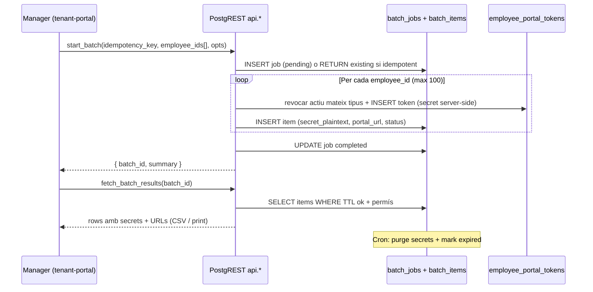

# Batch de tokens del portal d'empleat — prerequisit EP-ACC-3b

> **Data:** 2026-07-12 · **Actualitzat:** 2026-07-13  
> **Estat:** **implementat** — EP-ACC-3b-prep + EP-ACC-3b UI + EP-ACC-3b+ lliurats; pendent E2E manual signat  
> **Desbloqueja:** [`plan-employee-portal-access-v2.md`](./plan-employee-portal-access-v2.md) §10 (bulk no recuperable) — **resolt**  
> **Dependències:** EP-ACC-7, EP-ACC-2a, EP-ACC-3 — cobertes  
> **Migracions:**  
> - `20260927000001_employee_portal_token_batch_ep_acc3b_prep.sql`  
> - `20260928000002_employee_portal_token_batch_ack.sql`  
> - `20260928100001_employee_portal_batch_rate_limit_and_url.sql`  
> **Tests:** `supabase/tests/employee_portal_token_batch_tests.sql` · `run_employee_portal_token_batch_tests.ps1`  
> **UX hub (reubicació UI proposada):** [`plan-employees-portal-access-tab.md`](./plan-employees-portal-access-tab.md)

### Resum d'implementació (2026-07-13)

| Fase | Estat | Entregable |
|------|-------|------------|
| **EP-ACC-3b-prep** | ✅ | Taules, RPCs `start_*` / `fetch_*` / `list_*`, `_create_locked`, cron purge 15 min, B-T1…B-T9 |
| **EP-ACC-3b UI** | ✅ | `/employees` selecció massiva, diàlegs, CSV/QR/copiar, banner recuperació 1h |
| **EP-ACC-3b+** | ✅ | UI «Lots recents», `ack_batch`, rate limit 5 lots/h, `portal_url` servidor sense SSL |

**Defaults confirmats (§13):** TTL **1h**, processament **síncron**, bulk sense PIN amb avís, `force_new` sí.

**Resolució `portal_url` (servidor + client):**

1. **Servidor** (`api._employee_portal_build_bootstrap_url`): domini SSL canònic → `https://{slug}.public.{system_domain}` → `dev_base_url` (`system_settings` mòdul `employee_portal`).
2. **Client** (`portalUrl.ts`): fallback `VITE_PUBLIC_PORTAL_BASE_URL` o `http://localhost:3002` si el servidor retorna `NULL` (cas extrem sense cap setting).
3. **Dev local:** `seed.sql` posa `dev_base_url: http://localhost:3002`; `apps/tenant-portal/.env.development` inclou `VITE_PUBLIC_PORTAL_BASE_URL`.

El portal d'empleat **no** requereix web corporativa publicada ni domini SSL; només una base URL vàlida per construir `/e/{secret}`.

---

## 1. Problema

El flux actual (`create_employee_portal_token` des del navegador) funciona per **1 empleat** perquè el secret es mostra immediatament al modal.

En bulk:

1. Es **revoquen** enllaços actius del mateix tipus (EP-ACC-7).
2. Es **creen** N tokens nous amb secrets generats al servidor.
3. Si el client falla **després del commit** (tancar pestanya, error CSV, timeout), els secrets **no es poden recuperar** de `employee_portal_tokens` (només hash).

**EP-ACC-3b** exigeix generació massiva + export CSV/QR. Sense batch recuperable, un error operatiu deixa empleats sense enllaç vàlid.

---

## 2. Objectius i no-objectius

### Objectius (V1 batch)

| # | Objectiu | Estat |
|---|----------|-------|
| O1 | Crear fins a **100** tokens en un sol lot amb **1 idempotency key** | ✅ |
| O2 | Persistir secrets en clar **només** a una taula de lot amb **TTL curt** (recuperació) | ✅ |
| O3 | Permetre **re-descarregar** el resultat dins la finestra TTL sense regenerar tokens | ✅ |
| O4 | Estat **per fila** (`created` / `skipped` / `error`) + resum del job | ✅ |
| O5 | Respectar EP-ACC-7 i `attendance.manage` per `employee.site_id` | ✅ |
| O6 | Incloure `portal_url` resolta per empleat (EP-ACC-2a) al resultat exportable | ✅ (servidor amb fallbacks; client com a segona capa) |

### No-objectius (V1)

- Enviament massiu de correus (§10 risc separat; fora d'EP-ACC-3b).
- Export d'enllaços **ja existents** sense regenerar (impossible per disseny).
- Job asíncron amb cua PGMQ (opcional V2 si 100 files són lentes; V1 síncron dins RPC).
- Excel `.xlsx` al batch (reutilitzar CSV EP-ACC-3; xlsx opcional després).

---

## 3. Arquitectura



**Principi:** el navegador **no** genera secrets en bulk. El servidor genera `secret` → `token_hash` → `create` (mateixa lògica que avui, però sense depèncer del client).

---

## 4. Model de dades

### 4.1 `data.employee_portal_token_batch_jobs`

| Columna | Tipus | Notes |
|---------|-------|-------|
| `id` | `uuid` PK | |
| `tenant_id` | `uuid` FK | |
| `created_by` | `uuid` FK `profiles` | `auth.uid()` |
| `idempotency_key` | `text` | Únic per tenant |
| `status` | `text` | `pending` \| `processing` \| `completed` \| `failed` \| `expired` |
| `shared_device` | `boolean` | Tipus de lot (Personal vs taulell compartit) |
| `pin_must_set` | `boolean` | Default `true` si política tenant |
| `label` | `text` | Etiqueta comuna opcional (p. ex. «Onboarding 2026») |
| `expires_at` | `timestamptz` | **TTL resultat** = `created_at + 1 hour` (configurable) |
| `employee_count` | `int` | Sol·licitats |
| `created_count` | `int` | Exitosos |
| `skipped_count` | `int` | |
| `error_count` | `int` | |
| `last_fetched_at` | `timestamptz` | Última descàrrega |
| `fetch_count` | `int` | Auditoria re-intents |
| `error_message` | `text` | Error fatal del job (si `failed`) |
| `created_at` | `timestamptz` | |
| `completed_at` | `timestamptz` | |

**Índexs:**

```sql
CREATE UNIQUE INDEX uq_ep_portal_batch_idempotency
  ON data.employee_portal_token_batch_jobs (tenant_id, idempotency_key);

CREATE INDEX idx_ep_portal_batch_tenant_created
  ON data.employee_portal_token_batch_jobs (tenant_id, created_at DESC);

CREATE INDEX idx_ep_portal_batch_expires
  ON data.employee_portal_token_batch_jobs (expires_at)
  WHERE status = 'completed';
```

**RLS:** cap política per `authenticated` / `anon`. Accés **només** via funcions `SECURITY DEFINER`.

### 4.2 `data.employee_portal_token_batch_items`

| Columna | Tipus | Notes |
|---------|-------|-------|
| `id` | `uuid` PK | |
| `batch_job_id` | `uuid` FK | `ON DELETE CASCADE` |
| `tenant_id` | `uuid` | Denormalitzat per purge |
| `employee_id` | `uuid` FK | |
| `status` | `text` | `created` \| `skipped` \| `error` |
| `error_code` | `text` | p. ex. `employee_not_active`, `insufficient_privilege` |
| `token_id` | `uuid` | Si `created` |
| `superseded_token_id` | `uuid` | Si s'ha revocat l'anterior |
| `secret_plaintext` | `text` | **Només fins a purge**; NULL després |
| `portal_url` | `text` | URL bootstrap ja resolta |
| `employee_name` | `text` | Per CSV sense joins extra |
| `employee_code` | `text` | |
| `label` | `text` | Copia de job o per fila |
| `created_at` | `timestamptz` | |

**Índex:** `(batch_job_id)`, `(batch_job_id, employee_id)` UNIQUE (un empleat per lot).

**Purge de secrets:**

```sql
-- Cron diari o cada 15 min (pg_cron):
UPDATE data.employee_portal_token_batch_items
SET secret_plaintext = NULL
WHERE batch_job_id IN (
  SELECT id FROM data.employee_portal_token_batch_jobs
  WHERE expires_at < now() AND status = 'completed'
);

UPDATE data.employee_portal_token_batch_jobs
SET status = 'expired'
WHERE expires_at < now() AND status = 'completed';
```

Opcional post-V1: `pgcrypto` per xifrar `secret_plaintext` amb clau de Vault; V1 accepta plaintext amb accés zero directe i TTL 1h (mateix risc que modal «mostrar un cop» però amb finestra de recuperació).

### 4.3 Auditoria

Reutilitzar `employee_portal_access_logs` amb accions:

- `batch_start`
- `batch_fetch`
- `batch_ack` (purge anticipat via `ack_employee_portal_token_batch`)

`metadata`: `{ batch_job_id, employee_count, fetch_count }` (i camps addicionals segons acció).

---

## 5. RPCs (`api.*`)

### 5.1 `api.start_employee_portal_token_batch`

**Input:**

```json
{
  "idempotency_key": "uuid-v4-string",
  "employee_ids": ["uuid", "..."],
  "shared_device": false,
  "pin_must_set": true,
  "label": "Onboarding 2026",
  "skip_inactive": true
}
```

**Regles:**

| Regla | Valor |
|-------|-------|
| Màx. empleats per lot | **100** |
| Mín. | 1 |
| `idempotency_key` | Obligatori, 8–128 chars |
| Permís | `attendance.manage` per tenant; per fila també per `employee.site_id` |
| Duplicats `employee_ids` | Dedupeix (últim guanya) |
| Rate limit | Màx. **5 lots nous / h / tenant**; replays idempotents **exclosos**; error `batch_rate_limited` |

**Idempotència:**

1. Si existeix job `(tenant_id, idempotency_key)` amb `status IN (pending, processing, completed)` i `expires_at > now()` → **retorna el mateix `batch_id`** sense recrear tokens.
2. Si job `expired` o `failed` → permet nou job amb mateixa key **només si** el client envia `force_new: true` (evitar accidents).

**Processament (una transacció per lot ≤ 50; lots 51–100 en 2 sub-transaccions o una sola si rendiment OK en proves):**

Per cada `employee_id`:

```
1. Lock empleat (FOR UPDATE) — mateix patró que create_employee_portal_token
2. Validar actiu / permís
3. secret := base64url(extensions.gen_random_bytes(32))
4. token_hash := sha256(secret)
5. Cridar lògica interna create (revocar actiu mateix shared_device + INSERT)
6. portal_url := api._employee_portal_build_bootstrap_url(v_site, v_secret)
7. INSERT batch_item (secret_plaintext, portal_url, status=created, ...)
```

**Errors per fila** (no aborten tot el lot):

| `error_code` | Comportament |
|--------------|--------------|
| `employee_not_active` | `skipped` si `skip_inactive`, sinó `error` |
| `insufficient_privilege` | `error` |
| `employee_not_found` | `error` |
| Error inesperat SQL | `error` + increment `error_count`; job continua |

Si **0** `created` i tots error → job `failed`. Si ≥1 `created` → `completed`.

**Output:**

```json
{
  "batch_id": "uuid",
  "status": "completed",
  "expires_at": "ISO",
  "summary": {
    "requested": 42,
    "created": 40,
    "skipped": 1,
    "errors": 1
  },
  "idempotent_replay": false
}
```

**Grant:** `authenticated` (manager amb permís).

### 5.2 `api.fetch_employee_portal_token_batch_results`

**Input:** `p_batch_id uuid`

**Autorització:**

- Job del mateix tenant.
- `created_by = auth.uid()` **o** `attendance.manage` global del tenant.
- `status = completed` i `expires_at > now()`.

**Output:**

```json
{
  "batch_id": "uuid",
  "expires_at": "ISO",
  "shared_device": false,
  "rows": [
    {
      "employee_id": "uuid",
      "employee_name": "Anna Garcia",
      "employee_code": "EMP001",
      "status": "created",
      "portal_url": "https://.../e/...",
      "token_id": "uuid",
      "superseded_token_id": "uuid|null",
      "error_code": null
    }
  ]
}
```

**Només files amb `status = created` inclouen `portal_url` usable.** Les `error`/`skipped` porten `error_code` per mostrar a la UI.

**Efectes colaterals:**

- `last_fetched_at = now()`, `fetch_count += 1`.
- **No** esborra secrets en la primera fetch (recuperació si falla CSV).

### 5.3 `api.ack_employee_portal_token_batch` ✅

**Input:** `p_batch_id uuid`

**Comportament:**

- Manager amb `attendance.manage` confirma «Ja he descarregat».
- Purga `secret_plaintext` i `portal_url` de totes les files del lot.
- Job passa a `status = expired`; `fetch` posterior retorna `batch_expired`.
- Idempotent: segon `ack` retorna `already_acked: true`.
- Auditoria: `batch_ack`.

**UI:** botó al modal de resultats + diàleg de confirmació (`PortalTokenBatchResultsDialog`).

### 5.4 `api.list_employee_portal_token_batches` ✅

Llistat paginat per tenant de lots **no expirats** de l'usuari (recuperar des del menú «Lots recents»).

**Input:** `p_limit int default 10`

### 5.5 Refactor intern

Extreure de `create_employee_portal_token`:

```sql
api._employee_portal_token_create_locked(
  p_employee_id uuid,
  p_token_hash bytea,
  p_label text,
  p_pin_hash text,
  p_pin_must_set boolean,
  p_expires_at timestamptz,
  p_shared_device boolean
) RETURNS jsonb  -- { token_id, superseded_token_id }
```

`create_employee_portal_token` (client amb hash) i el batch criden la mateixa funció interna.

---

## 6. Generació de secret al servidor

Aliniat amb `portalCrypto.ts` (client):

```sql
-- 32 bytes → base64url sense padding
encode(extensions.gen_random_bytes(32), 'base64')
  → replace +/ → -_ i treure =
```

Hash per `token_hash`: `decode(sha256_hex(secret), 'hex')` (mateix que `hashPortalSecretForRpc`).

PIN en bulk V1:

- **Mode B per defecte:** `pin_must_set = true`, sense `pin_hash`.
- **Sense PIN:** `pin_must_set = false` només amb checkbox explícit + avís groc (mateix que create dialog).
- **Legacy manager PIN:** fora del bulk V1 (cas excepcional 1-a-1).

---

## 7. Resolució `portal_url` al batch ✅

Helpers compartits (`20260928100001`):

```sql
api._employee_portal_resolve_portal_base_url(p_site jsonb)  -- base sense /e/secret
api._employee_portal_build_bootstrap_url(p_site, p_secret)   -- URL completa bootstrap
```

**Prioritat de la base URL** (alineada amb client i Edge correu):

| # | Font | Exemple |
|---|------|---------|
| 1 | Domini SSL canònic del `public_site` | `https://acme.example.com` |
| 2 | Slug + domini sistema | `https://{slug}.public.{PUBLIC_PORTAL_SYSTEM_DOMAIN}` |
| 3 | `system_settings.employee_portal.dev_base_url` | `http://localhost:3002` (dev) |

`api.resolve_public_site_for_employee` també aplica aquests fallbacks al camp `portal_base_url` del JSON retornat.

Dins el loop del batch:

```sql
v_site := api.resolve_public_site_for_employee(p_employee_id);
v_url := api._employee_portal_build_bootstrap_url(v_site, v_secret);
```

Si `site_configured = false` → fila `error` amb `error_code = no_published_public_site` (no crear token).

**Settings de plataforma** (`data.system_settings`, mòdul `employee_portal`):

- `public_portal_system_domain` — producció (nullable)
- `dev_base_url` — només dev/local (`seed.sql` → `http://localhost:3002`)

---

## 8. Flux UI (tenant-portal) ✅ — **reubicat al hub (EP-ACC-8)**

> Bulk, banner de recuperació i «Importacions recents» viuen a la pestanya **«Accés al portal»** (`/employees?tab=portal_hub`). El backend batch no canvia. Smoke: [`ep-acc8-hub-smoke-checklist.md`](./ep-acc8-hub-smoke-checklist.md).

### 8.1 Punts d'entrada

| Ubicació | Acció | Estat |
|----------|--------|-------|
| Llista d'empleats (`/employees`, tab `list`) | Només gestió HR — **sense** bulk | ✅ EP-ACC-8b |
| Hub portal (`/employees?tab=portal_hub`) | Taula estat + selecció + **Generar accés** + importacions recents + banner | ✅ EP-ACC-8c–8d |
| Fitxa empleat (`/employees/:id?tab=portal_access`) | Crear/revocar enllaç 1-a-1 (inalterat) | ✅ |
| (Futur) Informe assistència | Filtre site/departament → mateixa acció bulk | ⏳ |

### 8.2 Diàleg «Generar enllaços en massa»

**Pas 1 — Opcions**

- Tipus: `Personal` | `Taulell compartit (temp.)` (`shared_device`)
- Etiqueta comuna (opcional)
- PIN requerit (default on) — mateix copy que create dialog
- Resum: «S'generaran enllaços per **N** empleats. **M** tenen un enllaç actiu del mateix tipus que quedarà revocat.»

**Pas 2 — Execució**

- Generar `idempotencyKey = crypto.randomUUID()` i guardar a `sessionStorage` (`ep_portal_batch_idempotency`).
- `start_employee_portal_token_batch` amb spinner.
- Si error de xarxa: botó **«Reintentar»** amb la **mateixa** idempotency key.

**Pas 3 — Resultats (`PortalTokenBatchResultsDialog`)**

- Taula: nom, codi, estat, error (si cal).
- Botons:
  - **Descarregar CSV** (tot el lot; reutilitza `buildPortalLabelCsv`)
  - **Imprimir QR** (grid EP-ACC-3; només files `created`)
  - **Copiar enllaços** (opcional)
- Banner: «Pots tornar a obrir aquest lot fins a **{expires_at}**» (banner a la llista si es tanca el modal).
- Botó **«Ja he descarregat»** → `ack_employee_portal_token_batch` (purge anticipat de secrets).
- Enllaç **«Importacions recents»** dins la pestanya hub (no al header global) → diàleg amb jobs no expirats (RPC `list_*`).

**Pas 4 — Recuperació** ✅

- `sessionStorage` guarda `batch_id` + `expires_at`.
- Banner a `/employees?tab=portal_hub`: «Recuperar lot» (no esborra el lot en tancar el modal resultats).

### 8.3 Fitxers (UI) — implementats

```
apps/tenant-portal/src/features/employee-portal/
  api/employeePortalBatchService.ts
  api/employeePortalBatchTypes.ts
  api/useEmployeePortalBatch.ts
  api/useCanManageEmployeePortal.ts
  components/PortalTokenBatchDialog.tsx
  components/PortalTokenBatchResultsDialog.tsx
  components/PortalTokenBatchRecoveryBanner.tsx
  components/PortalTokenBatchRecentDialog.tsx
  utils/portalLabelExport.ts
  utils/portalUrl.ts                  — buildEmployeePortalUrlFromSecret (fallback dev)

apps/tenant-portal/src/features/employees/components/
  EmployeesPage.tsx                   — tabs list / portal_hub
  EmployeesListTab.tsx                — llista HR (sense batch)
  EmployeesPortalAccessTab.tsx        — hub: overview + bulk + banner
  EmployeeRow.tsx                     — sense mode selecció batch
```

---

## 9. Límits i seguretat

| Límit | Valor | Motiu |
|-------|-------|-------|
| Empleats / lot | 100 | Timeout RPC + mida resposta |
| TTL resultat | 1 h | Finestra recuperació §10 |
| Re-fetch | Il·limitat dins TTL | Recuperació CSV |
| Rate | **5 lots / h / tenant** | Anti-abús; error `batch_rate_limited`; UI al diàleg de generació |
| Mida resposta fetch | ~100 × ~200 bytes URL ≈ 20 KB | OK PostgREST |

**Amenaça:** manager descarrega CSV i el deixa en un PC compartit → mateix risc que modal individual; copy de seguretat al diàleg.

**No guardar** `batch_id` + secrets a `localStorage` persistent; només `sessionStorage`.

---

## 10. Fases d'implementació

| Fase | ID | Entregable | Esforç | Estat |
|------|-----|------------|--------|-------|
| **Prep** | EP-ACC-3b-prep | Migració taules + RPCs + refactor `_create_locked` + tests SQL + cron purge | M | ✅ |
| **UI** | EP-ACC-3b | Diàleg bulk + resultats + CSV/print + banner recuperació | M | ✅ |
| **Opcional** | EP-ACC-3b+ | UI «Lots recents», `ack_batch` purge anticipat, rate limit, URL servidor sense SSL | S | ✅ |

**Desplegament:** prep, UI i 3b+ a la mateixa branca local. No s'ha usat feature flag `employee_portal_batch_enabled` (opcional; es pot afegir si cal desactivar en prod).

---

## 11. Tests (acceptació)

### SQL (`employee_portal_token_batch_tests.sql`) — ✅ 13/13 (B-T1…B-T12)

| ID | Cas | Estat |
|----|-----|-------|
| B-T1 | Lot 3 empleats → 3 `created`, secrets no NULL a items | ✅ |
| B-T2 | Idempotència: mateixa key → mateix `batch_id`, cap token duplicat | ✅ |
| B-T3 | Empleat inactiu → `skipped` amb `skip_inactive=true` | ✅ |
| B-T4 | EP-ACC-7: 2n lot mateix tipus revoca token anterior | ✅ |
| B-T5 | `fetch` després `expires_at` → error `batch_expired` | ✅ |
| B-T6 | Purge cron esborra `secret_plaintext` | ✅ |
| B-T7 | 101 empleats → error `batch_too_large` | ✅ |
| B-T8 | Sense `attendance.manage` → `insufficient_privilege` | ✅ |
| B-T9 | `no_published_public_site` → fila error, job `completed` amb errors | ✅ |
| B-T10 | `ack` purge secrets → `fetch` posterior `batch_expired`; ack idempotent | ✅ |
| B-T11 | 6è lot en 1h → `batch_rate_limited`; replay idempotent exempt | ✅ |
| B-T12 | Sense domini SSL + `dev_base_url` → `portal_url` al servidor | ✅ |

**Execució:** `.\supabase\tests\run_employee_portal_token_batch_tests.ps1`

### E2E manual — hub EP-ACC-8

Checklist: [`ep-acc8-hub-smoke-checklist.md`](./ep-acc8-hub-smoke-checklist.md) §3.

- [ ] Seleccionar 5 empleats al hub → CSV amb 5 URLs vàlides.
- [ ] Tancar diàleg → banner «Recuperar lot» → mateix CSV.
- [ ] «Importacions recents» al hub → obrir lot anterior dins la finestra 1h.
- [ ] «Ja he descarregat» → no es pot tornar a copiar/exportar; tokens encara actius.
- [ ] 6è lot en menys d'1h → missatge rate limit a la UI.
- [ ] Esperar TTL (o mock) → recuperació bloquejada, tokens encara actius.
- [ ] Reintentar després error xarxa amb mateixa idempotency → no duplica tokens.

---

## 12. Actualització del pla v2 ✅ (2026-07-13)

Fet:

1. §10 «Bulk create/resultat no recuperable» marcat com **resolt** a [`plan-employee-portal-access-v2.md`](./plan-employee-portal-access-v2.md).
2. EP-ACC-3b desbloquejat i implementat a la roadmap v2.
3. UI bulk desplegada inicialment a `/employees` header; **reubicada** a hub `portal_hub` (EP-ACC-8d).
4. EP-ACC-3b+ tancat: importacions recents, `ack_batch`, rate limit 5/h, `portal_url` servidor sense SSL.
5. EP-ACC-8 hub + EP-ACC-9 Identity Gate — veure [`plan-employees-portal-access-tab.md`](./plan-employees-portal-access-tab.md).

**Correccions post-lliurament (2026-07-13):**

- URL batch: fallback client (`portalUrl.ts` + `VITE_PUBLIC_PORTAL_BASE_URL`) **i** resolució servidor (`_employee_portal_build_bootstrap_url`).
- Modal resultats: estats traduïts, export visible, recuperació no s'esborra en tancar modal.
- `EmployeesPage`: botó «Generar enllaços» visible en mode normal (fix ternari).
- Error UI `batch_rate_limited` (CA).

---

## 13. Decisions (tancades)

| # | Pregunta | Decisió aplicada |
|---|----------|------------------|
| 1 | TTL 1h o 24h? | **1h** |
| 2 | Lot síncron vs cua | **Síncron** fins a 100 files |
| 3 | Permetre bulk sense PIN? | Sí, amb avís explícit (com create) |
| 4 | `force_new` en idempotency | Sí (`p_force_new` a RPC `start_*`) |
| 5 | Rate limit lots | **5 / h / tenant** (només lots nous) |
| 6 | `portal_url` sense SSL | Fallback servidor (`dev_base_url` / slug sistema) + client |
