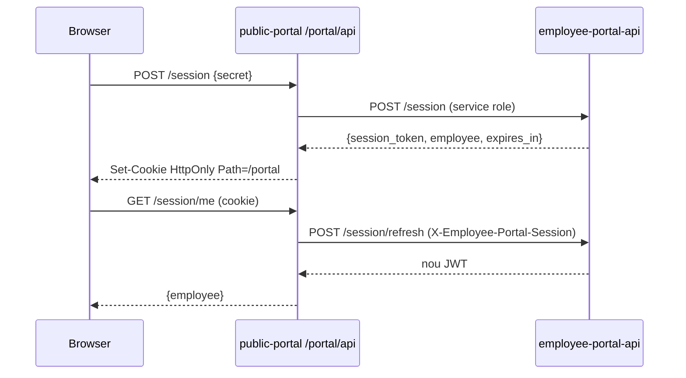

# Employee Portal — Accés personal sense compte d'app

> **Data:** 2026-07-01 (v2 — revisió seguretat)  
> **Estat:** pla operatiu — **EP0–EP9 implementats** (2026-07-03); EP2 parcial  
> **Arquitectura (disseny):** [`18-employee-portal-architecture.md`](../../product-design/18-employee-portal-architecture.md)  
> **Millores accés / PIN / distribució (v2):** [`plan-employee-portal-access-v2.md`](./plan-employee-portal-access-v2.md)  
> **Mapa global:** [`STATUS.md`](./STATUS.md)  
> **Relacionat:** [`plan-monthly-close-approval.md`](./plan-monthly-close-approval.md) (A6a/A6b · EP8) · [`ep8-smoke-checklist.md`](./ep8-smoke-checklist.md) · [`calendaris-laborals.md`](../../help/horaris/calendaris-laborals.md)

### Progrés per fase (2026-07-01)

| Fase | Estat | Notes |
|------|-------|-------|
| **EP0** Spike sessió JWT + proxy Next.js | ✅ | Implementat — smoke test pendent restart `functions serve` |
| **EP1** SQL tokens + audit + particionament logs | ✅ | Migració + tests SQL |
| **EP2** Edge Function API | 🔄 | Sessió + `/today` + `/punch` (sense rate limit/geo complet) |
| **EP3** Gestió tokens (tenant-portal) | ✅ | Tab «Accés Portal» + dialogs create/reveal/revoke/logs |
| **EP4** Portal públic — fitxar online | ✅ | `/portal/punch` + PinGate + refresh sessió |
| **EP5** Offline outbox | ✅ | Dexie + sessionStorage; smoke E2E OK |
| **EP6** Calendari | ✅ | `/portal/schedule` + `GET /schedule` |
| **EP7** Historial | ✅ | MVP complet V1 |
| **EP8** Confirmació mensual via enllaç | ✅ codi | Smoke [`ep8-smoke-checklist.md`](./ep8-smoke-checklist.md) |
| **EP9** V2 (pauses, absències, push) | ✅ | Pausa + absències + accessos + push opt-in |
| **EP-ACC** Accés v2 (modal, correu, PIN empleat, sessió taulell, multi-site) | 📦 | Pla [`plan-employee-portal-access-v2.md`](./plan-employee-portal-access-v2.md) |

---

## Resum executiu

**Problema:** molts empleats no tenen (ni volen) compte `auth.users`, però necessiten fitxar i consultar el seu horari des del mòbil personal.

**Solució:** enllaç magic (`/e/{secret}`) generat pel manager → intercanvi per **sessió curta** (cookie HttpOnly al domini del tenant) → portal mòbil integrat al **`public-portal`** (`/portal/*`).

**Principis (no negociables):**

1. Secret **mai** persistent a URL després del primer accés.
2. Secret **mai** a IndexedDB; només `token_hash` a BD.
3. Secret generat a **capa d'aplicació** (Edge Function / tenant-portal), mai a PostgreSQL.
4. Cookie emesa per **Next.js proxy** (mateix domini); cap fetch cross-origin a Supabase des del browser.
5. Reutilitzar RPCs d'assistència existents (`record_time_punch`, `resolve_work_day`, `my_attendance_today`).
6. V1 = **IN/OUT només** (sense pauses al portal).
7. PIN només en **obrir sessió** (online); re-PIN abans de sincronitzar offline si sessió caducada.

**MVP usable:** EP1 → EP4 (~4–5 dies).  
**V1 completa:** EP1 → EP7 (~8–10 dies).

---

## Decisions de seguretat (tancades abans d'EP2)

Aquestes decisions han d'estar implementades abans de fusionar EP2. Detall complet al doc 18 §18.6–18.7.

### Sessió i revocació

| Decisió | Detall |
|---------|--------|
| **JWT d'accés curt** | 15 min (`exp`). No confiar en JWT de 4 h sense consultar BD. |
| **`POST /session/refresh`** | **Sempre** consulta BD: `is_active`, `revoked_at`, `expires_at`, `session_version`. És el punt de veritat per invalidar sessions. |
| **Entre refrescos** | Es confia només en la signatura JWT (finestra màxima 15 min post-revocació). Acceptable per a portal d'empleats. |
| **`session_version`** | Es manté. S'incrementa en revocar. El refresh el compara amb el claim JWT. |
| **Cache Upstash** | `ep:sv:{token_id}` TTL 60 s per evitar consulta BD a cada request. **Revocació normal:** `redis.del` + increment `session_version` (efecte immediat al següent refresh). **Revocació d'emergència** (`p_compromised = true`): mateix + rebutjar qualsevol JWT existent sense esperar TTL. |
| **Tolerància documentada** | Revocació normal: màxim ~15 min si no hi ha refresh. Emergència: immediata. |

### Cookie i proxy (EP0 — obligatori)

```
Browser (acme.public.cavalle.app)
  → fetch('/portal/api/session', { credentials: 'include' })   ← mateix domini, sota Path=/portal
  → Next.js Route Handler (proxy)
  → Edge Function (server-to-server)
  ← JSON + instruccions Set-Cookie
  ← Next.js emet: Set-Cookie; Path=/portal; HttpOnly; Secure; SameSite=Lax
     (SENSE atribut Domain — host exacte del tenant, mai `.public.domain`)
```

**Prohibit:** `fetch('https://{project}.supabase.co/functions/v1/...')` des del browser amb cookie de sessió (`SameSite=Lax` no envia cookie cross-site).

### Rate limit multi-tenant

```
Per IP:     ep:ip:{tenant_id}:{ip}     → 100 req/min
Per token:  ep:sess:{token_id}        → 20 req/min
```

### Secret i PIN

- Secret: `crypto.getRandomValues(32)` + `base64url` a capa app; RPC rep `p_token_hash bytea`, mai el secret.
- PIN per defecte al generar token: **recomanat** (checkbox pre-marcada). Si es desactiva → avís prominent a la UI (EP3).
- Setting `employee_portal.default_pin_required`: `true` (canvi respecte v1).

### Geofencing

`POST /punch` passa geo a `record_time_punch` amb `source='portal'`. La política `employee_portal.geofencing_mode` (`inherit | required | optional | disabled`) es resol al repository abans de cridar el RPC — mateixa lògica que mode estació/mòbil.

### Offline + revocació

`POST /punch` amb punch offline: el servidor compara `payload.occurred_at` amb `token.revoked_at`:

- `occurred_at < revoked_at` → acceptar (hores reals pre-revocació).
- `occurred_at >= revoked_at` → rebutjar amb `failure_reason: 'revoked'`.
- El client **no** coneix `revoked_at`; és lògica exclusiva del servidor.

### Access logs — creixement

- Taula `employee_portal_access_logs` **particionada per rang mensual** (`PARTITION BY RANGE (accessed_at)`), patró `notification_deliveries`.
- Retenció: **90 dies** via `pg_cron` setmanal.
- **Eliminar** `last_ip` de `employee_portal_tokens` (duplicat de `access_logs`; falsa sensació de seguretat).

### EP8 — nivell legal (decisió tancada abans d'implementar)

| Nivell | Què és | Implementació |
|--------|--------|---------------|
| **L1 — Confirmació de lectura** | L'empleat declara haver vist el resum mensual. Suficient per RD 8/2019 quan el tenant no exigeix signatura digital. | `POST /monthly-report/confirm` + audit + `access_logs`. **No** és signatura electrònica. |
| **L2 — Signatura legal** | Equivalent a signatura DMS de l'app. | Redirigir al flux existent (`monthlyReportSigningService` / DocuSeal o signatura nativa). **No** implementar com a simple clic al portal. |

EP8 implementa **només L1**. L2 reutilitza infra A6–A7 sense redisseny.

---

## Índex de fases

| ID | Tema | Prioritat |
|----|------|-----------|
| **EP0** | Spike: proxy Next.js + JWT 15 min + cookie aïllada per tenant | P0 |
| **EP1** | Model SQL + enum `source='portal'` + audit + particionament | P0 |
| **EP2** | Edge Function `employee-portal-api` | P0 |
| **EP3** | UI gestió tokens al tenant-portal | P0 |
| **EP4** | Public-portal: bootstrap + fitxar online | P0 |
| **EP5** | Offline outbox + drainer | P1 |
| **EP6** | Calendari laboral (lectura) | P1 |
| **EP7** | Historial fitxatges (lectura) | P1 |
| **EP8** | Confirmació mensual L1 via enllaç | P2 |
| **EP9** | V2: pauses, absències, push | P3 |

Ordre recomanat: **EP0 → EP1 → (EP2 ∥ EP3) → EP4 → EP5 → EP6 → EP7 → EP8**.

---

# EP0. Spike proxy + sessió JWT — P0, XS

**Objectiu:** validar el patró magic-link → cookie HttpOnly **al domini del tenant** abans de la migració SQL.

### Tasques

1. Edge Function spike `employee-portal-api`:
   - `POST /session`: valida `token_hash`, retorna JSON `{ session_token, employee, expires_in }` (JWT 15 min, claims: `employee_id`, `tenant_id`, `token_id`, `session_version`).
   - `POST /session/refresh`: rep JWT, consulta BD (`is_active`, `revoked_at`, `session_version`), retorna nou JWT.
   - **No** emet `Set-Cookie` des de l'Edge Function.
2. Next.js Route Handler **obligatori**: `apps/public-portal/app/portal/api/[...path]/route.ts` (sota `/portal` perquè el navegador enviï la cookie `Path=/portal`)
   - Proxy server-to-server cap a Edge Function.
   - Tradueix resposta JWT → `Set-Cookie: employee_portal_session=…; HttpOnly; Secure; SameSite=Lax; Path=/portal` (sense `Domain`).
3. Client portal: **només** `fetch('/portal/api/...', { credentials: 'include' })`.
4. Provar dos tenants (`acme.public.*` i `beta.public.*`): cookie d'un no s'envia a l'altre.

### Criteris d'acceptació

- [x] Cap `fetch` cross-origin a `*.supabase.co` des del browser del portal.
- [x] Després de `POST /session`, cap secret visible a la URL (`/e/{secret}` → redirect `/portal/spike`).
- [x] Cookie `Path=/portal`; sense atribut `Domain` (o igual al host exacte).
- [x] JWT expirat → 401; refresh amb token revocat → 401 (via `session/refresh` + stub dev `revoke-dev`).
- [ ] Provar dos tenants (`acme.public.*` i `beta.public.*`): cookie d'un no s'envia a l'altre — **manual** amb custom domains.
- [ ] Documentar flux al PR (diagrama browser → Next → Edge).

### Estat implementació (2026-07-02)

| Component | Estat | Notes |
|-----------|-------|-------|
| Edge Function `employee-portal-api` | ✅ | Stub dev tokens; `verify_jwt=false` |
| `_shared/employee-portal/*` | ✅ | JWT HS256, session-service, dev-token-store |
| Proxy `app/portal/api/[...path]/route.ts` | ✅ | session, refresh, logout, me, health, revoke-dev |
| Pàgines spike | ✅ | `/e/[secret]`, `/portal/(protected)/spike`, `/portal/expired` |
| `config.toml` + `.env.example` | ✅ | |
| Smoke test local | ⏳ | Cal **reiniciar** `supabase functions serve` després d'afegir la funció |

**Flux (EP0):**



**Secrets dev (local):** `ep0-dev-acme-montserrat`, `ep0-dev-beta-alice` — veure `DEV_RUNBOOK.md` §EP0.

### Fitxers

- `supabase/functions/employee-portal-api/index.ts`
- `supabase/functions/_shared/employee-portal/` (jwt, repository stub)
- `apps/public-portal/app/portal/api/[...path]/route.ts` (**obligatori**)
- `apps/public-portal/lib/employee-portal/` (constants, cookie, proxy)
- `apps/public-portal/app/e/[secret]/page.tsx`
- `apps/public-portal/app/portal/(protected)/spike/page.tsx`
- `apps/public-portal/app/portal/expired/page.tsx`

---

# EP1. Model SQL + audit — P0, S

**Objectiu:** taules, enum, triggers i RPCs de gestió interna (tenant-portal crida amb `authenticated`).

### Tasques

1. Migració `supabase/migrations/YYYYMMDD_employee_portal_core.sql`:
   - `data.employee_portal_tokens` (`token_hash bytea`, `pin_hash`, `session_version`, `label`, `shared_device`, …) — **sense** `last_ip`.
   - `data.employee_portal_access_logs` particionada per `accessed_at` (rang mensual).
   - `ALTER TYPE data.time_punch_source ADD VALUE IF NOT EXISTS 'portal'`.
   - Índex parcial `UNIQUE (employee_id, label) WHERE actiu permanent`.
2. RPCs `api.*` (SECURITY DEFINER, només `authenticated` + rol manager/owner):
   - `create_employee_portal_token(p_employee_id, p_token_hash, p_label, p_pin_hash?, p_expires_at?, p_shared_device?)` → retorna `{ token_id }`. **El secret es genera al client servidor (tenant-portal o Edge Function), no a la BD.**
   - `revoke_employee_portal_token(p_token_id, p_reason?, p_compromised boolean default false)` → `revoked_at`, `session_version++`, `is_active=false`.
   - `list_employee_portal_tokens(p_employee_id)`.
   - `list_employee_portal_access_logs(p_token_id, p_limit?)`.
3. Triggers audit: `EMPLOYEE_PORTAL_TOKEN_CREATED`, `EMPLOYEE_PORTAL_TOKEN_REVOKED`.
4. `pg_cron`:
   - Diari: desactivar tokens amb `expires_at < now()`.
   - Setmanal: `DELETE` access_logs amb `accessed_at < now() - interval '90 days'` (per partició).
5. Regenerar `database.types.ts`.

### Criteris d'acceptació

- [x] Cap columna amb secret en clar a BD; RPC no rep ni retorna secret.
- [x] Dos tokens actius mateix `label` → error; labels diferents → OK.
- [x] Revocació incrementa `session_version`; `p_compromised=true` documentat per emergència.
- [x] Particions creades (mínim trimestre actual + default).
- [x] Tests SQL: crear token per hash, revocar, enum `portal`.

### Estat implementació (2026-07-02)

| Component | Estat | Notes |
|-----------|-------|-------|
| Migració `20260823000001_employee_portal_core.sql` | ✅ | taules, RLS, RPCs, audit, pg_cron |
| `supabase/tests/employee_portal_tests.sql` | ✅ | 5/5 PASS |
| `database.types.ts` regenerat | ✅ | tenant-portal + functions + public-portal |

### Fitxers

- `supabase/migrations/YYYYMMDD_employee_portal_core.sql`
- `supabase/tests/employee_portal_tests.sql`
- `apps/tenant-portal/src/types/database.types.ts`
- `apps/public-portal/types/database.types.ts`

---

# EP2. Edge Function API — P0, M

**Objectiu:** API REST; autenticació per JWT (via cookie proxy); accés només via `EmployeePortalRepository`.

### Rutes

| Mètode | Ruta | Auth | Descripció |
|--------|------|------|------------|
| `POST` | `/session` | secret (+ PIN opcional) | Valida hash + PIN; retorna JWT 15 min |
| `POST` | `/session/refresh` | JWT | Consulta BD; renova JWT si token actiu |
| `GET` | `/today` | JWT | `api.my_attendance_today(employee_id)` |
| `GET` | `/schedule?from&to` | JWT | `api.resolve_work_day` per rang |
| `GET` | `/history?from&to` | JWT | `time_entries` resumits (read-only) |
| `POST` | `/punch` | JWT | `api.record_time_punch(..., source='portal')` |

### Tasques

1. `EmployeePortalRepository`: mètodes tipats; **mai** consultes ad hoc fora del repository.
2. `requireSession()` middleware:
   - Valida signatura JWT.
   - Opcional: cache `session_version` a Upstash (TTL 60 s); invalidar amb `redis.del` en revocació.
3. Rate limit dual (Upstash, prefix `ep:`):
   - `ep:ip:{tenant_id}:{ip}` → 100 req/min.
   - `ep:sess:{token_id}` → 20 req/min.
4. CORS: cache dominis verificats (`ep:cors:{tenant_id}`, TTL 5 min); validar `Origin` en POST.
5. CSRF: cookie `SameSite=Lax` + validació `Origin`.
6. **Geofencing** a `recordPunch`: resoldre `employee_portal.geofencing_mode` (inherit → tenant/site); passar geo segons política; mateix comportament que `source='mobile'`.
7. **`POST /punch` offline/revocat**: si `!is_active OR revoked_at IS NOT NULL`:
   - Si `payload.occurred_at < revoked_at` → acceptar punch.
   - Sinó → 403 `failure_reason: 'revoked'`.
8. Logging: `employee_portal_access_logs` + `failure_reason`.
9. `initObservability()` segons [`error-handling.mdc`](../../../.cursor/rules/error-handling.mdc).

### Criteris d'acceptació

- [ ] Secret només vàlid a `POST /session`; `/punch` amb secret directe → 401.
- [ ] Refresh amb token revocat → 401 immediat (consulta BD).
- [ ] Revocació emergència (`p_compromised`) + `redis.del` → refresh falla immediatament.
- [ ] Punch amb `source = 'portal'`; geofencing actiu quan tenant `required`.
- [ ] Punch offline amb `occurred_at` anterior a `revoked_at` → acceptat.
- [ ] Punch offline amb `occurred_at` posterior a `revoked_at` → rebutjat.
- [ ] Rate limit NAT: >10 empleats mateixa IP mateix tenant → cap 429 en simulació torn matí.
- [ ] Rate limit: tenant A no afecta bucket de tenant B amb mateixa IP.

### Fitxers

- `supabase/functions/employee-portal-api/index.ts`
- `supabase/functions/_shared/employee-portal/repository.ts`
- `supabase/functions/_shared/employee-portal/session.ts`
- `supabase/functions/_shared/employee-portal/rate-limit.ts`
- `supabase/functions/_shared/employee-portal/geo-policy.ts`
- `supabase/config.toml`

---

# EP3. Gestió tokens — tenant-portal — P0, M

**Objectiu:** el manager genera, distribueix i revoca enllaços des de la fitxa d'empleat.

### Tasques

1. Nou tab **«Accés Portal»** a `EmployeeDetailPage` (`tab=portal_access`).
2. Feature `apps/tenant-portal/src/features/employee-portal/`:
   - Generació secret **al client servidor** (Server Action o API route tenant-portal): `crypto.getRandomValues` → `base64url` → `sha256` → RPC amb `p_token_hash`.
   - Modal generar: PIN **pre-marcada** per defecte (`employee_portal.default_pin_required = true`).
   - Si manager desmarca PIN → **avís prominent**: «Sense PIN, qualsevol persona amb l'URL podrà fitxar en nom d'aquest empleat».
   - Mostrar secret + URL **una sola vegada** (copy + QR).
   - Revocar: motiu + checkbox «Token compromès / robat» → `p_compromised=true`.
   - Historial access logs (des de `access_logs`, no `last_ip`).
3. URL: `{publicSiteBase}/e/{secret}`.
4. i18n + permisos `owner` | `manager`.

### Criteris d'acceptació

- [x] Secret generat fora de PostgreSQL; mai als logs de query.
- [x] Avís visible si es genera token sense PIN.
- [x] Revocació compromès invalida sessions al següent refresh com a màxim (RPC `p_compromised`; validació E2E pendent EP2).
- [x] Empleat inactiu → no es pot generar token.

### Fitxers

- `apps/tenant-portal/src/features/employees/components/EmployeeDetailPage.tsx`
- `apps/tenant-portal/src/features/employee-portal/**`
- `apps/tenant-portal/src/locales/ca/employees.json`

---

# EP4. Public-portal — bootstrap + fitxar online — P0, M

**Objectiu:** empleat obre enllaç, fitxa IN/OUT online amb UX mòbil-first.

### Tasques

1. Rutes Next.js:
   - `app/e/[secret]/page.tsx` → `POST /portal/api/session` (+ PinGate) → `redirect('/portal/punch')`.
   - `app/portal/layout.tsx` — guard sessió (cookie present + refresh si cal).
   - `app/portal/punch/page.tsx` — botó IN/OUT, horari, timeline.
2. Components `apps/public-portal/features/employee-portal/` (adaptats de tenant-portal).
3. Client API: **només** `/portal/api/*` amb `credentials: 'include'`.
4. Refresh automàtic JWT cada 10–12 min (abans dels 15 min d'`exp`).
5. `robots.txt`: `Disallow: /e/` i `Disallow: /portal/`.

### Criteris d'acceptació

- [x] Flux complet EP3 → EP4: fitxar IN/OUT visible al tauler manager (manual).
- [x] URL `/portal/punch` sense secret.
- [x] Token amb PIN + offline primera visita → missatge connexió requerida.
- [x] Layout mòbil (touch targets ≥ 48px).

### Fitxers

- `apps/public-portal/app/e/[secret]/page.tsx`
- `apps/public-portal/app/portal/**`
- `apps/public-portal/features/employee-portal/**`
- `apps/public-portal/public/robots.txt`

---

# EP5. Offline outbox + drainer — P1, M

**Objectiu:** fitxar sense cobertura un cop oberta sessió; sincronitzar en tornar online.

### Tasques

1. Dexie `portalAttendanceDb.ts` — sense `user_id` ni secret.
2. `usePortalAttendanceSync`:
   - Drainer → `POST /portal/api/punch`.
   - 401 → re-PIN → refresh → reprendre drain.
   - 403 `revoked` → quarantena + missatge «Token revocat; contacta el teu responsable».
3. `shared_device`: outbox a `sessionStorage`; buidar en tancar pestanya.

### Criteris d'acceptació

- [x] Offline després de sessió vàlida → sync OK (outbox + drainer).
- [x] Punch amb `occurred_at` pre-revocació → acceptat pel servidor (`authorizePortalPunch`).
- [x] Punch post-revocació → quarantena local amb missatge clar.
- [x] Cap secret ni PIN a IndexedDB (només `client_op_id`, `punch_type`, `occurred_at`).

### Estat implementació (2026-07-02)

| Component | Estat | Notes |
|-----------|-------|-------|
| `portalAttendanceDb.ts` (Dexie) | ✅ | Sense `user_id` ni secret |
| `portalSessionOutbox.ts` | ✅ | `shared_device` → sessionStorage |
| `usePortalAttendanceSync` | ✅ | Drain 30s + online/visibility; 401 → refresh/re-PIN |
| `authorizePortalPunch` (Edge) | ✅ | JWT caducat + `occurred_at < revoked_at` |
| `refresh` amb PIN (JWT caducat) | ✅ | Re-PIN abans de sincronitzar |
| Smoke manual E2E | ✅ | Smoke E2E OK (2026-07-02) |

### Smoke E2E manual (EP5)

**Prerequisits:** `supabase functions serve`, `npm run dev` (port 3002), migracions al dia.

1. **Health** — `GET http://localhost:3002/portal/api/health` → `{ status: "ok" }`.
2. **Sessió** — obrir `http://localhost:3002/e/ep0-dev-acme-montserrat` → `/portal/punch`.
3. **Offline punch** — DevTools → Network → Offline → fitxar (IN o OUT).
   - Toast: «Entrada/Sortida desada — es sincronitzarà en tornar online».
   - Timeline: fitxatge amb «(pendent)».
   - Banner: «Sense connexió…» + «1 fitxatge(s) pendent(s)».
4. **Tornar online** — desactivar Offline.
   - Toast canvia a «Entrada/Sortida registrada» (o desapareix si ja sincronitzat).
   - Timeline: sense «(pendent)»; hora real conservada.
   - Banner pendent desapareix.
5. **IndexedDB** — DevTools → Application → IndexedDB → `employee_portal_attendance` → ops `synced` (cap secret/PIN).
6. **Quarantena (opcional)** — revocar token al tenant-portal amb punch pendent post-revocació → missatge «Token revocat…».

### Fitxers

- `apps/public-portal/features/employee-portal/db/**`
- `apps/public-portal/features/employee-portal/hooks/usePortalAttendanceSync.ts`

---

# EP6. Calendari laboral — P1, S

**Objectiu:** consulta torns, festius i absències (només lectura).

### Tasques

1. `app/portal/schedule/page.tsx` + `GET /schedule?from&to`.
2. UI read-only adaptada de `LaborCalendarGrid` / `EmployeeLaborCalendarView`.

### Criteris d'acceptació

- [x] Coherent amb calendari manager; cap edició.

### Estat implementació (2026-07-02)

| Component | Estat | Notes |
|-----------|-------|-------|
| RPC `employee_portal_get_schedule` | ✅ | Loop `resolve_work_day` + absences |
| Edge `GET /schedule?from&to` | ✅ | `schedule-service.ts` + access log `view_schedule` |
| Proxy Next.js | ✅ | Query params `from`/`to` |
| `PortalSchedulePage` | ✅ | Graella mensual read-only + detall dia |
| Nav portal | ✅ | Fitxatge / Horari |

### Fitxers

- `supabase/migrations/20260827000001_employee_portal_schedule.sql`
- `supabase/functions/_shared/employee-portal/schedule-service.ts`
- `apps/public-portal/app/portal/(protected)/schedule/page.tsx`
- `apps/public-portal/features/employee-portal/components/PortalSchedulePage.tsx`

---

# EP7. Historial fitxatges — P1, S

**Objectiu:** últimes 4 setmanes (lectura).

### Tasques

1. `app/portal/history/page.tsx` + `GET /history?from&to`.
2. UI adaptada de `MyRecordPage` (sense ajustos).

### Criteris d'acceptació

- [x] 28 dies per defecte; hores i estat jornada visibles.

### Fitxers

- `supabase/migrations/20260828000001_employee_portal_history.sql`
- `supabase/functions/_shared/employee-portal/history-service.ts`
- `apps/public-portal/app/portal/(protected)/history/page.tsx`
- `apps/public-portal/features/employee-portal/components/PortalHistoryPage.tsx`

---

# EP8. Confirmació mensual L1 via enllaç — P2, M

**Objectiu:** confirmació de **lectura** del resum mensual (no signatura electrònica).

**Nivell legal:** L1 únicament (veure §Decisions EP8). L2 (signatura DMS) → flux existent A6–A7, fora d'aquest endpoint.

### Tasques

1. `app/portal/monthly/page.tsx` — resum read-only del mes.
2. `GET /monthly-report?year&month` — dades de `attendance_monthly_reports` + resum dies.
3. `POST /monthly-report/confirm` — RPC confirmació empleat existent; registra:
   - `attendance_monthly_reports.employee_confirmed_at`
   - Audit `ATTENDANCE_MONTH_EMPLOYEE_CONFIRMED`
   - `access_logs` action `monthly_confirm`
4. Si tenant té `attendance_monthly_require_digital_signature` → mostrar botó «Signar document» que obre flux L2 (enllaç DMS), no confirmació L1.
5. Manager: botó «Enviar enllaç confirmació» (WhatsApp).

### Criteris d'acceptació

- [x] L1: confirmació registrada amb audit; text UI deixa clar que no és signatura electrònica.
- [x] L2: redirigeix a signatura DMS existent; no es barregen els fluxos.
- [x] Guards RPC A2 (mes no closable → error).

### Fitxers

- `supabase/migrations/20260829000001_employee_portal_monthly.sql`
- `supabase/functions/_shared/employee-portal/monthly-report-service.ts`
- `apps/public-portal/app/portal/(protected)/monthly/page.tsx`
- `apps/public-portal/features/employee-portal/components/PortalMonthlyPage.tsx`
- `apps/tenant-portal/src/features/employee-portal/utils/portalWhatsApp.ts` (gestor)

### Smoke E2E manual (EP8)

Checklist operatiu: [`ep8-smoke-checklist.md`](./ep8-smoke-checklist.md).

**Resum ràpid (local):**

1. `supabase functions serve` + `public-portal` port 3002.
2. `/e/ep0-dev-acme-montserrat` → sessió → `/portal/monthly`.
3. Confirmar mes confirmable → verificar `employee_confirmed` al tenant-portal (empleat Montserrat).
4. Gestor: «Enviar enllaç confirmació» al registre mensual.

---

# EP9. V2 — Pauses, absències, push — P3, L

**Objectiu:** funcionalitats V2 fora del MVP V1.

### Tasques

1. **Pauses al portal** — `break_start` / `break_end` amb tipus configurats per tenant; offline sync.
2. **Sol·licitud d'absència** — formulari + llistat estat (`requested` / `approved`); sense IT.
3. **Visibilitat accessos** — l'empleat veu `employee_portal_access_logs` del seu token.
4. **Web push (opt-in)** — subscripció + service worker; trigger `shift_slots` → cua → worker. **Doc:** [`docs/help/employee-portal/notificacions-push.md`](../../help/employee-portal/notificacions-push.md)

### Criteris d'acceptació

- [x] Pausa inici/tancar des del portal quan està dins jornada.
- [x] Sol·licitud absència des del portal (mateixa validació que tenant).
- [x] Historial d'accessos read-only per l'empleat.
- [x] Opt-in push a Horari quan VAPID configurat.
- [x] Trigger `shift_slots` → cua `employee_portal_push_queue` → worker Edge.

### Fitxers

- `supabase/migrations/20260831000001_employee_portal_shift_push.sql`
- `supabase/functions/process-employee-portal-push-queue/index.ts`
- `supabase/functions/_shared/employee-portal/{web-push-sender,shift-push-content}.ts`
- `supabase/functions/_shared/employee-portal/{pause,absence,access-logs,push}-service.ts`
- `apps/public-portal/features/employee-portal/components/PortalPauseButtonGroup.tsx`
- `apps/public-portal/features/employee-portal/components/PortalAbsencesPage.tsx`
- `apps/public-portal/features/employee-portal/components/PortalAccessPage.tsx`
- `apps/public-portal/features/employee-portal/components/PortalPushOptIn.tsx`
- `apps/public-portal/public/sw.js`

---

# Mapa de fases

| ID | Entregable | P | Esforç | Dep. | Estat |
|----|------------|---|--------|------|-------|
| **EP0** | Proxy Next.js + JWT 15 min + cookie aïllada | P0 | XS | — | ✅ |
| **EP1** | SQL + particionament logs + secret fora BD | P0 | S | EP0 | ✅ |
| **EP2** | Edge Function + repository + geo + revocació offline | P0 | M | EP1 | 🔄 |
| **EP3** | Tab Accés Portal + avís PIN + revocació emergència | P0 | M | EP1 | ✅ |
| **EP4** | Bootstrap + fitxar online | P0 | M | EP2, EP3 | ✅ |
| **EP5** | Offline outbox + re-PIN sync | P1 | M | EP4 | ✅ |
| **EP6** | Calendari lectura | P1 | S | EP2 | ✅ |
| **EP7** | Historial lectura | P1 | S | EP2 | ✅ |
| **EP8** | Confirmació mensual L1 (+ enllaç L2) | P2 | M | EP2, A6–A7 | ⚠️ codi ✅; [smoke](./ep8-smoke-checklist.md) |
| **EP9** | V2: pauses, absències, push | P3 | L | EP8 | ✅ |

### Graella de dependències

```
EP0 ─ EP1 ─┬─ EP2 ─ EP4 ─ EP5
            │         ├─ EP6
            │         └─ EP7
            └─ EP3 ───┘

EP2 ─ EP8
```

---

# Configuració tenant

| Clau | Default | Efecte |
|------|---------|--------|
| `employee_portal.enabled` | `true` | Amaga tab; rebutja `/session` |
| `employee_portal.default_pin_required` | **`true`** | Checkbox PIN pre-marcada en generar token |
| `employee_portal.max_tokens_per_employee` | `3` | Límit labels actius |
| `employee_portal.session_minutes` | `15` | Durada JWT d'accés |
| `employee_portal.geofencing_mode` | `inherit` | `inherit \| required \| optional \| disabled` |
| `employee_portal.ip_change_notify` | `true` | Notificació manager (via `access_logs`, no `last_ip`) |

---

# Fora d'abast V1

- Compte `auth.users` per empleat.
- Pauses al portal (EP9).
- Signatura electrònica L2 dins del portal sense DMS (EP8 L2 usa flux existent).
- Estació fixa (`attendance_devices`) — canal paral·lel.
- App separada `apps/employee-portal`.

---

# Criteris d'acceptació globals (V1)

- [ ] Proxy Next.js obligatori; cap cookie cross-origin a Supabase.
- [ ] Cookie aïllada per host de tenant (mai `Domain=.public.*`).
- [ ] Secret generat a capa app; `token_hash` únicament a BD.
- [ ] JWT 15 min; refresh consulta BD; revocació emergència immediata.
- [ ] Rate limit per `tenant_id` + IP; no col·lisió entre tenants.
- [ ] Geofencing aplicat a `source='portal'` quan configurat.
- [ ] Punch offline pre-revocació acceptat; post-revocació rebutjat.
- [ ] Access logs particionats; retenció 90 dies.
- [ ] Token sense PIN → avís prominent al generar.
- [ ] EP8 L1 distint de signatura L2.
- [ ] Tests SQL EP1 + smoke EP4 documentat al PR.

---

# Referències

- [`18-employee-portal-architecture.md`](../../product-design/18-employee-portal-architecture.md)
- [`plan-monthly-close-approval.md`](./plan-monthly-close-approval.md)
- [`15-time-attendance-architecture.md`](../../product-design/15-time-attendance-architecture.md)
- [`calendaris-laborals.md`](../../help/horaris/calendaris-laborals.md)
- Patró particions: `20260703000001_notification_engine_f0_core.sql`
- UI referència: `PunchPage`, `PunchDaySchedule`, `useAttendanceSync`, `MyRecordPage`
