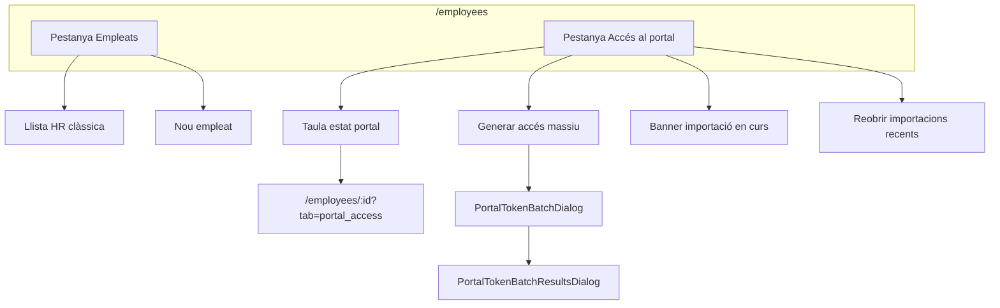
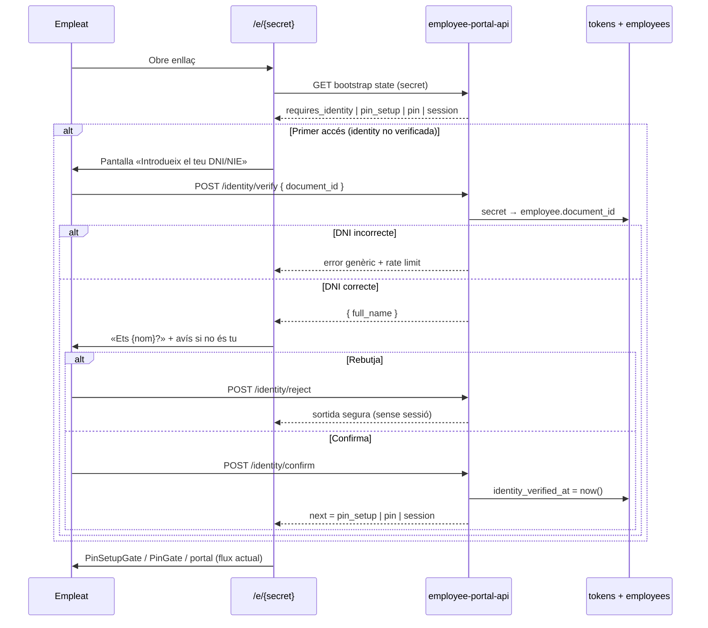

# Hub «Accés al portal» a `/employees`

> **Data:** 2026-07-13 · **Revisat:** 2026-07-13 (post-implementació)  
> **Estat:** **✅ implementat (8a–8e + 9a–9e)** — smoke SQL ✅ · E2E manual parcial ([`ep-acc8-hub-smoke-checklist.md`](./ep-acc8-hub-smoke-checklist.md))  
> **Motivació:** feedback operatiu — bulk i «Lots recents» poc clars; forat de seguretat enllaç equivocat  
> **Relacionat:** [`plan-employee-portal-access-v2.md`](./plan-employee-portal-access-v2.md) · [`plan-employee-portal-token-batch.md`](./plan-employee-portal-token-batch.md)  
> **Mapa global:** [`STATUS.md`](./STATUS.md)

### Resum executiu

Avui el **bulk** i **«Lots recents»** viuen al header de `/employees`. Això competeix amb la gestió diària d'empleats i no serveix per **controlar** l'estat del portal a escala de tenant.

**Proposta en dos eixos:**

| Eix | ID | Què aporta al tenant |
|-----|-----|----------------------|
| **Hub gestió** | EP-ACC-8 | Vista única: qui té enllaç, qui no l'ha obert, qui falta DNI, onboarding massiu |
| **Seguretat** | EP-ACC-9 | DNI obligatori al primer accés — sense bypass; evita accés a dades alienes |

**Resposta directa:** sí, aquest pla **servirà** perquè els tenants controlin i gestionin portals d'empleat **si** implementem hub + identitat + bloqueig sense DNI. Sense EP-ACC-9, el hub només millora UX però no tanca el risc legal/operatiu de l'enllaç equivocat.

**Ordre d'implementació obligatori:** `9a → 9b → 9c` (identitat) **abans** de `8d` (bulk al hub en producció). El hub es pot desenvolupar en paral·lel (`8a–8c`), però no desplegar bulk reubicat sense DNI actiu.

---

## 1. Problema actual

### 1.1 UX confusa al llistat principal

| Element | On és avui | Per què molesta |
|---------|------------|-----------------|
| «Generar enllaços» + mode selecció | Header `/employees` | Sembla una acció principal igual que «Nou empleat» |
| «Lots recents» | Header `/employees` | Nom poc explicatiu; no queda clar que són **importacions d'onboarding** amb TTL 1h |
| Banner recuperació lot | Sota el header de `/employees` | Pertany al flux batch, no al dia a dia |
| Checkboxes a `EmployeeRow` | Només en mode selecció batch | Barreja dos mental models (HR vs distribució d'accés) |

### 1.2 Freqüència d'ús real

- **Bulk:** principalment **onboarding** (molts empleats nous alhora) o reemplaçament massiu d'enllaços — poques vegades al mes.
- **Consulta d'estat:** «qui encara no ha obert l'enllaç?», «qui no té accés?» — més habitual que generar lots, però avui obliga a entrar empleat per empleat.

### 1.3 Risc actual: enllaç al empleat equivocat

> **Anàlisi codi (2026-07-13):** el secret del bootstrap (`/e/{secret}`) és l'única credencial. No hi ha cap pas que lligui la persona física a l'empleat del token.

| Escenari avui | Què passa | Risc |
|---------------|-----------|------|
| Enllaç **personal** sense PIN (`pin_must_set=false`) | `POST /session` obre sessió **immediata** amb `full_name` i dades de l'empleat del token | **Alt** — qualsevol amb l'URL veu dades alienes |
| Enllaç amb `pin_must_set=true` (primer accés) | Qui té l'URL pot **definir el PIN** via `setupPortalPin` sense provar identitat | **Alt** — bloqueja l'empleat legítim fins a reset |
| Enllaç amb PIN ja definit pel manager | Cal conèixer el PIN; encara sense prova de «sóc jo» | **Mitjà** |
| **Copiar enllaços** (bulk, sense nom) | CSV ja porta `employee_name` + `employee_code`, però «Copiar enllaços» enganxa només URLs | **UX** — facilita error humà de distribució |

**Conclusió:** el dubte de l'usuari és vàlid. Cal un **Identity Gate** al primer ús de cada token (abans de `session_create` / `pin_setup`), independentment del hub UX.

### 1.4 El que ja funciona bé (no trencar)

- Pestanya **«Accés Portal»** a la fitxa d'empleat (`EmployeePortalAccessTab`) — detall, tokens, logs, correu, PIN.
- Backend batch (RPCs, TTL, rate limit, ack) — **sense canvis** de negoci; només reubicació UI.
- Flux 1-a-1 des de la fitxa — intacte.

---

## 2. Objectius i no-objectius

### Objectius (V1 hub)

| # | Objectiu |
|---|----------|
| O1 | Separar mentalment **gestió d'empleats** vs **accés al portal** |
| O2 | Taula **per empleat** (no per token) amb estat resumit i últim accés |
| O3 | Filtres i ordenació útils per onboarding («sense enllaç», «mai usat», per local…) |
| O4 | Reubicar bulk + recuperació de lot dins la pestanya portal, amb copy orientat a onboarding |
| O5 | Una sola RPC tenant-scoped (evitar N× `list_employee_portal_tokens`) |
| O6 | **Primer accés:** verificació DNI + confirmació de nom abans de sessió o PIN (EP-ACC-9) |

### No-objectius (V1 hub)

- Eliminar la pestanya portal de la fitxa d'empleat.
- Canviar el model batch (jobs, TTL, rate limit).
- Enviament massiu de correus (continua fora d'abast; veure v2 §10).
- Substituir `shared_device` per estacions (pla ST-*).
- Biometria / login SSO empleat (fora d'abast; només DNI + confirmació V1).

### No-objectius (EP-ACC-9 identitat)

- Re-verificar DNI a cada sessió (només **primer accés del token**; després PIN o sessió segons política).
- Substituir el PIN per DNI en accessos posteriors (el DNI és per onboarding / primera vegada).

---

## 3. Arquitectura d'informació

### 3.1 Rutes i pestanyes

Patró alineat amb `EmployeeDetailPage` (`?tab=`):

```
/employees                      → tab=list (default)
/employees?tab=portal_hub       → hub accés al portal (llista)
/employees/:id?tab=portal_access → detall per empleat (existent)
```

> **Nota:** el tab del hub es diu `portal_hub` (no `portal_access`) per no confondre amb la pestanya de la fitxa d'empleat.

**Navegació** (sota el títol «Empleats» o com a sub-nav):

```
[ Empleats ]  [ Accés al portal ]
```

- La pestanya activa es reflecteix a la URL (deep-linkable, bookmarkable).
- Permís per veure «Accés al portal»: `attendance.manage` (mateix que avui el batch).

### 3.2 Diagrama de flux



### 3.3 Què surt del header principal

| Treure de tab **Empleats** | On va |
|----------------------------|-------|
| «Generar enllaços» / mode selecció | Tab **Accés al portal** |
| «Lots recents» | Tab portal → secció **«Importacions recents»** (només si n'hi ha) |
| `PortalTokenBatchRecoveryBanner` | Tab portal |
| Checkboxes a `EmployeeRow` | Tab portal (fila selectable) o taula pròpia |

---

## 4. Pestanya «Accés al portal» — especificació UI

### 4.1 Capçalera de la pestanya

**Títol:** «Accés al portal»  
**Subtítol (suggerit):** «Estat dels enllaços d'empleat i generació per onboarding.»

**Accions principals** (toolbar dreta):

| Acció | Prioritat | Notes |
|-------|-----------|-------|
| **Generar accés (seleccionats)** | Primària quan hi ha selecció | Reutilitza `PortalTokenBatchDialog` |
| **Exportar vista** (CSV resum) | Secundària | Opcional V1.1 — només metadades, sense secrets |
| Ajuda breu (`?`) | Terciària | Enllaç a doc / tooltip: personal vs taulell, PIN, estacions |

**No** mostrar «Lots recents» com a botó sol al header; integrar-ho a §4.4.

### 4.2 Taula per empleat (1 fila = 1 empleat)

**Columnes proposades (V1):**

| Columna | Font | Notes |
|---------|------|-------|
| ☐ Selecció | UI | Per bulk; màx. 100; **desactivada** si falta DNI |
| Nom | `employees.full_name` | Enllaç a fitxa `?tab=portal_access` |
| DNI/NIE | `employees.document_id` | **Obligatori** per generar enllaç; badge si falta |
| Local | `sites.name` | Filtre |
| Estat empleat | `employees.status` | Badge actiu/inactiu |
| **Personal** | Agregat token `shared_device=false` actiu | Cap / Actiu / Mai obert / Revocat |
| **Taulell** | Agregat token `shared_device=true` actiu | Mateix patró; EP-ACC-7 → màx. 1 actiu per tipus |
| PIN | Token actiu personal | Pendent setup / Configurat (`pin_hash` + `!pin_must_set`) / No requerit |
| Últim accés | `max(last_accessed_at)` tokens actius o recents | Ordenable |
| Creat enllaç | `min(created_at)` token actiu personal | Opcional |
| Accions | Menú ⋮ | Obrir fitxa · Generar personal · Enviar correu · Revocar (si actiu) |

**Fita resum (sota el títol):** comptadors des del RPC — p. ex. «42 actius · 8 sense enllaç · 3 mai oberts · 2 sense DNI» (clicables com a filtres ràpids).

**Regles de presentació:**

- Si empleat **inactiu** → fila atenuada; bulk per defecte el salta (`skip_inactive`).
- Si **sense `public_site` resoluble** → icona avís; mateix comportament que avui al create.
- **«Mai obert»** = token actiu amb `first_accessed_at IS NULL`.

### 4.3 Filtres i ordenació

**Filtres:**

| Filtre | Valors |
|--------|--------|
| Cerca | Nom, email, codi |
| Local | Tots / site_id |
| Departament | Tots / department_id |
| Estat empleat | Actiu / Inactiu / Tots |
| **Estat portal** | Tots · Sense enllaç personal · Amb enllaç actiu · Mai obert · Només taulell · Sense PIN configurat |

**Ordenació:** nom (default), últim accés (asc/desc), data creació enllaç.

**Paginació:** **server-side obligatòria** (`limit`/`offset` + `total`). Cap a 500+ empleats per tenant és realista; el client no ha de carregar tota la llista ni fer N× RPC.

### 4.4 Importacions / lots (reanomenat)

Substituir «Lots recents» per copy orientat a onboarding:

| Abans | Després (proposta) |
|-------|-------------------|
| Lots recents | **Importacions recents** |
| Obrir lot | **Reobrir importació** |
| Banner «lot pendent» | **Tens una importació d'accés pendent d'exportar** |

**Ubicació:**

1. **Banner** (mateix `PortalTokenBatchRecoveryBanner`, copy actualitzat) — només a aquesta pestanya.
2. **Secció col·lapsable** sota la taula o dins un drawer «Importacions recents (última hora)» — reutilitza `PortalTokenBatchRecentDialog` / `list_employee_portal_token_batches`.
3. Enllaç des del modal de resultats: «Veure altres importacions recents» (no al header global).

El TTL 1h i `ack_batch` es mantenen; només canvia **on** i **com** es descobreixen.

### 4.5 Selecció massiva

Mateixa lògica que avui:

- Sticky bar quan `n > 0`: «Generar accés per a N empleats».
- Límit 100; rate limit 5/h (missatge ja implementat).
- Després del batch → modal resultats → CSV / QR / copiar / ack.

---

## 5. Backend — RPC resum tenant

### 5.1 Problema

Avui només existeix `api.list_employee_portal_tokens(p_employee_id)` — **1 empleat per crida**. Un hub amb 80 empleats implicaria 80 round-trips o lògica client fràgil.

### 5.2 Nova RPC proposada

```sql
api.list_employee_portal_access_overview(
  p_site_id       uuid DEFAULT NULL,
  p_department_id uuid DEFAULT NULL,
  p_employee_status text DEFAULT NULL,  -- 'active' | 'inactive' | NULL
  p_portal_filter text DEFAULT NULL,    -- 'no_personal_link' | 'never_opened' | ...
  p_search        text DEFAULT NULL,
  p_sort          text DEFAULT 'name',  -- 'name' | 'last_access' | 'link_created'
  p_sort_dir      text DEFAULT 'asc',
  p_limit         int DEFAULT 100,
  p_offset        int DEFAULT 0
) RETURNS jsonb
```

**Retorn (per fila):** veure JSON a §5.2. A més, el payload inclou **`summary`** a nivell arrel:

```json
{
  "summary": {
    "total_employees": 120,
    "without_personal_link": 8,
    "never_opened": 3,
    "missing_document_id": 2,
    "identity_rejected_recent": 0
  },
  "rows": [ "..." ],
  "total": 42
}
```

`total` = files després de filtres (per paginació); `summary` = comptadors globals del tenant (respectant permisos site).

```json
{
  "rows": [
    {
      "employee_id": "uuid",
      "full_name": "Anna Garcia",
      "document_id": "12345678A",
      "email": "anna@...",
      "site_id": "uuid",
      "site_name": "Barcelona",
      "department_id": "uuid",
      "status": "active",
      "personal": {
        "has_active": true,
        "token_id": "uuid",
        "pin_must_set": true,
        "pin_configured": false,
        "first_accessed_at": null,
        "last_accessed_at": null,
        "created_at": "ISO",
        "label": "Onboarding 2026"
      },
      "kiosk": {
        "has_active": false
      },
      "last_access_any": null,
      "site_configured": true
    }
  ],
  "total": 42
}
```

**Autorització:**

- `attendance.manage` a nivell tenant.
- Filtrar empleats per `jwt_has_permission(tenant, 'attendance.manage', employee.site_id)` (mateix que batch).
- `SECURITY DEFINER`; sense SELECT directe a taules des del client.

**Implementació SQL (esbós):**

```sql
FROM data.employees e
LEFT JOIN LATERAL (
  SELECT ... FROM data.employee_portal_tokens t
  WHERE t.employee_id = e.id AND t.is_active AND t.revoked_at IS NULL
    AND NOT t.shared_device
  ORDER BY t.created_at DESC LIMIT 1
) personal ON true
LEFT JOIN LATERAL (...) kiosk ON true
WHERE e.tenant_id = active_tenant
```

Índexs existents (`idx_employee_portal_tokens_employee_active`) cobreixen la majoria de consultes.

### 5.3 Tests SQL proposats (H-T*)

| ID | Cas |
|----|-----|
| H-T1 | Tenant amb 3 empleats, 2 amb token personal actiu → resum correcte |
| H-T2 | Filtre `never_opened` només retorna qui té `first_accessed_at IS NULL` |
| H-T3 | Manager sense permís site → no veu empleats d'aquell site |
| H-T4 | Paginació `limit`/`offset` + `total` coherent |
| H-T5 | `summary` comptadors coincideixen amb filtres |
| H-T6 | Empleat sense `document_id` → `missing_document_id=true`; no seleccionable bulk |
| H-T7 | Manager site A no veu empleats site B al overview ni al summary |
| H-T8 | PIN configurat després de setup (`pin_required` + `pin_configured`, `pin_must_set=false`) |
| H-T9 | Filtre `pin_not_configured` només retorna tokens amb PIN pendent |

---

## 6. Frontend — estructura de fitxers

```
apps/tenant-portal/src/features/employees/
  components/
    EmployeesPage.tsx              — refactor: tabs + delegació
    EmployeesListTab.tsx           — nou: llista HR actual (sense batch)
    EmployeesPortalAccessTab.tsx   — nou: hub taula + bulk
    EmployeeRow.tsx                — sense selectionMode (o només llista)

apps/tenant-portal/src/features/employee-portal/
  api/
    employeePortalOverviewService.ts   — nou: RPC overview
    useEmployeePortalOverview.ts       — nou: react-query
  components/
    PortalAccessOverviewTable.tsx      — nou: taula + filtres
    PortalTokenBatch*.tsx              — reutilitzats sense canvis funcionals
```

**i18n:** claus noves sota `employees.tabs.portal_access` i `employees.portal_hub.*`; deprecar `employees.batch.*` al header o reutilitzar-les dins el hub.

---

## 7. Fases d'implementació

### 7.1 Ordre i dependències (tancat)

```
Fase A (seguretat — PRIMER a producció):
  9a → 9b → 9c → 9d
  (+ 9e: bloqueig DNI a create/batch abans de 8d)

Fase B (hub — paral·lel des de 9a):
  8a ∥ 8b → 8c → 8d (només després de 9c) → 8e
```

| Fase | ID | Entregable | Esforç | Gate producció |
|------|-----|------------|--------|----------------|
| **Identitat SQL** | EP-ACC-9a | `identity_verified_at`, normalització DNI, backfill tokens ja usats | S | Sí |
| **Identitat API** | EP-ACC-9b | Edge `/identity/*` + bloqueig `session`/`pin_setup` | M | Sí |
| **Identitat UI** | EP-ACC-9c | `IdentityDocumentGate` + `IdentityConfirmGate` | M | Sí |
| **Identitat polish** | EP-ACC-9d | Logs, rate limit, i18n | S | Sí |
| **DNI a create/batch** | EP-ACC-9e | Bloqueig sense DNI; `employee_missing_document_id` al batch | S | Abans de 8d |
| **API hub** | EP-ACC-8a | RPC overview + `summary` + tests H-T1…H-T7 | M | No |
| **Tabs** | EP-ACC-8b | `/employees?tab=portal_hub` + llista HR neta | S | No |
| **Hub UI** | EP-ACC-8c | Taula + filtres + KPI + enllaços fitxa | M | No |
| **Bulk move** | EP-ACC-8d | Batch/banner/importacions al hub | S | **Després de 9c+9e** |
| **Hub polish** | EP-ACC-8e | Copy CA/ES/EN, export resum, smoke E2E | S | ✅ (export CSV V1.1 diferit) |

**Migració UX:** un sol desplegament quan 8d+9 estan llestos; no deixar bulk al header sense DNI actiu.

---

## 8. Criteris d'acceptació

### Funcional

- [x] `/employees` default mostra només gestió HR (sense «Lots recents» ni mode selecció batch).
- [x] `/employees?tab=portal_hub` mostra taula amb estat portal per empleat.
- [x] Filtre «Mai obert» llista només empleats amb enllaç actiu no usat (H-T2).
- [x] Bulk des de la pestanya portal funciona igual que avui (CSV, QR, ack, rate limit) — backend B-T*; E2E manual §3.1 pendent.
- [x] Banner recuperació només visible a la pestanya portal.
- [x] Fitxa `?tab=portal_access` continua amb detall complet.

### No regressió

- [x] Tests batch B-T1…B-T13 continuen passant (backend intacte).
- [x] Permisos `attendance.manage` per site respectats al overview (H-T3, H-T7).

### EP-ACC-9 (identitat)

- [x] Primer accés amb enllaç aliè + DNI incorrecte → sense dades de l'empleat; missatge genèric (I-T2).
- [x] DNI correcte → pantalla de confirmació amb nom complet + avís «si no ets tu, surt» (I-T1 + UI).
- [x] «No sóc aquesta persona» → sense sessió; es registra `identity_rejected` (I-T3).
- [x] «Confirmo» → continua a `pin_setup` o `pin` o sessió segons token (I-T1).
- [x] Segon accés mateix token → no torna a demanar DNI (només PIN si aplica) (I-T4).
- [x] Empleat sense `document_id` → bootstrap bloquejat amb missatge per contactar RRHH (I-T6).
- [x] Token `shared_device` (taulell) → exempt Identity Gate (§13.6) (I-T5).
- [x] Crear enllaç / batch **rebutjat** si `document_id` NULL (I-T8a, I-T8, B-T13).

**Checklist operatiu:** [`ep-acc8-hub-smoke-checklist.md`](./ep-acc8-hub-smoke-checklist.md)

---

## 9. Decisions tancades (implementació)

| # | Decisió |
|---|---------|
| 1 | Pestanya hub: **`portal_hub`**; fitxa manté `portal_access` |
| 2 | **DNI obligatori** (`document_id`) — sense bypass, sense email alternatiu, sense setting tenant |
| 3 | Identitat abans de PIN; només després de DNI correcte |
| 4 | Paginació overview **server-side** des del dia 1 |
| 5 | Empleats inactius ocults per defecte al hub |
| 6 | «Copiar enllaços» → línies `Nom · DNI · URL` o eliminar |
| 7 | Tokens **ja usats** abans de la migració: `identity_verified_at := first_accessed_at` (grandfather); tokens nous exigeixen DNI |
| 8 | EP-ACC-9 en producció **abans** de reubicar bulk (8d) |

### Decisions obertes (només V1.1)

| # | Pregunta | Recomanació diferida |
|---|----------|----------------------|
| 1 | Badge comptador a tab «Accés al portal» | V1.1 — usar KPI dins la pestanya |
| 2 | Export resum CSV del hub | V1.1 — sense secrets |
| 3 | Revocació massiva des del hub | V1.1 — V1 només per fila a la fitxa |

---

## 10. Revisió pre-implementació

### 10.1 Errors corregits al pla

| Error | Correcció |
|-------|-----------|
| Columna «Codi» = `document_id` | És **DNI/NIE** (mateix camp; copy UI coherent) |
| `?tab=portal_access` al llistat | Renombrat a **`portal_hub`** vs fitxa |
| Paginació «client-side si petit» | **Server-side obligatori** |
| EP-ACC-9 opcional | **Bloquejant** per producció |
| §12.5 referència taulell a acceptance | Apunta a §13.6 |

### 10.2 Escalabilitat

| Risc | Mitigació al pla |
|------|------------------|
| 500+ empleats, una RPC overview | Paginació + `summary` agregat en una query; índex `idx_employee_portal_tokens_employee_active` |
| Cerca per nom (`ILIKE`) lenta | Filtre `p_search` amb `LIMIT`; V1.1: índex trigram `employees.full_name` si cal |
| Manager multi-site | `jwt_has_permission` per `site_id` a la query — **no** filtrar al client |
| N+1 al hub | Prohibit — una RPC overview; detall continua a la fitxa |
| Rate limit DNI brute-force | Per `token_id` + IP; lockout com PIN |
| Grandfather tokens antics | Evita trencar empleats ja operatius; tokens nous segurs |

### 10.3 Cobertura «control i gestió» per tenant

| Necessitat del tenant | Cobert per V1? | On |
|------------------------|----------------|-----|
| Qui no té enllaç | ✅ | Hub + filtre + KPI |
| Qui no ha obert l'enllaç | ✅ | «Mai obert» |
| Onboarding massiu | ✅ | Bulk al hub |
| Qui falta DNI | ✅ | Columna + filtre + bloqueig create/batch |
| Enllaç equivocat no exposa dades | ✅ | EP-ACC-9 |
| Revocar / historial tokens | ⚠️ Parcial | Fitxa empleat (no bulk revoke V1) |
| Enviar correu des del hub | ⚠️ Parcial | Menú fila → mateix flux que fitxa |
| Polítiques tenant (PIN obligatori, etc.) | ✅ Existent | Settings + create dialog |
| Auditoria accés / identitat rebutjada | ✅ | Logs + V1.1 alerta hub si `identity_rejected_recent` > 0 |
| Estacions (substituir taulell) | ❌ | Pla ST-* (fora d'abast) |

**Veredicte:** el pla **sí** cobreix el control operatiu que demana RRHH per onboarding i seguiment diari. La gestió profunda (revocar, logs, regenerar) segueix a la fitxa — coherent amb un hub de resum + detall.

### 10.4 Fora d'abast conscient (no bloqueja V1)

- Correu massiu a tot el tenant
- Revocació bulk
- Informes compliance exportables
- Viewer read-only al hub (només `attendance.manage` avui)

---

## 11. Actualització de plans relacionats ✅ (2026-07-13)

1. [`plan-employee-portal-token-batch.md`](./plan-employee-portal-token-batch.md) §8 — punts d'entrada UI actualitzats (hub `portal_hub`, no header llista).
2. [`plan-employee-portal-access-v2.md`](./plan-employee-portal-access-v2.md) §0 — **EP-ACC-8** i **EP-ACC-9** marcats implementats; bulk reubicat.
3. [`STATUS.md`](./STATUS.md) — fila hub «Accés al portal» + Identity Gate.
4. Smoke: [`ep-acc8-hub-smoke-checklist.md`](./ep-acc8-hub-smoke-checklist.md).

---

## 12. Referència — estat actual del codi (2026-07-13)

| Fitxer | Rol actual |
|--------|------------|
| `EmployeesPage.tsx` | Tabs `list` / `portal_hub`; delega a `EmployeesListTab` o `EmployeesPortalAccessTab` |
| `EmployeesListTab.tsx` | Llista HR neta (sense batch) |
| `EmployeesPortalAccessTab.tsx` | Hub: taula overview, KPI, filtres, bulk, banner, importacions |
| `PortalAccessOverviewTable.tsx` | Taula 1 fila = 1 empleat + menú accions |
| `EmployeePortalAccessTab.tsx` | Detall per empleat (tokens, logs, correu, PIN) |
| `PortalTokenBatch*.tsx` | Flux batch (reutilitzat al hub) |
| `list_employee_portal_access_overview` | RPC hub + `summary` + paginació (H-T*) |
| `list_employee_portal_tokens` | Detall fitxa empleat |
| `list_employee_portal_token_batches` | Importacions recents al hub |
| `app/e/[secret]/page.tsx` | Bootstrap amb Identity Gate → PIN → sessió |
| `session-service.ts` / `pin-service.ts` | Bloqueig `identity_required` sense `identity_verified_at` |

---

## 13. Verificació d'identitat al primer accés (EP-ACC-9)

### 13.1 Problema de producte i seguretat

En onboarding massiu és fàcil distribuir l'enllaç d'Anna a en Pere (WhatsApp, paper, «Copiar enllaços»). Avui el receptor **entra al compte d'Anna** sense cap fricció addicional.

**Objectiu:** al **primer accés** d'un token personal, la persona ha de demostrar que és l'empleat associat (via **DNI / NIE** registrat a RRHH com a `employees.document_id`) i **confirmar explícitament** el nom abans de veure dades o definir PIN.

### 13.2 Flux proposat (public-portal)



**Ordre (decisió tancada):** DNI → confirmació de nom → `pin_setup` / `pin` / sessió. Mai `session_create` ni `pin_setup` sense `identity_verified_at` (excepte taulell §13.6).

### 13.3 Pantalles (copy orientatiu CA)

| Pas | Títol | Contingut |
|-----|-------|-----------|
| **A — DNI** | «Identifica't» | «Introdueix el teu DNI o NIE.» Sense mostrar nom ni dades de l'empleat. |
| **B — Confirmació** | «Confirmació d'identitat» | «Hola, **{full_name}**. Confirma que ets tu.» Avís: «Si no ets aquesta persona, **no continuïs** i tanca aquesta pàgina.» **Sí, sóc jo** / **No sóc aquesta persona**. |
| **C — PIN** | (existent) | `PinSetupGate` o `PinGate` |

### 13.4 Canvis tècnics

#### Esquema

```sql
ALTER TABLE data.employee_portal_tokens
  ADD COLUMN IF NOT EXISTS identity_verified_at timestamptz;
```

`first_accessed_at` marca el primer ús real del portal; `identity_verified_at` és el prerequisit de seguretat.

**Backfill (migració 9a):** tokens amb `first_accessed_at` anterior a la feature → `identity_verified_at := first_accessed_at` (no trencar empleats ja operatius). Tokens nous sense ús → DNI obligatori.

#### Normalització DNI

`normalize_employee_document_id(text)`: trim, majúscules, sense espais/guions; comparació constant-time. Missatge d'error **sempre genèric** (no revelar si el DNI existeix).

#### API Edge

| Mètode | Ruta | Descripció |
|--------|------|------------|
| `GET` | `/bootstrap/state` | Estat sense sessió: `requires_identity`, `pin_setup`, `pin`, `ready` |
| `POST` | `/identity/verify` | `{ secret, document_id }` → si OK `{ full_name }` |
| `POST` | `/identity/confirm` | Marca `identity_verified_at`; retorna `next` |
| `POST` | `/identity/reject` | Log `identity_rejected`; sense sessió |

**Enduriment:** `createPortalSession` i `setupPortalPin` rebutgen amb `identity_required` si `!identity_verified_at` (tokens personals).

#### Auditoria

Accions noves: `identity_verify_failed`, `identity_rejected`, `identity_confirmed`. Logs amb `{ document_id_last4 }` com a màxim.

#### Rate limit

~5 intents DNI / 15 min per token (patró similar al lockout de PIN).

#### Requisit RRHH

`document_id` obligatori abans de distribuir enllaços. Hub: columna + filtre «sense DNI»; batch opcional: `skipped` + `employee_missing_document_id`.

### 13.5 Empleat sense DNI (`document_id` NULL)

**Política (decisió tancada):** sense document d'identitat a RRHH **no es pot obrir el portal de forma segura**. No hi ha bypass automàtic al flux antic (sessió directa). Cal **completar la fitxa abans** de distribuir l'enllaç.

#### Capa 1 — Prevenció (tenant-portal, manager)

| Acció | Comportament |
|-------|----------------|
| Crear enllaç (1-a-1) | **Bloquejar** amb avís: «Afegeix el DNI/NIE a la fitxa abans de generar l'accés.» Enllaç a edició de l'empleat. |
| Bulk / batch | Fila **`skipped`** o **`error`** amb `employee_missing_document_id` (no crear token). Resum del lot ho indica. |
| Hub «Accés al portal» | Columna **DNI** + filtre **«Sense DNI»** + badge «Incomplet»; no seleccionable per bulk. |
| Import empleats | Recomanació: mapping obligatori de columna DNI/NIE si el tenant usa portal (fora d'abast import — documentar al runbook). |

El camp `employees.document_id` ja accepta **DNI, NIE o passaport** (el formulari diu «Document (DNI/NIE)»); no cal un altre camp només per a espanyols.

#### Capa 2 — Si l'empleat obre un enllaç antic (sense DNI a BD)

Pot passar si el token es va crear abans de la política o per dades incompletes.

| Pas | Comportament |
|-----|----------------|
| `GET /bootstrap/state` | `identity_not_configured` |
| Pantalla | «No podem verificar la teva identitat perquè falta el document a la empresa. Contacta recursos humans.» **Sense** nom de l'empleat ni dades. |
| Manager | Ha d'omplir `document_id`, **revocar** el token antic i generar-ne un de nou. |

**No hi ha alternatives** (email, codi intern, bypass tenant). DNI obligatori per política de producte.

### 13.6 Excepció: taulell (`shared_device=true`)

L'enllaç identifica un **dispositiu**, no una persona. **Exempt** d'Identity Gate. Identificació per fitxatge / estacions (ST-*).

### 13.7 Millores UX bulk (EP-ACC-8 + 9e)

| Avui | Proposta |
|------|----------|
| «Copiar enllaços» (només URLs) | **Copiar línies etiquetades** (`Nom · DNI · URL`) o eliminar |
| CSV | Canal principal (ja té `employee_name` + columna document) |
| QR imprès | Nom + codi visibles a cada etiqueta |

### 13.8 Subfases EP-ACC-9

| Subfase | Entregable |
|---------|------------|
| **9a** | Migració + normalització DNI + tests SQL |
| **9b** | Edge `/identity/*` + bloqueig session/pin_setup |
| **9c** | UI `IdentityDocumentGate` + `IdentityConfirmGate` |
| **9d** | Logs, rate limit, i18n |
| **9e** | Hub/batch DNI + «Copiar enllaços» millorat |

### 13.9 Tests (I-T*)

| ID | Cas |
|----|-----|
| I-T1 | DNI OK + confirm → `identity_verified_at`; després pin_setup |
| I-T2 | DNI incorrecte → sense sessió; log `identity_verify_failed` |
| I-T3 | «No sóc jo» → `identity_rejected` |
| I-T4 | Segon accés → salta DNI |
| I-T5 | `shared_device` → exempt |
| I-T6 | `document_id` NULL → `identity_not_configured` |
| I-T7 | Rate limit intents DNI |
| I-T8 | Batch: empleat sense DNI → `employee_missing_document_id`, cap token |
| I-T9 | Token amb `first_accessed_at` previ → grandfather, sense DNI al re-accedir |

### 13.10 Decisions tancades

| # | Decisió |
|---|---------|
| 1 | Identitat **abans** de PIN al primer accés |
| 2 | Camp = `employees.document_id` |
| 3 | Nom complet només **després** de DNI correcte |
| 4 | Nova verificació per cada token nou |
| 5 | Taulell exempt |
| 6 | Cap sessió ni dades abans de confirmació |
| 7 | Sense `document_id` | **No generar enllaç** + bootstrap `identity_not_configured`; manager omple DNI i regenera |
