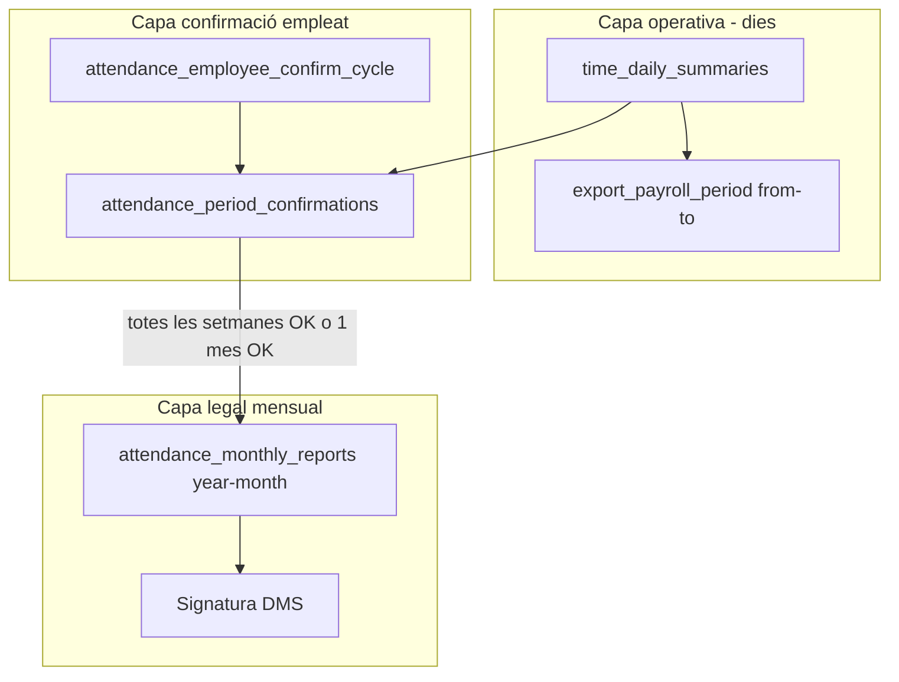

# Confirmació d'empleat per període (mensual / setmanal)

> **Data:** 2026-07-09  
> **Estat:** pla actiu — **Fases 0–5 implementades**  
> **Mapa global:** [`STATUS.md`](./STATUS.md)  
> **Relacionat:** [`plan-monthly-close-approval.md`](./plan-monthly-close-approval.md) (Track A · A6) · [`plan-employee-portal.md`](./plan-employee-portal.md) (EP8) · [`ep8-smoke-checklist.md`](./ep8-smoke-checklist.md)

### Resum

Revisar i alinear la validació actual (confirmació només quan el període ha acabat), introduir confirmacions per **període de dates** (mensual per defecte o setmanal configurable), renombrar la UI a **«Registre»**, i ampliar audit/Activitat amb `period_from`/`period_to` — mantenint el **mes natural** com a capa legal (`attendance_monthly_reports` + signatura DMS).

| Fase | Entregable | Estat |
|------|------------|-------|
| **0** | `PERIOD_NOT_ENDED` estricte + tests SQL | ✅ |
| **1** | `attendance_period_confirmations` + setting `attendance_employee_confirm_cycle` | ✅ |
| **2** | RPCs validació/confirmació + sync AMR | ✅ |
| **3** | Portal «Registre» (vistes mensual/setmanal) | ✅ |
| **3b** | Paritat tenant-portal (`MyRecord` / `MonthlyAttendanceReportPanel`) | ✅ |
| **4** | Audit/Activitat + portal Accessos | ✅ |
| **5** | Tancament gestor segons períodes confirmats | ✅ |

---

## Estat actual (auditoria)

### Quan pot confirmar l'empleat avui?

La validació passa per [`api.validate_attendance_period_employee_confirm`](../../../supabase/migrations/20260915000001_period_not_ended_employee_confirm.sql) (wrapper mensual: [`validate_attendance_month_employee_confirm`](../../../supabase/migrations/20260915000001_period_not_ended_employee_confirm.sql)):

| Bloqueig | Efecte |
|----------|--------|
| `PERIOD_NOT_ENDED` | `period_to >= avui` (Europe/Madrid) → no confirmable. Mes natural: només des del **dia 1 del mes següent** |
| `OPEN_TIME_ENTRY` | Jornades obertes dins el període |

**Implementat (Fase 0):** regla estricta `PERIOD_NOT_ENDED` — inclou l'últim dia del mes encara bloquejat.

**Abans (pre-Fase 0):** `FUTURE_MONTH` + `CURRENT_MONTH_INCOMPLETE` via filtre de `validate_attendance_month_close` — l'últim dia del mes podia ser confirmable si no hi havia `OPEN_TIME_ENTRY`.

### Què es guarda avui?

- **Estat legal mensual:** [`attendance_monthly_reports`](../../../supabase/migrations/20260727000002_attendance_v2_rpc_reports.sql) (`year`, `month`, `status`, `confirmed_at`) — 1 fila per empleat × mes natural.
- **Audit:** `ATTENDANCE_MONTH_EMPLOYEE_CONFIRMED` via [`data.log_attendance_employee_audit`](../../../supabase/migrations/20260813000001_attendance_employee_timeline_audit_a5.sql) amb payload `{ year, month, report_id, source }` — **sense** `period_from`/`period_to`.
- **Activitat:** [`timelineAuditRegistry.ts`](../../../apps/tenant-portal/src/features/entity-timeline/registry/timelineAuditRegistry.ts) formata `{{period}}` com a `YYYY-MM`.

**Resposta a «ho guardem dia a dia?»:** No cal una fila de confirmació per dia. L'empleat **confirma el contingut consolidat dia a dia** d'un **període** (`period_from` → `period_to`); les dades de cada dia viuen a `time_daily_summaries` / `get_payroll_review_days`. La confirmació és **1 registre per període** (+ audit amb el rang de dates).

---

## Arquitectura objectiu (dues capes)



| Capa | Entitat | Unitat |
|------|---------|--------|
| Consolidació / export nòmina | Dies aprovats + export | `from`–`to` arbitrari (ja existeix) |
| Confirmació empleat | **Nova** `attendance_period_confirmations` | Període configurable (mes o setmana) |
| Registre legal RD 8/2019 | `attendance_monthly_reports` | Mes natural (es manté) |

**Fora d'abast (posposat):** confirmació ad hoc (offboarding mig mes) — es deixa preparat el model (`cycle_type = 'manual'`) sense UI.

---

## Fase 0 — Verificació i alineació mensual estricta (petita)

**Objectiu:** complir «no confirmar fins que el període ha acabat» per al mode mensual (default).

1. Afegir bloqueig `PERIOD_NOT_ENDED` a validació per rang de dates:
   - `period_to >= today` (timezone `Europe/Madrid`, com [`validate_attendance_month_close`](../../../supabase/migrations/20260810000001_validate_attendance_month_close.sql)) → no confirmable.
   - Per mes natural: `period_to = últim dia del mes` → efectivament només confirmable des del **dia 1 del mes següent** (més estricte que avui).
2. Tests SQL a `supabase/tests/`:
   - Mes corrent → `PERIOD_NOT_ENDED` o equivalent.
   - Mes anterior sense jornades obertes → confirmable.
   - Últim dia del mes encara en curs → no confirmable (nou comportament).
3. Actualitzar [`ep8-smoke-checklist.md`](./ep8-smoke-checklist.md) §2.4 amb la regla estricta.

---

## Fase 1 — Model de dades i setting tenant — ✅

### Nova taula `data.attendance_period_confirmations`

```sql
-- esbós
id, tenant_id, employee_id,
period_from date NOT NULL,
period_to   date NOT NULL,
cycle_type  text NOT NULL CHECK (cycle_type IN ('calendar_month','iso_week','manual')),
calendar_year int, calendar_month int,  -- referència legal
confirmed_at timestamptz NOT NULL,
confirmed_via text NOT NULL,  -- 'employee_portal' | 'tenant_app'
source_session_id uuid NULL,  -- portal session si escau
UNIQUE (employee_id, period_from, period_to)
```

### Setting nou

| Clau | Default | Valors |
|------|---------|--------|
| `attendance_employee_confirm_cycle` | `calendar_month` | `calendar_month` \| `iso_week` |

- Registre a [`settings_registry`](../../../supabase/migrations/20260812000001_attendance_monthly_close_settings_a4.sql) + UI a [`AttendanceMonthlyCloseSettingsSection.tsx`](../../../apps/tenant-portal/src/features/attendance/components/settings/AttendanceMonthlyCloseSettingsSection.tsx).
- Setmana: **ISO setmana dilluns–diumenge**, timezone `Europe/Madrid`.

**Implementat (2026-07-09):** migració `20260917000001` — taula + RLS + setting + UI tenant (`AttendanceMonthlyCloseSettingsSection`).

### Sincronització amb `attendance_monthly_reports`

**Recomanació:** mode setmanal → quan **totes** les setmanes que cauen dins el mes natural estan confirmades, actualitzar automàticament `attendance_monthly_reports.status = 'employee_confirmed'` per aquell `year/month`. Evita un pas mensual redundant després de 4–5 confirmacions setmanals.

Mode mensual → 1 confirmació de període = mes sencer = `employee_confirmed` directe (comportament actual, via nova taula).

---

## Fase 2 — RPCs de validació i confirmació

### `api.validate_attendance_period_employee_confirm(employee_id, period_from, period_to)`

Reutilitzar lògica de `validate_attendance_month_close` **restringida al rang** `[period_from, period_to]`:

- `PERIOD_NOT_ENDED` — `period_to < today`
- `OPEN_TIME_ENTRY` — només dins el rang
- `MISSING_WORKDAY_RECORD` / cobertura — només dies del rang ja passats
- **No** reutilitzar `CURRENT_MONTH_INCOMPLETE` del mes sencer; substituït per `PERIOD_NOT_ENDED`

Mantenir `validate_attendance_month_employee_confirm` com a wrapper: mes natural → `period_from = dia 1`, `period_to = últim dia`.

### `api.confirm_attendance_period(employee_id, period_from, period_to)`

- Crida validació; insereix a `attendance_period_confirmations`.
- Trigger/logic: sincronitza `attendance_monthly_reports` si el mes queda complet.
- Audit: ampliar payload o nou tipus `ATTENDANCE_PERIOD_EMPLOYEE_CONFIRMED` amb `{ period_from, period_to, cycle_type, calendar_year, calendar_month, source }`.

### Portal empleat (edge function)

Actualitzar [`monthly-report-service.ts`](../../../supabase/functions/_shared/employee-portal/monthly-report-service.ts):

- `GET` accepta `from`/`to` (o deriva del setting + navegació UI).
- `POST confirm` envia `period_from`/`period_to`.
- Resposta inclou: dies del període, resum, `validation`, estat confirmació del període, setmanes pendents del mes (mode weekly).

**Implementat (2026-07-09):**

| Artefacte | Fitxer |
|-----------|--------|
| Migració RPCs + helpers ISO | `supabase/migrations/20260918000001_period_confirm_rpcs_f2.sql` |
| Fix settings sense auth (service role) | `supabase/migrations/20260918000002_period_confirm_settings_fix.sql` |
| Tests SQL (5/5) | `supabase/tests/attendance_period_confirm_rpcs_tests.sql` |
| Servei tenant | `apps/tenant-portal/.../periodConfirmService.ts` |
| Portal payload `period_status` | `supabase/functions/_shared/employee-portal/monthly-report-service.ts` |
| Activitat `ATTENDANCE_PERIOD_EMPLOYEE_CONFIRMED` | `timelineAuditRegistry.ts`, `activity.json` |

Pendent Fase 3: `GET`/`POST` amb `period_from`/`period_to` explícits al portal (avui el confirm mensual delega a `confirm_attendance_period` via wrapper).

---

## Fase 3 — UI «Registre» (portal + tenant-portal)

### Renombrat i navegació

| Abans | Després |
|-------|---------|
| «Registre mensual» / nav «Mensual» | **«Registre»** |
| Ruta `/portal/monthly` | Mantenir ruta (evitar trencar enllaços) o alias `/portal/record` |

Fitxers clau:

- [`PortalMonthlyPage.tsx`](../../../apps/public-portal/features/employee-portal/components/PortalMonthlyPage.tsx) → refactor `PortalRecordPage.tsx`
- [`portalNavConfig.ts`](../../../apps/public-portal/features/employee-portal/config/portalNavConfig.ts)
- Locales [`portal.json`](../../../apps/public-portal/locales/)

### Vistes

- **Mensual (default):** navegació mes/any actual; botó confirmar el **mes sencer** quan `period_to` ha passat.
- **Setmanal:** navegació setmana ISO (prev/next); llista de dies de la setmana; botó confirmar **aquesta setmana** quan ha acabat (dilluns següent).
- Indicador al mes legal: «3/4 setmanes confirmades» (mode weekly).
- Reutilitzar `PortalViewToggle` o tabs «Mes» / «Setmana» segons setting del tenant (si `calendar_month`, amagar tab setmana).

**Implementat (2026-07-09):**

| Artefacte | Fitxer |
|-----------|--------|
| Portal UI mes/setmana | `PortalRecordPage` (`PortalMonthlyPage.tsx`) |
| API portal període | `portalApi.ts`, edge `monthly-report/confirm` amb `period_from`/`period_to` |
| Migració portal validate/confirm | `20260919000001_employee_portal_period_f3.sql` |
| Tenant setmanal | `PeriodWeeklyConfirmSection.tsx`, `PeriodEmployeeConfirmDialog.tsx` |
| Nav «Registre» | `portalNavConfig.ts`, `portal.json` (ca/es/en) |

---

### Paritat tenant-portal

- [`MonthlyAttendanceReportPanel.tsx`](../../../apps/tenant-portal/src/features/attendance/components/records/MonthlyAttendanceReportPanel.tsx) + [`MonthlyEmployeeConfirmDialog.tsx`](../../../apps/tenant-portal/src/features/attendance/components/records/MonthlyEmployeeConfirmDialog.tsx): mateixa API de període.

---

## Fase 4 — Audit i Activitat

1. **SQL audit:** payload amb `period_from`, `period_to`, `cycle_type` (mantenir `year`/`month` per compatibilitat).
2. **Activitat:** [`activity.json`](../../../apps/tenant-portal/src/locales/ca/activity.json) — text tipus «ha confirmat el registre (15–21 març 2026)» via `formatDateRange`.
3. **Registry:** [`timelineAuditRegistry.ts`](../../../apps/tenant-portal/src/features/entity-timeline/registry/timelineAuditRegistry.ts) — suport rang de dates al missatge.
4. **Portal Accessos:** [`PortalAccessPage.tsx`](../../../apps/public-portal/features/employee-portal/components/PortalAccessPage.tsx) — mostrar confirmacions per període si l'API ho retorna.

**Implementat (2026-07-09):**

| Artefacte | Fitxer |
|-----------|--------|
| Access logs `metadata` + `period_confirm` | `20260920000001_employee_portal_access_period_f4.sql` |
| API accessos amb confirmacions | `access-logs-service.ts`, `employee_portal_get_access_logs` |
| UI portal Accessos | `PortalAccessPage.tsx`, `portalAccessUtils.ts` |
| Activitat rang dates | `timelineAuditRegistry.ts` (`formatPeriodRangeDisplay`) |

---

## Fase 5 — Integració tancament gestor

[`approve_attendance_month`](../../../supabase/migrations/20260811000001_monthly_close_a3.sql) continua operant sobre el **mes legal**.

- `employee_confirm_required` + `manager_can_close_without_employee`: comprovar que el mes té cobertura de confirmacions (totes les setmanes o el mes sencer) abans de bloquejar el gestor.
- UI gestor: al panell mensual, llista de períodes confirmats / pendents de l'empleat.

**Implementat (Fase 5):**

- Migració [`20260921000001_period_confirm_manager_close_f5.sql`](../../../supabase/migrations/20260921000001_period_confirm_manager_close_f5.sql):
  - `data.attendance_month_employee_confirm_satisfied` — AMR `employee_confirmed+` o `month_fully_confirmed` via períodes.
  - `validate_attendance_month_close` → bloqueig `EMPLOYEE_PERIOD_CONFIRM_INCOMPLETE`.
  - `approve_attendance_month` — mateixa regla abans del tancament.
- Tests: [`attendance_period_manager_close_tests.sql`](../../../supabase/tests/attendance_period_manager_close_tests.sql).
- Tenant: `PeriodConfirmStatusPanel` al panell gestor + diàleg de tancament; `isMonthlyCloseBlockedByEmployeeConfirm` usa `month_fully_confirmed`.

**Hardening P0/P1 (2026-07-10):** migració [`20260922000001_period_confirm_hardening_p01.sql`](../../../supabase/migrations/20260922000001_period_confirm_hardening_p01.sql) — validació període amb `NEEDS_REVIEW`/`MISSING_WORKDAY_RECORD`; confirm només empleat; signatura digital al tenant; `iso_week` no bypassa AMR legacy; ISO dates fix tenant.

**P2 (2026-07-10):** migració [`20260923000001_period_confirm_batch_p2.sql`](../../../supabase/migrations/20260923000001_period_confirm_batch_p2.sql) — `compute_month_period_status` + `get_attendance_month_period_status_batch`; CI [`.github/workflows/attendance-period-confirm-tests.yml`](../../../.github/workflows/attendance-period-confirm-tests.yml); smoke §8 setmanal a [`ep8-smoke-checklist.md`](./ep8-smoke-checklist.md).

**P2b — `signature_is_employee_approval` (2026-07-10):** migració [`20260924000001_period_confirm_signature_approval.sql`](../../../supabase/migrations/20260924000001_period_confirm_signature_approval.sql) — bloqueja L1 (`employee_confirm_via_signature_required`, blocker `EMPLOYEE_CONFIRM_VIA_SIGNATURE`); `satisfied_core` relaxa tancament gestor quan la confirmació vindrà amb la signatura post-tancament; setting exposat al portal; tests [`attendance_period_signature_approval_tests.sql`](../../../supabase/tests/attendance_period_signature_approval_tests.sql).

---

## Ordre d'implementació recomanat

1. Fase 0 (validació estricta + tests) — quick win, sense UI nova.
2. Fase 1 + 2 (migració, RPCs, setting).
3. Fase 4 (audit) en el mateix PR que Fase 2.
4. Fase 3 portal (Registre + vistes).
5. Fase 3 tenant-portal paritat.
6. Fase 5 integració gestor.
7. Docs: aquest fitxer + actualitzar [`STATUS.md`](./STATUS.md) i [`ep8-smoke-checklist.md`](./ep8-smoke-checklist.md).

---

## Riscos i decisions documentades

| Tema | Decisió |
|------|---------|
| Confirmació per dia | **No** — 1 fila per període; dades per dia des de summaries existents |
| Mes legal | Es manté `attendance_monthly_reports`; signatura DMS sense canvis |
| Setmana | ISO dilluns–diumenge, Europe/Madrid |
| Offboarding ad hoc | Model `manual` reservat; UI en track futur |
| Nòmina anticipada (1–25) | Segueix sent export per dates; independent de confirmació empleat |
| Text «para nómina» | Revisar coherència a tenant-portal i portal públic |

---

##Referències

- [`plan-monthly-close-approval.md`](./plan-monthly-close-approval.md) — Track A (tancament mensual actual)
- [`plan-employee-portal.md`](./plan-employee-portal.md) — EP8 confirmació L1
- [`ep8-smoke-checklist.md`](./ep8-smoke-checklist.md)
- [`18-employee-portal-architecture.md`](../../product-design/18-employee-portal-architecture.md)
