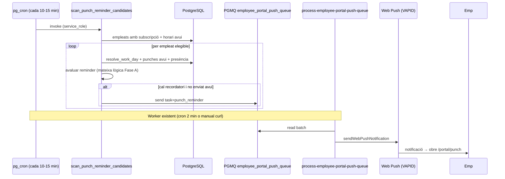

# Work Status — Recordatoris push de fitxatge (Fase B)

> **Data:** 2026-07-13  
> **Estat:** Fase A ✅ · WS-B1–B6 documentats (2026-07-13) — smoke local: [`DEV_RUNBOOK.md`](../../DEV_RUNBOOK.md) § WS-B6  
> **Relacionat:** [`STATUS.md`](./STATUS.md) · [`plan.md`](./plan.md) Fase 6 (`PUNCH_OUT_MISSING`) · EP9 [`notificacions-push.md`](../../help/employee-portal/notificacions-push.md) · referència JCM [`PUNCH_REMINDERS_SYSTEM.md`](../../../../my-app-jcm/docs/PUNCHS/PUNCH_REMINDERS_SYSTEM.md)

---

## Context

### Fase A (fet)

Alertes **proactives in-app** comparant horari resolt (`resolve_work_day`) vs fitxatges i estat de presència:

| Superfície | Component | Lògica |
|------------|-----------|--------|
| tenant-portal | `WorkScheduleStatusCard` | `computeWorkScheduleStatus()` |
| public-portal | `PortalWorkScheduleStatusCard` | mateixa lògica (còpia local) |

Només visible quan l'usuari té l'app oberta. Sense notificacions fora de pantalla.

### Fase B (aquest pla)

Recordatoris **push** quan l'empleat **no ha fitxat** dins l'horari esperat (entrada, sortida de matí, entrada de tarda, sortida de jornada), inspirat en `my-app-jcm` (`checkPunchReminders` + FCM).

**Canal triat:** Web Push + VAPID del **portal empleat** (EP9), **no** el motor de notificacions / OneSignal.

| Destinatari | Canal Fase B | Per què |
|-------------|--------------|---------|
| Empleat al **portal** (`/portal/*`, `/e/{secret}`) | Web Push VAPID | Sense `auth.users`; subscripció per token ja existeix (EP9) |
| Empleat al **tenant-portal** (login propi) | 📦 Fora d'abast inicial | Requereix OneSignal + `profiles.id` o app nativa; veure §«Camí alternatiu» |

---

## Principis

1. **Reutilitzar infra EP9** — mateixa cua `employee_portal_push_queue`, mateix worker `process-employee-portal-push-queue`, mateix `web-push-sender.ts`. Nou `task`: `punch_reminder`.
2. **Mateixa semàntica que Fase A** — el servidor ha d'avaluar condicions equivalents a `computeWorkScheduleStatus` (o cridar lògica compartida a l'Edge Function).
3. **Opt-in obligatori** — només empleats amb fila a `employee_portal_push_subscriptions` (ja exigit per torns).
4. **Idempotència diària** — com a JCM: màxim N recordatoris per tipus/dia/empleat; no bombardejar cada 5 min.
5. **Fire-and-forget** — el cron no bloqueja res; errors → log estructurat, no trencar el tick.
6. **Config per tenant** — activar/desactivar, retard mínim, finestres horàries, només dies laborables.

---

## Arquitectura



### Diferència amb `PUNCH_OUT_MISSING` (Fase 6 automatitzacions)

| Aspecte | Work Status Fase B | `PUNCH_OUT_MISSING` (plan.md F6) |
|---------|-------------------|----------------------------------|
| Canal | Web Push portal (VAPID) | Motor notificacions / email / workflows |
| Destinatari | Empleat sense compte portal | Pot incloure manager + empleat amb perfil |
| Disparador | Cron periòdic + lògica horari | Event post-jornada / pg_cron diari |
| Implementació | Aquest pla (WS-B*) | `automation_trigger_queue` — ❌ pendent |

Es poden **complementar** més endavant; no són el mateix deliverable.

---

## Tipus de recordatori

Mapatge des de `computeWorkScheduleStatus` (només kinds que demanen acció):

| `reminder_kind` | Condició (resum) | Prioritat push |
|-----------------|------------------|----------------|
| `missing_entry` | Dins tram laboral, sense fitxatge avui | Alta |
| `missing_afternoon_entry` | Dins tram de tarda, sense entrada tarda | Alta |
| `missing_morning_exit` | Descans entre trams, encara «treballant» | Mitjana |
| `missing_exit` | Després últim tram, encara treballant/pausa | Alta |
| `starting_soon` | ≤15 min abans inici (opcional, configurable) | Baixa |

**Fora d'abast V1:** `unexpected_out`, vacances/festius (no cal push), recordatoris al manager.

---

## Configuració tenant

Claus a `tenant_settings` (JSON), clau plana `attendance_punch_reminders` (compatible amb `attendance.punch_reminders` llegat):

```json
{
  "enabled": false,
  "delay_minutes": 5,
  "soon_threshold_minutes": 15,
  "send_starting_soon": false,
  "send_only_on_workdays": true,
  "max_per_day": 4,
  "entry_window": { "enabled": false, "start": "06:00", "end": "12:00" },
  "exit_window": { "enabled": false, "start": "14:00", "end": "22:00" },
  "cron_interval_minutes": 15
}
```

| Clau | Default | Efecte |
|------|---------|--------|
| `enabled` | `false` | Sense cron actiu |
| `delay_minutes` | `5` | Minuts després de l'hora límit abans d'enviar |
| `soon_threshold_minutes` | `15` | Igual que Fase A |
| `send_starting_soon` | `false` | Push preventiu abans d'entrada |
| `max_per_day` | `4` | Cap per `reminder_kind` + dia |
| `send_only_on_workdays` | `true` | Saltar caps de setmana si el dia no és laborable |

UI: secció a `/settings/attendance-control` (gestor), no al portal empleat.

---

## Emmagatzematge d'idempotència

Taula nova `data.employee_portal_punch_reminder_sent`:

```sql
-- Esbòs (migració WS-B1)
CREATE TABLE data.employee_portal_punch_reminder_sent (
  id            uuid PRIMARY KEY DEFAULT gen_random_uuid(),
  tenant_id     uuid NOT NULL REFERENCES data.tenants(id) ON DELETE CASCADE,
  employee_id   uuid NOT NULL REFERENCES data.employees(id) ON DELETE CASCADE,
  work_date     date NOT NULL,
  reminder_kind text NOT NULL,
  sent_at       timestamptz NOT NULL DEFAULT now(),
  UNIQUE (employee_id, work_date, reminder_kind)
);
```

Índex per purge: `(work_date)` — retenció 90 dies via job setmanal.

---

## Payload cua

```json
{
  "task": "punch_reminder",
  "tenant_id": "...",
  "employee_id": "...",
  "work_date": "2026-07-13",
  "reminder_kind": "missing_entry",
  "idempotency_key": "punch-reminder-{employee_id}-{work_date}-missing_entry"
}
```

El worker:

1. Llegeix subscripcions (`list_employee_portal_push_subscriptions`).
2. Construeix títol/cos amb `punch-reminder-content.ts` (CA per defecte, i18n F2).
3. `url`: `/portal/punch`, `tag`: `punch-reminder-{kind}-{work_date}` (evita duplicats al SW).
4. INSERT a `employee_portal_punch_reminder_sent` (o abans de l'enviament amb ON CONFLICT DO NOTHING).

---

## Fases d'implementació

| ID | Abast | Entregables | Dep. |
|----|--------|-------------|------|
| **WS-B0** | Pla + STATUS | Aquest document + fila a `STATUS.md` | Fase A ✅ |
| **WS-B1** | SQL + cron | Taula idempotència, RPC scan, enqueue `punch_reminder`, `pg_cron` | ✅ EP9 push infra |
| **WS-B2** | Worker | Handler `punch_reminder` a `process-employee-portal-push-queue`, `punch-reminder-content.ts` | ✅ WS-B1 |
| **WS-B3** | Config UI | Settings tenant + tests SQL | ✅ WS-B1 |
| **WS-B4** | Lògica compartida | Extreure `computeWorkScheduleStatus` a `_shared` (Deno) o duplicar testada al worker; evitar drift amb client | WS-B2 |
| **WS-B5** | Opt-in UX | `PortalPushOptIn` a Fitxatge + detecció subscripció existent | ✅ WS-B2 |
| **WS-B6** | Smoke + docs | Runbook local VAPID, actualitzar `notificacions-push.md`, checklist | ✅ `DEV_RUNBOOK.md` |

**No inclou:** tenant-portal OneSignal, FCM, automatització `PUNCH_OUT_MISSING`.

---

## Desenvolupament local

**Sí es pot fer tot en local**, seguint [`notificacions-push.md`](../../help/employee-portal/notificacions-push.md):

1. `npx web-push generate-vapid-keys`
2. Omplir `EMPLOYEE_PORTAL_VAPID_*` a `supabase/functions/.env.local`
3. `supabase functions serve --env-file supabase/functions/.env.local`
4. Portal → activar notificacions (després de WS-B5, també des de Fitxatge)
5. Simular candidat: INSERT manual a cua o cridar RPC de scan
6. Worker manual:

```bash
curl -X POST http://127.0.0.1:54321/functions/v1/process-employee-portal-push-queue \
  -H "Authorization: Bearer <SERVICE_ROLE_KEY>" \
  -H "Content-Type: application/json" \
  -d '{"batch_size": 10}'
```

Sense VAPID: es pot implementar i provar RPC + cua; l'enviament fa skip (log `VAPID not configured`).

El cron `pg_cron` en local pot requerir cridar el RPC de scan manualment (mateix patró que el worker de torns).

---

## Criteris d'acceptació (WS-B1–B2 mínim viable)

- [x] Tenant amb `punch_reminders.enabled=false` → cap missatge a la cua.
- [x] Empleat sense subscripció push → saltat al scan (0 cost).
- [x] Dia de vacances/festiu/absència → cap recordatori.
- [ ] Empleat dins horari sense entrada → 1 push `missing_entry` després de `delay_minutes`; no es repeteix el mateix dia. (codi ✅; prova manual: `DEV_RUNBOOK.md` § WS-B6)
- [ ] Horari partit: sortida de matí no fitxada mentre «treballant» → `missing_morning_exit`. (codi ✅)
- [ ] Després últim tram encara treballant → `missing_exit`. (codi ✅)
- [ ] Push obre `/portal/punch` al clic. (codi ✅)
- [x] Tests SQL: claim + enqueue + candidates (`employee_portal_punch_reminder_tests.sql`)
- [x] Runbook smoke E2E local (VAPID + scan + worker) — `DEV_RUNBOOK.md` § WS-B6

---

## Camí alternatiu (fora d'abast V1)

**Tenant-portal** (empleat amb login): integrar via motor de notificacions (`NotificationService.enqueue`) + OneSignal quan l'empleat tingui `profiles.id` vinculat. Requereix nou esdeveniment al catàleg (`PUNCH_REMINDER`) i no cobreix portal sense compte.

**Automatització F6:** `PUNCH_OUT_MISSING` pot avisar managers per email/in-app independentment d'aquest pla.

---

## Fitxers previstos

| Capa | Fitxer |
|------|--------|
| Pla | `docs/plans/checkin/plan-work-status-push.md` (aquest) |
| Estat | `docs/plans/checkin/STATUS.md` |
| Migració | `supabase/migrations/YYYYMMDD_employee_portal_punch_reminders.sql` |
| Contingut push | `supabase/functions/_shared/employee-portal/punch-reminder-content.ts` |
| Lògica servidor | `supabase/functions/_shared/employee-portal/punch-reminder-eval.ts` |
| Worker | `supabase/functions/process-employee-portal-push-queue/index.ts` (handler nou) |
| Tests | `supabase/tests/employee_portal_punch_reminder_tests.sql` |
| Settings UI | `apps/tenant-portal/.../AttendancePunchReminderSettingsSection.tsx` + `punchReminderSettings.ts` |
| Help | `docs/help/employee-portal/notificacions-push.md` (§ recordatoris fitxatge) |
| Smoke local | `DEV_RUNBOOK.md` § WS-B6 |
| Client Fase A | `apps/*/features/**/workScheduleStatus.ts` (referència semàntica) |

---

## Decisions tancades

| # | Decisió |
|---|---------|
| 1 | Canal = Web Push VAPID portal (EP9), no OneSignal |
| 2 | Cua existent `employee_portal_push_queue`, task `punch_reminder` |
| 3 | Scan periòdic servidor (no depèn de l'app oberta) |
| 4 | Idempotència per `(employee_id, work_date, reminder_kind)` |
| 5 | Config per tenant, default `enabled: false` |
| 6 | Fase A in-app roman independent (no substituïda pel push) |

## Decisions obertes

| # | Pregunta | Recomanació |
|---|----------|-------------|
| 1 | Interval cron | 15 min (com JCM); configurable per tenant més endavant |
| 2 | `starting_soon` per defecte | `false` (menys soroll); opt-in al settings |
| 3 | Compartir codi TS client/servidor | WS-B4: mòdul `_shared` Deno + test parity |
| 4 | Timezone empleat vs tenant | Usar timezone del tenant (`tenants.timezone`) com `resolve_work_day` |

---

## Referència JCM

| JCM | Supabase Fase B |
|-----|-----------------|
| `checkPunchReminders` (FCM, 15 min) | RPC scan + `pg_cron` |
| `PunchReminderConfig` global | `tenant_settings.attendance.punch_reminders` |
| `NotificationTracking/{date}` | `employee_portal_punch_reminder_sent` |
| Topic FCM `schedules` | Subscripció Web Push EP9 |
| Finestres entrada/sortida | `entry_window` / `exit_window` opcionals |
