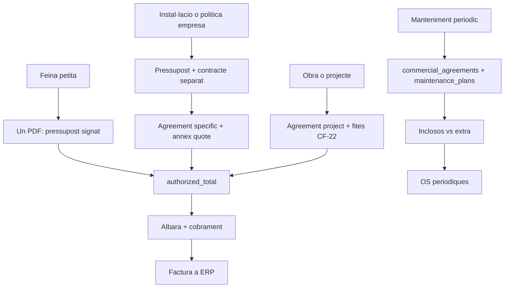

# Pressupost, contracte i acords comercials

> **Estat:** pla d’implementació V1, no començat (2026-09-27).
> **Prefix d’epics:** **CT-** (no reobrir QT-0…QT-10).
> **Font Cursor (resum):** pla `post-accept_contract_c63d30c7` — **aquest fitxer mana** per implementar.
> **Substitueix:** el disseny transaccional de [`../commercial-templates/05-contract-signing-forward-compat.md`](../commercial-templates/05-contract-signing-forward-compat.md) (QT-D6). El doc 05 es reescriu a **CT-0**.
> **Depèn de:** [commercial-flow](../commercial-flow/README.md) (Tall 1–2), [commercial-templates](../commercial-templates/README.md) (QT-0…QT-10), [maintenance](../maintenance/README.md) (només encaix; no es toca el cron), [signing](../signing/plan-sistema-firma-propi.md).
> **Guardrails QT:** llegir [`../commercial-templates/00-agent-instructions-and-guardrails.md`](../commercial-templates/00-agent-instructions-and-guardrails.md) abans de tocar fitxers. Migracions **només additives**. No commitejar tret que l’usuari ho demani.
> **Avís:** no és assessorament jurídic. El text de plantilles és punt de partida; revisió d’advocat abans de marcar-les com a «recomanades».

Aquest document és el pla executable fins a completar la **V1**. Inclou el que queda **fora d’abast** (cada punt amb motiu) i **com seguir** un cop tancada la V1 (CF-21, CF-22 i extensions).

---

## 1. Objectiu de producte

PiMed ha de servir empreses de serveis, reparació, manteniment, instal·lació i despatx **sense forçar un únic ritual**. V1 ha de permetre:

1. **Un sol PDF:** el pressupost emès i acceptat/signat **és** el contracte de l’encàrrec (pràctica habitual d’autònoms i pimes; Codi de consum de Catalunya + oferta/acceptació civil).
2. **Dos PDF:** pressupost acceptat → l’oficina confirma «Preparar contracte» → acord formal separat, amb clàusules pròpies, el pressupost com a **annex immutable**, i **segona** revisió/firma del client.

La distinció no és per sector ni per import automàtic, sinó per **comportament de la relació** i per **política del tenant/encàrrec**.

### 1.1 Tres conceptes (no una taula `contracte` universal)

| Concepte | On viu | Què és |
|----------|--------|--------|
| Encàrrec puntual (1 document) | `data.commercial_documents` (`quote` / `quote_amendment`) | Snapshot immutable + `authorized_total` + firma `client_accept`/`client_reject` |
| Contracte formal puntual (2 documents) | `data.commercial_agreements` `kind='specific'` + versions | Relació versionada; PDF propi; quote acceptat com a annex/`content_hash` |
| Acord amb cicle de vida | El **mateix** nucli d’acords, ampliat | Manteniment, marc, obra. **Fora de V1 funcional**; l’esquema V1 ja reserva `kind` |

**Vocabulari UI:** no omplir una llista «Contractes» amb tots els pressupostos acceptats. «Pressupostos» continua sent el llistat comercial. «Acords comercials» només mostra acords formals separats.

**No confondre:**

- `projects.commercial_regime = 'contractual'` = règim B2B / proteccions de consum, **no** «té un acord CF-21».
- `employment_contracts` / DMS laboral = WFM, **no** aquest epic.
- `maintenance_plans` = generació operativa d’OS, **no** l’acord comercial (inclosos, vigència, preu).

### 1.2 Principi de confiança (no negociable)

- **Reetiquetar** «Pressupost» → «Contracte» **sense** canviar el snapshot **no** és un acord nou. És presentació. No es torna a vendre com a document jurídic diferent.
- Un **contracte formal separat** pot tenir clàusules noves **només** si el client les veu i **firma de nou**.
- El pressupost acceptat s’adjunta com a annex PDF i/o es referencia amb `doc_number` + `content_hash`. Prohibit reconstruir línies «semblants» des de `project_lines` vives.
- El text del contracte **no** altera `authorized_total`. Canvis d’import/abast = ampliació o reemissió comercial (`quote_amendment` / `supersedes_id`).

### 1.3 Com ho fan altres (referència, no còpia)

- **Jobber:** pressupost aprovable; acord separat sovint via DocuSign; recurrència = job recurrent, no el mateix artefacte.
- **ServiceTitan:** N contractes per job/projecte, auditoria, plantilles condicionals.
- **Odoo:** pressupost → comanda; la recurrència/subscripció és un cicle apart.

PiMed ho fa **natiu**: dos fluxos explícits, annex hash-bound, versions d’acord, firma pròpia, execució (`projects` / plans) separada de l’acord comercial.

---

## 2. El que ja existeix (no reimplementar)

| Necessitat | Ja hi és | Decisió tancada |
|------------|----------|-----------------|
| Pressupost, línies, estats, validesa | `commercial_documents` + lines | **CF-D1:** no taula `quotes` |
| Negociació / correccions | fill `quote_amendment`; `supersedes_id` | **CF-D2:** no `versio INT` |
| Enviament | event `sent` | **CF-D3:** no estat `enviat` |
| Acceptació → sostre de cobrament | `accepted` + `authorized_total` | No cal fila `contracte` per cada Accepto |
| Condicions | `terms_text` + plantilles HTML QT-3 | |
| Firma del pressupost | QT-8/QT-9 `sign_native`, hub QT-10, `result_document_id` | No motor de firma nou |
| Plantilla activa de pressupost | `tenants.settings.commercial.quote_template_id` + `full_body_template_id` | [`CommercialDocumentTemplatesSection`](../../../apps/tenant-portal/src/features/commercial/components/CommercialDocumentTemplatesSection.tsx) |
| Fallback HTML | `buildCommercialDocumentHtml` | **QT-D1:** no tocar-lo com a fallback |
| Tokens Liquid de pressupost | [`01-context-and-legal-content.md`](../commercial-templates/01-context-and-legal-content.md) §1 / §2.1 | **QT-D10:** congelats; l’acord té **context i validació propis** |
| Cobrament / factura fiscal | `payments` + `external_invoice_ref` | **CF-17:** factura a ERP |
| Recurrència operativa | `maintenance_plans` + cron | No és cobertura comercial |
| Tags de PDF | `document_tags` (DMS) | Sense autoritat de negoci |
| Documents a l’OS | `data.documents.entity_type='project'` | Reutilitzar per actes/permisos |

El forat V1: **(1)** no es pot triar la formalització; **(2)** QT-D6 només preveia un PDF DMS sense acord versionat; **(3)** no hi ha acord amb vigència (això és CF-21, després).

---

## 3. Mapa de maneres de treballar

| Situació | Mercat | PiMed |
|----------|--------|-------|
| Reparació / servei petit | Pressupost acceptat = suficient | **V1-A.** Plantilla aclareix que Accepto constitueix el contracte de l’encàrrec |
| Instal·lació / política d’empresa | Pressupost + contracte formal | **V1-B.** `kind='specific'`, annex, segona firma |
| Obra gran | Pressupost + contracte amb fites | Nucli V1; **CF-22** després |
| Manteniment periòdic | Contracte anual / renovable | **CF-21** després; plans operatius ja existeixen |

Default recomanat: **un document**. El flux de dos documents és opcional i **mai** s’envia sol en `accepted`.

---

## 4. Decisions tancades V1

| ID | Decisió |
|----|---------|
| **CT-D1** | Dos fluxos natius: `formalization_mode` `signed_quote` \| `separate_agreement`. Default de tenant + override al draft. Descriu **workflow**, no validesa jurídica. |
| **CT-D2** | No `quote_acts_as_contract`. Tot pressupost acceptat ja és l’encàrrec; un booleà mentiria si la plantilla no té condicions. |
| **CT-D3** | No `doc_type='contract'` a `commercial_documents`. No `contract_document_id` únic al quote/projecte. |
| **CT-D4** | Categoria de plantilla d’acord: `commercial_agreement` (no `contract`, per no xocar amb laboral). |
| **CT-D5** | Prefix d’epics **CT-**. No reobrir QT. Ampliar §2.1 de pressupost **prohibit**. |
| **CT-D6** | `buildCommercialDocumentHtml` intacte (QT-D1). |
| **CT-D7** | Acceptar no crea ni envia acord. «Preparar contracte» + confirmació d’oficina + `client_op_id`. |
| **CT-D8** | Autoritat econòmica = quote acceptat + ampliacions. El PDF d’acord no muta `authorized_total`. |
| **CT-D9** | Firma d’acord: nativa, rol `client` (+ `issuer` opcional). **Prohibit** `client_accept`/`client_reject` al PDF d’acord. |
| **CT-D10** | N:M `commercial_agreement_projects`. Un projecte pot tenir N acords i N documents firmats. |
| **CT-D11** | Badges de sistema derivats; tags DMS sense gates. |
| **CT-D12** | V1 només **crea** acords `kind='specific'`. El CHECK de `kind` ja admet `recurring` \| `framework` \| `project` per no migrar després. |
| **CT-D13** | DocuSeal, DOCX d’acord, factura fiscal pròpia: fora. |
| **CT-D14** | Un epic CT per sessió d’implementació (mateixa disciplina que QT). Actualitzar el registre §12 d’aquest fitxer en tancar.

---

## 5. Model de dades V1

Migració nova **després** de `20261185000001` (o el darrer timestamp real). Només additiva.

### 5.1 `commercial_documents`

- `formalization_mode text NOT NULL DEFAULT 'signed_quote'`
- CHECK: `signed_quote` \| `separate_agreement`
- Mutable **només** en `draft`. El trigger d’immutabilitat existent hi ha d’incloure aquesta columna (mateix patró que `full_body_template_id`).
- Default en INSERT: `tenants.settings.commercial.formalization_mode_default` (resolver), override explícit al crear/editar draft.

### 5.2 Settings

Via el PATCH comercial existent ([`commercialSettingsPatchWithFullBodyTemplates`](../../../apps/tenant-portal/src/features/commercial/utils/deviationApprovalThreshold.ts)):

- `commercial.formalization_mode_default`: `signed_quote` \| `separate_agreement`
- `commercial.agreement_template_id`: clon del tenant o plataforma `category='commercial_agreement'`
- `commercial.work_gate_default`: `none` \| `require_signed_agreement` (només té efecte si el mode és `separate_agreement`)

`quote_template_id` / `delivery_note_template_id` no es toquen.

### 5.3 `data.commercial_agreements`

Identitat i cicle, no el text firmat.

| Camp | Notes |
|------|--------|
| `tenant_id`, `client_id` | Obligatori |
| `kind` | CHECK `specific` \| `recurring` \| `framework` \| `project`. V1 només INSERT `specific` |
| `status` | `pending_start` \| `active` \| `suspended` \| `cancelled` \| `finished` |
| `active_version_id` | FK a versions, nullable fins a primera versió |
| `source_quote_id` | Quote/ampliació acceptat que l’ha originat (V1 obligatori). CF-21 el farà opcional |
| `work_gate` | `none` \| `require_signed_agreement` |

### 5.4 `data.commercial_agreement_versions`

Condicions firmades, **immutables** un cop enviades a firma / signades.

| Camp | Notes |
|------|--------|
| `agreement_id`, `version_no` | Unique (agreement, version_no) |
| `status` | `draft` \| `pending_signature` \| `signed` |
| `source_quote_id`, `source_quote_content_hash` | Congelats des del quote acceptat |
| `source_quote_document_id` | PDF DMS del quote (`rendered` o `result` firmat) usat com a annex |
| `full_body_template_id` | `category='commercial_agreement'` |
| `rendered_document_id`, `signed_document_id` | DMS |
| `content_hash` | Hash del cos contractual (no del quote) |
| `starts_on`, `ends_on` | Nullable a V1 per `specific` |
| `terms_snapshot` jsonb | Opcional: clàusules/pack congelats |

Després de `pending_signature` o `signed`: no mutar camps de contingut (trigger). Regenerar draft substitueix la versió draft; post-firma = nova versió (fora V1 excepte esmena mínima documentada a CT-3).

### 5.5 `data.commercial_agreement_events`

Append-only: `created`, `prepared`, `sent`, `signed`, `activated`, `cancelled`, `project_linked`, `project_unlinked`, … Payload amb `client_op_id`, actor, hashes.

### 5.6 `data.commercial_agreement_projects`

N:M. Unique (`agreement_id`, `project_id`). Crear acord des d’un quote amb `project_id` insereix el vincle (idempotent). Desvincular: event, no esborra PDF ni desfirma. Si `work_gate='require_signed_agreement'` i l’acord està `active` o `pending_signature` i és l’acord que governa el projecte, **prohibit** desvincular sense cancel·lar/substituir.

### 5.7 Cobertura / plans (columnes o taules buides?)

**V1 no implementa** cobertura d’actius, SLA ni N:M amb `maintenance_plans`. Documentat a CF-21: `commercial_agreement_coverage` i `commercial_agreement_maintenance_plans`. *(CF-21-b: taules + UI d’enllaç; CF-21-c: gate «inclòs vs extra» a l’OS.)*

### 5.8 RLS / API

Vistes `api.*` `security_invoker`. Escriptura **només RPC**. A V1, preparar i enviar a firmar exigeix rol global `owner` o `manager`. `commercial.pricing.edit` (preus de tècnic) no prepara l'acord. Aïllament `tenant_id`.

### 5.9 RPCs (noms proposats)

- `api.set_quote_formalization(p_document_id, p_mode, p_client_op_id)` — només draft.
- `api.prepare_agreement_from_quote(p_document_id, p_template_id, p_work_gate, p_client_op_id)` — quote/ampliació **accepted**; idempotent; no des de `accept_commercial_document`.
- `api.send_agreement_for_signature` / reutilitzar `sign-document-router` `source_type='document_existing'` + `sign_native` sobre el PDF de la versió.
- `api.link_agreement_project` / `api.unlink_agreement_project`.
- Gate de camp: estendre el punt que ja comprova autorització abans de treballar (`require_auth_before_work` / `commercial_regime`) perquè, si el projecte té un acord amb `work_gate='require_signed_agreement'` no `active`, **bloquegi** iniciar/executar. Si `none`, no bloqueja.

`accept_commercial_document` / `apply_commercial_decision`: **no** cridar prepare.

---

## 6. Render i plantilles

### 6.1 Pressupost (V1-A)

- Seeds ca/es: clàusula explícita que l’acceptació signada **constitueix el contracte** de l’obra/servei descrit; extras = ampliació (ja esbossat a QT-3).
- Segona plantilla de plataforma: títol «Pressupost i contracte de serveis» (mateixos tokens §2.1, condicions més visibles).
- Selector de `full_body_template_id` al **draft** (si encara no hi és a la UI d’emissió); congelat en emetre.
- Una sola firma `client_accept` / `client_reject`.
- PDF canònic post-acceptació = `result_document_id` del hub. L’estampat pot dir «Acceptat el …» **sense** canviar `content_hash` econòmic. **Prohibit** re-render HTML post-acceptació amb clàusules noves.

### 6.2 Acord (V1-B)

- Validació **pròpia** `validate_commercial_agreement_template_locale`: tokens de context d’acord + `source_quote` + `<signature-field role="client">`. **No** passar per `validate_commercial_template_locale`.
- Context Liquid nou (`agreement`, `source_quote`, `tenant`, `seller`, `buyer`, `lines`/`totals` **del snapshot del quote**, no de línies vives). Documentar-lo en aquest pla / annex; **no** reobrir §2.1 del pressupost.
- Pipeline: Liquid → `injectHtmlSignatureMarkers` → Gotenberg → fila DMS de la versió → `sign_native`.
- Annex: el PDF del quote acceptat (idealment el firmat) s’uneix o s’incrusta de forma que el hash del quote quedi auditables. Si la unió PDF és massa arriscada a V1, pàgina d’annex amb número + hash + enllaç DMS **i** adjunt a la mateixa submissió; no perdre el fitxer.
- Sense plantilla d’acord → error explícit, no un pressupost disfressat.

**Prohibit:** tocar `buildCommercialDocumentHtml`; tocar router/stamp/field-map més enllà de passar-hi un PDF ja renderitzat.

### 6.3 Catàleg V1 (ca + es)

1. Pressupost estàndard.
2. Pressupost i contracte de serveis.
3. Contracte formal de serveis (annex = pressupost acceptat).

Clonables. L’arquetip **suggereix**, no bloqueja. Revisió jurídica abans de badge «recomanada».

---

## 7. UI

- **Draft de pressupost:** selector de formalització + plantilla de cos. Ajuda: «Un document» vs «Després d’acceptar, preparar contracte».
- **Settings comercials:** default de formalització, plantilla d’acord, default de `work_gate`.
- **`CommercialDocumentView`:** si `accepted` + `separate_agreement` + sense acord → «Preparar contracte» + confirmació. Si hi ha acord: estat, enllaç a firmar / PDF / Centre. Si `signed_quote`: sense CTA de contracte; badge pressupost/pressupost-contracte.
- **`/documents/templates`:** categoria `commercial_agreement` seleccionable.
- **Ruta «Acords comercials»** (llistat mínim V1): acords `specific`, estat, client, quote origen, projectes. No cal CRM ric.
- **Detall d’OS/projecte:** secció «Acords i documents»:
  - documents DMS `entity_type='project'`;
  - acords via N:M (versions/PDF heretats, **sense duplicar** files);
  - origen visible (directe vs heretat).
- **Centre de signatures:** l’acord natiu apareix com a DMS `signing_provider='native'`. No forçar-lo al hub només de pressupost/albarà; afegir mapeig `source_type` si cal.
- **Badges:** `Pressupost`, `Pressupost-contracte` (plantilla/títol), `Contracte formal`, `Acord pendent de firma`, `Acord actiu`. Derivats, no text lliure.
- **Filtres** a `/quotes` i acords: formalització, té/no té acord, estat de firma.

---

## 8. Epics i ordre d’implementació

Treballar **un epic per sessió**. En tancar: marcar §12 i el registre.

| Ordre | Epic | Contingut | Acceptació mínima |
|------:|------|-----------|-------------------|
| 0 | **CT-0** Docs | Reescriure [`05`](../commercial-templates/05-contract-signing-forward-compat.md): QT-D6 transaccional **substituït**. README/STATUS/EXECUTION de plantilles: enllaç a aquest pla. commercial-flow README/04: mapa quote-contracte vs `commercial_agreements`; CF-22 depèn del **nucli** d’acords, no de les extensions de manteniment. Glossari: acord comercial ≠ règim contractual ≠ laboral. | Un agent nou no implementaria `contract_document_id` + trigger en acceptar |
| 1 | **CT-1** Formalització al quote | Columna + settings + UI draft + seeds de clàusula / plantilla pressupost-contracte. `signed_quote` no crea acord | SQL: draft mutable, issued immutable; default tenant; override |
| 2 | **CT-2** Nucli acords | Taules agreement/version/events/projects + RLS + vistes. Sense UI de generació encara si cal partir | Isolament tenant; CHECK kind; no INSERT `recurring` des d’API V1 |
| 3 | **CT-3** Preparar + render + firma | RPC prepare, render `kind=agreement` o funció germana, annex/hash, `sign_native`, idempotència, Centre | Confirmació humana; accept no dispara; hash del quote; rol `client` |
| 4 | **CT-4** Projectes + gate | N:M UI, secció projecte, `work_gate` al flux de camp | N acords / N projectes; desvincular auditat; gate només si `require_signed_agreement` |
| 5 | **CT-5** Catàleg + badges + tests | Plantilla formal ca/es, badges/filtres, Settings plantilla acord, bateria SQL/vitest | Criteris §9 |
| 6 | **CT-6** Clarificar UX d’acords | Plantilles al centre; flux Acceptat→Preparar→Enviar→Firmat; identitat llegible; `/agreements?view=`; pestanya client; Vincular a l’OS en Avançat; terminologia `agreement` | Plantilla protagonista; Vincular no és l’acció principal |

No E2E Gotenberg extra (criteri QT-5).

---

## 9. Proves V1

- `signed_quote`: acceptar no crea agreement ni DMS `commercial_agreement`.
- `separate_agreement`: només `prepare_agreement_from_quote` explícita; idempotent amb `client_op_id`; doble clic no duplica.
- Plantilles de pressupost: tokens §2.1 + clàusula contractual; cap flag que divergi del PDF.
- Acord: quote accepted obligatori; `source_quote_content_hash` = hash del quote; plantilla `commercial_agreement`; firma `client`; versió immutable post-enviament.
- N:M: 2 acords al mateix projecte; 1 acord a 2 projectes; aïllament tenant.
- Projecte: DMS directe + heretat sense duplicar; unlink no esborra PDF.
- `work_gate=require_signed_agreement` bloqueja iniciar; `none` no.
- Permisos: membre de camp no prepara/envia acord.
- B2C/B2B puntual: mateix artefacte; gates de règim intactes.
- Reemissió: substituït no governa; nova clàusula al nou snapshot.
- `result_document_id` del quote no es re-renderitza amb text nou.
- Samples «Visita tècnica» dels pressupostos **intactes** (no picar el catàleg unit `visita`).
- `accept_commercial_document` no té crida a prepare (grep + test SQL).

---

## 10. Fora d’abast (cada punt, amb motiu)

### 10.1 Fora de V1 però previst després (veure §11)

#### CF-21 — Acord de manteniment / marc / recurrència

No s’implementa vigència operativa comercial (`starts_on`/`ends_on` usables, auto-renovació, preavís, llista a caducar), cobertura d’actius/seus, SLA, inclosos vs extra, N:M amb `maintenance_plans`, ni regla de facturació periòdica. Motiu: els plans ja generen OS; barrejar-ho a V1 duplicaria el cron i no resol «què està inclòs». El nucli d’acords V1 existeix precisament perquè CF-21 no torni a inventar taules.

#### CF-22 — Obra i instal·lació formal

No s’implementen fites, retencions, entregues parcials, variants d’oferta ni dashboard contractat/executat/facturat. Motiu: CF-9 (ampliació) ja és l’ordre de canvi comercial; l’obra formal reutilitzarà `kind='project'` sobre el nucli V1. Una obra **simple** pot tancar-se amb V1-A o V1-B `specific`.

#### Plantilles avançades

No es sembren plantilles «recomanades» de manteniment, marc, bossa d’hores, obra amb fites ni paquets condicionals per comunitat autònoma. Motiu: text legal no revisat; multiplicar sector × idioma × tipus seria soroll. V1 deixa 3 plantilles i el tenant clona.

#### IPC / revisió de preus

No hi ha increment automàtic ni índex. Motiu: sense regla de revisió ni versió d’acord de renovació, un cron d’IPC mentiria.

#### Etiquetes lliures a `/quotes` i Acords

Els `document_tags` del DMS es poden posar al PDF; **no** es fa un sistema d’etiquetes d’entitat genèric ni tags que decideixin el tipus. Motiu: els badges estructurats ja diferencien; un tag «contracte» no pot obrir gates.

#### Document DMS no contractual en N projectes

V1: un document extra (`acta`, permís) s’enganxa a **un** `entity_id=project`. Si cal el mateix fitxer a dues OS, s’afegirà un N:M genèric després. Motiu: no duplicar bytes per simular sharing.

#### Esmenes riques de l’acord firmat

V1: regenerar només el **draft**. Un acord ja firmat no s’edita; una nova versió/esmena completa queda per CF-21/22. Motiu: immutabilitat i evidència.

#### Acord sense pressupost

V1 exigeix quote acceptat. Un marc «obrim relació i ja pressupostarem visites» és CF-21 `framework`.

#### Numeració pròpia de contractes (C-2026-0001)

Fora. Es pot mostrar un id intern + número de quote. Motiu: no obrir comptadors fins que Acords sigui un mòdul d’oficina habitual.

#### Public-portal / client hub d’acords

El client firma pel flux natiu existent (`/sign/:token` o presencial). No es fa un portal d’«els meus contractes». Motiu: custom-portal té un altre backlog.

#### Activació per arquetip

El mòdul no es «codifica» a FSM vs taller. Capacitat de tenant opcional **després** si cal amagar «Acords» a autònoms que només usen V1-A.

### 10.2 Fora d’aquest pla (no fer-ho en nom de «contractes»)

#### Taules paral·leles `pressupost` / `linia` / `versio` / `factura` / `historial_estat`

Duplicarien Tall 1 i trenquen CF-D1…D4 i CF-17. El model genèric d’una altra IA no s’adopta.

#### Trigger «acceptat → crea contracte» per a tots els quotes

Ompliria Acords amb cada reparació. L’acceptació ja autoritza. El flux B és **explícit**.

#### Factura fiscal dins PiMed / cron que factura des de l’acord

CF-17: Holded/Quipu (o successor). L’app té albarà + `payments` + `external_invoice_ref`. Un `CREATE TABLE factura` fiscal és un producte apart i un risc legal (SII, etc.).

#### Nou `doc_type` comercial `contract` o PDF DMS amb clàusules noves **sense** segona firma

És el patró de desconfiança (el client ha de rellegir un altre text). Prohibit.

#### Reobrir QT-0 / ampliar tokens §2.1 del pressupost

L’acord té context propi. Inventar tokens al validador de pressupostos trenca clons existents.

#### Canviar `buildCommercialDocumentHtml`

Fallback per tenants sense plantilla. Les clàusules noves van a **seeds HTML** / clons.

#### DocuSeal / firma qualificada / eIDAS avançada

Fora. Natiu com QT-9. Si un tenant ho necessita per import, és decisió futura (ja era pregunta oberta de QT-D6 §5).

#### DOCX de contracte

HTML primer, com QT-D5. DOCX d’acord = fase posterior explícita.

#### Contractes laborals, DPA, NDA com a producte, RGPD com a mòdul

WFM i legal-compliance ja existeixen o tenen pla propi. Un NDA es pot **arxivar** al DMS del projecte (V1), no es modela com a `commercial_agreements`.

#### Visita / FAB / catàleg unit `visita` / i18n massiu

No forma part de formalització comercial.

#### Stripe API / Holded API

Ja 📦 a CF-17. No s’acobla a l’acord V1.

#### CF-19 / CF-20 costos i rendibilitat

Tall 3 independent. No bloqueja ni és bloquejat per CT.

#### Enforçament dels 12 dies hàbils RD 1457/1986

Continua sent text informatiu a plantilla de taller (QT-3.1), no un CHECK de `valid_until`.

#### Hospitality «guest commerce» vs manteniment d’equipament

Fora. Una OS d’equipament d’un restaurant usa el mateix spine comercial; FSR no es barreja.

---

## 11. Com seguir un cop implementada la V1

Ordre recomanat (no tot a la mateixa sessió):

### 11.1 Tancar V1 (definició de fet)

- Tots els epics CT-0…CT-6 ✅ al registre §12.
- UAT manual: (1) feina petita signed_quote; (2) instal·lació separate_agreement + annex + firma; (3) dos acords al mateix projecte; (4) gate bloqueja / no bloqueja; (5) acceptar no genera PDF sol.
- Types regenerats i copiats a portal + `_shared`.
- `05` i README QT no contradiguin aquest pla.

### 11.2 CF-21 — Acords amb cicle de vida

Partir d’aquest nucli, **no** d’una taula nova `contracte`.

#### CF-21 talls (execució)

| Tall | Estat | Fet | Diferit / següent |
|------|-------|-----|-------------------|
| **CF-21-a** | ✅ | Dates, `notice_days`, `kind=recurring` al prepare, filtre «A caducar» (UI) | Jobs/cron d’avís; auto-renovació operativa |
| **CF-21-b** | ✅ | `commercial_agreement_coverage` + N:M `commercial_agreement_maintenance_plans` + UI enllaç al detall | — |
| **CF-21-c** | ✅ | Gate OS inclòs vs extra (`project_commercial_inclusion`); banner + auth workflow | — |
| **CF-21-d** | ✅ | `kind=framework` + `source_quote_id` nullable + `create_framework_agreement` + UI | — |
| **CF-21-e** | ✅ | Vigència operativa: firma → `finalize`; activació per `starts_on`; expire/renew + `auto_renew`; crons | SLA; facturació periòdica; plantilla legal de manteniment; emails d’avís |
| **CF-21-f** | ✅ | SLA a versions; plantilla «Acord de manteniment»; emails d’avís (`notify_expiring_commercial_agreements`) | Facturació periòdica |
| **CF-21-g** | ✅ | Regla de facturació + períodes `due`/`invoiced` amb `external_invoice_ref` (sense factura fiscal) | Connector Holded/Quipu (CF-17 📦) |
| **CF-21-h** | 🔄 | Hardening h0…h7: baseline, idempotència, firma immutable, cicles, billing/jobs, inclusió/render, UX operable | Holded fiscal |

Checklist original (§11.2, referent):

1. Permetre INSERT `kind='recurring'|'framework'` i `source_quote_id` nullable. *(recurring: CF-21-a; framework/nullable: CF-21-d)*
2. Versions amb `starts_on`, `ends_on`, `auto_renew`, `notice_days` **usats** per jobs d’avís. *(camps + UI: CF-21-a; activació/renew: CF-21-e; emails: CF-21-f)*
3. Cobertura: contacte / seu / actiu. *(CF-21-b)*
4. N:M acord ↔ `maintenance_plans`. *(enllaç: CF-21-b; «OS inclosa no exigeix pressupost»: CF-21-c)*
5. Marc sense preu tancat. *(CF-21-d)*
6. Plantilla pròpia de l’acord periòdic. *(CF-21-f)*
7. Facturació periòdica (regla + períodes + ref. externa). *(CF-21-g; factura fiscal = CF-17 📦)*
8. Criteri [`05-acceptance-and-gates.md`](../commercial-flow/05-acceptance-and-gates.md) «inclòs vs extra». *(CF-21-c)*

### 11.3 CF-22 — Obra

1. `kind='project'` sobre el mateix aggregate.
2. Fites, bestretes (ja `payments`), entregues parcials, ordres de canvi = `quote_amendment` (CF-9).
3. Seguiment contractat / executat / facturat (facturat = refs ERP + albarans, no SII).
4. Dependència: **nucli CT**, no «haver acabat tot CF-21 manteniment». Actualitzar [`04-phases-and-backlog.md`](../commercial-flow/04-phases-and-backlog.md) en CT-0 perquè no sembli que obra espera el motor de manteniment.

### 11.4 Plantilles i legal

Revisió d’advocat de les 3 seeds V1 + noves (manteniment, marc, obra). Paquets/blocs condicionals abans que 5 sectors × 4 kinds × 2 idiomes.

### 11.5 Extensions menors

- Etiquetes d’entitat genèriques (quotes + acords + projectes).
- N:M document DMS ↔ projectes.
- Numeració `C-AAAA-NNNN`.
- DOCX d’acord.
- Segell «Acceptat» només via stamp existent (si V1 el va deixar pendent de UAT).
- Capacitat de tenant per amagar «Acords».

### 11.6 El que no cal «seguir»

No cal un epic «finalment fem el PDF QT-D6 amb `contract_document_id` al quote». Està **substituït**. Si algú el reobre, apuntar a aquest fitxer.

---

## 12. Registre d’execució

| Data | Epic | Què s’ha fet | Següent |
|------|------|--------------|---------|
| 2026-09-27 | — | Pla escrit. V1 = fluxos A+B + nucli acords + N:M projectes. | CT-0 docs |
| 2026-09-27 | CT-0 | Doc 05 substituït. README/STATUS/EXECUTION/06 de plantilles. Glossari i CF-22 al flux comercial. Sense migració ni UI. | CT-1 |
| 2026-09-27 | CT-1 | `formalization_mode` al pressupost, default de tenant, override en emetre, clàusula i plantilla «Pressupost i contracte de serveis». Sense taula d’acords. | CT-2 |
| 2026-09-27 | CT-2 | Taules `commercial_agreements` / versions / events / projects, RLS de lectura i vistes. V1 rebutja `kind` diferent de `specific`. Sense preparar, render ni UI. | CT-3 |
| 2026-09-27 | CT-3 | `prepare_agreement_from_quote` explícit (`20261188000001`), hash del pressupost, plantilla amb rol `client`, render germà i confirmació a la vista. Acceptar no prepara. Només owner/manager. | CT-4 |
| 2026-09-27 | CT-4 | Vincle N:M `link_agreement_project` / `unlink_agreement_project` (`20261189000001`). Desvincular deixa event i no esborra PDF. Si el gate `require_signed_agreement` governa (actiu o pendent de firma), no es pot desvincular. Iniciar feina es bloqueja només en aquest cas. | CT-5 |
| 2026-09-27 | CT-5 | Plantilla formal ca/es refeta (`20261190000001`). Distintius derivats, filtres a pressupostos i llista d’acords, settings de plantilla i `work_gate_default`. | CT-6 |
| 2026-09-29 | CT-6 | UX: passos de flux + plantilla d’acord al prepare/vista; identitat `títol · número · estat`; `/agreements?view=`; pestanya Acords al contacte; Vincular/Desvincular a l’OS dins Avançat; claus `agreement`/`agreement_plural`. | CF-21-a |
| 2026-09-29 | CF-21-a | Vigència: `notice_days`, prepare amb `recurring` + dates, filtre «A caducar», llistes sense `kind=specific`. Epic CF-21 encara obert (cobertura/plans). | CF-21-b |
| 2026-09-29 | CF-21-b | Cobertura (`commercial_agreement_coverage`) + N:M plans (`commercial_agreement_maintenance_plans`, `20261192000001`); UI al detall d’acord; sense gate d’OS. | CF-21-c |
| 2026-09-29 | CF-21-c | Gate OS inclòs vs extra (`20261193000001`): `project_commercial_inclusion` + banner i autorització al workflow. Cron intacte. | CF-21-d |
| 2026-09-29 | CF-21-d | `framework` + `source_quote_id` nullable (`20261194000001`); `create_framework_agreement`; UI a Acords i fitxa contacte; render sense annex. | CF-21-e |
| 2026-09-30 | CF-21-e | Vigència operativa (`20261195000001`): finalize en firma, activació per `starts_on`, expire/renew + `auto_renew`, crons. | CF-21-f+ (SLA / facturació / plantilla / emails) |
| 2026-09-30 | CF-21-f | SLA + plantilla manteniment + emails d’avís (`20261196000001`). | CF-21-g+ (facturació periòdica) |
| 2026-10-01 | CF-21-g | Facturació periòdica (`20261197000001`): cadència/import, períodes, mark invoiced amb ref. externa. | CF-21-h (hardening) |
| 2026-10-01 | CF-21-h0 | Baseline: literals TS, UUIDs SQL, tests d’identitat/context, script `run_commercial_agreement_tests`. | CF-21-h1…h7 |
| 2026-10-01 | CF-21-h1…h7 | Idempotència tipada + unique quote; firma immutable; cicles operatius; billing race-safe; jobs justos + digests; inclusió determinista + render compensat; cancel/suspend/resume + paginació UI. | Connector fiscal Holded |

**Fase activa:** CF-21 **hardening en curs** (h0…h7 implementats; cal reset + suite SQL + smoke multi-tenant abans de tancar). Factura fiscal segueix fora (CF-17 📦). Fora: tipus/tags de tenant.

---

## 13. Fitxers d’entrada (implementació)

- [`CommercialDocumentView.tsx`](../../../apps/tenant-portal/src/features/commercial/components/CommercialDocumentView.tsx)
- [`CommercialDocumentTemplatesSection.tsx`](../../../apps/tenant-portal/src/features/commercial/components/CommercialDocumentTemplatesSection.tsx)
- [`commercialDocumentContext.ts`](../../../apps/tenant-portal/src/features/commercial/utils/commercialDocumentContext.ts) (+ còpia `_shared`)
- [`ProjectDetailPage.tsx`](../../../apps/tenant-portal/src/features/projects/components/ProjectDetailPage.tsx)
- RPCs `accept` / `apply_commercial_decision` / issue (no auto-prepare)
- `sign-document-router`, `render-commercial-document` (extensió o germana)
- Seeds: `20261164000001_commercial_templates_seed_html.sql` i successors (només **UPDATE** de locales de plataforma + INSERT categoria nova; no reescriure QT-0)
- Docs: `05`, README/STATUS/EXECUTION plantilles, commercial-flow README/04/05

---

## 14. Checklist ràpida per a l’agent

1. Llegir aquest fitxer sencer i el guardrail QT `00`.
2. Implementar **només** la fase activa (§12).
3. No ampliar §2.1. No tocar `buildCommercialDocumentHtml`. No cridar prepare des d’accept.
4. Migració additiva; tests SQL d’aïllament i idempotència.
5. En tancar: actualitzar §12. Aturar-se. No encadenar l’epic següent sense l’usuari.
