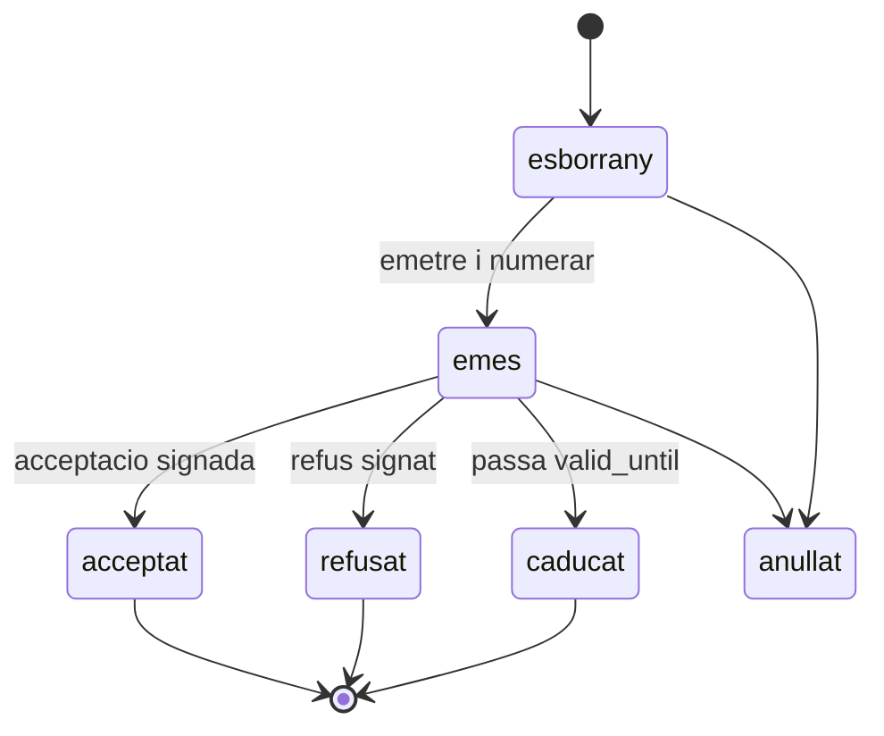

# 02 — Model de domini

> **Pla:** [`README.md`](./README.md) · requisits legals [`01-legal-requirements.md`](./01-legal-requirements.md)

## Punt de partida real

El que **ja existeix** al codi i sobre el qual es construeix:

| Element | Ubicació | Nota |
|---------|----------|------|
| `data.catalog_items` / `api.catalog_items` | [`20260503000006_catalog_and_project_lines.sql`](../../../supabase/migrations/20260503000006_catalog_and_project_lines.sql) | `kind`, `unit` (text lliure), `unit_price`, `tax_rate`, `currency`; **sense cost ni marge** |
| `data.project_lines` / `api.project_lines` | mateixa migració | `quantity`, `unit_price`, `discount_pct`, `tax_rate`; `subtotal` i `total_with_tax` calculats a la vista |
| RPCs de línia | mateixa migració | `upsert_project_line`, `delete_project_line` |
| Seed «Desplaçament» | [`20260503000008_sector_profiles.sql`](../../../supabase/migrations/20260503000008_sector_profiles.sql) | `kind = product`, `unit = 'km'`, 0,35 |
| `data.work_logs` | [`20260506000005_work_logs.sql`](../../../supabase/migrations/20260506000005_work_logs.sql) | `duration_minutes` calculat a `api.work_logs` |
| `data.project_materials` | mateixa migració | `unit_price_cents` nul·lable i ambigu; `catalog_item_id` **sense FK**; la UI només desa nom, quantitat i unitat |
| `data.project_expenses` | mateixa migració | `amount_cents`, `category`, `receipt_document_id`; **sense `is_billable` ni `paid_by`** |
| Butlletí (CIR) | [`20261159000025_customer_intervention_reports_cpa1.sql`](../../../supabase/migrations/20261159000025_customer_intervention_reports_cpa1.sql) | Patró draft mutable → versió immutable; projecció client sense costos |
| Plantilles de document | [`20260522000001_dms_templates_signing_core.sql`](../../../supabase/migrations/20260522000001_dms_templates_signing_core.sql) | `variables_schema`; motor DOCX/HTML/PDF |
| Cost laboral | [`20261101000001_ec_wfm_p2_baseline_balance_cost.sql`](../../../supabase/migrations/20261101000001_ec_wfm_p2_baseline_balance_cost.sql) | `resolve_contract_planning_cost`, `planning_cost_snapshots` |

**Riscos heretats que cal tenir presents:**

1. L'RLS de `data.project_lines` permet **a qualsevol membre del tenant** llegir, crear, modificar i esborrar línies. Afegir-hi costos exposaria marges.
2. `quantity`, `unit_price`, `discount_pct` i `tax_rate` **no tenen CHECK**; la validació és només al client amb Zod.
3. Les vistes de materials i despeses són escrivibles directament, sense validació de coherència.
4. No hi ha cap test SQL de línies ni de documents comercials sota `supabase/tests`.

## Capa 1 — Imports de l'OS

`data.project_lines` continua sent la composició editable de la feina. Canvis:

- CHECK de rang a `quantity`, `unit_price`, `discount_pct` (0–100) i `tax_rate`;
- `source_quote_line_id` per saber d'on ve la línia;
- tota mutació comercial passa per RPC amb permís i `client_op_id`;
- el preu, el descompte i l'impost només els pot canviar qui tingui permís comercial, comprovat al servidor.

No es duplica en cap taula nova.

## Capa 2 — Documents comercials

Quatre taules. **No hi ha taula de versions**: l'ampliació legal és un document fill, i les correccions prèvies a l'acceptació substitueixen el document anterior.

### `data.commercial_documents`

| Camp | Detall |
|------|--------|
| `tenant_id` | Obligatori |
| `doc_type` | `quote` · `quote_amendment` · `delivery_note` |
| `doc_number` | Assignat **només en emetre** |
| `client_id` | **Obligatori**; el document existeix encara que no hi hagi OS |
| `project_id`, `contact_site_id` | Opcionals; si hi ha OS, se'n deriven i s'ha de validar que el site pertany al client |
| `parent_document_id` | Ampliació → pressupost |
| `supersedes_id` | Correcció d'un document anterior |
| `status` | Veure màquines d'estat |
| Snapshots | Identitat fiscal del venedor i del client, adreça de servei, condicions, llengua |
| Imports | `currency` fix a `EUR`, `subtotal`, desglossament d'impostos, `total` |
| `valid_until` | Per defecte 30 dies des de l'emissió |
| `show_prices` | Només per a albarans |
| `content_hash` | Per lligar l'acceptació al contingut exacte |

Mutable només mentre és esborrany. En emetre's: s'assigna número, es congelen els snapshots i queda immutable.

### `data.commercial_document_lines`

Línies snapshot de la versió emesa: `name`, `description`, `unit`, `quantity`, `unit_price`, `discount_pct`, `tax_rate`, imports calculats i arrodonits, `position`, i `source_project_line_id` per traçabilitat.

### `data.commercial_document_events`

Append-only. Cobreix el que d'altres models parteixen en dues taules:

`issued` · `sent` · `viewed` · `accepted` · `rejected` · `signed` · `superseded` · `cancelled`

Cada esdeveniment desa qui, quan, canal, dispositiu, signatura si n'hi ha i `content_hash` acceptat.

### `data.document_number_counters`

Comptador per `tenant_id`, `doc_type` i any. Assignació atòmica amb `INSERT … ON CONFLICT DO UPDATE … RETURNING` dins de la transacció d'emissió. Format `P-2026-0001`, `AMP-2026-0001`, `A-2026-0001`.

## Capa 3 — Renúncia i cobrament

### `data.quote_waivers`

Renúncia signada al pressupost previ: `project_id`, `client_id`, text legal aplicat, descripció de la feina autoritzada, signatura, data, dispositiu. Sense descripció de feina, no es pot desar.

### `data.payments`

`document_id`, `amount_cents`, `method` (efectiu, targeta, transferència, Bizum, enllaç), `reference`, `collected_by`, `occurred_at`, `client_op_id`. Els parcials i les bestretes surten de sumar registres; l'albarà **no té cap camp `paid`**.

`external_invoice_ref` és un camp de l'albarà fins que calgui una taula pròpia.

## Import autoritzat

Es materialitza a l'OS i és el nucli del sistema:

```
authorized_total = total del pressupost acceptat
                 + total de les ampliacions acceptades
```

Regles:

- es recalcula **dins de la mateixa transacció** que accepta, refusa o anul·la un document;
- si no hi ha pressupost però hi ha renúncia signada, el sostre és el que descriu l'ordre i el bloqueig passa a avís;
- en emetre un albarà valorat es compara el total amb `authorized_total`;
- si el supera i `is_consumer = true`, **l'emissió es bloqueja** i s'ofereix crear l'ampliació;
- si `is_consumer = false`, s'avisa i es demana motiu.

## Màquines d'estat



Notes:

- **`sent` no és un estat**: és un esdeveniment; un enviament fallit no crea cap document nou.
- Un document **acceptat no es pot anul·lar** silenciosament; cal un document de correcció que el substitueixi.
- L'albarà afegeix `signat` després d'`emes`; el cobrament **no** és un estat de l'albarà.
- `caducat` es deriva de `valid_until` i de l'absència d'acceptació.

## Serveis habituals

```
data.pricing_templates       -- tenant, nom, descripcio, categoria, is_active, is_default
data.pricing_template_items  -- catalog_item_id, quantitat per defecte, prompt_quantity,
                             -- etiqueta, descompte inicial, posicio
```

Sense versionat al Tall 1, però amb **aplicació idempotent**: `apply_pricing_template(p_project_id, p_template_id, p_quantities jsonb, p_client_op_id)` resol PVP vigent i insereix les línies una sola vegada, encara que hi hagi doble toc o reintent.

El versionat de plantilles arriba només si es demostra necessari.

## Seguretat

- Vistes `api.*` amb `security_invoker = true`.
- Escriptures **només per RPC** amb comprovació de permís; les vistes de documents no són escrivibles.
- Permís comercial diferenciat del permís de camp: canviar preu, descompte o impost no és el mateix que registrar hores.
- La projecció que veu el client no inclou res que no sigui del document.
- Cap camp de cost en aquestes taules; els costos van a projeccions privades al Tall 3.

## Idempotència

Obligatòria a: crear OS des de plantilla, aplicar servei habitual, emetre, enviar, acceptar, signar i cobrar. Es reutilitza el patró `client_op_id` ja emprat a `data.work_logs`.

## Arrodoniment i impostos

Càlcul per línia: net = `quantity × unit_price × (1 − discount_pct/100)`, arrodonit a dos decimals; després agregació per grup fiscal i suma de bases i quotes. Es desa la categoria fiscal, no només el percentatge, per poder representar exempcions.

## Tests

Cal cobertura SQL específica, avui inexistent:

- numeració concurrent sense duplicats;
- immutabilitat després d'emetre;
- recàlcul de `authorized_total`;
- bloqueig d'albarà per sobre de l'autoritzat amb `is_consumer = true`;
- idempotència d'aplicació de plantilla i de cobrament;
- aïllament entre tenants.
