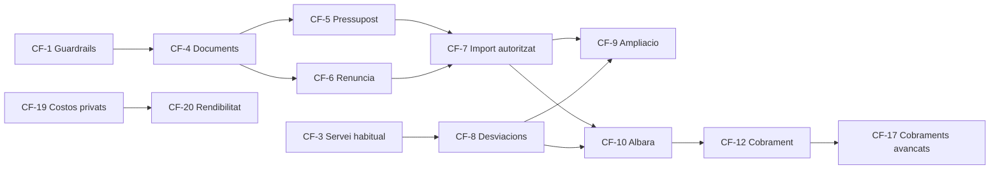

# 04 — Fases i backlog d'epics

> **Pla:** [`README.md`](./README.md) · estat real a [`STATUS.md`](./STATUS.md) · ordre de treball a [`EXECUTION.md`](./EXECUTION.md)

Tres talls. Cada tall és utilitzable per si sol; no es comença el següent sense passar el gate de [`05-acceptance-and-gates.md`](./05-acceptance-and-gates.md).

---

## Tall 1 — Espina legal i de camp

Objectiu: un autònom cobra correctament una feina, amb o sense pressupost, i mai per sobre del que el client ha autoritzat.

| Epic | Nom | Contingut | Depèn de |
|------|-----|-----------|----------|
| **CF-0** | Vocabulari i unitats | `km` a les unitats i preservació d'unitats no llistades; chips de quantitat; `draft` → «Esborrany»; tab «Imports» | — |
| **CF-1** | Guardrails de dades | CHECK de quantitat, preu, descompte i IVA; permís comercial server-side per a preu, descompte i impost; `client_op_id` a les operacions sensibles | — |
| **CF-2** | Línies al mòbil | Targetes en comptes de taula; acció principal enganxada al peu; creació ràpida d'OS amb valors per defecte | CF-0 |
| **CF-3** | Servei habitual | `pricing_templates` i `pricing_template_items`; RPC d'aplicació idempotent; selector a la creació d'OS; seed «Visita estàndard» | CF-1 |
| **CF-4** | Documents comercials base | Quatre taules, numeració atòmica, emissió immutable, registre d'esdeveniments, vistes i RPCs | CF-1 |
| **CF-5** | Pressupost | Esborrany, emissió, contingut legal desglossat, validesa 30 dies, mode client, acceptació i refús signats amb el mateix pes visual | CF-4 |
| **CF-6** | Renúncia al pressupost | `quote_waivers` amb text legal, descripció de la feina i signatura | CF-4 |
| **CF-7** | Import autoritzat | Materialització i recàlcul transaccional; `is_consumer` al contacte; bloqueig o avís segons el cas | CF-5, CF-6 |
| **CF-8** | Revisió de desviacions | Al tancament, només diferències d'hores, km, materials i extres; captura explícita de km | CF-3 |
| **CF-9** | Ampliació de pressupost | Creació en dos tocs des del tancament, import, motiu i signatura al moment; data real d'acceptació | CF-7, CF-8 |
| **CF-10** | Albarà | Generació des de les línies reconciliades, `show_prices`, signatura, bloqueig per sobre de l'autoritzat | CF-7, CF-8 |
| **CF-11** | Compartició i PDF simple | WhatsApp, compartició nativa, correu, enllaç i QR; PDF propi sense motor de plantilles | CF-5, CF-10 |
| **CF-12** | Cobrament simple | `payments` amb import, mètode, referència i idempotència; comprovant | CF-10 |
| **CF-23** | Servei habitual + checklist | `pricing_template_checklists`; `apply_pricing_template` aplica també checklists; selector al formulari de pack; Visita estàndard en crear OS | CF-3 |

**No es fa al Tall 1:** offline complet, versionat de plantilles, dues taules de pagaments, cap camp de cost, KPIs, TPV integrat, motor de plantilles de document.

---

## Tall 2 — Equip petit, historial i diners

| Epic | Nom | Contingut | Depèn de |
|------|-----|-----------|----------|
| **CF-13** | Separació tècnic i oficina | El tècnic proposa extres, l'oficina controla preus; aprovació de desviacions per llindar configurable | Tall 1 |
| **CF-14** | Historial al client | Tab «Pressupostos» amb resum a la vista principal i «Veure tots»; pressupostos, ampliacions i albarans amb estat i acció pendent | CF-4 |
| **CF-15** | Secció Pressupostos | Ruta `/quotes` al sidebar; cerca per client, número, referència, OS i text de línia; filtres d'estat, tipus, dates, caducitat i import; crear, duplicar, reenviar i registrar resposta | CF-4 |
| **CF-16** | Offline d'actuals | Esborranys locals d'hores, km, materials i intent de tancament; sincronització idempotent amb estat honest. L'albarà no s'emet al reconnectar: continua sent una acció manual online | CF-8 |
| **CF-17** | Cobraments avançats | Parcials i bestretes, Stripe amb webhook idempotent, referència de factura externa cap a Holded o Quipu | CF-12 |
| **CF-18** | Render amb plantilles | `document_template_id` al document comercial; PDF de marca via el motor de `/documents`; desat al DMS; encaminament opcional a signatura formal | CF-11 |

---

## Tall 3 — Costos i verticals exigents

| Epic | Nom | Contingut | Depèn de |
|------|-----|-----------|----------|
| **CF-19** | Costos privats | `catalog_item_financials` i `project_line_financials` amb permís financer; marge objectiu com a suggeriment de PVP; mai columnes a les vistes obertes | Tall 2 |
| **CF-20** | Rendibilitat | Resultat brut estimat i real; cost laboral congelat per work log; separació de cost i preu a materials; ampliació del model de despeses | CF-19 |
| **CF-21** | Manteniment contractual | Acord amb vigència, actius coberts, serveis inclosos, SLA, revisió de preus, extres autoritzables i regla de facturació | Tall 2 |
| **CF-22** | Obra i instal·lació | Opcions i variants, bestretes, fites, ordres de canvi signades, entregues parcials i seguiment contractat, executat i facturat | CF-21 |

L'ampliació construïda a CF-9 és la base natural de l'ordre de canvi de CF-22.

---

## Dependències crítiques

**CF-10 no es pot lliurar sense CF-7 i CF-8.** Emetre un albarà sense import autoritzat i sense reconciliació és precisament l'error que aquest pla evita.

## Fora d'abast del pla sencer

- Factura fiscal pròpia; la facturació viu a l'aplicació externa.
- Multimoneda.
- Gestió d'estoc i preus de proveïdor.
- Preus al part de treball.
- KPIs de conversió comercial fins que revisions, anul·lacions i cohorts estiguin definides.
- Comparació d'ofertes competidores i CRM de vendes.
