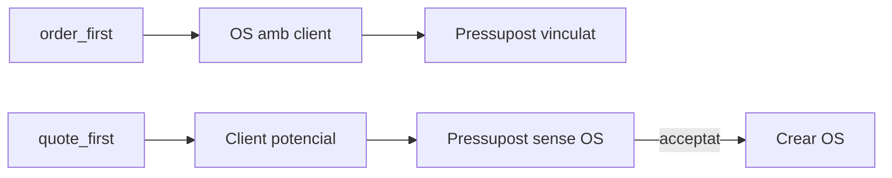

# 06 — Modes d’entrada comercial (`order_first` / `quote_first`)

> **Estat:** diferit (no implementar amb el cicle UX de navegació contacte/llistats).  
> **Pla pare:** [`README.md`](./README.md) · model [`02-domain-model.md`](./02-domain-model.md) · UX camp [`03-ux-contract.md`](./03-ux-contract.md)  
> **Context UX diferit des de:** pla Cursor «UX nav commercial flows» (fases 1–2 = nav/paritat; aquest document = epic del 2n flux).

## Per què existeix aquest document

El Tall 1 del flux comercial és **OS-cèntric** (crear ordre → imports → emetre pressupost). Això encaixa amb field-service urgent, renúncia i sostre `authorized_total` sobre l’OS.

Molts usuaris esperen el flux comercial clàssic: **client potencial → pressupost → (si s’accepta) ordre de servei**. El schema ja permet `commercial_documents.project_id` NULL, però el camí productiu (RPC + UI) encara exigeix OS.

**Decisió:** no implementar quote-first al mateix cicle que les millores d’UX de navegació. Documentar aquí l’epic perquè no es perdi i no es torni a subestimar.

## Decisió de producte

| Opció | Verdict |
|-------|---------|
| Només copy OS→pressupost | Insuficient |
| Migrar tot a quote→OS | Trenca urgència / renúncia / camp |
| **B smart** | Dos fluxos, **un mode actiu per tenant** |

- Setting: `tenants.settings.commercial.sales_entry_mode` = `order_first` | `quote_first`.
- **No** introduir `both` com a mode de primera classe (duplica CTAs). Escape hatch secundari si cal, no tercer mode.
- Evitar el nom `entry_mode` (ja existeix a `work_logs` / estacions).
- Default suggerit: arquetip `field_service` → `order_first`; altres verticals comercials/obra → a decidir.

## Estat actual del codi (gap)

| Peça | Realitat |
|------|----------|
| Schema `commercial_documents.project_id` | Nullable (`ON DELETE SET NULL`) |
| Domini documentat | `client_id` obligatori; `project_id` opcional ([`02-domain-model.md`](./02-domain-model.md)) |
| `api.issue_commercial_document` | **Exigeix** `p_project_id`; copia línies des de `project_lines` |
| Accept / reject | Toleren `project_id IS NULL`; **no** creen OS ni materialitzen imports |
| `authorized_total` | Viu a `data.projects`; orphan acceptat no fixa sostre |
| Amendments / albarà / renúncia / office gate overage | Assumeixen OS |
| UI (`CreateQuoteDialog`, etc.) | Sempre tria una OS |
| Seed Riera | `P-2026-9001` / `9002` amb `project_id NULL` via INSERT directe — fixtures, **no** flux productitzat ([`supabase/seeds/riera_commercial_agreements.sql`](../../../supabase/seeds/riera_commercial_agreements.sql)) |

## Abast de l’epic (quan es reobri)

1. Setting `sales_entry_mode` + UI de settings + default per arquetip.
2. Emissió (o draft→issue) amb `client_id` (+ site opcional), sense `p_project_id`.
3. Composer de línies al document (no només snapshot de `project_lines`).
4. RPC idempotent **Crear OS des de pressupost acceptat**: projecte + vincle + materialitzar línies (`source_quote_line_id`) + `recompute_project_authorized_total`.
5. Amendments / albarà / renúncia: continuen exigint OS fins a un disseny explícit en contra.
6. Corregir reissue / supersedes / `active_quote_already_exists` perquè no assumeixin `project_id` no-null (comparacions SQL amb NULL).
7. CTAs i ordre de tabs al contacte segons mode (`quote_first` → Pressupostos abans d’Ordres).
8. Reobertura explícita al pla commercial-flow (happy path Tall 1 OS-cèntric).

**Fora d’abast d’aquest epic:** canviar `formalization_mode`, migrar Riera a quote-first, reescriure el workflow d’urgència/renúncia.

## Seeds i tenants de prova (obligatori)

| Tenant | Mode | Rol |
|--------|------|-----|
| **Riera** (`riera-instal`, `10000000-…0004`) | `order_first` | Referència field-service; **no** canviar el mode |
| **2n tenant** field_service / instal·lador (preferible **nou**) | `quote_first` | Lead → pressupost sense OS → acceptar → Crear OS |

- **Volt** (`…0003`): candidat arriscat (Avui/ordres); només si es re-seedeja amb compte.
- BurgerVista / hospitality: vertical incorrecte per UAT d’aquest flux.
- Proves SQL + UAT humana en **els dos** tenants abans de soft-launch.

### Checklist UAT mínima

- [ ] Crear / emetre / acceptar / rebutjar en `order_first` (Riera)
- [ ] Crear / emetre / acceptar / rebutjar en `quote_first` (2n tenant)
- [ ] Crear OS des de pressupost acceptat sense OS
- [ ] `authorized_total` i línies correctes després de materialitzar
- [ ] Amendment / albarà només amb OS
- [ ] Navegació contacte ↔ ordre ↔ DMS (`returnTo`) en ambdós modes
- [ ] Llistats scoped (contacte) vs globals

## Relació amb altres treballs

- **Cicle UX nav (implementar abans / en paral·lel sense aquest epic):** client al llistat d’ordres, tabs contacte, `returnTo`, paritat llistats global/contacte. No depèn de `sales_entry_mode`.
- **Acords / formalització:** independent (`formalization_mode`); no barrejar amb `sales_entry_mode`.

## Criteri per reobrir

Reobrir quan les fases UX de navegació estiguin estables i hi hagi capacitat per (a) RPC + composer sense OS, (b) seed del 2n tenant, (c) matriu de proves doble.
