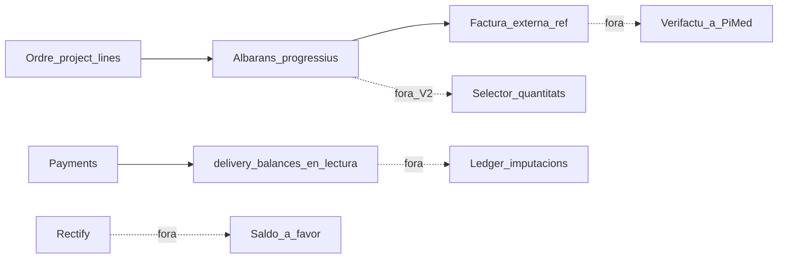

# 07b — Fora d’abast del hub d’Albarans (CF-26)

> Spec operativa: [`07-collections-and-ar-hub.md`](./07-collections-and-ar-hub.md) · pla: [`README.md`](./README.md)  
> **Evolució:** el pla [`09-sales-comercial/`](./09-sales-comercial/README.md) (**CF-27**) **entra** part del que aquí era fora (ledger d’allocations, permisos `invoices.*`, export fitxer, factura interna no fiscal). Aquest 07b describe el tall CF-26; la columna «entra a CF-27» evita contradiccions.

CF-26 tracta l’**albarà** com a centre de cobrament i registra la **factura externa** (número, data, PDF d’un altre programa). Aquest document detalla el que deliberadament **no** s’ha construït en aquest tall.

## 1. Factura fiscal a PiMed (Verifactu, rectificatives fiscals)

**Què és.** A Espanya la factura amb efectes fiscals ha de complir normativa (NIF, IVA, numeració, i cada vegada més **Verifactu** / sistemes de facturació verificable). Una **factura rectificativa** és el document legal que corregeix una factura ja emesa; no és el mateix que «rectificar un albarà» a PiMed.

**Què fa PiMed ara.** No emet la factura. Guarda una referència externa (`external_invoices` + `external_invoice_ref` a l’albarà): número, data, total i, si cal, un PDF. El programa de facturació (Holded, Quipu, A3, etc.) és la font fiscal.

**Per què fora.** Verifactu, numeració fiscal, rectificatives AEAT i homologació són un producte propi (risc legal + integració). CF-26 només enllaça el flux de camp amb «aquesta feina ja està a la factura F-…».

## 2. Triar línies o quantitats en emetre un albarà

**Què és.** Un modal on, en emetre, tries quines línies de l’OS hi van i amb quina quantitat (p. ex. 3 de 10 hores ara, la resta després).

**Què fa PiMed ara.** Emissió **progressiva automàtica**: el DN nou fotografia tot el pendent (`OS − ja albaranat actiu`). No hi ha selector. Per **baixar** quantitats després d’emetre, cal **rectificar** (patches a l’OS + DN substitut).

**Per què fora (V2).** El compositor afegeix UX, validacions i casos límit (línies parcials, zero, ordre d’emissió). CF-26 prioritzava saldos, FIFO, factura i rectify sense obrir un segon disseny d’emissió.

## 3. Ledger persistent d’imputacions

**Què és.** Una taula que desa «aquest pagament de 50 € s’imputa a aquest albarà» o «aquesta bestreta cobreix A-1 amb 30 €». Historial immutable d’assignacions.

**Què fa PiMed ara (CF-26).** Els cobraments són files a `payments` sobre un document. L’aplicació de bestretes i el pendent es **calculen en llegir** (`data.delivery_balances`, FIFO per `issued_at`). No hi ha llibre d’imputacions desat.

**Per què fora a CF-26.** Menys superfície al tall del hub.

**CF-27:** **entra** `payment_allocations` per al cobrament de factura (idempotència + auditoria). Les bestretes de pressupost poden seguir sent derivades; el ledger cobreix el repartiment factura→DN. Veure [`09…/01b`](./09-sales-comercial/01b-fase-payment-ledger.md).

## 4. Saldos a favor del client després d’una rectificació

**Què és.** Rectifiques un DN a la baixa i els diners ja cobrats **superen** el total nou. En lloc de fallar, el sistema crearia un **crèdit / saldo a favor** (usable en DN futurs o reemborsament).

**Què fa PiMed ara.** Si els cobraments heretats superen el total del substitut → `rectify_payments_exceed_total` i la transacció es desfà. Cal baixar menys, o gestionar el sobrant fora (manual / ERP).

**Per què fora.** Implica política de negoci (crèdit vs devolució), UI de crèdits i canvis al FIFO. Bloquejar és la regla segura per no inventar diners «a favor» sense producte.

## 5. Permís nou de facturació (V1: `isOffice` + tenant)

**Què és.** Un permís fi assignable per rol o membre, independent de «és oficina».

**Què fa PiMed ara (CF-26).** Gate **`isOffice`** + tenant. El camp pot cobrar DN **no** facturats i signar; no fa factures externes.

**Per què fora a CF-26.** Evitar matriu RBAC al tall del hub.

**CF-27:** **entra** `invoices.view/edit/manage` + `invoices.review` / `invoices.export`, asserts a RPC i preset Gestoria. Veure [`09…/02`](./09-sales-comercial/02-fase-security-routes.md).

## 6. Períodes d’acords (CF-25-b) i API Holded/Quipu

**CF-25-b — períodes al hub.** Els acords de manteniment (CF-21) ja tenen **períodes de facturació** (ledger/cron, `external_invoice_ref` al període). CF-25-b seria veure’ls i gestionar-los **dins el hub d’Albarans** (mateixa cua que DN i factures). Avui el hub és només albarans + factures externes d’entregues; els períodes viuen al mòdul d’acords.

**API Holded/Quipu.** Crear o sincronitzar factures i cobraments amb l’ERP via API (no només enganxar el número a mà). CF-17 ja va deixar Stripe i aquest connector com a diferits: CF-26 només registra la referència manual.

**Per què fora.** CF-25-b barreja dues cues (entrega vs quota periòdica). L’API ERP és un projecte d’integració a part del hub operatiu de camp.

**CF-27:** no porta l’API; sí **export ZIP canònic** + `commercial_document_external_refs` per a sincronització futura i gestoria. Adaptadors Sage/A3/DelSol només amb especificació + fixtures. Veure [`09…/05`](./09-sales-comercial/05-fase-accountant-exports.md).

## 7. Què canvia amb CF-27 (mapa ràpid)

| Tema CF-26 «fora» | CF-27 |
|-------------------|-------|
| Factura fiscal Verifactu | Segueix **fora** |
| Selector quantitats DN | Segueix **fora** (V2) |
| Ledger imputacions | **Entra** (`payment_allocations`) |
| Crèdit post-rectify | Segueix **fora** |
| Permís facturació | **Entra** (`invoices.*` + Gestoria) |
| API Holded/Quipu | Segueix **fora**; export fitxer **entra** |
| CF-25-b acords al hub | Segueix **fora** |

## Mapa: ara vs després

