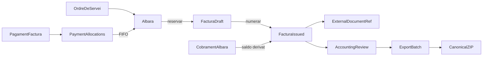

# 09 — Comercial (/sales): albarans, factures, gestoria i exportació

> **Estat:** ✅ tancat (2026-10-03) · **Creat:** 2026-10-02 · Log: [`IMPLEMENTATION-LOG.md`](./IMPLEMENTATION-LOG.md)  

> **Depèn de:** CF-26 tancat tècnicament ([`07`](../07-collections-and-ar-hub.md)) · fora d’abast actualitzat a [`07b`](../07b-albara-out-of-scope.md)  
> **Ordre global:** [`../EXECUTION.md`](../EXECUTION.md) · estat: [`../STATUS.md`](../STATUS.md)

## Per què aquest pla

CF-26 va deixar un hub d’albarans amb factura **externa** (`external_invoices`), UI confusa (badge «Pendent», dos Cobrar), rutes sense fitxa pròpia i un modal de factura fràgil. Aquest pla converteix el hub en una secció **Comercial** seriosa (`/sales`), amb factura interna (no Verifactu), sèries, exercicis, cobrament idempotent, taules escalables, fitxes amb ruta i un flux de **gestoria → revisió → exportació** per alimentar Sage/A3/DelSol/Holded sense prometre connectors sense especificació.

## Com seguir la implementació

1. Llegeix aquest `README` i les **decisions tancades**.
2. Treballa **una sola fase** cada vegada, en l’ordre de la taula.
3. Obre l’arxiu de la fase i marca els checkboxes a mesura que es tanquen.
4. No passis de fase sense el **DoD** (definition of done) de l’arxiu.
5. En tancar una fase: actualitza [`STATUS.md`](../STATUS.md), [`EXECUTION.md`](../EXECUTION.md) i el checklist d’aquest pla.
6. Si cal reobrir una decisió: documenta’l aquí **abans** de tocar codi.

| Ordre | Fase | Fitxer | Objectiu curt |
|------:|------|--------|---------------|
| 0 | Bugs modal | [`00-fase0-bugs-modal.md`](./00-fase0-bugs-modal.md) | PGRST202, toasts, reset, etiquetes |
| 1A | Nucli factura | [`01a-fase-invoice-core.md`](./01a-fase-invoice-core.md) | `doc_type=invoice`, links, migració |
| 1B | Ledger pagaments | [`01b-fase-payment-ledger.md`](./01b-fase-payment-ledger.md) | Pagament únic + allocations |
| 2 | Seguretat i rutes | [`02-fase-security-routes.md`](./02-fase-security-routes.md) | RBAC, Gestoria, `/sales` |
| 3 | Numeració i exercicis | [`03-fase-numbering-fiscal.md`](./03-fase-numbering-fiscal.md) | Sèries atòmiques, tancament any |
| 4 | Taules | [`04-fase-sales-tables.md`](./04-fase-sales-tables.md) | Keyset, filtres, KPI |
| 5 | Gestoria i export | [`05-fase-accountant-exports.md`](./05-fase-accountant-exports.md) | Revisió + lots ZIP |
| 6 | Fitxes i PDF | [`06-fase-detail-render.md`](./06-fase-detail-render.md) | Rutes detall, badges, render |
| 7 | Proves i docs | [`07-fase-tests-scale-docs.md`](./07-fase-tests-scale-docs.md) | Concurrència, escala, UAT |

Checklist mestre (vista ràpida): [`CHECKLIST.md`](./CHECKLIST.md)

## Decisions tancades (no reobrir sense documentar)

| ID | Decisió |
|----|---------|
| **S-D1** | Factura = `commercial_documents.doc_type = 'invoice'`. Estats persistits: `draft` \| `issued` \| `cancelled`. `partial`/`paid` són **derivats**. |
| **S-D2** | Draft **sense número**. `issue_invoice` numera i congela. |
| **S-D3** | Línies 1:1 des dels DN (`source_commercial_document_line_id`). Total = suma snapshots; sense total manual ni «diferència». |
| **S-D4** | `invoice_delivery_notes` amb `released_at` (historial). Índex parcial: un DN només en una factura **activa**. |
| **S-D5** | Font de facturació = link actiu. `external_invoice_ref` es depreca. Refs ERP a `commercial_document_external_refs`. |
| **S-D6** | Cobrament DN fins facturar; després només via factura. Bestretes/cobraments previs redueixen saldo (no es dupliquen files). |
| **S-D7** | Un pagament de factura = 1 fila `payments` + N `payment_allocations`. Idempotent per `client_op_id`. |
| **S-D8** | Migració **forward** després de `20261216000008`. No reescriure migracions ja aplicables. |
| **S-D9** | Permisos: `invoices.view/edit/manage` + nous `invoices.review` / `invoices.export`. `isOffice` = nav, no única protecció. |
| **S-D10** | Gestoria = membre del tenant amb preset; overrides per membre. Sense compte compartit multi-client. |
| **S-D11** | Export V1 = ZIP canònic versionat. Adaptadors Sage/A3/DelSol només amb especificació + fixtures. |
| **S-D12** | Verifactu i rectificatives fiscals **fora**. Cancel·lar factura interna ≠ factura rectificativa AEAT. |

## Flux de domini

## Fitxers calents (punt de partida)

| Àmbit | Rutes |
|-------|-------|
| UI hub | `apps/tenant-portal/src/features/commercial/components/DeliveryNotesList.tsx` |
| API client | `apps/tenant-portal/src/features/commercial/api/commercialFlowService.ts` |
| Nav / rutes | `App.tsx`, `navCatalog.ts`, `defaultNavLayout.ts`, `resolveNav.ts`, `navigationReturn.ts` |
| Permisos | `apps/tenant-portal/src/lib/permissions.ts` |
| SQL CF-26 | `supabase/migrations/20261216000001` … `000008` |
| Balances | `20261216000003_delivery_balances_fifo.sql` |
| Docs actuals | [`07`](../07-collections-and-ar-hub.md), [`07b`](../07b-albara-out-of-scope.md) |

## Fora d’abast (aquest pla)

Detall a [`07b`](../07b-albara-out-of-scope.md) (actualitzat):

- Verifactu / factura fiscal homologada / rectificatives AEAT
- Connector API Holded/Quipu (sí refs + export fitxer)
- Adaptadors Sage/A3/DelSol sense especificació validada
- Selector de quantitats en emetre DN (V2)
- Crèdit a favor post-rectify
- Venciments múltiples / remeses
- Factura directa sense albarà
- CF-25-b períodes d’acord al hub

## Criteri d’èxit global

Un tenant pot: emetre albarans → facturar-los a PiMed → cobrar sense doble cobrament → convidar la gestoria → revisar → exportar un ZIP reproduïble → importar-lo al seu programa. Les rutes `/sales/*` semblen un programa de gestió (taules, fitxes, estats clars). Cap RPC d’escriptura es pot saltar amb només UI.
