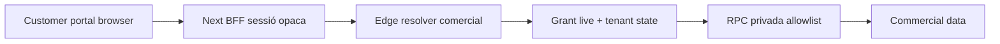

# Fase 6 — Customer portal comercial: lectura i transparència

> **Milestone portal:** CP-Da  
> **Prerequisits:** fase 2; CP-C operatiu  
> **Mode:** lectura; decidir al portal arriba a fase 7

## Objectiu

Quan el tenant ho activa, el client consulta pressupostos/acords, albarans i factures dins `apps/customer-portal`, amb traçabilitat del que s'ha acceptat, entregat, facturat i pagat.

## 6.1 Activació

Ampliar `data.customer_portal_tenant_state`:

```text
commercial_quotes_agreements_enabled boolean NOT NULL DEFAULT false
commercial_delivery_notes_enabled boolean NOT NULL DEFAULT false
commercial_invoices_enabled boolean NOT NULL DEFAULT false
```

Regles:

- off per defecte per tenants existents;
- només disponibles si entitlement mode = `portal`;
- `share_only` pot usar `/sign` però no catàleg comercial;
- RPC de settings exigeix `settings.manage`;
- kill-switch global del portal mana sobre els subtoggles;
- toggles només controlen exposició: no alteren documents ni requests.

UI a `CustomerPortalSettingsPage.tsx`:

- secció «Documents comercials»;
- tres switches amb descripció de dades exposades;
- confirmació explícita en activar factures;
- «Veure com el client» scoped a compte.

## 6.2 Arquitectura d'accés



Contracte:

- browser no rep JWT Supabase per consultar PostgREST;
- BFF envia `X-Customer-Portal-Bff-Secret` i sessió opaca;
- Edge resol tenant, compte, principal, entitlement i toggles;
- RPC privada rep ids resolts, no ids controlats lliurement pel browser;
- Next.js no conté `service_role`;
- log d'accés amb request id server-side.

No reutilitzar directament `api.list_sales_*`: depenen de tenant intern i projecten dades no allowlistades.

## 6.3 Superfície RPC/Edge

Edge proposada:

```text
resolve-customer-portal-commercial
```

Accions:

```text
list_summary
list_documents(kind, cursor, limit)
get_quote_or_agreement(id)
get_delivery_note(id)
get_invoice(id)
```

RPCs `data.*` service-only, amb `SET search_path=''`:

- `list_customer_portal_commercial_summary`;
- `list_customer_portal_quotes_agreements`;
- `list_customer_portal_delivery_notes`;
- `list_customer_portal_invoices`;
- `get_customer_portal_quote_agreement`;
- `get_customer_portal_delivery_note`;
- `get_customer_portal_invoice`.

Totes reben `tenant_id` i `client_account_contact_id` ja resolts. Límit màxim 50. Cursor `(sort_date, id)`. Sense OFFSET.

## 6.4 Allowlist per mòdul

### Pressupostos i acords

Visible:

- quote/amendment no draft: número, data, validesa, status, totals, moneda;
- snapshot públic i PDF immutable;
- request/outcome resumit;
- acord: títol/kind, estat, vigència, versió pending/signed/declined i PDF;
- relació quote origen ↔ acord;
- versions firmades històriques.

No visible:

- `created_by`, notes internes, errors de signing, templates interns;
- quote d'un altre compte encara que comparteixi projecte per error;
- agreement draft sense enviament.

### Albarans

Visible:

- número/data/projecte públic;
- descripció/línies del snapshot;
- signed/disputed/cancelled;
- signant/data/justificant;
- factura vinculada;
- imports només si `show_prices=true`.

Un albarà `rejected` es presenta «Disputat», no «Refusat» sense context.

### Factures

Visible:

- número/data/venciment/status;
- línies, subtotal, impostos, total;
- pagat agregat i pendent;
- pagaments assignats amb data/import/referència pública emmascarada;
- rectificatives/cancel·lació;
- albarans origen amb estat de conformitat;
- quote/acord origen quan la relació és inequívoca.

Prohibit:

- taules `payments`/`payment_allocations` crues;
- metadata bancària interna;
- marges/costos/exports de gestoria;
- factura draft.

## 6.5 Regles d'estat

| Tipus | Visible |
|------|---------|
| quote/amendment | issued, accepted, rejected, expired, cancelled |
| agreement version | pending_signature si enviada; signed; declined |
| delivery note | issued, signed, rejected/disputed, cancelled |
| invoice | issued, cancelled/rectified |

Documents anul·lats continuen visibles com anul·lats per transparència.

## 6.6 IA customer portal

Navegació:

- **Inici**: pendents (fase 7), documents recents i saldo factures;
- **Pressupostos i acords**;
- **Albarans**;
- **Factures**;
- **Butlletins** existent;
- **Accessos** existent.

No abocar quatre llistes senceres al dashboard.

Llistes:

- targetes mòbils;
- status + data + import;
- filtres simples d'estat/any;
- load more keyset;
- empty states per toggle.

Detall:

- breadcrumb;
- timeline documental;
- HTML snapshot;
- PDF descarregable;
- enllaços només a artefactes del mateix compte.

## 6.7 Staff preview

- reutilitzar sessió staff scoped a `client_account_contact_id`;
- mateix resolver i allowlist que client;
- banner «Vista de suport»;
- cap viewer universal;
- historial staff auditat.

## 6.8 Legal, retenció i projecció

Actualitzar:

- [`../../custom-portal/projection-and-retention.md`](../../custom-portal/projection-and-retention.md): camps per tipus, evidència, factures i pagaments agregats;
- [`../../custom-portal/legal-and-dpa.md`](../../custom-portal/legal-and-dpa.md): finalitat, categories, base/retenció, accessos i DSAR;
- política de footer/privacitat ca/es/en.

Retenció:

- portal no crea còpies mutables de documents;
- snapshots/versions comercials retenen segons domini comercial;
- cache BFF curta i scoped; no cache compartida per URL sense compte/principal;
- revocar grant talla accés immediat encara que document persisteixi.

## Índexs i escala

- documents: `(tenant_id, client_id, doc_type, issued_at DESC, id DESC)` o índexs parcials segons query real;
- requests: índex de CS-D54;
- agreements: `(tenant_id, client_id, status, created_at DESC, id DESC)`;
- invoice links/allocations: índexs FK necessaris per `invoice_id` i `delivery_note_id`;
- provar amb EXPLAIN abans d'afegir índex duplicat.

No retornar PDF binari a les llistes; generar handle de descàrrega només al detall.

## Proves

### SQL/Edge

- tenant A no veu B;
- compte A no veu compte B del mateix tenant;
- principal d'un compte no amplia scope;
- toggle off retorna buit/denied;
- mode share_only denega catàleg;
- drafts/costos/notes absents de payload;
- `show_prices=false`;
- pagament agregat = ledger intern;
- cursor estable amb mateixa data;
- revoked grant/kill-switch.

### UI

- ca/es/en;
- mòbil;
- anul·lats/disputats;
- factura parcial;
- staff preview fidel.

## DoD

- [x] Toggles opt-in i auditats. *(2026-10-07 — tall 1; rollback UI si falla el set)*
- [x] BFF/Edge/RPC sense accés directe. *(edge `resolve-customer-portal-commercial`; PDF via `/api/commercial/pdf`)*
- [x] Quatre superfícies comercials clares. *(nav només amb mòdul ON; `mode_effective=portal`)*
- [x] Factura traçable a albarans i pagaments. *(orígens + pagaments emmascarats; cobrament via `delivery_balances`)*
- [x] Cap dada interna filtrada. *(sense `pdf_*_path` / `pdf_document_id` / `source_quote_id` al browser; tests SQL)*
- [~] Keyset i EXPLAIN acceptables. *(índexs + keyset a list; EXPLAIN formal a F9)*
- [x] Legal/retenció actualitzats. *(projection 1.2 + legal-and-dpa 1.1)*
- [x] Review F6 fixes. *(migració `…00014`: show_prices a llista, acords només enviats/decidits, staff a `request_id`)*

## Rollback

Desactivar subtoggles/kill-switch amaga el mòdul sense tocar dades comercials. RPCs poden quedar desplegades sense EXECUTE públic.
