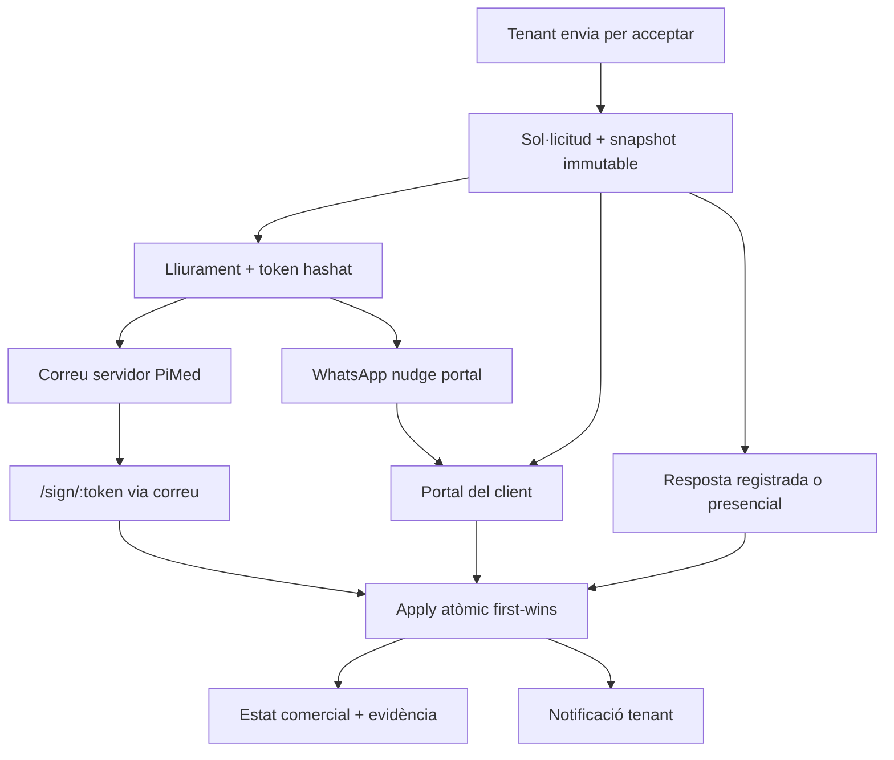

# CF-28 — Firma comercial i portal del client

> **Estat:** 🔄 F1–F5 core; F6–F8 ✅; CS-D58–D60 ✅; F9 UAT/escala · 2026-10-07  

> **Objectiu:** enviar, decidir i consultar pressupostos, acords, albarans i factures amb un únic flux comercial  
> **Ordre mestre:** [`../EXECUTION.md`](../EXECUTION.md) · estat [`../STATUS.md`](../STATUS.md)  
> **Depèn de:** CF-18 ✅ · CF-21 ✅ · CF-27 ✅ · Customer portal CP-C 🔄 · firma nativa ✅  
> **No depèn de:** CF-22 · CF-25-b/Verifactu · pagament online

## Resultat de producte

El tenant té una acció principal: **Enviar per acceptar**. El client rep un correu o un enllaç, revisa exactament el document emès i:

- accepta amb firma nativa o DocuSeal;
- refusa amb un botó, sense dibuixar una firma;
- pot respondre des del portal del client si el tenant li ha activat l'accés;
- veu després pressupostos/acords, albarans i factures amb el fil que explica què s'ha acceptat, entregat, facturat i pagat.

**Només entregar PDF** continua existint, però no crea una resposta pendent ni es presenta com una acceptació.

> **CS-D58–D60:** el tenant no veu ni rep `raw_token` / URL de firma de la contrapart. WhatsApp no enganxa `/sign/:token`.

## Per què és un epic nou

Avui existeixen peces útils, però no un producte coherent:

1. `CommercialDocumentShareSheet` comparteix PDF/HTML o obre `mailto:`; no crea una decisió remota.
2. `/sign/:token` és genèric, mostra el PDF en un `iframe` i el refús només cancel·la la sessió.
3. `commercial_signing_intents` aplica només sessions natives `signed`; no cobreix DocuSeal, portal ni refús.
4. La firma nativa comercial pot crear un segon document DMS.
5. `separate_agreement` exigeix avui una quote ja acceptada abans de preparar l'acord, cosa que obliga dues decisions.
6. El customer portal només exposa butlletins; no té cap projecció comercial.

CF-28 no és «polish de firma». Afegeix el domini durable que coordina totes les superfícies.

## Contracte V1

- Una **sol·licitud de decisió** representa una resposta comercial pendent.
- La sol·licitud fixa un **snapshot immutable** i la versió PDF exacta.
- Cada enviament és un **lliurament** separat amb token hashat, caducitat i revocació.
- Tots els camins acaben a un únic `apply_commercial_decision_request`.
- La primera decisió vàlida guanya; la resta veu el resultat ja aplicat.
- V1 té un sol signant responsable. Es pot reenviar a diversos canals, però no requereix múltiples firmes.
- Firma nativa no consumeix crèdits. DocuSeal consumeix crèdits i és opcional.
- Refusar mai obre `SignaturePad`.
- Cap correu, PDF o webhook extern corre dins la transacció d'apply.

## Formalització

| Mode | Què rep el client | Efecte de l'acceptació |
|------|-------------------|-------------------------|
| `signed_quote` | Pressupost o ampliació | Document `accepted`; recomputació d'autoritzat |
| `separate_agreement` | Versió de l'acord | Versió `signed`, acord actiu i quote origen `accepted` en la mateixa transacció |
| Albarà | Conformitat d'entrega | Albarà `signed` |

CF-28 **substitueix, quan s'implementi la fase 2**, el gate tècnic antic «quote accepted abans de preparar acord». No canvia CT-D7: acceptar una quote no crea automàticament un acord. L'oficina prepara explícitament l'acord; la firma de l'acord és la decisió efectiva del client.

## Fases i ordre obligatori

| Ordre | Fase | Fitxer | Tall desplegable |
|------:|------|--------|------------------|
| 0 | Decisions | [`00-decisions.md`](./00-decisions.md) | Contracte |
| 1 | Correccions honestes | [`01-fase-quick-fixes.md`](./01-fase-quick-fixes.md) | Sí |
| 2 | Domini de decisió | [`02-fase-decision-domain.md`](./02-fase-decision-domain.md) | Sí, darrere flag |
| 3 | Enviar per acceptar | [`03-fase-send-ux.md`](./03-fase-send-ux.md) | **Core usable** |
| 4 | Pàgina pública | [`04-fase-public-sign.md`](./04-fase-public-sign.md) | **Core client** |
| 5 | Un DMS + stamp | [`05-fase-one-dms.md`](./05-fase-one-dms.md) | Core tancat |
| 6 | Portal lectura | [`06-fase-portal-read.md`](./06-fase-portal-read.md) | CP-Da |
| 7 | Portal decisió | [`07-fase-portal-decide.md`](./07-fase-portal-decide.md) | CP-Db |
| 8 | DocuSeal comercial | [`08-fase-docuseal.md`](./08-fase-docuseal.md) | Opcional |
| 9 | Escala, UAT i rollout | [`09-fase-tests-scale-rollout.md`](./09-fase-tests-scale-rollout.md) | Tancament |

**No avançar 3–8 sense el domini de fase 2.** La fase 5 va després de la pàgina pública perquè el context de decisió defineix de forma inequívoca quin document/versionat és canònic.

## Talls de lliurament

### Tall A — Honest

Fase 1. Corregeix crèdits, textos, refresc i refús d'oficina. No afirma encara que hi hagi enviament comercial complet.

### Tall B — Core natiu

Fases 2–5. El tenant envia; el client accepta/refusa per enllaç; l'estat s'aplica sol; una sola fila DMS conserva la versió firmada.

### Tall C — Portal

Fases 6–7. Primer lectura transparent; després respostes des de sessió portal. Cada mòdul és opt-in i off per als tenants existents.

### Tall D — Proveïdor extern

Fase 8. DocuSeal usa el mateix domini i no introdueix una segona màquina d'estats comercial.

## Gates globals

1. **Integritat:** apply atòmic i test de carrera amb dos `client_op_id` diferents.
2. **Seguretat:** tokens només hashats; BFF sense `service_role`; cap lectura directa de taules comercials des del customer portal.
3. **Immutabilitat:** pàgina pública i portal mostren el snapshot/version id que s'accepta, no dades vives.
4. **Facturació:** albarà disputat no apareix ni és acceptable a cap RPC «Per facturar».
5. **Compatibilitat:** `commercial_signing_intents` i el hub antic no es retiren fins al final del strangler.
6. **Simplicitat:** emès = «Enviar per acceptar» com a CTA principal; DMS/centre de signatures sota «Més».
7. **Accessibilitat:** `/sign` usable a 320 px, teclat, focus i lector de pantalla; ca/es/en.
8. **Escala:** gates de [`09-fase-tests-scale-rollout.md`](./09-fase-tests-scale-rollout.md).

## Fitxers calents

### Tenant portal

- `apps/tenant-portal/src/features/commercial/components/CommercialDocumentShareSheet.tsx`
- `apps/tenant-portal/src/features/commercial/components/CommercialNativeSignDialog.tsx`
- `apps/tenant-portal/src/features/commercial/components/CommercialDocumentDetail.tsx`
- `apps/tenant-portal/src/features/commercial/components/QuoteDetailPage.tsx`
- `apps/tenant-portal/src/features/commercial/components/DeliveryNoteDetailPage.tsx`
- `apps/tenant-portal/src/features/commercial/components/AgreementsPage.tsx`
- `apps/tenant-portal/src/pages/PublicSignPage.tsx`
- `apps/tenant-portal/src/pages/settings/CustomerPortalSettingsPage.tsx`
- `apps/tenant-portal/src/features/documents/pages/DocumentDetailPage.tsx`
- `apps/tenant-portal/src/features/signing/components/DocumentOrchestrator.tsx`

### Supabase

- `supabase/migrations/20261173000001_commercial_templates_qt9_native_signing.sql`
- `supabase/migrations/20261178000001_commercial_templates_review_followup.sql`
- `supabase/migrations/20261195000001_commercial_agreement_lifecycle.sql`
- `supabase/migrations/20261199000001_commercial_agreement_signing_hardening.sql`
- `supabase/migrations/20261217000001_sales_invoice_core.sql`
- `supabase/migrations/20261217000005_sales_list_pages.sql`
- `supabase/functions/sign-document-router/index.ts`
- `supabase/functions/process-signing-token/index.ts`
- `supabase/functions/docuseal-webhook/index.ts`
- `supabase/functions/stamp-pdf-signatures/index.ts`

### Customer portal

- `apps/customer-portal/app/dashboard/page.tsx`
- `apps/customer-portal/lib/resolver.ts`
- `supabase/functions/resolve-customer-portal-grant/index.ts`
- [`../../custom-portal/projection-and-retention.md`](../../custom-portal/projection-and-retention.md)
- [`../../custom-portal/legal-and-dpa.md`](../../custom-portal/legal-and-dpa.md)

## Fora d'abast

- eIDAS qualificada i OTP/SMS.
- Multi-signatura seqüencial, paral·lela o mancomunada.
- Pagament online al portal.
- Recordatoris automàtics.
- Backfill massiu de documents DMS duplicats històrics.
- CF-22, Verifactu, CF-25-b i compositor comercial.

## Disciplina d'implementació

1. Llegir [`00-decisions.md`](./00-decisions.md) i la fase activa.
2. Implementar una fase per sessió; no barrejar portal i DocuSeal amb el core.
3. Crear migracions amb `supabase migration new`; no inventar el timestamp.
4. Fer canvis additius i feature-flagged fins al gate de retirada.
5. Marcar [`CHECKLIST.md`](./CHECKLIST.md), actualitzar STATUS/EXECUTION i afegir registre aquí.
6. Fixtures/UAT: números 9xxx; no tocar `A-2026-0002`; no deixar cap exercici fiscal tancat.

## Registre

| Data | Què | Següent |
|------|-----|---------|
| 2026-10-06 | Especificació CF-28 escrita i revisada per arquitectura/escala | Fase 1 quan es prioritzi |
| 2026-10-06 | F1–F3 core (decision domain, enviar/agreement, pendent, Més, email enqueue); F4 resolve+pàgina comercial | F4 stamp natiu + justificant + UAT |
| 2026-10-06 | F4 justificant + process stamp/decline; smoke 3 targets; adjunt PDF diferit | F4 a11y/i18n UAT; F5 un DMS |
| 2026-10-06 | F5: `commercial_decision_request_id` reutilitza DMS; Send/request order; sense `client_reject`; preview V2 | UAT V1/V2 + migració `000008`; F6 portal |
| 2026-10-07 | F5 fixes: resend snapshot, field-map abans sessions, refús sense stamp, revert agreement send | UAT V1/V2 + regressió DMS; F6 |
| 2026-10-07 | F6 tall 1: toggles + `list_customer_portal_quotes_agreements` + edge/BFF + settings + `/dashboard/quotes` | F6 DN/factures/detall + legal |
| 2026-10-07 | F6 tall 2: DN + invoices list RPCs (`00011`) + `/dashboard/delivery-notes` + `/dashboard/invoices` | F6 detall/PDF + staff + legal |
| 2026-10-07 | F6 tall 3: get detail RPCs (`00012`) + PDF signed URL a edge + pàgines detall | F6 staff preview + legal/retenció |
| 2026-10-07 | F6 tall 4: staff resolve (`00013`) + legal/retenció + SQL allowlist tests; CP-Da tancable | F7 portal decisió |
| 2026-10-07 | F6 review fixes (`00014`): mode portal, show_prices, ledger, PDF BFF, nav modules | F7 portal decisió |
| 2026-10-07 | F7 tall 1 (`00015`): `list/get_pending_decision` + dashboard Pendents; decide deferred | F7 accept/decline |
| 2026-10-07 | F7 tall 2 (`00016`): decline portal + receipt/PDF; shared actor fields | F7 accept nativa |
| 2026-10-07 | F7 tall 3 (`00017`): accept portal (prepare+stamp+via portal); SignaturePad | F8 DocuSeal / F9 UAT |
| 2026-10-07 | F7 review fixes (`00018`): mode_effective, apply client_op_id, strangler check, named_person, edge/UI honest | F8 / F9; sessió nativa on-demand diferida |
| 2026-10-07 | CS-D58–D60: strip tokens/URLs API+UI; WA portal nudge; email_logs redact; staff 403; F8 📦 | F8 Gate E o F9 UAT |
| 2026-10-07 | F8 tall 1 (`00005`): bind+continue RPC, router commercial `action=sign`, webhook→apply, `/sign` CTA | Selector / portal / reconcile |
| 2026-10-07 | F8 tall 2: Send dialog selector gated (`canSignWithDocuseal` + ack crèdit); path `action=sign` | Portal DocuSeal; canvi provider; reconcile |
| 2026-10-07 | F8 tall 3 (`00006`): portal continue grant-only + decline DocuSeal; BFF/CTA/poll; staff sense URL | Canvi provider; reconcile; F9 UAT |
| 2026-10-07 | F8 tall 4 (`00007`): prepare/switch provider + artifact status/reconcile cron + UI | F9 UAT Gate E residual |
| 2026-10-07 | F8 review fixes (`00008`) + admin Signing Ops | Auth reconcile; CS-D58 retry URL; bind/UI; F9 escala |
