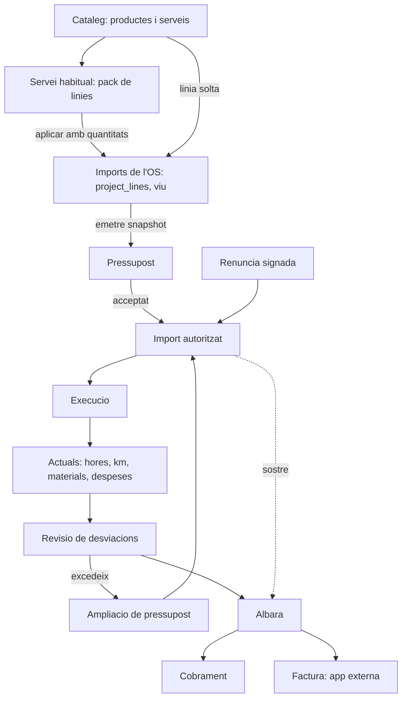

# Flux comercial de camp — Pressupost → Albarà → Cobrament

> **Estat:** pla documental creat, **cap fase implementada** — veure [`STATUS.md`](./STATUS.md) (2026-09-10)
> **Ordre d'implementació:** [`EXECUTION.md`](./EXECUTION.md)
> **Depèn de:** [Field Service](../field-service/README.md) (motor d'ordres), [Custom portal](../custom-portal/README.md) (patró de documents publicats), [Signing](../signing/plan-sistema-firma-propi.md) (evidència de signatura)
> **Objectiu:** que un autònom pugui anar de la comanda del client fins al cobrament sense paperassa d'oficina i **sense cobrar mai per sobre del que el client ha autoritzat**.

| Document | Contingut |
|----------|-----------|
| [01-legal-requirements.md](./01-legal-requirements.md) | Obligacions de consum: pressupost previ, renúncia, ampliació, contingut mínim, retenció |
| [02-domain-model.md](./02-domain-model.md) | Taules, estats, import autoritzat, numeració, RLS, idempotència |
| [03-ux-contract.md](./03-ux-contract.md) | Contracte mòbil: happy path, excepcions, vocabulari, chips |
| [04-phases-and-backlog.md](./04-phases-and-backlog.md) | Epics CF-0…CF-21 per talls, dependències, fora d'abast |
| [05-acceptance-and-gates.md](./05-acceptance-and-gates.md) | Criteris d'acceptació i gates entre talls |
| [EXECUTION.md](./EXECUTION.md) | Font de veritat de l'ordre real de treball |
| [STATUS.md](./STATUS.md) | Estat per epic; actualitzar durant la implementació |

---

## Diagnòstic

PiMed té el motor operatiu de camp (ordres, checklists, work logs, materials, butlletí) però **no té capa comercial**. Avui:

- «Pressupost» és només l'etiqueta de l'estat `draft` de l'OS i un tab de línies vives (`data.project_lines`);
- no existeix cap document amb estat que el client accepti o refusi;
- no es pot consultar l'històric comercial d'un client;
- no hi ha albarà, ni cobrament, ni límit del que es pot cobrar.

El resultat és que l'usuari no sap per a què serveix el tab «Pressupost», i que el sistema permetria cobrar imports que legalment no es poden reclamar.

## Idea central

L'eix del sistema no és «el que hem fet», sinó **l'import autoritzat pel client**.

```
import autoritzat = pressupost acceptat + ampliacions acceptades
```

Sense pressupost, l'autorització és la **renúncia signada** més la feina descrita a l'ordre. Tot el disseny surt d'aquí: si l'albarà supera l'import autoritzat i el client és consumidor, l'emissió es bloqueja i s'ofereix crear una ampliació signable al moment, des del mòbil.

## Capes



**Regla d'or:** els Imports són vius i interns; els documents són snapshots emesos, numerats i immutables; el pressupost acceptat mana sobre els Imports perquè fixa el sostre.

## Vocabulari

| Terme UI | Significat | No confondre amb |
|----------|------------|------------------|
| **Ordre de treball (OS)** | Expedient operatiu | Projecte genèric |
| **Imports** | Tab de l'OS que edita `project_lines` | Un document |
| **Servei habitual** | Pack de línies del catàleg | Plantilla de document de `/documents` |
| **Pressupost** | Oferta que el client accepta o refusa | Estat `draft` de l'OS |
| **Renúncia al pressupost** | Alternativa signada per a urgències | Absència de document |
| **Ampliació de pressupost** | Document fill per als sobrecostos | Versió del pressupost |
| **Import autoritzat** | Sostre del que es pot cobrar | Total de la feina feta |
| **Part de treball** | Què s'ha fet | Albarà |
| **Albarà** | Reconeixement del servei entregat, amb preus opcionals | Factura |
| **Cobrament** | Transacció | Camp booleà de l'albarà |
| **Factura** | Document fiscal extern | Albarà |

L'etiqueta de l'estat `draft` de l'OS passa de «Pressupost» a **«Esborrany»** per alliberar la paraula.

## Decisions tancades (no reobrir)

| ID | Decisió | Motiu |
|----|---------|-------|
| **CF-D1** | **No hi haurà taula `quotes` separada.** El pressupost fort és `commercial_documents` amb `doc_type = 'quote'`, ja al Tall 1 | L'obligació legal impedeix ajornar-lo; evita la migració futura |
| **CF-D2** | **No hi haurà taula de versions de document.** L'ampliació és un document fill (`parent_document_id`); les correccions prèvies a l'acceptació substitueixen (`supersedes_id`) | L'ampliació legal no és una versió; estalvia dues taules |
| **CF-D3** | Un sol registre d'esdeveniments (`commercial_document_events`) cobreix enviaments i acceptacions | `sent` és un esdeveniment, no un estat |
| **CF-D4** | Una sola taula `payments`; parcials i bestretes se sumen | Dues taules de pagaments són prematures |
| **CF-D5** | **El pressupost s'autora sempre a `/quotes`, mai a `/documents`** | `/documents` no entén línies, impostos ni import autoritzat |
| **CF-D6** | Les plantilles de `/documents` només **renderitzen** el PDF del document comercial (Tall 2) | Separa contingut d'artefacte |
| **CF-D7** | `catalog_items.unit_price` es manté com a **PVP**; el cost arriba en projeccions privades al Tall 3 | L'RLS actual de `project_lines` exposaria marges a tot el tenant |
| **CF-D8** | Només **EUR**, amb arrodoniment per línia i grup fiscal | No fingir multimoneda |
| **CF-D9** | Les proteccions de consum s'activen segons `is_consumer` del contacte | En B2B preval la llibertat contractual |
| **CF-D10** | `project_lines` continua sent la capa viva; no es duplica en una taula nova | Ja compleix la funció |

## Errors evitats deliberadament

Documentats perquè no es reintrodueixin:

1. **Cobrar el sobrecost per haver-lo executat.** Il·legal davant d'un consumidor sense ampliació acceptada.
2. **Emetre l'albarà abans de reconciliar actuals.** Genera documents polits però incorrectes.
3. **Confondre albarà amb cobrament.** L'albarà acredita l'entrega; el pagament és una transacció a part.
4. **Afegir costos a `data.project_lines` o `api.catalog_items`.** L'RLS actual permet que qualsevol membre del tenant els llegeixi.
5. **Fer del butlletí un document de preus.** El butlletí explica la intervenció; els imports viuen al pressupost i a l'albarà.
6. **Sobredimensionar el primer tall.** Una revisió prèvia proposava dotze taules, versionat de plantilles, offline complet i rendibilitat real; s'ha retallat a l'espina mínima.

## Arquetips

| Arquetip | Cobertura |
|----------|-----------|
| Autònom a domicili | Tall 1 complet |
| Empresa de 2–10 tècnics | Tall 1 + Tall 2 (separació tècnic/oficina) |
| Servei urgent | Tall 1, via renúncia signada i ampliació al moment |
| Manteniment recurrent | Tall 3 (acord amb vigència, serveis inclosos, SLA) |
| Instal·lador i obra | Tall 3 (opcions, bestretes, fites, ordres de canvi) |
