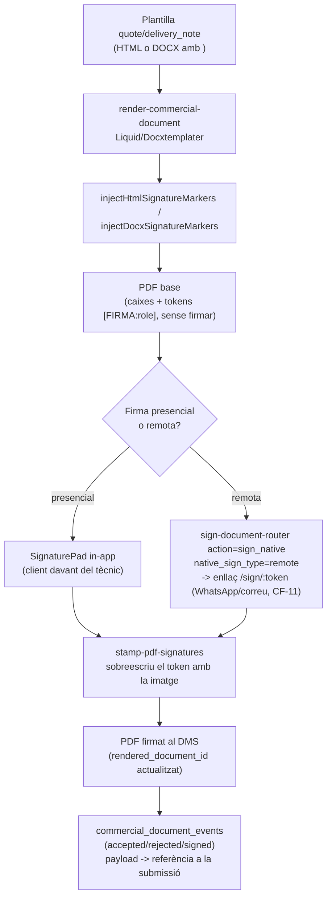

# 07 — Integració amb el motor de firma nativa del DMS

> **Pla:** [`README.md`](./README.md) · contracte [`01-context-and-legal-content.md`](./01-context-and-legal-content.md) · renderitzat [`02-rendering-architecture.md`](./02-rendering-architecture.md) · epics [`06-phases-and-backlog.md`](./06-phases-and-backlog.md) § Fase 3

## 1. Diagnòstic

`commercial-flow` va deixar la firma pendent explícitament: CF-5 (Pressupost) i CF-10 (Albarà) estan marcats ⚠️ "falta signatura dit" a [`commercial-flow/STATUS.md`](../commercial-flow/STATUS.md). Verificat al codi: `commercialFlowService.ts` desa `signature: { method: 'staff_ui' }` — és el propi treballador qui prem "Accepta/Refusa" en nom del client, **no una signatura capturada**. Per a un sistema el propòsit central del qual és "no cobrar mai per sobre del que el client ha autoritzat", això és el buit legal més seriós del pla comercial.

Mentrestant, el DMS ja té un motor de firma **complet i en ús** per a documents de RRHH/legal, que aquest pla pot reutilitzar sencer.

## 2. Inventari del que ja existeix (reutilitzar tal qual, no reinventar)

| Peça | On | Rol |
|------|-----|-----|
| `injectHtmlSignatureMarkers(html)` / `injectDocxSignatureMarkers(bytes)` | `supabase/functions/_shared/signing-field-map.ts` | Substitueix `<signature-field role="...">` (HTML) o `{{Camp;type=signature;role=...}}` (DOCX) per una caixa visible + token invisible `[FIRMA:role]` |
| `sign-document-router` | `supabase/functions/sign-document-router/index.ts` | Orquestra generació + firma; **ja suporta `source_type='document_existing'`**, el camí natural per a un document comercial ja renderitzat |
| `data.document_signing_sessions` | migració del sistema de firma pròpia | Sessió de firma nativa: `signer_role`, `signing_type` ('presential'\|'remote'), `signing_field_map`, `result_version_id`, `audit_version_id` |
| `SignaturePad.tsx` | `apps/tenant-portal/src/features/signing/components/` | Firma presencial in-app (canvas, captura com a imatge) |
| `PublicSignPage.tsx` (`/sign/:token`) | `apps/tenant-portal/src/pages/` | Firma remota sense autenticació, evidències IP/UA/geolocalització via `log_signing_evidence` |
| `stamp-pdf-signatures` | `supabase/functions/stamp-pdf-signatures/index.ts` | Estampa la imatge de signatura a la posició del token `[FIRMA:role]` dins el PDF |
| `data.signing_submissions` + "Submission Hub" | [`signing/pla_alineacio_firmes_docuseal_native.plan.md`](../signing/pla_alineacio_firmes_docuseal_native.plan.md) — **ja implementat** (verificat 2026-09-17: `signing_provider`/`native_group_id` a `20260615000008_native_signing_submission_hub.sql`, `native_evidence_mode='detached'` per defecte a `20260615000009_native_evidence_mode_and_field_map.sql`, overlay `detached`/`embedded`/`both` a `stamp-pdf-signatures/index.ts`, `DocumentIntegrityPanel.tsx`/`SigningCenterPage.tsx` ja consumeixen `signing_provider`) | Unifica firma nativa i DocuSeal (`signing_provider IN ('docuseal','native')`), Centre de signatures, hash d'integritat |

**Decisió QT-D9 (veure `README.md`): no es crea cap mecanisme de firma nou.** Tot flueix pel que ja existeix — **inclòs el Submission Hub, que ja no és una proposta pendent**.

## 3. Rols de signatura per document comercial

| `role` | Document | Ús |
|--------|----------|-----|
| `client_accept` | Pressupost / ampliació | El client accepta — mateixa mida que `client_reject` (requisit legal d'igualtat visual, `01-legal-requirements.md`) |
| `client_reject` | Pressupost / ampliació | El client refusa |
| `client_delivery` | Albarà | Conformitat de lliurament (no és acceptar/refusar) |
| `issuer` *(opcional, no obligatori a la validació)* | Qualsevol | Signatura del responsable/operari que emet, si el tenant la vol incloure |

Només `client_accept`/`client_reject` (pressupost) i `client_delivery` (albarà) són obligatoris per a `validate_commercial_template_locale` (veure `02-rendering-architecture.md` §2.4).

## 4. Flux end-to-end

## 5. Canvis concrets respecte al disseny original (docs 01/02)

1. **Plantilles (QT-8)**: les 6 plantilles seed de `03-template-repository-seed.md` inclouen els `<signature-field>`/tags DOCX descrits a `01-context-and-legal-content.md` §3/§4.
2. **Render (QT-9)**: `render-commercial-document/index.ts` crida `injectHtmlSignatureMarkers()` (o `injectDocxSignatureMarkers()` en fase 2 DOCX) just després de renderitzar amb Liquid/Docxtemplater i abans de Gotenberg — mateix punt on ja ho fa el flux DMS existent. El PDF que en resulta és el **PDF base sense firmar**.
3. **Flux d'acceptació/refús/lliurament**: el punt on avui es crida el guardat de `signature: {method:'staff_ui'}` a `commercialFlowService.ts` passa a cridar `sign-document-router` amb:
   - `action: 'sign_native'`
   - `source_type: 'document_existing'`
   - `source_document_version_id`: la versió del PDF base ja renderitzat (`rendered_document_id` de CF-18)
   - `native_sign_type: 'presential'` (el client signa al dispositiu del tècnic, `SignaturePad`) o `'remote'` (enllaç `/sign/:token`, reutilitzant els mateixos canals d'enviament que CF-11 ja té — WhatsApp, correu)
4. **`commercial_document_events` no desapareix** (decisió CF-D3 del pla comercial: és el llibre de negoci canònic). El seu `payload` passa a incloure una referència (`signing_submission_id` o `document_signing_sessions.id`/`signing_group_id`) a la submissió real, en lloc del JSON `staff_ui`.
5. **Submission Hub (QT-10)**: el pla `signing/pla_alineacio_firmes_docuseal_native.plan.md` **ja està implementat** (verificat al codi, 2026-09-17 — no cal tornar-ho a comprovar a cada sessió). Els documents comercials firmats s'han de registrar amb `signing_provider='native'` i `native_group_id` perquè apareguin al Centre de signatures amb el mateix badge/auditoria/verificació de hash que qualsevol altre document DMS. **QT-10 ja no està bloquejat per aquest pla extern.**

## 6. Què no canvia

- El bloqueig legal de `authorized_total` (CF-7) i la immutabilitat dels documents emesos (CF-1/CF-4) no es toquen: la firma és un esdeveniment posterior a l'emissió, no una condició d'emissió.
- El mode d'evidències per defecte (`detached`, PDF net + certificat d'auditoria separat) segueix la decisió ja presa al pla de signatures — no es reobre aquí.
- Cap canvi a `sign-document-router`, `stamp-pdf-signatures` ni `signing-field-map.ts`: s'usen tal com són.

## 7. Verificacions obligatòries abans d'implementar QT-9

Seguint el guardrail 7 de [`00-agent-instructions-and-guardrails.md`](./00-agent-instructions-and-guardrails.md):

- Confirmar que `sign-document-router` amb `source_type='document_existing'` sap localitzar els tokens `[FIRMA:role]` en un PDF que **no** prové d'un `document_template_locales` (és a dir, generat per `render-commercial-document`, no pel flux DMS habitual). Si la implementació actual assumeix que el "field map" ja es va persistir en generar-se des d'una plantilla del DMS, cal adaptar-ho o cridar `resolveAndPersistFieldMap` explícitament des de `render-commercial-document`.
- ~~Confirmar l'estat real de `signing/pla_alineacio_firmes_docuseal_native.plan.md`~~ **Fet (2026-09-17): implementat.** No cal reverificar-ho a QT-9/QT-10 llevat que hagi passat molt de temps des d'aquesta data.
