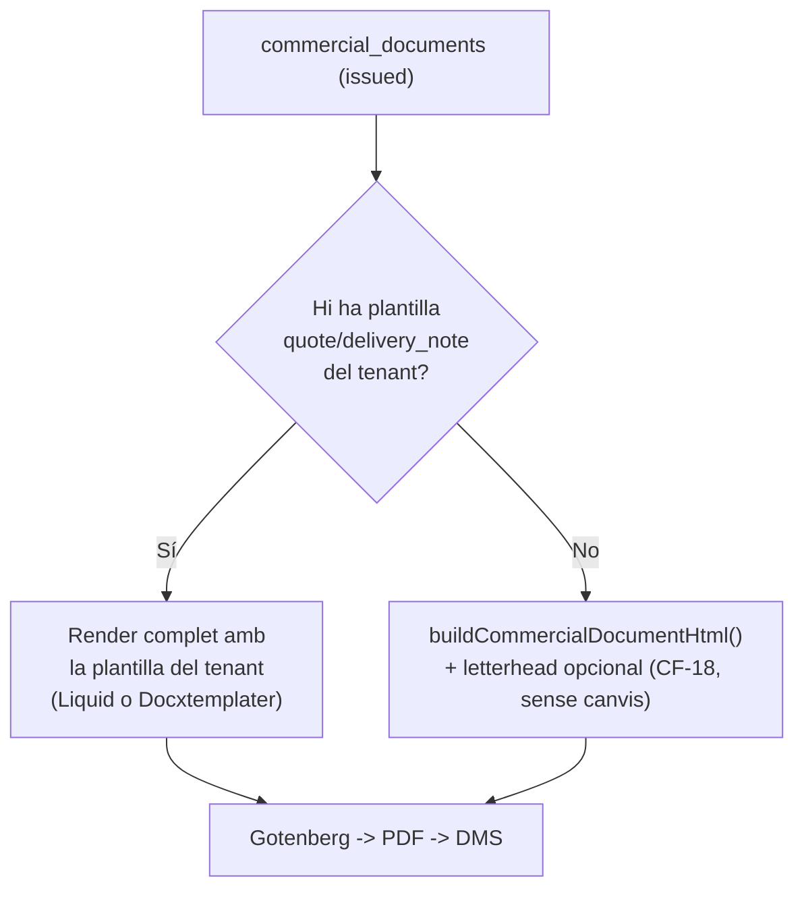

# Plantilles pròpies de pressupost/albarà (DOCX+HTML) + repositori sectorial

> **Estat:** pla documental creat, **cap fase implementada** — veure [`STATUS.md`](./STATUS.md) (2026-09-16)
> **Ordre d'implementació:** [`EXECUTION.md`](./EXECUTION.md)
> **Instruccions obligatòries per a agents IA:** [`00-agent-instructions-and-guardrails.md`](./00-agent-instructions-and-guardrails.md) — **llegir abans de tocar cap fitxer**
> **Depèn de:** [Commercial flow](../commercial-flow/README.md) (CF-18 Render amb plantilles, ja implementat), el motor de plantilles DMS existent (`data.document_templates` + `document_template_locales`), [Signing](../signing/plan-sistema-firma-propi.md) (per al forward-compat de contracte)
> **Objectiu:** que cada tenant pugui clonar i editar la seva pròpia plantilla de pressupost/albarà (DOCX o HTML), amb clàusules típiques ja redactades, mantenint el format actual com a **fallback garantit** quan el tenant no en té cap.

| Document | Contingut |
|----------|-----------|
| [`00-agent-instructions-and-guardrails.md`](./00-agent-instructions-and-guardrails.md) | **Lectura obligatòria abans d'implementar**: una fase per sessió, selecció de model per tasca, guardrails anti-al·lucinació |
| [`01-context-and-legal-content.md`](./01-context-and-legal-content.md) | Contracte de variables (HTML Liquid + DOCX Docxtemplater) i text de clàusules per arquetip |
| [`02-rendering-architecture.md`](./02-rendering-architecture.md) | Canvis de base de dades (resolver, columna, validació) i canvis a `render-commercial-document` |
| [`03-template-repository-seed.md`](./03-template-repository-seed.md) | Llista concreta de plantilles de plataforma a sembrar (HTML fase 1, DOCX fase 2) |
| [`04-frontend-ux.md`](./04-frontend-ux.md) | Canvis a `/documents/templates`, previsualització, selector de plantilla activa |
| [`05-contract-signing-forward-compat.md`](./05-contract-signing-forward-compat.md) | Disseny únicament: com encaixarà el futur contracte signat post-acceptació (i, de passada, la futura facturació fiscal) |
| [`06-phases-and-backlog.md`](./06-phases-and-backlog.md) | Epics QT-0…QT-10, depèndències, gates, fora d'abast |
| [`07-signing-integration.md`](./07-signing-integration.md) | Com pressupostos i albarans incorporen firma real reutilitzant el motor natiu del DMS (`sign-document-router`, `SignaturePad`, `/sign/:token`) |
| [`EXECUTION.md`](./EXECUTION.md) | Font de veritat de l'ordre real de treball |
| [`STATUS.md`](./STATUS.md) | Estat per epic; actualitzar durant la implementació |

---

## Diagnòstic

Avui, `commercial_documents` (pressupostos, ampliacions i albarans) es renderitzen amb un **cos fix escrit en codi** (`supabase/functions/_shared/commercial-document-html.ts`, `buildCommercialDocumentHtml`), idèntic per a tots els tenants. L'únic personalitzable és la **capçalera i el peu de marca** (logo, franges de text) via `document_templates` de categoria `commercial`, resolta per `data.resolve_commercial_document_template_id()` (CF-18).

Això significa que **cap tenant pot avui afegir les seves pròpies clàusules comercials, canviar l'ordre de les seccions o adaptar el disseny del document** — només el logo i un header/footer curt.

## Idea central

El format actual **no desapareix**: esdevé el **fallback formal**. Quan un tenant clona i activa una plantilla pròpia de categoria `quote` o `delivery_note` (HTML o, en fase 2, DOCX), aquesta plantilla és responsable de **tot** el document (capçalera, clàusules, taula de línies, totals, peu). Quan no n'hi ha cap, el sistema es comporta exactament com avui.

## Decisions tancades (no reobrir)

| ID | Decisió | Motiu |
|----|---------|-------|
| **QT-D1** | El format actual (`buildCommercialDocumentHtml`) **no es toca**; esdevé el fallback implícit | Zero risc de regressió per als tenants que no adoptin plantilles pròpies |
| **QT-D2** | Categories noves `quote` i `delivery_note` a `document_templates`, mútuament excloents amb la `commercial` (header/footer) existent | Evita capçaleres duplicades; una plantilla de cos complet és responsable de tot |
| **QT-D3** | Locales de la llavor de plataforma: **ca + es** | Cobreix la majoria de tenants actuals; ampliable a `en` més endavant |
| **QT-D4** | Repositori de plantilles **diferenciat per arquetip** des del principi (`generic`, `field_service`, `workshop_maker`, `practice`, `hospitality`) | Les clàusules típiques varien per sector; evita una plantilla genèrica pobra |
| **QT-D5** | **HTML primer (fase 1)**; **DOCX en fase 2 explícita** | Reutilitza el pipeline Gotenberg HTML→PDF ja provat; DOCX necessita validar la conversió docx→pdf per a documents comercials |
| **QT-D6** | El contracte signat post-acceptació **només es dissenya** en aquest pla (doc 05); no s'obre epic d'implementació | Petició explícita; evitar sobreabast |
| **QT-D7** | Activar una plantilla `quote`/`delivery_note` sense contingut legal mínim exigeix reconeixement explícit auditat | El contingut mínim legal (01-legal-requirements.md del pla comercial) no es pot perdre silenciosament |
| **QT-D8** | El contracte de variables (`tenant`/`document`/`seller`/`buyer`/`lines`/`totals`) es dissenya genèric, no acoblat a "quote" | Ha de poder-se reutilitzar tal qual per al futur contracte (doc 05) |
| **QT-D9** | Pressupostos i albarans incorporen firma real reutilitzant el motor natiu del DMS ja existent (`sign-document-router`, `signing-field-map.ts`, `SignaturePad`, `/sign/:token`) — **no es crea cap mecanisme de firma nou** | El backend de firma nativa ja és funcional i el repo ja té una direcció de Submission Hub decidida ([`signing/pla_alineacio_firmes_docuseal_native.plan.md`](../signing/pla_alineacio_firmes_docuseal_native.plan.md)) |

## Fora d'abast d'aquest pla

- Implementació del contracte signat (només disseny a `05-contract-signing-forward-compat.md`).
- Generació de factures fiscals pròpies (només nota forward-compat a `05-contract-signing-forward-compat.md` § 7; la facturació continua vivint a l'ERP extern, decisió ja tancada a `commercial-flow` CF-17).
- Canvis de comportament per a tenants sense plantilla pròpia.
- Motor de plantilles nou: es reutilitza el ja existent (`document_templates`, LiquidJS, Docxtemplater, Gotenberg, i ara també el motor de firma nativa del DMS).
- Enforçament numèric de mínims sectorials (p.ex. 12 dies hàbils RD 1457/1986): només es documenta com a text informatiu a la clàusula.
