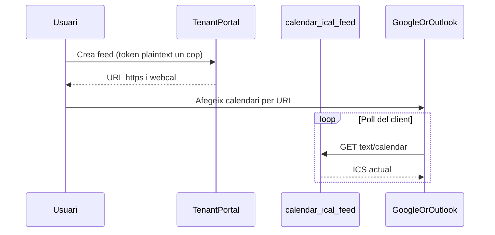

# 06 — iCal: com funciona

> Pla futur V2.5. **No implementat.**  
> Seguretat: [`07-ical-security.md`](./07-ical-security.md) · Arquitectura: [`08-ical-architecture-and-phases.md`](./08-ical-architecture-and-phases.md)

## Què és

**iCalendar** (fitxers `.ics`, MIME `text/calendar`) és el format estàndard [RFC 5545](https://datatracker.ietf.org/doc/html/rfc5545) per intercanviar events entre apps de calendari. No és un producte d’Apple: Google Calendar, Outlook, Thunderbird i Apple el consumeixen.

Un feed mínim:

```text
BEGIN:VCALENDAR
VERSION:2.0
PRODID:-//PiMed//CompanyCalendar//CA
CALSCALE:GREGORIAN
METHOD:PUBLISH
X-WR-CALNAME:Calendari PiMed
BEGIN:VEVENT
UID:ce-aaaaaaaa-bbbb-cccc-dddd-eeeeeeeeeeee@calendar.pimed.app
DTSTAMP:20261005T120000Z
DTSTART:20261008T080000Z
DTEND:20261008T083000Z
SUMMARY:Reunió comercial
DESCRIPTION:Event
END:VEVENT
END:VCALENDAR
```

| Camp | Rol |
|------|-----|
| `UID` | Identitat estable de l’event al client. **Cal** format globalment únic (veure § UID). |
| `DTSTART` / `DTEND` | Interval. All-day usa `VALUE=DATE` (veure § Temps). |
| `SUMMARY` | Títol visible. |
| `METHOD:PUBLISH` | Feed informatiu (no invitació iTIP). |
| `X-WR-CALNAME` | Nom del calendari al client (de facto universal). |

## Import vs subscribe

| Mode | Què passa | Actualització |
|------|-----------|---------------|
| **Import** (descarregar `.ics`) | El client copia els events un cop | **No** es refresca sol |
| **Subscribe** (URL) | El client desa la URL i la **torna a demanar** periòdicament | Es refresca quan el client vol |

L’MVP de PiMed és **subscribe read-only**, no import one-shot (encara que la mateixa URL es pugui descarregar amb curl).

### `webcal://` vs `https://`

- `webcal://host/path?token=…` **no** és un protocol de xarxa propi: el client el reescriu a `https://` i fa un GET normal.
- Serveix perquè el SO/obri «subscriu» en lloc de «descarrega fitxer».
- Publicar **les dues** formes: `webcal://…` com a CTA principal; `https://…` com a fallback (Google web sovint vol https).

## Flux de subscribe (conceptual)



**Important:** el servidor **no pot forçar** el refresh. Google/Outlook/Apple decideixen l’interval (minuts → hores o més). No prometre «temps real».

## Clients de prova (sense Apple / iPhone / Mac)

1. **Google Calendar (web)** → Altres calendaris → Per URL.  
2. **Outlook web** → Afegir calendari des d’Internet.  
3. **Thunderbird** (Windows/Linux).  
4. **curl** + inspecció del cos `BEGIN:VEVENT`.  
5. Tests unitaris del generador ICS (obligatoris a la implementació).

## Regles de temps (fixes per a l’MVP)

| Tipus d’event | Codificació ICS |
|---------------|-----------------|
| Timed | `DTSTART` / `DTEND` en **UTC** (`…Z`). Font: `start_at` / `end_at` timestamptz. |
| All-day (`all_day = true`) | `DTSTART;VALUE=DATE:YYYYMMDD` i `DTEND;VALUE=DATE` = dia **exclusiu** fi (mateixa semàntica que el projector del portal). |
| Sense `end_at` timed | `DTEND` = `DTSTART + 30 min` (alineat amb create des de slot). |

No usar «floating local» sense TZID a l’MVP: redueix bugs entre clients.

## UID (fixes)

- Format: `ce-{calendar_events.id}@calendar.pimed.app` (prefix `ce-` + UUID de fila).  
- Si se suprimeix i es recrea l’event a BD → **nou UID** → el client pot deixar l’antic com a orfe fins que desaparegui del feed (el feed ja no l’inclou; alguns clients el treuen al proper sync, d’altres el deixen). Documentar a ajuda.  
- No reutilitzar UIDs d’altres sistemes.

## Camps exposats al VEVENT (llista blanca)

| ICS | Font | Notes |
|-----|------|--------|
| `UID` | `id` | Veure amunt |
| `DTSTAMP` | `updated_at` o `now` | |
| `DTSTART` / `DTEND` | `start_at` / `end_at` / all-day | |
| `SUMMARY` | `title` (fallback entitat) | Max longitud raonable (p.ex. 255) |
| `DESCRIPTION` | `description` **només** si no és null; truncar (p.ex. 2000) | **No** afegir metadata interna, notes de projecte ni PII extra |
| `STATUS` | ometre a MVP | |
| `LOCATION` | ometre a MVP tret que `metadata.location_name` existeixi (shifts) | Opcional fase 2 |

**No exportar:** `required_permissions`, IDs interns a DESCRIPTION, assignee raw, contingut comercial.

## Finestra temporal del feed (fixes)

Al generar l’ICS s’inclouen events que **solapen**:

- `rangeStart` = inici del dia local UTC-equivalent: **avui − 180 dies**  
- `rangeEnd` = **avui + 365 dies**

Events fora d’aquesta finestra **no** apareixen al feed (el client deixa de veure’ls al proper poll). Justificació: evitar dumps eterns i payloads enormes. Valors constants a l’MVP (no configurables per UI).

## Límits de producte (dir-ho a l’usuari)

- Read-only des del calendari extern.  
- Refresh no garantit ni immediat.  
- Qui té la URL llegeix el contingut del feed fins a revocar.  
- Recordatoris de PiMed **no** es mapejen als alarms del telèfon a l’MVP.  
- Visites FSM a `/field/agenda` **no** són aquest feed (superfície diferent).

## Fora d’abast d’aquest document

OAuth Google/Outlook, CalDAV, push, import one-shot com a feature de producte, DnD.
