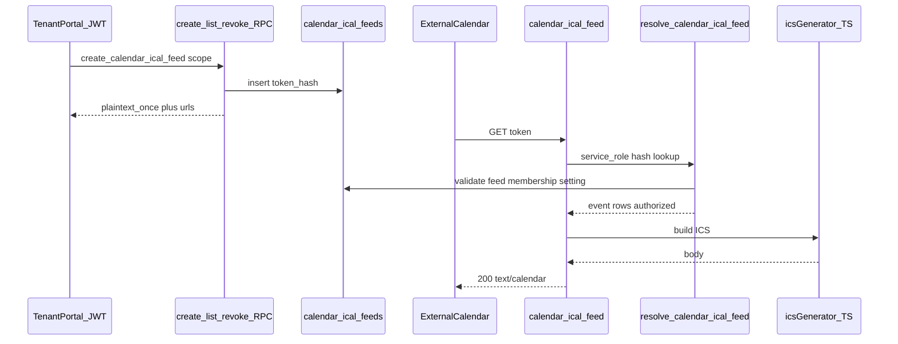

# 08 — iCal: arquitectura i fases d’implementació

> Pla futur V2.5. **No implementat.**  
> Producte/format: [`06-ical-how-it-works.md`](./06-ical-how-it-works.md) · Seguretat: [`07-ical-security.md`](./07-ical-security.md)

## Abast MVP

Subscribe URL **read-only** → `text/calendar`.  
Fora: OAuth Google/Outlook, CalDAV, push, DnD, alarms ICS.

## Noms canònics (un sol vocabulari)

| Peça | Nom |
|------|-----|
| Taula | `data.calendar_ical_feeds` |
| Setting tenant | `calendar.ical_enabled` |
| RPC create | `api.create_calendar_ical_feed` |
| RPC list | `api.list_my_calendar_ical_feeds` |
| RPC revoke | `api.revoke_calendar_ical_feed` |
| RPC revoke admin | `api.admin_revoke_calendar_ical_feed` |
| RPC resolve (Edge) | `api.resolve_calendar_ical_feed` |
| Edge Function | `calendar-ical-feed` |
| URL pública | `https://<project>.supabase.co/functions/v1/calendar-ical-feed?token=<secret>` |
| Scope enum | `all_visible` \| `mine` |

## Arquitectura



### Responsabilitats

| Cap | Responsabilitat |
|-----|-----------------|
| Portal (JWT) | Toggle tenant; create/list/revoke; mostrar secret un cop |
| `resolve_calendar_ical_feed` | AuthN token + AuthZ dades (reimplementació policy); retorna JSON/rows, **no** ICS |
| Edge `calendar-ical-feed` | HTTP públic; crida resolve amb service_role; **genera ICS en TypeScript**; headers; rate limit |
| Generador ICS | Mòdul TS testeable (unit tests TZ/all-day/UID) — **no** generar ICS a SQL |

### Per què ICS a TypeScript

- Tests unitaris sense Postgres.  
- Escape RFC (`SUMMARY` amb comes, newlines → folding).  
- Mateixes regles de temps que [`06`](./06-ical-how-it-works.md).

Ubicació suggerida en implementar: `supabase/functions/calendar-ical-feed/` + shared `supabase/functions/_shared/calendar/ics.ts` (o paquet intern si ja n’hi ha un per Edge).

## Schema proposat

```sql
-- Esborrany documental (migració futura)
CREATE TABLE data.calendar_ical_feeds (
  id            uuid PRIMARY KEY DEFAULT gen_random_uuid(),
  tenant_id     uuid NOT NULL REFERENCES data.tenants(id) ON DELETE CASCADE,
  user_id       uuid NOT NULL REFERENCES data.profiles(id) ON DELETE CASCADE,
  token_hash    bytea NOT NULL,
  scope         text NOT NULL CHECK (scope IN ('all_visible', 'mine')),
  label         text,
  created_at    timestamptz NOT NULL DEFAULT now(),
  expires_at    timestamptz NOT NULL,
  last_accessed_at timestamptz,
  revoked_at    timestamptz,
  revoked_by    uuid REFERENCES data.profiles(id) ON DELETE SET NULL,
  revoke_reason text
);

CREATE UNIQUE INDEX uq_calendar_ical_feeds_token_hash
  ON data.calendar_ical_feeds (token_hash);

-- Max 2 actius per (tenant, user): partial unique o check a RPC
CREATE INDEX /* … */ ON data.calendar_ical_feeds (tenant_id, user_id)
  WHERE revoked_at IS NULL;
```

Vista API de llistat: **sense** `token_hash`.

## Resolve: autorització de dades

`api.resolve_calendar_ical_feed(p_token text)` (només `service_role`):

1. Hash del token; lookup fila no revocada i `expires_at > now()`.  
2. Comprovar `calendar.ical_enabled` al tenant (effective settings).  
3. Comprovar membership activa `user_id` + `tenant_id`.  
4. Comprovar que l’usuari **encara** té `calendar.view` (mateix helper JWT/permission que la resta de l’app, invocat en context DEFINER amb el `user_id` del feed — **no** `auth.uid()` del caller anon).  
5. Seleccionar events de `data.calendar_events` (o vista interna) amb:
   - `tenant_id` del feed  
   - solapament amb finestra −180d / +365d ([`06`](./06-ical-how-it-works.md))  
   - mateixes restriccions de site/permisos que la policy SELECT actual (copiar lògica de la policy / funció auxiliar; **no** obrir SELECT a anon)  
6. Si `scope = mine`: aplicar regles de [`05-mine-events-contract.md`](./05-mine-events-contract.md) **en SQL** (join `tasks` per `assignee_id`, `metadata.employee_id` vs empleat de l’usuari, manuals per `owner_id`, excloure `project`).  
7. Actualitzar `last_accessed_at` si `now() - coalesce(last_accessed_at, '-infinity') > 15 minutes`.  
8. Retornar set de files mínimes per ICS: `id, title, description, start_at, end_at, all_day, entity_type, metadata` (subset).

Parity tests: mateix usuari, mateixa finestra, comparar IDs portal vs resolve.

## Reutilització al repo

| Necessitat | Patró existent |
|------------|----------------|
| Token hash + revoke | `data.customer_report_shares` + `hash_customer_portal_secret` |
| Edge GET públic | `resolve-document-share` (`verify_jwt = false`) — canviar resposta a cos ICS |
| Crypto Edge | `_shared/employee-portal/crypto.ts` |
| Settings tenant | `settings_registry` + `update_tenant_settings` / `useEffectiveSettings` |
| Contracte mine | `05-mine-events-contract.md` + lògica SQL (no només `mineCalendarEvents.ts`) |
| Observability Edge | `_shared/observability` |

## UI (futur)

1. **Config tenant** (owner/manager): toggle «Permetre subscripció iCal».  
2. **Calendari o Settings → Jo:**  
   - Llista feeds actius (scope, created, expires, last access).  
   - Crear (`all_visible` / `mine`) → modal amb URL https + webcal + avís de secret.  
   - Revocar.  
3. **No** al widget del dashboard.

i18n: namespace `calendar` o `settings` (claus noves).

## Fases d’implementació (quan es prioritzí)

### Fase I1 — Foundation

- Registrar `calendar.ical_enabled`.  
- Migració taula + indexes + grants.  
- RPCs create / list / revoke / admin_revoke + tests SQL (create, max 2, revoke, list sense hash).  
- Audit `log_audit_event` en create/revoke.

**DoD I1:** tests SQL verds; setting apagat bloqueja create.

### Fase I2 — Feed

- `api.resolve_calendar_ical_feed` + tests parity/authz ([`07` DoD](./07-ical-security.md)).  
- Edge `calendar-ical-feed` + `ics.ts` + unit tests (timed UTC, all-day exclusive end, escape SUMMARY, UID).  
- Rate limit bàsic + headers cache.  
- config.toml `verify_jwt = false`.

**DoD I2:** curl amb token retorna ICS vàlid; token revocat 403; Google Calendar web subscribe smoke manual.

### Fase I3 — Portal UI

- Toggle tenant.  
- UI create/list/revoke + copy URL.  
- Ajuda curta (refresh, risc del link, finestra 180/365).  
- i18n ca/en/es mínim.

**DoD I3:** flux complet sense SQL manual.

### Fase I4 — Hardening

- Checklist DoD V2.5 a [`04`](./04-backlog-v2.md) + [`CHECKLIST.md`](./CHECKLIST.md).  
- Runbook operatiu (copiar secció de [`07`](./07-ical-security.md)).  
- Revisió: logs sense secrets; `expires_at` warning UI.  
- Decidir purge de files revocades > N dies (opcional).

## Criteris d’acceptació V2.5 (resum)

- [ ] Tenant pot activar/desactivar iCal.  
- [ ] Usuari amb `calendar.view` crea feed; secret un cop; max 2 actius.  
- [ ] Subscribe URL retorna el mateix conjunt autoritzat que `/calendar` (finestra −180/+365).  
- [ ] Scope `mine` correcte al servidor.  
- [ ] Revocació i caducitat funcionen.  
- [ ] Tests SQL + unit ICS + smoke Google web.  
- [ ] Docs ajuda + runbook.

## Ordre relatiu a la resta de V2

- V2.4 DnD: **no** és prerequisit.  
- V2.1/V2.2: útils (mine); el feed reutilitza el contracte mine.  
- OAuth Google/Outlook: **després** que aquest MVP estigui estable en producció.
