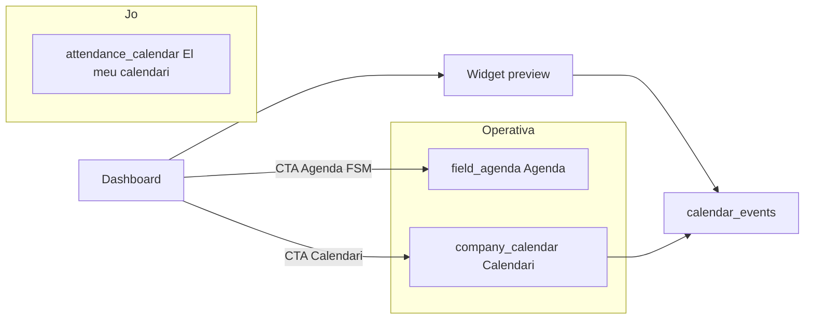

# Calendari d’empresa (`/calendar`)

> **Estat:** V1 + part de V2 implementades al portal — veure [`STATUS.md`](./STATUS.md)  
> **Ordre d’implementació:** [`EXECUTION.md`](./EXECUTION.md) · checklist [`CHECKLIST.md`](./CHECKLIST.md)  
> **Depèn de:** `api.calendar_events`, `CalendarRegistry`, permisos `calendar.*`, nav Operativa / Jo  
> **Objectiu:** pàgina completa d’events d’empresa, noms clars vs Agenda FSM i calendari laboral, widget del dashboard com a preview.

| Document | Contingut |
|----------|-----------|
| [`01-product-and-naming.md`](./01-product-and-naming.md) | Superfícies, labels, decisions tancades, fora d’abast V1 |
| [`02-data-model-and-ux.md`](./02-data-model-and-ux.md) | Multiday, colors, URL, crear/eliminar, widget |
| [`03-phases-v1.md`](./03-phases-v1.md) | Fases 0–5 V1 amb DoD i fitxers |
| [`04-backlog-v2.md`](./04-backlog-v2.md) | Cerca, Els meus, time-grid, DnD, sync extern |
| [`05-mine-events-contract.md`](./05-mine-events-contract.md) | Regles «Els meus» per `entity_type` |
| [`06-ical-how-it-works.md`](./06-ical-how-it-works.md) | iCal/ICS: format, subscribe, UID, TZ, camps |
| [`07-ical-security.md`](./07-ical-security.md) | Seguretat SaaS: token, opt-in, AuthZ, DoD proves |
| [`08-ical-architecture-and-phases.md`](./08-ical-architecture-and-phases.md) | Schema, RPCs, Edge, UI, fases I1–I4 |
| [`CHECKLIST.md`](./CHECKLIST.md) | Marcatge de fases i gates |
| [`EXECUTION.md`](./EXECUTION.md) | Ordre estricte per a l’agent implementador |
| [`STATUS.md`](./STATUS.md) | Estat viu durant la implementació |

## Idea central

Tres (més una) superfícies de temps, **no fusionades**:

1. **`/calendar`** — Calendari d’empresa (`calendar_events` + registry).
2. **`/field/agenda`** — Agenda FSM (visites / OS).
3. **`/attendance/calendar`** — El meu calendari (laboral personal).
4. **`/attendance-mgmt/...`** — Planificació RRHH (sense rename V1).

## V1 en una frase

`list | day | week | month` + filtres tipus/centre + CRUD manuals correcte + projecció multiday + widget preview + nav/i18n sense confusió de noms.

## V2

- Fet: cerca, «Els meus», time-grid.  
- Pendent / deprioritzat: DnD.  
- **iCal (futur):** pla detallat a [`06`](./06-ical-how-it-works.md) · [`07`](./07-ical-security.md) · [`08`](./08-ical-architecture-and-phases.md) — **codi encara no**.
