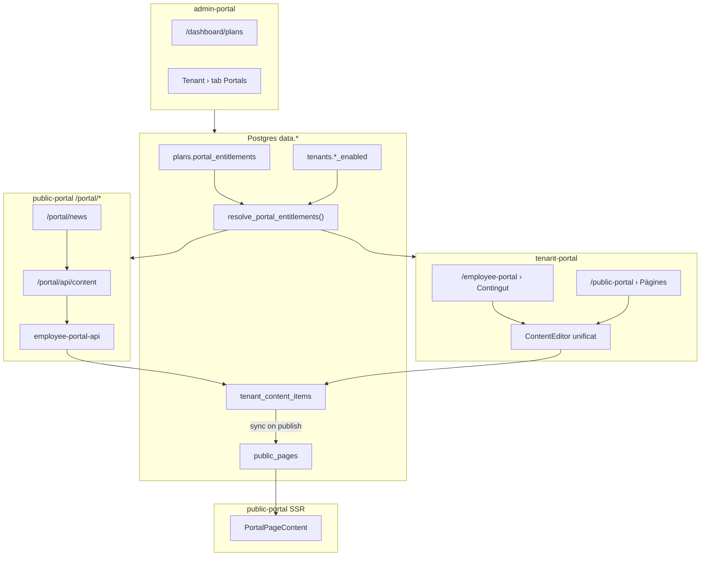

# CMS unificat — Contingut Portal Empleat + Web Pública

> **Codi del pla:** TCMS-1  
> **Data:** 2026-07-13 · **Revisió:** 2026-07-13 (incorpora revisió externa)  
> **Estat:** ✅ Implementat (F0–F5 + TCMS-1.1 snapshot) — smoke SQL ✅ · E2E manual: [`tcms1-smoke-checklist.md`](./tcms1-smoke-checklist.md)  
> **Repositori:** `pimed-app-supabase`  
> **Relacionat:** portal empleat (EP0–EP9), public-portal V1 (`docs/V2/public-portal-content-v1-v2.md`)  
> **Seguiment evolutiu:** TCMS-2 Website Builder + paquet FSR (reserves, carta, horaris) → [`plan-tenant-content-tcms2-fsr.md`](./plan-tenant-content-tcms2-fsr.md)

### Canvi de revisió (2026-07-13)

Correccions d'integritat (slug, `public_site_id`, `show_lead_form`), quota per `public_site`, mapping d'errors SQL, ISR, UX últim canal, avís obligatori anuncis→web, reach preview V1, i decisions explícites (delete, traduccions empleat, un departament per empleat).

---

## Resum executiu

Aquest pla defineix un **motor de contingut unificat** per als tenants de la plataforma, amb **dos canals clarament separats**:

| Canal | Qui el llegeix | On es consumeix |
|-------|----------------|-----------------|
| **Portal empleat** (intern) | Empleats autenticats via sessió del portal | `/portal/news` dins `apps/public-portal` |
| **Web pública** (extern) | Visitants anònims | `/{tenant-slug}/{locale}/{pageSlug}` o domini propi |

**Decisions de producte tancades:**

1. **Una sola font de veritat** — taula `data.tenant_content_items`; la web pública es serveix via **projecció** a `data.public_pages` (no es reescriu el runtime Next.js existent).
2. **Substituir `PageEditor`** — tot el contingut web passa per l'editor unificat; migració/backfill de pàgines existents.
3. **Dos mòduls d'admin separats** al tenant-portal (`/employee-portal` vs `/public-portal`), un editor compartit amb UX de canals explícita.
4. **Entitlements per pla + overrides per tenant** a admin-portal; cada canal s'activa/desactiva independentment.
5. **CMS per tiers** (`none` | `basic` | `advanced`) — funcions avançades bloquejades a RPC i UI.
6. **Sense paritat** amb cap CMS extern — només funcionalitats acordades en aquest document.

**Ordre d'implementació:** F0 → F1 (entitlements) → F2 (esquema contingut) → F3 (admin tenant) → F4 (portal empleat) → F5 (smoke/docs).

---

## 1. Context — què existeix avui

### 1.1 Web pública (`public-portal` V1)

Ja implementat:

- **Taules:** `data.public_sites`, `data.public_pages`, `data.public_domains`, `data.public_leads`
- **Flag tenant:** `data.tenants.public_portal_enabled` (activat des d'admin-portal)
- **Quotas pla:** `data.plans.max_portal_pages`, `data.plans.portal_field_limits` (jsonb)
- **Admin tenant:** ruta `/public-portal` amb `PageEditor` (TipTap → `{ html: "..." }` JSONB)
- **Runtime:** Next.js `apps/public-portal` — SSR/ISR, sanitització HTML, nav automàtica des de `show_in_nav`
- **Routing públic:** `/{slug}/{locale}` i domini custom via `proxy.ts`

**Limitació actual:** no hi ha contingut per empleats; `PageEditor` és l'únic punt d'edició i no distingeix canals.

### 1.2 Portal empleat (EP0–EP9)

Ja implementat:

- **Sessió:** cookie HttpOnly `employee_portal_session`, Edge Function `employee-portal-api`
- **Proxy:** `/portal/api/*` → `apps/public-portal/app/api/employee-portal/[...path]/route.ts`
- **Seccions:** fitxatge, horari, absències, historial, documents, registre mensual, accessos, seguretat
- **Nav:** `apps/public-portal/features/employee-portal/config/portalNavConfig.ts`

**Limitació actual:** no hi ha secció de notícies/anuncis; **no existeix** `employee_portal_enabled` al tenant.

### 1.3 Dades relacionades reutilitzables

- `data.employees` — camps `site_id`, `department_id` (per audiència)
- `data.departments` — jerarquia per tenant
- `data.sites` — centres físics del tenant
- Pipeline email i push del portal empleat (per V2)

---

## 2. Glossari

| Terme | Definició |
|-------|-----------|
| **Canal empleat** | Contingut visible només a empleats autenticats al portal (`/portal/news`) |
| **Canal web** | Contingut visible a visitants externs via web pública |
| **Item de contingut** | Registre a `tenant_content_items` (pàgina o anunci) |
| **cms_tier** | Nivell de capacitats CMS: `none`, `basic`, `advanced` |
| **Entitlement** | Dret efectiu del tenant derivat del pla + flags + overrides |
| **Projecció** | Fila sincronitzada a `public_pages` des d'un item amb canal web actiu |
| **Internal Only** | Etiqueta UX del canal empleat (contingut intern) |
| **Public** | Etiqueta UX del canal web (visible sense autenticació) |

---

## 3. Arquitectura



**Principi de separació:** el tenant **mai** ha de confondre un canal amb l'altre. L'editor mostra dos blocs visuals independents; cada mòdul d'admin té color/còpia/icona distintiva.

---

## 4. Entitlements (Fase F1)

### 4.1 Model de tres capes

```
effective = plan.portal_entitlements
          AND tenant module flags (employee_portal_enabled, public_portal_enabled)
          MERGE tenant_portal_overrides (opcional, per enterprise)
```

La **font de veritat per enforcement** és sempre el **pla actual** (`plans.portal_entitlements`), no JSON emmagatzemat obsolet al tenant.

### 4.2 Contracte `plans.portal_entitlements` (jsonb)

```jsonc
{
  "employee_portal": {
    "included": true,
    "cms_tier": "basic"
  },
  "public_portal": {
    "included": false,
    "cms_tier": "none",
    "max_pages": 3
  }
}
```

| Camp | Tipus | Descripció |
|------|-------|------------|
| `employee_portal.included` | boolean | El pla inclou el mòdul portal empleat |
| `employee_portal.cms_tier` | string | `none` \| `basic` \| `advanced` |
| `public_portal.included` | boolean | El pla inclou web pública |
| `public_portal.cms_tier` | string | `none` \| `basic` \| `advanced` |
| `public_portal.max_pages` | integer | Redundant amb `max_portal_pages` si no s'especifica; `0` = il·limitat |

**Seed inicial proposat:**

| Pla (`name`) | employee included | employee cms | public included | public cms | max_pages |
|--------------|-------------------|--------------|-----------------|------------|-----------|
| `free` | true | basic | false | none | — |
| `pro` | true | basic | true | basic | 20 |
| `enterprise` | true | advanced | true | advanced | 0 |

> `max_portal_pages` existent es manté. El trigger `enforce_portal_page_quota` compta pàgines **per `public_site_id`** (no per tenant sencer). Cada sync des d'un item amb canal web crea/actualitza una fila a `public_pages` dins el site seleccionat.

### 4.3 Nivells CMS (`cms_tier`)

| Tier | Canal empleat | Canal web |
|------|---------------|-----------|
| **none** | Sense editor | Sense editor |
| **basic** | Publicar `page`/`announcement`; audiència **només tenant-wide**; sense sticky; sense dates programades; traduccions **permeses** (decisió: valor operatiu baix) | Publicar pàgines; SEO bàsic; **sense** traduccions; sense lead form |
| **advanced** | + audiència per site/departament; sticky; `publish_start_at`/`publish_end_at`; dual channel | + traduccions (ca/es/en); lead form; nav; dates programades |

**Nota traduccions:** el gating de `translations` només al canal **web** és intencional (producte/comercial). Al canal empleat, les traduccions resten disponibles des de `basic` per a equips multilingües interns.

### 4.4 Columnes noves a `data.tenants`

```sql
ALTER TABLE data.tenants
  ADD COLUMN IF NOT EXISTS employee_portal_enabled boolean NOT NULL DEFAULT false;

ALTER TABLE data.tenants
  ADD COLUMN IF NOT EXISTS tenant_portal_overrides jsonb NOT NULL DEFAULT '{}';
```

`public_portal_enabled` ja existeix.

**Contracte `tenant_portal_overrides` (opcional):**

```jsonc
{
  "employee_portal": { "cms_tier": "advanced" },
  "public_portal": { "cms_tier": "advanced" }
}
```

Només pot **elevar** tier respecte al pla, mai incloure un mòdul que el pla no té (`included: false`).

### 4.5 Funció `data.resolve_portal_entitlements(p_tenant_id uuid)`

Retorna jsonb:

```jsonc
{
  "employee_portal": {
    "effective": true,
    "included_by_plan": true,
    "enabled_by_tenant": true,
    "cms_tier": "basic"
  },
  "public_portal": {
    "effective": false,
    "included_by_plan": false,
    "enabled_by_tenant": false,
    "cms_tier": "none",
    "max_pages": 3,
    "pages_used_by_site": {
      "<public_site_id>": 2
    }
  },
  "usage": {
    "content_items_total": 5,
    "content_items_employee_channel": 3,
    "content_items_public_channel": 2
  }
}
```

**Regles:**

- `effective.employee_portal = included_by_plan AND enabled_by_tenant`
- `effective.public_portal = included_by_plan AND enabled_by_tenant AND public_portal_enabled`
- `cms_tier` = override tenant si present i vàlid, sinó pla
- **Quota pàgines web:** per **`public_site_id`**, coherent amb `enforce_portal_page_quota` — `pages_used_by_site[site_id]` = COUNT(`public_pages`) d'aquell site (published o totes, documentar mateix criteri que el trigger: totes les files del site)
- Un tenant pot tenir **múltiples** `public_sites`; l'editor ha d'exigir triar `public_site_id` quan el canal web està actiu

### 4.6 RPCs auxiliars

```sql
-- Retorna { "allowed": true } o { "allowed": false, "reason": "quota_exceeded:..." }
api.can_publish_content(p_tenant_id uuid, p_channel text, p_operation text)
-- p_channel: 'employee' | 'public'
-- p_operation: 'create' | 'update' | 'publish'

api.sync_portal_entitlements_with_plan(p_tenant_id uuid)
-- TCMS-1.1: merge millores del pla al contracte del tenant (no desactiva toggles)
```

### 4.7 TCMS-1.1 — Contracte per tenant (snapshot + grandfathering)

**Migració:** `20260932000001_tenant_portal_entitlements_tcms11.sql`

| Capa | On | Rol |
|------|-----|-----|
| Pla | `plans.portal_entitlements` | Defaults per **nous** tenants; referència per «Sync millores» |
| Contracte | `tenants.tenant_portal_entitlements` | Drets **concedits** al tenant (editable a admin-portal) |
| Toggle | `employee_portal_enabled`, `public_portal_enabled` | Activació operativa per tenant |
| Efectiu | `resolve_portal_entitlements` | `concedit AND toggle`; tier/max = max(contracte, pla) |

**Regles grandfathering:**

- Canvi de pla a pitjor **no** redueix `max_pages`, `cms_tier` ni `included` ja concedits al contracte.
- Canvi de pla a millor: automàtic en canviar `plan_id` (trigger) o manual amb «Sync millores del pla».
- `sync` **no** desactiva toggles de portal.
- Quota `enforce_portal_page_quota` usa `max_pages` resolt (contracte), no només el pla viu.
- **Free** inclou web pública (`included: true`, 3 pàgines, CMS basic).

**Admin-portal:**

- `/dashboard/plans` — edita contracte del pla (nous tenants).
- `/dashboard/tenants/:id` → Portals — edita contracte del tenant + toggles + sync.

**Deprecated:** `tenant_portal_overrides` (migrat al snapshot).

**Codis `reason` estandarditzats (traducció a UI):**

| Codi | Significat |
|------|------------|
| `module_not_included` | El pla no inclou aquest mòdul |
| `module_not_enabled` | Admin no ha activat el mòdul per al tenant |
| `cms_tier_insufficient` | Funció requereix `advanced` |
| `quota_pages_exceeded` | S'ha assolit `max_portal_pages` |
| `field_limit_exceeded:*` | Quota de caràcters (reutilitza trigger existent) |
| `last_channel_required` | No es pot desactivar l'únic canal actiu d'un item |
| `public_site_required` | Canal web actiu sense `public_site_id` |

**Mapping errors SQL → UI (obligatori):**

- Triggers i RPCs llançen `RAISE EXCEPTION` amb prefix de codi i `USING ERRCODE = 'P0001'` (check violation genèric).
- Els RPCs `api.*` exposats al client **no propaguen** el missatge SQL cru: capturen l'excepció i retornen jsonb `{ "ok": false, "code": "cms_tier_insufficient", "message": "..." }`.
- Implementació: bloc `EXCEPTION WHEN OTHERS THEN` dins cada RPC, parseig del prefix abans de `:` al `SQLERRM` (p.ex. `cms_tier_insufficient`, `quota_exceeded`, `field_limit_exceeded`).
- El tenant-portal mapa `code` → i18n; mai mostrar `SQLERRM` complet a l'usuari.

---

## 5. Model de dades — contingut (Fase F2)

### 5.1 Taula `data.tenant_content_items`

```sql
CREATE TABLE data.tenant_content_items (
  id                              uuid        PRIMARY KEY DEFAULT gen_random_uuid(),
  tenant_id                       uuid        NOT NULL REFERENCES data.tenants(id) ON DELETE CASCADE,

  content_type                    text        NOT NULL DEFAULT 'page'
                                  CHECK (content_type IN ('page', 'announcement')),

  slug                            text        NOT NULL
                                  CHECK (slug ~ '^[a-z0-9][a-z0-9\-]{0,99}$'),

  title                           text        NOT NULL,
  excerpt                         text,
  content                         jsonb       NOT NULL DEFAULT '{"html":""}',
  translations                    jsonb       NOT NULL DEFAULT '{}',

  status                          text        NOT NULL DEFAULT 'draft'
                                  CHECK (status IN ('draft', 'published', 'archived')),

  publish_start_at                timestamptz,
  publish_end_at                  timestamptz,
  published_at                    timestamptz,
  is_sticky                       boolean     NOT NULL DEFAULT false,
  sort_order                      int         NOT NULL DEFAULT 0,
  featured_image_url              text,

  -- Canal empleat
  employee_channel_enabled        boolean     NOT NULL DEFAULT false,
  employee_audience_scope         text        NOT NULL DEFAULT 'tenant'
                                  CHECK (employee_audience_scope IN ('tenant', 'site', 'departments')),
  employee_audience_site_id       uuid        REFERENCES data.sites(id) ON DELETE SET NULL,
  employee_audience_department_ids uuid[]     NOT NULL DEFAULT '{}',

  -- Canal web
  public_channel_enabled          boolean     NOT NULL DEFAULT false,
  public_site_id                  uuid        REFERENCES data.public_sites(id) ON DELETE SET NULL,
  public_show_in_nav              boolean     NOT NULL DEFAULT true,
  public_show_lead_form           boolean     NOT NULL DEFAULT false,
  seo_title                       text,
  seo_description                 text,
  public_page_id                  uuid        REFERENCES data.public_pages(id) ON DELETE SET NULL,

  created_by                      uuid        REFERENCES data.profiles(id) ON DELETE SET NULL,
  created_at                      timestamptz NOT NULL DEFAULT now(),
  updated_at                      timestamptz NOT NULL DEFAULT now(),

  CONSTRAINT chk_tenant_content_at_least_one_channel
    CHECK (employee_channel_enabled OR public_channel_enabled),
  CONSTRAINT chk_employee_audience_site
    CHECK (employee_audience_scope <> 'site' OR employee_audience_site_id IS NOT NULL),
  CONSTRAINT chk_employee_audience_departments
    CHECK (employee_audience_scope <> 'departments' OR cardinality(employee_audience_department_ids) > 0),
  CONSTRAINT chk_public_channel_site
    CHECK (NOT public_channel_enabled OR public_site_id IS NOT NULL)
);

-- Unicitat de slug: NO global per tenant — alineat amb public_pages (public_site_id, slug)

-- Canal web: slug únic dins de cada public_site (mateix tenant pot tenir "contacte" a dos sites)
CREATE UNIQUE INDEX uq_tci_public_site_slug
  ON data.tenant_content_items (tenant_id, public_site_id, slug)
  WHERE public_channel_enabled = true AND public_site_id IS NOT NULL;

-- Canal empleat sense web (o abans d'assignar site): slug únic per tenant entre items només-empleat
CREATE UNIQUE INDEX uq_tci_employee_only_slug
  ON data.tenant_content_items (tenant_id, slug)
  WHERE employee_channel_enabled = true AND NOT public_channel_enabled;

-- Items dual-channel: coberts per uq_tci_public_site_slug; el mateix slug serveix per /portal/news/[slug]

CREATE INDEX idx_tci_tenant_status ON data.tenant_content_items (tenant_id, status);
CREATE INDEX idx_tci_tenant_employee ON data.tenant_content_items (tenant_id, employee_channel_enabled)
  WHERE employee_channel_enabled = true;
CREATE INDEX idx_tci_tenant_public ON data.tenant_content_items (tenant_id, public_channel_enabled)
  WHERE public_channel_enabled = true;
```

### 5.2 Contracte JSON `content`

```jsonc
{ "html": "<p>Contingut sanititzat...</p>" }
```

Mateix format que `public_pages.content`. El renderer accepta també `{ blocks: [...] }` (legacy) però l'editor **només escriu** `{ html }`.

### 5.3 Contracte JSON `translations`

```jsonc
{
  "es": {
    "title": "...",
    "seoTitle": "...",
    "seoDescription": "...",
    "content": { "html": "..." }
  },
  "en": { ... }
}
```

Locales suportats: `ca` (base), `es`, `en` — coherents amb public-portal i18n.

### 5.4 Validació per tier (trigger `enforce_tenant_content_tier`)

Abans d'INSERT/UPDATE, segons `resolve_portal_entitlements`:

| Condició | Tier mínim |
|----------|------------|
| `employee_audience_scope != 'tenant'` | advanced (empleat) |
| `is_sticky = true` | advanced (empleat) |
| `publish_start_at` o `publish_end_at` IS NOT NULL | advanced (canal actiu) |
| `translations != '{}'` amb canal web | advanced (web) |
| `translations != '{}'` amb **només** canal empleat | cap restricció extra (≥ basic empleat) |
| `public_show_lead_form = true` | advanced (web) |

Si no es compleix → `RAISE EXCEPTION 'cms_tier_insufficient:...' USING ERRCODE = 'P0001'`.

Reutilitzar `enforce_portal_field_limits` per caràcters (mateixos límits de `portal_field_limits`).

### 5.5 Filtre audiència — RPC empleat

```sql
api.employee_portal_list_content(p_employee_id uuid, p_tenant_id uuid)
api.employee_portal_get_content_by_slug(p_employee_id uuid, p_tenant_id uuid, p_slug text)
```

**Lògica de filtre** (pseudo-SQL):

```sql
-- v_employee des de data.employees
WHERE tci.status = 'published'
  AND tci.employee_channel_enabled = true
  AND (tci.publish_start_at IS NULL OR tci.publish_start_at <= now())
  AND (tci.publish_end_at IS NULL OR tci.publish_end_at > now())
  AND (
    tci.employee_audience_scope = 'tenant'
    OR (tci.employee_audience_scope = 'site'
        AND tci.employee_audience_site_id = v_employee.site_id)
    OR (tci.employee_audience_scope = 'departments'
        AND v_employee.department_id = ANY(tci.employee_audience_department_ids))
  )
ORDER BY tci.is_sticky DESC, tci.sort_order ASC, tci.published_at DESC NULLS LAST
```

**Assumpció V1 — un departament per empleat:** `data.employees.department_id` és **nullable i singular** (FK única). No hi ha pertinença multi-departament. El filtre usa `v_employee.department_id = ANY(...)`. Si en el futur s'afegeix pertinença múltiple, caldrà nova taula pont i actualitzar aquest RPC (fora d'abast V1).

Empleats sense `department_id` **no veuen** items amb scope `departments`.

### 5.6 Sync a `public_pages`

Funció interna `data.sync_content_item_to_public_page(p_item_id uuid)` cridada des de `api.publish_tenant_content_item`:

**Decisió tancada — `show_lead_form`:** no és columna a `public_pages`. Avui es guarda **dins** `public_pages.content` jsonb com `{ "html": "...", "show_lead_form": true|false }` (com fa `PageEditor` legacy). En sync, fusionar:

```jsonc
{
  "html": "<p>...</p>",
  "show_lead_form": true
}
```

El camp `public_show_lead_form` a `tenant_content_items` és la font d'edició; en upsert es mergeja al jsonb `content`.

**En publicar** (`status = published` AND `public_channel_enabled = true`):

1. Validar `can_publish_content(tenant, 'public', 'publish')`
2. Validar `public_site_id IS NOT NULL` (també cobert per CHECK)
3. Upsert a `public_pages` on `(public_site_id, slug)`:
   - `title`, `content` (html + show_lead_form), `translations`, `seo_title`, `seo_description`
   - `show_in_nav` ← `public_show_in_nav`
   - `sort_order`, `status = 'published'`
4. Desar `public_page_id` a l'item
5. Retornar metadades per revalidació ISR (veure §5.6.1)

**En despublicar canal web** o `status != published`:

- Posar pàgina associada a `draft` (no DELETE — evita trencar enllaços)

**Eliminació V1:** **no hi ha hard-delete** d'items. Només `archive`. La projecció `public_pages` passa a `draft`. Si cal purge GDPR, V2+.

#### 5.6.1 Revalidació ISR (public-portal)

Avui `apps/public-portal` usa `export const revalidate = 3600` (ISR 1h). Publicar via sync **sense** revalidació pot deixar contingut invisible fins a 1h.

**Obligatori F3:**

1. Afegir ruta secreta `POST /api/revalidate-portal` a `apps/public-portal` (header `x-revalidate-secret`, paths com `/{slug}/{locale}/{pageSlug}`).
2. Després de `publish_tenant_content_item` exitós, el tenant-portal crida aquest endpoint amb site slug + page slug + locales suportats.
3. Documentar secret a `DEV_RUNBOOK.md` (local: `.env` compartit).

Alternativa rebutjada: confiar només en ISR — regression silenciosa acceptada com a no vàlida.

### 5.7 Backfill de pàgines existents

Script de migració dins la mateixa migració F2:

```sql
INSERT INTO data.tenant_content_items (...)
SELECT ... FROM data.public_pages pp
JOIN data.public_sites ps ON ps.id = pp.public_site_id
WHERE NOT EXISTS (SELECT 1 FROM data.tenant_content_items t WHERE t.public_page_id = pp.id);
```

Valors per defecte del backfill: `public_channel_enabled = true`, `employee_channel_enabled = false`, `status` copiat de la pàgina.

### 5.8 RLS i audit

- **RLS:** tenant members amb rol `owner`/`manager` poden CRUD; lectura autenticada via vistes `api.*`
- **Anon:** cap accés directe a `tenant_content_items`
- **Audit actions:** `TENANT_CONTENT_CREATED`, `TENANT_CONTENT_UPDATED`, `TENANT_CONTENT_PUBLISHED`, `TENANT_CONTENT_ARCHIVED`, `TENANT_CONTENT_CHANNEL_SYNCED`
- Metadades audit: `channel`, `content_type`, `slug`, `old_status`, `new_status`, `char_delta` (no HTML complet)

### 5.9 RPCs admin tenant

```sql
api.list_tenant_content_items(p_tenant_id uuid, filters jsonb)
api.get_tenant_content_item(p_tenant_id uuid, p_item_id uuid)
api.upsert_tenant_content_item(p_tenant_id uuid, p_payload jsonb)  -- draft save
api.publish_tenant_content_item(p_tenant_id uuid, p_item_id uuid)
api.archive_tenant_content_item(p_tenant_id uuid, p_item_id uuid)
api.get_tenant_content_usage(p_tenant_id uuid)
api.preview_tenant_content_reach(p_tenant_id uuid, p_item_id uuid)  -- COUNT empleats abans de publicar
```

**No exposat a V1:** `delete_tenant_content_item` — usar `archive` únicament.

---

## 6. API — Portal empleat (Fase F4)

### 6.1 Edge Function `employee-portal-api`

Noves rutes (requereixen `requirePortalSession`):

| Mètode | Ruta | Descripció |
|--------|------|------------|
| GET | `/content` | Llista filtrada per audiència |
| GET | `/content/:slug` | Detall per slug |

**Servei:** `supabase/functions/_shared/employee-portal/content-service.ts`

**Errors:**

| Codi HTTP | code | Quan |
|-----------|------|------|
| 403 | `content_module_disabled` | Entitlement CMS none o mòdul off |
| 404 | `content_not_found` | Slug inexistent o fora d'audiència |
| 500 | `content_load_failed` | Error RPC |

**Gate pre-RPC:** cridar lògica equivalent a `resolve_portal_entitlements`; si `employee_portal.effective = false` o `cms_tier = none`, retornar 403.

### 6.2 Proxy Next.js

Afegir a `sessionGetRoutes` a `apps/public-portal/app/api/employee-portal/[...path]/route.ts`:

- `content`
- `content/:slug`

Patró idèntic a `documents` (cookie → proxy → edge).

### 6.3 Payload resposta (llista)

```jsonc
{
  "items": [
    {
      "id": "uuid",
      "slug": "nou-protocol",
      "title": "Nou protocol",
      "excerpt": "Resum curt...",
      "content_type": "announcement",
      "is_sticky": true,
      "published_at": "2026-07-01T10:00:00Z"
    }
  ]
}
```

### 6.4 Payload resposta (detall)

```jsonc
{
  "id": "uuid",
  "slug": "nou-protocol",
  "title": "Nou protocol",
  "content_type": "announcement",
  "content": { "html": "<p>...</p>" },
  "published_at": "2026-07-01T10:00:00Z"
}
```

HTML ja sanititzat al client amb la mateixa llista de tags que `PortalPageContent`.

---

## 7. UI — tenant-portal (Fase F3)

### 7.1 Rutes

| Ruta | Component | Condició |
|------|-----------|----------|
| `/employee-portal` | Existent (tokens, accessos) + tab **Contingut** | `employee_portal.effective` |
| `/employee-portal/content` | `EmployeeContentListPage` | ↑ |
| `/employee-portal/content/new` | `ContentEditorPage` entry=`employee` | ↑ |
| `/employee-portal/content/:id/edit` | `ContentEditorPage` entry=`employee` | ↑ |
| `/public-portal` | Existent — tab **Pàgines** passa a usar ContentEditor | `public_portal.effective` |
| `/public-portal/pages/new` | `ContentEditorPage` entry=`public` | ↑ |
| `/public-portal/pages/:id/edit` | `ContentEditorPage` entry=`public` | ↑ |

Si mòdul no actiu → component `ModuleNotEnabledScreen` (mateix patró que `PublicPortalActivation`).

### 7.2 Feature module

```
apps/tenant-portal/src/features/tenant-content/
  api/
    useTenantContentItems.ts
    useTenantContentMutations.ts
    usePortalEntitlements.ts
  components/
    ContentEditor.tsx
    ContentList.tsx
    ContentChannelPanel.tsx      -- bloc canal empleat
    ContentPublicChannelPanel.tsx -- bloc canal web
    PortalModuleUsageCard.tsx  -- barra ús/quota
    ModuleNotEnabledScreen.tsx
  utils/
    contentPayloadMapper.ts
    tierGuards.ts
```

**Eliminar després del backfill:** lògica de guardat directe a `public_pages` dins `PageEditor.tsx` (fitxer substituït o redirigit).

### 7.3 ContentEditor — UX de canals

**Paràmetre `entryContext`:** `'employee' | 'public'`

| entryContext | Canal actiu per defecte | Altres canals |
|--------------|-------------------------|---------------|
| `employee` | Portal empleat ON, expandit | Web col·lapsada amb avís |
| `public` | Web pública ON, expandida | Empleat col·lapsat |

**Bloc Portal empleat (Internal Only):**

- Header: fons/icona distintiva (p.ex. blau fosc + icona Users)
- Text: «Contingut intern — només visible per empleats autenticats al portal»
- Toggle `employee_channel_enabled`
- **Regla UI:** no es pot desactivar l'últim canal actiu — el switch resta disabled si és l'únic ON (evita `last_channel_required` a BD)
- Si ON: audiència (radio tenant / site / departaments), selector site, multi-select departments
- Checkbox sticky (disabled si tier basic)
- Dates programades (disabled si tier basic)
- **Reach preview (V1):** abans de publicar, crida `preview_tenant_content_reach` → «Aquest contingut arribarà a N empleats» (mateix filtre que RPC lectura)

**Bloc Web pública (Public):**

- Header: fons/icona distintiva (p.ex. verd + icona Globe)
- Text d'avís: «Aquest contingut serà visible per visitants externs sense autenticació»
- Toggle `public_channel_enabled`
- Selector **`public_site_id`** obligatori quan ON (llista sites del tenant)
- Si ON: SEO, show_in_nav, show_lead_form (advanced), traduccions (advanced)

**Avís obligatori — anunci → web (V1):**

Quan `content_type = 'announcement'` i l'usuari activa `public_channel_enabled`, mostrar **modal de confirmació addicional** (no només l'avís genèric):

> «Estàs a punt de fer públic un anunci intern. Revisa que no contingui dades confidencials d'empleats.»

Requereix checkbox «He revisat el contingut» abans de confirmar.

**Llista — badges:** `Intern` | `Públic` | `Dual` segons canals actius.

**Defaults per `content_type`:**

| Tipus | Canal empleat | Canal web |
|-------|---------------|-----------|
| `announcement` | ON | OFF |
| `page` | segons entryContext | segons entryContext |

**Confirmacions:**

- Desactivar canal web amb projecció publicada → modal «La pàgina deixarà de ser visible públicament»
- Desactivar canal empleat en item dual → avís que el contingut deixa d'aparèixer a `/portal/news` però pot seguir a la web

### 7.4 PortalModuleUsageCard

Mostrar a ambdós mòduls:

- Pla actual + tier CMS del canal
- Barra **`pàgines usades / màxim` per `public_site_id` seleccionat** (canal web) — no suma global si hi ha múltiples sites
- Barra `items totals` (opcional)
- Llista de capacitats actives (✓/✗): traduccions web, dept targeting, sticky, lead form

---

## 8. UI — admin-portal (Fase F1)

### 8.1 Nova pàgina `/dashboard/plans`

- Taula plans: free, pro, enterprise
- Edició inline de `portal_entitlements` (json o formulari estructurat)
- Mostrar al costat: `max_portal_pages`, `portal_field_limits`

### 8.2 Tab **Portals** a `/dashboard/tenants/[tenantId]`

| Control | Acció |
|---------|-------|
| Toggle Portal empleat | `employee_portal_enabled` (disabled si pla no inclou) |
| Toggle Web pública | `public_portal_enabled` (existent) |
| CMS tier empleat | Read-only pla + dropdown override (enterprise) |
| CMS tier web | Read-only pla + dropdown override |
| Estat efectiu | JSON llegible de `resolve_portal_entitlements` |
| Botó Sync | Crida `sync_portal_entitlements_with_plan` |

Consolidar o enllaçar des de `/dashboard/public-portal` existent.

### 8.3 Server actions (admin-portal)

```
apps/admin-portal/app/admin/actions/portal-entitlements.ts
  toggleEmployeePortal(tenantId, enabled)
  togglePublicPortal(tenantId, enabled)  -- pot moure's des de tenants.ts
  upsertTenantPortalOverrides(tenantId, overrides)
  updatePlanPortalEntitlements(planId, entitlements)
  syncPortalEntitlementsWithPlan(tenantId)
```

---

## 9. UI — portal empleat (Fase F4)

### 9.1 Rutes Next.js

```
apps/public-portal/app/portal/(protected)/news/page.tsx
apps/public-portal/app/portal/(protected)/news/[slug]/page.tsx
```

### 9.2 Components

```
apps/public-portal/features/employee-portal/components/
  PortalNewsPage.tsx       -- llista
  PortalNewsDetailPage.tsx -- detall
```

### 9.3 Nav

Afegir a `portalNavConfig.ts` **només si** entitlement ho permet (hook client o flag SSR):

```typescript
{
  href: "/portal/news",
  labelKey: "employee_portal.nav_news",
  labelFallback: "Notícies",
  icon: Newspaper,  // lucide-react
}
```

Posició recomanada: després de `documents`, abans de `monthly`.

### 9.4 API client

`portalApi.ts`:

```typescript
fetchPortalContent(): Promise<PortalContentListResponse>
fetchPortalContentBySlug(slug: string): Promise<PortalContentDetailResponse>
```

### 9.5 i18n (`apps/public-portal/locales/{ca,es,en}/portal.json`)

Claus mínimes:

```json
{
  "employee_portal": {
    "nav_news": "...",
    "news": {
      "title": "...",
      "subtitle": "...",
      "empty": "...",
      "error_load": "...",
      "sticky_badge": "...",
      "new_badge": "..."
    }
  }
}
```

Traduccions tenant-portal: namespace `tenant-content` (ca/en/es).

---

## 10. Fases d'implementació

### F0 — Preparació (0,5–1 dia)

**Entregables:**

- [ ] Aquest document revisat i tancat
- [ ] Issue/ticket TCMS-1 creat
- [ ] Decisió de timestamp migracions: `20260929000001` (ajustar seqüència real en implementar)

**Criteri de sortida:** cap pregunta oberta de producte a §4–§9.

---

### F1 — Entitlements (2–3 dies)

**Migració:** `supabase/migrations/20260929XXXXXX_portal_entitlements_f1.sql`

Contingut:

- [ ] `plans.portal_entitlements` + UPDATE seed free/pro/enterprise
- [ ] `tenants.employee_portal_enabled`, `tenants.tenant_portal_overrides`
- [ ] `data.resolve_portal_entitlements(uuid)`
- [ ] `api.can_publish_content(...)`
- [ ] `api.sync_portal_entitlements_with_plan(uuid)`
- [ ] Vista `api.portal_entitlements` per tenant-portal (SELECT autenticat)

**admin-portal:**

- [ ] `/dashboard/plans` — edició entitlements
- [ ] Tab Portals al detall tenant
- [ ] Server actions `portal-entitlements.ts`

**tenant-portal:**

- [ ] Hook `usePortalEntitlements()`
- [ ] `ModuleNotEnabledScreen` per portal empleat
- [ ] Gate a `/public-portal` (ja parcialment existeix)

**Tests:** `supabase/tests/portal_entitlements_tests.sql`

**Criteris d'acceptació F1:**

1. Pla free: tenant no pot tenir `public_portal.effective = true` encara que admin activi toggle.
2. Admin activa `employee_portal_enabled` en tenant pro → `effective.employee_portal = true`.
3. Override CMS advanced en tenant enterprise funciona.
4. `can_publish_content` retorna `reason` traduïble en quota excedida.

---

### F2 — Esquema contingut + sync (3–4 dies)

**Migració:** `supabase/migrations/20260929XXXXXX_tenant_content_items_f2.sql`

- [ ] Taula `tenant_content_items` + índexs + RLS
- [ ] Trigger tier + field limits + CHECK `public_site_id`
- [ ] Índexs d'unicitat slug (§5.1) — **no** `UNIQUE (tenant_id, slug)` global
- [ ] RPCs admin (list, get, upsert, publish, archive, preview_reach)
- [ ] RPCs empleat (list, get by slug)
- [ ] `sync_content_item_to_public_page`
- [ ] Backfill `public_pages` → `tenant_content_items`
- [ ] Audit triggers

**Tests:** `supabase/tests/tenant_content_tests.sql`

**Criteris d'acceptació F2:**

1. Publicar item dual crea/actualitza fila a `public_pages`.
2. Anunci scope `departments` només visible per RPC empleat amb department coincident.
3. Tier basic rebutja `is_sticky` amb error `cms_tier_insufficient`.
4. Backfill: totes les pàgines existents tenen item corresponent.
5. Dos items amb mateix slug en **diferents** `public_site_id` del mateix tenant — permès.
6. Item amb `public_channel_enabled=true` i `public_site_id=NULL` — rebutjat per CHECK.

---

### F3 — Admin tenant UI (3–4 dies)

- [ ] Feature `tenant-content/` completa
- [ ] `ContentEditor` + `ContentList` + panells de canal
- [ ] Entry points `/employee-portal/content` i `/public-portal/pages`
- [ ] `PortalModuleUsageCard` (quota per site)
- [ ] Modal anunci→web + últim canal disabled + reach preview
- [ ] `POST /api/revalidate-portal` + crida post-publish
- [ ] Eliminar/redirigir `PageEditor` legacy
- [ ] Traduccions `tenant-content` ca/en/es

**Criteris d'acceptació F3:**

1. Crear anunci des de Portal empleat → canal intern ON per defecte.
2. Crear pàgina des de Web pública → canal web ON per defecte.
3. Badge Dual visible en item amb ambdós canals.
4. Tier basic: selectors dept/site deshabilitats.

---

### F4 — Portal empleat runtime (2–3 dies)

- [x] `content-service.ts` + rutes edge
- [x] Proxy GET content
- [x] `PortalNewsPage` + detall
- [x] Nav condicionada a entitlement
- [x] Traduccions portal.json

**Criteris d'acceptació F4:**

1. Empleat dept A veu anunci dept A; empleat dept B no.
2. Item sticky apareix primer a la llista.
3. Item amb `publish_end_at` passat no apareix.
4. Nav «Notícies» ocult si CMS tier none.

---

### F5 — Smoke i documentació (1 dia)

- [x] Secció `DEV_RUNBOOK.md` — «TCMS-1 smoke»
- [x] Checklist manual [`tcms1-smoke-checklist.md`](./tcms1-smoke-checklist.md) (veure §13)
- [x] Actualitzar `database.types.ts` (tenant-portal + functions + public-portal)
- [x] Runner combinat `supabase/tests/run_tcms1_tests.ps1`

---

## 11. Fora d'abast V1

- Comentaris, likes, compartir
- Taxonomia (categories/tags)
- Galeria de mitjans centralitzada (només `featured_image_url` URL)
- Site builder visual / blocs arrossegables
- Preview draft web amb JWT
- Enviament email en publicar anunci
- Push notification en anuncis (reutilitzar EP9 — V2)
- Widgets de contingut al dashboard tenant-portal
- Contingut per rol d'usuari tenant (només dept/site/tenant)
- Hard-delete d'items (només `archive` a V1)
- Pertinença multi-departament per empleat

---

## 12. V2 (roadmap)

| ID | Funcionalitat | Notes |
|----|---------------|-------|
| V2-1 | Imatges inline TipTap | Upload a `public-assets/{tenant_id}/content/` |
| V2-2 | Push en anuncis | Handler `content_published` a cua push EP9 |
| V2-3 | Email digest anunci | Pipeline email existent |
| V2-4 | Preview draft web | JWT signat, 1h TTL |
| V2-5 | Categories simples | 1 nivell, sense taxonomia completa |
| V2-6 | Badge «nou» per usuari | Tracking lectura per empleat/item |
| V2-7 | Historial versions / rollback | `tenant_content_item_revisions` insert-only en cada publish |
| V2-8 | Plantilles d'anuncis | «Tancament festiu», «Nova incorporació», etc. |
| V2-9 | Hard-delete + purge GDPR | Només admin amb audit |

---

## 13. Smoke checklist manual

```text
[ ] F1: Admin-portal → tenant free → toggle web públic → deshabilitat o sense efecte
[ ] F1: Admin-portal → tenant pro → activar employee + public → ambdós effective
[ ] F2: SQL test suite passa
[ ] F3: Tenant-portal → Portal empleat → Contingut → crear anunci dept Producció
[ ] F4: Portal empleat login → /portal/news → anunci visible/només dept correcte
[ ] F3: Tenant-portal → Web pública → crear pàgina → publicar
[ ] F4: Browser anònim → /{slug}/ca/{pageSlug} → pàgina visible
[ ] F3: Item dual → visible a /portal/news i web pública
[ ] F3: Desactivar canal web → pàgina SSR desapareix (draft)
[ ] F3: Tier basic → intent dept targeting → error UI + RPC (code cms_tier_insufficient)
[ ] F3: Intent desactivar únic canal → switch disabled (no error SQL)
[ ] F3: Anunci + activar web → modal confirmació addicional
[ ] F3: Reach preview mostra count abans de publicar
[ ] F3: Publicar pàgina web → visible immediatament (revalidate, no esperar 1h ISR)
[ ] F3: Tenant amb 2 public_sites → mateix slug "contacte" a ambdós sites (items diferents)
```

---

## 14. Revisió externa — resposta i decisions

| # | Observació | Verdict | Acció al pla |
|---|------------|---------|--------------|
| 1 | `UNIQUE (tenant_id, slug)` massa restrictiu | **D'acord** | Índexs parcials per `public_site_id` + employee-only (§5.1) |
| 2 | Falta CHECK `public_site_id` amb canal web | **D'acord** | `chk_public_channel_site` (§5.1) |
| 3 | `show_lead_form` pendent | **D'acord** | Decisió tancada: dins `content` jsonb (§5.6) |
| 4 | DELETE sense RPC | **D'acord** | V1 només `archive`; sense hard-delete (§5.6, §5.9) |
| 5 | Últim canal actiu | **D'acord** | UI disabled + code `last_channel_required` (§4.6, §7.3) |
| 6 | Quota global vs per site | **D'acord** | Quota per `public_site_id`; `pages_used_by_site` (§4.5) |
| 7 | Un sol `department_id` | **D'acord** | Assumpció explícita V1 (§5.5) |
| 8 | ISR / revalidació | **D'acord** | Endpoint revalidate obligatori F3 (§5.6.1) |
| 9 | Mapping errors SQL | **D'acord** | Contracte RPC + ERRCODE (§4.6, §5.4) |
| 10 | Traduccions asimètriques | **Parcial** | Intencional documentat; empleat permet traduccions des de basic (§4.3) |
| 11 | Avís anunci→web | **D'acord — obligatori V1** | Modal addicional (§7.3) |
| 12 | Reach preview | **D'acord** | RPC + UI V1 (§5.9, §7.3) |
| 13 | Versions / rollback | **Ideia bona, V2** | §12 V2-7 |
| 14 | Plantilles | **Ideia bona, V2** | §12 V2-8 |

---

## 15. Mapa de fitxers (implementació)

### Nous

| Fitxer |
|--------|
| `supabase/migrations/20260929*_portal_entitlements_f1.sql` |
| `supabase/migrations/20260929*_tenant_content_items_f2.sql` |
| `supabase/tests/portal_entitlements_tests.sql` |
| `supabase/tests/tenant_content_tests.sql` |
| `supabase/functions/_shared/employee-portal/content-service.ts` |
| `apps/tenant-portal/src/features/tenant-content/**` |
| `apps/public-portal/features/employee-portal/components/PortalNewsPage.tsx` |
| `apps/public-portal/features/employee-portal/components/PortalNewsDetailPage.tsx` |
| `apps/public-portal/app/portal/(protected)/news/page.tsx` |
| `apps/public-portal/app/portal/(protected)/news/[slug]/page.tsx` |
| `apps/admin-portal/app/dashboard/plans/page.tsx` |
| `apps/admin-portal/app/admin/actions/portal-entitlements.ts` |
| `apps/admin-portal/components/dashboard/TenantPortalsTab.tsx` |
| `apps/public-portal/app/api/revalidate-portal/route.ts` |
| `apps/tenant-portal/src/locales/*/tenant-content.json` |

### Modificar

| Fitxer | Canvi |
|--------|-------|
| `supabase/seed.sql` | `portal_entitlements` per pla |
| `supabase/functions/employee-portal-api/index.ts` | Rutes `/content` |
| `apps/public-portal/app/api/employee-portal/[...path]/route.ts` | GET content |
| `apps/public-portal/features/employee-portal/api/portalApi.ts` | Tipus + fetch |
| `apps/public-portal/features/employee-portal/config/portalNavConfig.ts` | Item news |
| `apps/public-portal/locales/*/portal.json` | Claus news |
| `apps/tenant-portal/src/features/public-portal/components/PublicPortalPage.tsx` | Tab pàgines → ContentList |
| `apps/admin-portal/app/dashboard/tenants/[tenantId]/page.tsx` | Tab Portals |
| `docs/plans/content/tcms1-smoke-checklist.md` | Checklist smoke TCMS-1 |
| `supabase/tests/run_tcms1_tests.ps1` | Runner F1+F2 |
| `DEV_RUNBOOK.md` | Secció smoke TCMS-1 |

### Eliminar / deprecar (post-backfill)

| Fitxer |
|--------|
| `apps/tenant-portal/src/features/public-portal/components/PageEditor.tsx` (lògica migrada) |

---

## 16. Criteris d'acceptació globals V1

| # | Criteri |
|---|---------|
| 1 | Cap implementador necessita consultar codi d'altres repositoris — tot el contracte és aquest document + migracions |
| 2 | Dos canals diferenciats visualment a l'editor i als mòduls admin |
| 3 | Entitlements governats per pla i override tenant a admin-portal |
| 4 | Contingut empleat filtrat per tenant/site/departament (un dept per empleat) |
| 5 | Web pública continua funcionant via `public_pages` sense canvis al visitor routing |
| 6 | Quotas de pla respectades per **`public_site_id`** (pàgines + caràcters) |
| 7 | Tests SQL verds per entitlements i contingut |
| 8 | Smoke checklist §13 completada |
| 9 | Publicar web → revalidació immediata (no regression ISR 1h) |
| 10 | Modal anunci→web en activar canal públic en `announcement` |

---

*Fi del document — TCMS-1*
