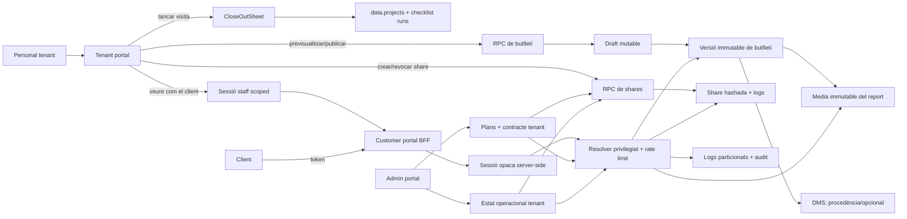

# Portal del client i butlletins d'intervenció

> **Estat:** pla de producte / arquitectura (actualitzat 2026-08-05, **CP-C**). Implementació en curs.
>
> **Objectiu:** butlletí HTML segur i immutable + portal persistent del client centrat en el **compte contacte** (empresa o persona). Publicació, visibilitat al portal, identitats d’accés i lliurament són conceptes separats.
>
> **Schema (local/dev):** reescriure migracions CP-A/CP-B + `db reset`; no acumular fixups additius mentre no hi hagi producció.
>
> **Control d'execució:** estat per milestone → [`STATUS.md`](./STATUS.md) · fase activa i gates → [`EXECUTION.md`](./EXECUTION.md). Aquest README és el contracte d'arquitectura; no duplica el tracking.

## Resum executiu

La primera entrega és la **Fase A**: un butlletí HTML segur, publicat explícitament des d'una ordre de servei tancada, que el tenant pot compartir per link i per email. El PDF adjunt queda fora de l'MVP; la vista HTML ha de ser imprimible.

La **Fase B** crea un portal del client persistent sobre la mateixa base de dades i seguretat. No s'ha de convertir la possessió d'un link de Fase A en dret de dashboard.

| Decisió | Resolució |
|---|---|
| Prioritat | Fase A: butlletí immutable + share segur; Fase B: portal persistent. |
| App pública | Nova `apps/customer-portal` Next.js, desplegada com a app germana. |
| `apps/public-portal` | Només es reutilitzen patrons i branding; no s'hi afegeixen rutes privades de client. |
| Artefacte publicat | Versió formal immutable de butlletí; no `checklist_runs.public_report_payload` directament. |
| Links | Bearer token aleatori de 256 bits, persistit només com a hash; sessió BFF opaca, expiració, revocació, rate limit distribuït i auditoria obligatòria. |
| Compte client | `projects.client_id` = empresa **o** persona. No cal persona artificial per publicar ni per accedir. |
| Punts de contacte | Email/telèfon verificables sobre qualsevol contacte (empresa o persona). Regles de lliurament per finalitat (`bulletin`, futur `invoice`). |
| Identitat portal | Grant live per `(auth_user_id, tenant_id, client_account_contact_id, principal)` on el principal és persona nominativa o bústia compartida; **no** `tenant_members` ni `app_role='customer'`. |
| Gestió d’accés | Fitxa Contactes + hub `/contacts?tab=portal_hub`. Settings = toggle, entitlements, BCC/remitent. |
| Sessió Fase B | El navegador rep només una cookie de sessió BFF opaca. No rep ni usa directament el JWT Supabase contra PostgREST. |
| Reutilització de grants | El patró d'inspecció és codi existent per Fase A. El patró d'auditor ISO és només un disseny encara no implementat: se'n reutilitzen principis, no codi ni garanties assumides. |
| Media publicada | Còpia immutable a storage dedicat del portal; mai referència viva al fitxer operatiu original. |
| `service_role` | Només dins una Edge Function dedicada de resolució. `apps/customer-portal` no rep la clau `service_role`. |
| Plans | Tots els plans inclouen `customer_portal`; els clients i usuaris externs no consumeixen `max_members` i no tenen límit contractual per seient. |
| Mode | `share_only` permet només accessos puntuals; `portal` és un superconjunt i permet shares i grants persistents, escollits per destinatari. |
| Fair use | Els llindars de shares, MAU i email mesuren cost/abús; no converteixen els clients en seats. Les restriccions operatives es gestionen separadament i s'auditen. |
| Vista staff | Preview fidel (versió) o sessió staff scoped a un **compte client** (o una versió); mai viewer universal de tots els clients. |
| Publicació ⊥ lliurament | Publicar no demana destinatari. Shares/email són lliuraments posteriors (manuals o `on_publish`). |

## Fets auditats

- `data.contacts` pot representar una empresa o una persona, i `data.contact_sites` les adreces d'intervenció. `data.projects.client_id` apunta a una sola fila.
- **No existeix una relació adequada empresa-persona** per dir quina persona representa una empresa, quin rol té, si segueix activa o si pot accedir al portal. `primary_contact_id` cobreix tutor/propietari o empresa mare; no és una afiliació laboral. Fase A necessita aquesta relació com a prerequisit.
- El tancament i la publicació són operacions separades: `CloseOutSheet` tanca la visita; `api.publish_project_client_report` genera el payload, persisteix una versió DMS JSON, marca `projects.client_report_published_at` i bloqueja l'execució posterior.
- `checklist_runs.public_report_payload` és mutable fins a publicar; les versions DMS existents són un historial d'escriptures JSON, no un artefacte formal publicat ni una vista pública.
- No hi ha un model genèric de grants per a col·laboradors externs. `attendance_inspection_access_links` és el millor referent: secret hashat, expiració, revocació, metadades d'accés i auditoria.
- Els links genèrics DMS/Storage no poden servir el part actual: el seu document és `external_link` amb JSON, no una versió nativa Storage. Tampoc cobreixen les garanties de sessió, rate limit i auditoria exigides per al portal.
- `apps/public-portal` barreja SEO, portal d'empleat, inspecció, recruitment i estacions. El seu rewrite de dominis personalitzats capturaria rutes privades noves.
- La RPC de publicació actual només comprova `data.can_access_project`; el filtre de rols a `ProjectDetailPage` és UI i no és una barrera de servidor suficient.
- [04-roles-and-permissions.md §4.9](../../product-design/04-roles-and-permissions.md#49-convidats--clients-amb-portal-lleuger) proposa `auth.users` + `app_role='customer'`. Aquesta decisió queda **corregida**: un rol escalar no suporta una persona que sigui membre intern d'un tenant i client d'un altre. Es conserva `auth.users`, però els grants live són l'autoritat.
- El patró de col·laborador/auditor ISO de [`docs/plans/ISO/pla-estrategic.md`](../ISO/pla-estrategic.md) és **disseny, no implementació**: no existeixen `external_access_grants`, `require_external_access` ni les RPC al codi. Fase B n'ha d'implementar i provar l'equivalent per a clients.
- [05-modules-roadmap.md](../../product-design/05-modules-roadmap.md) preveu "Portal client lleuger (share_links → V2 amb magic link si demanda)". Es divergeix conscientment perquè `share_links` no té sessió, rate limit ni auditoria suficients.
- Qualsevol `auth.users` és rol Postgres `authenticated`. Avui `tenant-portal/ProtectedRoute` només comprova que hi hagi sessió; per tant, abans de crear usuaris client cal auditar tota la superfície concedida a `authenticated` i afegir un gate de membre intern.
- `jwt_has_permission` llegeix claims que poden quedar obsolets fins al refresh. No és suficient tot sol per publicar o compartir dades de tercers.

## Arquitectura objectiu



### Separació de superfícies

| Superfície | Responsabilitat | No ha de fer |
|---|---|---|
| `tenant-portal` | Curation, publicació, share, revocació, preview fidel i inici de «veure com el client» | Exposar contingut públic directament ni impersonar tots els clients. |
| `apps/customer-portal` | BFF + vista read-only, sessió opaca scopejada (client o staff) i posterior dashboard del client | Entregar JWT Supabase al navegador, fer queries directes a PostgREST o oferir un selector global de clients al staff. |
| RPC / Edge controlat | Autorització tenant, construcció de projecció, resolució de shares/sessions staff i auditoria | Retornar dades més àmplies que el manifest o l'scope escollit. |
| `apps/public-portal` | Marketing SEO i superfícies existents | Hostatjar les rutes privades noves del client. |

## Decisions tancades

1. **Close-out no és publicació.** Tancar una visita és una finalització interna. Publicar crea un artefacte visible al client.
2. **Compte client i principals.** `customer_account_contact_id` (= `projects.client_id`) identifica qui contracta (empresa o persona). Els grants/invites s’autoritzen per compte + principal (`named_person` | `shared_mailbox`). La publicació **no** exigeix destinatari. El catàleg del portal és per compte; els lliuraments (share/email) són perversió i destinataris separats.
3. **Regeneració abans de publicar.** Refresca només un draft mutable separat.
4. **Correcció després de publicar.** `Crear versió corregida` genera un nou draft i una nova versió immutable. La fila de versió publicada no s'actualitza mai.
5. **Punter corrent fora de la versió.** `customer_intervention_reports.current_published_version_id` és mutable; `customer_intervention_report_versions` és append-only. La supersessió es registra en un ledger.
6. **Links estables per versió.** Un link sempre resol la versió assignada. Revocar i reemplaçar és explícit.
7. **Model de share dedicat.** `customer_report_shares` reutilitza propietats del patró d'inspecció, no la seva taula.
8. **Token i sessió Fase A.** El secret de 256 bits es mostra una sola vegada. S'intercanvia server-side per una sessió opaca hashada. Cada request revalida sessió, share, versió, host, kill-switch i límits abans de retornar dades.
9. **Copiar només en crear.** Una share existent no pot tornar a revelar el secret. La UI diu `Crear i copiar un nou link`; mai `Copiar` sobre una share antiga.
10. **Caducitat independent del canal.** Tot bearer link expira als 3 dies per defecte. Email/WhatsApp són metadata de lliurament, no controls de seguretat. Ampliar fins a 7 dies exigeix destinatari verificat i codi de segon canal obligatori.
11. **Email asíncron sense token en cua.** La cua conté una intenció de lliurament, no el bearer token. El worker crea el token en memòria immediatament abans d'enviar. Si l'enviament falla o queda en estat incert, revoca aquella share i un retry crea una de nova amb idempotency key de proveïdor.
12. **Auditoria control-plane transaccional.** Publicar, crear, lliurar, revocar, substituir i activar kill-switch fallen si no es pot persistir l'auditoria. No són fire-and-forget.
13. **Portal separat.** `apps/customer-portal` té host router, cookies, BFF i desplegament independents. No reutilitza PIN, cookies ni JWT browser del portal empleat.
14. **Continuïtat A a B.** Les shares Fase A funcionen independentment fins a expirar/revocar. Un link antic mai concedeix dashboard.
15. **Font única de veritat de publicació.** El punter de l'agregat és l'autoritat. Un trigger projecta `projects.client_report_published_at/_by` per compatibilitat i en prohibeix l'escriptura directa.
16. **Concurrència.** La publicació bloca projecte i agregat (`SELECT ... FOR UPDATE`) i usa índex únic per `(report_id, version_number)`.
17. **Kill-switch real.** Existeix a nivell tenant i plataforma. S'avalua a cada request i invalida sessions. Els mitjans passen pel BFF/proxy autoritzat; no es lliuren signed URLs que sobrevisquin a la revocació.
18. **Host vinculat al tenant.** El host es resol només des d'un registre de dominis verificats i ha de coincidir amb `share.tenant_id`. Un token no és portable entre dominis de tenants.
19. **Blast radius del BFF limitat.** El BFF no té `service_role`. Crida una Edge Function dedicada amb credencial interna rotatable; l'Edge només exposa operacions de customer portal i manté la clau privilegiada fora del runtime web.
20. **Clients il·limitats no són seats.** `customer_users_limit = null`; contactes, grants i identitats externes no consumeixen `plans.max_members`.
21. **`portal` inclou shares.** El mode és la capacitat màxima concedida al tenant, no una classificació global dels seus clients. Un tenant `portal` pot donar una share a un destinatari ocasional i un grant persistent a un altre.
22. **Cap bloqueig automàtic per MAU soft.** Superar el llindar genera alerta i revisió comercial. Tallar nous accessos, suspendre existents o activar el kill-switch exigeix una política operacional explícita i auditada.
23. **El tenant ha de poder veure el que veu el client.** Necessitat de suport quan el client consulta un butlletí o el portal. Es cobreix amb preview fidel i sessió staff scoped, no amb login universal.
24. **Cap viewer universal de clients.** El staff no entra a `customer-portal` com a viewer de tots els clients del tenant. Cada vista de suport té un scope explícit (versió/share o **compte client**) i no permet canviar de client dins de la sessió.
25. **Rols de relació no són ACL.** `contact_relationships.role` (`primary`, `billing`, `operations`, `other`) és etiqueta comercial. No concedeix portal ni dispara enviaments. Les finalitats viuen a `contact_delivery_rules`.
26. **Rewrite local.** Mentrestant no hi hagi producció del model, es reescriuen les migracions CP-A/CP-B i es fa `db reset`; no s’acumulen fixups additius per aquest redisseny.

## Vista staff: preview i «veure com el client»

### Objectiu

Quan un client digui que no veu una foto, que li falta un resum o que el dashboard no mostra una intervenció, el personal del tenant ha de poder reproduir **exactament** la mateixa projecció. Això és suport operatiu, no impersonació comercial genèrica.

### Dos mecanismes

| Mecanisme | On | Quan | Abast |
|---|---|---|---|
| Preview fidel | `tenant-portal` | Abans i després de publicar | Un draft o una `report_version_id` |
| «Veure com el client» | `customer-portal` amb sessió staff | Suport quan el client ja té link o portal | Una versió/share **o** una empresa+persona |

El preview del tenant-portal usa el **mateix template/renderer** que el reader públic. No és un mock aproximat. No genera bearer token públic ni compta com a MAU de client.

### Sessió staff scoped

Des de l'ordre, el panell de butlletí o la fitxa del contacte, l'acció `Veure com el client`:

1. exigeix membre intern actiu + `data.require_fresh_tenant_permission(..., field_service.reports.preview_as_customer)` i scope de projecte/contacte;
2. crea una sessió BFF opaca amb `actor_type=staff`, `staff_user_id`, TTL curt (15–30 min) i un sol scope:
   - Fase A: `report_version_id` i opcionalment `share_id`;
   - Fase B: `(tenant_id, customer_account_contact_id, person_contact_id)` sense ampliar a altres empreses;
3. obre el host del customer-portal amb cookie host-only; banner persistent i no descartable: «Vista de suport — no és la sessió del client»;
4. només lectura: sense crear shares, convidar, acceptar, revocar ni canviar de destinatari;
5. cada view/download queda a auditoria amb actor staff i correlació; no s'atribueix al client ni a `customer_mau`;
6. el kill-switch, `security_version` i `existing_access_policy` també invaliden sessions staff;
7. al caducar o tancar, cal una nova acció des del tenant-portal; no hi ha renovació silenciosa ni selector de clients a la UI del customer-portal.

No s'utilitza el JWT Supabase del staff dins del navegador del customer-portal. El handoff és server-side (codi single-use o creació directa de sessió staff) i no reutilitza magic links ni bearer tokens de client.

### Què queda explícitament fora

- Login permanent del staff a `customer-portal` com a «viewer de tots els clients».
- Canviar d'empresa/persona dins d'una sessió staff sense tornar al tenant-portal.
- Fer servir sessions staff per escriure en nom del client o per saltar-se la minimització de dades.
- Comptar vistes staff com a ús/MAU del client.

## Plans, entitlements, fair use i admin-portal

### Contracte de pla

Ampliar `data.plans.portal_entitlements` i el snapshot `data.tenants.tenant_portal_entitlements` amb un tercer canal:

```json
{
  "customer_portal": {
    "included": true,
    "mode": "portal",
    "customer_users_limit": null,
    "active_share_guardrail": 500,
    "customer_mau_alert_threshold": 1000,
    "included_email_deliveries_month": 2000
  }
}
```

La notació documental `"share_only|portal"` significa «un dels dos valors»; mai es persisteix literalment. Semàntica:

- `included = false`: no es poden crear shares ni grants, independentment del mode.
- `mode = share_only`: es poden crear shares puntuals de Fase A, però no invitacions ni grants persistents.
- `mode = portal`: és un superconjunt; permet shares puntuals i accés persistent de Fase B. El staff escull el mecanisme per destinatari i operació.
- `customer_users_limit = null`: sense quota de contactes, invitacions, grants o identitats externes. No consumeixen `max_members`.
- `active_share_guardrail`: màxim operacional de shares actives simultànies. Arribar-hi impedeix crear-ne de noves fins que se'n revoquin/caduquin o un admin elevi el guardrail; no revoca shares ni grants existents.
- `customer_mau_alert_threshold`: llindar soft de persones autenticades diferents amb sessió de portal satisfactòria durant el mes. Només alerta; no bloqueja.
- `included_email_deliveries_month`: enviaments inclosos. Superar-los aplica la política comercial configurada —overage, revisió o bloqueig de nous emails— però no talla per si sol l'accés web.

Tots els plans vigents se sembren amb `included = true`. Durant CP-A la capacitat efectiva màxima de producte és `share_only`; quan CP-B estigui disponible, tots els plans passen additivament a `portal`. El rollout global impedeix anunciar o executar una capacitat encara no desplegada.

La retenció no forma part de l'entitlement comercial: versions, media, shares, sessions i logs segueixen polítiques de retenció diferenciades, aprovades per RGPD/legal. Un downgrade no pot escurçar ni destruir evidència sota obligació de conservació.

### Resolució efectiva i grandfathering

La capacitat efectiva és la intersecció de:

1. funcionalitats disponibles al rollout de plataforma;
2. `data.plans.portal_entitlements.customer_portal`;
3. contracte snapshot del tenant, amb el grandfathering existent;
4. toggle `enabled` i estat operacional del tenant;
5. kill-switch global de plataforma.

`data.resolve_portal_entitlements(tenant_id)` ha de retornar també:

```json
{
  "customer_portal": {
    "included_granted": true,
    "included_plan": true,
    "enabled_by_tenant": true,
    "effective": true,
    "mode_granted": "portal",
    "mode_plan": "portal",
    "mode_effective": "portal",
    "can_create_shares": true,
    "can_grant_portal_access": true,
    "customer_users_limit": null
  }
}
```

Els frontends consumeixen `can_create_shares` i `can_grant_portal_access`; no reimplementen la jerarquia de modes. La sync amb el pla només aplica millores (`share_only -> portal`, guardrails més alts o més emails) i no retira drets existents. Qualsevol reducció contractual és una acció admin explícita, amb confirmació, motiu i auditoria.

### Estat operacional per tenant

Els entitlements expressen drets comercials; no s'utilitzen com a kill-switch. Ampliar `data.customer_portal_tenant_state` amb:

- `enabled`.
- `new_access_policy`: `allow | review | blocked`.
- `new_share_policy`: `allow | blocked`.
- `existing_access_policy`: `allow | blocked`.
- `restriction_reason`: `abuse | non_payment | incident | manual`.
- `restriction_note`, `restricted_at`, `restricted_by` i `review_at`.
- `security_version`, ja utilitzat per invalidació O(1).

Comportament:

- `new_access_policy = blocked` impedeix invitacions i nous grants, però manté sessions/grants existents.
- `new_access_policy = review` crea una sol·licitud de revisió admin i no activa el grant fins a aprovar-la.
- `new_share_policy = blocked` impedeix noves shares, sense revocar les existents.
- `existing_access_policy = blocked` suspèn grants i sessions persistents; les shares es regeixen per revocació/kill-switch.
- `enabled = false` o el kill-switch de plataforma talla tota la superfície i incrementa `security_version`.

Les RPC de crear share, convidar, acceptar invitació i crear grant comproven entitlement i estat live. El BFF comprova l'estat live a cada request de sessió, HTML i media. No es confia en un valor JWT o cachejat per aplicar restriccions.

### Mesurament

Crear `data.customer_portal_usage_monthly`, o una projecció agregada equivalent, amb una fila per tenant i mes:

- `customer_mau`: `auth_user_id` diferents amb sessió persistent satisfactòria; és la mètrica interna comparable amb MAU, no la factura per-tenant de Supabase.
- invitacions creades/acceptades, grants actius i grants revocats;
- shares creades, shares actives, sessions de share i destinataris actius;
- visualitzacions, descàrregues i intents bloquejats;
- emails intentats, lliurats i fallits;
- storage immutable i egress atribuïble quan estigui disponible.

Les sessions anònimes de share es mostren separades de `customer_mau`: obrir un bearer link no crea `auth.users` ni MAU Supabase. Les sessions staff (`actor_type=staff`) tampoc entren a `customer_mau` ni a les mètriques d'ús del client; tenen comptadors/auditoria propis. Els comptadors de control de creació han de ser live/atòmics; els agregats mensuals serveixen per analítica, alertes i revisió comercial.

### Funcionalitats d'admin-portal

Ampliar les superfícies existents:

1. **`PlansPortalEditor`:** tercer canal `Customer portal` amb `included`, `mode`, `customer_users_limit` read-only com a «Il·limitat», guardrail de shares, llindar MAU i emails inclosos. Validar rangs i preservar canals JSON desconeguts en desar.
2. **`TenantPortalsTab`:** mostrar pla, contracte snapshot i valor efectiu; mode i capacitats resoltes; «Clients il·limitats»; consum del mes contra llindars; sync additiva amb el pla.
3. **Controls operacionals del tenant:** separar-los visualment del contracte. Permetre bloquejar nous accessos, bloquejar noves shares, suspendre accessos existents i desactivar totalment, sempre amb resum d'impacte, confirmació, motiu, nota i data de revisió.
4. **Dashboard `/dashboard/customer-portal`:** tenants actius/restringits, customer MAU global i per tenant, shares actives, emails, storage/egress, errors, top tenants per ús i alertes sobre llindars.
5. **Fitxa del tenant:** llistat paginat de grants, invitacions, shares i últims accessos; cerca per empresa/persona; revocació individual; historial de restriccions i auditoria.
6. **Control de plataforma:** kill-switch global visible només per admin, amb confirmació reforçada i invalidació per `security_version`. Suport pot consultar diagnòstic i mètriques, però no canviar contractes ni controls destructius.

Accions mínimes d'auditoria: canvi de pla/contracte, sync, canvi de mode/guardrail, bloqueig/desbloqueig de cada política, aprovació de review, revocació individual i kill-switch. El payload conserva abans/després, actor, motiu i correlació; mai tokens, magic links ni dades personals innecessàries.

## Contracte de dada pública

La versió publicada ha de sortir d'una projecció allowlist explícita.

### Inclòs, quan correspongui

- Identificació mínima del tenant, empresa/persona client, destinatari, local i intervenció.
- Data, estat i resum de servei redactat per al client.
- Items de checklist seleccionats, amb snapshots de label/estat segurs.
- Fotos o fitxers aprovats explícitament, copiats a storage immutable del report i amb manifest congelat.
- Contacte de suport del tenant.

### Exclòs sempre per defecte

- `work_notes_html`, descripcions internes i notes de tècnic.
- Costos, marges, preus interns, imports de material i operativa interna.
- Valors, notes, resolucions i motius de bypass de checklist que no estiguin marcats explícitament com a segurs.
- Dades d'altres clients, identificadors interns, URLs Storage directes i metadades innecessàries.
- Fotos/adjunts només per estar associats a l'ordre: cal selecció explícita.

No s'ha de construir HTML públic concatenant HTML ric emmagatzemat sense sanitització de servidor.

## Prerequisit: compte client, relacions i punts de contacte (CP-C)

- **Compte client** = `projects.client_id` (empresa o persona). No cal persona artificial per publicar.
- `contact_relationships`: afiliació empresa↔persona; unicitat activa `(tenant, org, person)`; rol comercial opcional (`primary`, `billing`, `operations`, `other`) — **no ACL**. Offboarding = desvincular (revoke), no DELETE.
- `contact_delivery_channels`: punts de contacte (email/phone) sobre **qualsevol** contacte; CRM `contacts.email/phone` no compten com a verificats sols.
- `contact_delivery_rules`: `(client_account, contact_point, purpose)` amb `bulletin`/`invoice` i política `manual`/`on_publish`.
- Grants/invites: `client_account_contact_id` + principal (`named_person` | `shared_mailbox`).
- Draft/versió: només `customer_account_contact_id` (sense recipient). Shares/intents porten el destinatari del lliurament.

## RGPD i retenció

El tenant és habitualment el responsable del tractament; la plataforma actua com a encarregada sota el DPA. La base jurídica habitual per compartir un part d'intervenció és l'execució del contracte de servei.

Abans d'enviar, la UI ha de mostrar empresa client, persona destinatària, canal, caducitat i projecció segura. Una petició de baixa, oposició o supressió revoca immediatament shares, grants i sessions actives de la persona, registra l'acció i aplica la política de retenció/obligació legal configurada.

La supressió del CRM no es propaga destruint evidència publicada. Les versions sota obligació legal es conserven amb accés bloquejat o dades pseudonimitzades segons la política aplicable. La revocació no pot retirar contingut ja copiat, imprès o descarregat.

## Model mínim de dades

### Butlletins i versions

Crear:

- `data.customer_intervention_reports`: agregat mutable, un per projecte/tipus, amb `current_published_version_id`.
- `data.customer_intervention_report_drafts`: curation mutable, media seleccionada i destinatari proposat.
- `data.customer_intervention_report_versions`: artefactes publicats estrictament append-only.
- `data.customer_intervention_report_events`: ledger de publicació, correcció, supersessió i retenció.

Cada versió conserva:

- `tenant_id`, `project_id`, `customer_account_contact_id`, `recipient_person_contact_id`, `contact_site_id`.
- Número de versió, referència de procedència al draft i timestamps; no `is_current` mutable.
- Manifest JSON/HTML report-safe, versió de schema/template, locale i digest de contingut.
- Referències a **còpies immutables** de mitjans en un bucket/prefix privat `customer-report-media`, amb object key no reutilitzable, checksum, MIME i mida.
- Mai binari/base64 incrustat a la fila. El JSON actual (`external_link` amb `data:application/json;base64,...`) no es replica.
- Actor creador/publicador i referències de procedència al payload checklist/DMS.

La publicació és una màquina d'estats `draft -> preparing_media -> published|failed`. Un orchestrator copia i verifica tots els mitjans abans de crear la versió immutable i moure atòmicament el punter de l'agregat. Si falla una còpia, no hi ha versió publicada i es netegen objectes orfes.

La versió suggerida per a noves shares és la corrent; les anteriors es retenen com a evidència. Les polítiques Storage impedeixen overwrite/delete ordinari dels objectes publicats; només el job de retenció privilegiat els pot purgar quan correspon.

### Shares i accessos

Crear `data.customer_report_shares` amb:

- Scope obligatori `tenant_id`, `customer_account_contact_id`, `recipient_person_contact_id`, `project_id`, `report_version_id`.
- Secret aleatori de 256 bits, persistit només com a SHA-256, retornat una sola vegada.
- Canal, creació, expiració, revocació, motiu, actor i límits de sessió/ús.
- Estat de confirmació de segon canal quan s'ha concedit TTL ampliat i snapshot immutable de creació.
- `session_version` incrementat en revocació o substitució de la share.

Crear `data.customer_portal_share_sessions` amb secret de sessió hashat, share/version, `session_version`, expiració curta, últim ús i revocació. La cookie només conté el secret opac.

Crear `data.customer_portal_staff_sessions` (o un discriminator `actor_type` a les sessions del portal) amb:

- `staff_user_id` (membre intern), `tenant_id` i scope exclusiu de versió/share **o** empresa+persona;
- secret hashat, TTL curt, `session_version`, revocació i captura de `security_version` tenant/plataforma;
- prohibició de scope «tot el tenant» o de llista de clients a la sessió.

Crear `data.customer_portal_tenant_state` amb `tenant_id`, toggle, polítiques d'accés/share, restricció, revisió, `security_version`, motiu i actor segons la secció d'entitlements. La plataforma manté un estat i `security_version` globals equivalents. Cada sessió captura ambdues versions. Un kill-switch incrementa una sola fila O(1), no actualitza milions de shares/sessions.

Totes les funcions privilegiades de resolució viuen en schema privat/no exposat. **`REVOKE EXECUTE ... FROM PUBLIC, anon, authenticated`** i `GRANT` només a `service_role`. Només una Edge Function dedicada les crida. El BFF no conté `SUPABASE_SERVICE_ROLE_KEY` i cap RPC de lectura de share és cridable des de PostgREST.

Crear `data.customer_report_share_access_logs` append-only i **particionada mensualment** per `accessed_at`, seguint [`employee_portal_access_logs`](../../../supabase/migrations/20260823000001_employee_portal_core.sql). Índexs locals obligatoris `(tenant_id, accessed_at DESC)`, `(share_id, accessed_at DESC)` i `(session_id, accessed_at DESC)`. La retenció elimina particions completes, no milions de files amb `DELETE`.

Els intents amb token desconegut no tenen tenant/share conegut: van a un ledger d'abús de plataforma separat, amb IP minimitzada i retenció curta. No s'inventen tenant IDs ni es guarden tokens crus.

Les FK dels logs no fan cascada destructiva. Les shares es revoquen i retenen; no s'esborren mentre existeix evidència d'accés.

## Seguretat del reader

| Control | Requisit |
|---|---|
| Resolució | Boundary privilegiat, resposta externa idèntica per token desconegut, expirat o revocat. RPC subjacent sense `EXECUTE` per a `anon`/`PUBLIC`. |
| Rate limit | Distribuït per IP/token, IP/tenant, sessió i descàrrega. **No reutilitzar tal qual** [`rate-limit.ts`](../../../apps/public-portal/lib/rate-limit.ts): el fallback local per instància no protegeix dades personals. El customer portal falla tancat en creació de sessió/descàrrega i alerta quan el backend distribuït no respon. |
| Media | El navegador demana `/media/{id}` al BFF. El BFF revalida sessió/share/kill-switch i fa streaming privat amb suport Range. No exposa Storage paths ni signed URLs reutilitzables després de revocar. |
| Metadades | IP i user-agent derivats al servidor; mai rebuts del client com a font de veritat. |
| Sessió | Secret opac hashat server-side; cookie host-only, `HttpOnly`, `Secure`, `SameSite=Lax`, curta i scopejada. Cada request compara `session_version` live. |
| Tokens URL | Landing server-side amb headers privats abans de renderitzar; intercanvi immediat, redirect a URL neta i `history` sense token. Mai PostgREST, analytics, logs ni referer. |
| Indexació | `robots.ts` amb `Disallow: /`, meta noindex/nofollow i `X-Robots-Tag`. |
| Cache | `Cache-Control: private, no-store`. |
| Navegador | CSP restrictiva, `frame-ancestors 'none'`, `Referrer-Policy: no-referrer` i `connect-src` limitat. |
| Contingut | El resum redactat pel tècnic i qualsevol camp de text lliure destinat al client passa per un sanitizer d'allowlist estricta al servidor (sense `<script>`, sense atributs d'event, sense `style` arbitrari). Mai concatenar HTML emmagatzemat sense sanititzar: aquí l'abast és més gran que les notes internes perquè el contingut arriba a navegadors de tercers no autenticats. |
| Abús | Llindars numèrics concrets, no "anomalia" genèrica: p. ex. >20 resolucions fallides/hora/IP → bloqueig temporal; >5 codis de confirmació fallits per share → auto-revocació + alerta. CAPTCHA només per escalada per sobre d'aquests llindars. |
| Avís legal | La pàgina pública mostra un enllaç d'informació RGPD (Art. 13) del tenant, ja que el destinatari pot no haver vist mai la política de privacitat original. |
| Host | Resolució només contra dominis verificats. El tenant del host, share, versió, contacte i media ha de coincidir en una única consulta autoritzada. |
| Kill-switch | Flags/version live de plataforma i tenant comprovades a cada request. Activar-les incrementa una única `security_version` O(1), invalida lògicament totes les sessions i genera audit d'alta severitat. |
| Auditoria | Creació de sessió, primer report view per sessió, descàrrega i operacions control-plane fallen tancat si no es pot deixar registre durable. Range chunks/assets repetits no creen logs duplicats: usen request/idempotency key. |
| Sessió staff | Mateixa frontera BFF/Edge que el client, amb `actor_type=staff`, scope únic, banner, read-only, TTL curt i audit amb `staff_user_id`. No reutilitza bearer/magic link del client ni concedeix selector multi-client. |

## Permisos

Afegir i aplicar a SQL i frontend:

- `field_service.reports.publish`
- `field_service.reports.regenerate`
- `field_service.reports.share`
- `field_service.reports.revoke`
- `field_service.reports.preview_as_customer`

Cada RPC sensible ha de cridar `data.require_fresh_tenant_permission(tenant_id, permission, project.site_id)` i validar també el scope del projecte. Cal actualitzar coordinadament catàleg SQL, validació API, `PermissionKey`, dependències, defaults i editor. La visibilitat del projecte és una condició addicional, no substitut del permís.

Per a aquestes operacions sensibles, `jwt_has_permission` no és suficient per si sol. Crear `data.require_fresh_tenant_permission(...)` que:

1. comprova live que `auth.uid()` continua sent membre intern actiu del tenant;
2. comprova tenant/site/project;
3. compara `permissions_updated_at` i canvis de membresia amb l'emissió del JWT;
4. si el claim és obsolet, rebutja amb `session_refresh_required`;
5. només llavors avalua la capacitat.

La revocació d'un permís o membresia talla publicar/compartir sense esperar una hora.

**Advertència de desplegament:** avui `permissions.ts` no té domini `field_service`/`projects`. Afegir enforcement sense sembrar defaults deixa tothom sense publicar. Catàleg, validador SQL, defaults owner/manager, editor, tipus i enforcement entren al mateix canvi.

## Frontera d'identitat Fase B

### Decisió

- `auth.users` identifica la persona, però no determina per si sol el tipus d'accés.
- No s'escriu un `app_role='customer'` exclusiu. Una persona pot tenir membresies internes i grants de client simultàniament.
- `data.customer_access_grants` és l'autoritat live per al portal client.
- El browser customer rep una sessió BFF opaca, no l'access token Supabase.
- `tenant-portal` exigeix almenys una `tenant_members` interna activa; una sessió amb només grants client és rebutjada abans de carregar l'AppLayout.

### Gate obligatori abans de CP-B

Inventariar totes les views, taules i funcions concedides a `authenticated`. Executar tests negatius amb un usuari real que tingui `customer_access_grants` però cap `tenant_members`. No es llança CP-B mentre qualsevol RPC/view interna retorni dades o executi efectes només perquè `auth.uid()` existeix.

### Invitació i vinculació

Crear `data.customer_access_invitations`:

1. staff selecciona empresa + persona relacionada i email verificat;
2. Edge privilegiada convida o vincula un `auth.users` existent sense canviar-li rols interns;
3. el link d'acceptació és single-use, expirable i hashat;
4. en acceptar, activa `customer_access_grants`;
5. accessos posteriors usen magic link amb `shouldCreateUser: false`;
6. mai es vincula un compte només per coincidència d'email sense acceptació.

Per a domini custom, el callback d'auth torna primer a un domini de sistema allowlisted, crea un codi de handoff single-use i redirigeix al domini verificat. El BFF del domini destí intercanvia el codi i fixa la cookie host-only.

## Roadmap

### CP-0: Contracte i documentació

1. Actualitzar `docs/product-design/13-customer-portal-architecture.md` amb el model post-`public-portal`.
2. Corregir `docs/product-design/04-roles-and-permissions.md`: `app_role='customer'` escalar queda substituït per identitat `auth.users` + grants live compatibles amb doble persona.
3. Corregir `docs/plans/maintenance/README.md`: el payload existent és snapshot d'execució mutable; la versió publicada és l'autoritat immutable.
4. Situar el milestone de butlletí després de FS-3 a `docs/plans/field-service/05-backlog-epics.md`; conservar el portal light a V2.
5. Acordar la projecció pública allowlist i la política de retenció abans de crear schema → [`projection-and-retention.md`](./projection-and-retention.md).
6. Definir DPA/base jurídica, text Art. 13 i responsabilitat del tenant sobre destinataris → [`legal-and-dpa.md`](./legal-and-dpa.md). Implementació transversal (Legal Center, cookies, LSSI): [`../legal-compliance/README.md`](../legal-compliance/README.md).
7. Tancar schema/versionat de `customer_portal` dins `portal_entitlements`, semàntica de `mode`, fair use i textos comercials de «clients il·limitats subjectes a ús raonable» → [`entitlements-contract.md`](./entitlements-contract.md).

### CP-A0: Contactes i migració del llegat

1. Crear `contact_relationships`, `contact_delivery_channels`, UI mínima de relació/verificació i offboarding.
2. Afegir selecció/validació de persona destinatària al draft/share.
3. Inventariar projectes amb `client_report_published_at`, DMS `field_service_intervention_report` i payloads existents.
4. Backfill: crear agregat + versió v1 des de l'últim payload DMS vàlid, preservant `published_at/by`.
5. Si falta payload o n'hi ha múltiples d'ambigus, marcar `legacy_unresolved`; mantenir el projecte bloquejat i prohibir shares fins a revisió.
6. Activar el trigger de compatibilitat perquè `projects.client_report_published_at/_by` derivi sempre del nou agregat. Prohibir escriptura directa.
7. Fer rollout dual-read temporal, reconciliar comptatges i retirar l'autoritat antiga només després de validació.

### CP-A1: Domini immutable i autorització

1. Afegir agregat, drafts, versions immutables i ledger d'esdeveniments.
2. Crear bucket/prefix privat de media publicada amb no-overwrite i purga només per retenció privilegiada.
3. Crear RPCs de preview, preparació de media, publicació atòmica i versió corregida.
4. Publicar només després de copiar/verificar media; moure el punter corrent i bloquejar treball en una transacció.
5. Crear `require_fresh_tenant_permission` i aplicar permisos granulars en servidor/UI.
6. Auditar transaccionalment `CLIENT_REPORT_PUBLISHED`, `CLIENT_REPORT_VERSION_CREATED`, supersessió i errors de preparació.
7. Regenerar `database.types.ts` a tenant portal i Edge Functions després de cada migració rellevant.

### CP-A2: Control plane de shares i lliurament

1. Crear shares hashades, sessions opaques, kill-switches i logs mensualment particionats.
2. Implementar RPCs tenant-authenticated per crear, llistar i revocar amb validació de tenant, empresa, persona, relació, projecte, site i permís fresh.
3. Crear Edge resolver dedicada; només aquesta manté `service_role` i crida funcions privades amb expiració/revocació/session-version/límits atòmics.
4. Aplicar rate limiting distribuït fail-closed i ledger separat per tokens desconeguts.
5. Link manual: generar secret, persistir hash i retornar-lo una vegada per `Crear i copiar`.
6. Email: encuar una intenció sense secret. El worker crea share/token just abans d'enviar; en error/estat incert revoca i el retry crea una share nova. Usar idempotency key del proveïdor.
7. Fer que auditoria control-plane i creació/revocació siguin atòmiques; cap share activa sense esdeveniment durable.
8. Aplicar `included`, `mode`, `active_share_guardrail`, `new_share_policy` i comptador d'emails live abans de crear o lliurar.

### CP-A3: UX de butlletí al tenant

1. Afegir tab o panell `Butlletí` a l'ordre tancada, junt a la superfície `Feina`.
2. Mostrar estats: sense draft, preparant media, preview modificada/no publicada, versió publicada, shares actives, versió corregida, share revocada i llegat pendent de revisar.
3. Mostrar explícitament empresa client, persona destinatària, caducitat i camps/media que es publicaran.
4. Accions: preview fidel (mateix template que el reader), regenerar draft, publicar, crear versió corregida, seleccionar media, crear i copiar **nou** link, enviar email, veure accessos, revocar, revocar/reemplaçar i `Veure com el client`.
5. No mostrar `Copiar` en una share existent perquè el secret no és recuperable.
6. Aplicar `react-i18next` amb clau i fallback català a tot text nou visible.

### CP-A4: Reader públic i operació

1. Crear `apps/customer-portal` amb host dedicat com `{tenant}.customer.{platform-domain}`.
2. Reutilitzar el registre/verificació de dominis per CNAME opcional; normalitzar host i lligar-lo al tenant.
3. Implementar landing server-side, intercanvi a sessió opaca, redirect net i headers privats abans de renderitzar.
4. Implementar BFF reader i media proxy amb revalidació live, Range i `no-store`; el BFF delega dades/media a l'Edge resolver amb credencial interna rotatable.
5. Crear reader HTML mobile-first, read-only, imprimible i amb branding/contacte de suport.
6. Implementar handoff staff scoped: creació de `customer_portal_staff_sessions`, banner «Vista de suport», read-only, TTL curt i auditoria amb `staff_user_id` sense comptar com a MAU de client.
7. Afegir runbook de token compromès, kill-switch, retenció, rate limits, routing/noindex/cache, fallada del backend distribuït i abús/revocació de sessions staff.

### CP-B: Portal client light

1. **Gate CP-B0:** auditar totes les concessions a `authenticated`, afegir gate de membre intern al tenant-portal i tests negatius amb customer-only user.
2. No crear `customer_portal_identities` ni `tenant_members`. Reutilitzar `auth.users` sense rol escalar exclusiu i crear `customer_access_invitations`, `customer_access_grants` i `customer_portal_sessions`.
3. Un grant vincula `auth_user_id`, tenant, empresa, persona relacionada i sites/capacitats; mai email global.
4. Implementar invitació/acceptació. Després, magic link amb `shouldCreateUser: false`; resposta idèntica existeixi o no el compte, amb rate limit IP/email.
5. El callback queda al BFF: el navegador no rep JWT Supabase. El BFF emet sessió opaca pròpia.
6. Revocació en calent amb `session_version`, comprovada a cada BFF request. Realtime pot accelerar invalidació UX però no és control d'autorització.
7. Crear helpers privats `SECURITY DEFINER` amb `search_path` fixat que calculen projeccions visibles. No s'exposen a `authenticated`; l'Edge resolver les crida amb service role després de validar sessió/grant. El BFF mai té accés DB privilegiat general.
8. Offboarding: tancar `contact_relationships`, desactivar canals, revocar grant i totes les sessions d'aquella persona sense afectar altres persones de l'empresa.
9. Navegació mòbil simple: activitat, butlletins, properes visites i contacte.
10. Factures, galeries i resums són mòduls posteriors amb scope explícit propi.
11. Aplicar `mode = portal` i `new_access_policy` a invitació/acceptació/grant; els accessos persistents no desactiven la possibilitat de crear shares puntuals.
12. Ampliar «Veure com el client» a scope empresa+persona d'un sol grant; la llista de clients roman al tenant-portal i no hi ha selector multi-client al customer-portal.

### CP-ADM: Entitlements, operació i estadístiques

1. Ampliar defaults, validació, snapshot, sync additiva i `resolve_portal_entitlements` amb `customer_portal`.
2. Sembrar tots els plans amb `included = true`; `share_only` durant CP-A i migració additiva a `portal` en activar CP-B per a tots els plans.
3. Crear estat operacional tenant/plataforma, workflows `review/blocked`, confirmacions i auditoria abans/després.
4. Ampliar `PlansPortalEditor` i `TenantPortalsTab` sense barrejar contracte amb suspensions operatives.
5. Crear agregació mensual i dashboard global/per tenant amb alertes, sense bloqueig automàtic per MAU soft.
6. Afegir llistats operatius de grants, invitacions, shares i accessos; revocació individual i historial.
7. Integrar estat de cobrament només com a senyal per revisió/restricció explícita; l'overage i la facturació automàtica queden fora d'aquest milestone.

## Continuïtat Fase A a Fase B

Les shares ja enviades funcionen independentment fins que expiren o es revoquen. Un cop verificada una identitat amb grant actiu per la mateixa empresa/persona, el dashboard pot mostrar versions autoritzades pel grant.

No es relinken shares silenciosament, no s'inspecciona un token antic per crear drets i no es converteix possessió de link en grant. La UI autenticada pot mostrar una versió que també tenia una share perquè el grant la cobreix, no perquè s'hagi migrat el token.

## Validació requerida

1. **Contactes:** empresa/persona del mateix tenant, relació activa, canvi de destinatari, offboarding i denegació cross-company.
2. **Migració:** tots els projectes publicats antics queden amb versió v1 o `legacy_unresolved`; cap projecte es desbloqueja ni duplica autoritat.
3. **SQL intern:** ownership, site scope, permís fresh, membresia revocada, visita tancada, atomicitat, immutabilitat, correccions i supersessió.
4. **Media:** còpia immutable, checksum, no-overwrite, fallada parcial, cleanup d'orfes, retenció i font original eliminada sense trencar report publicat.
5. **Minimització:** notes internes, costos, bypass, HTML arbitrari, clients múltiples i metadata no arriben al DTO.
6. **Shares/sessions:** hash, expiració, session-version, kill-switch tenant/plataforma, límits atòmics, logs i revocació immediata de HTML i media.
7. **Email:** la cua no conté secret cru, retries idempotents, share revocada en error/incertesa i audit durable.
8. **Abús:** rate limit distribuït, backend caigut fail-closed, token desconegut, codi de segon canal i cap oracle de compte.
9. **Frontera auth:** customer-only JWT contra totes les views/RPC `authenticated`; zero dades/efectes interns. Tenant-portal rebutja customer-only però permet persona amb membresia interna real.
10. **E2E:** preview -> media -> publicar -> crear/enviar -> reader -> log -> revocar -> versió corregida. L'antic conserva contingut només fins a revocar.
11. **Host/routing:** token d'un tenant en host d'un altre, CNAME no verificat, callback handoff replay, cookie isolation i noindex/cache/CSP/referrer.
12. **Càrrega:** resolver, media proxy Range, particions mensuals, purga per partició, rate limiter i milers de sessions concurrents.
13. **Entitlements:** matriu `included/mode/contracte/toggle/estat/rollout`; `portal` permet share i grant, `share_only` denega només grant, i cap client consumeix `max_members`.
14. **Restriccions:** `review/blocked` per nous accessos, bloqueig de noves shares, suspensió d'existents i kill-switch; comprovar impacte selectiu, invalidació O(1) i audit abans/després.
15. **Fair use:** guardrail de shares atòmic, MAU soft només alerta, emails mensuals i concurrència de comptadors; sessions share excloses de customer MAU.
16. **Admin-portal:** permisos admin/support, sync només additiva, confirmacions destructives, dashboard agregat, paginació/cerca i absència de secrets o PII innecessària.
17. **Vista staff:** preview fidel bit-a-bit amb el reader; handoff scoped; banner; read-only; TTL; audit amb `staff_user_id`; denegació de scope multi-client, escriptura i atribució a `customer_mau`; kill-switch invalida també sessions staff.

## Fora d'abast inicial

- PDF adjunt i renderització tipogràfica perfecta.
- Signatura client end-to-end.
- Facturació/overage automàtics, pagaments, stock i autoservei ampli; l'admin sí pot aplicar restriccions manuals per impagament o ús abusiu.
- Dashboard multi-recurs complet.
- Abstracció genèrica de col·laborador extern; els grants client són específics però no assumeixen codi ISO inexistent.
- Comptes email/password convencionals.
- Migrar automàticament possessió de links antics a permisos persistents.
- Login permanent del staff a `customer-portal` com a viewer de tots els clients, o selector multi-client dins d'una sessió de suport.

## Referències de codi i documents

- [STATUS d'implementació](./STATUS.md)
- [EXECUTION (fase activa)](./EXECUTION.md)
- [Projecció i retenció](./projection-and-retention.md)
- [Legal / DPA / Art. 13](./legal-and-dpa.md)
- [Legal & Compliance plataforma](../legal-compliance/README.md)
- [Contracte entitlements](./entitlements-contract.md)
- [Arquitectura Customer Portal](../../product-design/13-customer-portal-architecture.md)
- [Rols i permisos](../../product-design/04-roles-and-permissions.md)
- [Motor de manteniment](../maintenance/README.md)
- [Backlog field service](../field-service/05-backlog-epics.md)
- [Disseny auditor ISO](../ISO/pla-estrategic.md)
- [ProjectDetailPage](../../../apps/tenant-portal/src/features/projects/components/ProjectDetailPage.tsx)
- [CloseOutSheet](../../../apps/tenant-portal/src/features/field-service/components/CloseOutSheet.tsx)
- [checklistTemplatesService](../../../apps/tenant-portal/src/features/field-service/api/checklistTemplatesService.ts)
- [permissions.ts](../../../apps/tenant-portal/src/lib/permissions.ts)
- [ProtectedRoute](../../../apps/tenant-portal/src/components/ProtectedRoute.tsx)
- [Publicació actual](../../../supabase/migrations/20261159000024_publish_project_client_report.sql)
- [RPCs checklist](../../../supabase/migrations/20261159000002_checklist_maintenance_engine_rpcs.sql)
- [Contactes core](../../../supabase/migrations/20260503000005_contacts_core.sql)
- [Accés d'inspecció](../../../supabase/migrations/20261054000001_attendance_inspection_access_ex092.sql)
- [Document share links](../../../supabase/migrations/20260506000002_documents_share_links.sql)
- [Employee portal core](../../../supabase/migrations/20260823000001_employee_portal_core.sql)
- [Resolver document share](../../../supabase/functions/resolve-document-share/index.ts)
- [Public portal proxy](../../../apps/public-portal/proxy.ts)
- [Rate limiter public portal](../../../apps/public-portal/lib/rate-limit.ts)
