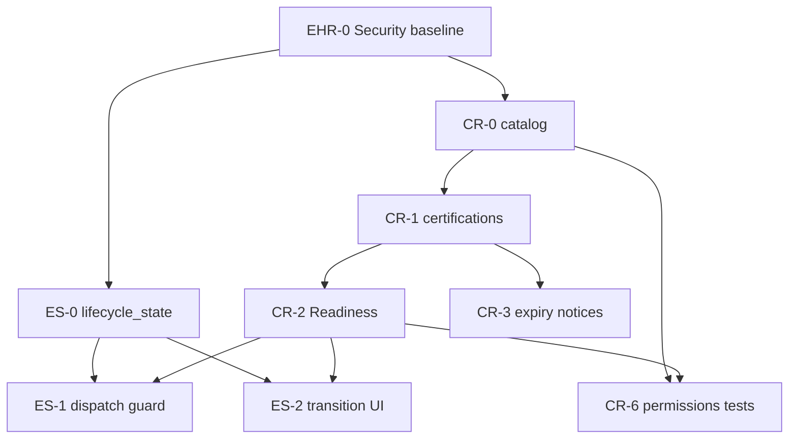

# Pla mestre d'execució — Employees / HR Core (EHR + ELM)

> **Rol:** única font de veritat de l'ordre d'implementació i del treball pendent  
> **Creat:** 2026-07-20  
> **EHR-0:** ✅ tancat — security baseline, vistes, permisos, tests 6/6, types regenerats  
> **ES-0 + CR-0:** ✅ tancats — migracions aplicades, tests 6/6 + 5/5, UI catàleg compliance  
> **CR-1 + ES-2:** ✅ tancats — certificacions + transition RPC + UI  
> **CR-2:** ✅ tancat — `compute_employee_readiness` tenant-scope + badge UI  
> **ES-1:** ✅ tancat — dispatch eligibility + gate opcional `start_work_log`  
> **CR-3:** ✅ tancat — avisos caducitat + cron diari  
> **CR-6:** ✅ tancat — RLS 4 rols + medical isolation + portal RPC  
> **Smoke MVP-ELM:** ✅ tancat  
> **EHR-1:** ✅ tancat — perfil V2 + foto + vincle user_id + UI  
> **EHR-2:** ✅ tancat — posicions, tags, manager, organigrama  
> **EHR-3:** ✅ tancat — perfil privat + sync document_id + UI  
> **EHR-5 mínim:** ✅ tancat — skills talent (catàleg + assignacions + cerca)  
> **EHR-4 / EC mínim:** ✅ tancat — EC-0..EC-3 (model + efectiu + UI; firma/plantilles diferits)  
> **EHR-4 / EC-4:** ✅ tancat — plantilles + generació document + snapshot  
> **EHR-4 / EC-5:** ✅ tancat — firma multi-signant (worker + hr_manager)  
> **EHR-4 / EC-6:** ✅ tancat — driver assistència (project + resolve_contract_terms)  
> **EHR-4 / EC-7:** ✅ tancat — preflight + backfill `legacy_backfill` (RPC; sense UI)  
> **EHR-4 / EC-8:** ✅ tancat — reconcile cron + avisos 90/30/7 + alertes + renovació  
> **CR-2b:** ✅ tancat — readiness multi-scope (dept/job/site via contract terms)  
> **CR-2c:** ✅ tancat — projecció readiness + BLOCKED/UNBLOCKED + summary UI  
> **EA-0:** ✅ tancat — asset_types + extensió `data.assets` + UI catàleg  
> **EA-1:** ✅ tancat — assignacions append-only + RPCs + UI tab Equipament  
> **EA-2:** ✅ tancat — documents reconeixement/retorn (generate/link + UI)  
> **EA-2r:** ✅ tancat — regles readiness actius (`MISSING_ASSET`) + UI  
> **EA-3:** ✅ tancat — avisos calibratge 30/7 + cron + banner UI  
> **EA-4:** ✅ tancat — checklist devolució offboarding + excepció soft terminated  
> **CR-4:** ✅ tancat — dashboard certificacions + readiness (projecció)  
> **ES-2b:** ✅ tancat — reconciliador transicions programades + cron  
> **CR-5:** ✅ tancat — firma reconeixements mèdics (generate/prepare/link + UI)  
> **ES-3:** ✅ tancat — dual-write tasks/work_logs → employee_id  
> **ES-4:** ✅ tancat — registre canònic `entity_types` (13 codes)  
> **EHR-7:** ✅ tancat — import CSV V2 (connectors Holded/PayFit backlog)  
> **EHR-8:** ✅ tancat (8.1–8.3) — KPIs + dashboard + lock legacy; timeline CHECK → entity_types ✅  
> **EC-WFM P0:** ✅ tancat plenament (§4–§6) — vacation + work context + consumers + lock + projection + assignment readiness + snapshots (§4.6) + conveni/categoria (§6)  
> **EC-WFM P1:** ✅ (workload + leave grants + placements + ADRs)  
> **EC-WFM P2:** ✅ (§10 baseline/balance, §11 provenance stub, §12 planning cost)  
> **EC-WFM P3:** ✅ (§13 rules scope + §14 UX/observabilitat)  
> **EC Automation Center blueprints:** ✅ tancat — 4 CONTRACT_* + onboarding lifecycle  
> **EC↔ELM source=contract + runbook ops:** ✅ tancat — D9 activate/end; EC-7 Acme; blueprints ×3 tenants  
> **EC items 3-5:** ✅ tancat — `CONTRACT_FULLY_SIGNED` + blueprint signat; blueprint Offboarding; `api.verify_employee_domain_crons`; decisions config documentades  
> **Fase activa:** — (cua diferida)  
> **Abast sprint 2:** MVP-Directory ✅ · EC-0..8 ✅ · CR-2b/2c/4/5 ✅ · EA-0..4 + EA-2r ✅ · ES-2b/3/4 ✅ · EHR-7 CSV ✅ · EHR-8 reporting ✅ · EC-WFM P0 ✅ · EC-WFM P1 ✅ · EC-WFM P2 ✅ · EC-WFM P3 ✅ · EC blueprints ✅ · EC↔ELM ✅  
> **Dependències externes:** EX-02..EX-09 ✅ tancats; `resolve_employee_work_plan` ✅ (EX-03.3)  
> **Cua diferida:** EI3–EI6 connectors (Holded/PayFit — no planificat); **Recruitment/ATS** → [`docs/plans/recruitment/`](../recruitment/README.md)

## Estat ràpid

| Track | Estat | Notes |
|---|---|---|
| **EHR-0** Seguretat | ✅ tancat | Migració + frontend + tests + types |
| **ES-0** Estat persistit | ✅ | Migracions + tests 6/6 |
| **CR-0** Catàleg compliment | ✅ | Migracions + tests 5/5 + tab UI |
| **CR-1** Certificacions | ✅ | Taula + RLS CR-D9 + UI tab |
| **ES-2** RPC + UI lifecycle | ✅ | transition RPC + secció UI + ADR rehire |
| **ES-2b** Reconciliador programades | ✅ | future effective_on + cron diari |
| **ES-1** Pilot `start_work_log` | ✅ | Flag off per defecte; gate opcional |
| **CR-2** Readiness tenant-scope | ✅ | compute + get RPC + badge UI |
| **CR-2b** Readiness multi-scope | ✅ | dept/job/site via contract terms |
| **CR-2c** Projecció readiness | ✅ | taula + refresh + BLOCKED/UNBLOCKED |
| **CR-4** Dashboard certificacions | ✅ | llista global + widget projecció |
| **CR-5** Firma reconeixements mèdics | ✅ | generate/prepare/link + UI |
| **ES-3** Desacoblament tasks/work_logs | ✅ | dual-write employee_id |
| **ES-4** Registre entity_types | ✅ | 13 codes + api view |
| **EHR-7** Import CSV ampliat | ✅ | V2 fields; connectors backlog |
| **EHR-8** Reporting HR | ✅ | 8.1–8.3 + entity_types FK |
| **CR-3** Avisos caducitat | ✅ | notice_log + emit job + cron |
| **CR-6** Permisos tests | ✅ | RLS 10/10 + portal RPC + types |
| **MVP-ELM** | ✅ | Smoke owner/Charlie/Dave tancat |
| **EHR-1** Perfil + foto | ✅ | Camps V2 + bucket + UI header/foto/vincle |
| **EHR-2** Posicions / tags / manager | ✅ | Catàleg + jerarquia + organigrama UI |
| **EHR-3** Perfil privat | ✅ | Taula + RLS + sync portal + pestanya UI |
| **EHR-5** Skills (talent) | ✅ | Mínim — catàleg + assignacions + cerca |
| MVP-Directory | ✅ | EHR-1..3 + EHR-5 mínim |
| **EHR-4 / EC** Contractes | ✅ | EC-0..8 mínim (model + docs + firma + driver + backfill + ops) |
| **EC-WFM** Context efectiu i termes | ✅ P0–P3 | §4–§14 tancats (annex WFM complet) |
| EC Automation Center blueprints | ✅ | `20261103000001` — 4 CONTRACT_* + onboarding lifecycle |
| EC↔ELM `source='contract'` + ops | ✅ | `20261104000001` — activate/end → ELM; runbook EC-7/8 local |
| EA actius físics | ✅ | EA-0..4 + EA-2r (MISSING_ASSET) tancats |

---

## 1. Per què existeix aquest document

Hi ha diversos plans funcionals (EHR, ES, CR, EA, EC) revisats i consolidats. Cap d'ells, per separat, indica:

- què s'ha de fer primer;
- quines dependències estan resoltes;
- com es demostra que una fase està acabada;
- què queda després d'una sessió o canvi d'agent.

Aquest document ordena els plans, extreu paquets executables i conserva l'evidència d'execució.

---

## 2. Jerarquia documental

| Nivell | Document | Responsabilitat |
|---|---|---|
| 1 | Codi, migracions i tests | Comportament real desplegable |
| 2 | **`EXECUTION.md`** (aquest fitxer) | Ordre, fase activa, dependències, DoR/DoD i evidència |
| 3 | Plans funcionals | Especificació del comportament objectiu |
| 4 | [`docs/plans/checkin/EXECUTION.md`](../checkin/EXECUTION.md) | Roadmap assistència (tancat) — dependència resolta |
| 5 | Revisions i xat | Context auxiliar; mai font exclusiva |

Si hi ha contradicció:

1. verificar codi/migració/test efectiu;
2. decidir l'acció a `EXECUTION.md`;
3. actualitzar el pla funcional afectat;
4. no reescriure retrospectivament la revisió original.

---

## 3. Documents persistits

### Pla orquestrador

- [`plan-employees-hr-core-v2.md`](./plan-employees-hr-core-v2.md) — EHR, MVPs, backlog

### Subplans ELM

- [`plan-elm-architecture.md`](./plan-elm-architecture.md) — Motor d'estats (ES-*)
- [`plan-compliance-readiness.md`](./plan-compliance-readiness.md) — Compliment i Readiness (CR-*)
- [`plan-employee-assets.md`](./plan-employee-assets.md) — Actius físics (EA-*)
- [`plan-employment-contracts.md`](./plan-employment-contracts.md) — Contractes (EC-*)
- [`plan-employment-contracts-inspiracio-orquest.md`](./plan-employment-contracts-inspiracio-orquest.md) — Extensió post EC-8: context efectiu, workload, grants, placements i WFM
- [`plan-employee-personal-data-self-service.md`](./plan-employee-personal-data-self-service.md) — Autoservei de contacte personal amb revisió HR (EHR-3.4)

### Relacionats

- [`docs/plans/employee-import/plan.md`](../employee-import/plan.md) — Import CSV (EI-*; parcial via EX-08.4)
- [`docs/plans/checkin/EXECUTION.md`](../checkin/EXECUTION.md)
- [`docs/product-design/04-roles-and-permissions.md`](../../product-design/04-roles-and-permissions.md)
- [`supabase/migrations/20260504000001_employees_module.sql`](../../../supabase/migrations/20260504000001_employees_module.sql)

---

## 4. Convenció d'estats

| Estat | Significat |
|---|---|
| ✅ | Implementat i verificat amb evidència |
| 🟡 | Paquet actiu |
| ⬜ | Pendent, preparat quan es compleixin dependències |
| ⛔ | Bloquejat per una dependència o decisió |
| 🧊 | Diferit deliberadament |
| ❌ | Rebutjat / no es farà |

«Codi escrit» no és ✅. Cal complir la Definition of Done del paquet.

---

## 5. Regles d'execució

1. Només hi ha **una fase de release activa**. Dins seu es poden paral·lelitzar tasques independents (p.ex. ES-0 + CR-0 en paral·lel després d'EHR-0).
2. Cap agent comença pel document històric: comença per aquest fitxer i el paquet actiu.
3. Cada paquet té abast, no-objectius, dependències, criteris d'acceptació i rollback.
4. Qualsevol canvi de schema es fa amb migració additiva, RLS, índexs, generated types i tests.
5. Les decisions sensibles es validen al servidor; la UI no és una frontera de seguretat.
6. **`lifecycle_state` només el modifica el trigger `trg_sync_employee_lifecycle_state`** (pla ES §9.3).
7. No implementar perfil privat (EHR-3), contractes (EHR-4/EC) ni Dispatcher abans de tancar MVP-ELM.
8. Migracions noves: prefix seqüencial després de `20261059...` (bloc `20261060+` per EHR/ES/CR).
9. Crear migracions amb `supabase migration new <nom>`; no inventar timestamps al pla.

---

## 6. Definition of Ready (DoR)

Un paquet pot passar a 🟡 quan:

- [ ] l'abast i els no-objectius són explícits;
- [ ] les dependències estan ✅;
- [ ] s'han identificat migracions/RPC/UI/tests afectats;
- [ ] existeixen criteris d'acceptació;
- [ ] hi ha pla de rollback;
- [ ] no hi ha una decisió funcional oberta bloquejant.

---

## 7. Definition of Done (DoD)

Un paquet només passa a ✅ quan:

- [ ] migració aplicable sobre BD existent i sobre una BD neta;
- [ ] integritat tenant/site i RLS verificades;
- [ ] RPCs idempotents i errors amb contracte estable;
- [ ] generated types actualitzats als consumidors;
- [ ] UI cobreix loading, empty, error, retry i permisos;
- [ ] tests SQL/unitaris/integració definits pel paquet passen;
- [ ] `EXECUTION.md` i pla funcional actualitzats;
- [ ] evidència registrada al log d'execució (§20).

---

## 8. MVPs i abast

### MVP-ELM (sprint 1 — prioritari)

```text
EHR-0 + ES-0 + ES-1 + ES-2 + CR-0..CR-3 + CR-6
≈ 18–28 dies
```

Valida l'arquitectura ELM: estat persistit, Readiness tenant-scope, guarda de dispatch, UI de cicle de vida.

### MVP-Directory (sprint 2)

```text
EHR-1 + EHR-2 + EHR-3 + EHR-5 mínim
≈ 22–37 dies (després MVP-ELM)
```

### MVP-HR-Full

`MVP-Directory` + `MVP-ELM` + EHR-4/EC + EA + EHR-6..8. És l'estat «Done» global (pla EHR §22), no un sprint únic.

---

## 9. ADR — Visibilitat directori / HR / privat (EHR-0.1)

**Decisió:** tres capes d'exposició via vistes `api.*` amb `security_invoker = true`:

| Capa | Vista | Permís mínim | Camps (MVP) |
|---|---|---|---|
| Directori | `api.employee_directory` | `employees.directory.view` (o membre tenant) | id, nom, posició, dept, site, estat |
| HR operatiu | `api.employees` | `employees.view` / rol manager+ | contacte laboral, dates, assistència, calendari |
| HR sensible | `api.employee_hr_profiles` | `employees.private.view` | document_id, metadata |

**Aliases temporals:** `hr.view → employees.view`, `hr.manage → employees.manage` (helper DB `jwt_has_employee_permission`).

**Regressió coneguda:** `20260728000010` i recreacions posteriors van eliminar `security_invoker` d'`api.employees`. EHR-0 ho restaura.

**Privat complet (EHR-3):** ✅ `employee_private_profiles`; `document_number` SoT amb sync a `employees.document_id` (portal). `api.employee_hr_profiles` manté compat.

---

## 10. Roadmap executable

### EHR-0 — Seguretat, permisos i tests baseline

**Estat:** ✅ tancat 2026-07-20  
**Prioritat:** P0  
**Depèn de:** cap  
**Pla:** [`plan-employees-hr-core-v2.md` §8](./plan-employees-hr-core-v2.md)  
**Migració:** `20261060000001_employees_security_baseline.sql`

| Paquet | Estat | Entregable |
|---|---|---|
| EHR-0.1 | ✅ | ADR visibilitat (§9 d'aquest document) |
| EHR-0.2 | ✅ | Migració: `security_invoker`, vistes, helpers permís, RLS |
| EHR-0.3 | ✅ | `PermissionKey` HR + `useEmployeePermissions` + UI |
| EHR-0.4 | ✅ | Tests SQL `employees_core_rls_tests.sql` (6/6 PASS) |

**No-objectius EHR-0:** lifecycle_state, certificacions, contractes, foto, organigrama, scope `team` (requereix EHR-2 `manager_employee_id`).

**Criteris d'acceptació:**

- [x] `api.employees`, `api.employee_directory`, `api.employee_hr_profiles` són `security_invoker`
- [x] `document_id` no exposat a `api.employees` ni `api.employee_directory`
- [x] Aliases `hr.view` / `hr.manage` funcionen a RLS
- [x] Manager site-only no veu empleats d'altres sites
- [x] UI usa `usePermission`, no només `activeRole`
- [x] Regenerar `database.types.ts` als consumidors (tenant-portal, functions, public-portal)
- [x] Tests SQL verds (6/6)

**Rollback:** revertir migració; restaurar vista anterior (sense separació de camps).

---

### ES-0 — Estat persistit i backfill

**Estat:** ✅  
**Depèn de:** EHR-0 ✅  
**Pla:** [`plan-elm-architecture.md` §10 ES-0](./plan-elm-architecture.md)

| Migració | Nom | Contingut |
|---|---|---|
| M-ES-01 | `20261061000001_employee_lifecycle_state` | Columna + backfill |
| M-ES-02 | `20261061000002_employee_lifecycle_events` | Ledger + regles transició |
| M-ES-03 | `20261061000003_employee_lifecycle_sync_trigger` | Single-writer trigger |

**Criteris clau:** cap fila sense `lifecycle_state`; no UPDATE directe; sense `candidate` al seed.

**Evidència:** `es_lifecycle_tests.sql` — 6/6 PASS (`run_es_lifecycle_tests.ps1`).

**Fix aplicat:** backfill M-ES-03 usa `set_config('data.lifecycle_state_write', '1')` abans de l'UPDATE de reconciliació.

---

### CR-0 — Catàleg requeriments compliment

**Estat:** ✅  
**Depèn de:** EHR-0 ✅  
**Pla:** [`plan-compliance-readiness.md` §9 CR-0](./plan-compliance-readiness.md)

| Migració | Nom |
|---|---|
| M-CR-01 | `20261061000004_compliance_requirement_types` |
| M-CR-02 | `20261061000005_compliance_requirement_rules` |

**Frontend:** tab «Compliment» a `EmployeesPage` + `EmployeesComplianceCatalogTab` + `compliance.requirements.manage` a `permissions.ts`.

**Evidència:** `compliance_catalog_tests.sql` — 5/5 PASS (`run_compliance_catalog_tests.ps1`).

---

### CR-1 — Certificacions d'empleat

**Estat:** ✅  
**Depèn de:** CR-0 ✅

| Migració | Nom |
|---|---|
| M-CR-03 | `20261062000001_employee_certifications` |
| M-CR-04 | `20261062000002_compliance_permissions` |

**Frontend:** tab Certificacions a `EmployeeDetailPage` + permisos `compliance.certifications.*` / `medical_clearance.*` (manager sense mèdic per defecte, CR-D9).

**Evidència:** `employee_certifications_tests.sql` — 5/5 PASS.

---

### CR-2 — Motor Readiness (MVP tenant-scope)

**Estat:** ✅  
**Depèn de:** CR-0, CR-1 ✅

| Migració | Nom |
|---|---|
| M-CR-05 | `20261063000001_compute_employee_readiness` |

**Límit MVP:** només regles `scope_type = 'tenant'`. Regles d'altres àmbits → `configuration_status=partial`, sense bloqueig.

**Frontend:** `EmployeeReadinessBadge` a la capçalera del detall.

**Evidència:** `employee_readiness_tests.sql` — 6/6 PASS.

---

### CR-6 — Permisos i tests compliment

**Estat:** ✅  
**Depèn de:** CR-0..CR-2 ✅

| Migració | Nom |
|---|---|
| M-CR-06 | `20261066000001_compliance_security_cr6` |

**Backend:** guarda tenant a `refresh_employee_readiness_projection`; `api.get_own_certifications` (portal, sense `revoked_reason`; medical → `fitness_status` fit/not_fit).

**Frontend:** `PermissionKey` `compliance.*` ja present (manager sense medical per defecte).

**Evidència:** `compliance_rls_cr6_tests.sql` — 10/10 PASS (owner / manager tech-only / officer / member / no leak / multi-tenant / portal).

---

### ES-1 — Contracte de guarda + pilot `start_work_log`

**Estat:** ✅  
**Depèn de:** ES-0, CR-2 ✅

| Migració | Nom |
|---|---|
| M-ES-04 | `20261064000001_employee_dispatch_eligibility` |

**Pilot:** gate opcional (`employee_readiness_gate_enabled`, default **off**) dins `api.start_work_log`.

**Limitació documentada (parcialment resolta a ES-3):** dual-write `employee_id`/`assignee_employee_id` actiu; empleats sense compte encara no poden firmar field punch / rebre `TASK_ASSIGNED` via user channel (retirada de `worker_id`/`assignee_id` = fase posterior).

**Evidència:** `es_dispatch_eligibility_tests.sql` — 7/7 PASS.

---

### CR-3 — Avisos de caducitat

**Estat:** ✅  
**Depèn de:** CR-1 ✅

| Migració | Nom |
|---|---|
| M-CR-06 | `20261065000001_compliance_notice_log` |
| M-CR-06b | `20261065000002_compliance_notice_rpc_acl` |

**Job:** `data.emit_certification_expiry_notices` + cron `compliance-certification-expiry-notices` (04:15 UTC).  
**Hook:** crida stub `refresh_employee_readiness_projection` (cos real a CR-2c).

**Evidència:** `compliance_notice_tests.sql` — 5/5 PASS.

---

### ES-2 — RPC transició + UI cicle de vida

**Estat:** ✅  
**Depèn de:** ES-0 ✅

| Migració | Nom |
|---|---|
| M-ES-05 | `20261062000003_transition_employee_lifecycle_rpc` |

**Frontend:** `EmployeeLifecycleSection` a detall d'empleat.  
**ADR:** [`ADR-rehire-same-employee-id.md`](./ADR-rehire-same-employee-id.md)

**Evidència:** `es_transition_tests.sql` — 5/5 PASS.

**Frontend:** pestanya «Cicle de vida» a `EmployeeDetailPage.tsx`.

---

## 11. Diagrama de dependències (MVP-ELM)



---

## 12. Cua post-MVP-ELM

| ID | Entrega | Prioritat | Depèn de |
|---|---|---|---|
| ES-2b | Reconciliador transicions futures | ✅ | `20261088000001`, tests 7/7 |
| ES-3 | Desacoblament tasks/work_logs → employee_id | ✅ | `20261090000001`, tests 7/7 |
| ES-4 | Registre `entity_types` | ✅ | `20261091000001`, tests 8/8 |
| CR-2b | Readiness per dept/job/site | ✅ | `20261079000001`, tests 7/7 |
| CR-2c | Projecció escalable readiness | ✅ | `20261085000001`, tests 7/7 |
| CR-4 | Dashboard global certificacions | ✅ | `20261087000001`, tests 8/8 |
| CR-5 | Signatures reconeixements mèdics | ✅ | `20261089000001`, tests 7/7 |
| EA-0..2 | Actius físics | ✅ | EA-0..4 ✅ (`…800..840`) |
| EHR-1..3 | Directori, foto, perfil privat | P0 | EHR-0 |
| EHR-4 | Contractes (EC-0..8) | P0 | EHR-2, EX-03 ✅ |
| EC-WFM P0 | Context efectiu + vacation + consumers + lock + projection + assignment + snapshots + conveni | ✅ | `202610960…990`, tests 8/8 + 6/6 |
| EC-WFM P1 | Workload + leave grants + placements + ADRs | ✅ | `20261100000001`, tests 7/7 |
| EC-WFM P2 | Baseline/balance + provenance stub + planning cost | ✅ | `20261101000001`, tests 9/9 |
| EC-WFM P3 | Rules scope + UX/observabilitat | ✅ | `20261102000001`, tests 6/6; contracts panel + assignment inspector |
| EHR-6 | Lifecycle templates + automation | P1 | ES-2, EHR-4 |
| EHR-7 | Import ampliat | ✅ | `20261092000001`, tests 8/8; EI3–EI6 backlog |
| EHR-8 | Reporting + cleanup legacy | ✅ | 8.1–8.3 `202610930…940`; entity_types FK `202610950` |

---

## 13. Registre de migracions (EHR/ES/CR)

| ID | Timestamp (bloc) | Nom | Estat |
|---|---|---|---|
| M-EHR-00 | `20261060000001` | `employees_security_baseline` | ✅ |
| M-ES-01 | `20261061000001` | `employee_lifecycle_state` | ✅ |
| M-ES-02 | `20261061000002` | `employee_lifecycle_events` | ✅ |
| M-ES-03 | `20261061000003` | `employee_lifecycle_sync_trigger` | ✅ |
| M-ES-04 | `20261064000001` | `employee_dispatch_eligibility` | ✅ |
| M-ES-05 | `20261062000003` | `transition_employee_lifecycle_rpc` | ✅ |
| M-CR-01 | `20261061000004` | `compliance_requirement_types` | ✅ |
| M-CR-02 | `20261061000005` | `compliance_requirement_rules` | ✅ |
| M-CR-03 | `20261062000001` | `employee_certifications` | ✅ |
| M-CR-04 | `20261062000002` | `compliance_permissions` | ✅ |
| M-CR-05 | `20261063000001` | `compute_employee_readiness` | ✅ |
| M-CR-06 | `20261065000001` | `compliance_notice_log` | ✅ |
| M-EHR-01 | `20261069000001` | `employees_profile_v2` | ✅ |
| M-EHR-02 | `20261069000002` | `employee_photos_storage` | ✅ |
| M-EHR-03 | `20261070000001` | `employee_job_positions_tags` | ✅ |
| M-EHR-04 | `20261070000002` | `employee_reporting_hierarchy` | ✅ |
| M-EHR-05 | `20261071000001` | `employee_private_profiles` | ✅ |
| M-EHR-06 | `20261072000001` | `employee_skills_resume` (skills mínim; résumé diferit) | ✅ |
| M-EC-01 | `20261073000001` | `employment_contracts_ec1` | ✅ |
| M-EC-01b | `20261073000002` | `fix_get_effective_employment_contract` | ✅ |
| M-EC-04 | `20261074000001` | `employment_contract_documents_ec4` | ✅ |
| M-EC-05 | `20261075000001` | `employment_contract_signing_ec5` | ✅ |
| M-EC-06 | `20261076000001` | `employment_contract_attendance_driver_ec6` | ✅ |
| M-EC-07 | `20261077000001` | `employment_contracts_backfill_ec7` | ✅ |
| M-EC-08 | `20261078000001` | `employment_contracts_automation_ec8` | ✅ |
| M-CR-2b | `20261079000001` | `employee_readiness_scopes_cr2b` | ✅ |
| M-CR-2c | `20261085000001` | `employee_readiness_projection_cr2c` | ✅ |
| M-EA-01 | `20261080000001` | `employee_asset_types_ea0` | ✅ |
| M-EA-01b | `20261080000002` | `fix_api_assets_view_ea0` | ✅ |
| M-EA-02 | `20261081000001` | `employee_asset_assignments_ea1` | ✅ |
| M-EA-02b | `20261082000001` | `employee_asset_assignment_documents_ea2` | ✅ |
| M-EA-03 | `20261083000001` | `asset_calibration_notices_ea3` | ✅ |
| M-EA-04 | `20261084000001` | `employee_asset_return_checklist_ea4` | ✅ |
| M-CR-4 | `20261087000001` | `compliance_dashboard_cr4` | ✅ |
| M-ES-2b | `20261088000001` | `reconcile_scheduled_lifecycle_events_es2b` | ✅ |
| M-CR-5 | `20261089000001` | `medical_clearance_signing_cr5` | ✅ |
| M-ES-07 | `20261090000001` | `tasks_work_logs_employee_id_es3` | ✅ |
| M-ES-08 | `20261091000001` | `entity_types_registry_es4` | ✅ |
| M-EHR-07 | `20261092000001` | `employee_import_ehr7` | ✅ |
| M-EHR-09 | `20261093000001` | `employee_hr_reporting_ehr8` | ✅ |
| M-EHR-10 | `20261094000001` | `employee_legacy_projection_cleanup_ehr83` | ✅ |
| M-ES-08b | `20261095000001` | `entity_types_fk_check_replacement` | ✅ |
| M-EC-WFM-P0a | `20261096000001` | `ec_wfm_p0_baseline` | ✅ |
| M-EC-WFM-P0b | `20261097000001` | `ec_wfm_p0_consumers` | ✅ |
| M-EC-WFM-P0c | `20261098000001` | `ec_wfm_p0_evaluate_assignment` | ✅ |
| M-EC-WFM-P0d | `20261099000001` | `ec_wfm_p0_convenio_snapshots` | ✅ |
| M-EC-WFM-P1 | `20261100000001` | `ec_wfm_p1_workload_leave_placement` | ✅ |
| M-EC-WFM-P2 | `20261101000001` | `ec_wfm_p2_baseline_balance_cost` | ✅ |
| M-EC-WFM-P3 | `20261102000001` | `ec_wfm_p3_labor_rules_scope` | ✅ |
| M-EC-BP | `20261103000001` | `ec_automation_center_blueprints` | ✅ |
| M-EC-ELM | `20261104000001` | `ec_elm_source_contract` | ✅ |

---

## 14. Baseline codi (2026-07-20)

**Verificat al repo:**

| Element | Estat |
|---|---|
| `lifecycle_state`, events, transition rules | ✅ ES-0 |
| `compliance_requirement_types/rules` + RPCs | ✅ CR-0 |
| `employee_certifications`, `job_positions` | ✅ CR-1 / EHR-2 |
| `api.employees` amb `security_invoker` | ✅ EHR-0 |
| `PermissionKey` employees + `compliance.requirements.manage` | ✅ frontend |
| UI employees usa `activeRole` | ✅ deute conegut (reduït amb usePermission) |
| `jwt_has_permission` 3 args | ✅ existeix |
| `resolve_employee_work_plan` | ✅ EX-03.3 |
| `api.start_work_log` | ✅ pilot ES-1 viable |
| Import CSV empleats | ✅ EX-08.4 + EHR-7 V2 (connectors backlog) |
| EX-02..EX-09 checkin | ✅ tancat |

---

## 15. Criteris globals Done (MVP-ELM)

- [x] EHR-0 tancat amb tests
- [x] `lifecycle_state` persistit; single-writer trigger actiu
- [x] Readiness tenant-scope computable
- [x] `start_work_log` respecta guarda dispatch (flag)
- [x] UI lifecycle + Readiness
- [x] Job avisos caducitat actiu
- [x] Cap bypass RLS via vistes (CR-6 T6: employees/directory sense columnes compliance)

---

## 16. Ordre d'execució recomanat

```text
Setmana 1:  EHR-0 (backend + frontend permisos)
Setmana 2:  ES-0 + CR-0 + CR-1 (paral·lel)
Setmana 3:  CR-2 + CR-6 + ES-1 pilot
Setmana 4:  CR-3 + ES-2 UI + tests E2E + tancar MVP-ELM
```

---

## 17. Riscos i mitigacions

| Risc | Mitigació |
|---|---|
| Regressió `security_invoker` | EHR-0 primera migració; test explícit |
| Col·lisió timestamps git | Bloc `20261060+`; una branca |
| ES-1 trenca work_logs | Feature flag; gate només si Readiness configurat |
| Permisos frontend incomplets | EHR-0 abans de UI ES/CR |
| `document_id` fora de `api.employees` trenca UI | Pont `employee_hr_profiles` + fallback permís manage |

---

## 18. Smoke / QA manual

Checklist: [`ehr-smoke-checklist.md`](./ehr-smoke-checklist.md)  
**Estat:** ✅ tancat (owner / Charlie tech-only / Dave sense compliance). Fixes S1–S4.

---

## 19. Matriu dependències externes

| Dependència | Estat | Consumidor |
|---|---|---|
| EX-03 `resolve_employee_work_plan` | ✅ | EHR-4/EC-6, CR-2b |
| ADR-0003 base recurrent setmanal | ✅ | EC contracte com a driver |
| Automation V1.5 | ✅ | ES-5, CR-3, EHR-6 (post-MVP) |
| EX-08.4 import CSV | ✅ | EHR-7 parcial |

---

## 20. Log d'execució

| Data | Paquet | Acció | Evidència |
|---|---|---|---|
| 2026-07-20 | — | Creat `EXECUTION.md`; inici EHR-0 | Aquest document |
| 2026-07-20 | EHR-0.1 | ADR visibilitat §9 | — |
| 2026-07-20 | EHR-0.2 | Migració aplicada localment | `20261060000001_*.sql` |
| 2026-07-20 | EHR-0.3 | Frontend permisos HR | `permissions.ts`, `useEmployeePermissions`, UI |
| 2026-07-20 | EHR-0 | ✅ Tancat — types regenerats als 3 consumidors | `database.types.ts` ×3 |
| 2026-07-20 | ES-0 | ✅ Tancat — lifecycle_state + events + trigger | `20261061000001..03`, tests 6/6 |
| 2026-07-20 | CR-0 | ✅ Tancat — catàleg + UI tab Compliment | `20261061000004..05`, tests 5/5 |
| 2026-07-20 | CR-1 | ✅ Tancat — certificacions + RLS CR-D9 + UI | `20261062000001..02`, tests 5/5 |
| 2026-07-20 | ES-2 | ✅ Tancat — transition RPC + UI + ADR rehire | `20261062000003`, tests 5/5 |
| 2026-07-20 | CR-2 | ✅ Tancat — readiness tenant-scope + badge | `20261063000001`, tests 6/6 |
| 2026-07-20 | ES-1 | ✅ Tancat — dispatch eligibility + gate flag | `20261064000001`, tests 7/7 |
| 2026-07-20 | CR-3 | ✅ Tancat — avisos caducitat + cron | `20261065000001..02`, tests 5/5 |
| 2026-07-20 | CR-6 | ✅ Tancat — RLS 4 rols + portal RPC + types ×3 | `20261066000001`, tests 10/10 |
| 2026-07-20 | MVP-ELM | ✅ Sprint tancat | EHR-0 + ES-0..2 + CR-0..3 + CR-6 |
| 2026-07-20 | Smoke | UI owner ✅; fix `usePermission` + `get_role_permissions` HR | `20261067000001`, checklist |
| 2026-07-20 | Smoke | Charlie/Dave ✅; RLS site-manager + UI site context | `20261068000001`, checklist ✅ |
| 2026-07-20 | EHR-1 | ✅ Tancat — perfil V2, foto privada, UI, vincle user_id | `20261069000001..02`, tests 7/7 |
| 2026-07-20 | EHR-2 | ✅ Tancat — posicions, tags, jerarquia, organigrama UI | `20261070000001..02`, tests 9/9 |
| 2026-07-20 | EHR-3 | ✅ Tancat — private profiles + sync document + UI tab | `20261071000001`, tests 8/8 |
| 2026-07-20 | EHR-5 | ✅ Mínim tancat — skills talent + UI + cerca | `20261072000001`, tests 6/6 |
| 2026-07-20 | MVP-Directory | ✅ Sprint Directory tancat | EHR-1..3 + EHR-5 mínim |
| 2026-07-20 | EHR-4 / EC | ✅ EC-0..3 mínim — model, RLS, efectiu, UI | `20261073000001..02`, tests 8/8 |
| 2026-07-20 | EHR-4 / EC-4 | ✅ Plantilles + generate/link + snapshot + UI | `20261074000001`, tests 7/7 |
| 2026-07-20 | EHR-4 / EC-5 | ✅ Firma multi-signant + gate scheduled + UI | `20261075000001`, tests 9/9 |
| 2026-07-20 | EHR-4 / EC-6 | ✅ Driver assistència (project + terms RPC) | `20261076000001`, tests 6/6 |
| 2026-07-20 | EHR-4 / EC-7 | ✅ Preflight + backfill legacy (RPC; UI diferida) | `20261077000001`, tests 7/7 |
| 2026-07-20 | EHR-4 / EC-8 | ✅ Reconcile cron + avisos 90/30/7 + alertes + renovació | `20261078000001`, tests 8/8 |
| 2026-07-20 | EC-WFM | Annex P0–P3 documentat; cap implementació marcada | `plan-employment-contracts-inspiracio-orquest.md` |
| 2026-07-20 | CR-2b | ✅ Readiness multi-scope via contract terms | `20261079000001`, tests 7/7 |
| 2026-07-20 | EA-0 | ✅ asset_types + extensió assets + UI catàleg | `20261080000001..02`, tests 7/7 |
| 2026-07-20 | EA-1 | ✅ Assignacions append-only + RPCs + UI tab + types ×3 | `20261081000001`, tests 8/8 |
| 2026-07-20 | EA-2 | ✅ Docs reconeixement/retorn (generate/link) + fix privilege NULL + UI | `20261082000001`, tests 8/8 |
| 2026-07-20 | EA-3 | ✅ Avisos calibratge 30/7 + cron + list alerts + banner UI + types ×3 | `20261083000001`, tests 7/7 |
| 2026-07-20 | EA-4 | ✅ Checklist devolució offboarding + soft exception terminated + UI | `20261084000001`, tests 7/7 |
| 2026-07-20 | CR-2c | ✅ Projecció readiness + BLOCKED/UNBLOCKED + summary UI + types ×3 | `20261085000001`, tests 7/7 |
| 2026-07-20 | EA-2r | ✅ Regles readiness actius MISSING_ASSET + compute + UI + types ×3 | `20261086000001`, tests 8/8 |
| 2026-07-20 | CR-4 | ✅ Dashboard certificacions + readiness projection lists + UI + types ×3 | `20261087000001`, tests 8/8 |
| 2026-07-20 | ES-2b | ✅ Reconciliador lifecycle programades + cron + UI data efectiva + types ×3 | `20261088000001`, tests 7/7 |
| 2026-07-21 | CR-5 | ✅ Firma reconeixements mèdics (RPCs + plantilla + UI + types ×3) | `20261089000001`, tests 7/7 |
| 2026-07-21 | ES-3 | ✅ Dual-write tasks/work_logs → employee_id + views + types ×3 | `20261090000001`, tests 7/7 |
| 2026-07-21 | ES-4 | ✅ Registre canònic entity_types (13 codes) + api view + types ×3 | `20261091000001`, tests 8/8 |
| 2026-07-21 | EHR-7 | ✅ Import CSV V2 (code/posició/manager/tags/privat/signed review); EI3–EI6 backlog | `20261092000001`, tests 8/8 |
| 2026-07-21 | EHR-8 | ✅ KPIs `get_hr_reporting_summary` + HrDashboardPage (CR-4 + EC-8); soft lock dates/hores; M-EHR-10 diferit | `20261093000001`, tests 8/8 |
| 2026-07-21 | EHR-8.3 | ✅ Lock legacy starts_on/ends_on/weekly_hours (bypass EC-6); CHECK→FK entity_types | `20261094000001`+`950`, tests 5/5+8/8 |
| 2026-07-21 | EC-WFM P0 | ✅ §4.1–4.5 vacation + work_context + consumers + lock + projection; §4.6/§5 diferits | `202610960…970`, tests 8/8 |
| 2026-07-21 | EC-WFM P0 §5 | ✅ `evaluate_employee_assignment` + wire `assign_shift_slot`; §4.6/§6 diferits | `20261098000001`, tests 6/6 |
| 2026-07-21 | EC-WFM P0 §6+§4.6 | ✅ conveni/categoria + snapshots immutables; types ×3; P0 plenament tancat | `20261099000001` |
| 2026-07-21 | EC-WFM P1 | ✅ workload + leave grants + placements; ADRs 01–05; types ×3; resolver `ec_wfm_p1_v1` | `20261100000001`, tests 7/7 |
| 2026-07-21 | EC-WFM P2 | ✅ §10 baseline/balance + §11 provenance stub + §12 planning cost; types ×3; resolver `ec_wfm_p2_v1` | `20261101000001`, tests 9/9 |
| 2026-07-21 | EC-WFM P3 | ✅ §13 labor_rules scope + §14 UX (work context panel + assignment inspector); types ×3; tests 6/6 | `20261102000001` |
| 2026-07-21 | EC Automation blueprints | ✅ 4 CONTRACT_* + onboarding → lifecycle; renewal SCHEDULED_DAILY desactivat; UI triggers; tests 5/5 | `20261103000001` |
| 2026-07-21 | EC↔ELM + ops | ✅ D9 `source=contract` activate/end; install blueprints ×3 tenants; EC-7 Acme 51 contracts; jobs OK; pg_cron absent local; tests 5/5 | `20261104000001` |
| 2026-07-21 | EC items 3-5 | ✅ `CONTRACT_FULLY_SIGNED` (trigger firma + blueprint) + blueprint Offboarding (`to=offboarding`) + `api.verify_employee_domain_crons` + install helper ampliat; tests 5/5 + EC-8 8/8 | `20261105000001` |

---

## 20bis. Runbook — crons (staging / producció)

**Com sabem si cal activar-los?** El pg_cron **només s'auto-programa si l'extensió `pg_cron` està instal·lada** en el moment d'aplicar la migració (cada `PERFORM cron.schedule(...)` va dins d'un guard `IF EXISTS pg_cron`). En **local Docker no hi ha pg_cron**, així que cap job queda programat encara que les RPC existeixin. En staging/prod, Supabase sí que porta pg_cron.

**Comprovació (source of truth):** executa com a owner/manager o service_role:

```sql
SELECT api.verify_employee_domain_crons();
```

Retorna `{ pg_cron_installed, expected_total, missing_total, all_scheduled, jobs[] }`. Si `all_scheduled=true` no cal fer res. Si hi ha jobs amb `present=false`, cal programar-los.

**Crons del domini employees/HR que cal tenir actius:**

| Job | Horari (UTC) | Per a què |
|---|---|---|
| `employment-contracts-reconcile` | `5 4 * * *` | EC-8: activa/finalitza contractes + ELM `source=contract` |
| `employment-contract-expiry-notices` | `20 4 * * *` | EC-8: avisos venciment 90/30/7 |
| `employee-lifecycle-scheduled-reconcile` | `20 3 * * *` | ES-2b: transicions de lifecycle programades (`effective_on` futur) |
| `employee-readiness-projection-refresh` | `30 4 * * *` | CR-2c: refresc projecció readiness |
| `compliance-certification-expiry-notices` | `15 4 * * *` | CR-3: avisos caducitat certificacions |
| `asset-calibration-expiry-notices` | `25 4 * * *` | EA-3: avisos calibratge actius |
| `automation_wait_timers` | `*/5 * * * *` | Motor automation: passos WAIT dels blueprints |
| `automation_date_triggers` | `0 7 * * *` | Motor automation: triggers per data (`SCHEDULED_*`) |

**Activació en staging/prod (2 opcions):**
1. **Recomanat** — assegura't que pg_cron està instal·lat *abans* d'aplicar les migracions (`CREATE EXTENSION IF NOT EXISTS pg_cron;`); els guards els programaran automàticament.
2. **Retroactiu** — si les migracions ja es van aplicar sense pg_cron, instal·la l'extensió i re-aplica només els blocs `cron.schedule` (o crida'ls manualment). Torna a executar `api.verify_employee_domain_crons()` per confirmar `all_scheduled=true`.

> Nota: els jobs criden RPC amb `service_role`. En Supabase managed, `cron.schedule` s'executa amb el rol postgres i les RPC són SECURITY DEFINER, per tant no cal configuració extra de JWT.

## 20ter. Decisions de configuració (item 5)

| Decisió | Estat / default | Com canviar-ho |
|---|---|---|
| **ES-1 readiness gate** (`employee_readiness_gate_enabled`) | **OFF per defecte** (pilot). Bloqueja `start_work_log` si l'empleat no està "ready". | Feature flag per tenant a `data.feature_flags`; activar via rollout quan es validi el flux readiness. Decisió de negoci, no tècnica. |
| **Timezone §6.4** (finestres d'avisos i càlcul de dies) | **Diferit** — actualment els crons corren en **UTC** i els càlculs de dies usen `CURRENT_DATE` (UTC). | Suficient per ES/EU (offset petit). Si cal precisió per tenant, resoldre finestres amb `site.timezone` abans d'obrir mercats amb altres fusos. |
| **Auto-activació post-firma** | **No** — el blueprint "Contracte — signat" crea una tasca per programar activació; no activa sol. | Canviar el blueprint (afegir pas que cridi `api.transition_employment_contract` a `active`) si es vol automatisme complet. |

---

## 21. Següent pas immediat

1. Obrir **Recruitment/ATS** quan es vulgui captació (`docs/plans/recruitment/`), o polish residual
2. **Staging/prod:** aplicar migracions amb **pg_cron** instal·lat i validar amb `SELECT api.verify_employee_domain_crons();` (veure §20bis); reexecutar runbook EC-7 per tenant
3. Instal·lar blueprints EC nous als tenants: `SELECT data.install_ec_platform_blueprints_for_tenant('<tenant>'::uuid);` (idempotent; ara inclou signat + offboarding)
4. (Opcional) investigar `session.user.app_metadata` / `user_permissions`
5. Diferit: **WAIT fins a `FULLY_SIGNED`** (l'esdeveniment ja s'emet; falta el pas WAIT-per-condició); timezone §6.4; Holded/PayFit (no planificat)
6. Backlog: EHR-6 checklists riques
