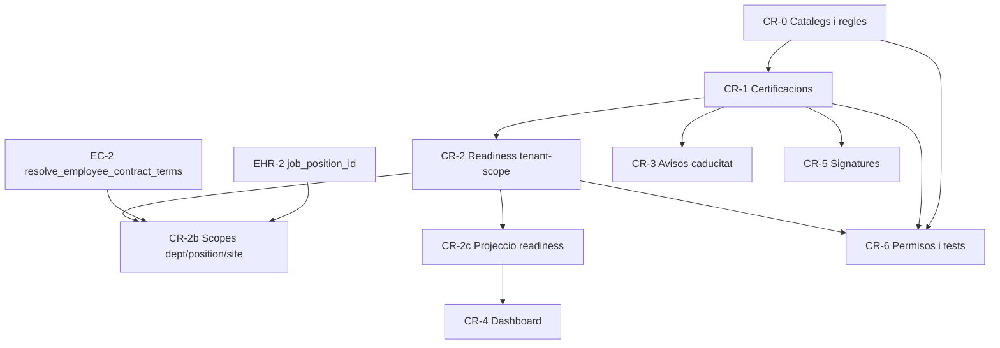

# Pla executable — Compliance & Readiness Engine (CR)

> **Data:** 2026-07-16
> **Estat:** pla executable — pendent d'implementació
> **Origen:** revisió crítica del `plan-employees-hr-core-v2.md` sota principis d'Employee Lifecycle Management (ELM) agnòstic
> **Relació:** pilar #2 de l'ELM. Consumit per `plan-elm-architecture.md` (ES) com a segon eix de "dispatch eligibility". Substitueix la meitat "certificacions" d'`EHR-5`.
> **Principi de producte:** una certificació de compliment (bloqueja treball) i una skill de talent (ajuda a cercar) no comparteixen taula, cicle de vida ni permisos, encara que un mateix curs pugui generar totes dues coses.
> **Revisió 2026-07-16b (autorevisió):** aquesta versió corregeix contradiccions detectades en una segona passada d'auditoria — dependència de columnes d'`employees` que encara no existeixen, absència de guarda multi-tenant, escalabilitat N+1 del dashboard, dades mèdiques amb el mateix nivell de protecció que compliment tècnic, i ambigüitat "sense regles = tot correcte". Vegeu §0.

---

## 0. Registre de canvis (autorevisió)

| # | Problema detectat | Correcció aplicada |
|---|---|---|
| 1 | `compute_employee_readiness` llegia `department_id`/`job_position_id`/`site_id` d'`employees`, però `job_position_id` no existeix fins EHR-2 i el pla de contractes (EC) fa d'aquests camps una projecció temporal del contracte, no columnes flat fiables | §5.5: MVP només `scope_type='tenant'`; scopes no-tenant requereixen EHR-2 + EC-2 (§9, CR-2/CR-2b) |
| 2 | Sense guarda de tenant a una funció `SECURITY DEFINER` amb `employee_id` per paràmetre | §5.5 amb comprovació de tenant abans de qualsevol lectura |
| 3 | Dashboard/widget agregat sumant `compute_employee_readiness` per cada empleat (N+1 a escala de milers) | §5.7: `data.employee_readiness_projection` com a taula de projecció, mai font de veritat |
| 4 | Dades mèdiques amb els mateixos permisos que certificacions tècniques/legals | §7: permisos `compliance.medical_clearance.*` separats de `compliance.certifications.*` |
| 5 | `is_ready=true` sense regles configurades és indistingible de "tot compleix" | §5.5: camp `configuration_status` (`unconfigured`/`partial`/`configured`) |
| 6 | RLS "l'empleat mateix, lectura pròpia" assumia `auth.uid()`, incompatible amb el portal token/PIN | §7: RPC dedicada, mateix patró que el portal existent |
| 7 | CR-D3 anomenava "cascada" un patró que en realitat és OR multi-scope (totes les regles aplicables s'avaluen, no la més específica guanya) | §4 renombrat a "multi-scope", sense semàntica de precedència |

---

## 1. Resum executiu

Aquest pla defineix el **repositori de compliment i Readiness**: el control de caducitats legals, reconeixements mèdics i certificacions tècniques, i la funció que calcula si un empleat "està al dia" per treballar.

Es crea com a pla independent (i no com a subsecció d'EHR-5, com estava) perquè:

1. **Criticitat diferent:** una certificació caducada pot bloquejar l'assignació de feina (risc legal/laboral); una skill sense actualitzar és, com a molt, un problema de cerca de talent.
2. **Consumidor diferent:** Readiness l'ha de poder consultar un sistema extern (futur Dispatcher) de forma síncrona i fiable; les skills són només per a cerca interna.
3. **Font de veritat diferent:** l'estat d'una certificació (`vigent`/`caducada`) mai es pot confiar com a columna materialitzada sense recàlcul en temps real — és exactament l'error "cron com a font de veritat" ja identificat al pla EC (R2), i es repetiria aquí si no es dissenya bé des del principi.

El resultat és una única funció pública, `data.compute_employee_readiness(employee_id, as_of)`, que el pla `plan-elm-architecture.md` combina amb `lifecycle_state` per decidir "dispatch eligibility", i que aquest mateix pla usa per pintar dashboards i generar avisos de caducitat.

---

## 2. Situació actual i per què EHR-5 no és suficient

El disseny previ (`data.employee_certifications` amb `skill_id`/`level_id` opcionals, compartint catàleg amb `data.skills`) té tres problemes:

- No hi ha noció de **"quin certificat és obligatori per a qui"**. Sense una taula de regles de requeriment, "Readiness" no es pot calcular — només es pot emmagatzemar a mà, i llavors deixa de ser fiable a escala de milers d'empleats.
- L'`status` derivat es descriu com "calculated/derived" sense especificar si és una columna materialitzada o una funció. Si és columna, cal un job de refresc, i el job es converteix en la font de veritat de facto (mateix risc R2 del pla EC).
- Barreja explícitament amb `data.skills` (mateix `skill_type_id`), fent que un canvi al catàleg de talent pugui trencar, per accident, el càlcul de compliment legal.

---

## 3. Objectius

### Funcionals
- Definir quins requisits de compliment existeixen (tipus, periodicitat, gravetat).
- Definir quins requisits són obligatoris per a quin col·lectiu (tot el tenant, un departament, un `job_position`, un site).
- Registrar les certificacions/reconeixements reals de cada empleat, amb document acreditatiu.
- Calcular Readiness en temps real, amb motius explícits de bloqueig.
- Avisar amb antelació (90/30/7 dies) de caducitats properes, de forma idempotent.

### Tècnics
- Cap columna de "status" materialitzada s'ha de tractar mai com a font de veritat per a una decisió de bloqueig.
- RLS i permisos separats de la gestió de skills de talent.
- Zero acoblament amb taules operacionals: cap FK sortint cap a `projects`/`tasks`/futur `work_order`.

---

## 4. Decisions de disseny

### CR-D1 — Catàleg de requeriments separat del catàleg de skills

`data.compliance_requirement_types` és una taula pròpia. No reutilitza `data.skill_types`. Un mateix curs de formació pot generar, si el negoci ho vol, tant una entrada de `compliance_requirement_types` com una de `skill_types` — són dues files independents amb el mateix nom, no la mateixa fila.

### CR-D2 — La funció és la font de veritat; la columna és caché de llista

`data.employee_certifications` no té columna `status`. Té `valid_from`/`valid_until`. L'estat (`active`/`expiring_soon`/`expired`/`indefinite`) es calcula sempre a `data.compute_certification_status(valid_from, valid_until, as_of)`, cridada tant per la funció de Readiness com per una vista de llista amb el resultat ja calculat (per filtrar/ordenar a UI sense recalcular a cada RPC).

### CR-D3 — Regles de requeriment multi-scope (no és cascada de precedència)

`tenant`, `department`, `job_position`, `site` són **quatre àmbits que s'avaluen tots alhora**, no una cascada on el més específic guanya (a diferència del patró de precedència d'assistència: `data.resolve_employee_work_plan` — EX-03.3 / ADR-0001 — amb cascada absència → edo → labor/`resolve_schedule_planner_day` — overrides + festiu + weekly ADR-0003 — → slots published, que sí és cascada real). Un empleat del departament X i site Y ha de complir totes les regles actives amb `scope_type='tenant'`, les de `department=X` i les de `site=Y` simultàniament — no s'exclouen entre elles. Un requeriment `is_blocking=false` genera avís però no bloqueja. Una versió anterior d'aquest pla usava el terme "cascada", que suggeria erròniament precedència; es corregeix la terminologia aquí i a totes les referències.

### CR-D3bis — Resolució d'àmbit: contracte primer, columna flat com a fallback

`department_id`/`job_position_id`/`site_id` d'un empleat no són fiables com a columnes flat quan el pla `plan-employment-contracts.md` (EC) està actiu: EC defineix el contracte vigent com a font temporal d'aquests camps (`data.resolve_employee_contract_terms`). MVP d'aquest pla (CR-2) evita el problema limitant-se a `scope_type='tenant'`, que no depèn de cap d'aquests camps. Els scopes `department`/`job_position`/`site` (CR-2b) requereixen EHR-2 (creació de `job_position_id`) i EC-2 (funció de resolució de contracte); fins llavors, s'usen les columnes flat d'`employees` només com a fallback si no hi ha cap contracte actiu per a l'empleat.

### CR-D4 — Readiness és calculable per a qualsevol data, no només "avui"

`compute_employee_readiness(employee_id, as_of date)` permet validar retroactivament (auditoria) i prospectivament (un futur Dispatcher que planifica per a d'aquí 2 setmanes ha de poder preguntar "serà ready el dia X").

### CR-D5 — Grace period explícit, no marge implícit

Cada regla pot tenir `grace_period_days`. El càlcul de Readiness el respecta explícitament; mai s'afegeixen marges ad hoc dins la lògica d'alertes.

### CR-D6 — Documents acreditatius sempre via DMS polimòrfic

`employee_certifications.document_id` apunta a `data.documents`. Mai es duplica emmagatzematge de fitxers dins aquest domini.

### CR-D7 — Permisos dedicats, no rols literals

`compliance.requirements.manage`, `compliance.certifications.view`, `compliance.certifications.manage`. Un responsable de PRL pot tenir aquests permisos sense ser `manager` global.

### CR-D8 — Guarda de tenant explícita a totes les funcions `SECURITY DEFINER`

Mateix principi que ES-D9 del pla `plan-elm-architecture.md`: qualsevol funció que rebi `employee_id`/`asset_id`/`scope_id` per paràmetre ha de comprovar que pertany al tenant actiu abans de retornar cap dada. `compute_employee_readiness` és el punt més sensible perquè exposa dades mèdiques i legals.

### CR-D9 — Dades mèdiques amb permisos propis, separats de compliment tècnic

`category='medical'` a `compliance_requirement_types`/`employee_certifications` requereix el permís dedicat `compliance.medical_clearance.view`/`.manage`, diferent de `compliance.certifications.*`. Un responsable de PRL genèric no veu automàticament reconeixements mèdics; cal concessió explícita. El resultat exposat a Readiness/Dispatcher per a requisits mèdics és només `fit`/`fit_with_restrictions`/`not_fit` + vigència — mai el motiu clínic ni el document (§5.5, §7).

### CR-D10 — `configuration_status` fa explícit el "sense regles = tot correcte"

Un tenant sense cap `compliance_requirement_rule` activa fa que `compute_employee_readiness` retorni `is_ready=true` per a tothom (comportament correcte, opt-in), però és indistingible de "tot compleix realment". La resposta JSON inclou `configuration_status: 'unconfigured'|'partial'|'configured'`, només informatiu, mai bloquejant.

---

## 5. Model de dades

### 5.1 `data.compliance_requirement_types`

```sql
CREATE TABLE data.compliance_requirement_types (
  id            uuid        PRIMARY KEY DEFAULT gen_random_uuid(),
  tenant_id     uuid        REFERENCES data.tenants(id) ON DELETE CASCADE, -- NULL = catàleg de plataforma, clonable
  code          text        NOT NULL,
  name          text        NOT NULL,
  category      text        NOT NULL CHECK (category IN ('legal', 'medical', 'technical', 'other')),
  default_validity_months int,           -- NULL = indefinit per defecte
  renewal_notice_days     int[] NOT NULL DEFAULT '{90,30,7}',
  is_active     boolean     NOT NULL DEFAULT true,
  created_at    timestamptz NOT NULL DEFAULT now(),
  UNIQUE (tenant_id, code)
);
```

### 5.2 `data.compliance_requirement_rules`

```sql
CREATE TABLE data.compliance_requirement_rules (
  id                   uuid PRIMARY KEY DEFAULT gen_random_uuid(),
  tenant_id            uuid NOT NULL REFERENCES data.tenants(id) ON DELETE CASCADE,
  requirement_type_id  uuid NOT NULL REFERENCES data.compliance_requirement_types(id) ON DELETE CASCADE,
  scope_type           text NOT NULL CHECK (scope_type IN ('tenant', 'department', 'job_position', 'site')),
  scope_id             uuid,             -- NULL si scope_type = 'tenant'
  is_blocking          boolean NOT NULL DEFAULT true,
  grace_period_days     int NOT NULL DEFAULT 0 CHECK (grace_period_days >= 0),
  is_active            boolean NOT NULL DEFAULT true,
  created_by           uuid NOT NULL REFERENCES data.profiles(id),
  created_at           timestamptz NOT NULL DEFAULT now(),

  CONSTRAINT compliance_rules_scope_id_check CHECK (
    (scope_type = 'tenant' AND scope_id IS NULL) OR
    (scope_type <> 'tenant' AND scope_id IS NOT NULL)
  )
);

CREATE INDEX idx_compliance_rules_scope
  ON data.compliance_requirement_rules (tenant_id, scope_type, scope_id)
  WHERE is_active;
```

### 5.3 `data.employee_certifications`

```sql
CREATE TABLE data.employee_certifications (
  id                  uuid        PRIMARY KEY DEFAULT gen_random_uuid(),
  tenant_id           uuid        NOT NULL REFERENCES data.tenants(id)   ON DELETE CASCADE,
  employee_id         uuid        NOT NULL REFERENCES data.employees(id) ON DELETE CASCADE,
  requirement_type_id uuid        NOT NULL REFERENCES data.compliance_requirement_types(id),
  issuer              text,
  credential_number   text,
  issued_on           date,
  valid_from          date        NOT NULL DEFAULT CURRENT_DATE,
  valid_until         date,                    -- NULL = indefinida
  document_id         uuid        REFERENCES data.documents(id),
  revoked_at          timestamptz,
  revoked_reason      text,
  notes               text,
  created_by          uuid        NOT NULL REFERENCES data.profiles(id),
  created_at          timestamptz NOT NULL DEFAULT now(),
  updated_at          timestamptz NOT NULL DEFAULT now(),

  CONSTRAINT employee_certifications_valid_range CHECK (valid_until IS NULL OR valid_until >= valid_from)
);

CREATE INDEX idx_employee_certifications_employee
  ON data.employee_certifications (employee_id, requirement_type_id);
CREATE INDEX idx_employee_certifications_expiry
  ON data.employee_certifications (tenant_id, valid_until)
  WHERE valid_until IS NOT NULL AND revoked_at IS NULL;
```

Nota deliberada: **no hi ha columna `status`**. Vegeu CR-D2.

### 5.4 `data.compute_certification_status` (helper)

```sql
CREATE OR REPLACE FUNCTION data.compute_certification_status(
  p_valid_from  date,
  p_valid_until date,
  p_as_of       date DEFAULT CURRENT_DATE
) RETURNS text
LANGUAGE sql IMMUTABLE AS $$
  SELECT CASE
    WHEN p_valid_until IS NULL THEN 'indefinite'
    WHEN p_as_of > p_valid_until THEN 'expired'
    WHEN p_as_of >= p_valid_from AND p_valid_until - p_as_of <= 30 THEN 'expiring_soon'
    WHEN p_as_of < p_valid_from THEN 'not_yet_valid'
    ELSE 'active'
  END;
$$;
```

### 5.5 `data.compute_employee_readiness` (la funció central)

**Canvis respecte a la versió anterior d'aquest pla (§0):** (a) guarda de tenant explícita (CR-D8); (b) MVP limita la resolució d'àmbit a `scope_type='tenant'` — els scopes `department`/`job_position`/`site` només s'avaluen si `job_position_id` existeix (EHR-2) i, si EC està actiu, resolent-los via `resolve_employee_contract_terms` en lloc de columnes flat (CR-D3bis); (c) `configuration_status` a la sortida (CR-D10); (d) paràmetres opcionals de context operacional (`p_required_requirement_codes`) simètrics amb ES-D10, perquè un futur Dispatcher pugui exigir un requisit puntual sense que calgui una regla permanent.

```sql
CREATE OR REPLACE FUNCTION data.compute_employee_readiness(
  p_employee_id uuid,
  p_as_of       date DEFAULT CURRENT_DATE,
  p_required_requirement_codes text[] DEFAULT NULL
) RETURNS jsonb
LANGUAGE plpgsql STABLE SECURITY DEFINER SET search_path = data AS $$
DECLARE
  v_tenant_id       uuid := data.active_tenant_id();
  v_employee        record;
  v_scope_dept      uuid;
  v_scope_position  uuid;
  v_scope_site      uuid;
  v_rule            record;
  v_reasons         text[] := '{}';
  v_has_valid       boolean;
  v_rule_count      int := 0;
  v_config_status   text;
BEGIN
  SELECT id, tenant_id INTO v_employee
  FROM data.employees
  WHERE id = p_employee_id AND tenant_id = v_tenant_id;  -- guarda de tenant obligatòria (CR-D8)

  IF v_employee.id IS NULL THEN
    RAISE EXCEPTION 'employee_not_found: %', p_employee_id USING ERRCODE = 'no_data_found';
  END IF;

  -- Resolució d'àmbit (CR-D3bis): MVP (CR-2) només fa servir scope_type='tenant',
  -- que no depèn de cap d'aquestes columnes. CR-2b activa department/job_position/site
  -- un cop EHR-2 (job_position_id) i, si escau, EC-2 (resolve_employee_contract_terms)
  -- estiguin desplegats. Fins llavors v_scope_* queden NULL i aquelles regles
  -- (scope_type <> 'tenant') simplement no troben coincidència.
  SELECT department_id, job_position_id, site_id
    INTO v_scope_dept, v_scope_position, v_scope_site
  FROM data.employees WHERE id = p_employee_id;

  FOR v_rule IN
    SELECT r.*, t.code AS requirement_code, t.name AS requirement_name, t.category
    FROM data.compliance_requirement_rules r
    JOIN data.compliance_requirement_types t ON t.id = r.requirement_type_id
    WHERE r.tenant_id = v_tenant_id
      AND r.is_active
      AND (
        (r.scope_type = 'tenant') OR
        (r.scope_type = 'department'   AND r.scope_id = v_scope_dept) OR
        (r.scope_type = 'job_position' AND r.scope_id = v_scope_position) OR
        (r.scope_type = 'site'         AND r.scope_id = v_scope_site)
      )
  LOOP
    v_rule_count := v_rule_count + 1;

    SELECT EXISTS (
      SELECT 1 FROM data.employee_certifications c
      WHERE c.employee_id = p_employee_id
        AND c.requirement_type_id = v_rule.requirement_type_id
        AND c.revoked_at IS NULL
        AND c.valid_from <= p_as_of
        AND (
          c.valid_until IS NULL
          OR c.valid_until + v_rule.grace_period_days >= p_as_of
        )
    ) INTO v_has_valid;

    IF NOT v_has_valid AND v_rule.is_blocking THEN
      -- Dades mèdiques (CR-D9): el codi de motiu no revela detall clínic, només el codi de requisit.
      v_reasons := array_append(v_reasons, 'MISSING_OR_EXPIRED:' || v_rule.requirement_code);
    END IF;
  END LOOP;

  -- Context operacional puntual (simètric a ES-D10): requisits demanats pel Dispatcher
  -- que no tenen regla permanent configurada, avaluats igual (falta = bloqueja).
  IF p_required_requirement_codes IS NOT NULL THEN
    FOR v_rule IN
      SELECT t.id AS requirement_type_id, t.code AS requirement_code
      FROM data.compliance_requirement_types t
      WHERE t.tenant_id = v_tenant_id AND t.code = ANY(p_required_requirement_codes)
    LOOP
      SELECT EXISTS (
        SELECT 1 FROM data.employee_certifications c
        WHERE c.employee_id = p_employee_id
          AND c.requirement_type_id = v_rule.requirement_type_id
          AND c.revoked_at IS NULL AND c.valid_from <= p_as_of
          AND (c.valid_until IS NULL OR c.valid_until >= p_as_of)
      ) INTO v_has_valid;
      IF NOT v_has_valid THEN
        v_reasons := array_append(v_reasons, 'MISSING_REQUIRED_CONTEXT:' || v_rule.requirement_code);
      END IF;
    END LOOP;
  END IF;

  v_config_status := CASE
    WHEN v_rule_count = 0 THEN 'unconfigured'
    WHEN EXISTS (SELECT 1 FROM data.compliance_requirement_rules WHERE tenant_id = v_tenant_id AND scope_type <> 'tenant' AND is_active)
         AND v_scope_position IS NULL THEN 'partial'  -- hi ha regles per job_position però l'empleat encara no en té (EHR-2 pendent)
    ELSE 'configured'
  END;

  RETURN jsonb_build_object(
    'employee_id', p_employee_id,
    'as_of', p_as_of,
    'is_ready', (cardinality(v_reasons) = 0),
    'blocking_reasons', to_jsonb(v_reasons),
    'configuration_status', v_config_status
  );
END; $$;

GRANT EXECUTE ON FUNCTION data.compute_employee_readiness(uuid, date, text[]) TO authenticated;
```

Aquesta funció és exactament la que crida `data.compute_employee_dispatch_eligibility` del pla ES (amb els mateixos paràmetres de context reenviats). No es duplica lògica.

### 5.6 Vista `api.employee_certifications` (amb estat calculat per a UI)

```sql
CREATE OR REPLACE VIEW api.employee_certifications
  WITH (security_invoker = true) AS
  SELECT
    c.*,
    data.compute_certification_status(c.valid_from, c.valid_until, CURRENT_DATE) AS computed_status
  FROM data.employee_certifications c;
```

`computed_status` és un camp de sortida només per a llistes/filtres. Mai s'usa dins de cap decisió de bloqueig (que sempre passa per §5.5).

### 5.7 `data.employee_readiness_projection` (escalabilitat de dashboard, N4)

**Problema:** un dashboard que mostra "% empleats ready" per a milers d'empleats no pot cridar `compute_employee_readiness` un cop per empleat en cada render (N+1). Una versió anterior d'aquest pla assumia implícitament aquest patró a CR-4.

**Solució:** taula de projecció, mai font de veritat, refrescada de manera incremental:

```sql
CREATE TABLE data.employee_readiness_projection (
  employee_id     uuid PRIMARY KEY REFERENCES data.employees(id) ON DELETE CASCADE,
  tenant_id       uuid NOT NULL REFERENCES data.tenants(id) ON DELETE CASCADE,
  is_ready        boolean NOT NULL,
  blocking_reasons jsonb NOT NULL DEFAULT '[]',
  configuration_status text NOT NULL,
  computed_at     timestamptz NOT NULL DEFAULT now()
);

CREATE INDEX idx_employee_readiness_projection_tenant
  ON data.employee_readiness_projection (tenant_id, is_ready);

CREATE OR REPLACE FUNCTION data.refresh_employee_readiness_projection(p_employee_id uuid)
RETURNS void
LANGUAGE plpgsql SECURITY DEFINER SET search_path = data AS $$
DECLARE
  v_result   jsonb;
  v_was_ready boolean;
BEGIN
  SELECT is_ready INTO v_was_ready FROM data.employee_readiness_projection WHERE employee_id = p_employee_id;
  v_result := data.compute_employee_readiness(p_employee_id, CURRENT_DATE);

  INSERT INTO data.employee_readiness_projection AS erp (employee_id, tenant_id, is_ready, blocking_reasons, configuration_status, computed_at)
  SELECT p_employee_id, tenant_id, (v_result->>'is_ready')::boolean, v_result->'blocking_reasons', v_result->>'configuration_status', now()
  FROM data.employees WHERE id = p_employee_id
  ON CONFLICT (employee_id) DO UPDATE SET
    is_ready = EXCLUDED.is_ready, blocking_reasons = EXCLUDED.blocking_reasons,
    configuration_status = EXCLUDED.configuration_status, computed_at = now();

  IF v_was_ready IS DISTINCT FROM (v_result->>'is_ready')::boolean THEN
    -- Escriptor concret dels events BLOCKED/UNBLOCKED referenciats a ES §7.2bis.
    PERFORM data.log_audit_event(
      (SELECT tenant_id FROM data.employees WHERE id = p_employee_id), NULL, NULL,
      CASE WHEN (v_result->>'is_ready')::boolean THEN 'EMPLOYEE_UNBLOCKED' ELSE 'EMPLOYEE_BLOCKED_DUE_TO_COMPLIANCE' END,
      'employee', p_employee_id, v_result
    );
  END IF;
END; $$;
```

Es crida des de triggers `AFTER INSERT OR UPDATE OR DELETE` a `employee_certifications` i `compliance_requirement_rules`, i des del job d'avisos de caducitat (§6) per capturar caducitats per pas del temps (sense mutació de fila). **`assert_employee_dispatch_eligible` (pla ES) mai llegeix aquesta taula**: sempre calcula en viu via `compute_employee_readiness`. La projecció és només per a dashboards/llistes (CR-4).

---

## 6. Sistema d'avisos de caducitat

**Precisió (§0, punt H8 de l'auditoria original):** `DATE_FIELD_REACHED` tal com existeix avui al motor d'automatització només cobreix `employees.ends_on` (un únic camp fix). No es pot "reutilitzar" tal qual per a `valid_until` d'`employee_certifications` (N files per empleat, tres llindars d'avís cadascuna). Es defineix un job dedicat que emet al mateix bus d'esdeveniments (`audit_logs` → `workflow_trigger_queue`), no una extensió del trigger genèric de camp de data:

- Job diari (pg_cron) `data.emit_certification_expiry_notices()` que recorre `employee_certifications` amb `valid_until - CURRENT_DATE IN (90, 30, 7)` (ajustat pel `renewal_notice_days` de cada `compliance_requirement_type`) i emet `CERTIFICATION_EXPIRING` a `audit_logs`/cua d'automatització, i crida `data.refresh_employee_readiness_projection` per als empleats afectats (§5.7).
- Idempotència: `UNIQUE (tenant_id, employee_id, requirement_type_id, notice_days)` sobre una taula petita de "notificacions ja enviades" (`data.compliance_notice_log`) evita duplicats si el job es re-executa.

```sql
CREATE TABLE data.compliance_notice_log (
  id             uuid PRIMARY KEY DEFAULT gen_random_uuid(),
  tenant_id      uuid NOT NULL REFERENCES data.tenants(id) ON DELETE CASCADE,
  certification_id uuid NOT NULL REFERENCES data.employee_certifications(id) ON DELETE CASCADE,
  notice_days    int NOT NULL,
  sent_at        timestamptz NOT NULL DEFAULT now(),
  UNIQUE (certification_id, notice_days)
);
```

---

## 7. Permisos i RLS

| Permís | Ús |
|---|---|
| `compliance.requirements.manage` | crear/editar tipus i regles de requeriment |
| `compliance.certifications.view` | veure certificacions de compliment legal/tècnic (`category IN ('legal','technical','other')`) |
| `compliance.certifications.manage` | crear/editar/revocar certificacions de compliment legal/tècnic |
| `compliance.medical_clearance.view` | veure reconeixements mèdics (`category='medical'`) — **permís separat (CR-D9)**, no inclòs a `compliance.certifications.view` |
| `compliance.medical_clearance.manage` | crear/editar/revocar reconeixements mèdics |

RLS de `data.employee_certifications`:
- `SELECT`: si `category='medical'` → requereix `compliance.medical_clearance.view`; en cas contrari → `compliance.certifications.view`. Implementat amb dues policies separades filtrant per `category`, no una policy única amb `OR`.
- `INSERT`/`UPDATE`: mateixa separació amb els permisos `.manage` respectius.
- `DELETE`: bloquejat (no hard delete, D8 del pla EHR); revocació via `revoked_at`.
- **Lectura pròpia des del portal (N7):** el portal d'empleat és token/PIN/QR, no sempre té `auth.uid()`. Una versió anterior d'aquest pla proposava "policy RLS per al propi empleat", incompatible amb aquest patró. En comptes d'això: `api.get_own_certifications(p_portal_token uuid)`, RPC `SECURITY DEFINER` que valida el token (mateix patró que la resta d'RPCs de portal existents) i retorna la llista sense exposar mai `revoked_reason` ni detall mèdic més enllà de l'aptitud/vigència.

Directori intern (`api.employees`) **no** exposa cap camp de readiness ni certificacions — evita fuga de dades mèdiques/legals a qualsevol membre del tenant. El resultat de `compute_employee_readiness` exposat a un futur Dispatcher per a requisits mèdics és sempre `fit`/`fit_with_restrictions`/`not_fit` + vigència, mai el `requirement_code` mèdic específic ni el motiu clínic (CR-D9).

---

## 8. Integració amb documents i signatures

- `document_id` a `employee_certifications` via DMS polimòrfic (`entity_type='employee_certification'`, registrat a `data.entity_types` del pla ES §9.4).
- Si el requeriment ho exigeix, el certificat pot generar-se com a document signat (reconeixement mèdic amb signatura del servei de prevenció) reutilitzant el motor de signatures existent — sense construir res nou, només afegint `employee_certification` com a `entity_type` vàlid als catàlegs de signing.

---

## 9. Fases d'implementació

### CR-0 — Catàlegs i regles

**Prioritat:** P0 · **Dependències:** EHR-0

- Migració `M-CR-01_compliance_requirement_types.sql`.
- Migració `M-CR-02_compliance_requirement_rules.sql`.
- UI mínima de catàleg (llista + formulari) per a `platform_admin`/`owner`.

**Criteris d'acceptació**
- [ ] Es pot definir un requeriment "tenant-wide" i un altre "només job_position X" (encara sense efecte real fins CR-2b/EHR-2).
- [ ] `grace_period_days` funciona segons validació de §9 (test SQL dedicat).

### CR-1 — Certificacions d'empleat

**Prioritat:** P0 · **Dependències:** CR-0

- Migració `M-CR-03_employee_certifications.sql`: taula + `compute_certification_status` + vista `api.employee_certifications`.
- Migració `M-CR-04_compliance_permissions.sql`: permisos `compliance.certifications.*` i `compliance.medical_clearance.*` (separats, CR-D9) + RLS separada per `category` (§7).
- Tab "Certificacions" a `EmployeeDetailPage.tsx` (separat del tab de skills), amb secció mèdica visible només amb `compliance.medical_clearance.view`.

**Criteris d'acceptació**
- [ ] Es pot registrar una certificació indefinida i una amb caducitat.
- [ ] `computed_status` reflecteix correctament `active`/`expiring_soon`/`expired`/`indefinite`/`not_yet_valid`.
- [ ] Revocació no esborra la fila.
- [ ] Un usuari amb `compliance.certifications.view` però sense `compliance.medical_clearance.view` no veu cap fila `category='medical'`.

### CR-2 — Motor de Readiness (MVP: només `scope_type='tenant'`)

**Prioritat:** P0 · **Dependències:** CR-0, CR-1

- Migració `M-CR-05_compute_employee_readiness.sql`: `compute_employee_readiness` (§5.5) amb guarda de tenant (CR-D8) i `configuration_status` (CR-D10).
- Endpoint/RPC de lectura per a UI (`api.get_employee_readiness`).
- **Límit explícit del MVP:** només s'avaluen regles `scope_type='tenant'`. Regles `department`/`job_position`/`site` es poden crear (CR-0) però no bloquegen ningú fins a CR-2b.

**Criteris d'acceptació**
- [ ] Empleat sense cap regla aplicable és `is_ready = true` i `configuration_status = 'unconfigured'`.
- [ ] Empleat amb regla `is_blocking=false` incomplerta és `is_ready = true` (només avís, no bloqueig).
- [ ] `grace_period_days` desplaça correctament el llindar de bloqueig.
- [ ] Consulta prospectiva (`as_of` futur) funciona sense efectes secundaris (STABLE, no escriu res).
- [ ] Test explícit multi-tenant: un tenant no pot obtenir readiness d'un empleat d'un altre tenant passant-ne l'UUID.

### CR-2b — Readiness per department/job_position/site

**Prioritat:** P1 · **Dependències:** CR-2, EHR-2 (`job_position_id`), EC-2 (`resolve_employee_contract_terms`, si el tenant té contractes actius)

- Activa la resolució d'àmbit descrita a CR-D3bis: si l'empleat té un contracte vigent (EC), `department_id`/`job_position_id`/`site_id` es resolen via `resolve_employee_contract_terms(employee_id, as_of)`; si no, fallback a columnes flat d'`employees`.

**Criteris d'acceptació**
- [ ] Un canvi de `job_position` via contracte (no via `UPDATE employees`) es reflecteix a la readiness de l'endemà de ser efectiu.
- [ ] Sense EC actiu al tenant, el fallback a columnes flat funciona igual que abans.

### CR-3 — Avisos de caducitat

**Prioritat:** P0 · **Dependències:** CR-1

- Migració `M-CR-06_compliance_notice_log.sql` + `data.emit_certification_expiry_notices()` (job dedicat, §6 — no és una extensió de `DATE_FIELD_REACHED`), pg_cron diari, integració amb Automation Center existent.

**Criteris d'acceptació**
- [ ] Avisos 90/30/7 dies (o el `renewal_notice_days` propi de cada tipus) enviats exactament una vegada per certificació.
- [ ] Re-execució manual del job no duplica notificacions.
- [ ] Cada avís emès crida `refresh_employee_readiness_projection` per a l'empleat afectat.

### CR-2c — Projecció de Readiness (escalabilitat, N4)

**Prioritat:** P1 · **Dependències:** CR-2

- Migració `M-CR-07_employee_readiness_projection.sql`: taula + `refresh_employee_readiness_projection` (§5.7) + triggers sobre `employee_certifications`/`compliance_requirement_rules`.

**Criteris d'acceptació**
- [ ] La projecció es manté consistent amb `compute_employee_readiness` en viu (test de convergència: recalcular tots els empleats i comparar amb la projecció).
- [ ] `EMPLOYEE_BLOCKED_DUE_TO_COMPLIANCE`/`EMPLOYEE_UNBLOCKED` s'emeten només en transicions reals `true↔false`, no a cada refresc.

### CR-4 — Dashboard i llistes globals

**Prioritat:** P1 · **Dependències:** CR-2c (projecció, no CR-2 directament) · **Estat:** ✅ tancat (`20261087000001`)

- Vista global de certificacions per tenant amb filtres per estat/departament/site.
- Widget de Readiness agregat (% empleats ready) per a dashboard HR, llegint `data.employee_readiness_projection` — **mai** iterant `compute_employee_readiness` per cada empleat de la llista (N4).

**Criteris d'acceptació**
- [x] Llista filtra correctament per `computed_status`.
- [x] Widget agregat carrega en temps constant respecte al nombre d'empleats (consulta única sobre la projecció, no N crides).

### CR-5 — Integració amb signatures (reconeixements mèdics)

**Prioritat:** P2 · **Dependències:** CR-1, mòdul signing existent

- `employee_certification` com a `entity_type` vàlid a catàlegs de signing i documents.
- Flux de signatura de reconeixement mèdic respecta `compliance.medical_clearance.manage`, no `compliance.certifications.manage`.

**Criteris d'acceptació**
- [x] Es pot generar i signar un reconeixement mèdic vinculat a una certificació.
- [x] Un signant amb permís de certificacions tècniques però no mèdic no pot iniciar la signatura d'un reconeixement mèdic.

### CR-6 — Permisos i tests de seguretat

**Prioritat:** P0 (transversal, ha d'anar completat abans de dades reals) · **Dependències:** CR-0..CR-2

- Permisos nous al frontend (`PermissionKey`): `compliance.requirements.manage`, `compliance.certifications.{view,manage}`, `compliance.medical_clearance.{view,manage}`.
- Tests RLS: usuari sense `compliance.certifications.view` no veu res; usuari amb `compliance.certifications.view` però sense `compliance.medical_clearance.view` no veu files mèdiques; l'empleat mateix accedeix només via `api.get_own_certifications` (RPC de portal, §7), no via RLS pròpia.

**Criteris d'acceptació**
- [ ] Cap fuga de dades mèdiques/legals a `api.employees` ni al directori intern.
- [ ] Tests RLS verds per als quatre rols de referència (owner, manager sense permís explícit, compliance officer amb permís tècnic sense mèdic, compliance officer amb ambdós).
- [ ] `compute_employee_readiness`/`refresh_employee_readiness_projection` reben test multi-tenant explícit (CR-D8).

---

## 10. Ordre i dependències



MVP recomanat (compartit amb el pla ES): **CR-0 → CR-1 → CR-2 → CR-3**, amb CR-6 en paral·lel des del principi (no al final). CR-2b/CR-2c/CR-4/CR-5 són posteriors al MVP.

---

## 11. Estratègia de proves

- **SQL:** matriu completa d'estats de `compute_certification_status` (abans/dins/després de vigència, indefinida, grace period).
- **Readiness:** casos amb 0, 1 i múltiples regles aplicables; regles no-bloquejants; multi-scope tenant/department/job_position/site amb solapament (CR-D3: totes les regles aplicables s'avaluen, cap "guanya" per especificitat).
- **Idempotència:** job d'avisos executat dues vegades el mateix dia no duplica `compliance_notice_log`.
- **Seguretat:** RLS i guarda de tenant per als quatre rols de referència (§9, CR-6); test explícit d'accés creuat entre tenants a `compute_employee_readiness`.
- **Escalabilitat:** convergència entre `employee_readiness_projection` i el càlcul en viu sobre un conjunt de ≥1000 empleats sintètics.
- **Regressió:** cap canvi al catàleg de `skills` (EHR-5) afecta el resultat de `compute_employee_readiness`.

---

## 12. Riscos i mitigacions

| Risc | Mitigació |
|---|---|
| Columna de status materialitzada acaba sent "la veritat" per pressa de rendiment | No existeix tal columna a `data.employee_certifications`; qualsevol futura necessitat de rendiment es resol amb índex funcional, no amb columna escrita per cron |
| Regles de requeriment mal configurades bloquegen tot un departament per error | UI de simulació ("quants empleats quedarien no-ready si activo aquesta regla") abans de `is_active=true` en producció (CR-4, opcional però recomanat) |
| Dades mèdiques exposades per RLS massa laxa o mesclades amb compliment tècnic | Permisos `compliance.medical_clearance.*` separats (CR-D9) des de CR-1, no afegits a posteriori |
| Job d'avisos duplica notificacions en reintents | `UNIQUE` constraint a `compliance_notice_log`, no lògica aplicativa |
| `SECURITY DEFINER` sense guarda de tenant filtra dades entre tenants | Guarda explícita a totes les funcions (CR-D8), test multi-tenant obligatori a CR-2/CR-6 |
| Dashboard fa N crides a `compute_employee_readiness` i degrada amb milers d'empleats | Projecció dedicada (CR-2c) com a única font per a llistes/dashboards |

---

## 13. Criteris globals de Done

- [ ] `compute_employee_readiness` és l'única font de veritat per a decisions de bloqueig; cap altra part del sistema reimplementa aquesta lògica.
- [ ] Certificacions de compliment i skills de talent viuen en taules i catàlegs separats.
- [ ] Avisos de caducitat idempotents i integrats amb l'Automation Center existent.
- [ ] Permisos dedicats, sense literals de rol nous; dades mèdiques amb permís separat de compliment tècnic.
- [ ] Totes les funcions `SECURITY DEFINER` amb `employee_id` per paràmetre validen el tenant actiu.
- [ ] Dashboards i llistes globals llegeixen la projecció (CR-2c), mai iteren `compute_employee_readiness` per empleat.
- [ ] Tests SQL i RLS verds.
- [ ] Zero FK sortint des d'aquest domini cap a taules operacionals.

---

## 14. Estimació orientativa

| Fase | Esforç |
|---|---:|
| CR-0 Catàlegs i regles | 3–5 dies |
| CR-1 Certificacions | 4–6 dies |
| CR-2 Readiness engine (tenant-scope) | 3–5 dies |
| CR-2b Scopes department/position/site | 2–4 dies (després d'EHR-2/EC-2) |
| CR-2c Projecció readiness | 2–3 dies |
| CR-3 Avisos caducitat | 2–3 dies |
| CR-4 Dashboard | 3–5 dies |
| CR-5 Signatures | 2–4 dies |
| CR-6 Permisos i tests | 3–4 dies (transversal) |

Total: **24–39 dies**. MVP (CR-0..CR-3 + CR-6): **12–18 dies**. CR-2b/CR-2c/CR-4/CR-5 són post-MVP.

---

## 15. Referències

- `docs/plans/employees/plan-employees-hr-core-v2.md`
- `docs/plans/employees/plan-elm-architecture.md`
- `docs/plans/employees/plan-employment-contracts.md`
- `docs/plans/employees/plan-employee-assets.md`
- `docs/product-design/04-roles-and-permissions.md`
- `docs/product-design/09-async-infrastructure.md`
