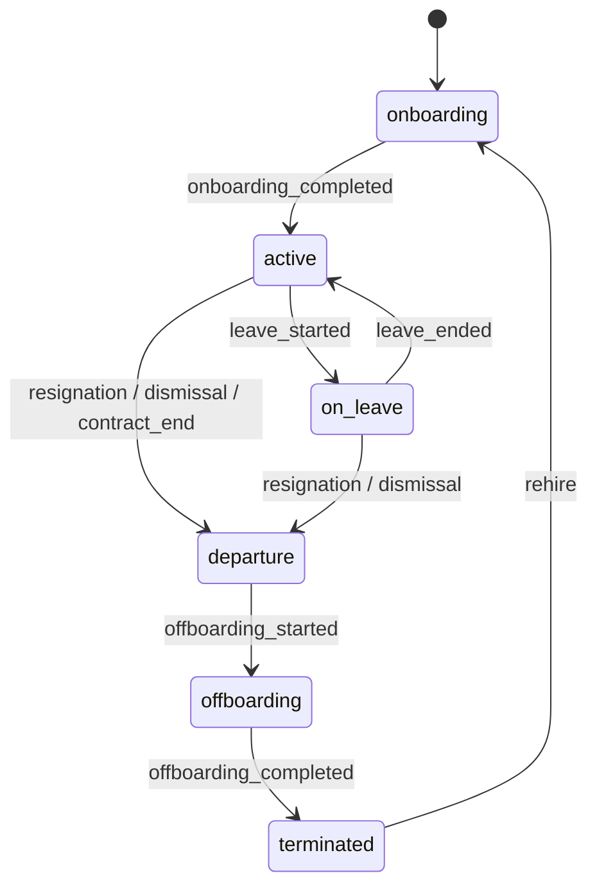
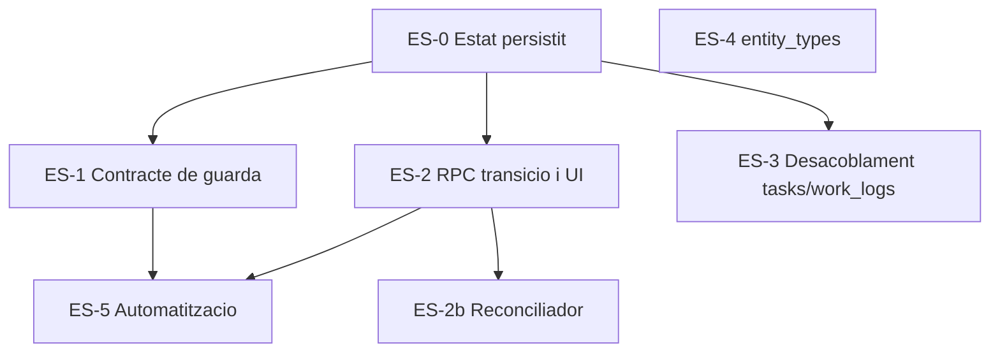

# Pla executable — Employee Lifecycle Management: motor d'estats i contracte amb el Dispatcher (ES)


> **Data:** 2026-07-16

> **Estat:** pla executable — pendent d'implementació

> **Origen:** revisió crítica del `plan-employees-hr-core-v2.md` sota principis d'Employee Lifecycle Management (ELM) agnòstic

> **Relació:** pla germà de `plan-employment-contracts.md` (EC); consumit per `plan-employees-hr-core-v2.md` (EHR) a la fase EHR-6

> **Plans dependents:** `plan-compliance-readiness.md` (CR), `plan-employee-assets.md` (EA) — tots dos usen l'estat definit aquí com a un dels dos eixos de "dispatch eligibility"

> **Principi de producte:** l'ELM és agnòstic d'operacions. No coneix `WorkOrder`, `Project` ni `Task`. Exposa una única superfície: una funció de guarda i tres noms d'esdeveniment (§7.2).

> **Revisió 2026-07-16b (autorevisió):** aquesta versió corregeix contradiccions internes detectades en una segona passada d'auditoria — escriptor doble de `lifecycle_state`, transicions futures que trencaven l'estat actual, signatures SQL incorrectes, absència de guarda multi-tenant i manca de context operacional al contracte de Readiness. Vegeu el registre de canvis a §0.


---


## 0. Registre de canvis (autorevisió)


| # | Problema detectat | Correcció aplicada |

|---|---|---|

| 1 | `lifecycle_state` s'escrivia des de l'RPC **i** des d'un trigger (doble escriptor) | Escriptor únic: trigger sobre `employee_lifecycle_events`. L'RPC només insereix l'event |

| 2 | Transicions amb `effective_on` futur bloquejaven l'empleat immediatament | �ES-D2bis: reconciliador diari + `p_effective_on` futur rebutjat fins que el reconciliador existeixi (ES-2b) |

| 3 | `data.jwt_has_permission('perm')` amb 1 argument — signatura real és de 3 | Tots els snippets corregits a `jwt_has_permission(v_tenant_id, 'perm', v_site_id)` |

| 4 | `compute_employee_dispatch_eligibility`/`assert_*` sense guarda de tenant (qualsevol `authenticated` podia consultar empleats d'altres tenants) | §7.1 amb comprovació de pertinença de tenant abans de retornar cap dada |

| 5 | Contracte de Readiness sense manera d'expressar requisits específics d'una OT | §7.1bis: paràmetres opcionals `p_required_requirement_codes`/`p_required_asset_type_codes` |

| 6 | `get_employee_dispatch_status` esmentat (ES-D4) i mai definit | §7.1ter amb definició completa |

| 7 | Cap escriptor concret per als events `EMPLOYEE_BLOCKED_DUE_TO_COMPLIANCE`/`UNBLOCKED` | §7.2bis amb `data.refresh_employee_readiness_projection` |

| 8 | RLS de portal assumia `auth.uid()`, incompatible amb el portal token/PIN existent | §9.2 corregit a RPC dedicada |

| 9 | `candidate` barrejava ELM amb un futur mòdul de reclutament | §6: `candidate` documentat com a extensió futura, no seedat al MVP |


---


## 1. Resum executiu


Aquest pla defineix el nucli de l'Employee Lifecycle Management (ELM): el motor d'estats del treballador (Onboarding → Actiu → Baixa → Offboarding) i el **contracte d'integració** amb un futur motor d'operacions/Dispatcher d'Ordres de Treball (OT), que no es construeix en aquest pla.


Substitueix la fase EHR-6 ("Onboarding i offboarding") del pla mestre, que tal com estava especificada no definia cap estat persistit ni cap invariant — només una capa d'automatització sobre `employee_lifecycle_runs`. Aquest pla:


1. Defineix `lifecycle_state` com a columna de primera classe a `data.employees`, escrita exclusivament per un ledger d'esdeveniments append-only amb transicions guardades.

2. Formalitza que **Readiness (compliment) i Lifecycle State són dos eixos ortogonals**: un empleat pot estar `active` i no ser `ready` (certificat caducat); això no és un estat de cicle de vida, és una segona dimensió calculada pel pla CR.

3. Defineix el **contracte públic** — l'única superfície que un futur Dispatcher pot tocar: una funció de guarda síncrona + dos noms d'esdeveniment. Cap taula operacional no pot fer JOIN contra taules internes de l'ELM.

4. Identifica i planifica el refactor d'un acoblament ja existent i real entre el domini operacional actual (`data.tasks`, `data.work_logs`) i `data.profiles` en lloc d'`data.employees` — la mateixa inversió de dependència que aquest pla existeix per evitar en el futur Dispatcher.


**Fora d'abast explícit:** cap taula `work_order`, cap UI de planificació d'OTs, cap algorisme d'assignació. Això és V2 i no es dissenya aquí. El que es dissenya és la frontera que el V2 haurà de respectar.


---


## 2. Els tres dominis de l'ELM (recordatori normatiu)


L'ELM s'encarrega **exclusivament** de:


1. **Motor d'estats** (aquest pla): `onboarding → active → on_leave → departure → offboarding → terminated` (`candidate` reservat per a extensió futura, no seedat al MVP — vegeu §6).

2. **Repositori de compliment i Readiness** (`plan-compliance-readiness.md`): caducitats legals, reconeixements mèdics, certificacions tècniques.

3. **Recursos físics associats** (`plan-employee-assets.md`): EPIs, vehicles, eines calibrades.


L'ELM **no** s'encarrega de:


- Planificació ni assignació de feina (Dispatcher, V2).

- Nòmina, fiscalitat, reclutament (fora d'abast del track HR sencer).

- Res que requereixi conèixer un `project_id`, `task_id` o futur `work_order_id`. Si una taula de l'ELM necessita una FK cap a una entitat operacional, és un senyal que aquesta taula no pertany a l'ELM.


---


## 3. Situació actual i riscos verificats


### 3.1 No hi ha estat persistit


`data.employees` no té cap columna d'estat de cicle de vida. `status` (si existeix) és un camp lliure sense màquina d'estats ni transicions guardades. La "baixa" avui és inferida indirectament del final de vigència del contracte (pla EC) — no és consultable com un fet de primera classe per cap altre domini.


### 3.2 Acoblament ja existent amb el domini operacional (crític)


```172:179:C:\JordiDevops\pimed-app\supabase\migrations\20260502000001_departments_projects_tasks.sql

CREATE TABLE data.tasks (

  id          uuid        PRIMARY KEY DEFAULT gen_random_uuid(),

  ...

  assignee_id uuid                 REFERENCES data.profiles(id)  ON DELETE SET NULL,

```


```119:126:C:\JordiDevops\pimed-app\supabase\migrations\20260506000005_work_logs.sql

CREATE TABLE IF NOT EXISTS data.work_logs (

  ...

  worker_id               uuid          NOT NULL REFERENCES data.profiles(id),

```


`data.tasks.assignee_id` i `data.work_logs.worker_id` referencien `data.profiles(id)`, no `data.employees(id)`. Això contradiu el principi ja documentat a `docs/product-design/02-domain-model.md` ("Employee ≠ User", `employees.user_id` opcional) i significa que **un empleat sense compte d'usuari no pot tenir avui cap tasca assignada ni cap fitxatge de camp**. El domini operacional actual ja depèn de `User`, no d'`Employee` — exactament la inversió que volem evitar que repeteixi el futur Dispatcher. Es refactoritza a §8.


### 3.3 Registre d'`entity_type` polimòrfic no canònic


Nou punt no cobert per cap pla anterior: el tipus d'entitat polimòrfica (`entity_type`) es repeteix com a `CHECK` literal en almenys 9 migracions (Entity Timeline, subscripcions, playbooks, signing role defaults), amb **llistes diferents** segons el subsistema. Abans d'afegir `employee_certification`/`employee_asset` com a entitats adjuntables (documents, timeline), cal un registre canònic (§9.4).


---


## 4. Decisions de disseny


### ES-D1 — Lifecycle State i Readiness són eixos ortogonals


`lifecycle_state` respon "aquesta persona té una relació activa amb l'empresa avui?". Readiness (pla CR) respon "aquesta persona compleix els requisits per treballar avui?". Un Dispatcher necessita **totes dues** afirmatives per assignar feina. No es fusionen en un únic camp.


### ES-D2 — El ledger és la font de veritat; la columna és una caché


`data.employee_lifecycle_events` és append-only i mai s'actualitza ni s'esborra (excepte purga legal). `data.employees.lifecycle_state` es reescriu únicament per trigger en inserir un event vàlid. **Cap RPC no fa `UPDATE data.employees SET lifecycle_state` directament** — únicament el trigger `trg_sync_employee_lifecycle_state` ho fa, i només per a events amb `effective_on <= CURRENT_DATE` (vegeu ES-D2bis). Aquesta regla es contradeia en una versió anterior d'aquest pla (l'RPC de §9.3 feia l'`UPDATE` ella mateixa); queda corregida.


### ES-D2bis — Transicions futures no muten l'estat fins que arriben


Un event amb `effective_on` en el futur (p. ex. "baixa efectiva d'aquí a 30 dies") s'insereix al ledger com a **programat**, però no pot canviar `lifecycle_state` avui. El trigger de sincronització només actua sobre events amb `effective_on <= CURRENT_DATE`. Un reconciliador diari (`data.reconcile_scheduled_lifecycle_events`, mateix patró que el reconciliador de contractes del pla EC) aplica els events programats quan arriba la seva data, escrivint un segon event derivat (`source='automation'`, `reason_code='scheduled_transition_applied'`) que sí dispara el trigger.


MVP (ES-0/ES-2): `api.transition_employee_lifecycle` rebutja `p_effective_on > CURRENT_DATE` amb `RAISE EXCEPTION 'future_effective_on_not_supported'`. El reconciliador i l'acceptació de dates futures s'implementen a ES-2b, no abans.


### ES-D3 — Transicions guardades per taula, no per `CASE` a mitja RPC


`data.employee_lifecycle_transition_rules` defineix quines transicions són vàlides i quin permís calen. Afegir un estat nou és una fila, no un desplegament de codi ple de `IF`.


### ES-D4 — Cap taula operacional coneix l'ELM per dins


El contracte amb el Dispatcher es limita a:

- `data.assert_employee_dispatch_eligible(employee_id, as_of)` — guarda síncrona.

- `data.get_employee_dispatch_status(employee_id)` — lectura per UI.

- Events `EMPLOYEE_BLOCKED_DUE_TO_COMPLIANCE` / `EMPLOYEE_UNBLOCKED` / `EMPLOYEE_LIFECYCLE_CHANGED` a `audit_logs`.


Res més. Ni vistes, ni FKs, ni triggers creuats en cap altra direcció.


### ES-D5 — La invariant de bloqueig és síncrona; les conseqüències són asíncrones


Vegeu §7. No es confia en pub/sub per impedir una assignació (finestra de cursa inacceptable per a un risc legal). Es confia en pub/sub per a notificacions, dashboards i efectes en cascada.


### ES-D6 — `on_leave` no és `departure`


Una baixa mèdica o excedència és `on_leave`: manté el contracte, pot recuperar readiness i tornar a `active` sense passar per onboarding. `departure` és la sortida definitiva i és irreversible sense crear un nou cicle (`rehire`).


### ES-D7 — Refactor operacional additiu, sense downtime


El desacoblament `tasks`/`work_logs` de §8 es fa afegint columnes noves i backfill, mai eliminant `assignee_id`/`worker_id` en calent. La retirada és una fase pròpia, posterior i reversible per flag.


### ES-D8 — Permisos, no rols literals


Totes les RPCs d'aquest pla usen `data.jwt_has_permission(p_tenant_id, p_permission, p_site_id)` (signatura real de 3 arguments — una versió anterior d'aquest pla usava una signatura d'1 argument inexistent). Cap `IN ('owner','manager')` nou.


### ES-D9 — Guarda de tenant explícita a totes les funcions de lectura creuada


Qualsevol funció `SECURITY DEFINER` que rebi un `employee_id`/`asset_id` per paràmetre (i per tant bypassa RLS) ha de comprovar explícitament que l'entitat pertany al tenant actiu de qui crida, seguint el mateix patró que `data.trg_validate_employee_relations_consistency` ja aplica a `data.employees`. Sense aquesta guarda, qualsevol `authenticated` d'un tenant pot consultar dades de compliment/readiness d'empleats d'un altre tenant passant-ne l'UUID. Aplicable a `compute_employee_dispatch_eligibility`, `assert_employee_dispatch_eligible`, `get_employee_dispatch_status` (§7) i, per extensió, a `compute_employee_readiness` (pla CR) i a totes les RPCs d'assignació d'actius (pla EA).


### ES-D10 — El contracte de Readiness accepta context operacional opcional


Perquè un futur Dispatcher pugui exigir requisits específics d'una OT (treball en alçada, espai confinat) sense que l'ELM conegui `WorkOrder`, el contracte de guarda accepta paràmetres opcionals de context (§7.1bis). L'ELM els valida; mai els interpreta ni els emmagatzema com a coneixement operacional propi.


---


## 5. Model de dades


### 5.1 `data.employee_lifecycle_events`


```sql

CREATE TABLE data.employee_lifecycle_events (

  id            uuid        PRIMARY KEY DEFAULT gen_random_uuid(),

  tenant_id     uuid        NOT NULL REFERENCES data.tenants(id)   ON DELETE CASCADE,

  employee_id   uuid        NOT NULL REFERENCES data.employees(id) ON DELETE CASCADE,

  from_state    text,

  to_state      text        NOT NULL,

  reason_code   text        NOT NULL,

  effective_on  date        NOT NULL DEFAULT CURRENT_DATE,

  triggered_by  uuid        REFERENCES data.profiles(id),

  source        text        NOT NULL DEFAULT 'manual'

                CHECK (source IN ('manual', 'contract', 'automation', 'import')),

  metadata      jsonb       NOT NULL DEFAULT '{}',

  created_at    timestamptz NOT NULL DEFAULT now()

);


CREATE INDEX idx_lifecycle_events_employee

  ON data.employee_lifecycle_events (employee_id, effective_on DESC);

CREATE INDEX idx_lifecycle_events_tenant_recent

  ON data.employee_lifecycle_events (tenant_id, created_at DESC);

```


### 5.2 `data.employee_lifecycle_transition_rules`


```sql

CREATE TABLE data.employee_lifecycle_transition_rules (

  id                 uuid PRIMARY KEY DEFAULT gen_random_uuid(),

  from_state         text NOT NULL,

  to_state           text NOT NULL,

  requires_permission text NOT NULL DEFAULT 'employees.lifecycle.manage',

  requires_reason    boolean NOT NULL DEFAULT true,

  auto_reason_codes  text[] NOT NULL DEFAULT '{}', -- codis que l'automatització pot usar sense aprovació manual

  UNIQUE (from_state, to_state)

);

```


Seed inicial (§6). Taula petita, editable per plataforma; no exposada a tenants en aquesta fase.


### 5.3 Extensió a `data.employees`


```text

lifecycle_state       text NOT NULL DEFAULT 'active'

                       CHECK (lifecycle_state IN (

                         'candidate','onboarding','active',

                         'on_leave','departure','offboarding','terminated'

                       ))

lifecycle_since       date

lifecycle_updated_at  timestamptz

```


`lifecycle_state = 'active'` per defecte per no trencar les 100% de files existents en el backfill (§10, ES-0).


### 5.4 Vista `api.employee_lifecycle_events` (read-only)


Vista `security_invoker = true`, RLS delegada a la taula base. Sense mutació directa: totes les transicions passen per `api.transition_employee_lifecycle`.


---


## 6. Màquina d'estats





Notes:

- **`candidate` es retira del seed del MVP.** Una versió anterior d'aquest pla incloïa `candidate` "per si un futur mòdul de reclutament l'usa", però barrejava l'abast de l'ELM amb un domini explícitament fora d'abast. El CHECK a `lifecycle_state` (§5.3) pot mantenir el valor reservat per extensibilitat futura, però `employee_lifecycle_transition_rules` **no** el seeda al MVP: el cicle de vida comença directament a `onboarding`. Si en el futur es construeix Recruitment, aquell mòdul decidirà quan transferir una persona a l'ELM (típicament en signar l'oferta), i serà llavors quan es reobri aquesta decisió.

- `rehire` crea un nou cicle (nou `employee_lifecycle_events` amb `from_state='terminated'`), no reobre l'expedient antic. L'`employee_id` es manté (per conservar historial de certificacions/actius si el negoci ho vol) o es crea un registre nou, segons decisió de negoci — es tanca a ES-2 amb ADR curt.

- El Dispatcher només considera `dispatch_eligible_states = ('active')`. `on_leave`, `departure`, `offboarding`, `terminated`, `onboarding` bloquegen sempre, amb independència de Readiness.


---


## 7. Contracte d'integració amb el Dispatcher


### 7.1 Guarda síncrona (obligatòria)


**Nota de seguretat (N2/ES-D9):** totes les funcions següents són `SECURITY DEFINER` i reben `employee_id` per paràmetre, per tant s'ha de validar explícitament el tenant abans de retornar cap dada — sense aquesta comprovació, qualsevol usuari autenticat d'un tenant podria consultar l'estat de compliment d'un empleat d'un altre tenant només endevinant/enumerant UUIDs.


**Context operacional opcional (N3/ES-D10):** els paràmetres `p_required_requirement_codes`/`p_required_asset_type_codes` permeten que un futur Dispatcher exigeixi requisits específics d'una OT (p. ex. "treball en alçada") sense que l'ELM conegui `WorkOrder`. Són `NULL` per defecte, cas en el qual només s'avaluen els requisits generals per rol/site ja configurats a CR/EA.


```sql

CREATE OR REPLACE FUNCTION data.compute_employee_dispatch_eligibility(

  p_employee_id uuid,

  p_as_of       date DEFAULT CURRENT_DATE,

  p_required_requirement_codes text[] DEFAULT NULL,

  p_required_asset_type_codes  text[] DEFAULT NULL

) RETURNS jsonb

LANGUAGE plpgsql STABLE SECURITY DEFINER SET search_path = data AS $$

DECLARE

  v_tenant_id       uuid := data.active_tenant_id();

  v_lifecycle_state text;

  v_readiness       jsonb;

  v_reasons         text[] := '{}';

BEGIN

  SELECT lifecycle_state INTO v_lifecycle_state

  FROM data.employees

  WHERE id = p_employee_id

    AND tenant_id = v_tenant_id;  -- guarda de tenant obligatòria (ES-D9) — sense v_tenant_id no hi ha fila


  IF v_lifecycle_state IS NULL THEN

    RAISE EXCEPTION 'employee_not_found: %', p_employee_id USING ERRCODE = 'no_data_found';

  END IF;


  IF v_lifecycle_state <> 'active' THEN

    v_reasons := array_append(v_reasons, 'LIFECYCLE_STATE_' || upper(v_lifecycle_state));

  END IF;


  -- Delegació al pla CR — mai es reimplementa la lògica de certificacions aquí.

  -- compute_employee_readiness aplica la mateixa guarda de tenant internament (pla CR §5.5).

  v_readiness := data.compute_employee_readiness(p_employee_id, p_as_of, p_required_requirement_codes, p_required_asset_type_codes);

  IF NOT (v_readiness->>'is_ready')::boolean THEN

    v_reasons := v_reasons || ARRAY(SELECT jsonb_array_elements_text(v_readiness->'blocking_reasons'));

  END IF;


  RETURN jsonb_build_object(

    'employee_id',     p_employee_id,

    'is_eligible',     (cardinality(v_reasons) = 0),

    'lifecycle_state', v_lifecycle_state,

    'blocking_reasons', to_jsonb(v_reasons),

    'configuration_status', v_readiness->'configuration_status'

  );

END; $$;


CREATE OR REPLACE FUNCTION data.assert_employee_dispatch_eligible(

  p_employee_id uuid,

  p_as_of       date DEFAULT CURRENT_DATE,

  p_required_requirement_codes text[] DEFAULT NULL,

  p_required_asset_type_codes  text[] DEFAULT NULL

) RETURNS void

LANGUAGE plpgsql STABLE SECURITY DEFINER SET search_path = data AS $$

DECLARE v_result jsonb;

BEGIN

  v_result := data.compute_employee_dispatch_eligibility(p_employee_id, p_as_of, p_required_requirement_codes, p_required_asset_type_codes);

  IF NOT (v_result->>'is_eligible')::boolean THEN

    RAISE EXCEPTION 'employee_not_dispatch_eligible: %', (v_result->'blocking_reasons')::text

      USING ERRCODE = 'check_violation';

  END IF;

END; $$;


GRANT EXECUTE ON FUNCTION data.compute_employee_dispatch_eligibility(uuid, date, text[], text[]) TO authenticated;

REVOKE ALL ON FUNCTION data.assert_employee_dispatch_eligible(uuid, date, text[], text[]) FROM PUBLIC;

```


`assert_employee_dispatch_eligible` és `SECURITY DEFINER` i no es concedeix a `authenticated` directament: només l'ha de cridar codi RPC intern (el futur `api.assign_work_order`, i mentrestant el pilot descrit a §10 ES-1). `compute_employee_dispatch_eligibility` sí és de lectura pública (amb la guarda de tenant interna, no RLS) perquè la UI d'un futur Dispatcher pugui avisar abans d'intentar assignar.


### 7.1ter `api.get_employee_dispatch_status` — wrapper de lectura per UI


Esmentat a ES-D4 en versions anteriors d'aquest pla sense definir-se. És la funció que ha de cridar qualsevol UI (fitxa d'empleat, futur planificador) per mostrar l'estat sense disparar excepcions:


```sql

CREATE OR REPLACE FUNCTION api.get_employee_dispatch_status(

  p_employee_id uuid

) RETURNS jsonb

LANGUAGE sql STABLE SECURITY INVOKER SET search_path = api, data AS $$

  SELECT data.compute_employee_dispatch_eligibility(p_employee_id, CURRENT_DATE);

$$;


GRANT EXECUTE ON FUNCTION api.get_employee_dispatch_status(uuid) TO authenticated;

```


`SECURITY INVOKER`: no cal `SECURITY DEFINER` perquè delega tota la lògica (i la guarda de tenant) a `data.compute_employee_dispatch_eligibility`, que ja és `SECURITY DEFINER`. Es manté a l'esquema `api` per ser l'única superfície pública documentada del contracte amb el Dispatcher.


### 7.2 Bus d'esdeveniments (conseqüències)


Reutilitza el patró existent `audit_logs` → trigger → `pgmq` (`workflow_trigger_queue`) sense infraestructura nova.


| Event (`action`) | `entity_type` | Quan | Consumidors previstos |

|---|---|---|---|

| `EMPLOYEE_LIFECYCLE_CHANGED` | `employee` | qualsevol transició (trigger sobre `employee_lifecycle_events`) | Automation Center, dashboards |

| `EMPLOYEE_BLOCKED_DUE_TO_COMPLIANCE` | `employee` | readiness passa `true → false` (§7.2bis) | notificar manager, marcar OTs futures assignades (si n'hi ha) |

| `EMPLOYEE_UNBLOCKED` | `employee` | readiness passa `false → true` (§7.2bis) | tancar avisos, notificar manager |


Aquests events **no** substitueixen la guarda de §7.1. Són per a UX i cascada (notificacions, invalidació de cachés, revisió d'assignacions ja existents), mai per decidir si una assignació nova es permet.


### 7.2bis Escriptor concret dels events BLOCKED/UNBLOCKED


Una versió anterior d'aquest pla enumerava `EMPLOYEE_BLOCKED_DUE_TO_COMPLIANCE`/`EMPLOYEE_UNBLOCKED` sense cap escriptor: `compute_employee_readiness` és `STABLE` (només lectura) i, per definició, no pot detectar una transició `true → false` en el moment de la consulta. Cal un punt d'escriptura explícit:


- `data.refresh_employee_readiness_projection(p_employee_id uuid)`: recalcula `compute_employee_readiness` per a l'empleat, compara el resultat amb el `is_ready` emmagatzemat a `data.employee_readiness_projection` (pla CR, taula de projecció — vegeu CR §5.6), i si canvia, escriu la fila projectada **i** un `INSERT` a `data.audit_logs` amb l'`action` corresponent.

- Es crida des de triggers `AFTER INSERT OR UPDATE OR DELETE` a `employee_certifications` (pla CR) i `employee_asset_assignments` (pla EA) — mai en el camí síncron de `assert_employee_dispatch_eligible`, que sempre calcula en viu i no depèn de la projecció per bloquejar.

- També es crida des del reconciliador diari (�ES-D2bis) i des del job d'avisos de caducitat (pla CR), per capturar el cas "una certificació caduca sense que ningú toqui la fila" (pas del temps, no una mutació).


### 7.3 Regla de frontera (published language)


Cap taula futura `work_order`/`dispatch_assignment` no pot tenir FK cap a `employee_certifications`, `employee_assets`, `employee_lifecycle_events` ni cap altra taula interna de l'ELM. Únicament cap a `employees.id`. Aquesta regla s'ha de codificar com a checklist de PR review, no només documentar-la.


---


## 8. Refactor de desacoblament `tasks`/`work_logs` (ES-3)


Additiu, per fases, sense trencar res en producció:


1. **Migració additiva:** `ALTER TABLE data.tasks ADD COLUMN assignee_employee_id uuid REFERENCES data.employees(id) ON DELETE SET NULL;` i equivalent a `data.work_logs.employee_id`.

2. **Backfill:** `UPDATE ... SET assignee_employee_id = e.id FROM data.employees e WHERE e.user_id = tasks.assignee_id AND e.tenant_id = tasks.tenant_id;` — reportar (no bloquejar) els casos sense mapping.

3. **RPCs noves resolen `employee_id`:** `api.start_work_log`/`api.stop_work_log` i la futura RPC d'assignació de tasca resolen `employee_id` a partir de `auth.uid()` via `employees.user_id`, i l'escriuen sempre a partir d'ara.

4. **Doble escriptura temporal:** durant la fase de transició s'omplen ambdues columnes (`worker_id`/`assignee_id` i les noves `*_employee_id`) per compatibilitat amb consultes/reports existents.

5. **Retirada (fase separada, no en aquest pla):** un cop tot el codi llegeix `*_employee_id`, `worker_id`/`assignee_id` passen a ser projeccions de compatibilitat marcades `deprecated`, seguint el mateix patró que EHR D5 aplica a `departments.manager_id`.


Aquest refactor és el que permet que, quan es construeixi el Dispatcher real, `WorkOrder.employee_id` sigui una FK directa i no calgui cap resolució via `profiles`.


---


## 9. Permisos, RLS i registre d'entitats


### 9.1 Permisos nous


- `employees.lifecycle.view`

- `employees.lifecycle.manage` — executar transicions manuals.

- `employees.lifecycle.manage_automation` — permís concedit a l'usuari de servei de l'Automation Center per a transicions automàtiques (`source='automation'`), separat del permís humà.


### 9.2 RLS


- `data.employee_lifecycle_events`: `SELECT` amb `employees.lifecycle.view`; `INSERT` exclusivament via `api.transition_employee_lifecycle` (`SECURITY DEFINER`), sense policy d'`INSERT` directa per a `authenticated`. **Cap `UPDATE`/`DELETE` a nivell de policy** (append-only real; ni tan sols el propi tenant pot esborrar).

- `data.employee_lifecycle_transition_rules`: lectura per qualsevol membre autenticat del tenant (necessari per UI), escriptura restringida a `platform_admin` (taula quasi-catàleg, no editable per tenant en aquesta fase).

- **Lectura pròpia des del portal (N7):** el portal d'empleat és token/PIN/QR (vegeu `resolve_public_site_for_employee` i el flux de PIN existents), no sempre té `auth.uid()`. Una versió anterior d'aquest pla proposava "policy RLS per al propi empleat", que no funciona amb aquest patró. En comptes d'això: `api.get_own_lifecycle_status(p_portal_token uuid)`, una RPC `SECURITY DEFINER` que valida el token igual que la resta d'RPCs de portal i retorna només `lifecycle_state`/`is_dispatch_eligible` (mai el ledger complet ni motius de compliment detallats).


### 9.3 RPC `api.transition_employee_lifecycle`


**Correcció de single-writer (N1/ES-D2):** una versió anterior d'aquesta RPC feia `UPDATE data.employees SET lifecycle_state = ...` directament, contradient ES-D2 (que exigeix que només un trigger escrigui la columna). Aquí baix, l'RPC **només insereix l'event**; `trg_sync_employee_lifecycle_state` (trigger `AFTER INSERT` sobre `employee_lifecycle_events`) és qui actualitza `data.employees`, i només si `effective_on <= CURRENT_DATE` (ES-D2bis).


```sql

CREATE OR REPLACE FUNCTION api.transition_employee_lifecycle(

  p_employee_id  uuid,

  p_to_state     text,

  p_reason_code  text,

  p_effective_on date DEFAULT CURRENT_DATE,

  p_metadata     jsonb DEFAULT '{}'

) RETURNS data.employee_lifecycle_events

LANGUAGE plpgsql SECURITY DEFINER SET search_path = data, api AS $$

DECLARE

  v_tenant_id uuid := data.active_tenant_id();

  v_site_id   uuid;

  v_from      text;

  v_rule      data.employee_lifecycle_transition_rules;

  v_event     data.employee_lifecycle_events;

BEGIN

  -- FOR UPDATE serialitza transicions concurrents sobre el mateix empleat.

  SELECT lifecycle_state, site_id INTO v_from, v_site_id

  FROM data.employees WHERE id = p_employee_id AND tenant_id = v_tenant_id FOR UPDATE;

  IF v_from IS NULL THEN

    RAISE EXCEPTION 'employee_not_found' USING ERRCODE = 'no_data_found';

  END IF;


  IF p_effective_on > CURRENT_DATE THEN

    -- MVP (ES-2): no s'admeten transicions programades fins que el reconciliador

    -- de �ES-D2bis existeixi (ES-2b). Evita que una data futura es congeli sense aplicar-se.

    RAISE EXCEPTION 'future_effective_on_not_supported' USING ERRCODE = 'feature_not_supported';

  END IF;


  SELECT * INTO v_rule FROM data.employee_lifecycle_transition_rules

  WHERE from_state = v_from AND to_state = p_to_state;

  IF v_rule IS NULL THEN

    RAISE EXCEPTION 'invalid_transition: % -> %', v_from, p_to_state USING ERRCODE = 'check_violation';

  END IF;


  -- Signatura real de 3 arguments (una versió anterior usava jwt_has_permission('perm') d'1 argument).

  IF NOT data.jwt_has_permission(v_tenant_id, v_rule.requires_permission, v_site_id) THEN

    RAISE EXCEPTION 'insufficient_privilege' USING ERRCODE = 'insufficient_privilege';

  END IF;


  IF v_rule.requires_reason AND p_reason_code IS NULL THEN

    RAISE EXCEPTION 'reason_code_required' USING ERRCODE = 'invalid_parameter_value';

  END IF;


  INSERT INTO data.employee_lifecycle_events (

    tenant_id, employee_id, from_state, to_state, reason_code,

    effective_on, triggered_by, source, metadata

  )

  VALUES (v_tenant_id, p_employee_id, v_from, p_to_state, p_reason_code,

          p_effective_on, auth.uid(), 'manual', p_metadata)

  RETURNING * INTO v_event;


  -- No es fa cap UPDATE aquí: trg_sync_employee_lifecycle_state (AFTER INSERT

  -- sobre aquesta mateixa taula) és l'únic escriptor de data.employees.lifecycle_state.

  -- El mateix trigger emet EMPLOYEE_LIFECYCLE_CHANGED a audit_logs.


  RETURN v_event;

END; $$;

```


**Trigger escriptor únic (`trg_sync_employee_lifecycle_state`):**


```sql

CREATE OR REPLACE FUNCTION data.sync_employee_lifecycle_state() RETURNS trigger

LANGUAGE plpgsql SECURITY DEFINER SET search_path = data AS $$

BEGIN

  IF NEW.effective_on <= CURRENT_DATE THEN

    UPDATE data.employees

    SET lifecycle_state = NEW.to_state,

        lifecycle_since = NEW.effective_on,

        lifecycle_updated_at = now()

    WHERE id = NEW.employee_id;


    PERFORM data.log_audit_event(

      NEW.tenant_id, NEW.triggered_by, NULL, 'EMPLOYEE_LIFECYCLE_CHANGED', 'employee', NEW.employee_id,

      jsonb_build_object('from', NEW.from_state, 'to', NEW.to_state, 'reason_code', NEW.reason_code, 'event_id', NEW.id)

    );

  END IF;

  -- Si effective_on és futur, la fila queda "programada": no es toca employees.

  -- El reconciliador (�ES-D2bis) hi torna quan arribi la data.

  RETURN NEW;

END; $$;


CREATE TRIGGER trg_sync_employee_lifecycle_state

AFTER INSERT ON data.employee_lifecycle_events

FOR EACH ROW EXECUTE FUNCTION data.sync_employee_lifecycle_state();

```


### 9.4 Registre canònic d'`entity_type`


```sql

CREATE TABLE data.entity_types (

  code           text PRIMARY KEY,

  label_key      text NOT NULL,

  supports_timeline    boolean NOT NULL DEFAULT false,

  supports_documents   boolean NOT NULL DEFAULT false,

  supports_signing     boolean NOT NULL DEFAULT false,

  supports_subscriptions boolean NOT NULL DEFAULT false

);

```


Seed amb els valors actuals (`employee`, `contact`, `project`, `document`, `user`, `person`, `site`, `asset`, `tenant`, `catalog_item`) i afegir `employee_certification`, `employee_asset`. Els `CHECK` existents es migren gradualment a `REFERENCES data.entity_types(code)` allà on sigui segur (fora d'abast fer-ho a totes les 9 migracions en aquest pla; es documenta com a deute i es fa obligatori per a qualsevol taula **nova** a partir d'ES-4).


---


## 10. Fases d'implementació


### ES-0 — Estat persistit i backfill


**Prioritat:** P0 · **Dependències:** EHR-0


- Migració `M-ES-01_employee_lifecycle_state.sql`: columna `lifecycle_state` a `data.employees` (+ backfill `active` per defecte + `terminated` per empleats ja arxivats). Seed **sense** `candidate` (§6).

- Migració `M-ES-02_employee_lifecycle_events.sql`: `data.employee_lifecycle_events`, `data.employee_lifecycle_transition_rules` + seed de transicions (`onboarding→active→on_leave→departure→offboarding→terminated→onboarding`, sense `candidate`).

- Migració `M-ES-03_employee_lifecycle_sync_trigger.sql`: `data.sync_employee_lifecycle_state()` + `trg_sync_employee_lifecycle_state` (§9.3) — escriptor únic de la columna, respecta `effective_on <= CURRENT_DATE`.


**Criteris d'acceptació**

- [ ] Cap fila d'`employees` sense `lifecycle_state`.

- [ ] No es pot fer `UPDATE employees SET lifecycle_state = ...` directe des de `authenticated` (només via el trigger, disparat només per `INSERT` a `employee_lifecycle_events`).

- [ ] Backfill idempotent (re-executar no duplica events).

- [ ] `candidate` no apareix a `employee_lifecycle_transition_rules` (reservat al CHECK, no seedat).


### ES-1 — Contracte de guarda (sense Dispatcher real)


**Prioritat:** P0 · **Dependències:** ES-0, CR-2 (readiness computable)


- Migració `M-ES-04_employee_dispatch_eligibility.sql`: `data.compute_employee_dispatch_eligibility` (amb guarda de tenant, §7.1), `data.assert_employee_dispatch_eligible`, `api.get_employee_dispatch_status` (§7.1ter).

- Pilot: gate opcional (`employee_readiness_gate_enabled`) dins `api.start_work_log`.

- Events `EMPLOYEE_BLOCKED_DUE_TO_COMPLIANCE`/`EMPLOYEE_UNBLOCKED` cablejats via `data.refresh_employee_readiness_projection` (§7.2bis).

- **Limitació de cobertura documentada (no bloquejant):** el pilot resol `employee_id` des d'`auth.uid()` via `employees.user_id`. Empleats sense compte d'usuari (típic en fàbrica/obra) no passen pel gate del pilot fins que ES-3 completi el desacoblament `tasks`/`work_logs`. No cal reordenar ES-3 abans d'ES-1 per això: el pilot és voluntàriament parcial i s'amplia quan ES-3 estigui fet.


**Criteris d'acceptació**

- [ ] Amb el flag actiu, un `worker_id` amb readiness negativa rep `check_violation` en cridar `start_work_log`.

- [ ] Amb el flag inactiu, comportament idèntic a l'actual (zero regressió).

- [ ] Event queda escrit a `audit_logs` i arriba a `workflow_trigger_queue`.

- [ ] `compute_employee_dispatch_eligibility` no retorna cap dada d'un empleat d'un altre tenant (test explícit multi-tenant).


### ES-2 — RPC de transició i UI bàsica


**Prioritat:** P0 · **Dependències:** ES-0


- Migració `M-ES-05_transition_employee_lifecycle_rpc.sql`: `api.transition_employee_lifecycle` (§9.3, sense `UPDATE` directe, `p_effective_on` futur rebutjat al MVP).

- Tab o secció "Cicle de vida" a `EmployeeDetailPage.tsx` amb l'estat actual i historial.

- ADR curt sobre `rehire` (mateix `employee_id` vs. nou registre).


**Criteris d'acceptació**

- [ ] Transicions invàlides són rebutjades amb missatge clar.

- [ ] Historial visible i ordenat cronològicament.

- [ ] Permisos `lifecycle.manage` respectats a UI i RLS.

- [ ] `p_effective_on` futur retorna `future_effective_on_not_supported`, no un canvi d'estat silenciós.


### ES-2b — Reconciliador de transicions programades


**Prioritat:** P1 · **Dependències:** ES-2


- Migració `M-ES-06_reconcile_scheduled_lifecycle_events.sql`: `data.reconcile_scheduled_lifecycle_events()`, cridada per `pg_cron` diari.

- `api.transition_employee_lifecycle` accepta `p_effective_on` futur (es retira el `RAISE EXCEPTION` de ES-2).


**Criteris d'acceptació**

- [ ] Un event amb `effective_on` futur no canvia `lifecycle_state` fins que el reconciliador l'aplica el dia corresponent.

- [ ] El reconciliador és idempotent (re-executar el mateix dia no duplica events derivats).


### ES-3 — Desacoblament operacional (`tasks`/`work_logs`)


**Prioritat:** P1 · **Dependències:** ES-0


- Migració `M-ES-07_tasks_work_logs_employee_id.sql`: additiva + backfill descrits a §8.

- Doble escriptura a RPCs existents.

- Report de files sense mapping `user_id → employee_id` per resoldre manualment.


**Criteris d'acceptació**

- [x] 100% de `work_logs`/`tasks` nous escriuen `*_employee_id`.

- [x] Report de backfill sense pèrdua de dades (comptatge abans/després).

- [x] Zero regressió en RLS/consultes existents (continuen llegint `worker_id`/`assignee_id`).


### ES-4 — Registre canònic `entity_types`


**Prioritat:** P1 · **Dependències:** cap (independent)


- Migració `M-ES-08_entity_types_registry.sql`: crear i poblar `data.entity_types`.

- Afegir `employee_certification`/`employee_asset`.

- Regla d'equip: cap taula polimòrfica nova sense entrada a `entity_types`.


**Criteris d'acceptació**

- [x] Totes les entitats actuals (9 llistes disperses) reconciliades en una taula.

- [x] Documents/Timeline/Signing per a mployee_certification/mployee_asset_assignment funcionen sense tocar CHECKs addicionals.


### ES-5 — Automatització sobre esdeveniments de lifecycle


**Prioritat:** P2 · **Dependències:** ES-0..ES-2, Automation V1.5


- Blueprints d'exemple: `onboarding_started`, `offboarding_started` disparen checklist existent (reutilitza EHR-6 tal com ja el teniu, però ara disparat per un estat real, no per `EMPLOYEE_CREATED`).


**Criteris d'acceptació**

- [ ] Cap automatització es dispara directament d'`EMPLOYEE_CREATED`; totes passen per `EMPLOYEE_LIFECYCLE_CHANGED`.


---


## 11. Ordre i dependències





`ES-1` depèn també de `CR-2` (readiness computable) del pla `plan-compliance-readiness.md`.


---


## 12. Estratègia de proves


- **SQL:** transicions vàlides/invàlides, idempotència del backfill, `assert_employee_dispatch_eligible` amb readiness i lifecycle_state combinats (matriu 2x2: actiu+ready, actiu+no-ready, no-actiu+ready, no-actiu+no-ready).

- **Concurrència:** dues transicions simultànies sobre el mateix empleat (`FOR UPDATE` a `api.transition_employee_lifecycle` ha de serialitzar).

- **Regressió:** `start_work_log`/`stop_work_log` amb flag desactivat = comportament actual bit a bit.

- **Seguretat:** `authenticated` no pot escriure `lifecycle_state` ni `employee_lifecycle_events` fora de l'RPC; test explícit multi-tenant sobre `compute_employee_dispatch_eligibility`/`get_employee_dispatch_status` (un tenant no pot llegir dades d'un altre passant-ne l'UUID).

- **Temporal:** transició amb `effective_on` futur no muta `lifecycle_state` fins que el reconciliador (ES-2b) l'aplica; re-executar el reconciliador el mateix dia no duplica events.


---


## 13. Riscos i mitigacions


| Risc | Mitigació |

|---|---|

| Doble font de veritat (columna vs. ledger) | Trigger únic d'escriptura; tests que verifiquen consistència després de cada transició |

| Refactor de `tasks`/`work_logs` trenca reports existents | Doble escriptura durant tota la fase de transició; retirada en pla separat |

| Bloqueig fals positiu per bug a readiness | `assert_employee_dispatch_eligible` retorna motius explícits a l'excepció; monitoratge d'`EMPLOYEE_BLOCKED_DUE_TO_COMPLIANCE` amb alerta si el volum puja de sobte |

| Equip afegeix FK directa des d'una taula operacional futura cap a taules internes de l'ELM | Checklist de PR review + revisió d'arquitectura obligatòria per a qualsevol taula amb `employee` al nom fora de `docs/plans/employees/` |


---


## 14. Criteris globals de Done


- [ ] `lifecycle_state` existeix, és consultable i mai s'escriu fora del trigger `trg_sync_employee_lifecycle_state` (l'RPC només insereix events).

- [ ] Totes les funcions `SECURITY DEFINER` que reben `employee_id` per paràmetre validen el tenant actiu abans de retornar dades.

- [ ] Lifecycle State i Readiness es calculen i s'exposen per separat; `assert_employee_dispatch_eligible` els combina.

- [ ] `tasks`/`work_logs` tenen via directa a `employees.id`, sense passar per `profiles`.

- [x] Cap taula operacional nova sense entrada a data.entity_types.

- [ ] Pilot sobre `start_work_log` demostra el contracte de guarda funcionant en un cas real.

- [ ] Tests SQL i de regressió verds.


---


## 15. Estimació orientativa


| Fase | Esforç |

|---|---:|

| ES-0 Estat persistit | 3–5 dies |

| ES-1 Contracte de guarda + pilot | 3–5 dies (depèn de CR-2) |

| ES-2 RPC transició + UI | 4–6 dies |

| ES-2b Reconciliador programades | 2–3 dies |

| ES-3 Desacoblament tasks/work_logs | 5–8 dies |

| ES-4 entity_types | 2–3 dies |

| ES-5 Automatització | 2–4 dies |


Total: **21–34 dies**. Recomanat com a MVP mínim: ES-0 + ES-1 (amb CR-0..CR-2 en paral·lel). ES-2b no és bloquejant per al MVP.


---


## 16. Referències


- `docs/plans/employees/plan-employees-hr-core-v2.md`

- `docs/plans/employees/plan-employment-contracts.md`

- `docs/plans/employees/plan-compliance-readiness.md`

- `docs/plans/employees/plan-employee-assets.md`

- `docs/product-design/02-domain-model.md`

- `docs/product-design/04-roles-and-permissions.md`

- `docs/product-design/09-async-infrastructure.md`

- `supabase/migrations/20260502000001_departments_projects_tasks.sql`

- `supabase/migrations/20260506000005_work_logs.sql`

