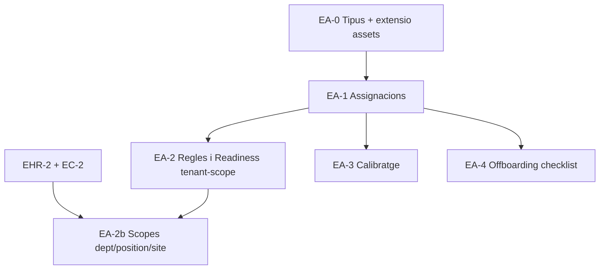

# Pla executable — Employee Assets Tracking (EA)

> **Data:** 2026-07-16
> **Estat:** pla executable — pendent d'implementació
> **Origen:** revisió crítica del `plan-employees-hr-core-v2.md` sota principis d'Employee Lifecycle Management (ELM) agnòstic
> **Relació:** pilar #3 de l'ELM. Alimenta `plan-compliance-readiness.md` (un EPI obligatori absent és un motiu de bloqueig igual que una certificació caducada) i és consumit indirectament per `plan-elm-architecture.md` via `compute_employee_readiness`.
> **Principi de producte:** el seguiment de recursos físics és un domini d'inventari amb assignació temporal, no un camp de text a la fitxa de l'empleat.
> **Revisió 2026-07-16b (autorevisió):** aquesta versió reemplaça el disseny original (`asset_catalog`/`employee_assets` com a segon inventari paral·lel) per una extensió additiva de `data.assets` (EAM ja existent) + un llibre d'assignacions append-only, després de detectar que el disseny original perdia historial d'assignacions i duplicava un inventari que ja existeix. Vegeu §0.

---

## 0. Registre de canvis (autorevisió)

| # | Problema detectat | Correcció aplicada |
|---|---|---|
| 1 | El disseny original creava `data.asset_catalog`/`data.employee_assets` com a segon inventari físic, en col·lisió de concepte (i gairebé de nom) amb `data.assets` (EAM de site/ubicació) ja existent | §3/§4: reutilitzar `data.assets` com a catàleg físic canònic; només s'afegeix `data.asset_types` (catàleg de tipus) i `data.employee_asset_assignments` (llibre d'assignacions) |
| 2 | `api.assign_employee_asset`/`api.return_employee_asset` feien `UPDATE` sobre la mateixa fila, sobreescrivint `assigned_at`/`returned_at`/documents de l'assignació anterior — contradient EA-D6 (no hard delete, es manté historial) | §6: `data.employee_asset_assignments` com a taula d'intervals append-only; assignar = `INSERT`, retornar = `UPDATE` només de la fila oberta |
| 3 | RPCs `SECURITY DEFINER` sense guarda de tenant entre `employee_id` i l'actiu | §6: comprovació explícita de tenant a totes les RPCs |
| 4 | Permisos `assets.*` nous xocaven amb els permisos `assets.view`/`assets.manage` ja existents per a l'EAM de site | §5: es reutilitzen els mateixos permisos `assets.*`, amb sub-permisos `assets.employee_assignments.{view,manage}` |
| 5 | RLS "l'empleat mateix, lectura pròpia" assumia `auth.uid()` | §5: RPC dedicada de portal, mateix patró que ES/CR |

---

## 1. Resum executiu

Aquest pla defineix el **seguiment de recursos físics associats a l'empleat**: EPIs, vehicles i eines calibrades. No existia cap disseny previ per a aquest domini al pla EHR — el pla actual només l'esmenta de passada a l'offboarding ("devolució equipament") sense model de dades.

Es crea com a pla propi, no com a subsecció, perquè introdueix un patró nou (inventari amb assignació temporal, calibratge, condició de retorn) que no comparteix cicle de vida amb res de l'HR core existent i, com les certificacions, pot ser un motiu de bloqueig de Readiness.

---

## 2. Objectius

### Funcionals
- Catàleg d'actius (tipus, si requereix calibratge, si bloqueja Readiness si falta).
- Assignació d'un actiu a un empleat amb data, responsable i justificant.
- Retorn amb condició i data.
- Calibratge periòdic per a eines (dates de venciment, com les certificacions).
- Visibilitat de "què té assignat cada empleat" i "què li falta assignar segons el seu rol".

### Tècnics
- Mateix rigor que el pla CR: cap columna d'estat materialitzada com a font de veritat de bloqueig.
- Zero acoblament amb `projects`/`tasks`/futur `work_order`. Un actiu s'assigna a un `employee_id`, mai a un projecte o una tasca (l'ús d'un actiu *durant* un treball concret és un problema del Dispatcher, no de l'ELM).
- Integració amb DMS per a justificants d'entrega (albarà signat).

---

## 3. Decisions de disseny

### EA-D1 — `data.assets` (EAM) és el catàleg físic canònic; no es crea un segon inventari

Una versió anterior d'aquest pla creava `data.asset_catalog`/`data.employee_assets` com a inventari propi de l'ELM, en col·lisió directa amb [`data.assets`](supabase/migrations/20260502000002_locations_assets.sql) (actius de site/ubicació, ja en producció amb RLS, auditoria i vista `api.assets`). Aquest pla **estén** `data.assets` de manera additiva en lloc de duplicar-lo:

- `data.asset_types` (nou, catàleg de *tipus*: EPI de categoria III, furgoneta, polímetre calibrable) — equivalent al que abans es deia `asset_catalog`, però com a catàleg de tipus, no d'instàncies.
- `data.assets` (existent) guanya `asset_type_id` (FK opcional a `asset_types`), `requires_calibration`, `calibration_interval_days`, `calibration_due_on`, `blocks_dispatch_if_missing` — totes nullable/`false` per defecte, per no trencar cap fila existent d'EAM de site.
- Un actiu assignable a un empleat (casc, furgoneta, polímetre) és una fila normal de `data.assets`, exactament amb el mateix `site_id` (site d'origen/estoc) que ja usa l'EAM. Cent cascs idèntics són cent files (com ja passa amb qualsevol actiu individual avui).

### EA-D2 — L'assignació és un llibre a part, no un camp a `data.assets`

`data.employee_asset_assignments` és la taula que registra "qui té què i des de quan" (§4.2). `data.assets` no guanya cap columna `employee_id`: un actiu "no assignat" és simplement un actiu sense cap fila oberta (`returned_at IS NULL`) a `employee_asset_assignments`, exactament el mateix concepte que EA-D2 volia expressar, però sense necessitat d'un `employee_id` nullable al catàleg físic (que hauria xocat amb els usos EAM existents de `data.assets` per a actius de site que mai s'assignen a una persona).

### EA-D3 — El bloqueig de Readiness és per absència, no per estat de l'actiu

Un empleat és no-ready si li falta un actiu `blocks_dispatch_if_missing=true` que el seu rol requereix (via una taula de regles anàloga a `compliance_requirement_rules`), no perquè l'actiu que té assignat estigui "en mal estat" (`data.assets.status`, ja existent, és informatiu — no és un gate automàtic en aquesta fase; es podria afegir a una fase posterior si el negoci ho demana explícitament).

### EA-D4 — Calibratge tractat com una caducitat, reutilitzant el mateix patró que CR

`data.assets.calibration_due_on` es tracta amb la mateixa lògica de `compute_certification_status` (actiu/pròxim a caducar/caducat), no es reinventa un segon sistema d'alertes. És una propietat de l'actiu físic (independentment de qui el porti en un moment donat), per això viu a `data.assets`, no a `employee_asset_assignments`.

### EA-D5 — Justificant d'entrega/retorn via DMS polimòrfic, mai camp de text lliure

`acknowledgment_document_id` / `return_document_id` a `employee_asset_assignments` apunten a `data.documents`.

### EA-D6 — No hard delete, i l'historial d'assignacions és append-only real (reforçat, §0 punt 2)

Un actiu retirat (`data.assets.status='retired'`) es manté per a historial/auditoria d'inventari — sense canvis respecte al comportament EAM ja existent. **Cap fila d'`employee_asset_assignments` no s'actualitza mai després de tancar-se** (`returned_at` un cop escrit és definitiu); una versió anterior d'aquest pla sobreescrivia la mateixa fila en cada assignació nova, perdent l'historial de qui va portar l'actiu abans. DELETE físic només per correcció de drafts abans de cap ús real.

### EA-D7 — Permisos reutilitzats del namespace `assets.*` existent, no un domini nou

Una versió anterior d'aquest pla creava el namespace `assets.catalog.manage`/`assets.view`/`assets.manage` com si fos nou, quan `assets.view`/`assets.manage` **ja existeixen** per a l'EAM de site. Es reutilitzen aquests mateixos permisos per a la lectura/gestió del catàleg de tipus i de l'actiu físic, i s'afegeixen els sub-permisos específics d'assignació a persones: `assets.employee_assignments.view`, `assets.employee_assignments.manage`. Un responsable de magatzem amb `assets.manage` gestiona l'inventari físic; només qui tingui també `assets.employee_assignments.manage` pot assignar-lo a un empleat concret — separació útil perquè un responsable de PRL pot necessitar assignar EPIs sense poder donar d'alta vehicles nous al catàleg.

### EA-D8 — Guarda de tenant explícita (mateix principi que ES-D9/CR-D8)

Totes les funcions `SECURITY DEFINER` d'aquest pla (`api.assign_employee_asset`, `api.return_employee_asset`, l'extensió de `compute_employee_readiness`) validen que l'actiu i l'empleat pertanyen al tenant actiu abans de mutar o retornar cap dada.

---

## 4. Model de dades

### 4.1 `data.asset_types` (catàleg de tipus, nou)

```sql
CREATE TABLE data.asset_types (
  id                        uuid        PRIMARY KEY DEFAULT gen_random_uuid(),
  tenant_id                 uuid        REFERENCES data.tenants(id) ON DELETE CASCADE, -- NULL = catàleg de plataforma, clonable
  code                      text        NOT NULL,
  name                      text        NOT NULL,
  category                  text        NOT NULL CHECK (category IN ('epi', 'vehicle', 'tool', 'device', 'other')),
  requires_return           boolean     NOT NULL DEFAULT true,
  requires_calibration      boolean     NOT NULL DEFAULT false,
  calibration_interval_days int         CHECK (calibration_interval_days IS NULL OR calibration_interval_days > 0),
  blocks_dispatch_if_missing boolean    NOT NULL DEFAULT false,
  is_active                 boolean     NOT NULL DEFAULT true,
  created_at                timestamptz NOT NULL DEFAULT now(),
  UNIQUE (tenant_id, code)
);
```

### 4.2 Extensió additiva a `data.assets` (EAM existent)

**Cap columna nova és `NOT NULL` sense `DEFAULT`; zero risc per a files EAM existents (actius de site que mai s'assignaran a un empleat):**

```sql
ALTER TABLE data.assets
  ADD COLUMN asset_type_id         uuid REFERENCES data.asset_types(id),
  ADD COLUMN requires_calibration  boolean NOT NULL DEFAULT false,
  ADD COLUMN calibration_due_on    date,
  ADD COLUMN blocks_dispatch_if_missing boolean NOT NULL DEFAULT false;

CREATE INDEX idx_assets_asset_type_id ON data.assets (asset_type_id) WHERE asset_type_id IS NOT NULL;
CREATE INDEX idx_assets_calibration_due_on
  ON data.assets (tenant_id, calibration_due_on) WHERE calibration_due_on IS NOT NULL;
```

Un actiu assignable a persones (casc, furgoneta, polímetre) és una fila de `data.assets` amb `asset_type_id` no nul. Un actiu EAM tradicional (maquinària fixa de nau) continua amb `asset_type_id NULL` i cap dels camps nous li afecta.

### 4.3 `data.employee_asset_assignments` (llibre d'assignacions, append-only)

```sql
CREATE TABLE data.employee_asset_assignments (
  id                    uuid        PRIMARY KEY DEFAULT gen_random_uuid(),
  tenant_id             uuid        NOT NULL REFERENCES data.tenants(id)  ON DELETE CASCADE,
  asset_id              uuid        NOT NULL REFERENCES data.assets(id)  ON DELETE CASCADE,
  employee_id           uuid        NOT NULL REFERENCES data.employees(id) ON DELETE CASCADE,
  assigned_at           timestamptz NOT NULL DEFAULT now(),
  assigned_by           uuid        NOT NULL REFERENCES data.profiles(id),
  expected_return_at    timestamptz,
  returned_at           timestamptz,                 -- NULL = assignació oberta (l'empleat encara el té)
  return_condition      text        CHECK (return_condition IS NULL OR return_condition IN ('good', 'damaged', 'lost')),
  returned_by           uuid        REFERENCES data.profiles(id),
  acknowledgment_document_id uuid   REFERENCES data.documents(id),
  return_document_id    uuid        REFERENCES data.documents(id),
  notes                 text,
  created_at            timestamptz NOT NULL DEFAULT now(),

  CONSTRAINT employee_asset_assignments_return_consistency CHECK (
    (returned_at IS NULL AND return_condition IS NULL) OR (returned_at IS NOT NULL)
  )
);

-- Un actiu físic només pot tenir una assignació oberta alhora (no es pot "regalar" a dues persones).
CREATE UNIQUE INDEX uq_employee_asset_assignments_open_per_asset
  ON data.employee_asset_assignments (asset_id) WHERE returned_at IS NULL;

CREATE INDEX idx_employee_asset_assignments_employee_open
  ON data.employee_asset_assignments (employee_id) WHERE returned_at IS NULL;
CREATE INDEX idx_employee_asset_assignments_asset
  ON data.employee_asset_assignments (asset_id);
```

**Cap `UPDATE` mai toca una fila amb `returned_at` ja escrit (EA-D6):** l'única mutació permesa sobre una fila existent és tancar-la (escriure `returned_at`/`return_condition`/`returned_by` un únic cop). Assignar de nou el mateix actiu, encara que sigui al mateix empleat, sempre crea una fila nova.

### 4.4 `data.asset_requirement_rules` (anàloga a `compliance_requirement_rules`)

```sql
CREATE TABLE data.asset_requirement_rules (
  id             uuid PRIMARY KEY DEFAULT gen_random_uuid(),
  tenant_id      uuid NOT NULL REFERENCES data.tenants(id) ON DELETE CASCADE,
  asset_type_id  uuid NOT NULL REFERENCES data.asset_types(id) ON DELETE CASCADE,
  scope_type     text NOT NULL CHECK (scope_type IN ('tenant', 'department', 'job_position', 'site')),
  scope_id       uuid,
  is_blocking    boolean NOT NULL DEFAULT true,
  is_active      boolean NOT NULL DEFAULT true,
  created_at     timestamptz NOT NULL DEFAULT now(),

  CONSTRAINT asset_rules_scope_id_check CHECK (
    (scope_type = 'tenant' AND scope_id IS NULL) OR
    (scope_type <> 'tenant' AND scope_id IS NOT NULL)
  )
);
```

Mateix règim de multi-scope que CR-D3 (pla CR): totes les regles aplicables s'avaluen, cap "guanya" per especificitat. Mateixa limitació de MVP que CR-D3bis: scopes no-tenant només s'activen a EA-2b, després d'EHR-2/EC-2.

### 4.5 Extensió a `data.compute_employee_readiness` (pla CR)

El pla CR defineix la funció central. Aquest pla n'estén el cos amb un segon bloc d'avaluació (mateixa funció, no una funció paral·lela — evita que el Dispatcher hagi de cridar dues funcions diferents). **Correcció respecte a la versió anterior (§0):** l'existència de l'actiu es comprova amb `employee_asset_assignments` (`returned_at IS NULL`), no amb una columna `status='assigned'` sobre una taula d'instàncies pròpia:

```sql
-- Afegit dins data.compute_employee_readiness, després del bloc de compliance_requirement_rules:
FOR v_asset_rule IN
  SELECT r.*, t.code AS asset_code, t.name AS asset_name
  FROM data.asset_requirement_rules r
  JOIN data.asset_types t ON t.id = r.asset_type_id
  WHERE r.tenant_id = v_tenant_id
    AND r.is_active
    AND (
      (r.scope_type = 'tenant') OR
      (r.scope_type = 'department'   AND r.scope_id = v_scope_dept) OR
      (r.scope_type = 'job_position' AND r.scope_id = v_scope_position) OR
      (r.scope_type = 'site'         AND r.scope_id = v_scope_site)
    )
LOOP
  SELECT EXISTS (
    SELECT 1 FROM data.employee_asset_assignments eaa
    JOIN data.assets a ON a.id = eaa.asset_id
    WHERE eaa.employee_id = p_employee_id
      AND eaa.returned_at IS NULL              -- assignació oberta = "el té ara"
      AND a.asset_type_id = v_asset_rule.asset_type_id
      AND (a.calibration_due_on IS NULL OR a.calibration_due_on >= p_as_of)
  ) INTO v_has_asset;

  IF NOT v_has_asset AND v_asset_rule.is_blocking THEN
    v_reasons := array_append(v_reasons, 'MISSING_ASSET:' || v_asset_rule.asset_code);
  END IF;
END LOOP;
```

Aquesta modificació es fa a la migració `M-EA-04` (§7), no a la migració original de CR, per mantenir cada pla responsable de la seva pròpia migració — es documenta explícitament la dependència d'ordre. Segueix el patró de composició (no `CREATE OR REPLACE` cec) descrit a EHR/H6: es manté un únic fitxer "propietari" de la funció completa a partir d'aquesta migració, amb comentari explícit de quina fase n'és responsable de quin bloc.

---

## 5. Permisos i RLS

**Reutilització de permisos existents (EA-D7, §0 punt 4):** `assets.view`/`assets.manage` ja existeixen per a l'EAM de site — no es dupliquen. Només s'afegeixen els sub-permisos d'assignació a persones:

| Permís | Ús | Nou/existent |
|---|---|---|
| `assets.view` | veure el catàleg físic (`data.assets`, inclosos els actius assignables) | existent |
| `assets.manage` | crear/editar actius i `data.asset_types` | existent |
| `assets.employee_assignments.view` | veure qui té assignat cada actiu i l'historial d'assignacions | nou |
| `assets.employee_assignments.manage` | assignar/retornar un actiu a un empleat | nou |

RLS `data.employee_asset_assignments`:
- `SELECT`: `assets.employee_assignments.view`.
- `INSERT`/`UPDATE`: exclusivament via RPC (`api.assign_employee_asset`, `api.return_employee_asset`), sense policy d'escriptura directa per a `authenticated` — mateix patró que `employee_lifecycle_events` (pla ES).
- `DELETE`: bloquejat (EA-D6) — cap policy de `DELETE`.
- **Lectura pròpia des del portal (N7, mateix patró que ES/CR):** el portal d'empleat és token/PIN/QR, no sempre té `auth.uid()`. En lloc de "policy RLS per al propi empleat", es defineix `api.get_own_asset_assignments(p_portal_token uuid)`, RPC `SECURITY DEFINER` que valida el token igual que la resta d'RPCs de portal.

RLS de `data.asset_types`: mateix patró que `assets.view`/`assets.manage` ja aplicat a `data.assets` (§4 de la migració original de l'EAM).

---

## 6. RPCs

**Correccions respecte a la versió anterior d'aquest pla (§0):** (a) `assign`/`return` ja no fan `UPDATE` sobre la mateixa fila — `assign` insereix una nova fila a `employee_asset_assignments`, `return` només tanca la fila oberta corresponent; (b) guarda de tenant explícita entre l'actiu i l'empleat (EA-D8); (c) permís `assets.employee_assignments.manage`, no `assets.manage` (que ara és només per al catàleg físic).

```sql
CREATE OR REPLACE FUNCTION api.assign_employee_asset(
  p_asset_id     uuid,
  p_employee_id  uuid,
  p_acknowledgment_document_id uuid DEFAULT NULL,
  p_expected_return_at timestamptz DEFAULT NULL
) RETURNS data.employee_asset_assignments
LANGUAGE plpgsql SECURITY DEFINER SET search_path = data, api AS $$
DECLARE
  v_tenant_id uuid := data.active_tenant_id();
  v_site_id   uuid;
  v_asset     data.assets;
  v_employee_tenant uuid;
  v_assignment data.employee_asset_assignments;
BEGIN
  SELECT * INTO v_asset FROM data.assets WHERE id = p_asset_id AND tenant_id = v_tenant_id;
  IF v_asset.id IS NULL THEN
    RAISE EXCEPTION 'asset_not_found: %', p_asset_id USING ERRCODE = 'no_data_found';
  END IF;

  -- Guarda de tenant (EA-D8/§0 punt 3): l'actiu i l'empleat han de ser del mateix tenant actiu.
  SELECT tenant_id INTO v_employee_tenant FROM data.employees WHERE id = p_employee_id;
  IF v_employee_tenant IS NULL OR v_employee_tenant <> v_tenant_id THEN
    RAISE EXCEPTION 'employee_not_found: %', p_employee_id USING ERRCODE = 'no_data_found';
  END IF;

  v_site_id := v_asset.site_id;
  IF NOT data.jwt_has_permission(v_tenant_id, 'assets.employee_assignments.manage', v_site_id) THEN
    RAISE EXCEPTION 'insufficient_privilege' USING ERRCODE = 'insufficient_privilege';
  END IF;

  -- L'índex únic parcial (§4.3) ja ho garanteix a nivell de constraint;
  -- aquí es comprova abans per donar un missatge d'error més clar.
  IF EXISTS (SELECT 1 FROM data.employee_asset_assignments WHERE asset_id = p_asset_id AND returned_at IS NULL) THEN
    RAISE EXCEPTION 'asset_already_assigned: %', p_asset_id USING ERRCODE = 'check_violation';
  END IF;

  INSERT INTO data.employee_asset_assignments (
    tenant_id, asset_id, employee_id, assigned_by, expected_return_at, acknowledgment_document_id
  ) VALUES (
    v_tenant_id, p_asset_id, p_employee_id, auth.uid(), p_expected_return_at, p_acknowledgment_document_id
  )
  RETURNING * INTO v_assignment;

  PERFORM data.log_audit_event(
    v_tenant_id, auth.uid(), v_site_id, 'ASSET_ASSIGNED', 'employee_asset_assignment', v_assignment.id,
    jsonb_build_object('employee_id', p_employee_id, 'asset_id', p_asset_id)
  );
  PERFORM data.refresh_employee_readiness_projection(p_employee_id);  -- pla CR §5.7 / ES §7.2bis

  RETURN v_assignment;
END; $$;

CREATE OR REPLACE FUNCTION api.return_employee_asset(
  p_asset_id       uuid,
  p_condition      text DEFAULT 'good',
  p_return_document_id uuid DEFAULT NULL,
  p_notes          text DEFAULT NULL
) RETURNS data.employee_asset_assignments
LANGUAGE plpgsql SECURITY DEFINER SET search_path = data, api AS $$
DECLARE
  v_tenant_id  uuid := data.active_tenant_id();
  v_site_id    uuid;
  v_assignment data.employee_asset_assignments;
BEGIN
  SELECT eaa.*, a.site_id INTO v_assignment, v_site_id
  FROM data.employee_asset_assignments eaa
  JOIN data.assets a ON a.id = eaa.asset_id
  WHERE eaa.asset_id = p_asset_id AND eaa.returned_at IS NULL AND eaa.tenant_id = v_tenant_id
  FOR UPDATE OF eaa;

  IF v_assignment.id IS NULL THEN
    RAISE EXCEPTION 'asset_not_assigned: %', p_asset_id USING ERRCODE = 'check_violation';
  END IF;

  IF NOT data.jwt_has_permission(v_tenant_id, 'assets.employee_assignments.manage', v_site_id) THEN
    RAISE EXCEPTION 'insufficient_privilege' USING ERRCODE = 'insufficient_privilege';
  END IF;

  -- Tanca NOMÉS la fila oberta; mai es reescriu una assignació ja tancada (EA-D6).
  UPDATE data.employee_asset_assignments
  SET returned_at = now(),
      return_condition = p_condition,
      return_document_id = p_return_document_id,
      returned_by = auth.uid(),
      notes = COALESCE(p_notes, notes)
  WHERE id = v_assignment.id
  RETURNING * INTO v_assignment;

  IF p_condition = 'lost' THEN
    UPDATE data.assets SET status = 'retired' WHERE id = p_asset_id;  -- estat de l'actiu físic, no de l'assignació
  END IF;

  PERFORM data.log_audit_event(
    v_tenant_id, auth.uid(), v_site_id, 'ASSET_RETURNED', 'employee_asset_assignment', v_assignment.id,
    jsonb_build_object('condition', p_condition)
  );
  PERFORM data.refresh_employee_readiness_projection(v_assignment.employee_id);

  RETURN v_assignment;
END; $$;
```

---

## 7. Fases d'implementació

### EA-0 — Catàleg de tipus i extensió de `data.assets`

**Prioritat:** P1 · **Dependències:** EHR-0

- Migració `M-EA-01_asset_types.sql`: `data.asset_types`.
- Migració `M-EA-02_assets_extension.sql`: `ALTER TABLE data.assets` additiu (§4.2).
- Registre a `data.entity_types` (pla ES §9.4) com `employee_asset_assignment` (no `employee_asset`: l'entitat adjuntable de documents/timeline és l'assignació, no l'actiu físic, que ja existeix com a `asset`).
- UI de catàleg mínima (reutilitza la UI d'EAM existent, hi afegeix els camps nous).

**Criteris d'acceptació**
- [ ] Es pot definir un tipus d'actiu amb/sense calibratge i amb/sense `blocks_dispatch_if_missing`.
- [ ] Cap fila existent de `data.assets` (EAM de site) canvia de comportament després de la migració additiva.

### EA-1 — Assignacions

**Prioritat:** P1 · **Dependències:** EA-0

- Migració `M-EA-03_employee_asset_assignments.sql`: taula + índex únic parcial (§4.3) + permisos `assets.employee_assignments.{view,manage}`.
- `api.assign_employee_asset`, `api.return_employee_asset` (§6, amb guarda de tenant i sense sobreescriptura d'historial).
- Tab "Equipament" a `EmployeeDetailPage.tsx`, mostrant l'assignació oberta actual i l'historial de tancades.
- Vista d'inventari global reutilitzant `api.assets` (EAM) + JOIN a l'assignació oberta si n'hi ha.

**Criteris d'acceptació**
- [ ] Un actiu no es pot tenir dues assignacions obertes simultànies (constraint únic parcial + test de concurrència).
- [ ] Retorn amb condició `lost` tanca l'assignació i marca l'actiu (`data.assets.status='retired'`), no una columna pròpia d'aquest domini.
- [ ] Assignar el mateix actiu una segona vegada (a la mateixa o diferent persona) crea una fila nova; la fila anterior tancada mai es modifica.
- [ ] Justificant d'entrega opcional però recomanat per a EPIs.
- [ ] Test explícit multi-tenant: no es pot assignar un actiu d'un tenant a un empleat d'un altre.

### EA-2 — Regles i integració amb Readiness (MVP: `scope_type='tenant'`)

**Prioritat:** P1 · **Dependències:** EA-1, CR-2c (projecció de readiness, no només CR-2) · **Estat:** ✅ tancat com EA-2r (`20261086000001`)

- Migració `M-EA-04_asset_requirement_rules.sql`: `data.asset_requirement_rules`.
- Migració `M-EA-05_readiness_assets_extension.sql` que estén `compute_employee_readiness` (pla CR) amb el bloc d'actius (§4.5).
- `api.assign_employee_asset`/`return_employee_asset` criden `refresh_employee_readiness_projection` (§6) — coherent amb l'escriptor d'events BLOCKED/UNBLOCKED d'ES §7.2bis.

**Criteris d'acceptació**
- [x] Empleat sense un EPI obligatori assignat és `is_ready = false` amb motiu `MISSING_ASSET:<code>`.
- [x] Empleat amb l'EPI assignat però amb calibratge caducat (`data.assets.calibration_due_on`) també és `is_ready = false`.
- [x] Regla `is_blocking=false` no bloqueja, només informa.
- [x] MVP: regles `scope_type='tenant'` (+ multi-scope OR ja a compute, com CR-2b; UI crea tenant-scope).

### EA-3 — Calibratge i avisos

**Prioritat:** P2 · **Dependències:** EA-1

- Migració `M-EA-06_asset_calibration_notice_log.sql`: reutilitza el patró de job del `plan-compliance-readiness.md` §6 (job dedicat, no `DATE_FIELD_REACHED`), amb taula de log pròpia `data.asset_calibration_notice_log` per no acoblar-se a la taula de CR.

**Criteris d'acceptació**
- [ ] Avisos 30/7 dies abans de `calibration_due_on`, idempotents.

### EA-4 — Offboarding: checklist de devolució

**Prioritat:** P2 · **Dependències:** EA-1, `plan-elm-architecture.md` ES-5

- Pas d'automatització "devolució d'equipament" a l'offboarding (ja previst a EHR-6, ara amb model de dades real al darrere).

**Criteris d'acceptació**
- [ ] Transició `departure → offboarding` (pla ES) genera un checklist amb totes les assignacions obertes (`employee_asset_assignments.returned_at IS NULL`) de l'empleat.
- [ ] `terminated` no és accessible amb assignacions obertes pendents, o queda marcat com a excepció auditada (decisió de negoci a tancar en aquesta fase, no bloqueig dur per defecte).

---

## 8. Ordre i dependències



`EA-2` depèn també de `CR-2c` del pla `plan-compliance-readiness.md` (projecció de readiness) perquè estén la mateixa funció i reutilitza el mateix escriptor d'events.

---

## 9. Estratègia de proves

- **SQL:** assignació/retorn, constraint únic parcial (una assignació oberta per actiu), concurrència en assignar el mateix actiu dues vegades, tancament d'una assignació no crea files noves ni modifica les tancades anteriors.
- **Readiness:** casos combinats compliment + actius (un empleat pot ser no-ready per un motiu, per l'altre, o per tots dos alhora — l'array `blocking_reasons` ha de contenir tots els motius, no només el primer).
- **Regressió:** cap canvi en aquest pla toca `data.compliance_requirement_rules` ni `data.employee_certifications`; cap fila EAM existent de `data.assets` canvia de comportament.
- **Seguretat:** RLS amb els quatre rols de referència (owner, manager sense permís, responsable de magatzem amb `assets.manage` sense `employee_assignments.manage`, responsable de PRL amb `assets.employee_assignments.manage` sense `assets.manage`); test explícit multi-tenant a `assign_employee_asset`/`return_employee_asset`.

---

## 10. Riscos i mitigacions

| Risc | Mitigació |
|---|---|
| Confondre "condició de l'actiu" amb "bloqueig de Readiness" i acabar bloquejant per motius no previstos | EA-D3 explícit: només absència, no estat, bloqueja per defecte |
| Dues funcions de Readiness (CR i EA) que divergeixen | Una sola funció (`compute_employee_readiness`), estesa per migració, no duplicada |
| Inventari físic desincronitzat de la realitat (actius "perduts" sense marcar) | Procés operatiu (fora d'abast de codi): auditoria periòdica d'inventari; el sistema no pot resoldre disciplina operativa, només facilitar-la |
| Acoblament accidental amb `projects`/`tasks` ("qui té l'eina X al projecte Y") | Explícitament fora d'abast (EA §2): és responsabilitat del futur Dispatcher, que ha de consultar `employee_id` i prou |
| Un segon inventari paral·lel a `data.assets` reapareix en una fase futura per pressa | EA-D1 documentat com a decisió tancada; PR review ha de rebutjar qualsevol taula nova de "catàleg físic" per a l'ELM |
| Sobreescriptura d'historial d'assignacions | Constraint únic parcial + `CHECK` de consistència (§4.3) impedeixen reobrir o duplicar una assignació tancada |

---

## 11. Criteris globals de Done

- [ ] Catàleg físic reutilitzat (`data.assets`), sense inventari paral·lel; catàleg de tipus (`data.asset_types`) separat de les instàncies.
- [ ] Assignació/retorn només via RPC, amb auditoria, i sense sobreescriure mai una assignació tancada.
- [ ] Readiness combina compliment i actius en una única funció i un únic array de motius.
- [ ] Totes les funcions `SECURITY DEFINER` amb `employee_id`/`asset_id` per paràmetre validen el tenant actiu.
- [ ] Zero FK sortint des d'aquest domini cap a `projects`/`tasks`/futur `work_order`.
- [ ] Tests SQL i RLS verds.

---

## 12. Estimació orientativa

| Fase | Esforç |
|---|---:|
| EA-0 Tipus + extensió `data.assets` | 2–3 dies |
| EA-1 Assignacions | 4–6 dies |
| EA-2 Regles i Readiness (tenant-scope) | 2–4 dies |
| EA-2b Scopes dept/position/site | 1–3 dies (després d'EHR-2/EC-2) |
| EA-3 Calibratge | 2–3 dies |
| EA-4 Offboarding checklist | 2–3 dies |

Total: **13–22 dies**. No forma part del MVP mínim (§13 del pla ELM architecture); es prioritza després de validar el pilot de Readiness amb certificacions. EA-2b és post-MVP.

---

## 13. Referències

- `docs/plans/employees/plan-employees-hr-core-v2.md`
- `docs/plans/employees/plan-elm-architecture.md`
- `docs/plans/employees/plan-compliance-readiness.md`
- `docs/product-design/04-roles-and-permissions.md`
