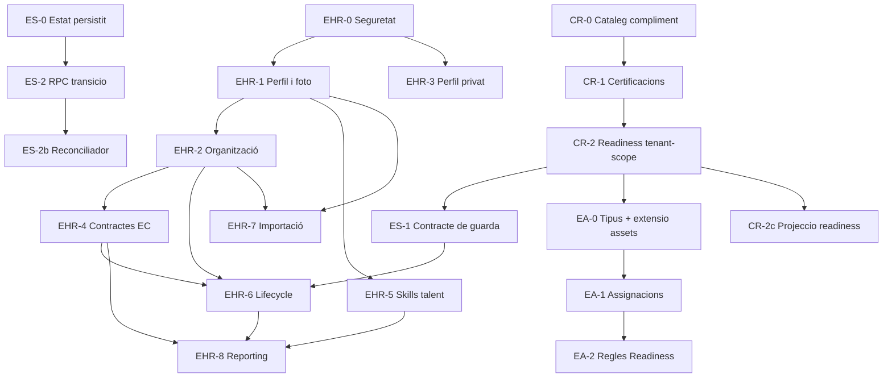

# Pla executable — Employees / HR Core V2 (EHR)

> **Data:** 2026-07-15  
> **Estat:** pla executable — pendent d'implementació  
> **Origen:** `docs/plans/odoo/estudi-empleats-pimed-vs-odoo.md`  
> **Abast:** evolució del registre operatiu d'empleats a nucli HR  
> **Pla específic dependent:** [`plan-employment-contracts.md`](./plan-employment-contracts.md)  
> **Plans ELM dependents (revisió 2026-07-16):** [`plan-elm-architecture.md`](./plan-elm-architecture.md) (motor d'estats + contracte amb el futur Dispatcher), [`plan-compliance-readiness.md`](./plan-compliance-readiness.md) (certificacions i Readiness), [`plan-employee-assets.md`](./plan-employee-assets.md) (EPIs, vehicles, eines)  
> **Pla específic posterior:** [`plan-employee-personal-data-self-service.md`](./plan-employee-personal-data-self-service.md) (EHR-3.4: autoservei de dades de contacte amb aprovació HR)  
> **Principi de producte:** adoptar el millor d'Odoo Employees sense copiar el model ERP ni perdre el portal token-based i l'especialització en assistència laboral espanyola. El nucli funcional segueix els principis d'un **Employee Lifecycle Management (ELM) agnòstic**: aquest pla orquestra, els tres plans ELM defineixen el detall.

---

## 1. Resum executiu

El mòdul actual és un registre d'empleats funcional però mínim. `data.employees` és el hub de claus externes d'assistència, portal, documents, signatures i revisió de nòmina, però encara no és un HR core complet, i **no és un Employee Lifecycle Management (ELM)**: no té estat de cicle de vida persistit, no té noció de Readiness consultable per tercers i no té model de recursos físics.

Revisió 2026-07-16: aquest pla passa a ser l'**orquestrador** d'un ELM agnòstic construït sobre tres pilars, cadascun amb pla propi (mateix patró que ja s'aplica a contractes amb el pla EC):

1. **Motor d'estats** (`candidate → onboarding → active → on_leave → departure → offboarding → terminated`) → [`plan-elm-architecture.md`](./plan-elm-architecture.md).
2. **Compliment i Readiness** (certificacions, caducitats legals, reconeixements mèdics) → [`plan-compliance-readiness.md`](./plan-compliance-readiness.md).
3. **Recursos físics** (EPIs, vehicles, eines calibrades) → [`plan-employee-assets.md`](./plan-employee-assets.md).

L'ELM és **agnòstic d'operacions**: no coneix `Project`, `Task` ni un futur `WorkOrder`. Exposa una única superfície cap a un futur Dispatcher d'Ordres de Treball (V2, fora d'abast d'aquest track): una funció de guarda síncrona (`assert_employee_dispatch_eligible`) i dos noms d'esdeveniment. Vegeu `plan-elm-architecture.md` §7 per al contracte complet.

Aquest pla continua convertint el mòdul en un nucli HR modular amb:

- Directori d'empleats amb foto privada.
- Perfil laboral estructurat.
- Posicions, etiquetes i jerarquia manager/subordinat.
- Informació personal separada i restringida.
- Contractes laborals temporals mitjançant el pla EC.
- Skills i experiència de talent (cerca interna; les certificacions de compliment es delaguen al pla CR — vegeu D7 i §13).
- Organigrama.
- Onboarding i offboarding lleugers, ara disparats per transicions reals del motor d'estats (pla ES), no per `EMPLOYEE_CREATED`.
- Importació CSV i mappings externs.
- Reporting HR bàsic.

No s'implementaran nòmina completa, reclutament, avaluacions 360°, flota, despeses ni gamificació en aquest track.

El primer bloqueig és de seguretat: abans de guardar informació personal o contractual cal corregir les vistes API, separar el directori públic intern de les dades HR i alinear permisos UI/RLS. El segon bloqueig, detectat en la revisió ELM, és un acoblament ja existent entre el domini operacional actual i `data.profiles` en lloc d'`data.employees` (§2.3) que cal corregir abans de construir cap Dispatcher futur.

---

## 2. Baseline actual verificat

### 2.1 Implementat

- CRUD manual d'empleats.
- Cerca i filtres per estat, departament i site.
- Fitxa amb informació bàsica.
- `user_id` opcional a DB.
- Departaments jeràrquics amb `parent_id`.
- `departments.manager_id` a DB, referenciant `data.profiles`.
- Documents per empleat.
- Entity Timeline.
- Full horari i calendari laboral.
- Overrides d'assistència.
- Portal d'empleat amb token, PIN, DNI, QR i email.
- Revisió/exportació de nòmina des d'assistència.
- Auditoria `EMPLOYEE_CREATED`, `UPDATED`, `TERMINATED`, `DELETED`.

### 2.2 Mancances

- Foto d'empleat.
- Codi intern.
- Nom legal vs nom visible.
- UI per vincular `user_id`.
- Posicions laborals estructurades.
- Etiquetes/categorització lliure.
- Manager entre empleats.
- Organigrama.
- Informació personal restringida.
- Contractes amb historial.
- Skills, experiència i certificacions.
- Importació.
- Onboarding/offboarding.
- Reporting HR.
- Tests dedicats al CRUD/RLS del core d'empleats.

### 2.3 Deute tècnic que condiciona el pla

- La UI només permet escriure a `owner`/`manager`, mentre la DB també reconeix `hr.manage`.
- El portal administratiu usa `attendance.manage`.
- `PermissionKey` del frontend no conté permisos HR.
- `api.employees` ha estat recreada sense `security_invoker=true`.
- La política SELECT de `data.employees` permet lectura a qualsevol membre del tenant.
- El bucket DMS general permet lectura per pertinença al tenant.
- Formulari modal i formulari de detall dupliquen camps.
- `document_id` és opcional al formulari però necessari per crear accés al portal.
- No hi ha tests frontend ni SQL específics del CRUD d'empleats.
- **`data.tasks.assignee_id` i `data.work_logs.worker_id` referencien `data.profiles(id)`, no `data.employees(id)`.** El domini operacional actual (i, per extensió, el futur Dispatcher si es construeix sobre el mateix patró) ja depèn de `User` en lloc d'`Employee`, contradient el principi D1 d'aquest mateix pla. Un empleat sense compte no pot tenir avui cap tasca ni cap fitxatge de camp. Refactor detallat a `plan-elm-architecture.md` §8 (ES-3).
- No hi ha registre canònic d'`entity_type` polimòrfic: es repeteix com a `CHECK` en almenys 9 migracions amb llistes inconsistents entre subsistemes (Entity Timeline, signing, subscripcions). Cal resoldre abans d'afegir `employee_certification`/`employee_asset` com a entitats adjuntables — vegeu `plan-elm-architecture.md` §9.4 (ES-4).

---

## 3. Abast i límits

### 3.1 Inclòs

- Seguretat i permisos HR.
- Directori intern segur.
- Perfil laboral.
- Perfil personal privat.
- Foto.
- Posicions i tags.
- Jerarquia organitzativa.
- Contractes laborals per integració amb EC.
- Skills, experiència i certificacions.
- Onboarding/offboarding bàsic.
- Importació i mapping extern.
- Reporting operatiu.
- Portal self-service limitat.

### 3.2 Fora d'abast

- Nòmina end-to-end.
- Càlcul fiscal o cotitzacions.
- Recruitment/ATS.
- Appraisals/360°.
- Expenses/Fleet.
- eLearning complet.
- Gamificació i badges.
- Gestió de carrera/successió.
- Directori públic fora del tenant.
- Substituir el portal token-based per comptes d'usuari.

### 3.3 Plans que continuen sent autoritat

- Contractes: `docs/plans/employees/plan-employment-contracts.md`.
- **Motor d'estats i contracte amb el Dispatcher: `docs/plans/employees/plan-elm-architecture.md`.**
- **Compliment i Readiness (certificacions, caducitats): `docs/plans/employees/plan-compliance-readiness.md`.**
- **Recursos físics (EPIs, vehicles, eines): `docs/plans/employees/plan-employee-assets.md`.**
- Importació: `docs/plans/employee-import/plan.md`.
- **Reclutament / ATS (track separat): `docs/plans/recruitment/README.md`.**
- Assistència i resolver: `docs/plans/checkin/EXECUTION.md`.
- Automatització: `docs/plans/automatitzacio/arquitectura-automatitzacio-v2.md`.
- DMS/signatures: plans i migracions del mòdul signing.

Aquest pla coordina aquests tracks, no en duplica el detall. En particular, **EHR-5 ja no defineix certificacions** (delegat a CR) i **EHR-6 ja no defineix cap estat** (delegat a ES) — vegeu §13 i §14.

---

## 4. Decisions arquitectòniques

### D1 — Employee continua separat de User

- `Employee`: persona contractada.
- `Profile/Auth User`: identitat amb login.
- `TenantMember`: rol i permisos dins el tenant.

`employees.user_id` continua opcional. La foto, els contractes i les skills funcionen per empleats sense compte.

### D2 — Separació per sensibilitat

No s'afegiran dades privades a `api.employees`.

Capas:

1. **Directori:** nom visible, foto, posició, departament, site, manager i contacte laboral.
2. **HR core:** dades laborals, contractes, skills i documents.
3. **Privat:** identificació, contacte personal, emergència, adreça i dades administratives.
4. **Compensació:** imports econòmics amb permisos independents.

### D3 — Foto privada

No es reutilitzarà el bucket públic `avatars`.

Es crearà `employee-photos`:

- Privat.
- Ruta `{tenant_id}/{employee_id}/profile`.
- Upload per `employees.manage`.
- Lectura via signed URL després de validar directori/HR.
- JPEG, PNG o WebP.
- 2 MB màxim.
- Optimització client abans de pujar.

La DB guardarà `photo_object_path`, no una URL signada ni pública.

### D4 — Tres conceptes de categoria

No es barrejaran:

- `job_positions`: lloc funcional estructurat.
- `employee_tags`: classificació lliure N:M.
- `professional_categories`: categoria laboral vinculada al contracte/conveni.

`job_title` està **REMOVED**. El camp únic és `job_positions` / `employees.job_position_id`, etiquetat «Lloc de treball».

### D5 — Jerarquia sobre Employee

- `employees.manager_employee_id → employees.id`.
- `departments.manager_employee_id → employees.id`.

No es basarà l'organigrama en `profiles`, perquè un responsable pot no tenir compte.

El `departments.manager_id → profiles` actual es migrarà o es mantindrà com a projecció de compatibilitat.

### D6 — Contractes delegats al pla EC

Aquest pla no afegirà `contract_type`, conveni, categoria o salari directament a `employees`.

Tota condició temporal viurà a `employment_contracts`.

### D7 — Skills de talent i certificacions de compliment: dominis separats, no catàleg compartit

Revisió 2026-07-16: la versió original d'aquesta decisió proposava que skills i certificacions compartissin catàleg. Es revoca. Són dominis diferents amb criticitat diferent:

- **Skill** (aquest pla, EHR-5): nivell actual, experiència, notes. Serveix per cercar talent. No bloqueja mai res.
- **Certificació de compliment** (`plan-compliance-readiness.md`): emissor, credencial, dates, caducitat, document, i pot bloquejar Readiness. Catàleg propi (`compliance_requirement_types`), no comparteix taula amb `skill_types`.

Un mateix curs pot generar, si el negoci ho vol, una fila a cada catàleg — mai la mateixa fila.

### D11 — Frontera ELM: agnòstic d'operacions

Cap taula d'aquest pla ni dels plans ES/CR/EA pot tenir FK sortint cap a `data.projects`, `data.tasks`, `data.work_logs` ni cap futura taula `work_order`. La única superfície cap a un futur Dispatcher és la definida a `plan-elm-architecture.md` §7 (funció de guarda + dos noms d'esdeveniment). Aquesta regla és normativa per a revisió de PR, no només documentació.

### D8 — No hard delete d'expedients HR

- Empleat: baixa/arxiu.
- Contractes, certificacions i documents: historial.
- DELETE físic només per correcció de drafts o procés legal de purge.

### D9 — API transaccional per operacions crítiques

CRUD senzill pot usar vistes, però:

- Vincular usuari.
- Canviar manager amb validacions.
- Arxivar/terminar (delegat a `plan-elm-architecture.md`, `api.transition_employee_lifecycle`).
- Actualitzar perfil privat.
- Importar.

han d'utilitzar RPC quan hi hagi múltiples efectes, permisos o auditoria. Assignar certificacions/actius (`api.assign_employee_asset`, etc.) són RPCs pròpies dels plans CR/EA, no d'aquest pla.

### D10 — Feature flags i desplegament incremental

Flags proposats:

- `employee_hr_core_v2_enabled`
- `employee_private_profile_enabled`
- `employee_org_chart_enabled`
- `employee_skills_enabled`
- `employment_contracts_enabled` — definit al pla EC
- `employee_lifecycle_plans_enabled`

---

## 5. Arquitectura objectiu

```mermaid
flowchart TB
  Employee[data.employees]
  Lifecycle[data.employee_lifecycle_events — pla ES]
  Private[data.employee_private_profiles]
  Position[data.job_positions]
  Tags[data.employee_tags]
  TagLinks[data.employee_tag_assignments]
  Contract[data.employment_contracts]
  Skills[data.employee_skills]
  Certs[data.employee_certifications — pla CR]
  Assets[data.employee_asset_assignments — pla EA, sobre data.assets EAM]
  Resume[data.employee_resume_entries]
  Dept[data.departments]
  User[data.profiles]
  DMS[data.documents]
  Portal[employee portal]
  Attendance[attendance resolver]
  Dispatcher[futur Dispatcher — V2, fora d'abast]

  Employee --> Lifecycle
  Employee --> Private
  Employee --> Position
  Employee --> TagLinks --> Tags
  Employee --> Contract
  Employee --> Skills
  Employee --> Certs
  Employee --> Assets
  Employee --> Resume
  Employee --> Dept
  Employee -. optional .-> User
  Employee --> DMS
  Contract --> DMS
  Certs --> DMS
  Employee --> Portal
  Contract --> Attendance
  Lifecycle -. assert_employee_dispatch_eligible .-> Dispatcher
  Certs -. compute_employee_readiness .-> Dispatcher
  Assets -. compute_employee_readiness .-> Dispatcher
```



`Dispatcher` es dibuixa només per mostrar la frontera: no s'implementa en aquest pla ni en els plans ES/CR/EA. La fletxa puntejada és l'única superfície permesa (D11).

---

## 6. Model de dades resumit

### 6.1 Extensions a `data.employees`

```text
employee_code          text?
legal_name             text?
preferred_name         text?
photo_object_path      text?
work_email             text?
work_phone             text?
job_position_id        uuid?
manager_employee_id    uuid?
archived_at            timestamptz?
archived_by            uuid?
```

Compatibilitat:

- `full_name`: es manté com a label canònic durant rollout.
- `email`, `phone`: es tracten com a contacte laboral fins migració explícita.
- `job_title`: **REMOVED**; únic camp de lloc: `job_position_id` → `job_positions` («Lloc de treball»).
- `starts_on`, `ends_on`, `weekly_hours`: projecció legacy fins EC.

### 6.2 `data.employee_private_profiles`

Relació 1:1:

```text
employee_id PK/FK
tenant_id
personal_email
personal_phone
birth_date
address
postal_code
city
country_code
nationality_code
document_type
document_number
social_security_number
emergency_contact_name
emergency_contact_phone
emergency_contact_relationship
bank_account_reference / encrypted_iban
metadata
created_at / updated_at
```

Decisions:

- `document_id` actual es migrarà a `document_number`.
- La vista directori no exposarà el document.
- IBAN queda fora del primer MVP si no es tanca l'estratègia de xifrat.

### 6.3 `data.job_positions`

```text
id, tenant_id
code, name, description
department_id?
default_manager_employee_id?
default_site_id?
default_calendar_group_id?
is_active
created_at / updated_at
```

### 6.4 Tags

`data.employee_tags`:

```text
id, tenant_id, name, color_token?, is_active
```

`data.employee_tag_assignments`:

```text
tenant_id, employee_id, tag_id, assigned_by, assigned_at
UNIQUE(employee_id, tag_id)
```

### 6.5 Skills (talent, no compliment)

Aquest catàleg és exclusivament per a cerca de talent intern. No inclou certificacions de compliment (delegades a `plan-compliance-readiness.md`, §6.6). `is_certification_type` a `skill_types` es manté només per a compatibilitat visual del formulari, no s'usa per a cap càlcul de Readiness.

`data.skill_types`:

```text
id, tenant_id?, name, is_certification_type, color_token?, is_active
```

`data.skills`:

```text
id, tenant_id?, skill_type_id, name, description, is_active
```

`data.skill_levels`:

```text
id, skill_type_id, name, rank, progress_pct, is_default
```

`data.employee_skills`:

```text
id, tenant_id, employee_id, skill_id, level_id?
acquired_on?, last_assessed_on?, assessed_by?, notes?
UNIQUE(employee_id, skill_id)
```

### 6.6 Certificacions — delegat al pla CR

Revisió 2026-07-16: aquesta secció es retira. Les certificacions de compliment **no** comparteixen catàleg amb `data.skills` (vegeu D7) i **no** tenen columna `status` materialitzada (l'estat es calcula sempre via `data.compute_certification_status`, mai per cron — vegeu el risc R2 ja identificat al pla EC). El model complet (`compliance_requirement_types`, `compliance_requirement_rules`, `employee_certifications`, `compute_employee_readiness`) viu a `docs/plans/employees/plan-compliance-readiness.md`.

### 6.6bis Recursos físics — delegat al pla EA

**Correcció (autorevisió, C4):** el pla EA no crea un segon inventari. Reutilitza `data.assets` (EAM ja existent) estès amb `data.asset_types` (catàleg de tipus) i `data.employee_asset_assignments` (llibre d'assignacions append-only). Detall complet a `docs/plans/employees/plan-employee-assets.md`. Un actiu obligatori absent bloqueja Readiness pel mateix mecanisme que una certificació caducada.

### 6.6ter Estat de cicle de vida — delegat al pla ES

`data.employees.lifecycle_state` i `data.employee_lifecycle_events` viuen a `docs/plans/employees/plan-elm-architecture.md`. Aquest camp és un eix ortogonal a Readiness: tots dos són necessaris per a `assert_employee_dispatch_eligible`.

### 6.7 Experiència i formació

`data.employee_resume_entries`:

```text
id, tenant_id, employee_id
entry_type: experience | education | training | internal
title, organization, description
starts_on, ends_on
document_id?
sort_order
```

### 6.8 Organització

```text
employees.manager_employee_id
departments.manager_employee_id
```

Constraints:

- No self-manager.
- Manager i empleat del mateix tenant.
- Department manager pertany al tenant.
- Detecció de cicles.
- Manager de departament no força automàticament manager individual sense acció explícita.

---

## 7. Registre de migracions

Les migracions no rebran timestamp inventat al pla. En implementar cada fase:

```bash
supabase migration new <nom>
```

Ordre lògic:

| ID | Nom de migració | Contingut |
|---|---|---|
| M-EHR-00 | `employees_security_baseline` | `security_invoker`, permisos HR, vistes directori/HR i tests base |
| M-EHR-01 | `employees_profile_v2` | camps de directori, codi, nom, foto path i arxiu |
| M-EHR-02 | `employee_photos_storage` | bucket privat i policies |
| M-EHR-03 | `employee_job_positions_tags` | posicions, tags i assignacions |
| M-EHR-04 | `employee_reporting_hierarchy` | manager a employees/departments, validacions i vista organigrama |
| M-EHR-05 | `employee_private_profiles` | perfil privat, RLS, RPC i migració document_id |
| M-EHR-06 | `employee_skills_resume` | catàlegs, nivells, assignacions i résumé (talent, sense certificacions) |
| M-EHR-08 | `employee_lifecycle_plans` | plantilles onboarding/offboarding i instàncies, disparades per esdeveniments ES |
| M-EHR-09 | `employee_hr_reporting` | KPIs, alertes i vistes agregades |
| M-EHR-10 | `employee_legacy_projection_cleanup` | compatibilitat final i retirada d'escriptures antigues |

`M-EHR-07` (certificacions) es retira d'aquest registre: substituïda per les migracions CR-0..CR-3 de `plan-compliance-readiness.md`.

Contractes utilitzen exclusivament les migracions EC definides a `plan-employment-contracts.md`. Motor d'estats, compliment i actius utilitzen exclusivament les migracions ES/CR/EA definides als seus plans respectius.

---

## 8. EHR-0 — Seguretat, permisos i tests baseline

**Prioritat:** P0  
**Dependències:** cap  
**Migració:** M-EHR-00 `employees_security_baseline`

### 8.1 Objectiu

Poder ampliar l'expedient sense exposar dades sensibles ni mantenir tres models de permisos diferents.

### 8.2 Tasques backend

- Recrear `api.employees` amb `security_invoker=true`.
- Limitar-la a camps de directori/operatius.
- Crear `api.employee_directory`.
- Crear `api.employee_hr_profiles` per permisos HR.
- Definir permisos:
  - `employees.directory.view`
  - `employees.view`
  - `employees.manage`
  - `employees.private.view`
  - `employees.private.manage`
  - `employees.skills.manage`
  - permisos contractuals delegats a EC; permisos de compliment (`compliance.*`) delegats a CR; permisos d'actius/assignacions (`assets.employee_assignments.*`) delegats a EA; permisos de lifecycle (`employees.lifecycle.*`) delegats a ES — **`employees.certifications.manage` es retira d'aquest registre** (residu de l'EHR-5 original, substituït per `compliance.certifications.manage`/`compliance.medical_clearance.manage` al pla CR)
- Mantenir aliases temporals:
  - `hr.view → employees.view`
  - `hr.manage → employees.manage`
- Decidir retirada de `attendance.manage` del portal admin.
- Actualitzar helpers DB/JWT de permisos.
- Afegir RLS per `all`, `team`, `own`.
- Afegir tests de no-bypass via vistes.

### 8.3 Tasques frontend

- Ampliar `PermissionKey`.
- Afegir dependències de permisos.
- Substituir `activeRole === owner/manager` per `usePermission`.
- Crear helper `useEmployeePermissions(employee?)`.
- Mantenir owner com wildcard.

### 8.4 Fitxers afectats

**Modificar**

- `supabase/migrations/*` — nova migració.
- `apps/tenant-portal/src/lib/permissions.ts`
- `apps/tenant-portal/src/hooks/usePermission.ts` si cal scope team/own.
- `apps/tenant-portal/src/features/employees/components/EmployeesPage.tsx`
- `apps/tenant-portal/src/features/employees/components/EmployeesListTab.tsx`
- `apps/tenant-portal/src/features/employees/components/EmployeeDetailPage.tsx`
- `apps/tenant-portal/src/features/employee-portal/api/useCanManageEmployeePortal.ts`
- `apps/tenant-portal/src/types/database.types.ts` — regenerat.
- `supabase/functions/_shared/database.types.ts` — regenerat.
- `apps/public-portal/types/database.types.ts` — regenerat si canvia contracte exposat.

**Crear**

- `apps/tenant-portal/src/features/employees/hooks/useEmployeePermissions.ts`
- `supabase/tests/employees_core_rls_tests.sql`
- `supabase/tests/run_employees_core_rls_tests.ps1`
- tests de `permissions.ts`.

### 8.5 Criteris d'acceptació

- [ ] `api.employees` i noves vistes són `security_invoker`.
- [ ] Membre ordinari només veu el directori permès.
- [ ] Manager amb scope site no veu empleats d'altres sites.
- [ ] Manager d'equip només veu el seu subtree quan el mode team està actiu.
- [ ] HR amb `employees.manage` pot editar encara que no sigui rol manager.
- [ ] UI i RLS concedeixen les mateixes accions.
- [ ] Portal admin deixa de dependre accidentalment d'`attendance.manage`.
- [ ] Tests SQL fallen si una vista bypassa RLS.
- [ ] Cap regressió a portal, assistència o Employee Timeline.

---

## 9. EHR-1 — Directori, perfil bàsic i foto

**Prioritat:** P0  
**Dependències:** EHR-0  
**Migracions:** M-EHR-01, M-EHR-02

### 9.1 Objectiu

Millorar immediatament la fitxa sense introduir encara dades privades ni contractuals.

### 9.2 Tasques backend

- Afegir camps de perfil V2.
- Generar `employee_code` opcionalment amb seqüència per tenant o entrada manual.
- Constraint únic `(tenant_id, employee_code)` quan informat.
- Crear bucket privat `employee-photos`.
- Policies upload/update/delete per `employees.manage`.
- RPC o signed URL segur per lectura.
- Trigger d'auditoria per canvis de foto/codi/nom.
- Mantenir `full_name` com a label compatible.

### 9.3 Tasques frontend

- Crear header de perfil amb foto.
- Upload, crop i compressió.
- Fallback a inicials.
- Camps `preferred_name`, `legal_name`, `employee_code`.
- UI per vincular/desvincular `user_id`.
- Validar que el profile pertany al tenant.
- Unificar alta/edició:
  - Alta ràpida mínima.
  - Edició completa només a la pàgina detall.
- Eliminar progressivament l'edició duplicada del modal.
- Mostrar completitud del perfil.

### 9.4 Fitxers afectats

**Modificar**

- `apps/tenant-portal/src/features/employees/components/EmployeeDetailPage.tsx`
- `apps/tenant-portal/src/features/employees/components/EmployeeForm.tsx`
- `apps/tenant-portal/src/features/employees/components/EmployeeRow.tsx`
- `apps/tenant-portal/src/features/employees/components/EmployeesListTab.tsx`
- `apps/tenant-portal/src/features/employees/schemas/employeeSchema.ts`
- `apps/tenant-portal/src/features/employees/schemas/employeeFormFields.ts`
- `apps/tenant-portal/src/features/employees/api/employeesService.ts`
- `apps/tenant-portal/src/utils/imageOptimizer.ts`
- `apps/tenant-portal/src/locales/{ca,es,en}/employees.json`

**Crear**

- `apps/tenant-portal/src/features/employees/components/EmployeeProfileHeader.tsx`
- `apps/tenant-portal/src/features/employees/components/EmployeePhotoUploader.tsx`
- `apps/tenant-portal/src/features/employees/components/EmployeeUserLinkField.tsx`
- `apps/tenant-portal/src/features/employees/api/employeePhotoService.ts`
- `apps/tenant-portal/src/features/employees/api/useEmployeePhoto.ts`
- tests de schema, photo service i header.

### 9.5 Criteris d'acceptació

- [ ] Empleat sense `auth.users` pot tenir foto.
- [ ] La foto no té URL pública permanent.
- [ ] Usuari sense permís no pot substituir fotos.
- [ ] Fitxers >2 MB o MIME no admès són rebutjats.
- [ ] La llista i el detall mostren foto amb fallback.
- [ ] `employee_code` no es duplica dins el tenant.
- [ ] Es pot vincular i desvincular un usuari del tenant.
- [ ] Un usuari no es pot vincular a dos empleats del mateix tenant.
- [ ] Crear un empleat continua sent un flux curt.
- [ ] Mojibake existent a `EmployeeDetailPage.tsx` queda corregit en tocar el fitxer.

---

## 10. EHR-2 — Posicions, tags i jerarquia

**Prioritat:** P0  
**Dependències:** EHR-1  
**Migracions:** M-EHR-03, M-EHR-04

### 10.1 Objectiu

Separar el càrrec lliure, la posició estructurada, la classificació i la jerarquia de reporting.

### 10.2 Tasques backend

- Crear `job_positions`.
- Crear `employee_tags` i assignacions.
- Afegir `employees.job_position_id`.
- Afegir `employees.manager_employee_id`.
- Afegir `departments.manager_employee_id`.
- Migrar `departments.manager_id` quan profile ↔ employee sigui resoluble.
- Validar tenant de totes les relacions.
- Impedir self-manager i cicles.
- Crear RPC d'organigrama amb depth limit i path.
- Indexar manager, position i tags.
- Auditar canvis jeràrquics.

### 10.3 Tasques frontend

- CRUD de posicions a configuració HR.
- Creatable multi-select de tags.
- Selector de manager.
- Manager de departament.
- Vista arbre/organigrama.
- Filtres per manager, posició i tag.
- Acció “Veure equip”.
- Mostrar subordinats directes a la fitxa.

### 10.4 Fitxers afectats

**Modificar**

- `apps/tenant-portal/src/features/employees/components/EmployeeDetailPage.tsx`
- `apps/tenant-portal/src/features/employees/components/EmployeesListTab.tsx`
- `apps/tenant-portal/src/features/employees/components/EmployeeRow.tsx`
- `apps/tenant-portal/src/features/employees/schemas/employeeSchema.ts`
- `apps/tenant-portal/src/features/employees/api/employeesService.ts`
- `apps/tenant-portal/src/features/departments/components/DepartmentForm.tsx`
- `apps/tenant-portal/src/features/departments/components/DepartmentRow.tsx`
- `apps/tenant-portal/src/features/departments/schemas/departmentSchema.ts`
- `apps/tenant-portal/src/features/departments/api/departmentsService.ts`
- `apps/tenant-portal/src/App.tsx`
- locales employees/departments.

**Crear**

- `apps/tenant-portal/src/features/employees/api/jobPositionsService.ts`
- `apps/tenant-portal/src/features/employees/api/employeeTagsService.ts`
- `apps/tenant-portal/src/features/employees/api/organizationService.ts`
- hooks React Query corresponents.
- `components/EmployeeOrganizationSection.tsx`
- `components/EmployeeTagsField.tsx`
- `components/EmployeeTeamSection.tsx`
- `pages/OrganizationChartPage.tsx`
- `pages/JobPositionsPage.tsx`
- tests SQL `employees_organization_tests.sql`.

### 10.5 Criteris d'acceptació

- [ ] Posicions i tags són tenant-scoped.
- [ ] `job_title` està eliminat; el lloc funcional només ve de `job_position_id` / `job_positions` («Lloc de treball»).
- [ ] No es pot assignar manager d'un altre tenant.
- [ ] No es pot crear un cicle A → B → A.
- [ ] Departament mostra manager empleat.
- [ ] Organigrama funciona amb empleats sense usuari.
- [ ] Manager veu subordinats directes i indirectes segons permís.
- [ ] Filtres de llista funcionen amb posició, tag i manager.
- [ ] Canvis de manager queden auditats.

---

## 11. EHR-3 — Perfil privat

**Prioritat:** P0 abans de dades sensibles  
**Dependències:** EHR-0; recomanat després d'EHR-1  
**Migració:** M-EHR-05

### 11.1 Objectiu

Afegir dades personals necessàries sense exposar-les al directori ni al model operatiu.

### 11.2 Tasques backend

- Crear `employee_private_profiles`.
- RLS per HR, propi empleat i service role explícit.
- RPC transaccional de lectura/escriptura.
- Xifrar o ajornar camps bancaris.
- Migrar `document_id`.
- Mantenir projecció temporal per portal identity gate.
- Redactar audit payloads.
- Definir export RGPD i purge.

### 11.3 Tasques frontend

- Pestanya “Informació personal”.
- Seccions: identitat, contacte privat, adreça, emergència.
- Badge de dades sensibles.
- Autoservei opcional:
  - Empleat proposa canvis.
  - HR aprova camps sensibles.
- No carregar aquesta query si la pestanya no és visible.

### 11.4 Fitxers afectats

**Modificar**

- `EmployeeDetailPage.tsx` per nova tab i lazy query.
- `employee-portal-api/index.ts` si identity gate canvia de font.
- RPCs de portal identity.
- context builder d'automatització per evitar exposar dades privades.
- export nòmina que usa `document_id`.
- generated database types.

**Crear**

- `features/employees/api/employeePrivateProfileService.ts`
- hooks de query/mutation.
- `components/EmployeePrivateProfileTab.tsx`
- `schemas/employeePrivateProfileSchema.ts`
- `supabase/tests/employee_private_profiles_rls_tests.sql`
- ajuda RGPD interna.

### 11.5 Criteris d'acceptació

- [ ] `api.employee_directory` no exposa DNI, data de naixement ni contacte privat.
- [ ] Membre ordinari no pot inferir existència ni contingut del perfil privat.
- [ ] HR autoritzat pot consultar i editar.
- [ ] Empleat només veu/edita els camps self-service definits.
- [ ] Portal identity gate continua funcionant durant migració.
- [ ] Export nòmina continua rebent document normalitzat.
- [ ] Audit logs no contenen valors sensibles complets.
- [ ] IBAN no es guarda en clar sense decisió de xifrat aprovada.

---

## 12. EHR-4 — Contractes laborals

**Prioritat:** P0  
**Dependències:** EHR-0, EHR-2 i coordinació EX-03  
**Pla executable:** `docs/plans/employees/plan-employment-contracts.md`

### 12.1 Abast en aquest roadmap

Executar EC-0…EC-8:

- Contractes per intervals.
- Activació futura.
- Historial.
- Tipus, conveni i categoria professional.
- Plantilles.
- Firma empresa + empleat.
- Integració amb DMS.
- Resolver contractual per data.
- Integració assistència/nòmina.
- Migració dels camps legacy.

### 12.2 Fitxers afectats principals

- Migracions EC.
- Nova feature `features/employment-contracts/` o subfeature d'employees.
- `EmployeeDetailPage.tsx` — tab Contractes.
- DMS entity registry.
- Signing handlers.
- Automation blueprints.
- `EXECUTION.md` EX-03.
- import plan.
- public portal.

### 12.3 Criteris d'acceptació resumits

- [ ] Històric, contracte vigent i contracte futur.
- [ ] Contracte futur no afecta assistència abans de la data.
- [ ] Activació efectiva encara que el cron vagi tard.
- [ ] Solapaments principals impedits.
- [ ] Firma obligatòria completa abans d'activar.
- [ ] Document final immutable.
- [ ] Assistència resol contracte per data.
- [ ] Períodes tancats no canvien retroactivament.

---

## 13. EHR-5 — Skills i résumé (talent)

**Prioritat:** P1  
**Dependències:** EHR-0, EHR-1  
**Migracions:** M-EHR-06

> Revisió 2026-07-16: aquesta fase **ja no inclou certificacions**. Control de caducitats legals, reconeixements mèdics i certificacions tècniques viuen a `docs/plans/employees/plan-compliance-readiness.md` (fases CR-0..CR-6), amb migracions, permisos i RLS propis. Aquesta fase queda reduïda a talent/cerca interna, sense cap capacitat de bloqueig.

### 13.1 Objectiu

Permetre cercar capacitats internes de talent (no compliment).

### 13.2 Tasques backend

- Crear catàlegs skill type/skill/level.
- Catàlegs de plataforma clonables o tenant-scoped.
- Assignacions d'empleat.
- Résumé/formació.
- Índexs per cerca skill/level.
- RLS separant directori i gestió.

### 13.3 Tasques frontend

- Tab “Skills i formació”.
- Matriu per empleat.
- CRUD de catàlegs.
- Cerca d'empleats per skill i nivell.

### 13.4 Fitxers afectats

**Modificar**

- `EmployeeDetailPage.tsx`
- `EmployeesListTab.tsx`
- `App.tsx`
- locales.

**Crear**

- `features/employee-skills/`:
  - `api/skillsService.ts`
  - hooks.
  - schemas.
  - `EmployeeSkillsTab.tsx`
  - `SkillCatalogPage.tsx`
- tests SQL i frontend.

> El tab de certificacions/compliment, el CRUD de requeriments, els avisos de caducitat i les seves entrades de fitxers viuen a `plan-compliance-readiness.md` §9 (CR-1..CR-4).

### 13.5 Criteris d'acceptació

- [ ] Skill type té nivells ordenats i un default opcional.
- [ ] Un empleat no duplica la mateixa skill.
- [ ] Cerca retorna empleats per skill i nivell.
- [ ] Usuari sense permís no pot modificar skills.
- [ ] Cap fila d'`employee_skills` conté dades de compliment (validat per revisió de codi, no per constraint — són taules diferents).

---

## 14. EHR-6 — Onboarding i offboarding

**Prioritat:** P1  
**Dependències:** EHR-2, EHR-4, Automation V1.5, `plan-elm-architecture.md` (ES-0..ES-2)  
**Migració:** M-EHR-08

> Revisió 2026-07-16: aquesta fase **ja no defineix cap estat**. `data.employees.lifecycle_state` i les transicions guardades viuen a `plan-elm-architecture.md`. Aquesta fase consumeix els esdeveniments `EMPLOYEE_LIFECYCLE_CHANGED` (transicions `onboarding`/`departure`/`offboarding`) del pla ES per disparar els checklists següents; no defineix el motor d'estats en si.

### 14.1 Objectiu

Crear plans d'activitats reutilitzables sense construir un BPM HR paral·lel, disparats per transicions reals del motor d'estats (pla ES), no per `EMPLOYEE_CREATED`.

### 14.2 Model mínim

`employee_lifecycle_plan_templates`:

- tenant, name, type onboarding/offboarding.
- steps JSONB versionades o referències a blueprint.
- aplicabilitat per posició/site/departament.

`employee_lifecycle_runs`:

- employee, contract, template snapshot.
- status, starts_on, completed_at.
- automation_run_id.

### 14.3 Tasques

- Crear plantilles simples.
- Integrar amb Automation blueprints.
- Passos típics:
  - contracte.
  - documents.
  - firma.
  - calendari.
  - portal.
  - reunió.
  - equipament.
- Checklist a fitxa.
- Offboarding:
  - revocar portal.
  - tancar accessos.
  - documents finals.
  - devolució d'equipament (model de dades real a `plan-employee-assets.md`, EA-4 — no un pas de checklist sense taula al darrere).
- No duplicar `automation_step_runs`.

### 14.4 Fitxers afectats

- Migració M-EHR-08.
- `automation_v1_blueprints` mitjançant nova migració.
- `features/employees/components/EmployeeLifecycleTab.tsx`
- `features/employee-lifecycle/` serveis, hooks i pàgines.
- `EmployeeDetailPage.tsx`
- `AutomationDashboard` per deep links.
- portal access services.
- DMS/signing.

### 14.5 Criteris d'acceptació

- [ ] Crear onboarding des d'una plantilla.
- [ ] Snapshot evita canvis en runs iniciades.
- [ ] Passos humans i automàtics comparteixen Automation Center.
- [ ] Contracte es genera des de l'entitat contracte, no directament d'EMPLOYEE_CREATED.
- [ ] Cap blueprint d'onboarding/offboarding es dispara directament d'`EMPLOYEE_CREATED`; tots parteixen d'`EMPLOYEE_LIFECYCLE_CHANGED` (pla ES).
- [ ] Offboarding revoca accés només quan el pas corresponent s'executa.
- [ ] Retry no duplica documents, emails ni tasques.
- [ ] Fitxa mostra progrés i bloquejos.

---

## 15. EHR-7 — Importació i integracions

**Prioritat:** P1  
**Dependències:** EHR-1, EHR-2; contractes requereixen EHR-4  
**Pla autoritatiu:** `docs/plans/employee-import/plan.md`

### 15.1 Adaptacions necessàries al pla EI

Ampliar `EmployeeImportRecord`:

- `employee_code`.
- `preferred_name`, `legal_name`.
- `job_position_ref`.
- `manager_external_ref`.
- tags.
- private profile només amb permisos explícits.

Separar:

- Import de persona/empleat.
- Import de contractes (delegat a EC).
- Import de skills de talent (aquest pla) i, per separat, import de certificacions de compliment (delegat al pla CR — no és el mateix flux ni els mateixos permisos).

No guardar categoria, conveni o contracte dins `metadata`.

### 15.2 Ordre

```text
EI0 contracte canònic
→ EI2 mappings
→ EI1 CSV
→ pilot real
→ EI3 framework
→ EI4 Holded
→ EI5 PayFit
→ EI6 resync
```

### 15.3 Fitxers afectats

- `docs/plans/employee-import/plan.md`
- nova feature `features/employee-import/`
- Edge Functions de connectors.
- migrations `external_entity_mappings`, connectors i sync runs.
- `EmployeesListTab.tsx` — botó import.
- serveis de contractes.
- audit/operation logs.

### 15.4 Criteris d'acceptació

- [x] CSV crea i actualitza sense duplicar.
- [x] Match mapping → NIF → email.
- [x] Preview separa empleat, perfil privat i contracte.
- [x] Reimport idempotent.
- [x] Conflictes de dades firmades requereixen revisió.
- [x] Errors per fila no cancel·len tot el batch.
- [x] Secrets de connectors no arriben al client.
- [x] NIF importat encaixa amb export nòmina.

---

## 16. EHR-8 — Reporting i rollout final

**Prioritat:** P2  
**Dependències:** EHR-2, EHR-4, EHR-5  
**Migracions:** M-EHR-09, M-EHR-10

### 16.1 KPIs

- Headcount actual.
- Altes i baixes per període.
- Empleats per site/departament/posició.
- Contractes per estat.
- Contractes pròxims a finalitzar.
- Certificacions pròximes a caducar.
- Perfils incomplets.
- Onboardings bloquejats.

### 16.2 Regles

- Agregats `security_invoker`.
- Cap salari ni DNI.
- Filtres tenant/site.
- Definicions temporals documentades.
- Headcount calculat per contracte efectiu quan EC estigui actiu.

### 16.3 Fitxers afectats

**Crear**

- `features/hr-reporting/`
- `HrDashboardPage.tsx`
- serveis/hooks.
- components de KPIs i filtres.
- SQL views/materialized strategy si cal.

**Modificar**

- `App.tsx`
- `AppLayout.tsx`
- employees routes.
- database types.
- ajuda i locales.

### 16.4 Criteris d'acceptació

- [ ] Headcount coincideix amb contractes efectius a una data.
- [ ] Site-scoped users només veuen el seu scope.
- [ ] KPIs no exposen dades privades.
- [ ] Filtres i exports respecten permisos.
- [ ] Temps de resposta dins objectiu amb índexs verificats.
- [ ] Camps legacy deixen de ser editables.
- [ ] Flags retirables i rollback documentat.

---

## 17. Matriu de fitxers

### 17.1 Core existent a modificar

```text
apps/tenant-portal/src/features/employees/
  api/employeesService.ts
  api/useEmployee.ts
  api/useEmployees.ts
  api/useCreateEmployee.ts
  api/useUpdateEmployee.ts
  components/EmployeesPage.tsx
  components/EmployeesListTab.tsx
  components/EmployeeRow.tsx
  components/EmployeeForm.tsx
  components/EmployeeDetailPage.tsx
  schemas/employeeSchema.ts
  schemas/employeeFormFields.ts
  utils/employeeFormUi.ts
  index.ts
```

### 17.2 Features noves

```text
features/employees/
  components/EmployeeProfileHeader.tsx
  components/EmployeePhotoUploader.tsx
  components/EmployeeOrganizationSection.tsx
  components/EmployeePrivateProfileTab.tsx
  components/EmployeeTeamSection.tsx
  hooks/useEmployeePermissions.ts
  api/employeePhotoService.ts
  api/employeePrivateProfileService.ts
  api/jobPositionsService.ts
  api/employeeTagsService.ts
  api/organizationService.ts

features/employee-skills/
features/employee-lifecycle/
features/employee-import/
features/hr-reporting/
features/employment-contracts/  # segons decisió EC
```

### 17.3 Transversals

```text
apps/tenant-portal/src/App.tsx
apps/tenant-portal/src/components/AppLayout.tsx
apps/tenant-portal/src/lib/permissions.ts
apps/tenant-portal/src/hooks/usePermission.ts
apps/tenant-portal/src/utils/imageOptimizer.ts
apps/tenant-portal/src/features/departments/
apps/tenant-portal/src/features/documents/
apps/tenant-portal/src/features/signing/
apps/tenant-portal/src/features/automation/
apps/public-portal/features/employee-portal/
supabase/functions/employee-portal-api/
supabase/functions/_shared/context-builder.ts
```

### 17.4 Generats

```text
apps/tenant-portal/src/types/database.types.ts
apps/public-portal/types/database.types.ts
supabase/functions/_shared/database.types.ts
```

Regenerar després de cada lot de migracions; no editar a mà.

---

## 18. Estratègia de tests

### 18.1 SQL/RLS

Crear suites:

- `employees_core_rls_tests.sql`
- `employee_private_profiles_rls_tests.sql`
- `employees_organization_tests.sql`
- `employee_skills_tests.sql`
- `employee_certifications_tests.sql`
- suites EC.

Actors:

- owner.
- HR global.
- HR site.
- manager d'equip.
- member.
- propi empleat.
- usuari d'un altre tenant.
- service_role.

### 18.2 Frontend unitari

- Schemas.
- Permissions.
- Mapping API.
- Filtres.
- Arbre organitzatiu.
- Cicles.
- Estat certificacions.
- Upload de foto.
- Import preview.

### 18.3 E2E

Fluxos crítics:

1. Crear empleat amb foto i vincular usuari.
2. Assignar posició, tags i manager.
3. Consultar organigrama.
4. Editar perfil privat amb HR i verificar denegació a member.
5. Crear contracte futur i firmar.
6. Afegir skill i certificació.
7. Caducitat i renovació.
8. Onboarding.
9. Import CSV.
10. Portal self-service.

Nota: els fluxos 6 (certificació) i 7 (caducitat) exerciten funcionalitat implementada als plans CR/EA (no en aquest pla) — es mantenen aquí com a test E2E d'integració, no com a treball d'implementació d'aquest pla.

### 18.4 Regressió

- Fitxatge mòbil.
- Estacions.
- Historial.
- Informe mensual.
- Absències.
- Export nòmina.
- DMS.
- Signatura.
- Entity Timeline.
- Portal access hub.

---

## 19. Rollout

### 19.1 Estratègia

Per fase:

1. Migració additive.
2. Regenerar types.
3. Backend/RLS.
4. Tests SQL.
5. UI darrere flag.
6. Pilot tenant.
7. Mètriques i errors.
8. Activació gradual.
9. Retirada compatibilitat.

### 19.2 Pilot

Seleccionar:

- Un tenant petit.
- Empleats amb i sense usuari.
- Més d'un site.
- Almenys un manager d'equip.
- Un CSV real de gestoria.
- Un contracte futur.
- Una certificació amb caducitat.

### 19.3 Rollback

- Flags apaguen UI nova.
- Migracions són additives fins M-EHR-10.
- Camps legacy es mantenen.
- Contractes i perfils privats no s'esborren.
- Lectures tornen a la vista anterior només si no reobre l'exposició RLS.

---

## 20. Ordre d'execució



**Correcció (C6, autorevisió):** una versió anterior d'aquest diagrama tenia la fletxa invertida (`EA2 --> CR2`), com si el domini d'actius fos previ a Readiness. Readiness es crea a CR-2 i és **el pla CR** qui exposa la funció central; EA-2 l'estén per migració (§4.5 del pla EA), no a l'inrevés. `ES-2b` (reconciliador de transicions futures), `CR-2c` (projecció escalable) i `EA-2b` (scopes department/job_position/site, dependent d'EHR-2 + EC-2) són fases post-MVP afegides a la revisió dels plans ELM; no bloquegen el camí crític.

Camí MVP HR (revisat):

```text
EHR-0 → EHR-1 → EHR-2
   ├→ EHR-3
   ├→ EHR-4 / EC-0…EC-7
   ├→ EHR-5 mínim (skills talent, opcional per l'MVP)
   └→ ES-0 + ES-1 + CR-0..CR-3 (motor d'estats + Readiness — vegeu §25)
```

Importació pot començar després d'EHR-2, però el mapping contractual espera EHR-4. El motor d'estats i Readiness (ES/CR) no depenen de contractes ni de skills; poden avançar en paral·lel des d'EHR-0.

---

## 21. Backlog executable resumit

| ID | Entrega | Prioritat | Dependència |
|---|---|---|---|
| EHR-0.1 | ADR directori vs HR vs privat | P0 | — |
| EHR-0.2 | Migració security baseline | P0 | 0.1 |
| EHR-0.3 | PermissionKey HR + UI | P0 | 0.2 |
| EHR-0.4 | Tests CRUD/RLS | P0 | 0.2 |
| EHR-1.1 | Camps perfil V2 | P0 | EHR-0 |
| EHR-1.2 | Bucket foto privat | P0 | 1.1 |
| EHR-1.3 | Header i uploader | P0 | 1.2 |
| EHR-1.4 | Vincle user_id | P0 | 1.1 |
| EHR-1.5 | Unificar edició | P1 | 1.3 |
| EHR-2.1 | Job positions | P0 | EHR-1 |
| EHR-2.2 | Tags | P0 | EHR-1 |
| EHR-2.3 | Manager hierarchy | P0 | EHR-1 |
| EHR-2.4 | Department manager UI | P0 | 2.3 |
| EHR-2.5 | Organigrama | P1 | 2.3 |
| EHR-3.1 | Private profiles DB/RLS | P0 | EHR-0 |
| EHR-3.2 | Migració document_id | P0 | 3.1 |
| EHR-3.3 | UI privada | P0 | 3.1 |
| EHR-3.4 | Portal self-service | P2 | 3.3 |
| EHR-4 | Executar EC | P0 | EHR-2 + EX-03 |
| EHR-5.1 | Catàleg skills (talent) | P1 | EHR-1 |
| EHR-5.2 | Employee skills | P1 | 5.1 |
| **ES-0** | Estat persistit + ledger | **P0** | EHR-0 |
| **ES-1** | Contracte de guarda + pilot `start_work_log` | **P0** | ES-0, CR-2 |
| **ES-2** | RPC transició + UI cicle de vida | **P0** | ES-0 |
| **ES-3** | Desacoblament `tasks`/`work_logs` → `employee_id` | **P1** | ES-0 |
| **ES-4** | Registre canònic `entity_types` | **P1** | — |
| **CR-0** | Catàleg requeriments compliment | **P0** | EHR-0 |
| **CR-1** | Certificacions d'empleat | **P0** | CR-0 |
| **CR-2** | Motor de Readiness | **P0** | CR-0, CR-1 |
| **CR-3** | Avisos de caducitat | **P0** | CR-1 |
| **CR-6** | Permisos i tests compliment | **P0** | CR-0..CR-2 |
| **EA-0** | Catàleg d'actius | P1 | EHR-0 |
| **EA-1** | Inventari i assignació | P1 | EA-0 |
| **EA-2** | Regles i integració Readiness | P1 | EA-1, CR-2 |
| EHR-6.1 | Lifecycle templates | P1 | EHR-2/4, ES-2 |
| EHR-6.2 | Automation integration (sobre `EMPLOYEE_LIFECYCLE_CHANGED`) | P1 | 6.1, ES-1 |
| EHR-6.3 | Offboarding (checklist devolució via EA-1) | P1 | 6.2, EA-1 |
| EHR-7 | Executar EI adaptat | P1 | EHR-2 |
| EHR-8.1 | Vistes reporting | P2 | EHR-4/5/CR-2 |
| EHR-8.2 | Dashboard HR | P2 | 8.1 |
| EHR-8.3 | Cleanup legacy | P2 | rollout complet |

Detall complet de cada ítem `ES-*`, `CR-*` i `EA-*` als plans respectius (§9-§10 de cadascun). **Nota (autorevisió):** els plans ES/CR/EA defineixen fases addicionals post-MVP no llistades aquí per no duplicar detall: `ES-2b` (reconciliador de transicions futures), `CR-2b`/`CR-2c` (scopes department/job_position/site i projecció escalable de readiness) i `EA-2b` (mateixos scopes per a actius). Cap d'aquestes bloqueja `MVP-ELM`.

---

## 22. Criteris globals de Done

- [ ] Empleat i usuari continuen desacoblats.
- [ ] Foto disponible per empleats sense usuari.
- [ ] Cap foto HR és pública.
- [ ] Directori no exposa dades privades.
- [ ] UI i RLS comparteixen permisos HR.
- [ ] Posicions, tags i manager són estructurats.
- [ ] Organigrama no depèn de `profiles`.
- [ ] Perfil privat té tests RLS.
- [ ] Contractes futurs i signatures compleixen el pla EC.
- [ ] Assistència resol condicions contractuals per data.
- [ ] Skills de talent són cercables, sense cap capacitat de bloqueig.
- [ ] `lifecycle_state` existeix, és consultable i mai s'escriu fora del trigger `trg_sync_employee_lifecycle_state` (l'RPC del pla ES només insereix events; vegeu ES-D2).
- [ ] Transicions amb `effective_on` futur no muten l'estat fins que el reconciliador (ES-2b) les aplica.
- [ ] Certificacions de compliment i actius físics caduquen/falten amb alertes idempotents i alimenten `compute_employee_readiness` (plans CR/EA), amb `configuration_status` explícit quan no hi ha regles configurades.
- [ ] `assert_employee_dispatch_eligible` (pla ES) combina lifecycle_state + Readiness i és l'única superfície consultable per un futur Dispatcher.
- [ ] Totes les funcions `SECURITY DEFINER` d'ES/CR/EA que reben `employee_id`/`asset_id` per paràmetre validen el tenant actiu abans de retornar dades.
- [ ] Dashboards de Readiness llegeixen una projecció (`employee_readiness_projection`, CR-2c), mai iteren `compute_employee_readiness` per empleat.
- [ ] `data.tasks`/`data.work_logs` tenen via directa a `employees.id` sense passar per `profiles` (ES-3).
- [ ] Reconeixements mèdics tenen permisos (`compliance.medical_clearance.*`) separats de certificacions tècniques/legals.
- [ ] El pla EA no manté cap inventari físic paral·lel a `data.assets`; les assignacions a empleats són un llibre append-only (`employee_asset_assignments`).
- [ ] Onboarding reutilitza Automation Center i es dispara per `EMPLOYEE_LIFECYCLE_CHANGED`, no per `EMPLOYEE_CREATED`.
- [ ] Import CSV és idempotent.
- [ ] Reporting respecta tenant/site/rol.
- [ ] Tipus generats estan actualitzats.
- [ ] CA/ES/EN complets.
- [ ] Tests SQL, unit i E2E crítics verds.
- [ ] Rollback i runbooks documentats.

---

## 23. Estimació orientativa

| Fase | Esforç |
|---|---:|
| EHR-0 Seguretat | 4–7 dies |
| EHR-1 Perfil/foto | 5–8 dies |
| EHR-2 Organització | 7–11 dies |
| EHR-3 Perfil privat | 5–8 dies |
| EHR-4 Contractes | 38–64 dies segons EC |
| EHR-5 Skills (talent) | 4–6 dies (reduït: certificacions fora d'aquesta fase) |
| **ES motor d'estats + contracte Dispatcher** | **19–31 dies (pla propi)** |
| **CR compliment i Readiness** | **20–32 dies, MVP 12–18 dies (pla propi)** |
| **EA recursos físics** | **12–19 dies (pla propi, no MVP)** |
| EHR-6 Lifecycle (consumeix ES) | 4–7 dies (reduït: l'estat viu al pla ES) |
| EHR-7 Importació MVP | 4–5 dies segons EI0–EI2 |
| EHR-8 Reporting/cleanup | 5–9 dies |

**Nomenclatura de MVPs (autorevisió — una versió anterior usava "MVP" sense qualificador en almenys tres llocs diferents d'aquest document, amb abasts diferents):**

**`MVP-ELM`** (validació d'arquitectura, prioritari — vegeu §25):

```text
ES-0 + ES-1 + CR-0..CR-3 + CR-6
≈ 18–28 dies
```

**`MVP-Directory`** (directori i organització bàsics, sense contractes complets):

```text
EHR-0 + EHR-1 + EHR-2 + EHR-3 + EHR-5 mínim
≈ 22–37 dies
```

**`MVP-HR-Full`** (abast complet d'aquest document + subplans, no és un sprint únic): `MVP-Directory` + `MVP-ELM` + EHR-4/EC complet + EA + EHR-6..EHR-8. És l'estat "Done" global (§22), no un MVP intermedi.

Contractes, motor d'estats i compliment s'han de planificar com a streams propis, coordinats amb EX-03 i entre ells (`ES-1` depèn de `CR-2`).

---

## 24. Referències

- `docs/plans/odoo/estudi-empleats-pimed-vs-odoo.md`
- `docs/plans/employees/plan-employment-contracts.md`
- `docs/plans/employees/plan-elm-architecture.md`
- `docs/plans/employees/plan-compliance-readiness.md`
- `docs/plans/employees/plan-employee-assets.md`
- `docs/plans/employee-import/plan.md`
- `docs/plans/checkin/EXECUTION.md`
- `docs/plans/checkin/STATUS.md`
- `docs/plans/checkin/plan-shift-planner-v2.md`
- `docs/plans/automatitzacio/arquitectura-automatitzacio-v2.md`
- `docs/product-design/02-domain-model.md`
- `docs/product-design/04-roles-and-permissions.md`
- `supabase/migrations/20260504000001_employees_module.sql`
- `supabase/migrations/20260502000001_departments_projects_tasks.sql`
- `supabase/migrations/20260416000001_avatars_bucket.sql`
- `supabase/migrations/20260505000001_documents_backend_extras.sql`
- `apps/tenant-portal/src/features/employees/`
- `apps/tenant-portal/src/features/departments/`

---

## 25. Següent pas

Revisió 2026-07-16: la prioritat de negoci és el **Human Capital Management / Motor de Compliment**, no el directori complet. Ordre recomanat:

1. **EHR-0** — ADR de visibilitat, migració `employees_security_baseline`, permisos HR al frontend, suite SQL del core. Segueix sent el bloqueig previ a tot la resta.
2. **ES-0 + CR-0..CR-2 en paral·lel** — estat persistit + catàleg de compliment + motor de Readiness. És la part "ben tancada" que es pot validar sense dependre de contractes, skills ni importació.
3. **ES-1 (pilot sobre `start_work_log`)** — valida el contracte de guarda amb un cas real abans d'invertir en cap Dispatcher.
4. **CR-3 (avisos)** i **ES-2 (UI de cicle de vida)** — completen l'MVP ELM.
5. A partir d'aquí, EHR-1..EHR-4 (directori, organització, perfil privat, contractes) i EA (recursos físics) poden avançar en paral·lel, ja sobre una base ELM validada.

No implementar perfil privat, contractes, certificacions o actius amb dades reals abans de completar EHR-0. No implementar cap Dispatcher ni `WorkOrder` abans de tancar ES-1 amb el pilot real.
