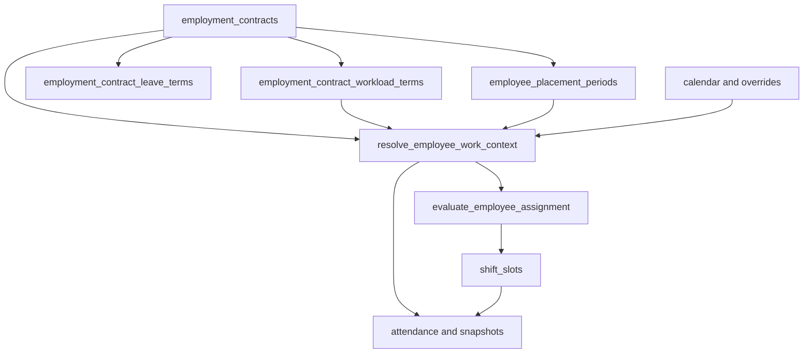

# Annex — Millores contractuals i WFM inspirades en Orquest

> **Data:** 2026-07-20 (P0–P3 implementats 2026-07-21)  
> **Estat:** P0–P3 ✅ (§4–§14); roadmap annex complet  
> **Abast:** extensió posterior a EC-8; no reobre ni invalida EC-0…EC-8  
> **Pla base:** [`plan-employment-contracts.md`](./plan-employment-contracts.md)  
> **Execució:** [`EXECUTION.md`](./EXECUTION.md)  
> **ADRs:** [`ADR-EC-WFM-01`](./ADR-EC-WFM-01-context-efectiu.md)…[`05`](./ADR-EC-WFM-05-snapshots.md)  
> **Migracions:** P0 `20261096000001`…`20261099000001` · P1 `20261100000001` · P2 `20261101000001` · P3 `20261102000001` · tests baseline 8/8 + assignment 6/6 + convenio/snapshots 7/7 + P1 7/7 + P2 9/9 + P3 6/6

## 1. Objectiu

Aquest annex recull conceptes de workforce management observats a Orquest que poden millorar PiMed, però els tradueix a un model propi.

No es copien:

- noms de camps;
- estructura de payloads;
- endpoints;
- entitats genèriques de servei;
- llistes de festius o patrons horaris dins del contracte;
- motors opacs de restriccions.

La prioritat no és afegir camps. Primer cal corregir la doble font de veritat actual: el contracte ja és temporal, però diversos consumidors operatius encara llegeixen projeccions planes de `data.employees`.

## 2. Baseline verificat

PiMed ja disposa de:

- `data.employment_contracts`, lifecycle, aprovació, firma, documents i substitució;
- `data.employment_contract_compensation` amb permisos específics;
- exclusió de solapaments per als contractes principals;
- `project_employment_contract_onto_employee`;
- `resolve_employee_contract_terms`;
- calendari recurrent, overrides datats i festius;
- disponibilitat recurrent i excepcions;
- torns publicats amb site i ubicació congelats;
- `data.resolve_employee_work_plan`;
- `data.labor_rules`;
- `data.vacation_entitlements`;
- tancaments mensuals i `time_compensation_ledger`.

La integració EC-6 és una capa de compatibilitat, no una integració contractual completa:

- projecta valors del contracte a l'empleat;
- el resolver diari i altres consumidors encara poden llegir camps plans;
- els registres històrics no identifiquen prou bé quina revisió contractual i quines polítiques es van aplicar;
- una edició directa pot desincronitzar contracte i projecció.

## 3. Regles de domini

1. El contracte defineix la relació legal i la capacitat contractual.
2. El placement defineix on pertany organitzativament la persona.
3. El calendari defineix la base recurrent.
4. Els torns publicats defineixen el treball planificat real.
5. La disponibilitat expressa preferència o restricció; no crea obligació.
6. Assistència registra què va passar.
7. Compensació i saldos mantenen RLS i ledgers propis.



Una modificació material crea un contracte successor o annex mitjançant `supersedes_contract_id`. En aquesta fase no s'introdueixen subperíodes de termes dins d'un mateix contracte.

## 4. Prioritat P0 — Corregir el baseline

**Importància:** crítica  
**Impacte:** crític  
**Bloqueja:** workload, grants, placements i balanç d'hores  
**Estat (2026-07-21):** ✅ §4.1–4.6 + §5–§6 implementats (`20261096000001`…`20261099000001`)

### 4.1 Consum de vacances

**Estat:** ✅ — `resolve_effective_vacation_entitlement_id` + `apply_vacation_entitlement_delta` + trigger rewrite.

Corregir el trigger que actualitza `vacation_entitlements.days_used` perquè resolgui exactament un entitlement efectiu amb la mateixa precedència que el resolver de lectura.

Proves mínimes:

- scope tenant;
- scope departament;
- scope empleat;
- coexistència dels tres scopes;
- aprovació, cancel·lació i canvi de dates d'una absència;
- idempotència davant reintents.

### 4.2 Context efectiu únic

**Estat:** ✅ — `data`/`api.resolve_employee_work_context` (`resolver_version: ec_wfm_p0_v1`).

Crear:

```text
data.resolve_employee_work_context(
  employee_id,
  work_date,
  requested_site_id
)
```

Ha de retornar:

- contracte efectiu;
- termes de workload;
- placement base;
- site sol·licitat i elegibilitat;
- calendari efectiu;
- conveni i categoria;
- polítiques aplicables;
- procedència de cada dimensió;
- conflictes de configuració;
- versió del resolver.

Durant el rollout pot usar `data.employees` com a fallback, però ha d'exposar l'origen i les divergències.

### 4.3 Migració de consumidors

**Estat:** ✅ mínim — openings eligibility, `preflight_publish_shifts`, `assign_shift_slot`, `resolve_employee_work_plan` via helpers d'hores/site.

Migrar fora de lectures directes de `employees.weekly_hours`, `site_id`, `department_id` i `calendar_group_id`:

- preflight i publicació de torns;
- acceptació de vacants;
- resolució de regles laborals;
- `resolve_employee_work_plan`;
- consolidació i recomputació d'assistència;
- exports que necessiten condicions contractuals.

Les columnes planes es mantenen temporalment com a projecció de compatibilitat.

### 4.4 Comandes contractuals i concurrència

**Estat:** ✅ parcial — `lock_version` + bump + bloqueig d'edicions materials in-place en active/ended/cancelled. RPCs de comanda completes (crear/esmenar/activar/…) queden per P1 / refinament.

Afegir `lock_version` i substituir escriptures directes per RPCs:

- crear esborrany;
- esmenar esborrany;
- activar;
- finalitzar;
- cancel·lar;
- substituir o renovar.

Només un draft és editable. Un contracte actiu o firmat canvia mitjançant un successor.

Les activacions i finalitzacions han d'usar la data local resolta del tenant o site. No s'ha d'usar `CURRENT_DATE` sense context de zona horària.

### 4.5 Projeccions i valors buits

**Estat:** ✅ — `project_employment_contract_onto_employee` projecta `weekly_hours`/`starts_on`/`ends_on` fins i tot si són NULL; site/dept/calendar amb COALESCE.

La projecció ha de tenir ownership explícit per dimensió.

Un valor contractual buit no pot conservar silenciosament el valor del contracte anterior. S'ha de distingir entre:

- valor informat;
- valor eliminat explícitament;
- valor no governat pel contracte;
- fallback legacy.

### 4.6 Historial immutable

**Estat:** ✅ — `time_daily_summaries` snapshot (`employment_contract_id`, `work_context_snapshot`, `work_context_frozen_at`, `resolver_version`) via `20261099000001`.

Els resums diaris o snapshots de tancament han de congelar:

- `employment_contract_id`;
- workload aplicat;
- placement i calendari efectius;
- polítiques d'assistència i planificació;
- `resolver_version`;
- instant de càlcul.

Un període tancat no es recalcula silenciosament. Una correcció crea una esmena o moviment compensatori auditable.

## 5. Prioritat P0 — Readiness de planificació

**Estat:** ✅ — `data`/`api.evaluate_employee_assignment` + revalidació a `assign_shift_slot`. `SHIFT_OVERLAP` és warning (compat assign soft); absència/site/període tancat bloquegen.
**Importància:** crítica  
**Impacte:** crític

Crear:

```text
data.evaluate_employee_assignment(
  employee_id,
  site_id,
  starts_at,
  ends_at,
  role_id
)
```

Resultat:

- `ready`;
- `warning`;
- `blocked`;
- codis de resultat propis;
- regla i origen que expliquen cada decisió.

L'avaluació compon:

- lifecycle i vigència contractual;
- site elegible;
- disponibilitat;
- absències;
- rol i certificacions;
- solapament de torns;
- workload;
- descansos i límits de `data.labor_rules`;
- festius;
- bloqueig de períodes tancats.

`assign_shift_slot` i la publicació setmanal han de revalidar transaccionalment.

## 6. Prioritat P0 — Conveni i categoria

**Estat:** ✅ — catàlegs `collective_agreements` / `professional_categories` + FKs a `employment_contracts` (`20261099000001`).
**Importància:** alta  
**Impacte:** alt

Completar els catàlegs ja previstos:

- `data.collective_agreements`;
- `data.professional_categories`;
- referències al contracte.

Regles:

- categoria professional, job position i work role són conceptes diferents;
- un import extern no crea categories automàticament;
- un catàleg usat històricament es desactiva, no es reescriu;
- els defaults s'apliquen en crear un draft i queden congelats.

## 7. Prioritat P1 — Compromís de temps contractual

**Estat:** ✅ — `employment_contract_workload_terms` + resolver `ec_wfm_p1_v1` (`20261100000001`)

**Importància:** crítica  
**Impacte:** crític  
**Esforç:** mitjà

Nova taula 1:1:

```text
data.employment_contract_workload_terms
```

Camps propis:

- `contract_id`;
- `commitment_basis`: `day`, `week` o `year`;
- `ordinary_commitment_minutes`;
- `complementary_commitment_minutes`;
- `fte_ratio`;
- auditoria i procedència.

Semàntica:

- representa capacitat contractual, no assistència real;
- el complement pactat no és overtime real;
- el saldo continua a `time_compensation_ledger`;
- amb base setmanal ha de quadrar amb la projecció `weekly_hours`;
- amb base diària o anual no es deriva una setmana sense calendari;
- `resolve_employee_work_context` n'és el consumidor canònic.

## 8. Prioritat P1 — Vacances contractuals amb grants

**Estat:** ✅ — `employment_contract_leave_terms` + `leave_entitlement_grants` + grant on activate (`20261100000001`)

**Importància:** crítica  
**Impacte:** crític  
**Esforç:** mitjà-alt

Nova taula 1:1:

```text
data.employment_contract_leave_terms
```

Camps:

- `contract_id`;
- `paid_leave_allowance`;
- `allowance_unit`: `days` o `minutes`;
- `counting_method`: `working_days` o `calendar_days`;
- `proration_method`: `calendar_ratio`, `baseline_weighted` o `none`.

Nova taula append-only:

```text
data.leave_entitlement_grants
```

Conté empleat, contracte, tipus, període, quantitat, unitat, motiu, event d'origen i clau idempotent.

Flux:

1. Activació, substitució o finalització genera grants prorratejats.
2. Els ajustos manuals són moviments separats.
3. El saldo agrega grants, ajustos i consum.
4. `vacation_entitlements` es manté temporalment com a projecció.
5. Els festius públics continuen al calendari laboral.

## 9. Prioritat P1 — Placement organitzatiu efectiu

**Estat:** ✅ — `employee_placement_periods` + `get_employee_placement_on` + precedence al resolver (`20261100000001`)

**Importància:** alta  
**Impacte:** alt  
**Esforç:** mitjà-alt

Nova taula:

```text
data.employee_placement_periods
```

Camps:

- empleat;
- site;
- departament;
- job position;
- rang `[inici, fi)`;
- origen i motiu.

Constraints:

- un únic placement base per empleat i data;
- integritat tenant;
- no solapament;
- índexs de rang.

Un trasllat permanent tanca el placement anterior i n'obre un de nou. Un torn puntual en un altre centre continua representat per `shift_slots.site_id`.

No s'implementen:

- entitat genèrica de servei;
- cessió dins del contracte;
- moviments entre tenants.

## 10. Prioritat P2 — Baseline i balanç d'hores

**Estat:** ✅ — `hour_balance_policies` + `resolve_employee_baseline_plan` / `resolve_employee_hour_balance` (`20261101000001`)

**Importància:** alta  
**Impacte:** crític  
**Esforç:** alt

Crear `resolve_employee_baseline_plan` amb:

- calendari recurrent;
- festius;
- overrides datats;
- placement efectiu;
- sense absències;
- sense torns publicats.

Aquest baseline permet prorratejar sense que el treball assignat redefineixi circularment l'obligació.

Després d'estabilitzar el workload, afegir:

- tipus i longitud de finestra;
- origen de la finestra;
- regla d'arrodoniment;
- carry i expiració;
- snapshots immutables de tancament.

`time_compensation_ledger` continua sent l'únic magatzem de saldo.

## 11. Prioritat P2 — Integracions externes

**Estat:** ✅ — schema + `preflight_external_contract_import` (no connectors) (`20261101000001`)

**Importància:** alta  
**Impacte:** alt  
**Esforç:** mitjà

Ampliar la procedència actual amb:

- identitat externa única;
- `source_changed_at`;
- digest del payload;
- revisió externa;
- correlation i idempotency keys;
- ownership de camps.

Regles:

- preflight abans d'aplicar;
- imports incomplets no eliminen dades locals;
- un import no sobreescriu un contracte firmat;
- una modificació material crea un successor;
- metadata només guarda extres del connector, no semàntica core.

## 12. Prioritat P2 — Cost operatiu resolt

**Estat:** ✅ — `resolve_contract_planning_cost` + `planning_cost_snapshots` / `freeze_planning_cost_snapshot` (`20261101000001`)

**Importància:** mitjana  
**Impacte:** mitjà  
**Esforç:** baix-mitjà

No es crea una segona xifra autoritativa.

Crear:

```text
data.resolve_contract_planning_cost(contract_id, on_date)
```

El resolver:

1. usa compensació horària autoritzada, o;
2. deriva el cost des de `employer_annual_cost` i workload anual;
3. retorna mètode, font i versió de fórmula;
4. conserva l'RLS de compensació;
5. permet congelar un snapshot quan es publica un pressupost.

Un canvi econòmic material crea contracte successor; es manté la relació 1:1 de compensació per contracte.

## 13. Prioritat P3 — Regles laborals

**Estat:** ✅ (`20261102000001`, tests 6/6)

**Importància:** mitjana  
**Impacte:** alt  
**Esforç:** alt

Estendre `data.labor_rules` amb:

- aplicabilitat per conveni;
- aplicabilitat per categoria;
- procedència;
- precedència explicable.

Per mínims i màxims preval la regla més protectora. Una excepció menys protectora requereix permís, justificació i auditoria.

No es crea un JSON genèric de constraints.

## 14. Prioritat P3 — UX i observabilitat

**Estat:** ✅ (contracts work-context panel + planner assignment inspector)

Ampliar `EmployeeContractsTab` amb:

- identificació, vigència, conveni i categoria;
- workload ordinari i complementari;
- divergències entre contracte, projecció i calendari;
- política de vacances i grants;
- compensació només amb permís;
- context efectiu i readiness;
- procedència i conflictes de versió.

El planificador ha d'incloure un inspector de context que expliqui cada bloqueig o warning.

## 15. Conceptes rebutjats

- Noms de camps o estructura API d'Orquest.
- Empleats virtuals.
- `service_id` genèric.
- Horaris o festius dins del contracte.
- Doble model de disponibilitat.
- Cessions contractuals recurrents.
- Moviments cross-tenant.
- JSON genèric de constraints.
- Segon magatzem de saldo.
- Escriptura directa de contractes actius.
- Recomptar períodes tancats.

## 16. ADRs obligatoris

**Estat:** Acceptats

1. **Context efectiu i precedència:** [`ADR-EC-WFM-01-context-efectiu.md`](./ADR-EC-WFM-01-context-efectiu.md) — dimensions, fallback legacy i errors.
2. **Temporalitat:** [`ADR-EC-WFM-02-temporalitat.md`](./ADR-EC-WFM-02-temporalitat.md) — rangs `[inici, fi)`, compatibilitat amb finals inclusius i anti-solapament.
3. **Workload:** [`ADR-EC-WFM-03-workload.md`](./ADR-EC-WFM-03-workload.md) — base, prorrateig, arrodoniment i canvis a mig període.
4. **Vacances:** [`ADR-EC-WFM-04-vacances-grants.md`](./ADR-EC-WFM-04-vacances-grants.md) — grants, ajustos, consum, cancel·lació i períodes tancats.
5. **Snapshots:** [`ADR-EC-WFM-05-snapshots.md`](./ADR-EC-WFM-05-snapshots.md) — camps, versió del resolver i política d'esmenes.

## 17. Ordre d'execució


Cada fase requereix:

- migració additiva;
- RLS i permisos;
- índexs i constraints;
- generated types;
- tests SQL i frontend;
- dual-read temporal;
- telemetria de divergències;
- rollback documentat.

## 18. Criteris globals de sortida

- Cap nom de camp o endpoint replica l'API d'Orquest.
- Planificació i assistència no depenen directament de camps plans.
- El consum de vacances actualitza exactament l'entitlement efectiu.
- No es publica cap torn fora de vigència contractual.
- Site, calendari i workload es resolen per data.
- Activació i finalització usen data local.
- Un valor buit no conserva accidentalment dades anteriors.
- Contractes firmats i períodes tancats són immutables.
- Els snapshots guarden contracte, context, polítiques i versió.
- Imports i backfills són idempotents.
- RLS de compensació es conserva.

## 19. Fitxers principals afectats

- [`plan-employment-contracts.md`](./plan-employment-contracts.md)
- [`EXECUTION.md`](./EXECUTION.md)
- [`20261073000001_employment_contracts_ec1.sql`](../../../supabase/migrations/20261073000001_employment_contracts_ec1.sql)
- [`20261076000001_employment_contract_attendance_driver_ec6.sql`](../../../supabase/migrations/20261076000001_employment_contract_attendance_driver_ec6.sql)
- [`20261018000001_resolve_employee_work_plan_ex033.sql`](../../../supabase/migrations/20261018000001_resolve_employee_work_plan_ex033.sql)
- [`20261039000001_employee_availability_ex071.sql`](../../../supabase/migrations/20261039000001_employee_availability_ex071.sql)
- [`20261046000001_labor_rules_ex081.sql`](../../../supabase/migrations/20261046000001_labor_rules_ex081.sql)
- [`20260727000001_attendance_v2_core.sql`](../../../supabase/migrations/20260727000001_attendance_v2_core.sql)
