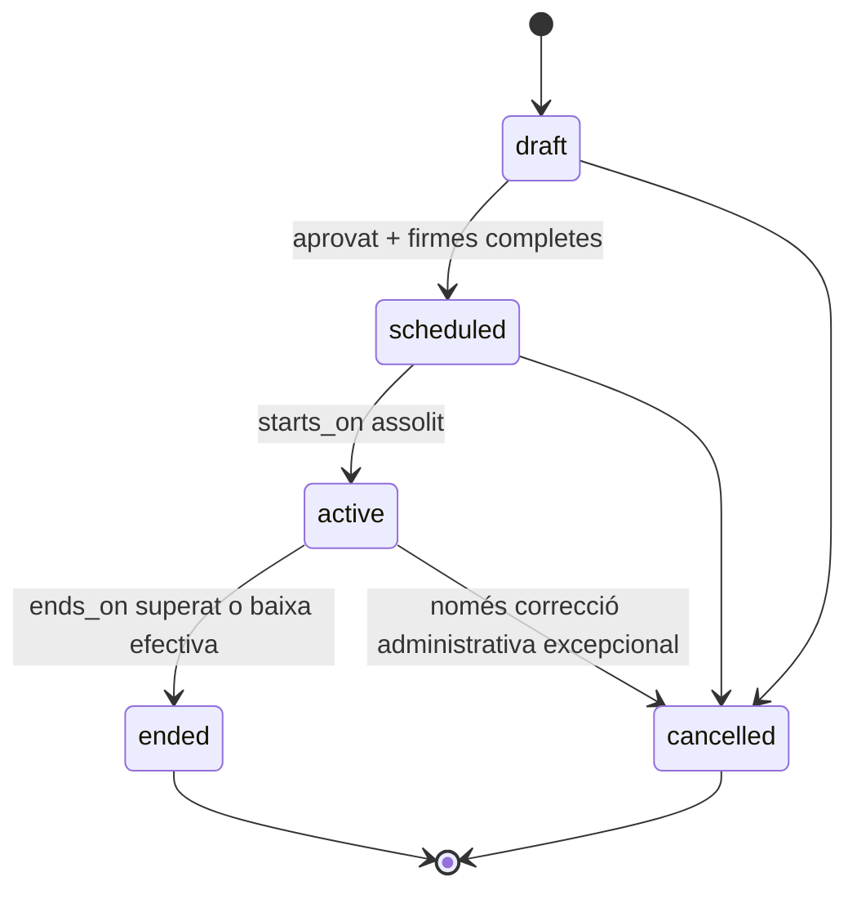
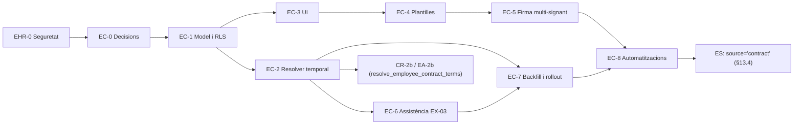

# Pla específic — Contractes laborals (EC)

> **Data:** 2026-07-15  
> **Estat:** proposta tècnica i funcional — pendent d'aprovació  
> **Abast:** domini de contractes laborals, vigència temporal, plantilles, documents, signatures i integració amb assistència  
> **Mòdul pare:** Empleats / HR core  
> **Dependències principals:** DMS, plantilles documentals, firma nativa, Automation V1.5, calendari laboral i resolver canònic d'assistència EX-03.3 (`data.resolve_employee_work_plan` — ADR-0001 + ADR-0003), `plan-elm-architecture.md` (ES) per a la integració de lifecycle
> **Revisió 2026-07-16 (autorevisió post-ELM):** aquest pla es va redactar abans dels plans ELM (`plan-elm-architecture.md`, `plan-compliance-readiness.md`, `plan-employee-assets.md`). Aquesta revisió corregeix els punts de fricció detectats: D9 ja no escriu `employees.status` directament (§0), `data.job_positions` és propietat d'EHR-2 (no es duplica aquí), `EC-0` depèn d'`EHR-0` per no duplicar la línia base de seguretat, i la decisió oberta #12 queda resolta.
> **Revisió 2026-07-16c (coordinació EX-03.3 + ADR-0003):** `data.resolve_employee_work_plan` **ja existeix** (migració `20261018000001`). Cascada: absència → `employee_day_overrides` → labor (overrides + festiu + weekly ADR-0003 via `resolve_schedule_planner_day`) → `shift_slots` published. El contracte **no** és una capa d'aquesta cascada: és *driver* (assigna `calendar_group_id` / `employee_weekly_intervals`). Vegeu §11.
> **Extensió 2026-07-20 (post EC-8):** les millores contractuals i WFM futures, inspirades en Orquest però amb disseny propi, es documenten a [`plan-employment-contracts-inspiracio-orquest.md`](./plan-employment-contracts-inspiracio-orquest.md). Aquest annex no reobre EC-0…EC-8: defineix un nou backlog P0–P3 que comença corregint la doble font de veritat actual.

---

## 0. Registre de canvis (autorevisió post-ELM)

| # | Problema detectat | Correcció aplicada |
|---|---|---|
| 1 | D9 escrivia `employees.status` directament des del servei de contractes, en conflicte amb `lifecycle_state` (ES) com a única font de veritat | D9 reescrit: EC crida `api.transition_employee_lifecycle(source='contract')`, mai `UPDATE employees` |
| 2 | Aquest pla no esmentava els plans ELM ni com s'hi integra | Aquesta secció + taula d'events a D9 |
| 3 | `data.job_positions` es definia aquí (§5) i també s'esmenta a EHR-2, risc de duplicar DDL | §5 aclareix que la taula és propietat d'EHR-2; aquest pla només hi referencia FK |
| 4 | EC-0 no esmentava dependència d'EHR-0, risc de duplicar `security_invoker`/bucket | §16 (EC-0) actualitzat amb dependència explícita |
| 5 | Decisió oberta #12 (governança de `site_id`) sense resoldre, bloquejava CR-2b/EA-2b | §21 resolta: el contracte governa quan n'hi ha un vigent; columnes flat d'`employees` són fallback |
| 6 | §11.3 col·locava el contracte com a capa superior del resolver d'horari diari | §11.2/§11.3: el contracte és *driver* (assigna grup/patró), no capa |
| 7 | Revisió 16b deia que `resolve_employee_work_plan` "no existia ni es crearia" | Incorrecte: EX-03.3 ja l'ha creat (`20261018000001`). §11.3 actualitzat a la cascada real (ADR-0001 + ADR-0003 + slots published) |

---

## 1. Resum executiu

PiMed només representa avui les condicions laborals bàsiques mitjançant camps plans a `data.employees`: `starts_on`, `ends_on` i `weekly_hours`. Aquest model no permet conservar historial, programar contractes futurs, gestionar renovacions, impedir solapaments, vincular formalment les condicions al document firmat ni resoldre quines condicions eren vigents en una data passada.

Aquest pla introdueix `data.employment_contracts` com a entitat temporal independent de l'empleat. Un empleat podrà tenir contractes passats, un contracte principal vigent i contractes futurs programats. El sistema:

1. Permetrà crear un contracte amb interval futur.
2. El deixarà en estat `scheduled` quan estigui aprovat i, si és obligatori, completament firmat.
3. El considerarà efectiu quan la data consultada entri dins el seu interval.
4. Materialitzarà el canvi a `active` mitjançant un reconciliador idempotent.
5. No dependrà exclusivament del cron per determinar la vigència real.
6. Generarà el document des d'una plantilla versionada.
7. Mantindrà l'enllaç contracte → plantilla → document → versions → procés de firma → evidències.
8. Proporcionarà les condicions vigents al resolver canònic d'assistència per a cada dia.

La infraestructura transversal de documents, aprovacions, automatitzacions i firma ja existeix. El treball principal és construir el domini contractual, corregir permisos i integrar-lo sense trencar assistència, portal ni exportació de nòmina.

---

## 2. Situació actual

### 2.1 Model HR actual

`data.employees` conté:

- `status`: `active`, `inactive` o `terminated`.
- `starts_on`.
- `ends_on`.
- `weekly_hours`.
- `job_title`.
- `department_id`, `site_id` i `calendar_group_id`.
- `metadata` per a extensions no estructurades.

Limitacions:

- Un empleat només pot representar una fotografia contractual.
- Canviar hores o dates destrueix la informació anterior.
- No existeix un identificador de contracte.
- No hi ha pròrrogues, annexos ni substitució entre contractes.
- `status` de l'empleat barreja situació de la persona i vigència contractual.
- Assistència consumeix camps de l'empleat sense saber quines condicions eren vigents en la data del registre.

### 2.2 Documents i plantilles disponibles

Ja existeixen:

- `data.document_templates`.
- `data.document_template_locales`.
- Esquemes de variables i rols de firma.
- `data.documents` i `data.document_versions`.
- Associació polimòrfica `entity_type` + `entity_id`.
- Generació HTML, DOCX i PDF.
- Documents amb permisos requerits.

La plataforma ja inclou una plantilla de contracte de treball, però la plantilla no està vinculada a una entitat contractual canònica.

### 2.3 Firma disponible

Existeixen dues capes:

- `data.signing_submissions`, amb font, plantilla/versió, document resultant, estat i snapshot de signants.
- Firma nativa mitjançant `data.document_signing_sessions`, evidències i auditoria.

Automation V1.5 pot generar un document i enviar-lo a firmar. La limitació coneguda és que el handler automàtic `SEND_FOR_SIGNING` només gestiona el primer signant en el seu MVP actual.

### 2.4 Automatització disponible

Existeix un blueprint d'onboarding:

```text
EMPLOYEE_CREATED
  → GENERATE_DOCUMENT
  → HUMAN_APPROVAL
  → SEND_FOR_SIGNING
  → SEND_EMAIL
  → CREATE_CALENDAR_EVENT
```

També existeix `DATE_FIELD_REACHED`, però només consulta `employees.ends_on`. No hi ha triggers per `employment_contracts.starts_on` ni `employment_contracts.ends_on`.

Problemes del blueprint actual:

- Genera el contracte en crear l'empleat, encara que les condicions contractuals no estiguin completes.
- No conserva un contracte com a entitat.
- No sap si el document firmat correspon a les condicions vigents.
- Usa `entity.start_date`, però el camp actual és `starts_on`.
- No bloqueja l'activació si falten aprovacions o firmes.
- No diferencia renovació, pròrroga, annex o nou contracte.

### 2.5 Privacitat actual

Abans d'exposar contractes cal corregir:

- La vista `api.employees` actual no declara `security_invoker = true`.
- Qualsevol membre del tenant pot llegir la fitxa actual de l'empleat.
- El bucket general de documents permet lectura a membres del tenant.

Els contractes, salaris i documents laborals no poden heretar aquestes regles.

---

## 3. Objectius

### 3.1 Objectius funcionals

- Crear contractes passats, vigents i futurs.
- Programar l'activació per data.
- Gestionar contractes indefinits i temporals.
- Conservar historial immutable de condicions.
- Evitar més d'un contracte principal efectiu per empleat i data.
- Permetre contractes secundaris només si es decideix explícitament.
- Gestionar aprovació i firma abans de l'activació.
- Generar contractes des de plantilles del tenant o de plataforma.
- Suportar com a mínim firmant empleat i representant de l'empresa.
- Gestionar finalització, renovació, pròrroga i substitució.
- Alertar de contractes futurs bloquejats o pròxims a finalitzar.
- Mostrar contracte actual i historial a la fitxa de l'empleat.
- Integrar la vigència contractual amb assistència, calendari i exportació de nòmina.

### 3.2 Objectius tècnics

- Tenir una única font de veritat contractual.
- Resoldre condicions efectives per `employee_id` i `work_date`.
- Fer que el cron sigui un mecanisme d'events i materialització, no la font de veritat.
- Garantir idempotència en activació, finalització i automatitzacions.
- Aplicar RLS i vistes `security_invoker`.
- Auditar canvis sensibles.
- Migrar sense interrupció els consumidors actuals de `employees.weekly_hours`.
- Integrar-se amb el resolver canònic d'assistència EX-03.3 (`data.resolve_employee_work_plan`) com a *driver* del calendari/patró setmanal (ADR-0003), no com a capa de la cascada (§11.3).

### 3.3 Fora d'abast

- Càlcul complet de nòmina.
- Models fiscals o cotitzacions a la Seguretat Social.
- Comunicació automàtica amb Contrat@, SILTRA o Sistema RED.
- Assessorament legal sobre clàusules.
- Generació jurídica autònoma sense plantilla aprovada.
- Reclutament i oferta laboral prèvia a la contractació.
- Avaluacions de rendiment.
- Reestructuració completa del DMS o de la firma.

---

## 4. Decisions de disseny

### D1 — Contracte i empleat són entitats diferents

`data.employees` representa la persona dins l'organització. `data.employment_contracts` representa una relació contractual temporal.

No s'afegiran més camps contractuals permanents a `data.employees`.

### D2 — La vigència es calcula per data

La veritat efectiva d'un contracte en una data `D` és:

```text
starts_on <= D
AND (ends_on IS NULL OR ends_on >= D)
AND lifecycle_status IN ('scheduled', 'active', 'ended')
AND approval_status IN ('not_required', 'approved')
AND (
  signature_requirement = 'none'
  OR signature_status = 'signed'
)
```

`ended` pot continuar essent el contracte històric efectiu per a dates passades.

El camp materialitzat `lifecycle_status='active'` facilita UI, events i operació, però cap càlcul històric dependrà exclusivament d'aquest valor.

### D3 — Tres dimensions d'estat

No es crearà un únic estat combinant vida, aprovació i firma.

**Cicle contractual**

- `draft`
- `scheduled`
- `active`
- `ended`
- `cancelled`

**Aprovació**

- `not_required`
- `pending`
- `approved`
- `rejected`

**Firma**

- `not_required`
- `pending`
- `partially_signed`
- `signed`
- `rejected`
- `expired`
- `cancelled`

### D4 — Dates laborals inclusives

`starts_on` i `ends_on` són dates locals i inclusives.

Internament es pot generar:

```sql
daterange(starts_on, ends_on + 1, '[)')
```

Això evita errors de límit en constraints i comparacions.

No s'utilitzaran timestamps per a la vigència laboral ordinària. L'activació es resol per data de l'empresa/site, no per UTC.

### D5 — Un contracte principal efectiu

V1 admet un únic contracte principal per empleat i data.

- `is_primary = true` per defecte.
- No es permeten solapaments entre contractes principals `scheduled`, `active` o `ended`; l'històric també ha de ser coherent.
- Contractes secundaris queden fora de la UI V1 i només s'habilitaran si apareix un cas real.

La protecció s'implementarà a base de dades, no només al frontend.

### D6 — Firma obligatòria configurable

Cada contracte defineix:

- `signature_requirement = none | employee | employee_and_employer`.

Recomanació per defecte: `employee_and_employer`.

Un contracte que requereix firma només pot arribar a `scheduled` quan totes les firmes obligatòries estan completades.

Si arriba `starts_on` i el contracte no compleix els gates:

- No s'activa automàticament.
- Es crea una incidència `CONTRACT_ACTIVATION_BLOCKED`.
- Es notifica RRHH.
- Es mostra com a bloquejat a la fitxa de l'empleat.

Una política futura podria permetre activació excepcional amb override auditat. No forma part del primer MVP.

### D7 — El document firmat és immutable

El contracte conservarà:

- ID de plantilla.
- ID del locale.
- Snapshot de versió/configuració de plantilla.
- Snapshot de variables utilitzades.
- Document generat.
- Versió final firmada.
- Submission/sessions de firma.
- Evidències.

Modificar una plantilla no alterarà contractes ja generats.

Canviar condicions després de firmar exigeix un nou contracte, pròrroga o annex. No es reescriu el contracte firmat.

### D8 — Compensació separada

Salari, cost empresa i dades econòmiques viuran en una taula separada amb permisos específics.

La fitxa contractual general pot mostrar que hi ha condicions econòmiques, però no els imports si l'usuari no té `employees.compensation.view`.

### D9 — `employees.status`/`lifecycle_state` no s'escriuen mai directament des d'aquest pla (revisat, §0)

**Correcció respecte a la versió original d'aquest pla:** una primera versió proposava que el servei de contractes escrigués `employees.status` directament (`active`/`inactive`/`terminated`) segons l'estat del contracte principal. Això entra en conflicte directe amb el pla `plan-elm-architecture.md` (ES), que estableix `lifecycle_state` com a única font de veritat de l'estat de l'empleat, escrita únicament pel trigger sobre `employee_lifecycle_events` (ES-D2). Si EC escrivís `employees.status` pel seu compte, hi hauria dos escriptors independents movent-se per raons diferents (un contracte que acaba no és el mateix esdeveniment de negoci que una baixa laboral formal amb `departure → offboarding → terminated`).

**Regla corregida:** el servei de contractes **mai fa `UPDATE data.employees`**. En comptes d'això, crida `api.transition_employee_lifecycle` (pla ES §9.3) amb `source='contract'` quan es donen els events que ho justifiquen:

| Event de contracte | Transició de lifecycle proposada | Notes |
|---|---|---|
| Primer contracte principal es torna `active` (avui o via reconciliador) | `onboarding → active` (si l'empleat encara no estava `active`) | Només si l'empleat és a `onboarding`; si ja és `active` (renovació), no cal transició |
| Contracte principal finalitza (`ended`) sense contracte contigu ni futur | `active → departure` (mai directament `terminated`) | El pas `departure → offboarding → terminated` és responsabilitat de RH via ES-2, no automàtic per manca de contracte |
| Contracte principal finalitza però hi ha un contracte futur/contigu configurat | Cap transició | El buit contractual no implica cap canvi de `lifecycle_state` |

`employees.status` es manté només com a **projecció de compatibilitat de lectura**, derivada de `lifecycle_state` per un mapa fix (`onboarding|on_leave→'inactive'`, `active→'active'`, `departure|offboarding|terminated→'terminated'`) mantingut pel trigger `trg_sync_employee_lifecycle_state` (pla ES §9.3), no pel servei de contractes. Aquest pla no necessita cap permís de tipus `employees.lifecycle.manage`; necessita `employees.lifecycle.manage_automation` (ES §9.1) concedit al rol de servei que executa el reconciliador de contractes.

### D10 — Historial sense hard delete

Contractes aprovats, firmats, actius o finalitzats no es poden eliminar.

- `draft`: es pot eliminar o cancel·lar.
- `scheduled`: només cancel·lar, amb motiu.
- `active`: finalitzar o substituir.
- `ended`: immutable, excepte metadades administratives no contractuals.

---

## 5. Model de dades proposat

### 5.1 `data.employment_contracts`

```sql
CREATE TABLE data.employment_contracts (
  id                          uuid PRIMARY KEY DEFAULT gen_random_uuid(),
  tenant_id                   uuid NOT NULL REFERENCES data.tenants(id) ON DELETE CASCADE,
  employee_id                 uuid NOT NULL REFERENCES data.employees(id) ON DELETE RESTRICT,

  contract_number             text,
  source                      text NOT NULL DEFAULT 'manual',
  external_reference          text,

  lifecycle_status            text NOT NULL DEFAULT 'draft',
  approval_status             text NOT NULL DEFAULT 'pending',
  signature_status            text NOT NULL DEFAULT 'pending',
  signature_requirement       text NOT NULL DEFAULT 'employee_and_employer',
  is_primary                  boolean NOT NULL DEFAULT true,

  starts_on                   date NOT NULL,
  ends_on                     date,
  probation_ends_on           date,

  contract_type_id            uuid,
  collective_agreement_id     uuid,
  professional_category_id    uuid,
  job_position_id             uuid,
  department_id               uuid REFERENCES data.departments(id) ON DELETE SET NULL,
  site_id                     uuid REFERENCES data.sites(id) ON DELETE SET NULL,
  calendar_group_id           uuid,

  weekly_hours                numeric(5,2),
  fte                         numeric(5,4),
  work_entry_source           text NOT NULL DEFAULT 'schedule',

  supersedes_contract_id      uuid REFERENCES data.employment_contracts(id) ON DELETE SET NULL,
  termination_reason_code     text,
  termination_notes           text,

  template_id                 uuid REFERENCES data.document_templates(id) ON DELETE SET NULL,
  template_locale_id          uuid REFERENCES data.document_template_locales(id) ON DELETE SET NULL,
  template_snapshot           jsonb NOT NULL DEFAULT '{}',
  variables_snapshot          jsonb NOT NULL DEFAULT '{}',
  generated_document_id       uuid REFERENCES data.documents(id) ON DELETE SET NULL,
  final_document_version_id   uuid REFERENCES data.document_versions(id) ON DELETE SET NULL,
  signing_submission_id       uuid REFERENCES data.signing_submissions(id) ON DELETE SET NULL,

  approved_by                 uuid REFERENCES data.profiles(id) ON DELETE SET NULL,
  approved_at                 timestamptz,
  fully_signed_at             timestamptz,
  activated_at                timestamptz,
  ended_at                    timestamptz,
  cancelled_at                timestamptz,
  cancellation_reason         text,

  created_by                  uuid REFERENCES data.profiles(id) ON DELETE SET NULL,
  created_at                  timestamptz NOT NULL DEFAULT now(),
  updated_at                  timestamptz NOT NULL DEFAULT now(),
  metadata                    jsonb NOT NULL DEFAULT '{}'
);
```

Constraints mínims:

- `ends_on IS NULL OR ends_on >= starts_on`.
- `probation_ends_on IS NULL OR probation_ends_on >= starts_on`.
- `weekly_hours IS NULL OR weekly_hours >= 0`.
- `fte IS NULL OR (fte > 0 AND fte <= 1.5)`.
- `supersedes_contract_id <> id`.
- Estats limitats amb `CHECK`.
- `contract_number` únic per tenant quan no sigui `NULL`.
- FK de tenant coherent per empleat, site, departament, catàlegs i plantilla.
- Cap solapament de contractes principals programats/actius.

Per a solapaments:

```sql
CREATE EXTENSION IF NOT EXISTS btree_gist;

ALTER TABLE data.employment_contracts
ADD CONSTRAINT employment_contracts_no_primary_overlap
EXCLUDE USING gist (
  employee_id WITH =,
  daterange(
    starts_on,
    CASE WHEN ends_on IS NULL THEN NULL ELSE ends_on + 1 END,
    '[)'
  ) WITH &&
)
WHERE (
  is_primary
  AND lifecycle_status IN ('scheduled', 'active', 'ended')
);
```

S'haurà de validar que l'extensió està disponible a tots els entorns abans de fixar aquesta implementació. Alternativa: trigger transaccional amb bloqueig de l'empleat.

### 5.2 Catàlegs contractuals

#### `data.employment_contract_types`

- `id`, `tenant_id`.
- `code`, `name`.
- `is_indefinite`.
- `default_signature_requirement`.
- `is_active`.
- `metadata`.

No es codificaran en l'aplicació tots els models oficials espanyols. Els codis oficials poden viure a `external_code` o metadata i sincronitzar-se més endavant.

#### `data.collective_agreements`

- `id`, `tenant_id`.
- `code`, `name`.
- `valid_from`, `valid_to`.
- `document_id`.
- `is_active`.

#### `data.professional_categories`

- `id`, `tenant_id`.
- `collective_agreement_id`.
- `code`, `name`.
- `professional_group`.
- `contribution_group`.
- `default_weekly_hours`.
- `is_active`.

#### `data.job_positions` (propietat d'EHR-2, no d'aquest pla)

**Correcció (§0, punt 3):** una versió anterior d'aquest pla definia aquesta taula com a pròpia. `data.job_positions` és DDL d'EHR-2 (`plan-employees-hr-core-v2.md`), no d'EC — EC-2 només hi afegeix una columna `job_position_id uuid REFERENCES data.job_positions(id)` a `employment_contracts` (§5.1), sense repetir la creació de la taula. Si EC-2 s'implementa abans d'EHR-2 per calendari de projecte, `job_position_id` queda `NULL`-able i sense FK fins que EHR-2 creï la taula referenciada (migració additiva posterior amb `ALTER TABLE ... ADD CONSTRAINT`).

- Catàleg funcional de llocs de treball.
- Diferent de categoria professional i de `tenant_members` permissions bundle.
- Pot suggerir departament, site, calendari i skills requerits.

### 5.3 `data.employment_contract_compensation`

```text
id
tenant_id
contract_id UNIQUE
currency
gross_amount
pay_period
annual_gross
employer_annual_cost
effective_from
effective_to
metadata
created_at / updated_at
```

Permisos separats i auditoria d'alta severitat.

Si les condicions econòmiques canvien sense substituir el contracte, es promourà a historial 1:N per intervals. Per al primer MVP es recomana una fila per contracte i exigir annex/nova versió per canvis.

### 5.4 Enllaç documental

Opció canònica:

- `documents.entity_type = 'employment_contract'`.
- `documents.entity_id = employment_contracts.id`.
- `employment_contracts.generated_document_id` com a accés directe.

Caldrà ampliar:

- `tenant_entity_exists`.
- `can_view_entity`.
- `can_edit_entity`.
- Entity Timeline.
- Registre de deep links.
- Selectors del DMS.

No es crearà una taula de documents específica per contracte.

### 5.5 Vistes API

Totes les vistes han d'usar `WITH (security_invoker = true)`.

Vistes proposades:

- `api.employment_contracts`: dades contractuals sense compensació.
- `api.employment_contract_compensation`: només permís econòmic.
- `api.employee_effective_contracts`: projecció del contracte efectiu avui.
- `api.employee_contract_timeline`: passat, vigent i futur ordenats.
- `api.employment_contract_alerts`: bloquejats, pròxims a començar/finalitzar i pendents de firma.

No s'exposaran `SELECT *` ni snapshots interns si contenen dades sensibles.

---

## 6. Semàntica temporal i activació

### 6.1 Creació futura

Exemple:

```text
Avui:       2026-07-15
starts_on:  2026-09-01
ends_on:    NULL
```

Flux:

1. RRHH crea el draft.
2. Valida condicions.
3. Genera document.
4. Aprovació interna.
5. Firma de l'empresa i empleat.
6. Contracte passa a `scheduled`.
7. Abans del 2026-09-01 no afecta assistència ni nòmina.
8. El 2026-09-01 el reconciliador el materialitza com `active`.
9. Encara que el reconciliador falli, `get_effective_contract(employee, '2026-09-01')` el considera efectiu.

### 6.2 Reconciliador d'estats

RPC de servei:

```text
api.reconcile_employment_contract_states(
  p_tenant_id uuid,
  p_local_date date
)
```

Responsabilitats:

- Activar `scheduled` elegibles amb `starts_on <= p_local_date`.
- Finalitzar `active` amb `ends_on < p_local_date`.
- No activar contractes bloquejats.
- Detectar múltiples candidats.
- Actualitzar projeccions d'empleat.
- Emetre events exactament una vegada.
- Retornar resum estructurat.

S'executarà:

- Diàriament per tenant.
- En crear/aprovar/firmar/cancel·lar un contracte.
- En obrir la pantalla d'alertes, opcionalment com a reconciliació defensiva.

### 6.3 Idempotència

Events:

- `CONTRACT_ACTIVATED:{contract_id}:{starts_on}`.
- `CONTRACT_ENDED:{contract_id}:{ends_on}`.
- `CONTRACT_ACTIVATION_BLOCKED:{contract_id}:{starts_on}`.
- `CONTRACT_EXPIRING:{contract_id}:{days_ahead}`.

La capa d'auditoria o una taula d'event dedupe ha d'impedir duplicats.

### 6.4 Timezone

La data efectiva es calcula amb:

1. Timezone del site contractual.
2. Timezone del tenant.
3. Fallback configurat de plataforma.

No s'utilitzarà `CURRENT_DATE` de la sessió PostgreSQL sense resoldre timezone.

### 6.5 Renovacions i continuïtat

Casos:

- **Renovació:** nou contracte amb `supersedes_contract_id`.
- **Pròrroga:** nou registre o annex; V1 recomana nou contracte per traçabilitat.
- **Canvi de jornada/categoria:** nou contracte o annex amb nova vigència.
- **Renovació contigua:** contracte anterior acaba el dia D i el següent comença D+1.

En una renovació contigua:

- No es marca l'empleat com `terminated`.
- El resolver utilitza cada contracte en la seva data.
- L'export de nòmina manté la continuïtat.

---

## 7. Màquina d'estats

### 7.1 Cicle principal



### 7.2 Gates per passar a `scheduled`

- Dates vàlides.
- Sense solapament principal.
- Empleat del mateix tenant.
- Catàlegs coherents.
- Site/departament del mateix tenant.
- `approval_status` satisfet.
- `signature_status` satisfet.
- Document final disponible si la firma és obligatòria.
- Condicions mínimes configurades.

### 7.3 Firma posterior a `starts_on`

Si el contracte es firma tard:

- Roman `draft` o bloquejat.
- En completar-se la firma, el reconciliador avalua si ja és efectiu.
- Si `starts_on <= avui`, pot passar directament a `active`.
- Es registra `late_activation=true`.
- Es genera alerta de compliance.

No es reescriu `starts_on` automàticament.

---

## 8. Plantilles, documents i signatures

### 8.1 Contracte de variables

El context de plantilla ha d'incloure:

```json
{
  "employee": {
    "id": "...",
    "full_name": "...",
    "document_id": "...",
    "email": "...",
    "phone": "..."
  },
  "contract": {
    "id": "...",
    "contract_number": "...",
    "starts_on": "2026-09-01",
    "ends_on": null,
    "weekly_hours": 40,
    "fte": 1,
    "contract_type": "...",
    "professional_category": "...",
    "collective_agreement": "...",
    "job_position": "..."
  },
  "tenant": {},
  "site": {},
  "signatories": {}
}
```

No s'ha de continuar generant el contracte només amb l'snapshot d'`employee`.

### 8.2 Selecció de plantilla

Ordre:

1. Plantilla configurada al tipus de contracte.
2. Plantilla configurada pel tenant.
3. Plantilla de plataforma.

La UI ha de mostrar:

- Nom i locale.
- Variables obligatòries pendents.
- Rols de firma.
- Preview abans de generar.

### 8.3 Snapshot

En generar:

- Desar `template_id` i `template_locale_id`.
- Desar hash o versió de la definició.
- Desar `template_snapshot`.
- Desar `variables_snapshot`.
- Crear `documents.entity_type='employment_contract'`.
- Enllaçar `generated_document_id`.

### 8.4 Multi-signant

Prerequisit productiu:

- Firmant `employee`.
- Firmant `employer_representative`.
- Ordre seqüencial o paral·lel definit per plantilla.
- Estat agregat `partially_signed` fins completar tots els obligatoris.
- Rebuig o expiració bloqueja `scheduled`.

Cal ampliar el handler d'Automation, que actualment només envia el primer signant.

### 8.5 Document final

Quan totes les firmes es completen:

- Actualitzar `final_document_version_id`.
- `signature_status='signed'`.
- `fully_signed_at`.
- Preservar hash, auditoria i evidències.
- Reconciliar estat contractual.
- Notificar RRHH i empleat.
- Publicar al portal si la política del tenant ho permet.

### 8.6 Regeneració

- Abans de firmar: es pot invalidar la versió i regenerar.
- Amb firmes parcials: cancel·lar sessions anteriors i iniciar un nou procés.
- Després de firma completa: no regenerar sobre el mateix contracte; crear annex o substitució.

---

## 9. Permisos, RLS i privacitat

### 9.1 Permisos proposats

- `employees.contracts.view`
- `employees.contracts.manage`
- `employees.contracts.approve`
- `employees.contracts.sign_as_employer`
- `employees.compensation.view`
- `employees.compensation.edit`
- `employees.contracts.export`

L'owner no hauria de ser l'única forma d'accedir. Cal respectar permisos granulars a DB i UI.

### 9.2 Visibilitat

**HR autoritzat**

- Veu contractes del seu scope.
- Pot gestionar drafts.
- Pot iniciar aprovació/firma.

**Manager**

- Pot veure informació contractual mínima del seu equip si té permís.
- No veu compensació per defecte.
- Pot aprovar només si està assignat.

**Empleat**

- Veu els seus contractes publicats i documents finals al portal.
- No veu snapshots interns, aprovacions ni dades econòmiques no autoritzades.

**Membre ordinari**

- No veu contractes.

### 9.3 RLS

Totes les taules noves:

- RLS habilitat.
- Policies per tenant, scope i permís.
- Vistes `security_invoker`.
- Cap `service_role` al client.
- Funcions `SECURITY DEFINER` en schema no exposat quan sigui possible.
- `search_path` fix.
- `REVOKE EXECUTE FROM PUBLIC`.

### 9.4 Documents

El document contractual ha de portar:

```text
required_permissions = ['employees.contracts.view']
```

El bucket i les RPC de descàrrega han de validar el document, no només pertinença al tenant.

Abans del MVP s'ha de corregir la política general que permet llegir documents del tenant sense considerar `required_permissions`.

### 9.5 Auditoria

Events d'alta sensibilitat:

- Contracte creat/modificat.
- Condicions econòmiques consultades o exportades.
- Contracte aprovat/rebutjat.
- Document generat/regenerat.
- Firma enviada/completada/rebutjada.
- Activació bloquejada.
- Activació/finalització/cancel·lació.
- Override excepcional.

Els payloads d'auditoria no han d'incloure salari, IBAN ni document complet.

---

## 10. API i serveis

### 10.1 Consultes

```text
api.list_employee_contracts(p_employee_id)
api.get_employment_contract(p_contract_id)
api.get_effective_employment_contract(p_employee_id, p_effective_date)
api.list_employment_contract_alerts(p_filters)
api.get_contract_document_status(p_contract_id)
```

### 10.2 Comandes

```text
api.create_employment_contract(p_employee_id, p_payload)
api.update_employment_contract_draft(p_contract_id, p_payload, p_expected_updated_at)
api.submit_employment_contract_for_approval(p_contract_id)
api.resolve_employment_contract_approval(p_contract_id, p_decision, p_reason)
api.generate_employment_contract_document(p_contract_id, p_template_locale_id)
api.send_employment_contract_for_signing(p_contract_id)
api.cancel_employment_contract(p_contract_id, p_reason)
api.end_employment_contract(p_contract_id, p_ends_on, p_reason)
api.renew_employment_contract(p_contract_id, p_new_contract)
```

Les transicions crítiques han de ser RPC transaccionals. No s'han de fer amb múltiples `update()` des del client.

### 10.3 Concurrència

- `updated_at` o `lock_version` per optimistic locking.
- `SELECT ... FOR UPDATE` en aprovació, firma, activació i finalització.
- Error estable `contract_version_conflict`.
- Idempotency key en generació documental i enviament a firma.

### 10.4 Errors canònics

- `contract_not_found`
- `contract_invalid_dates`
- `contract_overlap`
- `contract_not_editable`
- `contract_approval_required`
- `contract_signature_required`
- `contract_document_missing`
- `contract_activation_blocked`
- `contract_already_effective`
- `contract_version_conflict`
- `contract_payroll_period_locked`

---

## 11. Integració amb assistència i calendari

### 11.1 Principi

Assistència no ha de preguntar “quantes hores té avui l'empleat?” a `employees.weekly_hours`. Ha de preguntar:

```text
Quines condicions laborals eren efectives per aquest empleat en aquesta data?
```

### 11.2 Contracte del resolver de termes (aquest pla)

Funció pròpia d'EC — **retorna els *termes contractuals* vigents, no l'horari operatiu diari** (això últim és `data.resolve_employee_work_plan`, §11.3):

```text
data.resolve_employee_contract_terms(
  p_employee_id uuid,
  p_work_date date
) returns jsonb
```

Resposta:

```json
{
  "contract_id": "...",
  "weekly_hours": 40,
  "fte": 1,
  "calendar_group_id": "...",
  "site_id": "...",
  "department_id": "...",
  "job_position_id": "...",
  "work_entry_source": "schedule",
  "source": "employment_contract"
}
```

### 11.3 Dependència amb el resolver d'assistència (EX-03.3 + ADR-0001 + ADR-0003)

**Actualització 2026-07-16c:** EX-03.3 ja ha creat `data.resolve_employee_work_plan` (`supabase/migrations/20261018000001_resolve_employee_work_plan_ex033.sql`). `api.resolve_work_day` n'és l'adaptador. Contracte JSON i matriu de precedència: [`adr-0001-work-plan-source-of-truth.md`](../checkin/adr-0001-work-plan-source-of-truth.md). Base recurrent setmanal: [`adr-0003-weekly-recurring-base.md`](../checkin/adr-0003-weekly-recurring-base.md) / migració `20261017000001`.

Cascada canònica (més prioritària → menys):

```text
0a. Absència aprovada (employee_absences)
0b. employee_day_overrides (force_holiday / force_work)
1–8. Cascada laboral via resolve_labor_calendar_for_employee
      → resolve_schedule_planner_day:
        overrides puntuals (employee > group_site > site > group_global > tenant)
        > festiu assignat
        > base recurrent ADR-0003 (employee_weekly > calendar_group_weekly)
        > undefined
9. shift_slots published
   (substitueixen intervals si dia base = work|undefined;
    NO converteixen holiday/vacation/leave en work)
```

Sense capa `work_schedules` viva (retirada per ADR-0002/0003).

**El contracte laboral NO és una capa d'aquesta cascada.** Un contracte de "40h/setmana" no determina si un divendres concret es treballa; només defineix el marc. Relació correcta: **el contracte com a *driver* del calendari / patró setmanal (ADR-0003), no com a capa de `resolve_employee_work_plan`**:

| Camp del contracte | Com alimenta l'assistència |
|---|---|
| `calendar_group_id` | Assigna l'empleat al grup; ADR-0003 resol via `calendar_group_weekly_intervals` dins de la cascada laboral |
| `weekly_hours` / `fte` | Marc contractual; **no** determina per si sol les hores d'un dia |
| Patró individual (si difereix del grup) | Es materialitza a `data.employee_weekly_intervals` (capa `employee_weekly`), no a una taula pròpia d'EC |

Regles:

- El contracte defineix el marc i **assigna** grup de calendari / patró individual.
- `resolve_employee_work_plan` resol l'horari operatiu del dia (absència, labor, slots).
- `weekly_hours` no determina per si sol les hores esperades d'un dia.
- Un check de coherència (compliment) pot validar que els minuts setmanals planificats (`resolve_employee_work_plan` agregat) quadren amb el `weekly_hours` contractual; aquesta validació **no** és una capa del resolver.

**L'ADR de precedències** és ADR-0001 (cascada completa) + ADR-0003 (base recurrent). EC s'hi adapta i comparteix tests de caracterització amb EX-03 (`attendance_resolve_work_plan_ex033_tests.sql`).

### 11.4 Històric i snapshots

En registrar o recalcular un dia:

- Guardar `contract_id` resolt.
- Guardar snapshots de condicions rellevants.
- No deixar que un canvi futur alteri silenciosament períodes tancats.
- Recomputar només períodes oberts i mitjançant acció explícita.

### 11.5 Payroll lock

No permetre:

- Canviar un contracte amb efectes retroactius dins un període de nòmina tancat.
- Cancel·lar un contracte que ja ha alimentat un període tancat.

Opcions:

- Bloquejar i exigir reobertura.
- Crear correcció efectiva en el següent període.

La decisió final s'ha de coordinar amb el model de tancament mensual.

---

## 12. Integració amb portal de l'empleat

MVP:

- Llista “Els meus contractes”.
- Estat de firma.
- Obrir procés de firma.
- Descarregar document final.
- Veure data d'inici i finalització.

No mostrar:

- Aprovacions internes.
- Notes de RRHH.
- Cost empresa.
- Snapshots tècnics.

L'accés ha de funcionar tant per `user_id` com pel portal token-based actual, sense crear un usuari SaaS per empleat.

---

## 13. Automatitzacions

### 13.1 Events nous

- `CONTRACT_CREATED`
- `CONTRACT_UPDATED`
- `CONTRACT_SUBMITTED_FOR_APPROVAL`
- `CONTRACT_APPROVED`
- `CONTRACT_REJECTED`
- `CONTRACT_DOCUMENT_GENERATED`
- `CONTRACT_SENT_FOR_SIGNING`
- `CONTRACT_PARTIALLY_SIGNED`
- `CONTRACT_FULLY_SIGNED`
- `CONTRACT_ACTIVATION_BLOCKED`
- `CONTRACT_ACTIVATED`
- `CONTRACT_EXPIRING`
- `CONTRACT_ENDED`
- `CONTRACT_CANCELLED`
- `CONTRACT_RENEWAL_CREATED`

Mapatge canònic dot notation:

- `contract.created`
- `contract.approved`
- `contract.fully_signed`
- `contract.activation_blocked`
- `contract.activated`
- `contract.expiring`
- `contract.ended`

### 13.2 Blueprints

#### Preparació i firma

```text
CONTRACT_SUBMITTED_FOR_APPROVAL
  → HUMAN_APPROVAL
  → GENERATE_DOCUMENT
  → SEND_FOR_SIGNING
  → WAIT contract.fully_signed
  → SEND_EMAIL
  → reconcile contract
```

#### Activació

```text
CONTRACT_ACTIVATED
  → assignar/validar calendari
  → habilitar portal si correspon
  → SI és el primer contracte principal de l'empleat i lifecycle_state='onboarding':
      cridar api.transition_employee_lifecycle(employee_id, 'active', reason_code='first_contract_activated', source='contract')
  → email primer dia
```

**Correcció (§0/D9):** aquest blueprint ja no crea directament "tasques onboarding" com a acció pròpia d'EC. La transició de lifecycle (`onboarding → active`) és la que, via `plan-elm-architecture.md` ES-5, dispara el checklist d'onboarding existent (EHR-6) escoltant `EMPLOYEE_LIFECYCLE_CHANGED` — no `CONTRACT_ACTIVATED` directament. Això evita que dues fonts diferents (EC i un futur mòdul de reclutament, per exemple) puguin disparar el mateix checklist per motius diferents. Vegeu §13.4.

#### Contracte bloquejat

```text
CONTRACT_ACTIVATION_BLOCKED
  → notificació RRHH urgent
  → crear tasca
  → aparèixer a BAM/Automation Center
```

#### Venciment

```text
CONTRACT_EXPIRING (90/30/7 dies)
  → notificació RRHH
  → crear tasca de renovació
  → oferir acció "Crear renovació"
```

### 13.3 Canvi respecte al blueprint actual

`EMPLOYEE_CREATED` no ha de generar automàticament un contracte final.

Pot:

- Crear un draft contractual.
- Esperar que RRHH completi condicions.

La generació del document ha de començar des del contracte, no directament des de l'empleat. **La checklist d'onboarding ja no es dispara des d'`EMPLOYEE_CREATED` ni des de `CONTRACT_ACTIVATED` directament (§13.4): es dispara des de `EMPLOYEE_LIFECYCLE_CHANGED` quan `to_state='active'`, sigui l'origen un contracte, una alta manual o (en el futur) un altre mòdul.**

### 13.4 Integració amb l'ELM (`plan-elm-architecture.md`)

Aquest pla, redactat abans dels plans ELM, no tenia cap secció d'integració explícita. Es defineix aquí:

- **EC mai escriu `employees.status`/`lifecycle_state` directament** (D9). Totes les transicions d'estat que un esdeveniment de contracte pugui justificar passen per `api.transition_employee_lifecycle(..., source='contract')`.
- **Events de contracte i events de lifecycle són dominis diferents i no se substitueixen l'un a l'altre.** `CONTRACT_ACTIVATED`/`CONTRACT_ENDED` continuen existint i disparant els seus propis blueprints (calendari, portal, avisos de venciment). Només quan calgui reflectir-se a l'estat operatiu de l'empleat, EC crida l'RPC de lifecycle; mai a l'inrevés (ES no coneix `employment_contracts`).
- **Regla de finalització sense contracte futur:** quan el contracte principal finalitza (`ended`) sense contracte contigu ni futur programat, EC crida `api.transition_employee_lifecycle(employee_id, 'departure', reason_code='contract_ended_without_renewal', source='contract')`. El pas final a `terminated` (via `departure → offboarding → terminated`) és una decisió de RH executada manualment o per una automatització d'offboarding pròpia (EHR-6/ES-5), no un efecte automàtic i immediat de la manca de contracte.
- **`job_position_id`/`department_id`/`site_id` del contracte com a font temporal (decisió oberta #12, §21):** quan un empleat té un contracte principal vigent, `data.resolve_employee_contract_terms(employee_id, as_of)` (§6) és la font d'aquests camps per a Readiness (pla CR, CR-D3bis) i per a qualsevol lectura "a data X". Les columnes flat d'`employees` continuen existint com a *fallback* únicament per a empleats sense cap contracte actiu (p. ex. durant la migració, o tenants que no adopten el mòdul de contractes).

---

## 14. Experiència d'usuari

### 14.1 Fitxa de l'empleat

Nova pestanya **Contractes**:

- Card “Contracte vigent”.
- Contractes futurs.
- Historial.
- Alertes i bloquejos.
- Botó “Nou contracte”.
- Botó “Renovar”.
- Estat d'aprovació.
- Estat de firma.
- Document final.
- Timeline d'events.

### 14.2 Editor de contracte

Seccions:

1. Identificació i tipus.
2. Vigència.
3. Posició, categoria, conveni i centre.
4. Jornada i calendari.
5. Compensació, visible segons permís.
6. Plantilla i firmants.
7. Revisió de conflictes.
8. Preview.

### 14.3 Timeline visual

Representació:

```text
2024-01-01 ───────── 2025-12-31  Contracte anterior · ended
2026-01-01 ───────── avui        Contracte vigent · active
2026-09-01 ───────── ∞           Renovació · scheduled
```

### 14.4 Llista global

Vista RRHH:

- Contractes pendents d'aprovació.
- Pendents de firma.
- Bloquejats per activació.
- Comencen pròximament.
- Finalitzen pròximament.
- Sense document final.

Filtres per site, departament, tipus, estat i responsable.

---

## 15. Migració des del model actual

### 15.1 Preflight

- Comptar empleats amb dates incoherents.
- Detectar `ends_on < starts_on`.
- Detectar empleats actius sense `starts_on`.
- Revisar `weekly_hours` nul·les o fora de rang.
- Identificar períodes de nòmina tancats.
- Inventariar plantilles contractuals.

### 15.2 Backfill

Crear un contracte `source='legacy_backfill'` per cada empleat amb informació suficient.

Mapatge:

| Empleat actual | Contracte inicial |
|---|---|
| `starts_on` | `starts_on` |
| `ends_on` | `ends_on` |
| `weekly_hours` | `weekly_hours` |
| `site_id` | `site_id` |
| `department_id` | `department_id` |
| `job_title` | snapshot / posició provisional |
| `calendar_group_id` | `calendar_group_id` |

Estat:

- `employees.status='active'` i data efectiva avui → `active`.
- Data futura → `scheduled`, amb `approval_status='not_required'`, `signature_requirement='none'` i `signature_status='not_required'` només per al backfill.
- Data passada finalitzada → `ended`.
- Incoherent → no migrar automàticament; enviar a cua de revisió.

Els contractes backfill es marquen clarament com a registres heretats sense evidència documental.

### 15.3 Compatibilitat

Feature flag:

```text
employment_contracts_enabled
```

Fases:

1. Crear i backfill sense canviar lectures.
2. Dual-read i comparar resultats.
3. Escriure contractes i projectar camps actuals.
4. Connectar el contracte com a driver del calendari/patró setmanal (ADR-0003) consumit per `resolve_employee_work_plan` (EX-03.3).
5. Migrar UI i exportació.
6. Deixar camps d'empleat com a compatibilitat read-only.
7. Eliminar dependències directes.

No eliminar `starts_on`, `ends_on` ni `weekly_hours` a la primera versió.

### 15.4 Projecció legacy

Durant transició:

- Contracte efectiu actual projecta `employees.starts_on`, `ends_on`, `weekly_hours`.
- Només una funció de servei pot actualitzar aquesta projecció.
- La UI deixa de modificar directament els camps legacy.

No es recomana dual-write des del client.

### 15.5 Importació

Actualitzar `docs/plans/employee-import/plan.md`:

- Separar import d'empleat i import de contracte.
- Mapping per contracte extern.
- Idempotència `(provider, external_contract_id)`.
- Contractes futurs del proveïdor creen `scheduled`.
- No sobreescriure contractes firmats localment sense revisió.

---

## 16. Fases d'implementació

### EC-0 — Decisions i seguretat prèvia

**Objectiu:** tancar invariants abans del DDL.

**Dependència (§0, punt 4):** `EC-0` depèn d'`EHR-0` (`plan-employees-hr-core-v2.md`). La correcció de `api.employees` a `security_invoker` i la línia base de permisos/RLS és responsabilitat d'EHR-0; una versió anterior d'aquest pla la duplicava aquí. EC-0 només hi afegeix les polítiques específiques del domini de contractes.

Tasques:

- ADR de semàntica temporal.
- Decidir firma obligatòria per defecte.
- Decidir solapaments secundaris.
- Definir permisos (contractes + compensació, específics d'aquest domini).
- Dissenyar lectura segura de documents contractuals.
- Alinear precedències amb EX-03.

Criteris:

- Decisions aprovades.
- Tests RLS baseline (sobre la línia base ja corregida a EHR-0).
- Cap dada contractual privada exposada al directori.

### EC-1 — Model de dades i RLS

**Objectiu:** contractes, catàlegs, compensació i vistes.

Tasques:

- Migració creada amb `supabase migration new`.
- Taules i constraints.
- RLS i grants.
- Vistes API.
- Funcions de validació transversal.
- Triggers updated_at i auditoria.
- Tests SQL d'integritat i permisos.

Criteris:

- No es pot crear solapament principal.
- No es poden creuar tenants.
- Membre ordinari no pot llegir contractes.
- HR sense permís econòmic no veu compensació.

### EC-2 — Resolver temporal i reconciliació

**Objectiu:** contracte efectiu per data i activació idempotent.

Tasques:

- `get_effective_employment_contract`.
- `resolve_employee_contract_terms`.
- Reconciliador.
- Timezone tenant/site.
- Events idempotents.
- Alertes d'activació bloquejada.

Criteris:

- Contracte futur no afecta dates anteriors.
- Es considera efectiu a `starts_on` encara que el cron vagi tard.
- Reexecutar reconciliació no duplica events.
- Renovació contigua no termina l'empleat.

### EC-3 — CRUD i UI contractual

**Objectiu:** gestió completa de drafts, futurs i historial.

Tasques:

- Serveis i hooks.
- Pestanya Contractes.
- Editor.
- Timeline.
- Alertes.
- Optimistic locking.
- Traduccions CA/ES/EN.

Criteris:

- Crear, editar, cancel·lar i renovar.
- Errors de solapament comprensibles.
- Històric read-only.
- Permisos consistents entre UI i RLS.

### EC-4 — Plantilles i documents

**Objectiu:** document contractual traçable.

Tasques:

- Context `contract`.
- Snapshot de plantilla i variables.
- `entity_type='employment_contract'`.
- Preview.
- Generació idempotent.
- Permisos DMS.

Criteris:

- Document generat reprodueix exactament les condicions.
- Canviar plantilla no altera contractes anteriors.
- Document només visible per usuaris autoritzats.

### EC-5 — Firma multi-signant

**Objectiu:** firma empleat + empresa.

Tasques:

- Ampliar handler.
- Rols obligatoris.
- Estat parcial.
- Rebuig, expiració i reintent.
- Versió final i evidències.
- Portal de l'empleat.

Criteris:

- No passa a `scheduled` fins completar firmes requerides.
- Rebuig bloqueja activació.
- Document final i auditoria accessibles.
- Tests E2E de dos signants.

### EC-6 — Integració assistència (EX-03.3 / ADR-0001 / ADR-0003)

**Objectiu:** condicions contractuals efectives en tota la cadena, com a *driver* del calendari/patró setmanal que alimenta `data.resolve_employee_work_plan` (no com a capa; §11.3).

Tasques:

- Integrar `resolve_employee_contract_terms` (termes contractuals, no horari diari).
- En activar/renovar contracte, propagar `calendar_group_id` (i patró individual a `data.employee_weekly_intervals` si difereix del grup).
- Guardar `contract_id` i snapshots.
- Migrar consumidors de `weekly_hours`.
- Check de coherència entre minuts planificats (`resolve_employee_work_plan` agregat) i `weekly_hours` contractual.
- Respectar payroll lock.
- Dual-run i mètriques de divergència (coordinat amb FF-03 d'`EXECUTION.md` si encara actiu).

Criteris:

- Portal, estació, dashboard i export resolen el mateix contracte.
- Canvis futurs no alteren períodes passats.
- Cap període tancat es recalcula silenciosament.

### EC-7 — Backfill i rollout

**Objectiu:** migrar dades existents sense interrupció.

Tasques:

- Informe preflight.
- Backfill.
- Revisió d'incoherències.
- Feature flag.
- Dual-read.
- Projecció legacy.
- Runbook rollback.

Criteris:

- 100% d'empleats classificats com migrats o revisió manual.
- Zero divergències inexplicades en contracte vigent.
- Rollback de lectura documentat.

### EC-8 — Automatitzacions i reporting

**Objectiu:** operació recurrent.

Tasques:

- Blueprints nous.
- Alertes 90/30/7.
- Dashboard contractual.
- Reporting.
- Actualitzar blueprint d'onboarding.
- E2E complet.

Criteris:

- Contracte bloquejat visible abans del primer dia.
- Renovació creable des de l'alerta.
- Cap event duplicat.
- Workflow document + firma validat E2E.

---

## 17. Ordre i dependències



Camí MVP:

```text
EC-0 → EC-1 → EC-2 → EC-3 → EC-4 → EC-5 → EC-7
                  ↘ EC-6 coordinat amb EX-03
```

No activar contractes en producció abans de:

- RLS.
- Resolver temporal.
- Control de solapaments.
- Reconciliació idempotent.
- Firma multi-signant si és obligatòria.
- Backfill validat.

---

## 18. Estratègia de proves

### 18.1 SQL

- Dates inclusives.
- Contracte indefinit.
- Contracte d'un sol dia.
- Solapament total i parcial.
- Renovacions contigües.
- Dos tenants.
- Site/departament creuat.
- Transicions invàlides.
- RLS per rol i permís.
- Compensació restringida.
- Reconciliació idempotent.
- Events deduplicats.
- Contracte efectiu històric.

### 18.2 Integració

- Draft → aprovació → document → dos signants → scheduled.
- Scheduled futur → active.
- Firma tardana.
- Rebuig.
- Expiració de link.
- Regeneració abans de firmar.
- Renovació.
- Finalització.
- Contracte bloquejat.
- Document final al portal.

### 18.3 Assistència

- Punch abans de `starts_on`.
- Punch el primer dia.
- Canvi de jornada en data futura.
- Torn nocturn que creua canvi contractual.
- Absència sobre canvi contractual.
- Recompute de període obert.
- Bloqueig en període de nòmina tancat.
- Paritat de tots els consumidors EX-03.

### 18.4 Seguretat

- Membre no pot enumerar contractes.
- Manager sense permís no pot veure compensació.
- Empleat només veu els seus documents publicats.
- URL de document no és pública.
- `security_invoker` verificat.
- RPC `SECURITY DEFINER` no permet canviar tenant.
- Snapshots sensibles no apareixen en logs.

### 18.5 E2E frontend

- Crear contracte futur.
- Detectar solapament.
- Preview.
- Aprovar.
- Firmar com empresa i empleat.
- Veure estat parcial/complet.
- Renovar.
- Consultar historial.
- Resoldre alerta.

---

## 19. Observabilitat i operació

Mètriques:

- Contractes per estat.
- Contractes bloquejats a data d'inici.
- Pendents de firma amb antiguitat.
- Activacions i finalitzacions del dia.
- Fallades de reconciliació.
- Divergències dual-read.
- Temps draft → approved → signed → active.
- Documents sense versió final.

Alertes operatives:

- Reconciliador fallit.
- Més d'un contracte efectiu.
- Contracte actiu sense document requerit.
- Contracte amb `starts_on` assolit però bloquejat.
- Submission de firma expirada.
- Event de contracte en DLQ.

Runbooks:

- Reexecutar reconciliació.
- Corregir un contracte backfill.
- Cancel·lar i regenerar firma.
- Resoldre solapament.
- Reobrir període bloquejat.
- Rollback del feature flag.

---

## 20. Riscos

### R1 — Dues fonts de veritat

**Risc:** `employees.weekly_hours` i contractes divergeixen.  
**Mitigació:** projecció gestionada per servei, dual-read i retirada progressiva.

### R2 — Cron com a font de veritat

**Risc:** contracte no activat si falla el job.  
**Mitigació:** vigència derivada per data; cron només materialitza i emet events.

### R3 — Solapaments per concurrència

**Risc:** dos drafts s'aproven alhora.  
**Mitigació:** constraint GiST o trigger amb lock transaccional.

### R4 — Firma insuficient

**Risc:** contracte considerat complet amb un sol signant.  
**Mitigació:** EC-5 obligatori abans de requerir `employee_and_employer`.

### R5 — Exposició documental

**Risc:** qualsevol membre del tenant pot descarregar contractes.  
**Mitigació:** permisos DMS a nivell de document i RPC de descàrrega.

### R6 — Canvis retroactius

**Risc:** alterar assistència o nòmina tancada.  
**Mitigació:** snapshots, payroll lock i correccions explícites.

### R7 — Estat d'empleat incorrecte

**Risc:** finalització temporal marca l'empleat com baixa definitiva.  
**Mitigació:** mirar contractes futurs i separar status contractual.

### R8 — Plantilles mutables

**Risc:** no poder reproduir el document firmat.  
**Mitigació:** snapshots, versions DMS i hashes.

---

## 21. Decisions obertes

1. La firma empresa + empleat és obligatòria per defecte a tots els tenants?
2. Qui és el representant de l'empresa: owner, HR responsable o selector per contracte?
3. Cal suportar contractes principals simultanis en V1?
4. Pròrroga és nou contracte o entitat annex?
5. Es permet activació excepcional sense firma? Recomanació: no al MVP.
6. Quin nivell de dades econòmiques es guardarà si PiMed no és el motor de nòmina?
7. Els contractes backfill es consideren aprovats sense document?
8. Com es tracta un canvi contractual retroactiu amb nòmina oberta?
9. El contracte futur ha d'activar automàticament el portal?
10. Els catàlegs oficials espanyols s'importen o són configurables pel tenant?
11. Quina és la retenció legal i política d'eliminació dels documents?
12. ~~El contracte governa `site_id` principal de l'empleat o només assistència?~~ **Resolta (autorevisió §0/§13.4):** quan hi ha un contracte principal vigent, el contracte governa `site_id`/`department_id`/`job_position_id` per a qualsevol càlcul temporal (Readiness, assistència), via `resolve_employee_contract_terms(employee_id, as_of)`. Les columnes flat d'`employees` es mantenen com a valor per defecte/fallback només quan no hi ha contracte actiu. Aquesta resolució és una dependència dura per a CR-2b i EA-2b (plans CR/EA), que no poden activar scopes `department`/`job_position`/`site` fins que aquesta funció existeixi.

---

## 22. Criteris globals de Done

- Un empleat pot tenir historial, contracte actual i renovació futura.
- No hi ha solapaments principals.
- El contracte futur no afecta cap càlcul abans de `starts_on`.
- A `starts_on` és efectiu encara que el cron es retardi.
- El sistema no l'activa si falten gates obligatoris.
- El document es genera des de les condicions del contracte.
- Empresa i empleat poden firmar amb evidències.
- El document final queda immutable i vinculat.
- Assistència resol condicions pel contracte vigent en cada data.
- Períodes tancats no canvien silenciosament.
- RLS, DMS i portal no exposen contractes a usuaris no autoritzats.
- Backfill i rollback estan provats.
- Blueprints E2E verds.
- Documentació d'ajuda disponible en CA/ES/EN.

---

## 23. Estimació orientativa

Ordre de magnitud per una persona coneixedora del projecte:

| Fase | Estimació |
|---|---:|
| EC-0 | 2–4 dies |
| EC-1 | 5–8 dies |
| EC-2 | 4–7 dies |
| EC-3 | 6–10 dies |
| EC-4 | 4–6 dies |
| EC-5 | 5–8 dies |
| EC-6 | 5–9 dies |
| EC-7 | 3–5 dies |
| EC-8 | 4–7 dies |
| **Total** | **38–64 dies** |

Es pot reduir un primer MVP ajornant compensació, catàlegs avançats, portal contractual i reporting, però no s'haurien d'ajornar seguretat, temporalitat, solapaments, idempotència ni integració amb EX-03.

---

## 24. Referències internes

- `docs/plans/employees/plan-employment-contracts-inspiracio-orquest.md` (annex post EC-8: context efectiu, workload, grants, placements i planificació)
- `docs/plans/employees/plan-employees-hr-core-v2.md` (EHR-0 seguretat, EHR-2 `job_positions`)
- `docs/plans/employees/plan-elm-architecture.md` (ES — integració de lifecycle, §13.4 d'aquest pla)
- `docs/plans/employees/plan-compliance-readiness.md` (CR-2b — resolució d'àmbit via contracte)
- `docs/plans/employees/plan-employee-assets.md` (EA-2b — mateixa dependència de resolució d'àmbit)
- `supabase/migrations/20260504000001_employees_module.sql`
- `supabase/migrations/20260502210551_documents_core.sql`
- `supabase/migrations/20260522000001_dms_templates_signing_core.sql`
- `supabase/migrations/20260609000003_native_signing.sql`
- `supabase/migrations/20260712000004_automation_v1_blueprints.sql`
- `supabase/migrations/20260726000001_automation_v1_5_completion.sql`
- `docs/plans/automatitzacio/arquitectura-automatitzacio-v2.md`
- `docs/plans/checkin/EXECUTION.md`
- `docs/plans/checkin/plan-shift-planner-v2.md`
- `docs/plans/checkin/plan-monthly-close-approval.md`
- `docs/plans/employee-import/plan.md`
- `docs/plans/odoo/estudi-empleats-pimed-vs-odoo.md`
- `docs/product-design/02-domain-model.md`

---

## 25. Recomanació final

Tractar contractes laborals com un subdomini propi d'Employees, no com tres camps ni com un document generat durant l'onboarding.

La seqüència recomanada és:

1. Tancar semàntica temporal, permisos i integració amb EX-03.
2. Construir model i resolver.
3. Afegir UI.
4. Enllaçar plantilles i DMS.
5. Tancar firma multi-signant.
6. Migrar assistència i dades existents.
7. Activar automatitzacions i reporting.

El contracte canònic ha de ser la font de veritat de les condicions laborals per data; el document firmat n'és l'evidència immutable, i l'automatització n'orquestra el cicle de vida.
