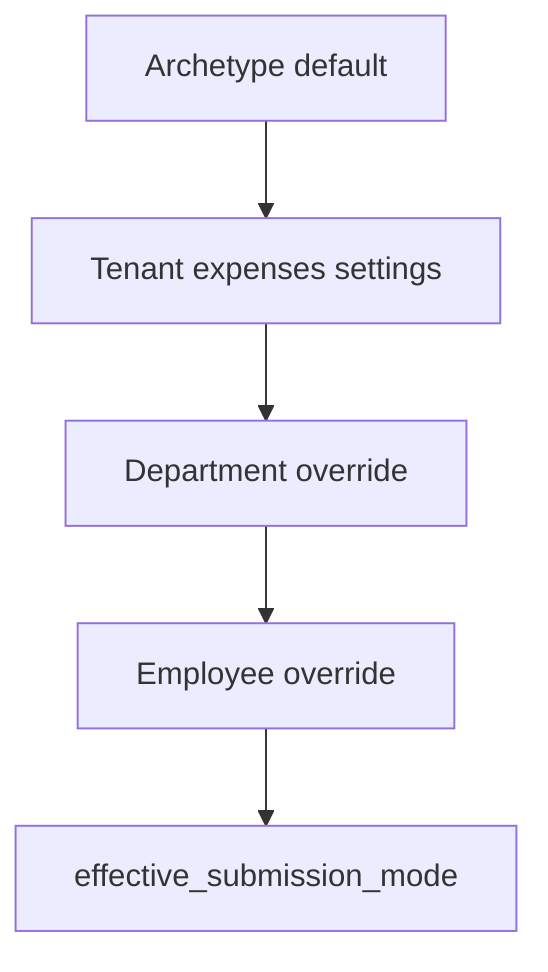

# 01 — Domini i modes de presentació

> Part del pla [Despeses d’empleat](./README.md). Sense implementació.

## 1. Problema de modes (FSM vs comercial)

| Perfil | Comportament esperat |
|--------|----------------------|
| Tècnic camp (`field_service`) | Puja el ticket i s’oblida. L’administratiu revisa, aprova i agrupa per notificar / nòmina. |
| Comercial / oficina | Agrupa despeses per causa (p. ex. viatge) en un **informe** i el sol·licita (patró tipus Odoo `hr.expense.sheet`). |

**Decisió EXP-2:** el mateix tenant pot tenir els dos modes. El mode efectiu es resol per cascada; no un sol switch global que forci tothom.

### Cascada `effective_submission_mode`

Més específic guanya:

1. Default de l’**arquetip** (seed onboarding / `sector_profiles`)
2. Override **tenant** (`tenants.settings.expenses` o equivalent)
3. Override **departament**
4. Override **empleat**

Valors per nivell: `line_first` | `report_first` | `both`.



### Matriu d’arquetips (defaults proposats)

Alineat amb [03-sector-profiles.md](../../product-design/03-sector-profiles.md):

| Arquetip | Default mode | Motiu |
|----------|--------------|-------|
| `field_service` | `line_first` | Ticket i oblidar-se |
| `workshop_maker` | `line_first` | Intervencions / desplaçaments |
| `hospitality` | `line_first` | Despeses puntuals de personal |
| `practice` | `both` | Mix professional + desplaçaments ocasionals |
| `generic` | `both` | Sense supòsit fort |
| Verticals “comercial / consultoria” sobre `generic` o `practice` | `report_first` (via seed vertical o override tenant) | Informe per viatge/causa |

El client escull el **vertical** a l’onboarding; el sistema aplica l’arquetip i el default de despeses. Després es pot afinar per departament (p. ex. SAT vs Comercial) o per empleat.

---

## 2. D-INT-12 — una sola taula de línies

Estat actual: `data.project_expenses` amb `project_id NOT NULL` ([migració work_logs](../../../supabase/migrations/20260506000005_work_logs.sql)).

| Opció | Descripció | Estat |
|-------|------------|-------|
| **A** | `project_id` nullable + `expense_scope` | **Adoptada (EXP-1)** |
| B | Taula `employee_expenses` separada | Rebutjada (duplicació UI/export) |
| C | Projecte intern fictici | Rebutjada (hack) |

Font: [work-logs-time-attendance-integration.md §6](../../../prompts/shared/work-logs-time-attendance-integration.md).

Despeses de km poden enllaçar-se a segments `TRAVEL` (preomplir distància) via `travel_segment_id` / `expense_ref_id`; l’import es calcula amb tarifa €/km (EXP-12), no s’introdueix a mà com a cas principal.

---

## 3. Entitat línia — evolució de `project_expenses`

Camps conceptuals (noms orientatius; DDL a EX0):

| Camp | Tipus / valors | Notes |
|------|----------------|-------|
| `tenant_id` | uuid | RLS |
| `employee_id` | uuid → `employees` | Qui incorre / a qui es reembolsa; **immutable** després d’enviar (**nou**; avui només `created_by` profile) |
| `line_kind` | `receipt` \| `mileage` | Ticket vs kilometratge calculat (EXP-12) |
| `project_id` | uuid nullable | Opcional; **reclassificable** amb `expenses.reclassify` (EXP-9) |
| `expense_scope` | `project` \| `employee_personal` | Obligatori; si `project` → cal `project_id` |
| `work_log_id` | uuid nullable | Despesa d’intervenció |
| `project_material_id` | uuid nullable → `project_materials` | Enllaç opcional al consum operatiu; evita duplicar cost |
| `report_id` | uuid nullable → `expense_reports` | Si forma part d’un informe/batch |
| `amount_cents` | integer | **Total** (base + IVA, o import calculat de km). Immutable després de `submitted` |
| `tax_base_cents` | integer nullable | Base imposable; NULL si `tax_exempt` (EXP-10) |
| `tax_rate_bps` | integer nullable | Tipus IVA en basis points (p. ex. 2100 = 21%); NULL si exempt |
| `tax_amount_cents` | integer nullable | Quota IVA; invariant: si no exempt, `tax_base + tax_amount = amount` |
| `tax_exempt` | boolean | Default false; true per mileage / categories exemptes |
| `currency` | char(3) | Moneda del comprovant; immutable després de `submitted` |
| `fx_rate_to_base` | numeric nullable | Tipus de canvi snapshotat cap a divisa base (EXP-11, EXP-17) |
| `fx_rate_source` | text nullable | p. ex. `ecb` \| `manual_admin` |
| `fx_rate_date` | date nullable | Dia de referència de la taxa (normalment data de `occurred_at` en UTC/Europa) |
| `amount_base_cents` | integer | Import total convertit a divisa base |
| `occurred_at` | timestamptz | Data real de la despesa; immutable després de `submitted` |
| `description`, `category` | | Categories configurables; `category` reclassificable |
| `paid_by` | `company` \| `employee` | Reclassificable amb RPC auditada |
| `is_billable` | boolean | Reclassificable; si true → cal `expense_scope = project` |
| `distance_km` | numeric nullable | Només `line_kind = mileage` |
| `mileage_rate_cents_per_km` | integer nullable | Tarifa aplicada (snapshot de la tarifa tenant al crear/enviar) |
| `travel_segment_id` | uuid nullable | Opcional; segment `TRAVEL` d’on es pot preomplir distància |
| `status` | veure §4 | Cicle de vida |
| `receipt_document_ids` | uuid[] / join table | Fins a 3 fitxers DMS; `entity_type = 'project_expense'` |
| `client_op_id` | uuid v7 nullable | Obligatori offline; únic per tenant |
| `source` | enum | `employee_portal` \| `tenant_ui` \| `public_form` \| `email` \| `ai_ocr` \| `api` |
| `external_refs` | jsonb | IDs a ERP/nòmina; **no** desar IBAN aquí (EXP-13 → HR) |
| `supersedes_expense_id` | uuid nullable | Si neix com a correcció després d’un `rejected` |
| `submitted_at`, `approved_at`, `settled_at`, `updated_at` | | Workflow |
| `created_by` | profile | Qui ha creat el registre |

**Regles**

- Despesa sense projecte: `expense_scope = employee_personal`, `project_id` NULL.
- Despesa de projecte: `expense_scope = project`, `project_id` NOT NULL.
- `paid_by = company`: no entra a cues de reemborsament a nòmina; pot caldre igualment aprovació/control.
- `paid_by = employee`: candidat a reemborsament després d’aprovació.
- Si hi ha `work_log_id`, `project_id` s’hereta i es valida contra el work log; no es pot enllaçar una despesa a un work log, projecte o empleat d’un altre tenant.
- Per field-service, el projecte resol client i `contact_site`; no es copia un `site_id` a la despesa.
- `project_materials` = consum; `project_expenses` = comprovant financer. `project_material_id` UNIQUE parcial; sense doble agregació.
- `is_billable = true` requereix `expense_scope = project`; és marca de conciliació, no facturació automàtica.
- **IVA (EXP-10):** per `receipt`, si no `tax_exempt`, cal base + quota coherents amb `amount_cents`. OCR pot proposar; l’usuari confirma. Export a gestoria **sempre** inclou aquests camps.
- **Mileage (EXP-12):** `amount_cents = round(distance_km × mileage_rate_cents_per_km)`; `tax_exempt = true`; tarifa des de `settings.expenses.mileage_rate_cents_per_km` (seed amb valor orientatiu Hisenda; el tenant la pot sobreescriure). Si hi ha `travel_segment_id`, la distància es pot preomplir però l’empleat confirma.
- **Multi-divisa (EXP-11, EXP-17):** a `submitted` es persisteix `fx_rate_to_base`, `fx_rate_source`, `fx_rate_date` i `amount_base_cents`. Font per defecte: **tipus de referència BCE** del dia calendari de `occurred_at` (publicació BCE; si el dia no té taxa, darrer dia hàbil anterior). Si `currency = base`, rate = 1 i `fx_rate_source = 'identity'`. Sense taxa disponible → no es pot enviar (ni afegir a informe multi-moneda). Fallback: admin amb `expenses.settle` o `expenses.manage_settings` pot fixar taxa `manual_admin` amb motiu auditat. Totals d’informe/notificació/export = suma de `amount_base_cents`.

---

## 4. Estats de la línia

```text
draft → submitted → needs_info ⇄ submitted
      → cancelled
                  → approved → reimbursement_queued → reimbursed
                  → rejected
                  → settled   (paid_by=company o liquidació sense reemborsament)
```

| Estat | Significat |
|-------|------------|
| `draft` | Esborrany (empleat o sistema) |
| `cancelled` | Esborrany descartat per l’empleat o admin; terminal; no apareix a cues |
| `submitted` | Pendent de revisió (línia sola o via informe enviat) |
| `needs_info` | Admin demana aclariment |
| `approved` | Acceptada; pendent d’agrupar / liquidar |
| `rejected` | Rebutjada (terminal); correcció = nova línia amb `supersedes_expense_id` |
| `reimbursement_queued` | Inclosa en batch/informe de pagament |
| `reimbursed` | Marcada com a reemborsada (hand-off confirmat a gestoria/nòmina) |
| `settled` | Tancada sense reemborsament a empleat |

En mode `report_first`, les línies queden en `draft` dins l’informe fins que l’empleat **envia** l’informe; aleshores passen a `submitted` juntes.

**Invariants de transició (EXP-8, EXP-9)**

- Només RPCs `SECURITY INVOKER` (o portal amb `employee_id` de sessió) amb validació de permís poden canviar `status`; la UI no actualitza files directament.
- `draft → cancelled`: permès a l’empleat titular o a qui tingui `expenses.review`. No hi ha hard-delete de drafts enviables; `cancelled` treu de cues i índexs actius (índex parcial `WHERE status <> 'cancelled'`).
- `needs_info` només torna a `submitted` per resposta de l’empleat o acció explícita de l’aprovador.
- `rejected` és terminal; la correcció crea una **nova** línia (`supersedes_expense_id`).
- Una línia només pot estar en un `admin_batch` actiu. La creació de batch bloqueja línies `approved` i fa `reimbursement_queued` a la mateixa transacció.
- **Immutables després de `submitted`:** `amount_cents` / camps IVA, `currency`, `fx_*`, `employee_id`, `occurred_at`, `line_kind`, distància/tarifa mileage.
- **Rebuts després de `submitted`:** el set confirmat no es pot esborrar ni substituir. **Única excepció:** mentre `status = needs_info`, RPC `expenses.append_receipt` (append-only, auditat) afegeix fitxers al set oficial exportable. Els adjunts del **timeline** (comentari d’aclariment) **no** entren a `receipt_document_ids` ni a l’export a gestoria.
- **Reclassificables** (RPC `expenses.reclassify`, permís `expenses.reclassify`, audit before/after): `project_id`, `expense_scope`, `is_billable`, `paid_by`, `category`, `description` (text no econòmic). Cap UPDATE silenciós.
- Demanar aclariment / rebutjar quan cal canviar fets econòmics (import, IVA, data, km) o substituir un rebut ja confirmat (aleshores `rejected` + línia nova amb `supersedes_expense_id`).

---

## 5. Entitat agrupació — `expense_reports`

Nova entitat conceptual (nom de taula provisional).

| Camp | Notes |
|------|-------|
| `tenant_id`, `employee_id` | Titular (`employee_report`); `admin_batch` pot agrupar un sol empleat per batch (V1: un empleat per batch per simplificar notificació) |
| `title` / `cause` | P. ex. “Viatge Madrid 2026-03” |
| `kind` | `employee_report` \| `admin_batch` |
| `status` | veure FSM més avall |
| `base_currency` | Còpia de la divisa base del tenant al crear |
| `period` / dates | Opcional |
| Totals | Derivats: `sum(amount_base_cents)` de línies no `rejected`/`cancelled` |

**Dos orígens d’agrupació**

1. **Empleat (`report_first` / `both`):** crea informe, afegeix línies, envia a aprovació.
2. **Admin (`line_first` / `both`):** selecciona línies ja `approved` **d’un sol empleat** i crea `admin_batch` (EXP-16) per notificar total (divisa base) + export nòmina. La UI filtra per empleat abans de multi-selecció; la RPC rebutja sets multi-empleat.

Un informe pot barrejar projectes; cada línia conserva el seu `project_id`. Les línies poden existir **sense** `report_id` fins que un admin les agrupa.

### FSM d’informe (`employee_report`) — EXP tancada (no diferir a EX3)

```text
draft → submitted → needs_info ⇄ submitted
      → cancelled
                  → approved → queued_for_payroll → closed
                  → partially_approved → queued_for_payroll → closed
                  → rejected
```

| Acció | Efecte sobre línies |
|-------|---------------------|
| Enviar informe | Totes les línies `draft` del informe → `submitted` |
| Cancel·lar informe en `draft` | Informe → `cancelled`; línies tornen a `draft` sense `report_id` **o** es cancel·len si el tenant ho configura (default: desvincular i deixar `draft`) |
| Rebutjar informe sencer | Informe → `rejected`; **totes** les línies encara en `submitted`/`needs_info` → `rejected` |
| Aprovar informe sencer | Informe → `approved`; totes les línies elegibles → `approved` |
| Rebutjar línies concretes i aprovar la resta | Línies rebutjades → `rejected`; resta → `approved`; informe → `partially_approved` |
| Demanar aclariment a nivell informe | Informe → `needs_info`; línies segueixen `submitted` o passen a `needs_info` segons si el missatge és global o per línia |

Un informe **no** pot passar a `queued_for_payroll` mentre quedi alguna línia en `submitted` o `needs_info`. Les línies `rejected` no entren al total a reemborsar.

**Invariants d’informe i batch**

- Els totals es calculen en lectura/export o snapshot no editable; sempre en `base_currency` via `amount_base_cents`.
- Un `employee_report` només conté línies del seu `employee_id`; un `admin_batch` només línies `approved`, `paid_by = employee`, sense batch actiu, **del mateix empleat** (V1).
- Exportar és idempotent per `report_id` + perfil; `external_refs` conserva resultat; reintent auditat.

---

## 6. Configuració

### Tenant (`settings.expenses` conceptual)

- `default_submission_mode`
- `base_currency` (default `EUR`; alineat amb settings generals del tenant si existeix)
- `fx_rate_source` default `ecb`; política de snapshot a `submitted` (EXP-17)
- `mileage_rate_cents_per_km` (tarifa reemborsament km)
- Categories permeses / etiquetes (flag `tax_exempt`, flag `restricted_health`)
- Política: cal ticket adjunt? imports màxims? auto-aprovació sota llindar? (futur)
- `expenses_retention_years` — default **10**, mínim **4**, màxim **10** (EXP-14)
- `expenses_retention_purge_enabled` — default **`true`**; desactivar = acció explícita + audit + avís de minimització
- `project_costs_min_cohort` — default **5** (k-anonymity per `view_project_costs`, EXP-18)

### Departament / empleat

- `expenses_submission_mode` nullable (override)
- Resolució via helper `effective_submission_mode(tenant, department_id, employee_id)`

Qualsevol canvi de mode deixa audit trail i **no** reclassifica línies/informes ja creats.

---

## 7. Relació amb control horari i projectes

| Cas | Vincle |
|-----|--------|
| Km | `line_kind = mileage` + tarifa tenant; opcional `travel_segment_id` / `expense_ref_id` al segment |
| Peatge / viatge amb ticket | `line_kind = receipt` + segment opcional |
| Àpat / material a intervenció | `work_log_id` + opcionalment `project_id` |
| Despesa genèrica RRHH | Sense projecte (`employee_personal`) |
| Cost imputable a client | `expense_scope = project` + `is_billable` |

La implementació de dietes/km **no** va al motor de minuts (Track G); va a aquest mòdul ([plan-effective-work-time §18.8](../checkin/plan-effective-work-time.md)).

---

## 8. Storage, retenció i rendiment (obligatori a EX0b)

Els rebuts reutilitzen `request-upload` → upload signed URL → `confirm-upload`, `data.file_nodes`, `data.storage_usage` i `trash_deletion_queue`.

| Control | Requisit mínim |
|---------|----------------|
| Límits de rebut | 5 MB/imatge, 10 MB/PDF; màxim 3 fitxers/despesa; MIME: JPEG, PNG, WebP, PDF |
| Quota | Reserva de bytes abans de pujar; observability `expense_receipt` per tenant |
| Metadades | `source = expense_receipt`, `expense_id`, `tenant_id` |
| Orfes / pendents | Job elimina uploads pendents caducats |
| Retenció confirmats | **Default 10 anys** des de `occurred_at`, rang 4–10. Purge **actiu per defecte**. Un rebut confirmat **no** s’esborra perquè la despesa es rebutgi. Detall: [04](./04-compliance-retention-gdpr.md) |
| Mòbil / multi-fitxer | Comprimir al client. Offline: cua local per fitxer. **Fallada parcial:** la línia roman en `draft` (o sync pendent) fins que **tots** els rebuts requerits estiguin `confirm-upload`; no es marca `submitted` amb set incomplet. Reintents per `client_op_id` + id local de fitxer |

Índexs mínims EX0: `(tenant_id, status, submitted_at DESC, id)` excloent `cancelled`; `(tenant_id, employee_id, occurred_at DESC, id)`; `(project_id, occurred_at DESC)`; parcial `report_id`. Cursor pagination, no offset.
