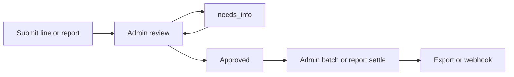

# 02 — Fluxos i superfícies

> Part del pla [Despeses d’empleat](./README.md). Sense implementació.

## 1. Flux global

---

## 2. Alta (fonts d’entrada)

| Font | `source` | Prioritat roadmap | Notes |
|------|----------|-------------------|-------|
| Portal empleat | `employee_portal` | EX2 (P0 FSM) | Foto ticket + import/categoria/projecte opcional; sempre a través d’API del portal, no RLS directa basada en `auth.uid()` |
| Tenant portal (admin o usuari) | `tenant_ui` | EX1 | Alta en nom de / correccions |
| Formulari públic o intern | `public_form` | EX6 diferida | Només amb antispam, atribució d’empleat, quarantena i límits de PII; no és un canal de reemborsament MVP |
| Correu | `email` | EX6 diferida | Només amb pipeline inbound, resolució d’identitat, quarantena d’adjunts i deduplicació; avui no existeix |
| OCR / IA | `ai_ocr` | EX5 | Pot preomplir; l’usuari confirma |
| API / integració | `api` | EX4+ | Connectors futurs |

**Mode `line_first`:** l’empleat crea una línia (`draft` → `submitted`) i deixa. No cal informe.

**Mode `report_first`:** l’empleat crea línies dins un informe (`draft`) i envia l’informe sencer.

**Mode `both`:** UI ofereix “despesa ràpida” i “afegir a informe / crear informe”.

### Alta mòbil offline (field-service)

1. El client genera `client_op_id` abans de desar l’operació localment; el mateix id es reutilitza en tots els reintents.
2. Cada foto/PDF es comprimeix i queda en cua local amb el seu propi id de fitxer. Durant l’offline no es promet pujada ni OCR.
3. En recuperar connexió: per cada fitxer → reserva quota → upload → `confirm-upload`. Si **un** fitxer falla, els ja confirmats es conserven; la línia **no** passa a `submitted` fins que el set requerit estigui complet (o l’usuari redueix el set en `draft`).
4. Només després la RPC finalitza `draft`/`submitted` segons el mode. Un `client_op_id` ja existent és èxit idempotent.
5. Kilometratge pot anar sense foto; distància confirmada per l’empleat (preomplida des del segment si n’hi ha).

El close-out de field-service pot oferir “afegir despesa”, però no bloqueja el tancament de la visita. Integració després d’EX0a/EX0b.

### Identitat portal (anti-suplantació)

- La sessió del portal resol `employee_id` **només** des del token validat (`employee_portal_tokens` + PIN si aplica), mai des del body de la petició.
- Les RPC/Edge d’alta i enviament **ignoren** qualsevol `employee_id` enviat pel client i forcen el de la sessió.
- Un token filtrat permet actuar com aquell empleat fins a rotació/revocació; mitigacions: PIN, caducitat configurable, access logs, revocació des del tenant (veure [18-employee-portal-architecture](../../product-design/18-employee-portal-architecture.md)).
- Alta “en nom de” només des de `tenant_ui` amb permís explícit i `created_by` ≠ titular si escau; queda a l’audit.

---

## 3. Revisió administrativa

Cua al tenant-portal (filtre per estat, empleat, projecte, import, sense ticket, etc.).

| Acció | Efecte | Permís |
|-------|--------|--------|
| Aprovar | → `approved` | `expenses.review` |
| Rebutjar | → `rejected` (+ motiu) | `expenses.review` |
| Demanar aclariment | → `needs_info` + missatge (§5) | `expenses.review` |
| Reclassificar imputació | Canvi auditat de `project_id` / `expense_scope` / `is_billable` / `paid_by` / categoria (EXP-9) | `expenses.reclassify` |
| Liquidar / batch / export | Veure §4 | `expenses.settle` |

**No hi ha “editar silenciosament”** després de `submitted`. Fets econòmics → `rejected` + línia nova. Ticket que falta → `needs_info` + `expenses.append_receipt` (veure §5). Adjunt de timeline ≠ rebut oficial.

Si la reclassificació posa `is_billable = true`, cal `expense_scope = project` i el revisor ha de tenir accés de lectura al projecte destí (mateixa regla `can_access_project`); si no, la RPC falla.

### Informe (`report_first`) — accions (FSM a [01 §5](./01-domain-and-modes.md))

- Aprovar tot / rebutjar tot / `needs_info` global.
- Rebutjar línies concretes i aprovar la resta → informe `partially_approved`.
- No es deixa per a “detall UX a EX3”: les transicions d’estat de les línies estan definides al domini.

---

## 4. Agrupació i reemborsament

### Batch admin (`line_first`) — EXP-16: un empleat per batch

1. Admin filtra per **un** `employee_id`, després línies `approved` + `paid_by = employee`.
2. Crea `expense_reports` amb `kind = admin_batch` i aquest `employee_id`. La RPC **rebutja** si el set barreja empleats.
3. Línies → `reimbursement_queued`; informe → `queued_for_payroll`.
4. Notificació a l’empleat: llista / total aprovat a reemborsar **en divisa base**.
5. Export o webhook per a gestoria / nòmina (payload amb IVA; IBAN només si el perfil d’export ho demana, llegit de HR — EXP-13). Avís a UI si `paid_by = employee` i l’empleat **no** té IBAN a dades privades.
6. Confirmació de liquidació (manual o callback futur) → `reimbursed` / informe `closed`.

La creació de batch és una RPC transaccional: selecciona i bloqueja línies elegibles, rebutja línies ja agrupades o multi-empleat, i escriu l’auditoria abans d’enviar notificacions o webhooks.

### Informe empleat (`report_first`)

1. Empleat envia informe → revisió.
2. Un cop aprovat, el mateix informe pot passar a cua de nòmina sense un segon agrupament (o l’admin el marca per export).
3. Notificació d’aprovació + import total.

`paid_by = company`: després d’aprovació → `settled` (control intern; no batch de reemborsament).

---

## 5. Aclariments (MVP dins despeses)

Quan l’admin demana informació:

- Estat `needs_info`.
- Comentari al **entity timeline** de la despesa (i/o de l’informe), amb notificació in-app i/o email.
- L’empleat pot respondre amb **comentari + adjunt de timeline**. Aquest adjunt és evidència de conversa: **no** entra a `receipt_document_ids` ni a l’export a gestoria.
- Si cal **afegir un ticket oficial** que faltava: mentre `needs_info`, RPC `expenses.append_receipt` (append-only, auditat) afegeix al set oficial (excepció EXP-9). No es pot substituir ni esborrar un rebut ja confirmat; per això cal `rejected` + línia nova.
- Després de la resposta, la línia torna a `submitted` (o l’admin la reobre).

**No** és un producte de xat general. Comunicació transversal: [prompt-internal-comms.md](./prompt-internal-comms.md).

---

## 6. Superfícies UI

### Employee portal (`apps/public-portal`)

- Pujar despesa (càmera / adjunt) o kilometratge.
- Cancel·lar `draft` propi.
- Llista amb estats i imports (divisa de la línia + total base si difereix).
- Veure informes propis / batches.
- Respondre `needs_info`.
- Segons `effective_submission_mode`: amagar o mostrar “informe”.

Referència: [18-employee-portal-architecture.md](../../product-design/18-employee-portal-architecture.md). Sessió token + Edge/RPC; **sense** RLS `authenticated` directa sobre taules de despeses.

### Tenant portal (`apps/tenant-portal`)

- Cua de revisió; reclassificació auditada; batches; export.
- Settings (mode, categories, tarifa km, retenció, divisa base).
- Vista costos de projecte (veure permisos §7: capa agregada/redactada).
- Overrides departament / empleat.

### Públic / formularis

- Formulari captació (EX6), similar a leads: validació + cua + ack email.

### Feature flag

- Addon / flag `expenses` (ja esmentat a sector profiles com a addon). Gates de UI i RPC a EX0.

---

## 7. Permisos (contracte V1)

| Permís / actor | Capacitat |
|----------------|-----------|
| Empleat (portal o user vinculat) | Crear/editar/cancel·lar `draft` propis; enviar; respondre `needs_info`; llegir només línies/informes/rebuts propis |
| `expenses.review` | Cua; aprovar/rebutjar; `needs_info`; **no** reclassifica; **no** liquida; **no** settings |
| `expenses.reclassify` | RPC auditada de imputació (`project_id`, `expense_scope`, `is_billable`, `paid_by`, categoria) post-`submitted`; requereix accés al projecte destí si s’imputa |
| `expenses.settle` | Crear batch, exportar, confirmar reemborsament/liquidació |
| `expenses.manage_settings` | Modes, categories, tarifa km, retenció, límits |
| `expenses.view_project_costs` | Totals agregats per categoria/període. **k-anonymity ≥ 5** (`project_costs_min_cohort`, EXP-18): si la cohort té &lt; N empleats distintes amb despesa al tall, el servidor **només** retorna el total agregat (sense files per línia ni labels `Teammate`/inicials). Amb cohort ≥ N, opcionalment files amb empleat redactat. **No** veu `employee_personal`, **no** obre rebuts, **no** aprova. Identitat completa + rebuts = `expenses.review`. |

V1: un nivell d’aprovació (`expenses.review`). Bundles field-service (`admin`, `commercial`, `tecnic`) es mapejen explícitament; no s’infereixen de job title. `expenses.reclassify` pot anar al mateix bundle que `review` per a admin RRHH, però el permís és **separat** per poder-lo treure a revisors junior.

---

## 8. Notificacions mínimes

| Esdeveniment | Destinatari |
|--------------|-------------|
| Nova despesa / informe enviat | Cua admin (in-app; email opcional) |
| Aprovada / rebutjada / batch | Empleat |
| `needs_info` | Empleat |
| Resposta a aclariment | Admin que va demanar (o cua) |

Reutilitzar motor de notificacions existent (in-app + email/SMS/WhatsApp segons tenant).
