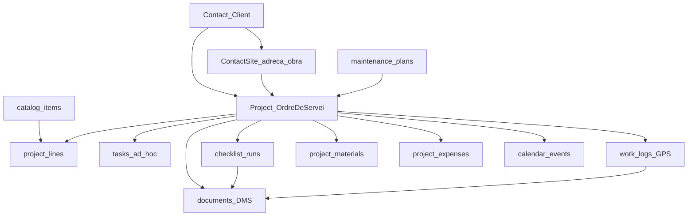

# 03 — Model de composició

> Part del pla [Field Service / Work Orders](./README.md).  
> L’ordre de servei **no** és una taula nova: és un `Project` etiquetat i compost.

## Diagrama



## Rols de cada primitiva

| Primitiva | Rol a Field Service |
|-----------|---------------------|
| **Contact** | Client (`preferred_locale` per parts/albarans) |
| **ContactSite** | Adreça / local d’obra (prioritari a V1 sobre Locations del tenant) |
| **Project** (`internal` / `work_order` / `maintenance`) | L’ordre de servei |
| **project_lines** | Pressupost / tarifari (visita, hora, km…) |
| **checklist_runs / items** | Execució de plantilles `todo` (checkbox) o `review` (punts + estats); snapshot immutable de respostes; part públic (`include_in_report` = “Incloure al part del client”) |
| **checklist_review_points** | Catàleg reutilitzable de punts de revisió (plataforma clonable → tenant) |
| **tasks** | Feines ad hoc no previsibles de la visita |
| **maintenance_plans** | Plans periòdics; plataforma només clonable; assignacions i cron generen `Project(type=maintenance)` amb checklists del pla |
| **work_logs** | Temps a obra + geo + offline |
| **project_materials** | Materials consumits a la visita |
| **project_expenses** | Dietes/tickets (UI via pla [expenses](../expenses/); no bloqueja close-out mínim) |
| **documents** | Fotos / PDFs polimòrfics (`entity_type` project \| checklist_run_item \| work_log) |
| **calendar_events** | Visita planificada quan hi ha `planned_start` (sense RRULE; la recurrència viu als plans) |
| **locations / assets** | Espai del tenant / equipament; `assets.contact_site_id` per equips al local del client |

## Estats

V1: reutilitzar `projects.status` existents amb **labels UI** de servei (veure Epic FS-0). Només ampliar CHECK SQL si el mapeig labels+filtres no cobreix el flux (p.ex. necessitat explícita de `scheduled`).

Flux conceptual (UI):

```text
draft / pressupost → planificat → en curs → completat
                 ↘ cancel·lat / en espera
```

## workshop_maker (camp)

Mateix model quan l’ordre té `contact_site_id` (visita a client). Tasques amb `location_id` (taller) vs site (camp) — **sense UI dual a V1** fins que arribi stock-lite.
