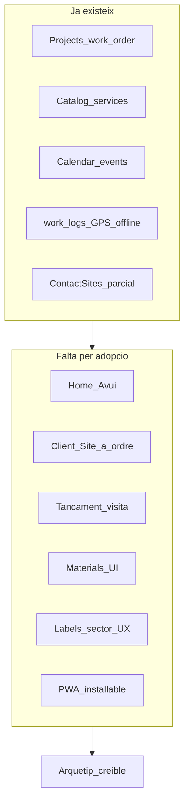

# Field Service / Work Orders — pla de producte

> **Estat:** V1 usable amb gaps honestos (offline parcial, UAT pendent); seed **Volt Serveis** + E2E sense mock — veure [`STATUS.md`](./STATUS.md) (2026-07-25).  
> **Prioritat:** #1 ops verticals ([estudi Odoo × verticals](../odoo/estudi-prioritat-moduls-odoo-per-verticals.md)).  
> **Objectiu:** convertir el substrat Projects + Catalog + Calendar + ContactSite + work_logs en una app de camp clara per a `field_service` (Tier A solo a V1).  
> **Seguiment d’implementació:** [`STATUS.md`](./STATUS.md)

| Document | Contingut |
|----------|-----------|
| [01-jtbd-and-persona.md](./01-jtbd-and-persona.md) | Jobs-to-be-done, persona Tier A, què fa l’oficina |
| [02-gap-and-naming.md](./02-gap-and-naming.md) | Què tenim / què falta + col·lisions de noms |
| [03-composition-model.md](./03-composition-model.md) | Composició Contact → Ordre → Calendar / materials |
| [04-ux-contract.md](./04-ux-contract.md) | Contracte mòbil: Avui, FAB, close-out, nav |
| [05-backlog-epics.md](./05-backlog-epics.md) | Epics V1 0–5, deps, fora d’abast, V1.5/V2 |
| [06-acceptance-and-gates.md](./06-acceptance-and-gates.md) | Criteris d’èxit V1 i gate cap a V1.5 |
| [STATUS.md](./STATUS.md) | Estat per epic (actualitzar durant la implementació) |
| [uat-tier-a-checklist.md](./uat-tier-a-checklist.md) | Checklist d’acceptació Tier A solo |

---

## Diagnòstic

PiMed ja té el **motor** d’ordre de servei (`projects.type = work_order` + catàleg + calendari + GPS work_logs offline), però encara no té el **producte FSM**: una app de camp que un electricista aprèn en 10 minuts. Sense aquesta capa, `field_service` es veu com a CRM d’oficina.

---

## Decisions tancades (no reobrir)

| ID | Decisió | Font |
|----|---------|------|
| **FS-1** | **No** taula `work_orders` separada: l’ordre = `data.projects` (`type` `work_order` / `maintenance`) | [02-domain-model](../../product-design/02-domain-model.md), [prompts/projectes/plan.md](../../../prompts/projectes/plan.md) D5 |
| **FS-2** | Composició: Contact(+Site) → Project → lines/tasks/work_logs/materials → CalendarEvent | Estudi Odoo + domain |
| **FS-3** | Persona V1: **Tier A solo** (`field_service`, electricista com a proxy) | [01-vision](../../product-design/01-vision-and-positioning.md) |
| **FS-4** | `workshop_maker` a camp **reutilitza** el mateix flux (no fork); stock-lite = prioritat #4 separada | [estudi Odoo](../odoo/estudi-prioritat-moduls-odoo-per-verticals.md) |
| **FS-5** | PWA primer; rutes Maps / cobrament al lloc = V2; signatura client = V1.5 | [07-mobile](../../product-design/07-mobile-and-ai-leverage.md), [08-checklist](../../product-design/08-erp-crm-checklist.md) |
| **FS-6** | Expenses (`line_first`) en paral·lel; **no bloqueja** el MVP FSM. La integració al close-out mòbil queda bloquejada fins que Expenses EX0a/EX0b defineixi comprovant financer vs materials, idempotència offline, Storage/retenció i permisos. | [expenses](../expenses/) |
| **FS-7** | Gate V1 → V1.5 = Tier A solo **provat i acceptat** (E2E + UAT), **no** adopció de mercat | [06-acceptance-and-gates.md](./06-acceptance-and-gates.md) |

---

## Relacionat

| Document | Relació |
|----------|---------|
| [product-design/03-sector-profiles.md](../../product-design/03-sector-profiles.md) | Recepta `field_service` |
| [product-design/05-modules-roadmap.md](../../product-design/05-modules-roadmap.md) | Fase D #10 Field Service |
| [product-design/07-mobile-and-ai-leverage.md](../../product-design/07-mobile-and-ai-leverage.md) | FAB, Today, offline, PWA |
| [product-design/08-erp-crm-checklist.md](../../product-design/08-erp-crm-checklist.md) | WO 🟡 D; checklist per arquetip |
| [product-design/10-implemented-modules.md](../../product-design/10-implemented-modules.md) | Estat mòduls (compte: EAM WO — veure [02](./02-gap-and-naming.md)) |
| [odoo/estudi-prioritat-moduls-odoo-per-verticals.md](../odoo/estudi-prioritat-moduls-odoo-per-verticals.md) | Prioritat #1 |
| [projects/plan-millora-projectes.md](../projects/plan-millora-projectes.md) | Projects = substrat, no producte FSM |
| [prompts/projectes/plan.md](../../../prompts/projectes/plan.md) | Pla d’implementació Projects / work_logs |
| [commercial-flow/](../commercial-flow/) | Capa comercial: pressupost, import autoritzat, ampliació, albarà i cobrament |
| [expenses/](../expenses/) | Despeses camp (`line_first`) |
| [checkin/plan-effective-work-time.md](../checkin/plan-effective-work-time.md) | Itinerant ≠ centre fix; `field_punch` |
| [offline-app/offline_plan.md](../offline-app/offline_plan.md) | Pla antic `tech-portal` — V1 = shell dins tenant-portal |
