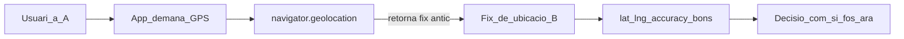

# Caché de geolocalització al navegador: problema i fiabilitat

Explicació agnòstica per a apps web que guarden ubicacions amb `navigator.geolocation`. Sense referències a productes concrets.

---

## El problema

Quan una app demana la posició:

```js
navigator.geolocation.getCurrentPosition(success, error, {
  enableHighAccuracy: true,
  timeout: 15000,
  maximumAge: 5000, // o 0, 60000, Infinity...
});
```

el navegador **pot retornar una posició ja calculada abans** (caché del sistema / del navegador), no un fix nou.

Això passa especialment si `maximumAge > 0` (es permet una posició antiga fins a N ms). Fins i tot amb `maximumAge: 0` hi ha matisos de plataforma, però el risc principal és acceptar caché **sense saber-ho**.

### Per què és engañós

- L’usuari és al lloc A; l’app desa coords del lloc B (on estava fa minuts).
- `coords.accuracy` pot ser **excel·lent** (p.ex. 8 m): aquell fix antic ja era precís.
- **Accuracy ≠ frescor.** Una mesura precisa pot ser espacialment correcta *aleshores* i incorrecta *ara*.
- Si només es persisteixen `lat`, `lng`, `accuracy` i un `Date.now()` del moment del guardat, **es perd** la prova de si el fix era vell. Després ja no es pot auditar.



### Què mesura cada camp

- **`coords.accuracy`**: radi d’incertesa del fix (metres). No diu si el fix és d’ara.
- **`position.timestamp`** (API Geolocation): quan el **dispositiu** va obtenir aquell fix. Aquesta és la dada crítica.
- **`Date.now()` al callback**: quan l’app va rebre la resposta. No és l’edat del fix.
- **`maximumAge`** (opció de la petició): edat màxima de caché que l’app **accepta**. No classifica sola el resultat: cal comparar amb `position.timestamp`.

**Clau:** sense `position.timestamp` (o `ageMs = now - position.timestamp`), després és impossible saber si era caché.

---

## Com veure que la mesura no és fiable

### 1. Calcular l’edat del fix

En el `success` de `getCurrentPosition` / `watchPosition`:

```js
const capturedAtMs = Date.now();
const positionTimestampMs = position.timestamp; // del navegador
const ageMs = Math.max(0, capturedAtMs - positionTimestampMs);
```

Interpretació pràctica:

- `ageMs` petit (p.ex. ≤ pocs segons, coherent amb el `maximumAge` demanat) → més probable **fresc**.
- `ageMs` gran → **cachejat** (o fix vell acceptat).
- Sense `position.timestamp` → **desconegut** (no afirmar frescor).

### 2. Classificar la font (recomanat)

Guardar una etiqueta explícita, no només números crus:

| Etiqueta | Quan |
|----------|------|
| `fresh` | `ageMs` ≤ `maximumAge` demanat (o edat ~0) |
| `cached` | `ageMs` > `maximumAge` demanat, o edat clarament gran |
| `fallback_low_accuracy` | Segon intent més permissiu (més `maximumAge`, menys `enableHighAccuracy`) després d’un timeout |
| `unknown` | Falta timestamp o no es pot classificar |

Regla simple:

```
si s'ha usat fallback / baixa accuracy → fallback_low_accuracy
si hi ha ageMs i maximumAge:
  ageMs > maximumAge → cached
  altrament → fresh
si ageMs === 0 → fresh
altrament → unknown
```

### 3. Separar “precís” de “fiable ara”

Una mesura pot ser:

- **Precisa** (`accuracy` baix) però **no fresca** (`cached`) → **poc fiable com a prova de “on és ara”**.
- **Fresca** però **imprecisa** (`accuracy` alt) → fiable en temps, dubtosa en espai.
- **Fallback** → útil per no bloquejar UX; **baixa confiança** en conclusions espacials fortes.

Per UI o auditoria: mostrar junts *accuracy*, *edat* (`ageMs`) i *font* (`fresh` / `cached` / …).

### 4. Persistir metadades amb les coords

Camps mínims a desar amb cada localització:

```json
{
  "latitude": 41.48,
  "longitude": 2.06,
  "accuracy": 12,
  "capturedAtClient": "2026-07-28T10:01:00.000Z",
  "positionTimestamp": "2026-07-28T10:00:45.000Z",
  "ageMs": 15000,
  "positionSource": "cached",
  "requestMaximumAgeMs": 5000,
  "requestTimeoutMs": 5000,
  "requestEnableHighAccuracy": true
}
```

Sense això, qualsevol anàlisi posterior (humana o IA) sobreestima la fiabilitat.

---

## Com mitigar-ho (sense matar UX)

1. **No assumir** que un success = posició actual. Sempre calcular `ageMs`.
2. **Política progressiva**:
   - Primer intent: timeout curt, `maximumAge` petit, alta accuracy.
   - Si vell / timeout: segon intent més estricte (`maximumAge: 0`) o, si cal no bloquejar, fallback més permissiu **marcat** com a baixa confiança.
3. **No bloquejar el flux de negoci** si el GPS falla: desar el document amb error / sense coords / amb `unknown`, millor que perdre dades.
4. **No usar només `accuracy`** per decisions que depenguin de “on estava *ara*” (geofence estricte, proves de presència, antifrau espacial, etc.).
5. Si la conclusió és forta (“estava aquí en aquest moment”), **exigir frescor** (`fresh` / `ageMs` baix). Si és `cached` o `unknown`, baixar confiança o demanar confirmació.
6. Documents antics sense metadades → tractar com `unknown`, no com `fresh`.

### Anti-patrons

- Guardar només `new Date()` i anomenar-ho “timestamp GPS”.
- Creure que `accuracy < 30` implica “posició fiable ara”.
- Esperar indefinidament amb `maximumAge: 0` i bloquejar el guardat.
- Tirar el submit si falla el GPS.
- Analitzar distàncies / mapes sense mirar `ageMs` / font.

---

## Resum

El navegador pot tornar un GPS **antic amb accuracy excel·lent**. Per saber si la mesura és fiable com a “ubicació actual”:

1. Llegir `position.timestamp` i calcular `ageMs`.
2. Classificar `fresh` / `cached` / `fallback` / `unknown`.
3. Desar aquestes metadades amb les coordenades.
4. Tractar accuracy i frescor com a eixos independents: **precisió espacial ≠ validesa temporal**.
