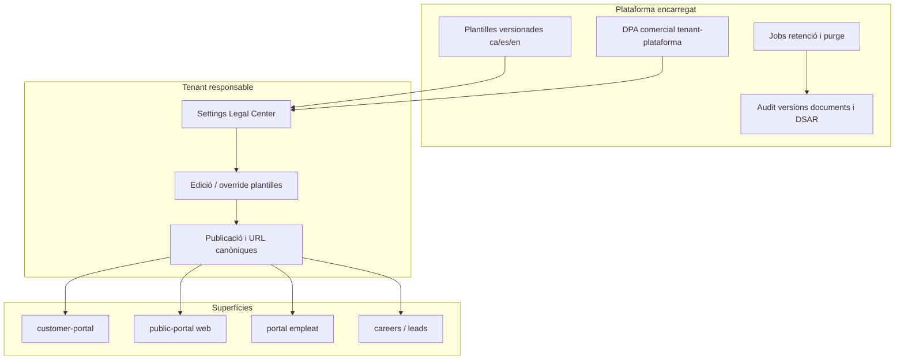

# Mòdul Legal & Compliance de plataforma (RGPD)

> **Estat:** contracte de producte / arquitectura (2026-08-15). Implementació en curs.  
> **Objectiu:** Legal Center unificat (viver d’empreses): la plataforma proveeix plantilles i procediments RGPD/ePrivacy/LSSI; el tenant configura. Sense porta obligatòria d’acceptació al customer-portal.  
> **Control d’execució:** [`STATUS.md`](./STATUS.md) · [`EXECUTION.md`](./EXECUTION.md) · glossari [`GLOSSARY.md`](./GLOSSARY.md) · proves [`QA.md`](./QA.md)  
> **Origen del pla:** iteració Cursor `platform_legal_gdpr` (decisions A/A + revisió de riscos).

## Decisions tancades

- **Customer-portal:** no porta d’acceptació obligatòria al primer accés. Informació **Art. 13** (plantilla/enllaç) + **avís informatiu de cookies essencials** (sessions HttpOnly; sense CMP de marketing mentre no hi hagi cookies no essencials).
- **Abast:** un sol pla de producte amb **fases**, que cobreix els 6 àmbits (client, customer-portal, web pública, empleat, portal empleat, selecció).
- **Model viver:** la plataforma **proporciona** plantilles, fluxos i retenció operativa; el tenant **configura** (edita, activa, posa contacte/DPO) i és el **responsable**; la plataforma és **encarregat** sota DPA comercial.
- **Rols:** el client final **no “accepta la DPA”**. Se l’informa (Art. 13) de la política del **tenant**. La DPA la signa el tenant amb la plataforma.

## Relació amb altres contractes

| Document | Rol |
|---|---|
| [`../custom-portal/legal-and-dpa.md`](../custom-portal/legal-and-dpa.md) | CP-0.6: rols, Art. 13 butlletí, requisits DPA (producte) |
| [`../custom-portal/projection-and-retention.md`](../custom-portal/projection-and-retention.md) | CP-0.5: allowlist + retenció operativa |
| [`../recruitment/01-domain-and-gdpr.md`](../recruitment/01-domain-and-gdpr.md) | ATS RGPD; **CMP diferit** — aquest pla és canònic per cookies |
| [`../employees/plan-employee-personal-data-self-service.md`](../employees/plan-employee-personal-data-self-service.md) | Self-service PII empleat (Fase LC-3) |
| [`../expenses/04-compliance-retention-gdpr.md`](../expenses/04-compliance-retention-gdpr.md) | Expenses GDPR — enllaçat, fora d’abast d’implementació aquí |

## Estat actual (breu)

| Àmbit | Què hi ha | Forat principal |
|---|---|---|
| Customer-portal | URL privacitat, link Art. 13, projecció allowlist, logs | Sense avís cookies; sense plantilla allotjada; retenció/purge i DSAR documentats |
| Web pública / leads | Checkbox Art. 13; careers URL | Sense banner cookies; footer legal unificat; lead sense enllaç |
| Selecció | Privacy URL, retention, rights inbox | Reutilitzar; unificar a Legal Center (LC-4) |
| Empleat / portal empleat | Geo consent punch; plan self-service PII | Sense política empleat allotjada ni footer legal |
| Plataforma | Cap Legal Center unificat | Fragmentació per mòdul |

## Arquitectura objectiu

**Font de veritat:** documents legals per tenant (tipus, locale, versió, cos sanititzat, `draft|published`, `effective_at`). Superfícies consumeixen la versió publicada o URL externa.

**Modes per document:**

1. **Plantilla plataforma** (recomanat startups): text base + camps merge.
2. **Plantilla editada** (fork versionat del tenant).
3. **URL externa** (només enllaç).

## Catàleg de documents

| Codí | Destinatari | Contingut clau |
|---|---|---|
| `privacy_customers` | Clients / destinataris butlletí | Art. 13: responsable=tenant, encarregat=plataforma |
| `legal_notice` | Visitants web pública | Avís legal LSSI |
| `portal_terms_customers` | Usuaris customer-portal | Condicions d’ús (footer informatiu LC-1; sense gate) |
| `cookie_notice` | Visitants web/portal | Avís cookies essencials; sense bloqueig |
| `privacy_website` | Web / leads | Art. 13 formularis |
| `privacy_employees` | Empleats | RRHH / portal (base laboral) |
| `employee_portal_terms` | Portal empleat | Condicions internes |
| `privacy_candidates` | Candidats | Alinear amb recruitment |
| `dpa_platform` | Tenant (no client final) | Acord encarregat |

Plus: procediments (onboarding Legal, guia DSAR, runbook incidents).

## Fases (resum)

| Fase | Nom | Contingut |
|---|---|---|
| **LC-0** | Contracte docs | Aquest paquet + enllaços + inventari cookies + reconciliar REC-0 |
| **LC-1** | Legal Center + superfícies client/web | Schema, Settings Legal, `/legal`, cookie notice, leads, careers read-through |
| **LC-2** | Retenció + DSAR mínim CP | Jobs, estats blocked/purge, revocar shares/grants/sessions |
| **LC-3** | Empleat | Polítiques RRHH + footer portal empleat + self-service |
| **LC-4** | Selecció + DPA | Migrar privacy candidates; DPA soft-duty |
| **LC-5** | Opcional | CMP si cookies no essencials; gate termes opcional |

Detall d’ordre i gates: [`EXECUTION.md`](./EXECUTION.md).

## Principis (viver)

1. Default compliant amb plantilles + pocs camps.
2. Responsable = tenant visible; plataforma = encarregat.
3. Minimització (allowlist projecció).
4. Prova: versions de documents + audit DSAR.
5. Contracte (Art. 6.1.b) ≠ consentiment; consentiment només on cal.

## Criteris d’èxit LC-1

- Política Art. 13, avís legal (si web) i avís cookies sense URL externa obligatòria.
- Leads → Legal Center; careers read-through.
- UI: tenant responsable, plataforma encarregat, plantilles orientatives.
- Inventari confirma només essencials (o s’han tret les no essencials).
- Política incompleta = banner, no bloqueig de publicació de butlletins.

## Fora d’abast

- Assessorament legal vinculant.
- Expenses GDPR complet.
- Canviar base jurídica del butlletí a consentiment.
- Joint controller complex; UI detallada de transferències internacionals.

## Revisió de riscos (2026-08-15) — decisions normatives

| Tema | Decisió |
|---|---|
| Incompletesa política | Banner, no bloqueig publicació butlletí |
| Careers a LC-1 | Read-through; migració settings a LC-4 |
| CMP vs REC-0 | Aquest pla mana; CMP diferit |
| DPA hard-block | Soft-duty existents; gate selectiu nous/IA |
| DSAR LC-2 | Abast mínim customer-portal + enllaços |
| Hosting `/legal` | Canònica public-portal + fallback customer-portal |
| Cookie dismiss | `localStorage` TTL/sessió; no tracking cookie |
| Catàleg | Inclou `legal_notice` (LSSI) |

Detall complet de la revisió: secció històrica a l’historial del pla Cursor; les decisions anteriors són vinclants per a l’execució.
