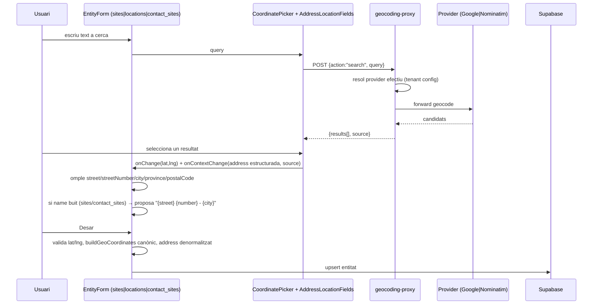
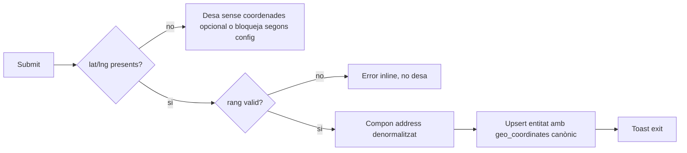
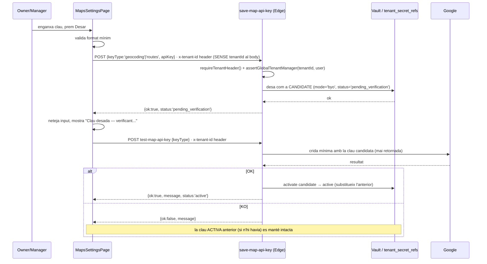
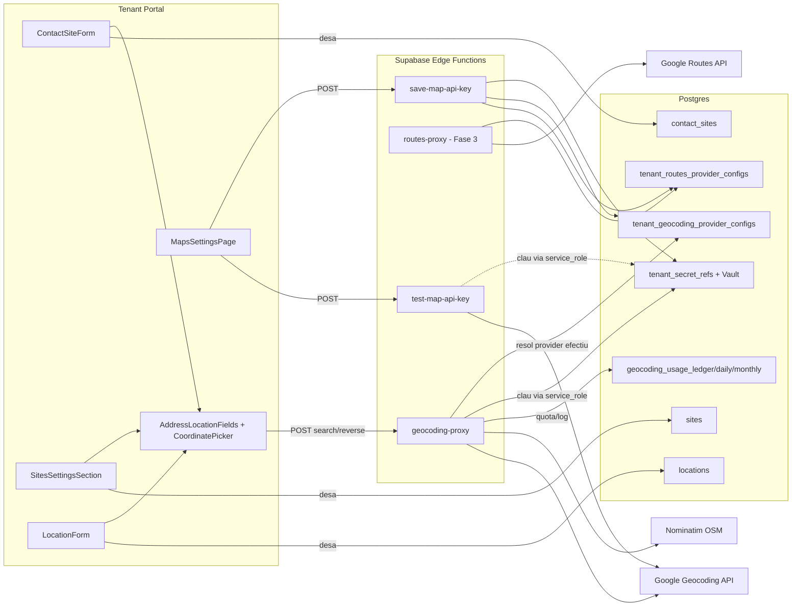

# Geolocalització compartida (sites / locations / contact_sites / futures) + Google Maps BYOK — pla d'implementació

> **Estat:** Implementat MVP (Fases 0–2) + **Fase 3 (Routes + distàncies)** + **Fase 4 (cache + ús)** + **S10 (límit global Nominatim + admin ops/alertes)**. Pendent: Fase 1.5 (trial plataforma).
> **Abast:** (A) **plataforma compartida** de captura d'adreça+coordenades (mapa + geocoding + camps estructurats + `geo_coordinates` canònic), adoptada a **totes** les entitats actuals i futures que guarden geolocalització; (B) secció de Settings per claus Google BYOK (Geocoding i Routes, separades).
> **Entitats en abast (A):** `data.contact_sites` (adreces de client/obra), `data.sites` (seus del tenant), `data.locations` (ubicacions internes / geofencing), i **qualsevol entitat futura** amb lat/lng o adreça al mapa — ha de reutilitzar la mateixa capa, no reinventar formularis ni el shape JSON.
> **Descobriment clau:** ja existeix ~70% de la infraestructura de control plane de geocoding (quotes, BYOK amb Vault, Edge Function proxy) i un component de mapa (`CoordinatePicker`, Leaflet/OSM) usat avui a Sites i Locations. Aquest pla **unifica** aquesta base, afegeix Google com a provider, i estandarditza el model d'adreça+coords a totes les entitats geo.
> **Revisió de seguretat (2026-07-27):** aplicada. Vegeu §0.1 per al resum de correccions. **Abast transversal (2026-07-27):** vegeu §0.2.
> **Bug client conegut (arreglat 2026-07-27):** `getActiveTenantId()` a `nominatim.ts` llegia `Headers` com a `Record` → reverse geocode fallava sense arribar al proxy; cal `.get('x-tenant-id')`.

---

## 0.1 Correccions de seguretat aplicades (bloquejants abans d'implementar)

Aquesta secció substitueix qualsevol lectura anterior del pla que no les incorpori. Totes són **obligatòries abans de Fase 1** (Google en producció), no "nice to have":

| # | Problema trobat a la revisió | Correcció incorporada al pla |
|---|-------------------------------|-------------------------------|
| S1 | **IDOR entre tenants**: el contracte de `save-map-api-key`/`test-map-api-key` incloïa `tenantId` al body, mentre l'autorització es faria sobre `x-tenant-id`. Un manager del tenant A podria escriure/provar la clau del tenant B. | §7.2/§7.4 reescrits: **cap `tenantId` al body**. Tenant sempre derivat de `x-tenant-id`, mirror exacte de `save-tenant-api-key/index.ts`. |
| S2 | **`provider_key` controlat pel client** a `geocoding-proxy`: qualsevol membre podia forçar `provider_key:"google"` i disparar consum/cost BYO d'un altre mode, o partir el rate-limit entre `nominatim`+`google`. | §5.5/§7.1: el servidor resol el provider (`resolveEffectiveProvider`), el body **no** l'accepta ja com a paràmetre de facturació; es descarta explícitament com a *hint* de debug (massa arriscat mantenir-lo, veure §5.5). |
| S3 | **Quota reservada abans de validar** que el provider és usable: `check_and_reserve_geocoding` incrementa comptadors i després `geocoding-proxy` pot retornar `provider_not_supported`, cremant quota `google` sense fer-hi res. | §5.2/§10 Fase 0: seed de `google` amb `is_active=false` fins Fase 1; §5.5 defineix ordre correcte (resoldre provider abans de reservar). |
| S4 | **`geocoding-proxy` obert a `viewer`**: cap check de rol, només membership. Un viewer pot esgotar quota Nominatim/Google del tenant. | §8: `geocoding-proxy` exigeix rol `owner`/`manager`/`member` (alineat amb qui pot escriure `contact_sites`), no només membership. |
| S5 | **RBAC amb rol de site vs. rol global**: `assertAiManagerAccess`-style helpers no filtren `site_id IS NULL`; un rol de site podria confondre's amb rol global. | §8: nou helper `assertGlobalTenantManager` que filtra explícitament `site_id IS NULL`. |
| S6 | **Restricció de clau Google per IP no és viable**: Supabase Edge Functions no ofereixen egress IP estàtica (confirmat a la documentació oficial de Supabase). El pla original ho recomanava com si fos trivial. | §8/§9: restricció per IP marcada com **no aplicable** sense un gateway d'egress dedicat (fora d'abast del MVP); restricció obligatòria és **per API**, no per IP. |
| S7 | **Cache global de resultats Google (Fase 4) xoca amb la política de Google**: Google restringeix el caching/storage de contingut geocodificat; només `place_id` és explícitament exempt. | §9/§10 Fase 4 reescrits: cap cache genèrica de contingut Google; només cache de `place_id` i de resultats **Nominatim** (que sí permet/recomana cache). |
| S8 | **Rotació de clau insegura**: desar una clau nova i no verificada substituïa immediatament l'anterior — un typo pot deixar el tenant sense geocoding BYO fins detectar-ho. | §7.2/§10 Fase 0: flux `candidate → verify → activate` explícit. |
| S9 | **Cap sostre global** per a un futur tier de prova amb clau de plataforma pròpia: el control plane només limita per tenant; crear tenants nous multiplicaria el cupó. Sense UI d’ops, el trial és inoperable en producció. | Nova §9.1: entitlement (whitelist/pla/caducitat) + quota multinivell + kill switch + **control des d’admin-portal**. |
| S10 | **Nominatim públic sobreexplotat**: el rate-limit de 30/min per tenant no protegeix el límit global d'1 req/s de la política pública de Nominatim; amb múltiples tenants la plataforma sencera pot incomplir la política i ser bloquejada. | **Mitigat:** `api.reserve_nominatim_global` (1/s + N/min), kill switch a `system_settings.geocoding`, hard block, panell admin `/dashboard/settings/geocoding` + alertes. Nominatim públic **no té compte**; volum = Google BYO. |

---

## 0.2 Abast transversal — una sola plataforma de geolocalització (decisió de producte)

**Regla no negociable:** qualsevol pantalla o API que doni d'alta / editi una ubicació al mapa **ha de** passar per la capa compartida (§5.0 / §6). Prohibit copiar `CoordinatePicker` + parsers ad hoc per entitat, o inventar un altre shape de `geo_coordinates`.

### Matriu d'entitats

| Entitat | Rol de negoci | Estat avui | Objectiu amb aquest pla |
|---------|---------------|------------|-------------------------|
| `data.contact_sites` | Adreces de client / obra (instal·lacions) | `address`, `city`, `postal_code`, `country_code` — **sense** lat/lng ni província | Camps estructurats (`street`, `street_number`, `province`, …) + `geo_coordinates` canònic + mateix formulari assistit |
| `data.sites` | Seus / locals del tenant | `address` text; lat/lng **dins** `metadata.geo_coordinates` (patró fràgil) | Promoure a columna `geo_coordinates` canònica + camps estructurats; deixar de guardar GPS a `metadata` |
| `data.locations` | Ubicacions internes (geofencing / assistència) | `geo_coordinates jsonb` (lat/lng + adreça lliure dins JSON) | Mateix shape canònic (camps estructurats dins `geo_coordinates` o columnes mirall si cal cerca); UI unificada via capa compartida |
| Entitats **futures** (assets amb posició, projectes amb obra, estacions, etc.) | Qualsevol cosa amb mapa | — | Obligatori: `GeoCoordinates` + `AddressLocationFields` / `CoordinatePicker` compartits; documentat com a contracte a `.cursor/rules` o ADR curt |

### Què és "compartit" vs què és específic d'entitat

| Compartit (una sola implementació) | Específic d'entitat |
|------------------------------------|---------------------|
| `CoordinatePicker` + i18n `maps.*` | Nom del registre, validacions de negoci (p. ex. site obligatori, parent location) |
| Shape canònic `GeoCoordinates` + `parseGeoCoordinates` / `buildGeoCoordinates` | Persistència a la taula (`contact_sites` vs `sites` vs `locations`) |
| Camps d'adreça estructurats (`street`, `street_number`, `city`, `province`, `postal_code`, `country_code`) | Si es guarden com a columnes SQL o només dins JSON (veure D5 / §5.0) |
| Client geocoding (`useGeocoding` → proxy, sense `provider_key` client) | RLS / permisos d'escriptura de cada taula |
| Settings BYOK Maps | — |

**Conseqüència:** aquest pla **no** crea una entitat nova de "instal·lació". Instal·lació de client = `contact_sites`. Seu = `sites`. Ubicació interna = `locations`. El valor nou és la **plataforma comuna**, no un model de domini unificat.

---

## 0. Inventari del que ja existeix (no reinventar)

| Peça | On | Estat |
|------|----|-------|
| Control plane de geocoding (catàleg providers, quotes/rate-limit per tenant/pla, ledger d'ús, agregats diaris/mensuals) | `supabase/migrations/20260511000008_geocoding_control_plane.sql` | ✅ Genèric per `provider_key`. Sembrat només amb `nominatim`. |
| BYOK de geocoding amb Vault (`api.upsert_tenant_geocoding_api_key`, `api.get_geocoding_api_key_service`, ambdues `service_role`-only) | `supabase/migrations/20260725000004_geocoding_secret_vault.sql` | ✅ Genèric per `provider_key`. Funciona ja per qualsevol provider (inclòs `google`) sense canvi d'schema. |
| Secrets xifrats a Vault, metadades a `data.tenant_secret_refs` (`secret_type` inclou ja `geocoding_api_key`) | `supabase/migrations/20260725000001_secret_management_core.sql` + `.cursor/rules/secrets-and-encryption.mdc` | ✅ Falta afegir `routes_api_key` al `CHECK`. |
| Edge Function `geocoding-proxy` (auth, membership, quota, log d'ús, avui només `nominatim`) | `supabase/functions/geocoding-proxy/index.ts` | 🟡 Cal afegir branch Google + corregir resolució de provider i rol d'accés (veure §5.5, §8, S2–S4). |
| Component de mapa amb cerca, clic, coords manuals, "la meva ubicació", reverse debounced, validació -90/90/-180/180, zoom 16 | `apps/tenant-portal/src/components/maps/CoordinatePicker.tsx` | 🟡 Ja usat a Sites i Locations; cal camps estructurats a `onContextChange`, i18n `maps.*` genèric, i fix de lectura de tenant (ja aplicat a `nominatim.ts`). |
| Patró `geo_coordinates jsonb` (parcial) | `data.locations.geo_coordinates`; `data.sites.metadata.geo_coordinates` (ad hoc) | 🟡 Cal **canònic únic** (§5.0) i treure GPS de `sites.metadata`. |
| Settings hub (`/settings/*`), pàgina de secrets (`SecretsPage.tsx`, gated `owner`/`manager`), `secretSettingsLink()` | `apps/tenant-portal/src/pages/SettingsPage.tsx`, `.../features/secrets/api/secretsService.ts` | 🟡 `secretSettingsLink('geocoding_api_key')` ja retorna `null` — és el forat a tapar. |
| Adreces de client (`contact_sites`): `name, address, city, postal_code, country_code` — **sense coordenades ni província** | `supabase/migrations/20260503000005_contacts_core.sql`, `apps/tenant-portal/src/features/contacts/**` | 🟡 Primera adopció completa del model estructurat + geo. |
| Seus del tenant (`sites`): `name, address` + GPS a `metadata` | `SitesSettingsSection.tsx`, `data.sites` | 🟡 Ja té `CoordinatePicker`; falta alinear schema i camps estructurats. |
| Ubicacions internes (`locations`): `geo_coordinates` + formulari amb mapa | `LocationForm.tsx`, `LocationsPage.tsx` | 🟡 Ja té `CoordinatePicker` + parsers locals; cal migrar a lib compartida i shape canònic. |
| Rols multi-tenant | `data.tenant_members.role`/`global_role`, jerarquia `owner > manager > member > viewer` | ✅ Reutilitzar tal qual. |

**Conseqüència de disseny:** cap entitat nova de domini. El lliurable central és la **capa compartida** (§5.0); `contact_sites`, `sites` i `locations` són **consumidors** obligatoris a l'MVP; qualsevol feature futura amb mapa és consumidora del mateix contracte.

---

## 1. Resum executiu

**Valor de negoci:** avui la geolocalització està fragmentada (GPS a `metadata` als sites, shape informal a locations, zero coords a contact_sites). Sense un model únic no hi ha distàncies fiables, ni dispatch per proximitat a `field-service`, ni una UX coherent. Amb aquest pla: (1) una sola manera de capturar i guardar adreça+coords; (2) totes les entitats geo actuals l'adopten; (3) el tenant pot pagar Google BYOK sense que la plataforma assumeixi el cost per defecte.

**MVP (Fase 0–2):** capa compartida + adopció a `contact_sites`, `sites` i `locations`; geocoding amb fallback Nominatim; Settings per desar/provar clau Google Geocoding.

**Post-MVP:** Fase 1.5 trial plataforma (admin-portal); adopció DistanceBadge a field-service quan hi hagi coords a llistes.

---

## 2. Decisions obertes — amb recomanació (respon abans de Fase 0)

| # | Decisió | Recomanació |
|---|---------|--------------|
| D1 | Mapa visual (Maps JS) vs basemap no contractat | **Maps visual només amb Google Maps JavaScript API** (Maps JS BYOK del tenant o entitlement temporal de plataforma). Sense key/entitlement → UI "mapa no disponible" (coords/adreces segueixen funcionant). Google/Geocoding/Routes continuen per backend. **Futur / implementació:** veure [FUTURE-google-maps-js.md](./FUTURE-google-maps-js.md). |
| D2 | Una clau Google única vs dues (Geocoding / Routes) | **Dues**, tal com demana l'spec: `secret_type='geocoding_api_key', provider='google'` i `secret_type='routes_api_key', provider='google'`. Google les factura per producte igualment. |
| D3 | Cache de geocoding global vs per tenant | **Global per (provider, adreça normalitzada)** amb TTL llarg (30 dies) a Fase 4; és adreces físiques, no dades sensibles del tenant. Reduce cost i llatència per a tots. **Limitació legal Google:** només cache de `place_id` + Nominatim (S7). |
| D4 | Reverse geocode automàtic a cada clic vs botó explícit | **Automàtic amb debounce** (ja implementat a `CoordinatePicker`, 450ms) — UX ja validada; mantenir a totes les entitats. |
| D5 | On viuen els camps estructurats d'adreça | **Híbrid canònic:** (1) shape JSON únic dins `geo_coordinates` **sempre** (font de veritat del geocode); (2) columnes SQL `street`/`street_number`/`city`/`province`/`postal_code` on l'entitat ja té o necessita cerca/filtres (`contact_sites`, `sites`); (3) a `locations`, MVP = camps dins JSON (sense columnes noves) tret que producte demani cerca per CP — aleshores s'afegeixen. `address` denormalitzat es recalcula on ja existeix com a columna. |
| D6 | Qui resol el provider (client o servidor) | **Servidor**, sempre, i **sense acceptar `provider_key` del client**. Veure §5.5. |
| D7 | Qui pot cridar `geocoding-proxy` | **`owner`/`manager`/`member`**, **no** `viewer` — alineat amb qui pot editar sites/locations/contact_sites. |
| D8 | Tier de prova amb clau de plataforma pròpia | **Sí:** entitlement (whitelist / pla / X dies des de l’alta) + quota multinivell + kill switch, **gestionat des d’admin-portal**. Veure §9.1. |
| D9 | Ordre d'adopció de les 3 entitats | **Mateixa iteració MVP**, amb ordre tècnic: (1) capa compartida, (2) `sites` + `locations` (ja tenen mapa — migració de UX/schema), (3) `contact_sites` (schema nou + formulari). Evitar deixar una entitat amb el patró vell. |

---

## 3. User stories i criteris d'acceptació

### 3.1 Captura d'ubicació compartida (totes les entitats geo)

Aplica a **contact_sites**, **sites**, **locations** i qualsevol formulari futur que usi la capa compartida.

- **US-A1** — Com a usuari, quan creo/edito una ubicació, puc cercar per text i seleccionar un resultat que omple carrer/número/ciutat/província/CP + `lat/lng`.
  - AC: es mostren fins a 5 suggeriments; error clar si 0 resultats o error de xarxa.
  - AC (contact_sites / sites): si el nom és buit, es proposa `"{carrer} {número} - {ciutat}"`.
- **US-A2** — Com a usuari, puc fer clic al mapa per posicionar/ajustar el marcador.
  - AC: zoom mínim 16; reverse geocode omple els camps d'adreça **sense** tocar `lat/lng`.
- **US-A3** — Com a usuari, puc editar `lat`/`lng` a mà (o enganxar-los).
  - AC: validació `lat ∈ [-90,90]`, `lng ∈ [-180,180]`; mapa recentrat; error visible si invàlid.
- **US-A4** — Com a usuari, puc prémer "La meva ubicació" (`navigator.geolocation` + reverse).
  - AC: gestiona denegació / sense suport amb missatge clar.
- **US-A5** — Com a usuari, en desar veig quina font ha donat el resultat (`google`/`nominatim`/`manual`/`device`) si n'hi ha.
- **US-A6** — Com a usuari sense clau Google, el formulari **segueix funcionant** (fallback Nominatim).
- **US-A7** — Com a desenvolupador, qualsevol entitat nova amb mapa **reutilitza** `AddressLocationFields` + `geo_coordinates` canònic; no hi ha un segon `CoordinatePicker` forkat ni un altre JSON shape.
- **US-A8** — Com a usuari a **Settings → Sites**, edito la seu amb el mateix mapa/camps estructurats; les coords ja no viuen només a `metadata`.
- **US-A9** — Com a usuari a **Ubicacions**, edito una location amb el mateix component; el JSON desat compleix el shape canònic (§5.0).
- **US-A10** — Com a usuari a **Contactes → adreces**, creo/edito `contact_sites` amb el mateix flux i persisteixo columnes + `geo_coordinates`.

### 3.2 Settings — claus Google Maps

- **US-B1** — Com a `owner`/`manager`, a `/settings/maps` veig dues targetes independents (Geocoding, Routes) amb estat "configurada (actualitzada el DD/MM)" o "sense clau (s'usa fallback/límits del pla)".
- **US-B2** — Com a `owner`/`manager`, puc enganxar una clau nova (`type=password`) i desar-la com a **candidata**; el sistema no la substitueix per l'activa fins que "Provar clau" confirmi que funciona (flux `candidate → verify → activate`, §7.2).
  - AC: la clau mai es retorna al frontend, ni en el moment de desar-la ni després; el camp de text es buida després de desar.
  - AC: format mínim validat (p. ex. `^[A-Za-z0-9\-_]{20,}$` per a claus Google) abans d'enviar-la al backend.
  - AC: la clau activa anterior (si n'hi havia) es conserva funcionant fins que la candidata es verifica amb èxit — mai hi ha una finestra sense clau operativa per un typo.
  - AC: **no existeix cap acció "veure clau"** al producte. El secret és write-only per disseny (§8).
- **US-B3** — Com a `owner`/`manager`, puc prémer "Provar clau" i veure OK/KO sense que això consumeixi quota real significativa (crida mínima, p. ex. geocodificar `"Barcelona"`).
- **US-B4** — Com a `member`/`viewer`, no veig el formulari d'edició de clau (només, com molt, l'estat "configurada"/"no configurada" si el disseny de producte ho vol; per defecte: secció no visible fora de `owner`/`manager`, i el rol es comprova com a rol **global** del tenant, `site_id IS NULL` — no un rol de site).
- **US-B5** — Com a usuari sense clau Routes, les funcionalitats de distància per carretera es degraden a distància en línia recta (haversine) amb indicador visual que és una aproximació.
- **US-B6** — Com a plataforma, si oferim un tier de prova amb clau pròpia de Google (sense que el tenant aporti BYOK), els usuaris **no** poden esgotar-la fent moltes crides o creant tenants nous: hi ha un límit per usuari, un límit per tenant i un límit global de plataforma, i un interruptor manual per tallar-la sencera. L’ops activa/desactiva tenants, plans, caducitats i límits des d’**admin-portal**. Veure §9.1.

---

## 4. Fluxos UX

### 4.1 Cerca d'adreça → desa



### 4.2 Clic al mapa

1. Usuari clica el mapa dins `CoordinatePicker`.
2. `ClickToPick` (ja existent) emet `{lat,lng}` amb `source:'map_click'`.
3. Es dispara reverse geocode (debounce 450ms) → omple camps d'adreça, **no** toca `lat/lng`.
4. Si el reverse falla (xarxa/quota), es manté el punt seleccionat i es mostra error no bloquejant.

### 4.3 Edició manual de coordenades

1. Usuari escriu/enganxa a `lat`/`lng`.
2. Validació de rang; si vàlid, `applyPoint` recentra el mapa (zoom 16) i mou el marcador.
3. Reverse geocode s'activa igual que al clic.

### 4.4 "La meva ubicació"

1. Usuari prem el botó → `navigator.geolocation.getCurrentPosition`.
2. Èxit → mateix flux que 4.3 amb `source:'geolocation'`.
3. Error/denegat → missatge d'error, cap canvi d'estat.

### 4.5 Desar (validació final)



### 4.6 Settings — desar clau BYOK



---

## 5. Model de dades

### 5.0 Contracte canònic compartit (`GeoCoordinates`) — obligatori

Shape únic a TypeScript (`apps/tenant-portal/src/lib/geo/geoCoordinates.ts`) i documentat a SQL. Totes les entitats escriuen i llegeixen **aquest** format (parsers compartits; zero parsers locals a `LocationForm` / `SitesSettingsSection`):

```ts
type GeoCoordinates = {
  lat: number
  lng: number
  street?: string | null
  street_number?: string | null
  city?: string | null
  province?: string | null
  postal_code?: string | null
  country_code?: string | null
  address?: string | null
  geocoding?: {
    provider: 'google' | 'nominatim' | 'manual' | 'device'
    source: 'search' | 'reverse' | 'map_click' | 'manual_input' | 'geolocation'
    providerData?: Record<string, unknown> // p. ex. place_id
  }
}
```

**API compartida UI:**
- `CoordinatePicker` — mapa + cerca + reverse + geo device (emet point + context estructurat).
- `AddressLocationFields` — inputs street/number/city/province/CP/country.
- Helpers: `parseGeoCoordinates`, `buildGeoCoordinates`, `formatAddressLine`, `googleMapsUrlFromGeo`.

**Regla per entitats futures:** columna `geo_coordinates jsonb` (o reutilitzar-ne una d'existent), UI via aquests components, **mai** GPS a `metadata` genèric. Afegir regla curta a `.cursor/rules` o ADR quan s'implementi Fase 1.

### 5.1 `contact_sites` — nous camps (migració `_contact_site_coordinates`)

```sql
ALTER TABLE data.contact_sites
  ADD COLUMN IF NOT EXISTS street         text,
  ADD COLUMN IF NOT EXISTS street_number  text,
  ADD COLUMN IF NOT EXISTS province       text,
  ADD COLUMN IF NOT EXISTS geo_coordinates jsonb; -- GeoCoordinates canònic (§5.0)
```

- `address` (existent) es manté com a **cadena denormalitzada**, recalculada a cada `INSERT/UPDATE` (recomanat: trigger SQL).
- Índex GIN opcional només si hi ha cerques per proximitat (Fase 3+).
- **No PostGIS**; haversine sobre lat/lng és suficient.

### 5.1b `sites` — alinear amb el contracte (migració `_site_coordinates`)

```sql
ALTER TABLE data.sites
  ADD COLUMN IF NOT EXISTS street         text,
  ADD COLUMN IF NOT EXISTS street_number  text,
  ADD COLUMN IF NOT EXISTS city           text,
  ADD COLUMN IF NOT EXISTS province       text,
  ADD COLUMN IF NOT EXISTS postal_code    text,
  ADD COLUMN IF NOT EXISTS country_code   text,
  ADD COLUMN IF NOT EXISTS geo_coordinates jsonb;
```

- **Migració de dades:** copiar `metadata->'geo_coordinates'` (i variants lat/lng ad hoc de `SitesSettingsSection`) → columna `geo_coordinates`; el formulari nou **deixa d'escriure** GPS a `metadata`.
- `address` denormalitzat: mateix patró que `contact_sites`.
- Actualitzar `SitesSettingsSection.tsx` → `AddressLocationFields` + parsers compartits.

### 5.1c `locations` — alinear shape (sense columnes noves a MVP, D5)

- Cap `ALTER` obligatori a MVP: `geo_coordinates` ja existeix.
- Reescriure `LocationForm.tsx` / helpers de `LocationsPage.tsx` amb `parseGeoCoordinates` / `buildGeoCoordinates` i shape §5.0 (street/city/… dins JSON).
- Opcional post-MVP: columnes SQL mirall si cal filtrar per CP/ciutat.

### 5.2 Google com a nou provider de Geocoding (sense canvi d'schema, només dades)

```sql
INSERT INTO data.geocoding_providers (
  provider_key, name, is_active,
  default_included_total_requests_month,
  default_rate_limit_per_minute, default_rate_limit_per_day,
  default_enforce_hard_cap, default_allow_overage, default_billable,
  default_overage_price_per_1000, default_currency, metadata
) VALUES (
  'google', 'Google Geocoding API', false, -- ⚠️ is_active=false a Fase 0: s'activa a Fase 1 quan el proxy ja el suporta (S3)
  0,              -- 0 = sense allotment de plataforma: només BYO habilita l'ús (fora del tier de prova, §9.1)
  60, 2000,
  true, false, true,
  5.0, 'EUR',
  jsonb_build_object('kind','geocoding','requires_byo', true)
) ON CONFLICT (provider_key) DO UPDATE SET ...;
```

- `tenant_geocoding_provider_configs` **ja és genèric**: `api.upsert_tenant_geocoding_api_key(tenant_id, 'google', apiKey)` crea/actualitza la fila amb `mode='byo'`. Cap canvi d'schema necessari aquí.
- Regla de negoci: si `default_included_total_requests_month = 0` i `mode <> 'byo'`, Google queda efectivament inhabilitat per al tenant → la resolució de cascada (§5.5) ha de saltar-lo i caure a `nominatim`.
- **Per què `is_active=false` inicialment (S3):** `check_and_reserve_geocoding` incrementa el comptador d'ús *abans* que `geocoding-proxy` sàpiga si sap parlar amb aquest provider. Si es sembra `google` com a actiu abans que la branca `googleSearch`/`googleReverse` existeixi, qualsevol intent (fins i tot accidental, p. ex. un test E2E o un `provider_key` de debug) crema quota real sense donar cap resultat. Activar-lo (`UPDATE ... SET is_active=true`) és l'últim pas de Fase 1, no el primer.

### 5.3 Routes — nova capa mínima (Fase 3, no MVP)

```sql
CREATE TABLE data.tenant_routes_provider_configs (
  tenant_id           uuid NOT NULL REFERENCES data.tenants(id) ON DELETE CASCADE,
  provider_key        text NOT NULL DEFAULT 'google' REFERENCES ... (o CHECK IN ('google')),
  mode                text NOT NULL DEFAULT 'byo' CHECK (mode IN ('byo')), -- no hi ha "platform" per Routes (massa car per subvencionar)
  is_enabled          boolean NOT NULL DEFAULT true,
  api_key_secret_id   uuid,
  last_used_at        timestamptz,
  created_at          timestamptz NOT NULL DEFAULT now(),
  updated_at          timestamptz NOT NULL DEFAULT now(),
  PRIMARY KEY (tenant_id, provider_key)
);
```

- Sense clau Routes: **no hi ha mode `platform`** — el producte no subvenciona Routes (és car); es degrada a haversine sempre.
- `secret_type` nou a `data.tenant_secret_refs`: afegir `'routes_api_key'` al `CHECK` (migració petita, mateix patró que `20261128000001_employee_private_field_encryption.sql` va fer per `tenant_field_dek`).
- Usage ledger simplificat (opcional Fase 4): `data.routes_usage_ledger(tenant_id, request_status, distance_m, duration_s, billing_source, created_at)` — no cal tota la maquinària de finestres/rate-limit de geocoding perquè Routes s'invoca molt menys sovint (agenda de dispatch, no cada tecla).

### 5.4 Què es xifra vs. què és flag públic

| Dada | On viu | Exposició al client |
|------|--------|----------------------|
| Clau Google Geocoding/Routes en clar | Supabase Vault (`vault.secrets`), referenciada per `tenant_geocoding_provider_configs.api_key_secret_id` / `tenant_routes_provider_configs.api_key_secret_id` | **Mai**. Només `service_role` via `api.get_geocoding_api_key_service` / equivalent Routes. |
| Metadades del secret (`secret_type`, `provider`, `updated_at`, `rotation_status`) | `data.tenant_secret_refs` | Sí, via `api.list_tenant_secrets` (RPC ja existent) — la UI de Settings el reutilitza filtrant per `secret_type IN ('geocoding_api_key','routes_api_key') AND provider='google'`. |
| `lat/lng`, adreça, `geo_coordinates` | `contact_sites` / `sites` / `locations` | Sí, dades de negoci normals (RLS per tenant). |
| Resultat de "provar clau" | Ephemeral, retornat per Edge Function | Sí (`{ok, message}`), mai la clau. |

### 5.5 Resolució del provider efectiu — sempre al servidor (D6, S2)

Avui `geocoding-proxy` llegeix `provider_key` directament del body (`apps/tenant-portal/src/lib/maps/nominatim.ts` envia `provider_key: 'nominatim'` explícitament). Això és un vector d'abús: un client pot enviar `provider_key: 'google'` encara que el tenant no tingui BYO configurat, forçant el servidor a intentar-ho i, si hi ha ambigüitat en el codi de reserva, consumir quota del mode equivocat o del tenant equivocat si `tenant_id` també es confia del body en lloc del header.

**Regla de disseny (bloquejant):**

```ts
// geocoding-proxy — pseudocodi correcte
const tenantId = requireTenantHeader(req);           // mai del body
await assertGlobalTenantManagerOrMember(tenantId, user); // D7/S4, rol global (site_id IS NULL)

const providerKey = await resolveEffectiveProvider(tenantId); // ÚNICA font de veritat
// body.provider_key s'ignora completament — no es llegeix, no es passa a cap funció posterior

if (!isProviderImplemented(providerKey)) {
  return errorResponse('provider_not_supported'); // ABANS de reservar quota (S3)
}

const reservation = await checkAndReserveGeocoding(tenantId, providerKey);
...
```

`resolveEffectiveProvider` consulta `tenant_geocoding_provider_configs` ordenat per prioritat/mode (BYO actiu amb clau vàlida > platform habilitat > `nominatim` com a últim fallback sempre disponible). El body pot seguir acceptant `action`/`query`/`lat`/`lng`, però **mai** `provider_key` ni `tenant_id` com a paràmetres amb efecte real — es descarta explícitament la idea de mantenir-lo com "hint de debug" perquè cap camp opcional hauria de poder influir en facturació/quota, ni per error ni per un client desactualitzat.

---

## 6. Arquitectura



**Regles no negociables:**
1. Cap crida a Google des del navegador amb la clau del tenant. Tot geocoding/routes passa per Edge Functions amb `service_role` per llegir el secret.
2. Cap entitat nova (ni futura) inventa el seu propi picker/parser/shape: tot passa per la capa compartida (§5.0 / §0.2).

---

## 7. API contract

### 7.1 `geocoding-proxy` (ja existent, estendre)

`POST /functions/v1/geocoding-proxy`
Headers: `Authorization: Bearer <jwt>`, `x-tenant-id: <uuid>`

```jsonc
// Request (search)
{ "action": "search", "query": "Carrer Major 12, Girona", "language": "ca", "limit": 5, "site_id": "..." }

// Request (reverse)
{ "action": "reverse", "lat": 41.98, "lng": 2.82, "language": "ca" }
```

```jsonc
// Response (search) — 200
{
  "provider_key": "google",           // resolt pel servidor, no pel client (D6)
  "action": "search",
  "results": [
    {
      "lat": 41.9793, "lng": 2.8199,
      "display_name": "Carrer Major 12, 17004 Girona",
      "street": "Carrer Major", "street_number": "12",
      "city": "Girona", "province": "Girona", "postal_code": "17004",
      "provider_data": { "provider": "google", "place_id": "..." }
    }
  ]
}
```

```jsonc
// Response (reverse) — 200
{
  "provider_key": "nominatim",
  "action": "reverse",
  "result": {
    "lat": 41.98, "lng": 2.82,
    "street": "...", "street_number": "...", "city": "...", "province": "...", "postal_code": "...",
    "display_name": "...",
    "provider_data": { ... }
  }
}
```

```jsonc
// Error — 4xx/5xx
{ "error": { "code": "geocoding_blocked" | "provider_unreachable" | "invalid_coordinates" | ..., "message": "..." } }
```

**Canvi de contracte respecte l'actual (S2, bloquejant):** el body **no ha d'incloure `provider_key`**; el servidor el resol sempre (§5.5). No es manté com a hint ni com a paràmetre opcional — s'elimina de la superfície d'entrada per no deixar cap camí en què influeixi en facturació/quota.

**Canvi d'accés (S4/D7):** requereix rol global `owner`/`manager`/`member` (no `viewer`) al tenant del header `x-tenant-id`.

### 7.2 `saveMapApiKey` (Edge Function nova: `save-map-api-key`)

**Sense `tenantId` al body (S1, bloquejant):** el tenant es deriva únicament de `x-tenant-id`, mirroring exacte de `save-tenant-api-key/index.ts` (`requireTenantHeader` + `assertGlobalTenantManager`, mai un `tenantId` de body).

```jsonc
// Request
// Headers: Authorization: Bearer <jwt>, x-tenant-id: <uuid>
{ "keyType": "geocoding" | "routes", "apiKey": "AIza..." }

// Response 200 — la clau queda com a CANDIDATA, no activa encara (S8)
{ "ok": true, "status": "pending_verification" }

// Errors: 400 invalid_key_format, 403 forbidden (no owner/manager global, site_id IS NULL), 401 unauthorized
```

Internament: desa el secret via `api.upsert_tenant_geocoding_api_key` (existent) o una nova `api.upsert_tenant_routes_api_key` (mateix patró, Fase 3), marcant l'estat com `pending_verification` sense tocar encara la referència "activa" que `geocoding-proxy`/`routes-proxy` fan servir. Només `test-map-api-key` (§7.4), en cas d'èxit, promociona la candidata a activa. Si l'usuari no prova mai la clau, la candidata caduca (TTL, p. ex. 24h) i cal tornar a desar-la — evita candidates orfes acumulant-se al Vault indefinidament.

### 7.3 `getMapApiKeyStatus` — **no cal endpoint nou**

Reutilitzar `api.list_tenant_secrets(tenantId)` (ja existent, `apps/tenant-portal/src/features/secrets/api/secretsService.ts::listTenantSecrets`, que ja deriva `tenantId` de forma segura al backend) filtrant al frontend per `secret_type IN ('geocoding_api_key','routes_api_key') AND provider='google'`. Dona exactament `hasGeocodingKey`, `updated_at`, `rotation_status` (`active`/`pending_verification`/`failed`) sense exposar mai el secret. **No hi ha ni hi haurà cap RPC ni endpoint que retorni el valor de la clau al client** (US-B2).

### 7.4 `testMapApiKey` (Edge Function nova: `test-map-api-key`)

**Sense `tenantId` al body (S1)**, mateix patró que §7.2.

```jsonc
// Request
// Headers: Authorization: Bearer <jwt>, x-tenant-id: <uuid>
{ "keyType": "geocoding" | "routes" }

// Response 200 (OK) — promociona la candidata a activa
{ "ok": true, "message": "Clau vàlida", "latencyMs": 320, "status": "active" }

// Response 200 (KO, no error HTTP perquè és un resultat de negoci esperat) — la candidata NO es promociona,
// l'anterior clau activa (si n'hi havia) segueix intacta (S8)
{ "ok": false, "message": "REQUEST_DENIED: clau restringida a un altre domini/API", "status": "failed" }
```

Crida mínima real (`geocode("Barcelona, Spain")` o `Address Validation` d'1 unitat) amb el `service_role` → clau **candidata** del tenant (mai l'activa, per no gastar-ne quota en cada test si ja funcionava). Es registra a `tenant_operation_logs` (mai la clau, mai cap fragment d'ella) igual que fa `geocoding-proxy` amb `createOperationLogService`.

---

## 8. Seguretat i compliment

- Xifrat: **Vault** (ja usat, no AES manual nou) — coherent amb `.cursor/rules/secrets-and-encryption.mdc`. No crear cap taula `api_key text` nova.
- `secret_type` a afegir al `CHECK` de `tenant_secret_refs`: `'routes_api_key'` (migració petita).
- Lectura de secret **només** des d'Edge Function amb `service_role` (`api.get_geocoding_api_key_service`, equivalent Routes nou). Mai cap RPC `SECURITY DEFINER` accessible a `authenticated` que retorni el valor. **Cap acció "veure clau" al producte** (US-B2): és write-only per disseny, no només per UI — la RPC de lectura no s'exposa mai a `authenticated`.
- **Tenant sempre derivat del header, mai del body (S1, bloquejant).** `save-map-api-key`, `test-map-api-key` i `geocoding-proxy` usen `requireTenantHeader(req)` per obtenir `tenantId` de `x-tenant-id`; **cap d'aquests endpoints accepta `tenantId` al JSON body**. Aquest és exactament el patró ja correcte de `save-tenant-api-key/index.ts` — cal copiar-lo, no reinventar-lo ni relaxar-lo "per comoditat" al nou endpoint.
- **RBAC amb rol global, no de site (S5).** Nou helper `assertGlobalTenantManager(tenantId, userId)` que consulta `tenant_members` en viu (mai claims JWT obsolets, mateix motiu que `assertAiManagerAccess`) filtrant explícitament `site_id IS NULL AND role IN ('owner','manager')`. Sense el filtre `site_id IS NULL`, un rol de site (p. ex. un manager d'una sola seu) podria ser mal interpretat com a manager global. `geocoding-proxy` usa una variant que també accepta `member` (D7/S4) però mai `viewer`.
- **`geocoding-proxy` no és públic a tot membre (S4).** Actualment només comprova membership; cal upgrade a comprovar rol (`owner`/`manager`/`member`), perquè el cost/quota que consumeix és equivalent a una escriptura, no a una lectura passiva.
- **Resolució de provider mai des del client (S2).** Veure §5.5 — `provider_key` del body s'elimina de la superfície d'entrada, no es tracta com "hint".
- **Ordre de reserva de quota (S3).** `geocoding-proxy` ha de resoldre i validar que el provider és implementat/actiu *abans* de cridar `check_and_reserve_geocoding`; mai reservar quota "per si de cas" i comprovar suport després.
- **Rotació de claus sense finestra sense servei (S8).** Flux `candidate → verify → activate` (§7.2/§7.4): una clau mal enganxada mai deixa el tenant sense la clau anterior activa fins que la nova es verifica.
- Mai loguejar la clau — reutilitzar `log()`/`captureException` de `_shared/observability/*`, mai `console.log`. Aplica també a `tenant_operation_logs`: only `{ok, message, latencyMs}`, mai el valor ni cap prefix/sufix de la clau.
- Validació de format abans de desar: regex mínim (`/^[A-Za-z0-9\-_.]{20,60}$/` ajustable) + verificació real via `test-map-api-key` abans d'activar (§7.2/§7.4) — no és "opcional mostrar warning", és el mecanisme que decideix si la clau es promociona o no.
- Google Cloud Console (documentar a la UI de Settings, no al codi): activar **Geocoding API** / **Routes API**, restringir la clau **només per API** (obligatori i suficient). **Restricció per IP no és aplicable (S6):** Supabase Edge Functions no tenen egress IP estàtica; documentar-ho explícitament a la UI perquè el tenant no perdi temps intentant-ho (o, si es vol IP-restriction real, cal un gateway d'egress dedicat, fora d'abast d'aquest pla). Configurar **budget alert** a Google Cloud, sabent que és una alerta i **no un tall de servei automàtic** (veure §9).
- GDPR: `lat/lng` d'adreces de client/seu/ubicació és dada personal de baix risc (l'adreça textual ja existia); mateix tractament RLS/retenció que ja aplica a `contact_sites`, `sites` i `locations`.

---

## 9. Gestió de costos

| Cost | Quan es paga | Mitigació |
|------|---------------|-----------|
| Map visual (Maps JS) | Opcional quan el tenant habilita Maps JS BYOK / entitlement; sense key/entitlement no hi ha map loads facturables | D1 |
| Geocoding | Per petició, Google factura al tenant (BYO) o la plataforma no la subvenciona per defecte (`default_included_total_requests_month=0` per `google`) | Fallback automàtic a Nominatim (gratuït, amb rate-limit anti-abús ja implementat: 30/min, 1000/dia) |
| Routes | Per petició, **sempre BYO** (mai platform) | Haversine gratuït com a alternativa (Fase 3); Routes només si el tenant ho configura explícitament |
| Cache | — | Fase 4: **només** `place_id` de Google (exempt explícitament de les restriccions de caching de Google) i resultats **Nominatim** (política pública ho permet/recomana). **Cap cache genèrica de contingut/resultats de Google** (S7) — vegeu §10 Fase 4. |

**Quan Routes vs haversine:** haversine per a llistes/ordenació ràpida (p. ex. "instal·lacions més properes a la seu"); Routes només quan cal temps/distància *real per carretera* per a una acció puntual (assignar una visita, ETA) i el tenant té clau — mai en bucle sobre llistes grans (cost dispara).

**Budget alerts de Google Cloud no són un tall de servei (S6).** Són notificacions per correu/Pub-Sub en superar llindars, no aturen la facturació. El sostre real de despesa el dona el **rate-limit del control plane existent** (§5.2) i, per a un futur tier de plataforma, la quota multinivell de §9.1. Si es vol un tall dur real a nivell de projecte GCP, cal configurar quotes d'API a Google Cloud Console (Quotas & System Limits) per sobre del rate-limit intern com a xarxa de seguretat, mai confiar només en l'alerta de pressupost.

### 9.1 Tier de prova amb clau de plataforma — entitlement + control des d’admin-portal (S9)

Requisit de producte: oferir crides Google limitades amb **clau de la plataforma** (no BYOK del tenant), amb:
- activació **selectiva** (1 o N tenants de prova, o plans superiors),
- **caducitat** (finestra absoluta i/o X dies des de l’alta),
- límits **dia/mes/minut**,
- sostre **global** de plataforma + kill switch,
- tot **operable des de `apps/admin-portal`** (no només SQL/manual).

**Per què el control plane actual no n’hi ha prou sol:** `plan_geocoding_limits` / `tenant_geocoding_limit_overrides` limiten per tenant/pla, però:
1. no modelen “whitelist de beta” ni “trial 14 dies des de l’alta”;
2. sense sostre **global**, N tenants en `mode=platform` multipliquen el bill de la clau Google de plataforma;
3. cal UI d’ops a admin-portal (ja hi ha base a `TenantLimitsForm` + `control-plane.ts` geocoding — s’estén, no es reinventa).

#### 9.1.1 Model de dades (nou)

```sql
-- Kill switch + sostre global (1 fila)
CREATE TABLE data.platform_geocoding_trial_settings (
  id                              boolean PRIMARY KEY DEFAULT true CHECK (id),
  is_enabled                      boolean NOT NULL DEFAULT false,  -- kill switch global
  daily_budget_requests           integer NOT NULL DEFAULT 5000,
  monthly_budget_requests         integer NOT NULL DEFAULT 50000,
  alert_threshold_pct             integer NOT NULL DEFAULT 70,     -- alertes 70/90
  max_new_platform_tenants_per_user_day integer NOT NULL DEFAULT 2,
  default_trial_days_from_signup  integer,                         -- NULL = no auto-trial
  updated_at                      timestamptz NOT NULL DEFAULT now()
);

-- Entitlement per tenant (whitelist / trial / promo)
CREATE TABLE data.tenant_platform_geocoding_trials (
  tenant_id              uuid PRIMARY KEY REFERENCES data.tenants(id) ON DELETE CASCADE,
  enabled                boolean NOT NULL DEFAULT false,
  source                 text NOT NULL DEFAULT 'manual'
    CHECK (source IN ('manual', 'plan_auto', 'promo', 'signup_trial')),
  starts_at              timestamptz NOT NULL DEFAULT now(),
  ends_at                timestamptz,              -- NULL = sense caducitat (només si pla ho justifica)
  max_requests_day       integer,                  -- NULL → hereta override/pla
  max_requests_month     integer,
  rate_limit_per_minute  integer,
  notes                  text,
  created_by             uuid,                     -- admin user
  created_at             timestamptz NOT NULL DEFAULT now(),
  updated_at             timestamptz NOT NULL DEFAULT now()
);

-- Comptadors anti-abús (mínim)
-- user_id + day window; platform day/month rollups
```

Reutilitzar també l’existent:
- `data.plan_geocoding_limits` → cupons per **pla** (p. ex. Pro = 2000/mes platform Google; Free = 0).
- `data.tenant_geocoding_limit_overrides` → override fi de quotes.
- `data.tenant_geocoding_provider_configs` → `mode='platform'` + `is_enabled` quan l’entitlement és actiu.

#### 9.1.2 Qui és elegible (ordre de decisió a cada crida)

Totes les comprovacions; **la primera que falli talla** (o la quota més restrictiva guanya):

1. **Kill switch global** `platform_geocoding_trial_settings.is_enabled = true`.
2. **Sostre global** dia/mes no exhaurit.
3. Tenant elegible si **alguna** d’aquestes és certa:
   - fila `tenant_platform_geocoding_trials` amb `enabled` i `now() ∈ [starts_at, ends_at]` (whitelist / promo / signup trial), **o**
   - pla del tenant amb `plan_geocoding_limits.included_* > 0` per `google` **i** config `mode='platform'`.
4. Quotes efectives (min dels nivells aplicables):
   - usuari/dia (anti multi-tenant),
   - tenant/dia i tenant/mes (trial row → override → pla),
   - rate/minut,
   - plataforma/dia i plataforma/mes.
5. Si no elegible o quota 0 → cascada a Nominatim (o error clar si producte ho prefereix).

**Caducitat “X dies després de l’alta”:** a l’alta del tenant (o job), si `default_trial_days_from_signup` és N, crear fila `source='signup_trial'`, `ends_at = created_at + N days`. Admin pot allargar/escurçar/desactivar.

#### 9.1.3 Exemples de política

| Escenari | Com es configura a admin-portal | Durada | Límits tipics |
|----------|----------------------------------|--------|----------------|
| Beta 2–3 tenants | Whitelist manual al tenant (enabled + ends_at) | 30 dies fixes | 100/dia, 1.000/mes |
| Trial nou signup | Setting global `default_trial_days_from_signup=14` | 14 dies des de l’alta | 50/dia, 300/mes |
| Només plans superiors | `plan_geocoding_limits` per pla Pro/Business; Free = 0 | mentre pagui el pla | 200/dia, 2.000/mes |
| Emerència cost | Kill switch global OFF | immediat | 0 platform (Nominatim/BYOK) |

#### 9.1.4 Control des d’admin-portal (obligatori)

Extendre la UI existent (`TenantLimitsForm` / detall de tenant + dashboard geocoding), **no** crear un panell orfe:

| Pantalla / acció | Què fa l’admin |
|------------------|----------------|
| **Settings globals** (nova secció “Platform Geocoding Trial”) | Kill switch; budget dia/mes; llindar d’alerta %; max tenants nous/usuari/dia; `default_trial_days_from_signup` |
| **Pla** (limits per pla) | `plan_geocoding_limits` per `google`: included mes, rate dia/min, hard cap |
| **Detall tenant → Geocoding** (estendre `TenantLimitsForm`) | Veure/editar trial: enabled, source, starts/ends, max dia/mes; mode platform/byo; overrides; consum mes actual |
| **Accions ràpides** | “Activar trial 14 dies”, “Allargar +7 dies”, “Desactivar trial”, “Forçar Nominatim” |
| **Dashboard** | Consum platform vs budget (ja hi ha KPI geo cost); alertes 70%/90%; llista tenants amb trial actiu / a punt de caducar |

Server actions noves a `apps/admin-portal/app/admin/actions/control-plane.ts` (patró existent `getTenantGeocodingData` / upsert configs/overrides), amb `assertAdmin()` i audit log.

**Regles d’ops:**
- Activar `mode=platform` per Google **sense** fila trial/pla elegible → bloquejat a la UI (o warning + deny al proxy).
- BYOK del tenant (`mode=byo`) **sempre** té prioritat sobre trial platform a `resolveEffectiveProvider`.
- Routes: **mai** mode platform (D2).

#### 9.1.5 Seguretat de cost (resum)

1. Quota multinivell (usuari + tenant + plataforma).
2. Kill switch global (segons, sense deploy).
3. Alertes 70%/90% del budget global.
4. Anti-abús: límit de tenants nous en platform per usuari/dia.
5. Quotes dures a GCP com a xarxa de seguretat (no confiar només en budget alerts).

**Consegüent:** Fase 1.5 és feature de producte + ops; el BYOK per tenant (Fase 0–2) no la necessita. **No activar Google `platform` en producció sense 9.1 implementat.**

---

## 10. Fases d'implementació

### Fase 0 — Schema transversal + xifrat + save/test key (S/M)
- [x] Migració `contact_sites`: `street`, `street_number`, `province`, `geo_coordinates` + trigger denormalització `address` (§5.1).
- [x] Migració `sites`: columnes estructurades + `geo_coordinates`; backfill des de `metadata`; deixar d'escriure GPS a `metadata` (§5.1b).
- [x] `locations`: sense ALTER obligatori; documentar shape §5.0 com a contracte (§5.1c).
- [x] Migració: seed `data.geocoding_providers` amb `google`, **`is_active=false`** (§5.2, S3).
- [x] Migració: afegir `'routes_api_key'` al `CHECK` de `tenant_secret_refs`.
- [x] Migració: estat de rotació (`rotation_status`, TTL candidata) (§7.2, S8).
- [x] Helper `assertGlobalTenantManager` a `_shared/` (S5).
- [x] Edge Function `save-map-api-key` (S1/S8) + `test-map-api-key` (`keyType='geocoding'`).
- **Dependències:** cap. **Bloqueja:** Fase 1 i 2.

### Fase 1 — Capa compartida UI + Google proxy + adopció a les 3 entitats (L)
- [x] Lib compartida `src/lib/geo/geoCoordinates.ts` (+ tests unitaris del shape).
- [x] `AddressLocationFields` + adaptar `CoordinatePicker` (context estructurat; i18n namespace `maps.*`; client sense `provider_key` — actualitzar `nominatim.ts`, S2).
- [x] Eliminar parsers locals duplicats a `LocationForm` / `SitesSettingsSection` / `LocationsPage`.
- [x] `geocoding-proxy`: rol `owner`/`manager`/`member` (S4); `resolveEffectiveProvider` (S2); validar provider **abans** de reservar (S3); `googleSearch`/`googleReverse`.
- [x] `UPDATE ... SET is_active=true` per `google` — últim pas (S3).
- [x] **Adopció `sites`:** `SitesSettingsSection` usa capa compartida; desa columnes + `geo_coordinates` (US-A8).
- [x] **Adopció `locations`:** `LocationForm` usa capa compartida + shape canònic (US-A9).
- [x] **Adopció `contact_sites`:** nou `ContactSiteForm` + `contactsService` (US-A10); `formatContactSiteAddress` / `googleMapsUrlForSite` usen geo.
- [x] Regla/ADR curt: "noves entitats amb mapa → §5.0" (US-A7).
- **Dependències:** Fase 0. **Bloqueja:** Fase 1.5; consum a field-service (dispatch) pot venir després.

### Fase 1.5 — Tier de prova platform Google + admin-portal (S9)
- [ ] Migració: `platform_geocoding_trial_settings` (kill switch + budgets + default trial days) + `tenant_platform_geocoding_trials` (whitelist/caducitat/límits) + comptadors usuari/dia i rollups plataforma (§9.1.1).
- [ ] Seed: Google `default_included_total_requests_month=0`; plans superiors (si existeixen) amb cupó platform opcional via `plan_geocoding_limits`.
- [ ] `geocoding-proxy` / `resolveEffectiveProvider`: elegibilitat §9.1.2 (kill switch → global budget → trial/pla → quotes multinivell); BYOK `byo` sempre abans que platform; si no elegible → Nominatim.
- [ ] Auto-trial a l’alta de tenant si `default_trial_days_from_signup` configurat (`source='signup_trial'`).
- [ ] **admin-portal — globals:** pàgina/secció “Platform Geocoding Trial” (kill switch, budgets dia/mes, alertes, default days, max tenants/usuari/dia).
- [ ] **admin-portal — pla:** UI per editar `plan_geocoding_limits` de `google` (included mes, rate dia/min).
- [ ] **admin-portal — tenant:** estendre `TenantLimitsForm` + actions a `control-plane.ts`: trial enabled/dates/límits, accions ràpides (activar 14d, +7d, desactivar), consum vs límits.
- [ ] **admin-portal — dashboard:** budget platform vs consum; llista trials actius / que caduquen ≤7 dies.
- [ ] Alertes 70%/90% (log + opcional webhook).
- [ ] Audit: canvis de settings/trial a `log_audit_event` / equivalent admin.
- **Dependències:** Fase 1. **Bloqueja:** qualsevol ús productiu de Google en `mode=platform`.
- **Nota:** BYOK per tenant (Fase 0–2) funciona sense aquesta fase.

### Fase 2 — Settings UX completa + guies (S/M)
- [x] Nova pàgina `apps/tenant-portal/src/pages/settings/MapsSettingsPage.tsx`, ruta `/settings/maps`, entrada a `settingsNavConfig.tsx`, gated `owner`/`manager` (patró `SecretsPage.tsx`).
- [x] `secretSettingsLink('geocoding_api_key')` → `/settings/maps` (i afegir cas `'routes_api_key'` → `/settings/maps`).
- [x] Targeta "Google Geocoding API": estat, input `type=password`, Desar, Provar clau, guia curta (activar API, restringir clau, budget alert) amb enllaç extern a Google Cloud Console.
- [x] Targeta "Google Routes API" activada (Fase 3): mateix flux save → test → activate que Geocoding.
- [x] i18n: nou namespace `settings-maps.json` (`ca/es/en`) o claus dins `settings.json` — seguir convenció existent (`registrar a i18n.ts`).
- **Dependències:** Fase 0.

### Fase 3 — Routes (si entra a l'abast) + distàncies (M/L)
- [x] Migració `data.tenant_routes_provider_configs` (§5.3) + `api.upsert_tenant_routes_api_key` (mateix patró que geocoding) + `api.get_routes_api_key_service` (+ candidate/activate/fail + `touch_tenant_routes_provider`).
- [x] Edge Function `routes-proxy`: `action: 'distance'` (origin/destination) → si `byo` configurat i habilitat, crida Google Routes `computeRouteMatrix`; si no, calcula haversine i retorna `{source:'haversine', distance_m, is_approximate:true}`.
- [x] Activar targeta Routes a Settings (Fase 2) + `test-map-api-key` / `save-map-api-key` amb `keyType='routes'`.
- [x] UI de consum reutilitzable: `DistanceBadge` + `fetchDistance` / `useDistance` (badge "≈ X km en línia recta" vs "X km per carretera"). Adopció a field-service quan hi hagi coords a la llista (no forçat ara).
- **Dependències:** Fase 0, 2.

### Fase 4 — Cache, quotes, observabilitat (S/M)
- [x] Taula `data.geocoding_result_cache(provider_key, query_hash, result jsonb, created_at)` amb TTL 30 dies **només per a `provider_key='nominatim'`** i per a `place_id` de Google (S7) — **no** cachear cap altre camp/contingut de resposta Google (adreça, coordenades derivades, etc.) sense revisió legal prèvia dels termes d'ús de Google Maps Platform, que restringeixen el "caching, storing or otherwise retaining" del contingut fora de `place_id`.
- [x] `geocoding-proxy`: consultar cache Nominatim abans de quota/provider; marcar `request_status='cached'` al ledger. Google: només **escriu** `place_id` (S7; sense Place Details no es pot servir resposta des de cache).
- [x] Dashboard/consulta d'ús: reutilitzar `data.geocoding_usage_daily/monthly` (ja existent) — exposar a Settings → Maps un resum "N peticions aquest mes, cost estimat X€" per tenant amb `mode='platform'` (Nominatim no factura, però val per veure volum/abús).
- [x] Alertes bàsiques (log-only o webhook) quan `blocked_requests` puja molt en un dia (senyal d'abús o de límit massa baix).
- **Dependències:** Fase 1.
- **Migració:** `20261152000001_maps_geocoding_phase4_cache.sql` (`get/upsert_geocoding_result_cache`, `get_tenant_geocoding_usage_summary`, `maybe_record_geocoding_abuse_alert`).
- **Follow-up:** `20261153000001_maps_geocoding_phase4_fixes.sql` (purge caducats, alert `is_new`, `cache_hits` al resum, guard S7 més estricte).
- **Nota S7:** la cache Google `place_id` és **write-only** al MVP (registre per TTL / futur Place Details); **no** evita crides Geocoding. Només Nominatim serveix resultats des de cache.

### S10 — Límit global Nominatim + ops admin
- [x] `data.geocoding_platform_rate_windows` + `api.reserve_nominatim_global` (defaults 1/s, 50/min) + kill switch a `system_settings.geocoding`.
- [x] `geocoding-proxy`: reserve global després de quota tenant; hard block; alerta `upstream_429` via `api.record_geocoding_ops_alert`.
- [x] Admin: `/dashboard/settings/geocoding` (estat, controls, ús avui, alertes 30 dies).
- **Migració:** `20261154000001_maps_geocoding_s10_nominatim_ops.sql`.
- **Nota:** Nominatim públic no té compte; control = throttle / kill / Google BYO.

---

## 11. Riscos i mitigacions

| Risc | Mitigació |
|------|-----------|
| Abús de Nominatim (rate-limit de la comunitat OSM, política pública 1 req/s **global**, pot bloquejar tota la plataforma per IP, no només un tenant) | **S10 implementat:** `reserve_nominatim_global` (defaults 1/s, 50/min) + kill switch + User-Agent identificatiu + cache Nominatim + admin ops/alertes. Hard block (sense cua). Nominatim públic **sense compte**; tractar-lo com a fallback MVP — Google BYO és el camí de producció per a volum. |
| Quotes/cost Google disparat per un tenant BYO amb bug al frontend (bucle de crides) | Rate-limit per minut/dia ja existent i genèric per provider (`default_rate_limit_per_minute/day`); posar valors conservadors per `google` a la seed (§5.2: 60/min, 2000/dia) i permetre override per pla. Recordar que el "budget alert" de Google Cloud és una notificació, no un tall (S6) — el rate-limit intern és el control real. |
| Clau Google filtrada (log, error, repo) | Vault + regles `.cursor/rules/secrets-and-encryption.mdc`; `test-map-api-key` no retorna mai la clau; cap RPC de lectura exposada a `authenticated` (write-only per disseny); auditar amb grep periòdic de logs (`log()` mai imprimeix `apiKey`). |
| **IDOR entre tenants** via `tenantId` al body de `save-map-api-key`/`test-map-api-key` (S1) | Eliminat del contracte: tenant sempre via `x-tenant-id` + `assertGlobalTenantManager`, mai del body. Bloquejant abans de Fase 0. |
| **`provider_key` confiat del client** a `geocoding-proxy`, permetent triar Google sense BYO o partir el rate-limit entre providers (S2) | Fix obligatori a Fase 1 (D6/§5.5): resoldre provider exclusivament al servidor; el camp es retira del contracte de request, no es manté com a opcional. |
| **Quota cremada per un provider encara no suportat** (S3) | `google` sembrat amb `is_active=false` fins que Fase 1 acaba i s'activa explícitament; ordre de validació abans de reserva. |
| **`viewer` esgotant quota compartida** cridant `geocoding-proxy` sense necessitar-ho (S4) | Check de rol (`owner`/`manager`/`member`) afegit al proxy, no només membership. |
| **Restricció d'IP a la clau Google inefectiva** perquè Supabase Edge Functions no tenen egress estàtic (S6) | Documentar-ho a la UI de Settings com a limitació coneguda; restricció obligatòria per API únicament; considerar gateway d'egress dedicat com a treball futur si es necessita IP-restriction real. |
| **Cache de resultats Google incompatible amb els termes d'ús** de Google Maps Platform fora de `place_id` (S7) | Fase 4 limitada a cache de `place_id` + Nominatim; qualsevol ampliació de cache de Google requereix revisió legal explícita abans d'implementar-se. |
| **Tier de prova amb clau de plataforma sense sostre global / sense ops UI**, explotable o inoperable (S9) | Entitlement §9.1 (whitelist + pla + caducitat) + quota multinivell + kill switch + **control obligatori des d’admin-portal** abans d’activar `mode=platform`. |
| Desincronia mapa/formulari (p. ex. l'usuari edita adreça a mà després d'un forward geocode i les coords queden desactualitzades) | Regla explícita (§ Funcionalitat A regla 3 de l'spec): coords són font de veritat en flux reverse; en flux forward, mostrar un indicador "coordenades derivades de la cerca — edita-les si cal" quan l'usuari toca camps d'adreça manualment després. |
| GDPR / adreça com a dada personal | Ja cobert per RLS de `contact_sites` / `sites` / `locations`; afegir lat/lng no canvia la categoria de risc respecte a l'adreça textual. |
| Migració d'`address` / GPS a `metadata` trenca dades existents | `address` es manté; columnes noves nullable; backfill de `sites.metadata` → `geo_coordinates` a la migració; sense backfill forçat de text → street/number. |
| Una entitat queda amb el patró vell (UX/schema divergeix) | D9 + Fase 1: adopció obligatòria de les 3 entitats a la mateixa iteració; regla US-A7 per a futures. |

---

## 12. Pla de proves

### Unitaris
- Parser `address_components` de Google → `{street, streetNumber, city, province, postalCode}` (casos: sense número, amb "Local"/pis, adreces catalanes amb accents).
- Parser Nominatim `address` → mateix format (ja hi ha lògica similar implícita; formalitzar-la en una funció pura testejable).
- `parseCoordinateInput` / validació de rang (ja hi ha lògica a `CoordinatePicker`; cobrir amb tests: comes vs punts decimals, fora de rang, buit).
- Trigger SQL de denormalització d'`address` (test amb `pgTAP` o test d'integració Supabase).

### Integració
- Cascada de provider: tenant sense config → `nominatim`; tenant amb `google` `byo` habilitat i clau vàlida → `google`; tenant amb `google` `byo` però clau invàlida/`REQUEST_DENIED` → **no** cau silenciosament, retorna error clar (decidir si cau a Nominatim automàticament o notifica — recomanat: fallback automàtic + `tenant_operation_logs` amb avís, per no trencar l'UX).
- Quota exhaurida (rate-limit day) → `geocoding_blocked` amb `reason` correcte, HTTP 402/429 segons cas (ja implementat, testejar amb Google inclòs).
- **(S1) IDOR:** usuari `owner` del tenant A envia `x-tenant-id: <tenant B>` (sense ser-hi membre) a `save-map-api-key`/`test-map-api-key` → 403; provar també que un `tenantId` al body (si algú el reintrodueix per error) és ignorat completament, no llegit.
- **(S2) `provider_key` del client:** enviar `{"provider_key":"google", ...}` a `geocoding-proxy` en un tenant sense BYO configurat → el servidor ha de resoldre `nominatim` igualment; el paràmetre no ha de tenir cap efecte observable en el provider triat ni en el ledger.
- **(S3) Ordre de reserva:** amb `google` `is_active=false`, cridar `geocoding-proxy` amb config que apuntaria a `google` → `provider_not_supported` **sense** incrementar cap comptador d'ús/quota (verificar `geocoding_usage_ledger` no té una fila nova).
- **(S4) Rol al proxy:** usuari amb rol `viewer` (i `site_id IS NULL`) crida `geocoding-proxy` → 403; `member` → 200.
- **(S5) Rol global vs site:** usuari amb rol `manager` només a un `site_id` concret (no global) crida `save-map-api-key` → 403 (no ha de passar el filtre `site_id IS NULL`).
- **(S8) Rotació de clau:** desar clau A (activa) → desar clau B com a candidata → provar B i que falli → `geocoding-proxy` segueix fent servir la clau A amb èxit; provar B i que tingui èxit → `geocoding-proxy` passa a fer servir B.
- `save-map-api-key` amb rol `member` → 403.
- `test-map-api-key` amb clau restringida a una altra API → `{ok:false, message}` sense HTTP error, i sense promocionar la candidata.

### E2E (Playwright, seguint patró `tests/*.spec.ts` existent)
- **Sites:** cerca → camps estructurats + mapa → desa → reload → `geo_coordinates` a columna (no només metadata).
- **Locations:** mateix flux; JSON desat compleix shape §5.0.
- **Contact sites:** mateix flux; columnes + `geo_coordinates` persistits.
- Clic al mapa → reverse omple adreça sense canviar `lat/lng`.
- Edició manual de `lat/lng` fora de rang → error inline.
- "La meva ubicació" (mock `navigator.geolocation`).
- Settings Maps: desar/provar clau com a `owner`; `member` sense accés.

### Permisos
- RLS de `contact_sites` / `sites` / `locations` amb `geo_coordinates`: cap fuga entre tenants.
- `list_tenant_secrets` no exposa mai el secret (contracte existent).

---

## Preguntes obertes (màxim 5)

1. ~~**Routes entra a l'abast d'aquesta iteració o es deixa de roadmap (Fase 3)?**~~ **Tancat:** Fase 3 implementada.
2. **Valors per defecte del trial platform** (§9.1): `default_trial_days_from_signup` (p. ex. 14 o NULL=només manual), budgets globals dia/mes, i cupons per pla Pro — cal confirmació de negoci abans d’implementar Fase 1.5.
3. **A `locations`, calen columnes SQL mirall (`city`, `postal_code`, …) ja a l'MVP, o n'hi ha prou amb el JSON canònic (D5)?**
4. **El mapa a PWA `field-service` entra en aquesta iteració, o només formularis d'oficina (sites / locations / contact_sites)?**
5. **Llindars per defecte de `google` BYO** (§5.2: 60/min, 2000/dia) — OK o més conservadors?

**Assumpcions:** Routes = **implementat (Fase 3)**; trial platform = Fase 1.5 amb **control des d’admin-portal** (§9.1.4); `locations` MVP = només JSON canònic; field-service mapa fora d’abast explícit (DistanceBadge disponible per adoptar); les 3 entitats ja adoptades a Fase 1; sense backfill text→street; flux `candidate → verify → activate` (S8) ja resol el "bloquejar desat". **Decisió tancada:** el tier de prova es gestiona des d’admin-portal (globals + pla + tenant), no només via SQL.
